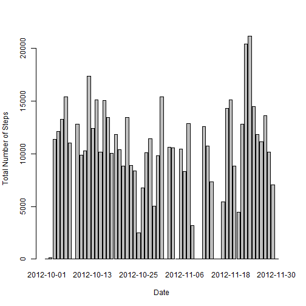
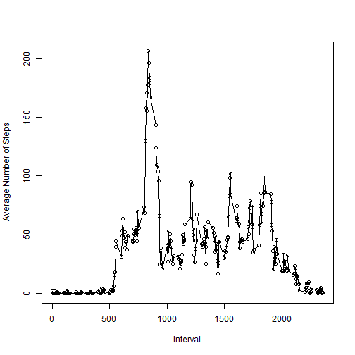
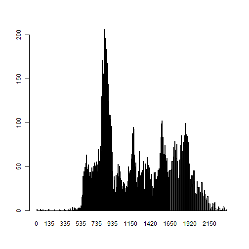
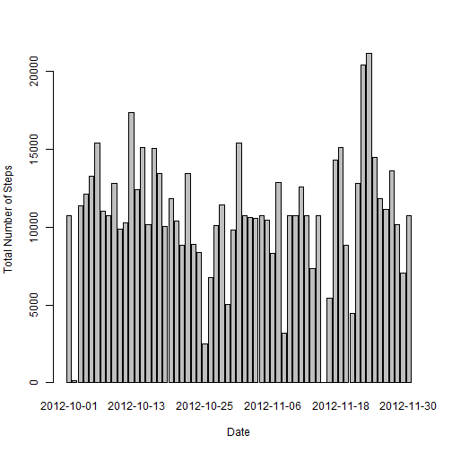

# Reproducible Research: Peer Assessment 1


## Loading and preprocessing the data


```r
activityData <- read.csv("activity.csv")
head(activityData)
```

```
##   steps       date interval
## 1    NA 2012-10-01        0
## 2    NA 2012-10-01        5
## 3    NA 2012-10-01       10
## 4    NA 2012-10-01       15
## 5    NA 2012-10-01       20
## 6    NA 2012-10-01       25
```


## What is mean and median of total number of steps taken per day?
### First Plotting the total number of steps per day against dates

```r
totalStepsByDate <- tapply(activityData$steps, activityData$date, FUN = sum, 
    na.rm = TRUE)
barplot(totalStepsByDate, xlab = "Date", ylab = "Total Number of Steps")
```

 

```r
png(filename = "TotalStepsVsDate")
```

### Now finding the mean and the median of the total number of steps taken per day

```r
averageNumberOfStepsPerDay <- mean(totalStepsByDate)
averageNumberOfStepsPerDay
```

```
## [1] 9354
```

```r
medianNumberOfStepsPerDay <- median(totalStepsByDate)
medianNumberOfStepsPerDay
```

```
## [1] 10395
```


## What is the average daily activity pattern?
### First plotting the average number of steps by period

```r
averageNumberOfStepsPerPeriod <- tapply(activityData$steps, INDEX = activityData$interval, 
    FUN = mean, na.rm = TRUE)

plot(names(averageNumberOfStepsPerPeriod), averageNumberOfStepsPerPeriod, xlab = "Interval", 
    ylab = "Average Number of Steps")

lines(names(averageNumberOfStepsPerPeriod), averageNumberOfStepsPerPeriod)
```

 

```r

# Now plotting a time series Histogram for a different visualization
barplot(averageNumberOfStepsPerPeriod)
```

 

### Now calculating the period with the greatest number of steps

```r
periodWithHighestAvgSteps <- names(which.max(averageNumberOfStepsPerPeriod))
periodWithHighestAvgSteps
```

```
## [1] "835"
```


## Imputing missing values

### Calculating the number of records with missing "steps"" values

```r
moOfRecordsWithMissingSteps <- nrow(activityData) - nrow(activityData[complete.cases(activityData), 
    ])
moOfRecordsWithMissingSteps
```

```
## [1] 2304
```

### Now imputing the missing values using the strategy defined as follows:
### The missing "steps" value for a specific period is the average (mean) value of all the "steps" for that particular period

```r
activityDataWithNARemoved <- data.frame()
activityDataWithNAFilled <- data.frame()
library(plyr)
```

```
## Warning: package 'plyr' was built under R version 3.0.3
```

```r
activityDataWithNaRemoved <- activityData[which(activityData$steps != "NA"), 
    ]
avg_by_interval <- ddply(activityDataWithNaRemoved, .(interval), summarise, 
    steps = mean(steps))
activityDataWithNAFilled <- merge(x = activityData, y = avg_by_interval, by.x = "interval", 
    by.y = "interval", all = TRUE)
activityDataWithNAFilled <- arrange(activityDataWithNAFilled, date)
for (i in 1:nrow(x = activityDataWithNAFilled)) {
    record <- activityDataWithNAFilled[i, ]
    if (is.na(x = record$steps.x)) {
        activityDataWithNAFilled[i, ]$steps.x <- activityDataWithNAFilled[i, 
            ]$steps.y
    }
}
```

### Now creating a histo gram using the data with no NAs

```r
modifiedTotalStepsByDate <- tapply(activityDataWithNAFilled$steps.x, activityDataWithNAFilled$date, 
    FUN = sum)
barplot(modifiedTotalStepsByDate, xlab = "Date", ylab = "Total Number of Steps")
```

 

### Now calculating the mean and median with the new set of data

```r
averageNumberOfStepsPerDay <- mean(modifiedTotalStepsByDate)
averageNumberOfStepsPerDay
```

```
## [1] 10766
```

```r
medianNumberOfStepsPerDay <- median(modifiedTotalStepsByDate)
medianNumberOfStepsPerDay
```

```
## [1] 10766
```


## Are there differences in activity patterns between weekdays and weekends?
### Adding a new factor variable to the dataset

```r
activityDates <- as.Date(activityData$date)
dayOfTheWeek <- weekdays(activityDates)
activityDataWithNAFilled <- cbind(activityDataWithNAFilled, dayOfTheWeek)

activityDataWithNAFilled
```

```
##       interval   steps.x       date   steps.y dayOfTheWeek
## 1            0   1.71698 2012-10-01   1.71698       Monday
## 2            5   0.33962 2012-10-01   0.33962       Monday
## 3           10   0.13208 2012-10-01   0.13208       Monday
## 4           15   0.15094 2012-10-01   0.15094       Monday
## 5           20   0.07547 2012-10-01   0.07547       Monday
## 6           25   2.09434 2012-10-01   2.09434       Monday
## 7           30   0.52830 2012-10-01   0.52830       Monday
## 8           35   0.86792 2012-10-01   0.86792       Monday
## 9           40   0.00000 2012-10-01   0.00000       Monday
## 10          45   1.47170 2012-10-01   1.47170       Monday
## 11          50   0.30189 2012-10-01   0.30189       Monday
## 12          55   0.13208 2012-10-01   0.13208       Monday
## 13         100   0.32075 2012-10-01   0.32075       Monday
## 14         105   0.67925 2012-10-01   0.67925       Monday
## 15         110   0.15094 2012-10-01   0.15094       Monday
## 16         115   0.33962 2012-10-01   0.33962       Monday
## 17         120   0.00000 2012-10-01   0.00000       Monday
## 18         125   1.11321 2012-10-01   1.11321       Monday
## 19         130   1.83019 2012-10-01   1.83019       Monday
## 20         135   0.16981 2012-10-01   0.16981       Monday
## 21         140   0.16981 2012-10-01   0.16981       Monday
## 22         145   0.37736 2012-10-01   0.37736       Monday
## 23         150   0.26415 2012-10-01   0.26415       Monday
## 24         155   0.00000 2012-10-01   0.00000       Monday
## 25         200   0.00000 2012-10-01   0.00000       Monday
## 26         205   0.00000 2012-10-01   0.00000       Monday
## 27         210   1.13208 2012-10-01   1.13208       Monday
## 28         215   0.00000 2012-10-01   0.00000       Monday
## 29         220   0.00000 2012-10-01   0.00000       Monday
## 30         225   0.13208 2012-10-01   0.13208       Monday
## 31         230   0.00000 2012-10-01   0.00000       Monday
## 32         235   0.22642 2012-10-01   0.22642       Monday
## 33         240   0.00000 2012-10-01   0.00000       Monday
## 34         245   0.00000 2012-10-01   0.00000       Monday
## 35         250   1.54717 2012-10-01   1.54717       Monday
## 36         255   0.94340 2012-10-01   0.94340       Monday
## 37         300   0.00000 2012-10-01   0.00000       Monday
## 38         305   0.00000 2012-10-01   0.00000       Monday
## 39         310   0.00000 2012-10-01   0.00000       Monday
## 40         315   0.00000 2012-10-01   0.00000       Monday
## 41         320   0.20755 2012-10-01   0.20755       Monday
## 42         325   0.62264 2012-10-01   0.62264       Monday
## 43         330   1.62264 2012-10-01   1.62264       Monday
## 44         335   0.58491 2012-10-01   0.58491       Monday
## 45         340   0.49057 2012-10-01   0.49057       Monday
## 46         345   0.07547 2012-10-01   0.07547       Monday
## 47         350   0.00000 2012-10-01   0.00000       Monday
## 48         355   0.00000 2012-10-01   0.00000       Monday
## 49         400   1.18868 2012-10-01   1.18868       Monday
## 50         405   0.94340 2012-10-01   0.94340       Monday
## 51         410   2.56604 2012-10-01   2.56604       Monday
## 52         415   0.00000 2012-10-01   0.00000       Monday
## 53         420   0.33962 2012-10-01   0.33962       Monday
## 54         425   0.35849 2012-10-01   0.35849       Monday
## 55         430   4.11321 2012-10-01   4.11321       Monday
## 56         435   0.66038 2012-10-01   0.66038       Monday
## 57         440   3.49057 2012-10-01   3.49057       Monday
## 58         445   0.83019 2012-10-01   0.83019       Monday
## 59         450   3.11321 2012-10-01   3.11321       Monday
## 60         455   1.11321 2012-10-01   1.11321       Monday
## 61         500   0.00000 2012-10-01   0.00000       Monday
## 62         505   1.56604 2012-10-01   1.56604       Monday
## 63         510   3.00000 2012-10-01   3.00000       Monday
## 64         515   2.24528 2012-10-01   2.24528       Monday
## 65         520   3.32075 2012-10-01   3.32075       Monday
## 66         525   2.96226 2012-10-01   2.96226       Monday
## 67         530   2.09434 2012-10-01   2.09434       Monday
## 68         535   6.05660 2012-10-01   6.05660       Monday
## 69         540  16.01887 2012-10-01  16.01887       Monday
## 70         545  18.33962 2012-10-01  18.33962       Monday
## 71         550  39.45283 2012-10-01  39.45283       Monday
## 72         555  44.49057 2012-10-01  44.49057       Monday
## 73         600  31.49057 2012-10-01  31.49057       Monday
## 74         605  49.26415 2012-10-01  49.26415       Monday
## 75         610  53.77358 2012-10-01  53.77358       Monday
## 76         615  63.45283 2012-10-01  63.45283       Monday
## 77         620  49.96226 2012-10-01  49.96226       Monday
## 78         625  47.07547 2012-10-01  47.07547       Monday
## 79         630  52.15094 2012-10-01  52.15094       Monday
## 80         635  39.33962 2012-10-01  39.33962       Monday
## 81         640  44.01887 2012-10-01  44.01887       Monday
## 82         645  44.16981 2012-10-01  44.16981       Monday
## 83         650  37.35849 2012-10-01  37.35849       Monday
## 84         655  49.03774 2012-10-01  49.03774       Monday
## 85         700  43.81132 2012-10-01  43.81132       Monday
## 86         705  44.37736 2012-10-01  44.37736       Monday
## 87         710  50.50943 2012-10-01  50.50943       Monday
## 88         715  54.50943 2012-10-01  54.50943       Monday
## 89         720  49.92453 2012-10-01  49.92453       Monday
## 90         725  50.98113 2012-10-01  50.98113       Monday
## 91         730  55.67925 2012-10-01  55.67925       Monday
## 92         735  44.32075 2012-10-01  44.32075       Monday
## 93         740  52.26415 2012-10-01  52.26415       Monday
## 94         745  69.54717 2012-10-01  69.54717       Monday
## 95         750  57.84906 2012-10-01  57.84906       Monday
## 96         755  56.15094 2012-10-01  56.15094       Monday
## 97         800  73.37736 2012-10-01  73.37736       Monday
## 98         805  68.20755 2012-10-01  68.20755       Monday
## 99         810 129.43396 2012-10-01 129.43396       Monday
## 100        815 157.52830 2012-10-01 157.52830       Monday
## 101        820 171.15094 2012-10-01 171.15094       Monday
## 102        825 155.39623 2012-10-01 155.39623       Monday
## 103        830 177.30189 2012-10-01 177.30189       Monday
## 104        835 206.16981 2012-10-01 206.16981       Monday
## 105        840 195.92453 2012-10-01 195.92453       Monday
## 106        845 179.56604 2012-10-01 179.56604       Monday
## 107        850 183.39623 2012-10-01 183.39623       Monday
## 108        855 167.01887 2012-10-01 167.01887       Monday
## 109        900 143.45283 2012-10-01 143.45283       Monday
## 110        905 124.03774 2012-10-01 124.03774       Monday
## 111        910 109.11321 2012-10-01 109.11321       Monday
## 112        915 108.11321 2012-10-01 108.11321       Monday
## 113        920 103.71698 2012-10-01 103.71698       Monday
## 114        925  95.96226 2012-10-01  95.96226       Monday
## 115        930  66.20755 2012-10-01  66.20755       Monday
## 116        935  45.22642 2012-10-01  45.22642       Monday
## 117        940  24.79245 2012-10-01  24.79245       Monday
## 118        945  38.75472 2012-10-01  38.75472       Monday
## 119        950  34.98113 2012-10-01  34.98113       Monday
## 120        955  21.05660 2012-10-01  21.05660       Monday
## 121       1000  40.56604 2012-10-01  40.56604       Monday
## 122       1005  26.98113 2012-10-01  26.98113       Monday
## 123       1010  42.41509 2012-10-01  42.41509       Monday
## 124       1015  52.66038 2012-10-01  52.66038       Monday
## 125       1020  38.92453 2012-10-01  38.92453       Monday
## 126       1025  50.79245 2012-10-01  50.79245       Monday
## 127       1030  44.28302 2012-10-01  44.28302       Monday
## 128       1035  37.41509 2012-10-01  37.41509       Monday
## 129       1040  34.69811 2012-10-01  34.69811       Monday
## 130       1045  28.33962 2012-10-01  28.33962       Monday
## 131       1050  25.09434 2012-10-01  25.09434       Monday
## 132       1055  31.94340 2012-10-01  31.94340       Monday
## 133       1100  31.35849 2012-10-01  31.35849       Monday
## 134       1105  29.67925 2012-10-01  29.67925       Monday
## 135       1110  21.32075 2012-10-01  21.32075       Monday
## 136       1115  25.54717 2012-10-01  25.54717       Monday
## 137       1120  28.37736 2012-10-01  28.37736       Monday
## 138       1125  26.47170 2012-10-01  26.47170       Monday
## 139       1130  33.43396 2012-10-01  33.43396       Monday
## 140       1135  49.98113 2012-10-01  49.98113       Monday
## 141       1140  42.03774 2012-10-01  42.03774       Monday
## 142       1145  44.60377 2012-10-01  44.60377       Monday
## 143       1150  46.03774 2012-10-01  46.03774       Monday
## 144       1155  59.18868 2012-10-01  59.18868       Monday
## 145       1200  63.86792 2012-10-01  63.86792       Monday
## 146       1205  87.69811 2012-10-01  87.69811       Monday
## 147       1210  94.84906 2012-10-01  94.84906       Monday
## 148       1215  92.77358 2012-10-01  92.77358       Monday
## 149       1220  63.39623 2012-10-01  63.39623       Monday
## 150       1225  50.16981 2012-10-01  50.16981       Monday
## 151       1230  54.47170 2012-10-01  54.47170       Monday
## 152       1235  32.41509 2012-10-01  32.41509       Monday
## 153       1240  26.52830 2012-10-01  26.52830       Monday
## 154       1245  37.73585 2012-10-01  37.73585       Monday
## 155       1250  45.05660 2012-10-01  45.05660       Monday
## 156       1255  67.28302 2012-10-01  67.28302       Monday
## 157       1300  42.33962 2012-10-01  42.33962       Monday
## 158       1305  39.88679 2012-10-01  39.88679       Monday
## 159       1310  43.26415 2012-10-01  43.26415       Monday
## 160       1315  40.98113 2012-10-01  40.98113       Monday
## 161       1320  46.24528 2012-10-01  46.24528       Monday
## 162       1325  56.43396 2012-10-01  56.43396       Monday
## 163       1330  42.75472 2012-10-01  42.75472       Monday
## 164       1335  25.13208 2012-10-01  25.13208       Monday
## 165       1340  39.96226 2012-10-01  39.96226       Monday
## 166       1345  53.54717 2012-10-01  53.54717       Monday
## 167       1350  47.32075 2012-10-01  47.32075       Monday
## 168       1355  60.81132 2012-10-01  60.81132       Monday
## 169       1400  55.75472 2012-10-01  55.75472       Monday
## 170       1405  51.96226 2012-10-01  51.96226       Monday
## 171       1410  43.58491 2012-10-01  43.58491       Monday
## 172       1415  48.69811 2012-10-01  48.69811       Monday
## 173       1420  35.47170 2012-10-01  35.47170       Monday
## 174       1425  37.54717 2012-10-01  37.54717       Monday
## 175       1430  41.84906 2012-10-01  41.84906       Monday
## 176       1435  27.50943 2012-10-01  27.50943       Monday
## 177       1440  17.11321 2012-10-01  17.11321       Monday
## 178       1445  26.07547 2012-10-01  26.07547       Monday
## 179       1450  43.62264 2012-10-01  43.62264       Monday
## 180       1455  43.77358 2012-10-01  43.77358       Monday
## 181       1500  30.01887 2012-10-01  30.01887       Monday
## 182       1505  36.07547 2012-10-01  36.07547       Monday
## 183       1510  35.49057 2012-10-01  35.49057       Monday
## 184       1515  38.84906 2012-10-01  38.84906       Monday
## 185       1520  45.96226 2012-10-01  45.96226       Monday
## 186       1525  47.75472 2012-10-01  47.75472       Monday
## 187       1530  48.13208 2012-10-01  48.13208       Monday
## 188       1535  65.32075 2012-10-01  65.32075       Monday
## 189       1540  82.90566 2012-10-01  82.90566       Monday
## 190       1545  98.66038 2012-10-01  98.66038       Monday
## 191       1550 102.11321 2012-10-01 102.11321       Monday
## 192       1555  83.96226 2012-10-01  83.96226       Monday
## 193       1600  62.13208 2012-10-01  62.13208       Monday
## 194       1605  64.13208 2012-10-01  64.13208       Monday
## 195       1610  74.54717 2012-10-01  74.54717       Monday
## 196       1615  63.16981 2012-10-01  63.16981       Monday
## 197       1620  56.90566 2012-10-01  56.90566       Monday
## 198       1625  59.77358 2012-10-01  59.77358       Monday
## 199       1630  43.86792 2012-10-01  43.86792       Monday
## 200       1635  38.56604 2012-10-01  38.56604       Monday
## 201       1640  44.66038 2012-10-01  44.66038       Monday
## 202       1645  45.45283 2012-10-01  45.45283       Monday
## 203       1650  46.20755 2012-10-01  46.20755       Monday
## 204       1655  43.67925 2012-10-01  43.67925       Monday
## 205       1700  46.62264 2012-10-01  46.62264       Monday
## 206       1705  56.30189 2012-10-01  56.30189       Monday
## 207       1710  50.71698 2012-10-01  50.71698       Monday
## 208       1715  61.22642 2012-10-01  61.22642       Monday
## 209       1720  72.71698 2012-10-01  72.71698       Monday
## 210       1725  78.94340 2012-10-01  78.94340       Monday
## 211       1730  68.94340 2012-10-01  68.94340       Monday
## 212       1735  59.66038 2012-10-01  59.66038       Monday
## 213       1740  75.09434 2012-10-01  75.09434       Monday
## 214       1745  56.50943 2012-10-01  56.50943       Monday
## 215       1750  34.77358 2012-10-01  34.77358       Monday
## 216       1755  37.45283 2012-10-01  37.45283       Monday
## 217       1800  40.67925 2012-10-01  40.67925       Monday
## 218       1805  58.01887 2012-10-01  58.01887       Monday
## 219       1810  74.69811 2012-10-01  74.69811       Monday
## 220       1815  85.32075 2012-10-01  85.32075       Monday
## 221       1820  59.26415 2012-10-01  59.26415       Monday
## 222       1825  67.77358 2012-10-01  67.77358       Monday
## 223       1830  77.69811 2012-10-01  77.69811       Monday
## 224       1835  74.24528 2012-10-01  74.24528       Monday
## 225       1840  85.33962 2012-10-01  85.33962       Monday
## 226       1845  99.45283 2012-10-01  99.45283       Monday
## 227       1850  86.58491 2012-10-01  86.58491       Monday
## 228       1855  85.60377 2012-10-01  85.60377       Monday
## 229       1900  84.86792 2012-10-01  84.86792       Monday
## 230       1905  77.83019 2012-10-01  77.83019       Monday
## 231       1910  58.03774 2012-10-01  58.03774       Monday
## 232       1915  53.35849 2012-10-01  53.35849       Monday
## 233       1920  36.32075 2012-10-01  36.32075       Monday
## 234       1925  20.71698 2012-10-01  20.71698       Monday
## 235       1930  27.39623 2012-10-01  27.39623       Monday
## 236       1935  40.01887 2012-10-01  40.01887       Monday
## 237       1940  30.20755 2012-10-01  30.20755       Monday
## 238       1945  25.54717 2012-10-01  25.54717       Monday
## 239       1950  45.66038 2012-10-01  45.66038       Monday
## 240       1955  33.52830 2012-10-01  33.52830       Monday
## 241       2000  19.62264 2012-10-01  19.62264       Monday
## 242       2005  19.01887 2012-10-01  19.01887       Monday
## 243       2010  19.33962 2012-10-01  19.33962       Monday
## 244       2015  33.33962 2012-10-01  33.33962       Monday
## 245       2020  26.81132 2012-10-01  26.81132       Monday
## 246       2025  21.16981 2012-10-01  21.16981       Monday
## 247       2030  27.30189 2012-10-01  27.30189       Monday
## 248       2035  21.33962 2012-10-01  21.33962       Monday
## 249       2040  19.54717 2012-10-01  19.54717       Monday
## 250       2045  21.32075 2012-10-01  21.32075       Monday
## 251       2050  32.30189 2012-10-01  32.30189       Monday
## 252       2055  20.15094 2012-10-01  20.15094       Monday
## 253       2100  15.94340 2012-10-01  15.94340       Monday
## 254       2105  17.22642 2012-10-01  17.22642       Monday
## 255       2110  23.45283 2012-10-01  23.45283       Monday
## 256       2115  19.24528 2012-10-01  19.24528       Monday
## 257       2120  12.45283 2012-10-01  12.45283       Monday
## 258       2125   8.01887 2012-10-01   8.01887       Monday
## 259       2130  14.66038 2012-10-01  14.66038       Monday
## 260       2135  16.30189 2012-10-01  16.30189       Monday
## 261       2140   8.67925 2012-10-01   8.67925       Monday
## 262       2145   7.79245 2012-10-01   7.79245       Monday
## 263       2150   8.13208 2012-10-01   8.13208       Monday
## 264       2155   2.62264 2012-10-01   2.62264       Monday
## 265       2200   1.45283 2012-10-01   1.45283       Monday
## 266       2205   3.67925 2012-10-01   3.67925       Monday
## 267       2210   4.81132 2012-10-01   4.81132       Monday
## 268       2215   8.50943 2012-10-01   8.50943       Monday
## 269       2220   7.07547 2012-10-01   7.07547       Monday
## 270       2225   8.69811 2012-10-01   8.69811       Monday
## 271       2230   9.75472 2012-10-01   9.75472       Monday
## 272       2235   2.20755 2012-10-01   2.20755       Monday
## 273       2240   0.32075 2012-10-01   0.32075       Monday
## 274       2245   0.11321 2012-10-01   0.11321       Monday
## 275       2250   1.60377 2012-10-01   1.60377       Monday
## 276       2255   4.60377 2012-10-01   4.60377       Monday
## 277       2300   3.30189 2012-10-01   3.30189       Monday
## 278       2305   2.84906 2012-10-01   2.84906       Monday
## 279       2310   0.00000 2012-10-01   0.00000       Monday
## 280       2315   0.83019 2012-10-01   0.83019       Monday
## 281       2320   0.96226 2012-10-01   0.96226       Monday
## 282       2325   1.58491 2012-10-01   1.58491       Monday
## 283       2330   2.60377 2012-10-01   2.60377       Monday
## 284       2335   4.69811 2012-10-01   4.69811       Monday
## 285       2340   3.30189 2012-10-01   3.30189       Monday
## 286       2345   0.64151 2012-10-01   0.64151       Monday
## 287       2350   0.22642 2012-10-01   0.22642       Monday
## 288       2355   1.07547 2012-10-01   1.07547       Monday
## 289          0   0.00000 2012-10-02   1.71698      Tuesday
## 290          5   0.00000 2012-10-02   0.33962      Tuesday
## 291         10   0.00000 2012-10-02   0.13208      Tuesday
## 292         15   0.00000 2012-10-02   0.15094      Tuesday
## 293         20   0.00000 2012-10-02   0.07547      Tuesday
## 294         25   0.00000 2012-10-02   2.09434      Tuesday
## 295         30   0.00000 2012-10-02   0.52830      Tuesday
## 296         35   0.00000 2012-10-02   0.86792      Tuesday
## 297         40   0.00000 2012-10-02   0.00000      Tuesday
## 298         45   0.00000 2012-10-02   1.47170      Tuesday
## 299         50   0.00000 2012-10-02   0.30189      Tuesday
## 300         55   0.00000 2012-10-02   0.13208      Tuesday
## 301        100   0.00000 2012-10-02   0.32075      Tuesday
## 302        105   0.00000 2012-10-02   0.67925      Tuesday
## 303        110   0.00000 2012-10-02   0.15094      Tuesday
## 304        115   0.00000 2012-10-02   0.33962      Tuesday
## 305        120   0.00000 2012-10-02   0.00000      Tuesday
## 306        125   0.00000 2012-10-02   1.11321      Tuesday
## 307        130   0.00000 2012-10-02   1.83019      Tuesday
## 308        135   0.00000 2012-10-02   0.16981      Tuesday
## 309        140   0.00000 2012-10-02   0.16981      Tuesday
## 310        145   0.00000 2012-10-02   0.37736      Tuesday
## 311        150   0.00000 2012-10-02   0.26415      Tuesday
## 312        155   0.00000 2012-10-02   0.00000      Tuesday
## 313        200   0.00000 2012-10-02   0.00000      Tuesday
## 314        205   0.00000 2012-10-02   0.00000      Tuesday
## 315        210   0.00000 2012-10-02   1.13208      Tuesday
## 316        215   0.00000 2012-10-02   0.00000      Tuesday
## 317        220   0.00000 2012-10-02   0.00000      Tuesday
## 318        225   0.00000 2012-10-02   0.13208      Tuesday
## 319        230   0.00000 2012-10-02   0.00000      Tuesday
## 320        235   0.00000 2012-10-02   0.22642      Tuesday
## 321        240   0.00000 2012-10-02   0.00000      Tuesday
## 322        245   0.00000 2012-10-02   0.00000      Tuesday
## 323        250   0.00000 2012-10-02   1.54717      Tuesday
## 324        255   0.00000 2012-10-02   0.94340      Tuesday
## 325        300   0.00000 2012-10-02   0.00000      Tuesday
## 326        305   0.00000 2012-10-02   0.00000      Tuesday
## 327        310   0.00000 2012-10-02   0.00000      Tuesday
## 328        315   0.00000 2012-10-02   0.00000      Tuesday
## 329        320   0.00000 2012-10-02   0.20755      Tuesday
## 330        325   0.00000 2012-10-02   0.62264      Tuesday
## 331        330   0.00000 2012-10-02   1.62264      Tuesday
## 332        335   0.00000 2012-10-02   0.58491      Tuesday
## 333        340   0.00000 2012-10-02   0.49057      Tuesday
## 334        345   0.00000 2012-10-02   0.07547      Tuesday
## 335        350   0.00000 2012-10-02   0.00000      Tuesday
## 336        355   0.00000 2012-10-02   0.00000      Tuesday
## 337        400   0.00000 2012-10-02   1.18868      Tuesday
## 338        405   0.00000 2012-10-02   0.94340      Tuesday
## 339        410   0.00000 2012-10-02   2.56604      Tuesday
## 340        415   0.00000 2012-10-02   0.00000      Tuesday
## 341        420   0.00000 2012-10-02   0.33962      Tuesday
## 342        425   0.00000 2012-10-02   0.35849      Tuesday
## 343        430   0.00000 2012-10-02   4.11321      Tuesday
## 344        435   0.00000 2012-10-02   0.66038      Tuesday
## 345        440   0.00000 2012-10-02   3.49057      Tuesday
## 346        445   0.00000 2012-10-02   0.83019      Tuesday
## 347        450   0.00000 2012-10-02   3.11321      Tuesday
## 348        455   0.00000 2012-10-02   1.11321      Tuesday
## 349        500   0.00000 2012-10-02   0.00000      Tuesday
## 350        505   0.00000 2012-10-02   1.56604      Tuesday
## 351        510   0.00000 2012-10-02   3.00000      Tuesday
## 352        515   0.00000 2012-10-02   2.24528      Tuesday
## 353        520   0.00000 2012-10-02   3.32075      Tuesday
## 354        525   0.00000 2012-10-02   2.96226      Tuesday
## 355        530   0.00000 2012-10-02   2.09434      Tuesday
## 356        535   0.00000 2012-10-02   6.05660      Tuesday
## 357        540   0.00000 2012-10-02  16.01887      Tuesday
## 358        545   0.00000 2012-10-02  18.33962      Tuesday
## 359        550   0.00000 2012-10-02  39.45283      Tuesday
## 360        555   0.00000 2012-10-02  44.49057      Tuesday
## 361        600   0.00000 2012-10-02  31.49057      Tuesday
## 362        605   0.00000 2012-10-02  49.26415      Tuesday
## 363        610   0.00000 2012-10-02  53.77358      Tuesday
## 364        615   0.00000 2012-10-02  63.45283      Tuesday
## 365        620   0.00000 2012-10-02  49.96226      Tuesday
## 366        625   0.00000 2012-10-02  47.07547      Tuesday
## 367        630   0.00000 2012-10-02  52.15094      Tuesday
## 368        635   0.00000 2012-10-02  39.33962      Tuesday
## 369        640   0.00000 2012-10-02  44.01887      Tuesday
## 370        645   0.00000 2012-10-02  44.16981      Tuesday
## 371        650   0.00000 2012-10-02  37.35849      Tuesday
## 372        655   0.00000 2012-10-02  49.03774      Tuesday
## 373        700   0.00000 2012-10-02  43.81132      Tuesday
## 374        705   0.00000 2012-10-02  44.37736      Tuesday
## 375        710   0.00000 2012-10-02  50.50943      Tuesday
## 376        715   0.00000 2012-10-02  54.50943      Tuesday
## 377        720   0.00000 2012-10-02  49.92453      Tuesday
## 378        725   0.00000 2012-10-02  50.98113      Tuesday
## 379        730   0.00000 2012-10-02  55.67925      Tuesday
## 380        735   0.00000 2012-10-02  44.32075      Tuesday
## 381        740   0.00000 2012-10-02  52.26415      Tuesday
## 382        745   0.00000 2012-10-02  69.54717      Tuesday
## 383        750   0.00000 2012-10-02  57.84906      Tuesday
## 384        755   0.00000 2012-10-02  56.15094      Tuesday
## 385        800   0.00000 2012-10-02  73.37736      Tuesday
## 386        805   0.00000 2012-10-02  68.20755      Tuesday
## 387        810   0.00000 2012-10-02 129.43396      Tuesday
## 388        815   0.00000 2012-10-02 157.52830      Tuesday
## 389        820   0.00000 2012-10-02 171.15094      Tuesday
## 390        825   0.00000 2012-10-02 155.39623      Tuesday
## 391        830   0.00000 2012-10-02 177.30189      Tuesday
## 392        835   0.00000 2012-10-02 206.16981      Tuesday
## 393        840   0.00000 2012-10-02 195.92453      Tuesday
## 394        845   0.00000 2012-10-02 179.56604      Tuesday
## 395        850   0.00000 2012-10-02 183.39623      Tuesday
## 396        855   0.00000 2012-10-02 167.01887      Tuesday
## 397        900   0.00000 2012-10-02 143.45283      Tuesday
## 398        905   0.00000 2012-10-02 124.03774      Tuesday
## 399        910   0.00000 2012-10-02 109.11321      Tuesday
## 400        915   0.00000 2012-10-02 108.11321      Tuesday
## 401        920   0.00000 2012-10-02 103.71698      Tuesday
## 402        925   0.00000 2012-10-02  95.96226      Tuesday
## 403        930   0.00000 2012-10-02  66.20755      Tuesday
## 404        935   0.00000 2012-10-02  45.22642      Tuesday
## 405        940   0.00000 2012-10-02  24.79245      Tuesday
## 406        945   0.00000 2012-10-02  38.75472      Tuesday
## 407        950   0.00000 2012-10-02  34.98113      Tuesday
## 408        955   0.00000 2012-10-02  21.05660      Tuesday
## 409       1000   0.00000 2012-10-02  40.56604      Tuesday
## 410       1005   0.00000 2012-10-02  26.98113      Tuesday
## 411       1010   0.00000 2012-10-02  42.41509      Tuesday
## 412       1015   0.00000 2012-10-02  52.66038      Tuesday
## 413       1020   0.00000 2012-10-02  38.92453      Tuesday
## 414       1025   0.00000 2012-10-02  50.79245      Tuesday
## 415       1030   0.00000 2012-10-02  44.28302      Tuesday
## 416       1035   0.00000 2012-10-02  37.41509      Tuesday
## 417       1040   0.00000 2012-10-02  34.69811      Tuesday
## 418       1045   0.00000 2012-10-02  28.33962      Tuesday
## 419       1050   0.00000 2012-10-02  25.09434      Tuesday
## 420       1055   0.00000 2012-10-02  31.94340      Tuesday
## 421       1100   0.00000 2012-10-02  31.35849      Tuesday
## 422       1105   0.00000 2012-10-02  29.67925      Tuesday
## 423       1110   0.00000 2012-10-02  21.32075      Tuesday
## 424       1115   0.00000 2012-10-02  25.54717      Tuesday
## 425       1120   0.00000 2012-10-02  28.37736      Tuesday
## 426       1125   0.00000 2012-10-02  26.47170      Tuesday
## 427       1130   0.00000 2012-10-02  33.43396      Tuesday
## 428       1135   0.00000 2012-10-02  49.98113      Tuesday
## 429       1140   0.00000 2012-10-02  42.03774      Tuesday
## 430       1145   0.00000 2012-10-02  44.60377      Tuesday
## 431       1150   0.00000 2012-10-02  46.03774      Tuesday
## 432       1155   0.00000 2012-10-02  59.18868      Tuesday
## 433       1200   0.00000 2012-10-02  63.86792      Tuesday
## 434       1205   0.00000 2012-10-02  87.69811      Tuesday
## 435       1210   0.00000 2012-10-02  94.84906      Tuesday
## 436       1215   0.00000 2012-10-02  92.77358      Tuesday
## 437       1220   0.00000 2012-10-02  63.39623      Tuesday
## 438       1225   0.00000 2012-10-02  50.16981      Tuesday
## 439       1230   0.00000 2012-10-02  54.47170      Tuesday
## 440       1235   0.00000 2012-10-02  32.41509      Tuesday
## 441       1240   0.00000 2012-10-02  26.52830      Tuesday
## 442       1245   0.00000 2012-10-02  37.73585      Tuesday
## 443       1250   0.00000 2012-10-02  45.05660      Tuesday
## 444       1255   0.00000 2012-10-02  67.28302      Tuesday
## 445       1300   0.00000 2012-10-02  42.33962      Tuesday
## 446       1305   0.00000 2012-10-02  39.88679      Tuesday
## 447       1310   0.00000 2012-10-02  43.26415      Tuesday
## 448       1315   0.00000 2012-10-02  40.98113      Tuesday
## 449       1320   0.00000 2012-10-02  46.24528      Tuesday
## 450       1325   0.00000 2012-10-02  56.43396      Tuesday
## 451       1330   0.00000 2012-10-02  42.75472      Tuesday
## 452       1335   0.00000 2012-10-02  25.13208      Tuesday
## 453       1340   0.00000 2012-10-02  39.96226      Tuesday
## 454       1345   0.00000 2012-10-02  53.54717      Tuesday
## 455       1350   0.00000 2012-10-02  47.32075      Tuesday
## 456       1355   0.00000 2012-10-02  60.81132      Tuesday
## 457       1400   0.00000 2012-10-02  55.75472      Tuesday
## 458       1405   0.00000 2012-10-02  51.96226      Tuesday
## 459       1410   0.00000 2012-10-02  43.58491      Tuesday
## 460       1415   0.00000 2012-10-02  48.69811      Tuesday
## 461       1420   0.00000 2012-10-02  35.47170      Tuesday
## 462       1425   0.00000 2012-10-02  37.54717      Tuesday
## 463       1430   0.00000 2012-10-02  41.84906      Tuesday
## 464       1435   0.00000 2012-10-02  27.50943      Tuesday
## 465       1440   0.00000 2012-10-02  17.11321      Tuesday
## 466       1445   0.00000 2012-10-02  26.07547      Tuesday
## 467       1450   0.00000 2012-10-02  43.62264      Tuesday
## 468       1455   0.00000 2012-10-02  43.77358      Tuesday
## 469       1500   0.00000 2012-10-02  30.01887      Tuesday
## 470       1505   0.00000 2012-10-02  36.07547      Tuesday
## 471       1510   0.00000 2012-10-02  35.49057      Tuesday
## 472       1515   0.00000 2012-10-02  38.84906      Tuesday
## 473       1520   0.00000 2012-10-02  45.96226      Tuesday
## 474       1525   0.00000 2012-10-02  47.75472      Tuesday
## 475       1530   0.00000 2012-10-02  48.13208      Tuesday
## 476       1535   0.00000 2012-10-02  65.32075      Tuesday
## 477       1540   0.00000 2012-10-02  82.90566      Tuesday
## 478       1545   0.00000 2012-10-02  98.66038      Tuesday
## 479       1550   0.00000 2012-10-02 102.11321      Tuesday
## 480       1555   0.00000 2012-10-02  83.96226      Tuesday
## 481       1600   0.00000 2012-10-02  62.13208      Tuesday
## 482       1605   0.00000 2012-10-02  64.13208      Tuesday
## 483       1610   0.00000 2012-10-02  74.54717      Tuesday
## 484       1615   0.00000 2012-10-02  63.16981      Tuesday
## 485       1620   0.00000 2012-10-02  56.90566      Tuesday
## 486       1625   0.00000 2012-10-02  59.77358      Tuesday
## 487       1630   0.00000 2012-10-02  43.86792      Tuesday
## 488       1635   0.00000 2012-10-02  38.56604      Tuesday
## 489       1640   0.00000 2012-10-02  44.66038      Tuesday
## 490       1645   0.00000 2012-10-02  45.45283      Tuesday
## 491       1650   0.00000 2012-10-02  46.20755      Tuesday
## 492       1655   0.00000 2012-10-02  43.67925      Tuesday
## 493       1700   0.00000 2012-10-02  46.62264      Tuesday
## 494       1705   0.00000 2012-10-02  56.30189      Tuesday
## 495       1710   0.00000 2012-10-02  50.71698      Tuesday
## 496       1715   0.00000 2012-10-02  61.22642      Tuesday
## 497       1720   0.00000 2012-10-02  72.71698      Tuesday
## 498       1725   0.00000 2012-10-02  78.94340      Tuesday
## 499       1730   0.00000 2012-10-02  68.94340      Tuesday
## 500       1735   0.00000 2012-10-02  59.66038      Tuesday
## 501       1740   0.00000 2012-10-02  75.09434      Tuesday
## 502       1745   0.00000 2012-10-02  56.50943      Tuesday
## 503       1750   0.00000 2012-10-02  34.77358      Tuesday
## 504       1755   0.00000 2012-10-02  37.45283      Tuesday
## 505       1800   0.00000 2012-10-02  40.67925      Tuesday
## 506       1805   0.00000 2012-10-02  58.01887      Tuesday
## 507       1810   0.00000 2012-10-02  74.69811      Tuesday
## 508       1815   0.00000 2012-10-02  85.32075      Tuesday
## 509       1820   0.00000 2012-10-02  59.26415      Tuesday
## 510       1825   0.00000 2012-10-02  67.77358      Tuesday
## 511       1830   0.00000 2012-10-02  77.69811      Tuesday
## 512       1835   0.00000 2012-10-02  74.24528      Tuesday
## 513       1840   0.00000 2012-10-02  85.33962      Tuesday
## 514       1845   0.00000 2012-10-02  99.45283      Tuesday
## 515       1850   0.00000 2012-10-02  86.58491      Tuesday
## 516       1855   0.00000 2012-10-02  85.60377      Tuesday
## 517       1900   0.00000 2012-10-02  84.86792      Tuesday
## 518       1905   0.00000 2012-10-02  77.83019      Tuesday
## 519       1910   0.00000 2012-10-02  58.03774      Tuesday
## 520       1915   0.00000 2012-10-02  53.35849      Tuesday
## 521       1920   0.00000 2012-10-02  36.32075      Tuesday
## 522       1925   0.00000 2012-10-02  20.71698      Tuesday
## 523       1930   0.00000 2012-10-02  27.39623      Tuesday
## 524       1935   0.00000 2012-10-02  40.01887      Tuesday
## 525       1940   0.00000 2012-10-02  30.20755      Tuesday
## 526       1945   0.00000 2012-10-02  25.54717      Tuesday
## 527       1950   0.00000 2012-10-02  45.66038      Tuesday
## 528       1955   0.00000 2012-10-02  33.52830      Tuesday
## 529       2000   0.00000 2012-10-02  19.62264      Tuesday
## 530       2005   0.00000 2012-10-02  19.01887      Tuesday
## 531       2010   0.00000 2012-10-02  19.33962      Tuesday
## 532       2015   0.00000 2012-10-02  33.33962      Tuesday
## 533       2020   0.00000 2012-10-02  26.81132      Tuesday
## 534       2025   0.00000 2012-10-02  21.16981      Tuesday
## 535       2030   0.00000 2012-10-02  27.30189      Tuesday
## 536       2035   0.00000 2012-10-02  21.33962      Tuesday
## 537       2040   0.00000 2012-10-02  19.54717      Tuesday
## 538       2045   0.00000 2012-10-02  21.32075      Tuesday
## 539       2050   0.00000 2012-10-02  32.30189      Tuesday
## 540       2055   0.00000 2012-10-02  20.15094      Tuesday
## 541       2100   0.00000 2012-10-02  15.94340      Tuesday
## 542       2105   0.00000 2012-10-02  17.22642      Tuesday
## 543       2110   0.00000 2012-10-02  23.45283      Tuesday
## 544       2115   0.00000 2012-10-02  19.24528      Tuesday
## 545       2120   0.00000 2012-10-02  12.45283      Tuesday
## 546       2125   0.00000 2012-10-02   8.01887      Tuesday
## 547       2130   0.00000 2012-10-02  14.66038      Tuesday
## 548       2135   0.00000 2012-10-02  16.30189      Tuesday
## 549       2140   0.00000 2012-10-02   8.67925      Tuesday
## 550       2145   0.00000 2012-10-02   7.79245      Tuesday
## 551       2150   0.00000 2012-10-02   8.13208      Tuesday
## 552       2155   0.00000 2012-10-02   2.62264      Tuesday
## 553       2200   0.00000 2012-10-02   1.45283      Tuesday
## 554       2205   0.00000 2012-10-02   3.67925      Tuesday
## 555       2210 117.00000 2012-10-02   4.81132      Tuesday
## 556       2215   9.00000 2012-10-02   8.50943      Tuesday
## 557       2220   0.00000 2012-10-02   7.07547      Tuesday
## 558       2225   0.00000 2012-10-02   8.69811      Tuesday
## 559       2230   0.00000 2012-10-02   9.75472      Tuesday
## 560       2235   0.00000 2012-10-02   2.20755      Tuesday
## 561       2240   0.00000 2012-10-02   0.32075      Tuesday
## 562       2245   0.00000 2012-10-02   0.11321      Tuesday
## 563       2250   0.00000 2012-10-02   1.60377      Tuesday
## 564       2255   0.00000 2012-10-02   4.60377      Tuesday
## 565       2300   0.00000 2012-10-02   3.30189      Tuesday
## 566       2305   0.00000 2012-10-02   2.84906      Tuesday
## 567       2310   0.00000 2012-10-02   0.00000      Tuesday
## 568       2315   0.00000 2012-10-02   0.83019      Tuesday
## 569       2320   0.00000 2012-10-02   0.96226      Tuesday
## 570       2325   0.00000 2012-10-02   1.58491      Tuesday
## 571       2330   0.00000 2012-10-02   2.60377      Tuesday
## 572       2335   0.00000 2012-10-02   4.69811      Tuesday
## 573       2340   0.00000 2012-10-02   3.30189      Tuesday
## 574       2345   0.00000 2012-10-02   0.64151      Tuesday
## 575       2350   0.00000 2012-10-02   0.22642      Tuesday
## 576       2355   0.00000 2012-10-02   1.07547      Tuesday
## 577          0   0.00000 2012-10-03   1.71698    Wednesday
## 578          5   0.00000 2012-10-03   0.33962    Wednesday
## 579         10   0.00000 2012-10-03   0.13208    Wednesday
## 580         15   0.00000 2012-10-03   0.15094    Wednesday
## 581         20   0.00000 2012-10-03   0.07547    Wednesday
## 582         25   0.00000 2012-10-03   2.09434    Wednesday
## 583         30   0.00000 2012-10-03   0.52830    Wednesday
## 584         35   0.00000 2012-10-03   0.86792    Wednesday
## 585         40   0.00000 2012-10-03   0.00000    Wednesday
## 586         45   0.00000 2012-10-03   1.47170    Wednesday
## 587         50   0.00000 2012-10-03   0.30189    Wednesday
## 588         55   0.00000 2012-10-03   0.13208    Wednesday
## 589        100   0.00000 2012-10-03   0.32075    Wednesday
## 590        105   0.00000 2012-10-03   0.67925    Wednesday
## 591        110   0.00000 2012-10-03   0.15094    Wednesday
## 592        115   0.00000 2012-10-03   0.33962    Wednesday
## 593        120   0.00000 2012-10-03   0.00000    Wednesday
## 594        125   0.00000 2012-10-03   1.11321    Wednesday
## 595        130   0.00000 2012-10-03   1.83019    Wednesday
## 596        135   0.00000 2012-10-03   0.16981    Wednesday
## 597        140   0.00000 2012-10-03   0.16981    Wednesday
## 598        145   0.00000 2012-10-03   0.37736    Wednesday
## 599        150   0.00000 2012-10-03   0.26415    Wednesday
## 600        155   0.00000 2012-10-03   0.00000    Wednesday
## 601        200   0.00000 2012-10-03   0.00000    Wednesday
## 602        205   0.00000 2012-10-03   0.00000    Wednesday
## 603        210   0.00000 2012-10-03   1.13208    Wednesday
## 604        215   0.00000 2012-10-03   0.00000    Wednesday
## 605        220   0.00000 2012-10-03   0.00000    Wednesday
## 606        225   0.00000 2012-10-03   0.13208    Wednesday
## 607        230   0.00000 2012-10-03   0.00000    Wednesday
## 608        235   0.00000 2012-10-03   0.22642    Wednesday
## 609        240   0.00000 2012-10-03   0.00000    Wednesday
## 610        245   0.00000 2012-10-03   0.00000    Wednesday
## 611        250   0.00000 2012-10-03   1.54717    Wednesday
## 612        255   0.00000 2012-10-03   0.94340    Wednesday
## 613        300   0.00000 2012-10-03   0.00000    Wednesday
## 614        305   0.00000 2012-10-03   0.00000    Wednesday
## 615        310   0.00000 2012-10-03   0.00000    Wednesday
## 616        315   0.00000 2012-10-03   0.00000    Wednesday
## 617        320   0.00000 2012-10-03   0.20755    Wednesday
## 618        325   0.00000 2012-10-03   0.62264    Wednesday
## 619        330   0.00000 2012-10-03   1.62264    Wednesday
## 620        335   0.00000 2012-10-03   0.58491    Wednesday
## 621        340   0.00000 2012-10-03   0.49057    Wednesday
## 622        345   0.00000 2012-10-03   0.07547    Wednesday
## 623        350   0.00000 2012-10-03   0.00000    Wednesday
## 624        355   0.00000 2012-10-03   0.00000    Wednesday
## 625        400   0.00000 2012-10-03   1.18868    Wednesday
## 626        405   0.00000 2012-10-03   0.94340    Wednesday
## 627        410   4.00000 2012-10-03   2.56604    Wednesday
## 628        415   0.00000 2012-10-03   0.00000    Wednesday
## 629        420   0.00000 2012-10-03   0.33962    Wednesday
## 630        425   0.00000 2012-10-03   0.35849    Wednesday
## 631        430  36.00000 2012-10-03   4.11321    Wednesday
## 632        435   0.00000 2012-10-03   0.66038    Wednesday
## 633        440   0.00000 2012-10-03   3.49057    Wednesday
## 634        445   0.00000 2012-10-03   0.83019    Wednesday
## 635        450   0.00000 2012-10-03   3.11321    Wednesday
## 636        455   0.00000 2012-10-03   1.11321    Wednesday
## 637        500   0.00000 2012-10-03   0.00000    Wednesday
## 638        505   0.00000 2012-10-03   1.56604    Wednesday
## 639        510   0.00000 2012-10-03   3.00000    Wednesday
## 640        515   0.00000 2012-10-03   2.24528    Wednesday
## 641        520   0.00000 2012-10-03   3.32075    Wednesday
## 642        525   0.00000 2012-10-03   2.96226    Wednesday
## 643        530   0.00000 2012-10-03   2.09434    Wednesday
## 644        535  25.00000 2012-10-03   6.05660    Wednesday
## 645        540   0.00000 2012-10-03  16.01887    Wednesday
## 646        545   0.00000 2012-10-03  18.33962    Wednesday
## 647        550  90.00000 2012-10-03  39.45283    Wednesday
## 648        555 411.00000 2012-10-03  44.49057    Wednesday
## 649        600 413.00000 2012-10-03  31.49057    Wednesday
## 650        605 415.00000 2012-10-03  49.26415    Wednesday
## 651        610 519.00000 2012-10-03  53.77358    Wednesday
## 652        615 529.00000 2012-10-03  63.45283    Wednesday
## 653        620 613.00000 2012-10-03  49.96226    Wednesday
## 654        625 562.00000 2012-10-03  47.07547    Wednesday
## 655        630 612.00000 2012-10-03  52.15094    Wednesday
## 656        635 534.00000 2012-10-03  39.33962    Wednesday
## 657        640 323.00000 2012-10-03  44.01887    Wednesday
## 658        645 600.00000 2012-10-03  44.16981    Wednesday
## 659        650 533.00000 2012-10-03  37.35849    Wednesday
## 660        655 251.00000 2012-10-03  49.03774    Wednesday
## 661        700  56.00000 2012-10-03  43.81132    Wednesday
## 662        705   0.00000 2012-10-03  44.37736    Wednesday
## 663        710  32.00000 2012-10-03  50.50943    Wednesday
## 664        715  80.00000 2012-10-03  54.50943    Wednesday
## 665        720  10.00000 2012-10-03  49.92453    Wednesday
## 666        725   9.00000 2012-10-03  50.98113    Wednesday
## 667        730 145.00000 2012-10-03  55.67925    Wednesday
## 668        735  46.00000 2012-10-03  44.32075    Wednesday
## 669        740   0.00000 2012-10-03  52.26415    Wednesday
## 670        745  44.00000 2012-10-03  69.54717    Wednesday
## 671        750 126.00000 2012-10-03  57.84906    Wednesday
## 672        755  42.00000 2012-10-03  56.15094    Wednesday
## 673        800 138.00000 2012-10-03  73.37736    Wednesday
## 674        805  53.00000 2012-10-03  68.20755    Wednesday
## 675        810   0.00000 2012-10-03 129.43396    Wednesday
## 676        815   0.00000 2012-10-03 157.52830    Wednesday
## 677        820  22.00000 2012-10-03 171.15094    Wednesday
## 678        825  57.00000 2012-10-03 155.39623    Wednesday
## 679        830 161.00000 2012-10-03 177.30189    Wednesday
## 680        835  19.00000 2012-10-03 206.16981    Wednesday
## 681        840  15.00000 2012-10-03 195.92453    Wednesday
## 682        845   0.00000 2012-10-03 179.56604    Wednesday
## 683        850  16.00000 2012-10-03 183.39623    Wednesday
## 684        855   0.00000 2012-10-03 167.01887    Wednesday
## 685        900   0.00000 2012-10-03 143.45283    Wednesday
## 686        905   8.00000 2012-10-03 124.03774    Wednesday
## 687        910   0.00000 2012-10-03 109.11321    Wednesday
## 688        915  51.00000 2012-10-03 108.11321    Wednesday
## 689        920 516.00000 2012-10-03 103.71698    Wednesday
## 690        925 245.00000 2012-10-03  95.96226    Wednesday
## 691        930   0.00000 2012-10-03  66.20755    Wednesday
## 692        935 161.00000 2012-10-03  45.22642    Wednesday
## 693        940   7.00000 2012-10-03  24.79245    Wednesday
## 694        945   0.00000 2012-10-03  38.75472    Wednesday
## 695        950   0.00000 2012-10-03  34.98113    Wednesday
## 696        955   0.00000 2012-10-03  21.05660    Wednesday
## 697       1000   0.00000 2012-10-03  40.56604    Wednesday
## 698       1005   0.00000 2012-10-03  26.98113    Wednesday
## 699       1010   0.00000 2012-10-03  42.41509    Wednesday
## 700       1015   0.00000 2012-10-03  52.66038    Wednesday
## 701       1020   0.00000 2012-10-03  38.92453    Wednesday
## 702       1025   0.00000 2012-10-03  50.79245    Wednesday
## 703       1030   0.00000 2012-10-03  44.28302    Wednesday
## 704       1035   0.00000 2012-10-03  37.41509    Wednesday
## 705       1040   0.00000 2012-10-03  34.69811    Wednesday
## 706       1045   0.00000 2012-10-03  28.33962    Wednesday
## 707       1050   0.00000 2012-10-03  25.09434    Wednesday
## 708       1055   0.00000 2012-10-03  31.94340    Wednesday
## 709       1100   0.00000 2012-10-03  31.35849    Wednesday
## 710       1105   0.00000 2012-10-03  29.67925    Wednesday
## 711       1110   0.00000 2012-10-03  21.32075    Wednesday
## 712       1115   0.00000 2012-10-03  25.54717    Wednesday
## 713       1120   0.00000 2012-10-03  28.37736    Wednesday
## 714       1125   0.00000 2012-10-03  26.47170    Wednesday
## 715       1130   0.00000 2012-10-03  33.43396    Wednesday
## 716       1135  72.00000 2012-10-03  49.98113    Wednesday
## 717       1140  73.00000 2012-10-03  42.03774    Wednesday
## 718       1145   0.00000 2012-10-03  44.60377    Wednesday
## 719       1150   0.00000 2012-10-03  46.03774    Wednesday
## 720       1155 116.00000 2012-10-03  59.18868    Wednesday
## 721       1200  97.00000 2012-10-03  63.86792    Wednesday
## 722       1205   0.00000 2012-10-03  87.69811    Wednesday
## 723       1210   0.00000 2012-10-03  94.84906    Wednesday
## 724       1215   0.00000 2012-10-03  92.77358    Wednesday
## 725       1220   0.00000 2012-10-03  63.39623    Wednesday
## 726       1225   0.00000 2012-10-03  50.16981    Wednesday
## 727       1230  15.00000 2012-10-03  54.47170    Wednesday
## 728       1235   0.00000 2012-10-03  32.41509    Wednesday
## 729       1240   0.00000 2012-10-03  26.52830    Wednesday
## 730       1245   0.00000 2012-10-03  37.73585    Wednesday
## 731       1250   0.00000 2012-10-03  45.05660    Wednesday
## 732       1255   0.00000 2012-10-03  67.28302    Wednesday
## 733       1300  80.00000 2012-10-03  42.33962    Wednesday
## 734       1305  69.00000 2012-10-03  39.88679    Wednesday
## 735       1310   0.00000 2012-10-03  43.26415    Wednesday
## 736       1315   0.00000 2012-10-03  40.98113    Wednesday
## 737       1320   0.00000 2012-10-03  46.24528    Wednesday
## 738       1325   0.00000 2012-10-03  56.43396    Wednesday
## 739       1330   0.00000 2012-10-03  42.75472    Wednesday
## 740       1335   0.00000 2012-10-03  25.13208    Wednesday
## 741       1340   0.00000 2012-10-03  39.96226    Wednesday
## 742       1345  99.00000 2012-10-03  53.54717    Wednesday
## 743       1350 100.00000 2012-10-03  47.32075    Wednesday
## 744       1355   0.00000 2012-10-03  60.81132    Wednesday
## 745       1400   0.00000 2012-10-03  55.75472    Wednesday
## 746       1405  33.00000 2012-10-03  51.96226    Wednesday
## 747       1410   0.00000 2012-10-03  43.58491    Wednesday
## 748       1415   0.00000 2012-10-03  48.69811    Wednesday
## 749       1420   7.00000 2012-10-03  35.47170    Wednesday
## 750       1425   0.00000 2012-10-03  37.54717    Wednesday
## 751       1430   0.00000 2012-10-03  41.84906    Wednesday
## 752       1435   0.00000 2012-10-03  27.50943    Wednesday
## 753       1440   0.00000 2012-10-03  17.11321    Wednesday
## 754       1445   0.00000 2012-10-03  26.07547    Wednesday
## 755       1450   0.00000 2012-10-03  43.62264    Wednesday
## 756       1455   0.00000 2012-10-03  43.77358    Wednesday
## 757       1500   0.00000 2012-10-03  30.01887    Wednesday
## 758       1505   0.00000 2012-10-03  36.07547    Wednesday
## 759       1510   0.00000 2012-10-03  35.49057    Wednesday
## 760       1515   0.00000 2012-10-03  38.84906    Wednesday
## 761       1520   0.00000 2012-10-03  45.96226    Wednesday
## 762       1525   0.00000 2012-10-03  47.75472    Wednesday
## 763       1530   0.00000 2012-10-03  48.13208    Wednesday
## 764       1535   0.00000 2012-10-03  65.32075    Wednesday
## 765       1540   0.00000 2012-10-03  82.90566    Wednesday
## 766       1545  88.00000 2012-10-03  98.66038    Wednesday
## 767       1550 154.00000 2012-10-03 102.11321    Wednesday
## 768       1555   0.00000 2012-10-03  83.96226    Wednesday
## 769       1600  20.00000 2012-10-03  62.13208    Wednesday
## 770       1605   0.00000 2012-10-03  64.13208    Wednesday
## 771       1610   0.00000 2012-10-03  74.54717    Wednesday
## 772       1615   0.00000 2012-10-03  63.16981    Wednesday
## 773       1620   0.00000 2012-10-03  56.90566    Wednesday
## 774       1625   0.00000 2012-10-03  59.77358    Wednesday
## 775       1630   0.00000 2012-10-03  43.86792    Wednesday
## 776       1635   0.00000 2012-10-03  38.56604    Wednesday
## 777       1640   0.00000 2012-10-03  44.66038    Wednesday
## 778       1645   0.00000 2012-10-03  45.45283    Wednesday
## 779       1650   0.00000 2012-10-03  46.20755    Wednesday
## 780       1655   0.00000 2012-10-03  43.67925    Wednesday
## 781       1700   0.00000 2012-10-03  46.62264    Wednesday
## 782       1705   0.00000 2012-10-03  56.30189    Wednesday
## 783       1710 198.00000 2012-10-03  50.71698    Wednesday
## 784       1715  61.00000 2012-10-03  61.22642    Wednesday
## 785       1720  75.00000 2012-10-03  72.71698    Wednesday
## 786       1725   0.00000 2012-10-03  78.94340    Wednesday
## 787       1730   0.00000 2012-10-03  68.94340    Wednesday
## 788       1735 193.00000 2012-10-03  59.66038    Wednesday
## 789       1740 298.00000 2012-10-03  75.09434    Wednesday
## 790       1745   0.00000 2012-10-03  56.50943    Wednesday
## 791       1750  15.00000 2012-10-03  34.77358    Wednesday
## 792       1755  21.00000 2012-10-03  37.45283    Wednesday
## 793       1800   0.00000 2012-10-03  40.67925    Wednesday
## 794       1805   0.00000 2012-10-03  58.01887    Wednesday
## 795       1810   0.00000 2012-10-03  74.69811    Wednesday
## 796       1815   0.00000 2012-10-03  85.32075    Wednesday
## 797       1820  51.00000 2012-10-03  59.26415    Wednesday
## 798       1825  36.00000 2012-10-03  67.77358    Wednesday
## 799       1830   0.00000 2012-10-03  77.69811    Wednesday
## 800       1835  26.00000 2012-10-03  74.24528    Wednesday
## 801       1840  22.00000 2012-10-03  85.33962    Wednesday
## 802       1845   0.00000 2012-10-03  99.45283    Wednesday
## 803       1850  39.00000 2012-10-03  86.58491    Wednesday
## 804       1855  52.00000 2012-10-03  85.60377    Wednesday
## 805       1900  15.00000 2012-10-03  84.86792    Wednesday
## 806       1905  41.00000 2012-10-03  77.83019    Wednesday
## 807       1910   0.00000 2012-10-03  58.03774    Wednesday
## 808       1915  42.00000 2012-10-03  53.35849    Wednesday
## 809       1920   0.00000 2012-10-03  36.32075    Wednesday
## 810       1925   0.00000 2012-10-03  20.71698    Wednesday
## 811       1930 159.00000 2012-10-03  27.39623    Wednesday
## 812       1935  32.00000 2012-10-03  40.01887    Wednesday
## 813       1940   0.00000 2012-10-03  30.20755    Wednesday
## 814       1945   0.00000 2012-10-03  25.54717    Wednesday
## 815       1950   0.00000 2012-10-03  45.66038    Wednesday
## 816       1955   0.00000 2012-10-03  33.52830    Wednesday
## 817       2000  34.00000 2012-10-03  19.62264    Wednesday
## 818       2005   0.00000 2012-10-03  19.01887    Wednesday
## 819       2010   0.00000 2012-10-03  19.33962    Wednesday
## 820       2015   0.00000 2012-10-03  33.33962    Wednesday
## 821       2020   0.00000 2012-10-03  26.81132    Wednesday
## 822       2025  36.00000 2012-10-03  21.16981    Wednesday
## 823       2030  73.00000 2012-10-03  27.30189    Wednesday
## 824       2035   9.00000 2012-10-03  21.33962    Wednesday
## 825       2040   0.00000 2012-10-03  19.54717    Wednesday
## 826       2045   0.00000 2012-10-03  21.32075    Wednesday
## 827       2050   0.00000 2012-10-03  32.30189    Wednesday
## 828       2055   0.00000 2012-10-03  20.15094    Wednesday
## 829       2100   0.00000 2012-10-03  15.94340    Wednesday
## 830       2105   0.00000 2012-10-03  17.22642    Wednesday
## 831       2110   0.00000 2012-10-03  23.45283    Wednesday
## 832       2115   0.00000 2012-10-03  19.24528    Wednesday
## 833       2120   0.00000 2012-10-03  12.45283    Wednesday
## 834       2125   0.00000 2012-10-03   8.01887    Wednesday
## 835       2130  90.00000 2012-10-03  14.66038    Wednesday
## 836       2135 128.00000 2012-10-03  16.30189    Wednesday
## 837       2140  46.00000 2012-10-03   8.67925    Wednesday
## 838       2145   0.00000 2012-10-03   7.79245    Wednesday
## 839       2150   0.00000 2012-10-03   8.13208    Wednesday
## 840       2155   0.00000 2012-10-03   2.62264    Wednesday
## 841       2200   0.00000 2012-10-03   1.45283    Wednesday
## 842       2205   0.00000 2012-10-03   3.67925    Wednesday
## 843       2210   0.00000 2012-10-03   4.81132    Wednesday
## 844       2215   0.00000 2012-10-03   8.50943    Wednesday
## 845       2220   0.00000 2012-10-03   7.07547    Wednesday
## 846       2225   0.00000 2012-10-03   8.69811    Wednesday
## 847       2230   0.00000 2012-10-03   9.75472    Wednesday
## 848       2235   0.00000 2012-10-03   2.20755    Wednesday
## 849       2240   0.00000 2012-10-03   0.32075    Wednesday
## 850       2245   0.00000 2012-10-03   0.11321    Wednesday
## 851       2250   0.00000 2012-10-03   1.60377    Wednesday
## 852       2255   0.00000 2012-10-03   4.60377    Wednesday
## 853       2300   0.00000 2012-10-03   3.30189    Wednesday
## 854       2305   0.00000 2012-10-03   2.84906    Wednesday
## 855       2310   0.00000 2012-10-03   0.00000    Wednesday
## 856       2315   0.00000 2012-10-03   0.83019    Wednesday
## 857       2320   0.00000 2012-10-03   0.96226    Wednesday
## 858       2325   0.00000 2012-10-03   1.58491    Wednesday
## 859       2330   0.00000 2012-10-03   2.60377    Wednesday
## 860       2335   0.00000 2012-10-03   4.69811    Wednesday
## 861       2340   0.00000 2012-10-03   3.30189    Wednesday
## 862       2345   8.00000 2012-10-03   0.64151    Wednesday
## 863       2350   0.00000 2012-10-03   0.22642    Wednesday
## 864       2355   0.00000 2012-10-03   1.07547    Wednesday
## 865          0  47.00000 2012-10-04   1.71698     Thursday
## 866          5   0.00000 2012-10-04   0.33962     Thursday
## 867         10   0.00000 2012-10-04   0.13208     Thursday
## 868         15   0.00000 2012-10-04   0.15094     Thursday
## 869         20   0.00000 2012-10-04   0.07547     Thursday
## 870         25   0.00000 2012-10-04   2.09434     Thursday
## 871         30   0.00000 2012-10-04   0.52830     Thursday
## 872         35   0.00000 2012-10-04   0.86792     Thursday
## 873         40   0.00000 2012-10-04   0.00000     Thursday
## 874         45   0.00000 2012-10-04   1.47170     Thursday
## 875         50   0.00000 2012-10-04   0.30189     Thursday
## 876         55   0.00000 2012-10-04   0.13208     Thursday
## 877        100   0.00000 2012-10-04   0.32075     Thursday
## 878        105   0.00000 2012-10-04   0.67925     Thursday
## 879        110   0.00000 2012-10-04   0.15094     Thursday
## 880        115   0.00000 2012-10-04   0.33962     Thursday
## 881        120   0.00000 2012-10-04   0.00000     Thursday
## 882        125   0.00000 2012-10-04   1.11321     Thursday
## 883        130   0.00000 2012-10-04   1.83019     Thursday
## 884        135   0.00000 2012-10-04   0.16981     Thursday
## 885        140   0.00000 2012-10-04   0.16981     Thursday
## 886        145   0.00000 2012-10-04   0.37736     Thursday
## 887        150   0.00000 2012-10-04   0.26415     Thursday
## 888        155   0.00000 2012-10-04   0.00000     Thursday
## 889        200   0.00000 2012-10-04   0.00000     Thursday
## 890        205   0.00000 2012-10-04   0.00000     Thursday
## 891        210   0.00000 2012-10-04   1.13208     Thursday
## 892        215   0.00000 2012-10-04   0.00000     Thursday
## 893        220   0.00000 2012-10-04   0.00000     Thursday
## 894        225   0.00000 2012-10-04   0.13208     Thursday
## 895        230   0.00000 2012-10-04   0.00000     Thursday
## 896        235   0.00000 2012-10-04   0.22642     Thursday
## 897        240   0.00000 2012-10-04   0.00000     Thursday
## 898        245   0.00000 2012-10-04   0.00000     Thursday
## 899        250   0.00000 2012-10-04   1.54717     Thursday
## 900        255   0.00000 2012-10-04   0.94340     Thursday
## 901        300   0.00000 2012-10-04   0.00000     Thursday
## 902        305   0.00000 2012-10-04   0.00000     Thursday
## 903        310   0.00000 2012-10-04   0.00000     Thursday
## 904        315   0.00000 2012-10-04   0.00000     Thursday
## 905        320   0.00000 2012-10-04   0.20755     Thursday
## 906        325   0.00000 2012-10-04   0.62264     Thursday
## 907        330   0.00000 2012-10-04   1.62264     Thursday
## 908        335   0.00000 2012-10-04   0.58491     Thursday
## 909        340   0.00000 2012-10-04   0.49057     Thursday
## 910        345   0.00000 2012-10-04   0.07547     Thursday
## 911        350   0.00000 2012-10-04   0.00000     Thursday
## 912        355   0.00000 2012-10-04   0.00000     Thursday
## 913        400   0.00000 2012-10-04   1.18868     Thursday
## 914        405   0.00000 2012-10-04   0.94340     Thursday
## 915        410   0.00000 2012-10-04   2.56604     Thursday
## 916        415   0.00000 2012-10-04   0.00000     Thursday
## 917        420   0.00000 2012-10-04   0.33962     Thursday
## 918        425   0.00000 2012-10-04   0.35849     Thursday
## 919        430   0.00000 2012-10-04   4.11321     Thursday
## 920        435   0.00000 2012-10-04   0.66038     Thursday
## 921        440   0.00000 2012-10-04   3.49057     Thursday
## 922        445   0.00000 2012-10-04   0.83019     Thursday
## 923        450   0.00000 2012-10-04   3.11321     Thursday
## 924        455   0.00000 2012-10-04   1.11321     Thursday
## 925        500   0.00000 2012-10-04   0.00000     Thursday
## 926        505   0.00000 2012-10-04   1.56604     Thursday
## 927        510   7.00000 2012-10-04   3.00000     Thursday
## 928        515  18.00000 2012-10-04   2.24528     Thursday
## 929        520  57.00000 2012-10-04   3.32075     Thursday
## 930        525  40.00000 2012-10-04   2.96226     Thursday
## 931        530   0.00000 2012-10-04   2.09434     Thursday
## 932        535   0.00000 2012-10-04   6.05660     Thursday
## 933        540   0.00000 2012-10-04  16.01887     Thursday
## 934        545   0.00000 2012-10-04  18.33962     Thursday
## 935        550  16.00000 2012-10-04  39.45283     Thursday
## 936        555   1.00000 2012-10-04  44.49057     Thursday
## 937        600   0.00000 2012-10-04  31.49057     Thursday
## 938        605  18.00000 2012-10-04  49.26415     Thursday
## 939        610  20.00000 2012-10-04  53.77358     Thursday
## 940        615  40.00000 2012-10-04  63.45283     Thursday
## 941        620  36.00000 2012-10-04  49.96226     Thursday
## 942        625  17.00000 2012-10-04  47.07547     Thursday
## 943        630  49.00000 2012-10-04  52.15094     Thursday
## 944        635  86.00000 2012-10-04  39.33962     Thursday
## 945        640  49.00000 2012-10-04  44.01887     Thursday
## 946        645   0.00000 2012-10-04  44.16981     Thursday
## 947        650  29.00000 2012-10-04  37.35849     Thursday
## 948        655  59.00000 2012-10-04  49.03774     Thursday
## 949        700   7.00000 2012-10-04  43.81132     Thursday
## 950        705  25.00000 2012-10-04  44.37736     Thursday
## 951        710  30.00000 2012-10-04  50.50943     Thursday
## 952        715  31.00000 2012-10-04  54.50943     Thursday
## 953        720   7.00000 2012-10-04  49.92453     Thursday
## 954        725  18.00000 2012-10-04  50.98113     Thursday
## 955        730 113.00000 2012-10-04  55.67925     Thursday
## 956        735 181.00000 2012-10-04  44.32075     Thursday
## 957        740  87.00000 2012-10-04  52.26415     Thursday
## 958        745   0.00000 2012-10-04  69.54717     Thursday
## 959        750   0.00000 2012-10-04  57.84906     Thursday
## 960        755   0.00000 2012-10-04  56.15094     Thursday
## 961        800  57.00000 2012-10-04  73.37736     Thursday
## 962        805  99.00000 2012-10-04  68.20755     Thursday
## 963        810 507.00000 2012-10-04 129.43396     Thursday
## 964        815 522.00000 2012-10-04 157.52830     Thursday
## 965        820 510.00000 2012-10-04 171.15094     Thursday
## 966        825 519.00000 2012-10-04 155.39623     Thursday
## 967        830 508.00000 2012-10-04 177.30189     Thursday
## 968        835 423.00000 2012-10-04 206.16981     Thursday
## 969        840 499.00000 2012-10-04 195.92453     Thursday
## 970        845 259.00000 2012-10-04 179.56604     Thursday
## 971        850  31.00000 2012-10-04 183.39623     Thursday
## 972        855  17.00000 2012-10-04 167.01887     Thursday
## 973        900   0.00000 2012-10-04 143.45283     Thursday
## 974        905   0.00000 2012-10-04 124.03774     Thursday
## 975        910   0.00000 2012-10-04 109.11321     Thursday
## 976        915   0.00000 2012-10-04 108.11321     Thursday
## 977        920   0.00000 2012-10-04 103.71698     Thursday
## 978        925  17.00000 2012-10-04  95.96226     Thursday
## 979        930   0.00000 2012-10-04  66.20755     Thursday
## 980        935 145.00000 2012-10-04  45.22642     Thursday
## 981        940 453.00000 2012-10-04  24.79245     Thursday
## 982        945 229.00000 2012-10-04  38.75472     Thursday
## 983        950 144.00000 2012-10-04  34.98113     Thursday
## 984        955   0.00000 2012-10-04  21.05660     Thursday
## 985       1000   0.00000 2012-10-04  40.56604     Thursday
## 986       1005   0.00000 2012-10-04  26.98113     Thursday
## 987       1010  82.00000 2012-10-04  42.41509     Thursday
## 988       1015   0.00000 2012-10-04  52.66038     Thursday
## 989       1020   0.00000 2012-10-04  38.92453     Thursday
## 990       1025   0.00000 2012-10-04  50.79245     Thursday
## 991       1030   0.00000 2012-10-04  44.28302     Thursday
## 992       1035   0.00000 2012-10-04  37.41509     Thursday
## 993       1040   0.00000 2012-10-04  34.69811     Thursday
## 994       1045   0.00000 2012-10-04  28.33962     Thursday
## 995       1050   0.00000 2012-10-04  25.09434     Thursday
## 996       1055   0.00000 2012-10-04  31.94340     Thursday
## 997       1100   0.00000 2012-10-04  31.35849     Thursday
## 998       1105   0.00000 2012-10-04  29.67925     Thursday
## 999       1110   0.00000 2012-10-04  21.32075     Thursday
## 1000      1115   0.00000 2012-10-04  25.54717     Thursday
## 1001      1120   0.00000 2012-10-04  28.37736     Thursday
## 1002      1125 180.00000 2012-10-04  26.47170     Thursday
## 1003      1130  21.00000 2012-10-04  33.43396     Thursday
## 1004      1135   0.00000 2012-10-04  49.98113     Thursday
## 1005      1140   0.00000 2012-10-04  42.03774     Thursday
## 1006      1145   0.00000 2012-10-04  44.60377     Thursday
## 1007      1150   0.00000 2012-10-04  46.03774     Thursday
## 1008      1155   0.00000 2012-10-04  59.18868     Thursday
## 1009      1200 160.00000 2012-10-04  63.86792     Thursday
## 1010      1205  79.00000 2012-10-04  87.69811     Thursday
## 1011      1210   0.00000 2012-10-04  94.84906     Thursday
## 1012      1215   0.00000 2012-10-04  92.77358     Thursday
## 1013      1220   0.00000 2012-10-04  63.39623     Thursday
## 1014      1225  46.00000 2012-10-04  50.16981     Thursday
## 1015      1230  66.00000 2012-10-04  54.47170     Thursday
## 1016      1235 127.00000 2012-10-04  32.41509     Thursday
## 1017      1240   0.00000 2012-10-04  26.52830     Thursday
## 1018      1245   0.00000 2012-10-04  37.73585     Thursday
## 1019      1250   0.00000 2012-10-04  45.05660     Thursday
## 1020      1255   0.00000 2012-10-04  67.28302     Thursday
## 1021      1300   0.00000 2012-10-04  42.33962     Thursday
## 1022      1305   0.00000 2012-10-04  39.88679     Thursday
## 1023      1310  31.00000 2012-10-04  43.26415     Thursday
## 1024      1315   0.00000 2012-10-04  40.98113     Thursday
## 1025      1320   0.00000 2012-10-04  46.24528     Thursday
## 1026      1325   0.00000 2012-10-04  56.43396     Thursday
## 1027      1330   0.00000 2012-10-04  42.75472     Thursday
## 1028      1335   0.00000 2012-10-04  25.13208     Thursday
## 1029      1340  28.00000 2012-10-04  39.96226     Thursday
## 1030      1345 496.00000 2012-10-04  53.54717     Thursday
## 1031      1350  78.00000 2012-10-04  47.32075     Thursday
## 1032      1355   0.00000 2012-10-04  60.81132     Thursday
## 1033      1400   0.00000 2012-10-04  55.75472     Thursday
## 1034      1405   0.00000 2012-10-04  51.96226     Thursday
## 1035      1410   0.00000 2012-10-04  43.58491     Thursday
## 1036      1415   0.00000 2012-10-04  48.69811     Thursday
## 1037      1420   0.00000 2012-10-04  35.47170     Thursday
## 1038      1425   0.00000 2012-10-04  37.54717     Thursday
## 1039      1430   0.00000 2012-10-04  41.84906     Thursday
## 1040      1435  77.00000 2012-10-04  27.50943     Thursday
## 1041      1440  20.00000 2012-10-04  17.11321     Thursday
## 1042      1445   7.00000 2012-10-04  26.07547     Thursday
## 1043      1450   1.00000 2012-10-04  43.62264     Thursday
## 1044      1455 128.00000 2012-10-04  43.77358     Thursday
## 1045      1500 354.00000 2012-10-04  30.01887     Thursday
## 1046      1505 310.00000 2012-10-04  36.07547     Thursday
## 1047      1510   0.00000 2012-10-04  35.49057     Thursday
## 1048      1515   0.00000 2012-10-04  38.84906     Thursday
## 1049      1520  25.00000 2012-10-04  45.96226     Thursday
## 1050      1525  15.00000 2012-10-04  47.75472     Thursday
## 1051      1530   0.00000 2012-10-04  48.13208     Thursday
## 1052      1535   0.00000 2012-10-04  65.32075     Thursday
## 1053      1540   0.00000 2012-10-04  82.90566     Thursday
## 1054      1545   0.00000 2012-10-04  98.66038     Thursday
## 1055      1550  33.00000 2012-10-04 102.11321     Thursday
## 1056      1555  33.00000 2012-10-04  83.96226     Thursday
## 1057      1600  32.00000 2012-10-04  62.13208     Thursday
## 1058      1605  66.00000 2012-10-04  64.13208     Thursday
## 1059      1610  77.00000 2012-10-04  74.54717     Thursday
## 1060      1615   0.00000 2012-10-04  63.16981     Thursday
## 1061      1620  44.00000 2012-10-04  56.90566     Thursday
## 1062      1625   0.00000 2012-10-04  59.77358     Thursday
## 1063      1630   0.00000 2012-10-04  43.86792     Thursday
## 1064      1635   0.00000 2012-10-04  38.56604     Thursday
## 1065      1640   0.00000 2012-10-04  44.66038     Thursday
## 1066      1645   0.00000 2012-10-04  45.45283     Thursday
## 1067      1650   0.00000 2012-10-04  46.20755     Thursday
## 1068      1655   0.00000 2012-10-04  43.67925     Thursday
## 1069      1700   0.00000 2012-10-04  46.62264     Thursday
## 1070      1705   0.00000 2012-10-04  56.30189     Thursday
## 1071      1710   0.00000 2012-10-04  50.71698     Thursday
## 1072      1715   0.00000 2012-10-04  61.22642     Thursday
## 1073      1720   0.00000 2012-10-04  72.71698     Thursday
## 1074      1725  40.00000 2012-10-04  78.94340     Thursday
## 1075      1730   0.00000 2012-10-04  68.94340     Thursday
## 1076      1735  37.00000 2012-10-04  59.66038     Thursday
## 1077      1740  90.00000 2012-10-04  75.09434     Thursday
## 1078      1745  53.00000 2012-10-04  56.50943     Thursday
## 1079      1750  73.00000 2012-10-04  34.77358     Thursday
## 1080      1755  92.00000 2012-10-04  37.45283     Thursday
## 1081      1800 285.00000 2012-10-04  40.67925     Thursday
## 1082      1805 527.00000 2012-10-04  58.01887     Thursday
## 1083      1810 531.00000 2012-10-04  74.69811     Thursday
## 1084      1815 547.00000 2012-10-04  85.32075     Thursday
## 1085      1820 175.00000 2012-10-04  59.26415     Thursday
## 1086      1825 114.00000 2012-10-04  67.77358     Thursday
## 1087      1830  62.00000 2012-10-04  77.69811     Thursday
## 1088      1835   0.00000 2012-10-04  74.24528     Thursday
## 1089      1840  59.00000 2012-10-04  85.33962     Thursday
## 1090      1845  65.00000 2012-10-04  99.45283     Thursday
## 1091      1850   0.00000 2012-10-04  86.58491     Thursday
## 1092      1855 101.00000 2012-10-04  85.60377     Thursday
## 1093      1900  43.00000 2012-10-04  84.86792     Thursday
## 1094      1905   0.00000 2012-10-04  77.83019     Thursday
## 1095      1910   0.00000 2012-10-04  58.03774     Thursday
## 1096      1915   0.00000 2012-10-04  53.35849     Thursday
## 1097      1920  49.00000 2012-10-04  36.32075     Thursday
## 1098      1925  21.00000 2012-10-04  20.71698     Thursday
## 1099      1930   0.00000 2012-10-04  27.39623     Thursday
## 1100      1935  16.00000 2012-10-04  40.01887     Thursday
## 1101      1940  56.00000 2012-10-04  30.20755     Thursday
## 1102      1945   0.00000 2012-10-04  25.54717     Thursday
## 1103      1950   0.00000 2012-10-04  45.66038     Thursday
## 1104      1955   0.00000 2012-10-04  33.52830     Thursday
## 1105      2000   0.00000 2012-10-04  19.62264     Thursday
## 1106      2005   0.00000 2012-10-04  19.01887     Thursday
## 1107      2010   0.00000 2012-10-04  19.33962     Thursday
## 1108      2015   0.00000 2012-10-04  33.33962     Thursday
## 1109      2020   0.00000 2012-10-04  26.81132     Thursday
## 1110      2025   0.00000 2012-10-04  21.16981     Thursday
## 1111      2030   0.00000 2012-10-04  27.30189     Thursday
## 1112      2035   0.00000 2012-10-04  21.33962     Thursday
## 1113      2040  17.00000 2012-10-04  19.54717     Thursday
## 1114      2045  15.00000 2012-10-04  21.32075     Thursday
## 1115      2050   0.00000 2012-10-04  32.30189     Thursday
## 1116      2055   0.00000 2012-10-04  20.15094     Thursday
## 1117      2100  27.00000 2012-10-04  15.94340     Thursday
## 1118      2105 106.00000 2012-10-04  17.22642     Thursday
## 1119      2110 122.00000 2012-10-04  23.45283     Thursday
## 1120      2115  41.00000 2012-10-04  19.24528     Thursday
## 1121      2120  35.00000 2012-10-04  12.45283     Thursday
## 1122      2125   6.00000 2012-10-04   8.01887     Thursday
## 1123      2130   0.00000 2012-10-04  14.66038     Thursday
## 1124      2135   0.00000 2012-10-04  16.30189     Thursday
## 1125      2140  68.00000 2012-10-04   8.67925     Thursday
## 1126      2145   0.00000 2012-10-04   7.79245     Thursday
## 1127      2150   0.00000 2012-10-04   8.13208     Thursday
## 1128      2155   0.00000 2012-10-04   2.62264     Thursday
## 1129      2200   0.00000 2012-10-04   1.45283     Thursday
## 1130      2205   0.00000 2012-10-04   3.67925     Thursday
## 1131      2210   0.00000 2012-10-04   4.81132     Thursday
## 1132      2215   0.00000 2012-10-04   8.50943     Thursday
## 1133      2220   0.00000 2012-10-04   7.07547     Thursday
## 1134      2225   0.00000 2012-10-04   8.69811     Thursday
## 1135      2230   0.00000 2012-10-04   9.75472     Thursday
## 1136      2235   0.00000 2012-10-04   2.20755     Thursday
## 1137      2240   0.00000 2012-10-04   0.32075     Thursday
## 1138      2245   0.00000 2012-10-04   0.11321     Thursday
## 1139      2250   0.00000 2012-10-04   1.60377     Thursday
## 1140      2255   0.00000 2012-10-04   4.60377     Thursday
## 1141      2300   0.00000 2012-10-04   3.30189     Thursday
## 1142      2305   0.00000 2012-10-04   2.84906     Thursday
## 1143      2310   0.00000 2012-10-04   0.00000     Thursday
## 1144      2315   0.00000 2012-10-04   0.83019     Thursday
## 1145      2320   0.00000 2012-10-04   0.96226     Thursday
## 1146      2325   0.00000 2012-10-04   1.58491     Thursday
## 1147      2330   0.00000 2012-10-04   2.60377     Thursday
## 1148      2335   0.00000 2012-10-04   4.69811     Thursday
## 1149      2340   0.00000 2012-10-04   3.30189     Thursday
## 1150      2345   0.00000 2012-10-04   0.64151     Thursday
## 1151      2350   0.00000 2012-10-04   0.22642     Thursday
## 1152      2355   0.00000 2012-10-04   1.07547     Thursday
## 1153         0   0.00000 2012-10-05   1.71698       Friday
## 1154         5   0.00000 2012-10-05   0.33962       Friday
## 1155        10   0.00000 2012-10-05   0.13208       Friday
## 1156        15   0.00000 2012-10-05   0.15094       Friday
## 1157        20   0.00000 2012-10-05   0.07547       Friday
## 1158        25   0.00000 2012-10-05   2.09434       Friday
## 1159        30   0.00000 2012-10-05   0.52830       Friday
## 1160        35   0.00000 2012-10-05   0.86792       Friday
## 1161        40   0.00000 2012-10-05   0.00000       Friday
## 1162        45   0.00000 2012-10-05   1.47170       Friday
## 1163        50   0.00000 2012-10-05   0.30189       Friday
## 1164        55   0.00000 2012-10-05   0.13208       Friday
## 1165       100   0.00000 2012-10-05   0.32075       Friday
## 1166       105   0.00000 2012-10-05   0.67925       Friday
## 1167       110   0.00000 2012-10-05   0.15094       Friday
## 1168       115   0.00000 2012-10-05   0.33962       Friday
## 1169       120   0.00000 2012-10-05   0.00000       Friday
## 1170       125   0.00000 2012-10-05   1.11321       Friday
## 1171       130   0.00000 2012-10-05   1.83019       Friday
## 1172       135   0.00000 2012-10-05   0.16981       Friday
## 1173       140   0.00000 2012-10-05   0.16981       Friday
## 1174       145   9.00000 2012-10-05   0.37736       Friday
## 1175       150  14.00000 2012-10-05   0.26415       Friday
## 1176       155   0.00000 2012-10-05   0.00000       Friday
## 1177       200   0.00000 2012-10-05   0.00000       Friday
## 1178       205   0.00000 2012-10-05   0.00000       Friday
## 1179       210   0.00000 2012-10-05   1.13208       Friday
## 1180       215   0.00000 2012-10-05   0.00000       Friday
## 1181       220   0.00000 2012-10-05   0.00000       Friday
## 1182       225   7.00000 2012-10-05   0.13208       Friday
## 1183       230   0.00000 2012-10-05   0.00000       Friday
## 1184       235   0.00000 2012-10-05   0.22642       Friday
## 1185       240   0.00000 2012-10-05   0.00000       Friday
## 1186       245   0.00000 2012-10-05   0.00000       Friday
## 1187       250  27.00000 2012-10-05   1.54717       Friday
## 1188       255   0.00000 2012-10-05   0.94340       Friday
## 1189       300   0.00000 2012-10-05   0.00000       Friday
## 1190       305   0.00000 2012-10-05   0.00000       Friday
## 1191       310   0.00000 2012-10-05   0.00000       Friday
## 1192       315   0.00000 2012-10-05   0.00000       Friday
## 1193       320   0.00000 2012-10-05   0.20755       Friday
## 1194       325   0.00000 2012-10-05   0.62264       Friday
## 1195       330   0.00000 2012-10-05   1.62264       Friday
## 1196       335   0.00000 2012-10-05   0.58491       Friday
## 1197       340   0.00000 2012-10-05   0.49057       Friday
## 1198       345   0.00000 2012-10-05   0.07547       Friday
## 1199       350   0.00000 2012-10-05   0.00000       Friday
## 1200       355   0.00000 2012-10-05   0.00000       Friday
## 1201       400   0.00000 2012-10-05   1.18868       Friday
## 1202       405  39.00000 2012-10-05   0.94340       Friday
## 1203       410   0.00000 2012-10-05   2.56604       Friday
## 1204       415   0.00000 2012-10-05   0.00000       Friday
## 1205       420   0.00000 2012-10-05   0.33962       Friday
## 1206       425   0.00000 2012-10-05   0.35849       Friday
## 1207       430   0.00000 2012-10-05   4.11321       Friday
## 1208       435   0.00000 2012-10-05   0.66038       Friday
## 1209       440   0.00000 2012-10-05   3.49057       Friday
## 1210       445   0.00000 2012-10-05   0.83019       Friday
## 1211       450   0.00000 2012-10-05   3.11321       Friday
## 1212       455   0.00000 2012-10-05   1.11321       Friday
## 1213       500   0.00000 2012-10-05   0.00000       Friday
## 1214       505  27.00000 2012-10-05   1.56604       Friday
## 1215       510   0.00000 2012-10-05   3.00000       Friday
## 1216       515   0.00000 2012-10-05   2.24528       Friday
## 1217       520   0.00000 2012-10-05   3.32075       Friday
## 1218       525   0.00000 2012-10-05   2.96226       Friday
## 1219       530   0.00000 2012-10-05   2.09434       Friday
## 1220       535   0.00000 2012-10-05   6.05660       Friday
## 1221       540   0.00000 2012-10-05  16.01887       Friday
## 1222       545   0.00000 2012-10-05  18.33962       Friday
## 1223       550   0.00000 2012-10-05  39.45283       Friday
## 1224       555  52.00000 2012-10-05  44.49057       Friday
## 1225       600  36.00000 2012-10-05  31.49057       Friday
## 1226       605   0.00000 2012-10-05  49.26415       Friday
## 1227       610   0.00000 2012-10-05  53.77358       Friday
## 1228       615  28.00000 2012-10-05  63.45283       Friday
## 1229       620  67.00000 2012-10-05  49.96226       Friday
## 1230       625 119.00000 2012-10-05  47.07547       Friday
## 1231       630   7.00000 2012-10-05  52.15094       Friday
## 1232       635  21.00000 2012-10-05  39.33962       Friday
## 1233       640  29.00000 2012-10-05  44.01887       Friday
## 1234       645  68.00000 2012-10-05  44.16981       Friday
## 1235       650  29.00000 2012-10-05  37.35849       Friday
## 1236       655   0.00000 2012-10-05  49.03774       Friday
## 1237       700  11.00000 2012-10-05  43.81132       Friday
## 1238       705  19.00000 2012-10-05  44.37736       Friday
## 1239       710  84.00000 2012-10-05  50.50943       Friday
## 1240       715  50.00000 2012-10-05  54.50943       Friday
## 1241       720   2.00000 2012-10-05  49.92453       Friday
## 1242       725  43.00000 2012-10-05  50.98113       Friday
## 1243       730 126.00000 2012-10-05  55.67925       Friday
## 1244       735  30.00000 2012-10-05  44.32075       Friday
## 1245       740  19.00000 2012-10-05  52.26415       Friday
## 1246       745   8.00000 2012-10-05  69.54717       Friday
## 1247       750 171.00000 2012-10-05  57.84906       Friday
## 1248       755  68.00000 2012-10-05  56.15094       Friday
## 1249       800 114.00000 2012-10-05  73.37736       Friday
## 1250       805   0.00000 2012-10-05  68.20755       Friday
## 1251       810   9.00000 2012-10-05 129.43396       Friday
## 1252       815 122.00000 2012-10-05 157.52830       Friday
## 1253       820 400.00000 2012-10-05 171.15094       Friday
## 1254       825 451.00000 2012-10-05 155.39623       Friday
## 1255       830 371.00000 2012-10-05 177.30189       Friday
## 1256       835 470.00000 2012-10-05 206.16981       Friday
## 1257       840 473.00000 2012-10-05 195.92453       Friday
## 1258       845 512.00000 2012-10-05 179.56604       Friday
## 1259       850 449.00000 2012-10-05 183.39623       Friday
## 1260       855 496.00000 2012-10-05 167.01887       Friday
## 1261       900 530.00000 2012-10-05 143.45283       Friday
## 1262       905 509.00000 2012-10-05 124.03774       Friday
## 1263       910 252.00000 2012-10-05 109.11321       Friday
## 1264       915  84.00000 2012-10-05 108.11321       Friday
## 1265       920  16.00000 2012-10-05 103.71698       Friday
## 1266       925   0.00000 2012-10-05  95.96226       Friday
## 1267       930   6.00000 2012-10-05  66.20755       Friday
## 1268       935  46.00000 2012-10-05  45.22642       Friday
## 1269       940  39.00000 2012-10-05  24.79245       Friday
## 1270       945   0.00000 2012-10-05  38.75472       Friday
## 1271       950   0.00000 2012-10-05  34.98113       Friday
## 1272       955   0.00000 2012-10-05  21.05660       Friday
## 1273      1000   0.00000 2012-10-05  40.56604       Friday
## 1274      1005   0.00000 2012-10-05  26.98113       Friday
## 1275      1010   0.00000 2012-10-05  42.41509       Friday
## 1276      1015   0.00000 2012-10-05  52.66038       Friday
## 1277      1020   0.00000 2012-10-05  38.92453       Friday
## 1278      1025   0.00000 2012-10-05  50.79245       Friday
## 1279      1030   0.00000 2012-10-05  44.28302       Friday
## 1280      1035   0.00000 2012-10-05  37.41509       Friday
## 1281      1040   0.00000 2012-10-05  34.69811       Friday
## 1282      1045   0.00000 2012-10-05  28.33962       Friday
## 1283      1050   0.00000 2012-10-05  25.09434       Friday
## 1284      1055   0.00000 2012-10-05  31.94340       Friday
## 1285      1100   0.00000 2012-10-05  31.35849       Friday
## 1286      1105   0.00000 2012-10-05  29.67925       Friday
## 1287      1110   0.00000 2012-10-05  21.32075       Friday
## 1288      1115   0.00000 2012-10-05  25.54717       Friday
## 1289      1120   0.00000 2012-10-05  28.37736       Friday
## 1290      1125   0.00000 2012-10-05  26.47170       Friday
## 1291      1130   0.00000 2012-10-05  33.43396       Friday
## 1292      1135   0.00000 2012-10-05  49.98113       Friday
## 1293      1140   0.00000 2012-10-05  42.03774       Friday
## 1294      1145   0.00000 2012-10-05  44.60377       Friday
## 1295      1150   0.00000 2012-10-05  46.03774       Friday
## 1296      1155   0.00000 2012-10-05  59.18868       Friday
## 1297      1200 138.00000 2012-10-05  63.86792       Friday
## 1298      1205 541.00000 2012-10-05  87.69811       Friday
## 1299      1210 555.00000 2012-10-05  94.84906       Friday
## 1300      1215 345.00000 2012-10-05  92.77358       Friday
## 1301      1220 345.00000 2012-10-05  63.39623       Friday
## 1302      1225  10.00000 2012-10-05  50.16981       Friday
## 1303      1230 485.00000 2012-10-05  54.47170       Friday
## 1304      1235 515.00000 2012-10-05  32.41509       Friday
## 1305      1240 168.00000 2012-10-05  26.52830       Friday
## 1306      1245   0.00000 2012-10-05  37.73585       Friday
## 1307      1250   0.00000 2012-10-05  45.05660       Friday
## 1308      1255   0.00000 2012-10-05  67.28302       Friday
## 1309      1300   0.00000 2012-10-05  42.33962       Friday
## 1310      1305   0.00000 2012-10-05  39.88679       Friday
## 1311      1310   0.00000 2012-10-05  43.26415       Friday
## 1312      1315   0.00000 2012-10-05  40.98113       Friday
## 1313      1320 349.00000 2012-10-05  46.24528       Friday
## 1314      1325 341.00000 2012-10-05  56.43396       Friday
## 1315      1330   0.00000 2012-10-05  42.75472       Friday
## 1316      1335   0.00000 2012-10-05  25.13208       Friday
## 1317      1340   0.00000 2012-10-05  39.96226       Friday
## 1318      1345   0.00000 2012-10-05  53.54717       Friday
## 1319      1350   0.00000 2012-10-05  47.32075       Friday
## 1320      1355 158.00000 2012-10-05  60.81132       Friday
## 1321      1400 545.00000 2012-10-05  55.75472       Friday
## 1322      1405  82.00000 2012-10-05  51.96226       Friday
## 1323      1410   0.00000 2012-10-05  43.58491       Friday
## 1324      1415 105.00000 2012-10-05  48.69811       Friday
## 1325      1420   0.00000 2012-10-05  35.47170       Friday
## 1326      1425   0.00000 2012-10-05  37.54717       Friday
## 1327      1430   0.00000 2012-10-05  41.84906       Friday
## 1328      1435   0.00000 2012-10-05  27.50943       Friday
## 1329      1440   0.00000 2012-10-05  17.11321       Friday
## 1330      1445   0.00000 2012-10-05  26.07547       Friday
## 1331      1450   0.00000 2012-10-05  43.62264       Friday
## 1332      1455   0.00000 2012-10-05  43.77358       Friday
## 1333      1500   0.00000 2012-10-05  30.01887       Friday
## 1334      1505   0.00000 2012-10-05  36.07547       Friday
## 1335      1510   0.00000 2012-10-05  35.49057       Friday
## 1336      1515   0.00000 2012-10-05  38.84906       Friday
## 1337      1520   0.00000 2012-10-05  45.96226       Friday
## 1338      1525   0.00000 2012-10-05  47.75472       Friday
## 1339      1530   0.00000 2012-10-05  48.13208       Friday
## 1340      1535   0.00000 2012-10-05  65.32075       Friday
## 1341      1540 326.00000 2012-10-05  82.90566       Friday
## 1342      1545 172.00000 2012-10-05  98.66038       Friday
## 1343      1550 332.00000 2012-10-05 102.11321       Friday
## 1344      1555 402.00000 2012-10-05  83.96226       Friday
## 1345      1600  70.00000 2012-10-05  62.13208       Friday
## 1346      1605   0.00000 2012-10-05  64.13208       Friday
## 1347      1610   0.00000 2012-10-05  74.54717       Friday
## 1348      1615   0.00000 2012-10-05  63.16981       Friday
## 1349      1620   0.00000 2012-10-05  56.90566       Friday
## 1350      1625   0.00000 2012-10-05  59.77358       Friday
## 1351      1630   0.00000 2012-10-05  43.86792       Friday
## 1352      1635   0.00000 2012-10-05  38.56604       Friday
## 1353      1640   0.00000 2012-10-05  44.66038       Friday
## 1354      1645   0.00000 2012-10-05  45.45283       Friday
## 1355      1650   0.00000 2012-10-05  46.20755       Friday
## 1356      1655   0.00000 2012-10-05  43.67925       Friday
## 1357      1700   0.00000 2012-10-05  46.62264       Friday
## 1358      1705   0.00000 2012-10-05  56.30189       Friday
## 1359      1710   0.00000 2012-10-05  50.71698       Friday
## 1360      1715  53.00000 2012-10-05  61.22642       Friday
## 1361      1720   0.00000 2012-10-05  72.71698       Friday
## 1362      1725   0.00000 2012-10-05  78.94340       Friday
## 1363      1730   0.00000 2012-10-05  68.94340       Friday
## 1364      1735   0.00000 2012-10-05  59.66038       Friday
## 1365      1740   0.00000 2012-10-05  75.09434       Friday
## 1366      1745   0.00000 2012-10-05  56.50943       Friday
## 1367      1750   7.00000 2012-10-05  34.77358       Friday
## 1368      1755  10.00000 2012-10-05  37.45283       Friday
## 1369      1800  65.00000 2012-10-05  40.67925       Friday
## 1370      1805  40.00000 2012-10-05  58.01887       Friday
## 1371      1810  15.00000 2012-10-05  74.69811       Friday
## 1372      1815  29.00000 2012-10-05  85.32075       Friday
## 1373      1820   0.00000 2012-10-05  59.26415       Friday
## 1374      1825  20.00000 2012-10-05  67.77358       Friday
## 1375      1830  35.00000 2012-10-05  77.69811       Friday
## 1376      1835  69.00000 2012-10-05  74.24528       Friday
## 1377      1840  25.00000 2012-10-05  85.33962       Friday
## 1378      1845  46.00000 2012-10-05  99.45283       Friday
## 1379      1850  15.00000 2012-10-05  86.58491       Friday
## 1380      1855  26.00000 2012-10-05  85.60377       Friday
## 1381      1900  33.00000 2012-10-05  84.86792       Friday
## 1382      1905  58.00000 2012-10-05  77.83019       Friday
## 1383      1910  75.00000 2012-10-05  58.03774       Friday
## 1384      1915  59.00000 2012-10-05  53.35849       Friday
## 1385      1920   0.00000 2012-10-05  36.32075       Friday
## 1386      1925   0.00000 2012-10-05  20.71698       Friday
## 1387      1930   0.00000 2012-10-05  27.39623       Friday
## 1388      1935   0.00000 2012-10-05  40.01887       Friday
## 1389      1940   0.00000 2012-10-05  30.20755       Friday
## 1390      1945   0.00000 2012-10-05  25.54717       Friday
## 1391      1950   0.00000 2012-10-05  45.66038       Friday
## 1392      1955   0.00000 2012-10-05  33.52830       Friday
## 1393      2000   0.00000 2012-10-05  19.62264       Friday
## 1394      2005   0.00000 2012-10-05  19.01887       Friday
## 1395      2010   0.00000 2012-10-05  19.33962       Friday
## 1396      2015   0.00000 2012-10-05  33.33962       Friday
## 1397      2020   0.00000 2012-10-05  26.81132       Friday
## 1398      2025   0.00000 2012-10-05  21.16981       Friday
## 1399      2030   0.00000 2012-10-05  27.30189       Friday
## 1400      2035  71.00000 2012-10-05  21.33962       Friday
## 1401      2040   0.00000 2012-10-05  19.54717       Friday
## 1402      2045   0.00000 2012-10-05  21.32075       Friday
## 1403      2050   0.00000 2012-10-05  32.30189       Friday
## 1404      2055   0.00000 2012-10-05  20.15094       Friday
## 1405      2100   0.00000 2012-10-05  15.94340       Friday
## 1406      2105   0.00000 2012-10-05  17.22642       Friday
## 1407      2110   0.00000 2012-10-05  23.45283       Friday
## 1408      2115   0.00000 2012-10-05  19.24528       Friday
## 1409      2120   0.00000 2012-10-05  12.45283       Friday
## 1410      2125   0.00000 2012-10-05   8.01887       Friday
## 1411      2130   0.00000 2012-10-05  14.66038       Friday
## 1412      2135   0.00000 2012-10-05  16.30189       Friday
## 1413      2140   0.00000 2012-10-05   8.67925       Friday
## 1414      2145   0.00000 2012-10-05   7.79245       Friday
## 1415      2150   0.00000 2012-10-05   8.13208       Friday
## 1416      2155   0.00000 2012-10-05   2.62264       Friday
## 1417      2200   0.00000 2012-10-05   1.45283       Friday
## 1418      2205   0.00000 2012-10-05   3.67925       Friday
## 1419      2210   0.00000 2012-10-05   4.81132       Friday
## 1420      2215   0.00000 2012-10-05   8.50943       Friday
## 1421      2220   0.00000 2012-10-05   7.07547       Friday
## 1422      2225   0.00000 2012-10-05   8.69811       Friday
## 1423      2230   0.00000 2012-10-05   9.75472       Friday
## 1424      2235   0.00000 2012-10-05   2.20755       Friday
## 1425      2240   0.00000 2012-10-05   0.32075       Friday
## 1426      2245   0.00000 2012-10-05   0.11321       Friday
## 1427      2250   0.00000 2012-10-05   1.60377       Friday
## 1428      2255   0.00000 2012-10-05   4.60377       Friday
## 1429      2300   0.00000 2012-10-05   3.30189       Friday
## 1430      2305   0.00000 2012-10-05   2.84906       Friday
## 1431      2310   0.00000 2012-10-05   0.00000       Friday
## 1432      2315   0.00000 2012-10-05   0.83019       Friday
## 1433      2320   0.00000 2012-10-05   0.96226       Friday
## 1434      2325   0.00000 2012-10-05   1.58491       Friday
## 1435      2330   0.00000 2012-10-05   2.60377       Friday
## 1436      2335   0.00000 2012-10-05   4.69811       Friday
## 1437      2340   0.00000 2012-10-05   3.30189       Friday
## 1438      2345   0.00000 2012-10-05   0.64151       Friday
## 1439      2350   0.00000 2012-10-05   0.22642       Friday
## 1440      2355   0.00000 2012-10-05   1.07547       Friday
## 1441         0   0.00000 2012-10-06   1.71698     Saturday
## 1442         5   0.00000 2012-10-06   0.33962     Saturday
## 1443        10   0.00000 2012-10-06   0.13208     Saturday
## 1444        15   0.00000 2012-10-06   0.15094     Saturday
## 1445        20   0.00000 2012-10-06   0.07547     Saturday
## 1446        25   0.00000 2012-10-06   2.09434     Saturday
## 1447        30   0.00000 2012-10-06   0.52830     Saturday
## 1448        35   0.00000 2012-10-06   0.86792     Saturday
## 1449        40   0.00000 2012-10-06   0.00000     Saturday
## 1450        45   0.00000 2012-10-06   1.47170     Saturday
## 1451        50   0.00000 2012-10-06   0.30189     Saturday
## 1452        55   0.00000 2012-10-06   0.13208     Saturday
## 1453       100   0.00000 2012-10-06   0.32075     Saturday
## 1454       105   0.00000 2012-10-06   0.67925     Saturday
## 1455       110   0.00000 2012-10-06   0.15094     Saturday
## 1456       115   0.00000 2012-10-06   0.33962     Saturday
## 1457       120   0.00000 2012-10-06   0.00000     Saturday
## 1458       125   0.00000 2012-10-06   1.11321     Saturday
## 1459       130   0.00000 2012-10-06   1.83019     Saturday
## 1460       135   0.00000 2012-10-06   0.16981     Saturday
## 1461       140   0.00000 2012-10-06   0.16981     Saturday
## 1462       145   0.00000 2012-10-06   0.37736     Saturday
## 1463       150   0.00000 2012-10-06   0.26415     Saturday
## 1464       155   0.00000 2012-10-06   0.00000     Saturday
## 1465       200   0.00000 2012-10-06   0.00000     Saturday
## 1466       205   0.00000 2012-10-06   0.00000     Saturday
## 1467       210   0.00000 2012-10-06   1.13208     Saturday
## 1468       215   0.00000 2012-10-06   0.00000     Saturday
## 1469       220   0.00000 2012-10-06   0.00000     Saturday
## 1470       225   0.00000 2012-10-06   0.13208     Saturday
## 1471       230   0.00000 2012-10-06   0.00000     Saturday
## 1472       235   0.00000 2012-10-06   0.22642     Saturday
## 1473       240   0.00000 2012-10-06   0.00000     Saturday
## 1474       245   0.00000 2012-10-06   0.00000     Saturday
## 1475       250   0.00000 2012-10-06   1.54717     Saturday
## 1476       255   0.00000 2012-10-06   0.94340     Saturday
## 1477       300   0.00000 2012-10-06   0.00000     Saturday
## 1478       305   0.00000 2012-10-06   0.00000     Saturday
## 1479       310   0.00000 2012-10-06   0.00000     Saturday
## 1480       315   0.00000 2012-10-06   0.00000     Saturday
## 1481       320   0.00000 2012-10-06   0.20755     Saturday
## 1482       325   0.00000 2012-10-06   0.62264     Saturday
## 1483       330  40.00000 2012-10-06   1.62264     Saturday
## 1484       335  11.00000 2012-10-06   0.58491     Saturday
## 1485       340   0.00000 2012-10-06   0.49057     Saturday
## 1486       345   0.00000 2012-10-06   0.07547     Saturday
## 1487       350   0.00000 2012-10-06   0.00000     Saturday
## 1488       355   0.00000 2012-10-06   0.00000     Saturday
## 1489       400   0.00000 2012-10-06   1.18868     Saturday
## 1490       405   0.00000 2012-10-06   0.94340     Saturday
## 1491       410   0.00000 2012-10-06   2.56604     Saturday
## 1492       415   0.00000 2012-10-06   0.00000     Saturday
## 1493       420   0.00000 2012-10-06   0.33962     Saturday
## 1494       425  19.00000 2012-10-06   0.35849     Saturday
## 1495       430  67.00000 2012-10-06   4.11321     Saturday
## 1496       435   0.00000 2012-10-06   0.66038     Saturday
## 1497       440   0.00000 2012-10-06   3.49057     Saturday
## 1498       445   0.00000 2012-10-06   0.83019     Saturday
## 1499       450   0.00000 2012-10-06   3.11321     Saturday
## 1500       455   0.00000 2012-10-06   1.11321     Saturday
## 1501       500   0.00000 2012-10-06   0.00000     Saturday
## 1502       505   0.00000 2012-10-06   1.56604     Saturday
## 1503       510   0.00000 2012-10-06   3.00000     Saturday
## 1504       515   0.00000 2012-10-06   2.24528     Saturday
## 1505       520   0.00000 2012-10-06   3.32075     Saturday
## 1506       525   0.00000 2012-10-06   2.96226     Saturday
## 1507       530   0.00000 2012-10-06   2.09434     Saturday
## 1508       535   0.00000 2012-10-06   6.05660     Saturday
## 1509       540  27.00000 2012-10-06  16.01887     Saturday
## 1510       545   0.00000 2012-10-06  18.33962     Saturday
## 1511       550   0.00000 2012-10-06  39.45283     Saturday
## 1512       555   0.00000 2012-10-06  44.49057     Saturday
## 1513       600   0.00000 2012-10-06  31.49057     Saturday
## 1514       605   0.00000 2012-10-06  49.26415     Saturday
## 1515       610   0.00000 2012-10-06  53.77358     Saturday
## 1516       615  36.00000 2012-10-06  63.45283     Saturday
## 1517       620  50.00000 2012-10-06  49.96226     Saturday
## 1518       625  38.00000 2012-10-06  47.07547     Saturday
## 1519       630   0.00000 2012-10-06  52.15094     Saturday
## 1520       635   4.00000 2012-10-06  39.33962     Saturday
## 1521       640  42.00000 2012-10-06  44.01887     Saturday
## 1522       645  14.00000 2012-10-06  44.16981     Saturday
## 1523       650   8.00000 2012-10-06  37.35849     Saturday
## 1524       655 135.00000 2012-10-06  49.03774     Saturday
## 1525       700 172.00000 2012-10-06  43.81132     Saturday
## 1526       705 124.00000 2012-10-06  44.37736     Saturday
## 1527       710  31.00000 2012-10-06  50.50943     Saturday
## 1528       715  52.00000 2012-10-06  54.50943     Saturday
## 1529       720   0.00000 2012-10-06  49.92453     Saturday
## 1530       725 104.00000 2012-10-06  50.98113     Saturday
## 1531       730 170.00000 2012-10-06  55.67925     Saturday
## 1532       735  58.00000 2012-10-06  44.32075     Saturday
## 1533       740   0.00000 2012-10-06  52.26415     Saturday
## 1534       745   0.00000 2012-10-06  69.54717     Saturday
## 1535       750  75.00000 2012-10-06  57.84906     Saturday
## 1536       755   0.00000 2012-10-06  56.15094     Saturday
## 1537       800   0.00000 2012-10-06  73.37736     Saturday
## 1538       805 211.00000 2012-10-06  68.20755     Saturday
## 1539       810 321.00000 2012-10-06 129.43396     Saturday
## 1540       815 149.00000 2012-10-06 157.52830     Saturday
## 1541       820   0.00000 2012-10-06 171.15094     Saturday
## 1542       825  82.00000 2012-10-06 155.39623     Saturday
## 1543       830  94.00000 2012-10-06 177.30189     Saturday
## 1544       835 225.00000 2012-10-06 206.16981     Saturday
## 1545       840 216.00000 2012-10-06 195.92453     Saturday
## 1546       845 199.00000 2012-10-06 179.56604     Saturday
## 1547       850  50.00000 2012-10-06 183.39623     Saturday
## 1548       855 187.00000 2012-10-06 167.01887     Saturday
## 1549       900  30.00000 2012-10-06 143.45283     Saturday
## 1550       905   0.00000 2012-10-06 124.03774     Saturday
## 1551       910  65.00000 2012-10-06 109.11321     Saturday
## 1552       915 173.00000 2012-10-06 108.11321     Saturday
## 1553       920  43.00000 2012-10-06 103.71698     Saturday
## 1554       925   0.00000 2012-10-06  95.96226     Saturday
## 1555       930   0.00000 2012-10-06  66.20755     Saturday
## 1556       935   0.00000 2012-10-06  45.22642     Saturday
## 1557       940   0.00000 2012-10-06  24.79245     Saturday
## 1558       945   0.00000 2012-10-06  38.75472     Saturday
## 1559       950   0.00000 2012-10-06  34.98113     Saturday
## 1560       955   0.00000 2012-10-06  21.05660     Saturday
## 1561      1000  16.00000 2012-10-06  40.56604     Saturday
## 1562      1005  26.00000 2012-10-06  26.98113     Saturday
## 1563      1010   0.00000 2012-10-06  42.41509     Saturday
## 1564      1015   0.00000 2012-10-06  52.66038     Saturday
## 1565      1020   0.00000 2012-10-06  38.92453     Saturday
## 1566      1025   0.00000 2012-10-06  50.79245     Saturday
## 1567      1030   0.00000 2012-10-06  44.28302     Saturday
## 1568      1035   0.00000 2012-10-06  37.41509     Saturday
## 1569      1040   0.00000 2012-10-06  34.69811     Saturday
## 1570      1045   0.00000 2012-10-06  28.33962     Saturday
## 1571      1050   0.00000 2012-10-06  25.09434     Saturday
## 1572      1055   0.00000 2012-10-06  31.94340     Saturday
## 1573      1100   0.00000 2012-10-06  31.35849     Saturday
## 1574      1105   0.00000 2012-10-06  29.67925     Saturday
## 1575      1110   0.00000 2012-10-06  21.32075     Saturday
## 1576      1115   0.00000 2012-10-06  25.54717     Saturday
## 1577      1120   0.00000 2012-10-06  28.37736     Saturday
## 1578      1125   0.00000 2012-10-06  26.47170     Saturday
## 1579      1130   0.00000 2012-10-06  33.43396     Saturday
## 1580      1135  95.00000 2012-10-06  49.98113     Saturday
## 1581      1140  64.00000 2012-10-06  42.03774     Saturday
## 1582      1145   7.00000 2012-10-06  44.60377     Saturday
## 1583      1150  33.00000 2012-10-06  46.03774     Saturday
## 1584      1155  72.00000 2012-10-06  59.18868     Saturday
## 1585      1200 221.00000 2012-10-06  63.86792     Saturday
## 1586      1205 439.00000 2012-10-06  87.69811     Saturday
## 1587      1210 519.00000 2012-10-06  94.84906     Saturday
## 1588      1215 440.00000 2012-10-06  92.77358     Saturday
## 1589      1220 394.00000 2012-10-06  63.39623     Saturday
## 1590      1225  97.00000 2012-10-06  50.16981     Saturday
## 1591      1230  71.00000 2012-10-06  54.47170     Saturday
## 1592      1235  10.00000 2012-10-06  32.41509     Saturday
## 1593      1240  87.00000 2012-10-06  26.52830     Saturday
## 1594      1245 443.00000 2012-10-06  37.73585     Saturday
## 1595      1250 500.00000 2012-10-06  45.05660     Saturday
## 1596      1255 465.00000 2012-10-06  67.28302     Saturday
## 1597      1300 485.00000 2012-10-06  42.33962     Saturday
## 1598      1305 351.00000 2012-10-06  39.88679     Saturday
## 1599      1310 515.00000 2012-10-06  43.26415     Saturday
## 1600      1315 511.00000 2012-10-06  40.98113     Saturday
## 1601      1320 506.00000 2012-10-06  46.24528     Saturday
## 1602      1325 486.00000 2012-10-06  56.43396     Saturday
## 1603      1330 171.00000 2012-10-06  42.75472     Saturday
## 1604      1335  12.00000 2012-10-06  25.13208     Saturday
## 1605      1340  24.00000 2012-10-06  39.96226     Saturday
## 1606      1345  42.00000 2012-10-06  53.54717     Saturday
## 1607      1350 140.00000 2012-10-06  47.32075     Saturday
## 1608      1355  15.00000 2012-10-06  60.81132     Saturday
## 1609      1400   0.00000 2012-10-06  55.75472     Saturday
## 1610      1405  43.00000 2012-10-06  51.96226     Saturday
## 1611      1410  67.00000 2012-10-06  43.58491     Saturday
## 1612      1415  48.00000 2012-10-06  48.69811     Saturday
## 1613      1420   0.00000 2012-10-06  35.47170     Saturday
## 1614      1425   0.00000 2012-10-06  37.54717     Saturday
## 1615      1430   9.00000 2012-10-06  41.84906     Saturday
## 1616      1435  31.00000 2012-10-06  27.50943     Saturday
## 1617      1440  30.00000 2012-10-06  17.11321     Saturday
## 1618      1445  64.00000 2012-10-06  26.07547     Saturday
## 1619      1450 115.00000 2012-10-06  43.62264     Saturday
## 1620      1455  25.00000 2012-10-06  43.77358     Saturday
## 1621      1500   0.00000 2012-10-06  30.01887     Saturday
## 1622      1505  27.00000 2012-10-06  36.07547     Saturday
## 1623      1510   0.00000 2012-10-06  35.49057     Saturday
## 1624      1515   0.00000 2012-10-06  38.84906     Saturday
## 1625      1520   0.00000 2012-10-06  45.96226     Saturday
## 1626      1525   0.00000 2012-10-06  47.75472     Saturday
## 1627      1530   0.00000 2012-10-06  48.13208     Saturday
## 1628      1535   0.00000 2012-10-06  65.32075     Saturday
## 1629      1540   0.00000 2012-10-06  82.90566     Saturday
## 1630      1545   0.00000 2012-10-06  98.66038     Saturday
## 1631      1550   0.00000 2012-10-06 102.11321     Saturday
## 1632      1555   0.00000 2012-10-06  83.96226     Saturday
## 1633      1600  27.00000 2012-10-06  62.13208     Saturday
## 1634      1605  27.00000 2012-10-06  64.13208     Saturday
## 1635      1610   0.00000 2012-10-06  74.54717     Saturday
## 1636      1615   0.00000 2012-10-06  63.16981     Saturday
## 1637      1620   9.00000 2012-10-06  56.90566     Saturday
## 1638      1625   0.00000 2012-10-06  59.77358     Saturday
## 1639      1630   0.00000 2012-10-06  43.86792     Saturday
## 1640      1635  54.00000 2012-10-06  38.56604     Saturday
## 1641      1640  35.00000 2012-10-06  44.66038     Saturday
## 1642      1645   0.00000 2012-10-06  45.45283     Saturday
## 1643      1650  49.00000 2012-10-06  46.20755     Saturday
## 1644      1655   0.00000 2012-10-06  43.67925     Saturday
## 1645      1700   0.00000 2012-10-06  46.62264     Saturday
## 1646      1705   0.00000 2012-10-06  56.30189     Saturday
## 1647      1710   0.00000 2012-10-06  50.71698     Saturday
## 1648      1715  93.00000 2012-10-06  61.22642     Saturday
## 1649      1720   0.00000 2012-10-06  72.71698     Saturday
## 1650      1725   0.00000 2012-10-06  78.94340     Saturday
## 1651      1730  13.00000 2012-10-06  68.94340     Saturday
## 1652      1735   0.00000 2012-10-06  59.66038     Saturday
## 1653      1740   6.00000 2012-10-06  75.09434     Saturday
## 1654      1745  12.00000 2012-10-06  56.50943     Saturday
## 1655      1750   0.00000 2012-10-06  34.77358     Saturday
## 1656      1755   0.00000 2012-10-06  37.45283     Saturday
## 1657      1800  34.00000 2012-10-06  40.67925     Saturday
## 1658      1805  77.00000 2012-10-06  58.01887     Saturday
## 1659      1810 173.00000 2012-10-06  74.69811     Saturday
## 1660      1815 370.00000 2012-10-06  85.32075     Saturday
## 1661      1820 402.00000 2012-10-06  59.26415     Saturday
## 1662      1825 504.00000 2012-10-06  67.77358     Saturday
## 1663      1830 485.00000 2012-10-06  77.69811     Saturday
## 1664      1835 437.00000 2012-10-06  74.24528     Saturday
## 1665      1840 526.00000 2012-10-06  85.33962     Saturday
## 1666      1845 264.00000 2012-10-06  99.45283     Saturday
## 1667      1850   0.00000 2012-10-06  86.58491     Saturday
## 1668      1855  35.00000 2012-10-06  85.60377     Saturday
## 1669      1900 124.00000 2012-10-06  84.86792     Saturday
## 1670      1905  93.00000 2012-10-06  77.83019     Saturday
## 1671      1910   0.00000 2012-10-06  58.03774     Saturday
## 1672      1915   0.00000 2012-10-06  53.35849     Saturday
## 1673      1920   0.00000 2012-10-06  36.32075     Saturday
## 1674      1925   0.00000 2012-10-06  20.71698     Saturday
## 1675      1930   0.00000 2012-10-06  27.39623     Saturday
## 1676      1935   0.00000 2012-10-06  40.01887     Saturday
## 1677      1940   0.00000 2012-10-06  30.20755     Saturday
## 1678      1945   0.00000 2012-10-06  25.54717     Saturday
## 1679      1950   0.00000 2012-10-06  45.66038     Saturday
## 1680      1955   0.00000 2012-10-06  33.52830     Saturday
## 1681      2000   0.00000 2012-10-06  19.62264     Saturday
## 1682      2005   0.00000 2012-10-06  19.01887     Saturday
## 1683      2010  33.00000 2012-10-06  19.33962     Saturday
## 1684      2015 118.00000 2012-10-06  33.33962     Saturday
## 1685      2020   0.00000 2012-10-06  26.81132     Saturday
## 1686      2025   6.00000 2012-10-06  21.16981     Saturday
## 1687      2030   0.00000 2012-10-06  27.30189     Saturday
## 1688      2035 262.00000 2012-10-06  21.33962     Saturday
## 1689      2040  33.00000 2012-10-06  19.54717     Saturday
## 1690      2045  46.00000 2012-10-06  21.32075     Saturday
## 1691      2050  35.00000 2012-10-06  32.30189     Saturday
## 1692      2055   0.00000 2012-10-06  20.15094     Saturday
## 1693      2100   0.00000 2012-10-06  15.94340     Saturday
## 1694      2105   0.00000 2012-10-06  17.22642     Saturday
## 1695      2110   0.00000 2012-10-06  23.45283     Saturday
## 1696      2115   0.00000 2012-10-06  19.24528     Saturday
## 1697      2120   0.00000 2012-10-06  12.45283     Saturday
## 1698      2125   0.00000 2012-10-06   8.01887     Saturday
## 1699      2130   0.00000 2012-10-06  14.66038     Saturday
## 1700      2135   0.00000 2012-10-06  16.30189     Saturday
## 1701      2140   0.00000 2012-10-06   8.67925     Saturday
## 1702      2145   0.00000 2012-10-06   7.79245     Saturday
## 1703      2150   0.00000 2012-10-06   8.13208     Saturday
## 1704      2155   0.00000 2012-10-06   2.62264     Saturday
## 1705      2200   0.00000 2012-10-06   1.45283     Saturday
## 1706      2205   0.00000 2012-10-06   3.67925     Saturday
## 1707      2210   0.00000 2012-10-06   4.81132     Saturday
## 1708      2215   0.00000 2012-10-06   8.50943     Saturday
## 1709      2220   0.00000 2012-10-06   7.07547     Saturday
## 1710      2225   0.00000 2012-10-06   8.69811     Saturday
## 1711      2230   0.00000 2012-10-06   9.75472     Saturday
## 1712      2235   0.00000 2012-10-06   2.20755     Saturday
## 1713      2240   0.00000 2012-10-06   0.32075     Saturday
## 1714      2245   0.00000 2012-10-06   0.11321     Saturday
## 1715      2250   0.00000 2012-10-06   1.60377     Saturday
## 1716      2255   0.00000 2012-10-06   4.60377     Saturday
## 1717      2300   0.00000 2012-10-06   3.30189     Saturday
## 1718      2305   0.00000 2012-10-06   2.84906     Saturday
## 1719      2310   0.00000 2012-10-06   0.00000     Saturday
## 1720      2315   0.00000 2012-10-06   0.83019     Saturday
## 1721      2320   0.00000 2012-10-06   0.96226     Saturday
## 1722      2325   0.00000 2012-10-06   1.58491     Saturday
## 1723      2330   0.00000 2012-10-06   2.60377     Saturday
## 1724      2335   0.00000 2012-10-06   4.69811     Saturday
## 1725      2340   0.00000 2012-10-06   3.30189     Saturday
## 1726      2345   0.00000 2012-10-06   0.64151     Saturday
## 1727      2350   0.00000 2012-10-06   0.22642     Saturday
## 1728      2355   0.00000 2012-10-06   1.07547     Saturday
## 1729         0   0.00000 2012-10-07   1.71698       Sunday
## 1730         5   0.00000 2012-10-07   0.33962       Sunday
## 1731        10   0.00000 2012-10-07   0.13208       Sunday
## 1732        15   0.00000 2012-10-07   0.15094       Sunday
## 1733        20   0.00000 2012-10-07   0.07547       Sunday
## 1734        25   0.00000 2012-10-07   2.09434       Sunday
## 1735        30   0.00000 2012-10-07   0.52830       Sunday
## 1736        35   0.00000 2012-10-07   0.86792       Sunday
## 1737        40   0.00000 2012-10-07   0.00000       Sunday
## 1738        45   0.00000 2012-10-07   1.47170       Sunday
## 1739        50   0.00000 2012-10-07   0.30189       Sunday
## 1740        55   7.00000 2012-10-07   0.13208       Sunday
## 1741       100   0.00000 2012-10-07   0.32075       Sunday
## 1742       105  36.00000 2012-10-07   0.67925       Sunday
## 1743       110   0.00000 2012-10-07   0.15094       Sunday
## 1744       115   0.00000 2012-10-07   0.33962       Sunday
## 1745       120   0.00000 2012-10-07   0.00000       Sunday
## 1746       125   0.00000 2012-10-07   1.11321       Sunday
## 1747       130   8.00000 2012-10-07   1.83019       Sunday
## 1748       135   0.00000 2012-10-07   0.16981       Sunday
## 1749       140   0.00000 2012-10-07   0.16981       Sunday
## 1750       145  11.00000 2012-10-07   0.37736       Sunday
## 1751       150   0.00000 2012-10-07   0.26415       Sunday
## 1752       155   0.00000 2012-10-07   0.00000       Sunday
## 1753       200   0.00000 2012-10-07   0.00000       Sunday
## 1754       205   0.00000 2012-10-07   0.00000       Sunday
## 1755       210   0.00000 2012-10-07   1.13208       Sunday
## 1756       215   0.00000 2012-10-07   0.00000       Sunday
## 1757       220   0.00000 2012-10-07   0.00000       Sunday
## 1758       225   0.00000 2012-10-07   0.13208       Sunday
## 1759       230   0.00000 2012-10-07   0.00000       Sunday
## 1760       235   0.00000 2012-10-07   0.22642       Sunday
## 1761       240   0.00000 2012-10-07   0.00000       Sunday
## 1762       245   0.00000 2012-10-07   0.00000       Sunday
## 1763       250   0.00000 2012-10-07   1.54717       Sunday
## 1764       255   0.00000 2012-10-07   0.94340       Sunday
## 1765       300   0.00000 2012-10-07   0.00000       Sunday
## 1766       305   0.00000 2012-10-07   0.00000       Sunday
## 1767       310   0.00000 2012-10-07   0.00000       Sunday
## 1768       315   0.00000 2012-10-07   0.00000       Sunday
## 1769       320   0.00000 2012-10-07   0.20755       Sunday
## 1770       325   0.00000 2012-10-07   0.62264       Sunday
## 1771       330   0.00000 2012-10-07   1.62264       Sunday
## 1772       335   0.00000 2012-10-07   0.58491       Sunday
## 1773       340   0.00000 2012-10-07   0.49057       Sunday
## 1774       345   0.00000 2012-10-07   0.07547       Sunday
## 1775       350   0.00000 2012-10-07   0.00000       Sunday
## 1776       355   0.00000 2012-10-07   0.00000       Sunday
## 1777       400   0.00000 2012-10-07   1.18868       Sunday
## 1778       405   0.00000 2012-10-07   0.94340       Sunday
## 1779       410   0.00000 2012-10-07   2.56604       Sunday
## 1780       415   0.00000 2012-10-07   0.00000       Sunday
## 1781       420   0.00000 2012-10-07   0.33962       Sunday
## 1782       425   0.00000 2012-10-07   0.35849       Sunday
## 1783       430   0.00000 2012-10-07   4.11321       Sunday
## 1784       435   0.00000 2012-10-07   0.66038       Sunday
## 1785       440  36.00000 2012-10-07   3.49057       Sunday
## 1786       445   0.00000 2012-10-07   0.83019       Sunday
## 1787       450   0.00000 2012-10-07   3.11321       Sunday
## 1788       455   0.00000 2012-10-07   1.11321       Sunday
## 1789       500   0.00000 2012-10-07   0.00000       Sunday
## 1790       505   0.00000 2012-10-07   1.56604       Sunday
## 1791       510   0.00000 2012-10-07   3.00000       Sunday
## 1792       515   0.00000 2012-10-07   2.24528       Sunday
## 1793       520   0.00000 2012-10-07   3.32075       Sunday
## 1794       525   0.00000 2012-10-07   2.96226       Sunday
## 1795       530   0.00000 2012-10-07   2.09434       Sunday
## 1796       535   0.00000 2012-10-07   6.05660       Sunday
## 1797       540   0.00000 2012-10-07  16.01887       Sunday
## 1798       545   0.00000 2012-10-07  18.33962       Sunday
## 1799       550   0.00000 2012-10-07  39.45283       Sunday
## 1800       555   0.00000 2012-10-07  44.49057       Sunday
## 1801       600   0.00000 2012-10-07  31.49057       Sunday
## 1802       605   0.00000 2012-10-07  49.26415       Sunday
## 1803       610   0.00000 2012-10-07  53.77358       Sunday
## 1804       615  34.00000 2012-10-07  63.45283       Sunday
## 1805       620  13.00000 2012-10-07  49.96226       Sunday
## 1806       625   7.00000 2012-10-07  47.07547       Sunday
## 1807       630  71.00000 2012-10-07  52.15094       Sunday
## 1808       635   0.00000 2012-10-07  39.33962       Sunday
## 1809       640   0.00000 2012-10-07  44.01887       Sunday
## 1810       645  10.00000 2012-10-07  44.16981       Sunday
## 1811       650  29.00000 2012-10-07  37.35849       Sunday
## 1812       655  19.00000 2012-10-07  49.03774       Sunday
## 1813       700  30.00000 2012-10-07  43.81132       Sunday
## 1814       705   0.00000 2012-10-07  44.37736       Sunday
## 1815       710  43.00000 2012-10-07  50.50943       Sunday
## 1816       715   0.00000 2012-10-07  54.50943       Sunday
## 1817       720  99.00000 2012-10-07  49.92453       Sunday
## 1818       725  66.00000 2012-10-07  50.98113       Sunday
## 1819       730   0.00000 2012-10-07  55.67925       Sunday
## 1820       735   0.00000 2012-10-07  44.32075       Sunday
## 1821       740  43.00000 2012-10-07  52.26415       Sunday
## 1822       745  40.00000 2012-10-07  69.54717       Sunday
## 1823       750  19.00000 2012-10-07  57.84906       Sunday
## 1824       755  74.00000 2012-10-07  56.15094       Sunday
## 1825       800 121.00000 2012-10-07  73.37736       Sunday
## 1826       805  73.00000 2012-10-07  68.20755       Sunday
## 1827       810   0.00000 2012-10-07 129.43396       Sunday
## 1828       815  27.00000 2012-10-07 157.52830       Sunday
## 1829       820  99.00000 2012-10-07 171.15094       Sunday
## 1830       825  58.00000 2012-10-07 155.39623       Sunday
## 1831       830  62.00000 2012-10-07 177.30189       Sunday
## 1832       835   0.00000 2012-10-07 206.16981       Sunday
## 1833       840   0.00000 2012-10-07 195.92453       Sunday
## 1834       845   0.00000 2012-10-07 179.56604       Sunday
## 1835       850   0.00000 2012-10-07 183.39623       Sunday
## 1836       855   0.00000 2012-10-07 167.01887       Sunday
## 1837       900  23.00000 2012-10-07 143.45283       Sunday
## 1838       905   0.00000 2012-10-07 124.03774       Sunday
## 1839       910 223.00000 2012-10-07 109.11321       Sunday
## 1840       915 312.00000 2012-10-07 108.11321       Sunday
## 1841       920 106.00000 2012-10-07 103.71698       Sunday
## 1842       925 284.00000 2012-10-07  95.96226       Sunday
## 1843       930  88.00000 2012-10-07  66.20755       Sunday
## 1844       935 124.00000 2012-10-07  45.22642       Sunday
## 1845       940 102.00000 2012-10-07  24.79245       Sunday
## 1846       945 230.00000 2012-10-07  38.75472       Sunday
## 1847       950  78.00000 2012-10-07  34.98113       Sunday
## 1848       955 207.00000 2012-10-07  21.05660       Sunday
## 1849      1000 281.00000 2012-10-07  40.56604       Sunday
## 1850      1005 247.00000 2012-10-07  26.98113       Sunday
## 1851      1010 235.00000 2012-10-07  42.41509       Sunday
## 1852      1015 334.00000 2012-10-07  52.66038       Sunday
## 1853      1020 389.00000 2012-10-07  38.92453       Sunday
## 1854      1025 414.00000 2012-10-07  50.79245       Sunday
## 1855      1030  88.00000 2012-10-07  44.28302       Sunday
## 1856      1035   0.00000 2012-10-07  37.41509       Sunday
## 1857      1040   0.00000 2012-10-07  34.69811       Sunday
## 1858      1045   0.00000 2012-10-07  28.33962       Sunday
## 1859      1050   0.00000 2012-10-07  25.09434       Sunday
## 1860      1055  19.00000 2012-10-07  31.94340       Sunday
## 1861      1100   0.00000 2012-10-07  31.35849       Sunday
## 1862      1105  16.00000 2012-10-07  29.67925       Sunday
## 1863      1110   0.00000 2012-10-07  21.32075       Sunday
## 1864      1115   0.00000 2012-10-07  25.54717       Sunday
## 1865      1120   0.00000 2012-10-07  28.37736       Sunday
## 1866      1125  68.00000 2012-10-07  26.47170       Sunday
## 1867      1130  64.00000 2012-10-07  33.43396       Sunday
## 1868      1135   0.00000 2012-10-07  49.98113       Sunday
## 1869      1140 118.00000 2012-10-07  42.03774       Sunday
## 1870      1145  26.00000 2012-10-07  44.60377       Sunday
## 1871      1150   0.00000 2012-10-07  46.03774       Sunday
## 1872      1155  34.00000 2012-10-07  59.18868       Sunday
## 1873      1200  18.00000 2012-10-07  63.86792       Sunday
## 1874      1205  34.00000 2012-10-07  87.69811       Sunday
## 1875      1210  28.00000 2012-10-07  94.84906       Sunday
## 1876      1215   0.00000 2012-10-07  92.77358       Sunday
## 1877      1220   0.00000 2012-10-07  63.39623       Sunday
## 1878      1225   0.00000 2012-10-07  50.16981       Sunday
## 1879      1230  37.00000 2012-10-07  54.47170       Sunday
## 1880      1235  40.00000 2012-10-07  32.41509       Sunday
## 1881      1240  35.00000 2012-10-07  26.52830       Sunday
## 1882      1245  53.00000 2012-10-07  37.73585       Sunday
## 1883      1250  15.00000 2012-10-07  45.05660       Sunday
## 1884      1255  12.00000 2012-10-07  67.28302       Sunday
## 1885      1300   0.00000 2012-10-07  42.33962       Sunday
## 1886      1305   0.00000 2012-10-07  39.88679       Sunday
## 1887      1310  16.00000 2012-10-07  43.26415       Sunday
## 1888      1315   0.00000 2012-10-07  40.98113       Sunday
## 1889      1320   0.00000 2012-10-07  46.24528       Sunday
## 1890      1325   0.00000 2012-10-07  56.43396       Sunday
## 1891      1330  44.00000 2012-10-07  42.75472       Sunday
## 1892      1335   0.00000 2012-10-07  25.13208       Sunday
## 1893      1340   0.00000 2012-10-07  39.96226       Sunday
## 1894      1345   0.00000 2012-10-07  53.54717       Sunday
## 1895      1350   0.00000 2012-10-07  47.32075       Sunday
## 1896      1355   0.00000 2012-10-07  60.81132       Sunday
## 1897      1400   0.00000 2012-10-07  55.75472       Sunday
## 1898      1405   0.00000 2012-10-07  51.96226       Sunday
## 1899      1410   0.00000 2012-10-07  43.58491       Sunday
## 1900      1415   0.00000 2012-10-07  48.69811       Sunday
## 1901      1420   0.00000 2012-10-07  35.47170       Sunday
## 1902      1425  11.00000 2012-10-07  37.54717       Sunday
## 1903      1430  11.00000 2012-10-07  41.84906       Sunday
## 1904      1435   0.00000 2012-10-07  27.50943       Sunday
## 1905      1440   0.00000 2012-10-07  17.11321       Sunday
## 1906      1445   0.00000 2012-10-07  26.07547       Sunday
## 1907      1450   0.00000 2012-10-07  43.62264       Sunday
## 1908      1455   0.00000 2012-10-07  43.77358       Sunday
## 1909      1500   0.00000 2012-10-07  30.01887       Sunday
## 1910      1505   0.00000 2012-10-07  36.07547       Sunday
## 1911      1510   0.00000 2012-10-07  35.49057       Sunday
## 1912      1515   0.00000 2012-10-07  38.84906       Sunday
## 1913      1520   0.00000 2012-10-07  45.96226       Sunday
## 1914      1525   0.00000 2012-10-07  47.75472       Sunday
## 1915      1530   0.00000 2012-10-07  48.13208       Sunday
## 1916      1535   0.00000 2012-10-07  65.32075       Sunday
## 1917      1540   0.00000 2012-10-07  82.90566       Sunday
## 1918      1545  80.00000 2012-10-07  98.66038       Sunday
## 1919      1550   0.00000 2012-10-07 102.11321       Sunday
## 1920      1555   0.00000 2012-10-07  83.96226       Sunday
## 1921      1600   0.00000 2012-10-07  62.13208       Sunday
## 1922      1605   0.00000 2012-10-07  64.13208       Sunday
## 1923      1610  12.00000 2012-10-07  74.54717       Sunday
## 1924      1615  25.00000 2012-10-07  63.16981       Sunday
## 1925      1620  30.00000 2012-10-07  56.90566       Sunday
## 1926      1625  50.00000 2012-10-07  59.77358       Sunday
## 1927      1630   0.00000 2012-10-07  43.86792       Sunday
## 1928      1635  83.00000 2012-10-07  38.56604       Sunday
## 1929      1640  13.00000 2012-10-07  44.66038       Sunday
## 1930      1645 146.00000 2012-10-07  45.45283       Sunday
## 1931      1650 422.00000 2012-10-07  46.20755       Sunday
## 1932      1655 453.00000 2012-10-07  43.67925       Sunday
## 1933      1700 411.00000 2012-10-07  46.62264       Sunday
## 1934      1705 439.00000 2012-10-07  56.30189       Sunday
## 1935      1710 523.00000 2012-10-07  50.71698       Sunday
## 1936      1715 413.00000 2012-10-07  61.22642       Sunday
## 1937      1720  13.00000 2012-10-07  72.71698       Sunday
## 1938      1725 165.00000 2012-10-07  78.94340       Sunday
## 1939      1730   0.00000 2012-10-07  68.94340       Sunday
## 1940      1735  79.00000 2012-10-07  59.66038       Sunday
## 1941      1740   7.00000 2012-10-07  75.09434       Sunday
## 1942      1745 142.00000 2012-10-07  56.50943       Sunday
## 1943      1750 107.00000 2012-10-07  34.77358       Sunday
## 1944      1755   0.00000 2012-10-07  37.45283       Sunday
## 1945      1800  90.00000 2012-10-07  40.67925       Sunday
## 1946      1805  17.00000 2012-10-07  58.01887       Sunday
## 1947      1810  18.00000 2012-10-07  74.69811       Sunday
## 1948      1815  61.00000 2012-10-07  85.32075       Sunday
## 1949      1820   0.00000 2012-10-07  59.26415       Sunday
## 1950      1825   0.00000 2012-10-07  67.77358       Sunday
## 1951      1830   0.00000 2012-10-07  77.69811       Sunday
## 1952      1835  80.00000 2012-10-07  74.24528       Sunday
## 1953      1840 190.00000 2012-10-07  85.33962       Sunday
## 1954      1845  82.00000 2012-10-07  99.45283       Sunday
## 1955      1850  51.00000 2012-10-07  86.58491       Sunday
## 1956      1855  30.00000 2012-10-07  85.60377       Sunday
## 1957      1900  23.00000 2012-10-07  84.86792       Sunday
## 1958      1905  51.00000 2012-10-07  77.83019       Sunday
## 1959      1910  31.00000 2012-10-07  58.03774       Sunday
## 1960      1915   0.00000 2012-10-07  53.35849       Sunday
## 1961      1920   7.00000 2012-10-07  36.32075       Sunday
## 1962      1925  49.00000 2012-10-07  20.71698       Sunday
## 1963      1930   0.00000 2012-10-07  27.39623       Sunday
## 1964      1935   0.00000 2012-10-07  40.01887       Sunday
## 1965      1940   0.00000 2012-10-07  30.20755       Sunday
## 1966      1945   0.00000 2012-10-07  25.54717       Sunday
## 1967      1950   0.00000 2012-10-07  45.66038       Sunday
## 1968      1955   0.00000 2012-10-07  33.52830       Sunday
## 1969      2000   0.00000 2012-10-07  19.62264       Sunday
## 1970      2005   0.00000 2012-10-07  19.01887       Sunday
## 1971      2010  42.00000 2012-10-07  19.33962       Sunday
## 1972      2015 175.00000 2012-10-07  33.33962       Sunday
## 1973      2020 170.00000 2012-10-07  26.81132       Sunday
## 1974      2025   0.00000 2012-10-07  21.16981       Sunday
## 1975      2030 290.00000 2012-10-07  27.30189       Sunday
## 1976      2035   0.00000 2012-10-07  21.33962       Sunday
## 1977      2040   0.00000 2012-10-07  19.54717       Sunday
## 1978      2045   0.00000 2012-10-07  21.32075       Sunday
## 1979      2050  36.00000 2012-10-07  32.30189       Sunday
## 1980      2055   0.00000 2012-10-07  20.15094       Sunday
## 1981      2100 117.00000 2012-10-07  15.94340       Sunday
## 1982      2105  72.00000 2012-10-07  17.22642       Sunday
## 1983      2110  52.00000 2012-10-07  23.45283       Sunday
## 1984      2115   8.00000 2012-10-07  19.24528       Sunday
## 1985      2120   0.00000 2012-10-07  12.45283       Sunday
## 1986      2125   0.00000 2012-10-07   8.01887       Sunday
## 1987      2130   0.00000 2012-10-07  14.66038       Sunday
## 1988      2135   0.00000 2012-10-07  16.30189       Sunday
## 1989      2140   0.00000 2012-10-07   8.67925       Sunday
## 1990      2145  61.00000 2012-10-07   7.79245       Sunday
## 1991      2150   0.00000 2012-10-07   8.13208       Sunday
## 1992      2155   0.00000 2012-10-07   2.62264       Sunday
## 1993      2200   0.00000 2012-10-07   1.45283       Sunday
## 1994      2205   0.00000 2012-10-07   3.67925       Sunday
## 1995      2210   0.00000 2012-10-07   4.81132       Sunday
## 1996      2215   0.00000 2012-10-07   8.50943       Sunday
## 1997      2220   0.00000 2012-10-07   7.07547       Sunday
## 1998      2225   0.00000 2012-10-07   8.69811       Sunday
## 1999      2230   0.00000 2012-10-07   9.75472       Sunday
## 2000      2235   0.00000 2012-10-07   2.20755       Sunday
## 2001      2240   0.00000 2012-10-07   0.32075       Sunday
## 2002      2245   0.00000 2012-10-07   0.11321       Sunday
## 2003      2250   0.00000 2012-10-07   1.60377       Sunday
## 2004      2255   0.00000 2012-10-07   4.60377       Sunday
## 2005      2300   0.00000 2012-10-07   3.30189       Sunday
## 2006      2305   0.00000 2012-10-07   2.84906       Sunday
## 2007      2310   0.00000 2012-10-07   0.00000       Sunday
## 2008      2315   0.00000 2012-10-07   0.83019       Sunday
## 2009      2320   0.00000 2012-10-07   0.96226       Sunday
## 2010      2325   0.00000 2012-10-07   1.58491       Sunday
## 2011      2330   0.00000 2012-10-07   2.60377       Sunday
## 2012      2335   0.00000 2012-10-07   4.69811       Sunday
## 2013      2340   0.00000 2012-10-07   3.30189       Sunday
## 2014      2345   0.00000 2012-10-07   0.64151       Sunday
## 2015      2350   0.00000 2012-10-07   0.22642       Sunday
## 2016      2355   0.00000 2012-10-07   1.07547       Sunday
## 2017         0   1.71698 2012-10-08   1.71698       Monday
## 2018         5   0.33962 2012-10-08   0.33962       Monday
## 2019        10   0.13208 2012-10-08   0.13208       Monday
## 2020        15   0.15094 2012-10-08   0.15094       Monday
## 2021        20   0.07547 2012-10-08   0.07547       Monday
## 2022        25   2.09434 2012-10-08   2.09434       Monday
## 2023        30   0.52830 2012-10-08   0.52830       Monday
## 2024        35   0.86792 2012-10-08   0.86792       Monday
## 2025        40   0.00000 2012-10-08   0.00000       Monday
## 2026        45   1.47170 2012-10-08   1.47170       Monday
## 2027        50   0.30189 2012-10-08   0.30189       Monday
## 2028        55   0.13208 2012-10-08   0.13208       Monday
## 2029       100   0.32075 2012-10-08   0.32075       Monday
## 2030       105   0.67925 2012-10-08   0.67925       Monday
## 2031       110   0.15094 2012-10-08   0.15094       Monday
## 2032       115   0.33962 2012-10-08   0.33962       Monday
## 2033       120   0.00000 2012-10-08   0.00000       Monday
## 2034       125   1.11321 2012-10-08   1.11321       Monday
## 2035       130   1.83019 2012-10-08   1.83019       Monday
## 2036       135   0.16981 2012-10-08   0.16981       Monday
## 2037       140   0.16981 2012-10-08   0.16981       Monday
## 2038       145   0.37736 2012-10-08   0.37736       Monday
## 2039       150   0.26415 2012-10-08   0.26415       Monday
## 2040       155   0.00000 2012-10-08   0.00000       Monday
## 2041       200   0.00000 2012-10-08   0.00000       Monday
## 2042       205   0.00000 2012-10-08   0.00000       Monday
## 2043       210   1.13208 2012-10-08   1.13208       Monday
## 2044       215   0.00000 2012-10-08   0.00000       Monday
## 2045       220   0.00000 2012-10-08   0.00000       Monday
## 2046       225   0.13208 2012-10-08   0.13208       Monday
## 2047       230   0.00000 2012-10-08   0.00000       Monday
## 2048       235   0.22642 2012-10-08   0.22642       Monday
## 2049       240   0.00000 2012-10-08   0.00000       Monday
## 2050       245   0.00000 2012-10-08   0.00000       Monday
## 2051       250   1.54717 2012-10-08   1.54717       Monday
## 2052       255   0.94340 2012-10-08   0.94340       Monday
## 2053       300   0.00000 2012-10-08   0.00000       Monday
## 2054       305   0.00000 2012-10-08   0.00000       Monday
## 2055       310   0.00000 2012-10-08   0.00000       Monday
## 2056       315   0.00000 2012-10-08   0.00000       Monday
## 2057       320   0.20755 2012-10-08   0.20755       Monday
## 2058       325   0.62264 2012-10-08   0.62264       Monday
## 2059       330   1.62264 2012-10-08   1.62264       Monday
## 2060       335   0.58491 2012-10-08   0.58491       Monday
## 2061       340   0.49057 2012-10-08   0.49057       Monday
## 2062       345   0.07547 2012-10-08   0.07547       Monday
## 2063       350   0.00000 2012-10-08   0.00000       Monday
## 2064       355   0.00000 2012-10-08   0.00000       Monday
## 2065       400   1.18868 2012-10-08   1.18868       Monday
## 2066       405   0.94340 2012-10-08   0.94340       Monday
## 2067       410   2.56604 2012-10-08   2.56604       Monday
## 2068       415   0.00000 2012-10-08   0.00000       Monday
## 2069       420   0.33962 2012-10-08   0.33962       Monday
## 2070       425   0.35849 2012-10-08   0.35849       Monday
## 2071       430   4.11321 2012-10-08   4.11321       Monday
## 2072       435   0.66038 2012-10-08   0.66038       Monday
## 2073       440   3.49057 2012-10-08   3.49057       Monday
## 2074       445   0.83019 2012-10-08   0.83019       Monday
## 2075       450   3.11321 2012-10-08   3.11321       Monday
## 2076       455   1.11321 2012-10-08   1.11321       Monday
## 2077       500   0.00000 2012-10-08   0.00000       Monday
## 2078       505   1.56604 2012-10-08   1.56604       Monday
## 2079       510   3.00000 2012-10-08   3.00000       Monday
## 2080       515   2.24528 2012-10-08   2.24528       Monday
## 2081       520   3.32075 2012-10-08   3.32075       Monday
## 2082       525   2.96226 2012-10-08   2.96226       Monday
## 2083       530   2.09434 2012-10-08   2.09434       Monday
## 2084       535   6.05660 2012-10-08   6.05660       Monday
## 2085       540  16.01887 2012-10-08  16.01887       Monday
## 2086       545  18.33962 2012-10-08  18.33962       Monday
## 2087       550  39.45283 2012-10-08  39.45283       Monday
## 2088       555  44.49057 2012-10-08  44.49057       Monday
## 2089       600  31.49057 2012-10-08  31.49057       Monday
## 2090       605  49.26415 2012-10-08  49.26415       Monday
## 2091       610  53.77358 2012-10-08  53.77358       Monday
## 2092       615  63.45283 2012-10-08  63.45283       Monday
## 2093       620  49.96226 2012-10-08  49.96226       Monday
## 2094       625  47.07547 2012-10-08  47.07547       Monday
## 2095       630  52.15094 2012-10-08  52.15094       Monday
## 2096       635  39.33962 2012-10-08  39.33962       Monday
## 2097       640  44.01887 2012-10-08  44.01887       Monday
## 2098       645  44.16981 2012-10-08  44.16981       Monday
## 2099       650  37.35849 2012-10-08  37.35849       Monday
## 2100       655  49.03774 2012-10-08  49.03774       Monday
## 2101       700  43.81132 2012-10-08  43.81132       Monday
## 2102       705  44.37736 2012-10-08  44.37736       Monday
## 2103       710  50.50943 2012-10-08  50.50943       Monday
## 2104       715  54.50943 2012-10-08  54.50943       Monday
## 2105       720  49.92453 2012-10-08  49.92453       Monday
## 2106       725  50.98113 2012-10-08  50.98113       Monday
## 2107       730  55.67925 2012-10-08  55.67925       Monday
## 2108       735  44.32075 2012-10-08  44.32075       Monday
## 2109       740  52.26415 2012-10-08  52.26415       Monday
## 2110       745  69.54717 2012-10-08  69.54717       Monday
## 2111       750  57.84906 2012-10-08  57.84906       Monday
## 2112       755  56.15094 2012-10-08  56.15094       Monday
## 2113       800  73.37736 2012-10-08  73.37736       Monday
## 2114       805  68.20755 2012-10-08  68.20755       Monday
## 2115       810 129.43396 2012-10-08 129.43396       Monday
## 2116       815 157.52830 2012-10-08 157.52830       Monday
## 2117       820 171.15094 2012-10-08 171.15094       Monday
## 2118       825 155.39623 2012-10-08 155.39623       Monday
## 2119       830 177.30189 2012-10-08 177.30189       Monday
## 2120       835 206.16981 2012-10-08 206.16981       Monday
## 2121       840 195.92453 2012-10-08 195.92453       Monday
## 2122       845 179.56604 2012-10-08 179.56604       Monday
## 2123       850 183.39623 2012-10-08 183.39623       Monday
## 2124       855 167.01887 2012-10-08 167.01887       Monday
## 2125       900 143.45283 2012-10-08 143.45283       Monday
## 2126       905 124.03774 2012-10-08 124.03774       Monday
## 2127       910 109.11321 2012-10-08 109.11321       Monday
## 2128       915 108.11321 2012-10-08 108.11321       Monday
## 2129       920 103.71698 2012-10-08 103.71698       Monday
## 2130       925  95.96226 2012-10-08  95.96226       Monday
## 2131       930  66.20755 2012-10-08  66.20755       Monday
## 2132       935  45.22642 2012-10-08  45.22642       Monday
## 2133       940  24.79245 2012-10-08  24.79245       Monday
## 2134       945  38.75472 2012-10-08  38.75472       Monday
## 2135       950  34.98113 2012-10-08  34.98113       Monday
## 2136       955  21.05660 2012-10-08  21.05660       Monday
## 2137      1000  40.56604 2012-10-08  40.56604       Monday
## 2138      1005  26.98113 2012-10-08  26.98113       Monday
## 2139      1010  42.41509 2012-10-08  42.41509       Monday
## 2140      1015  52.66038 2012-10-08  52.66038       Monday
## 2141      1020  38.92453 2012-10-08  38.92453       Monday
## 2142      1025  50.79245 2012-10-08  50.79245       Monday
## 2143      1030  44.28302 2012-10-08  44.28302       Monday
## 2144      1035  37.41509 2012-10-08  37.41509       Monday
## 2145      1040  34.69811 2012-10-08  34.69811       Monday
## 2146      1045  28.33962 2012-10-08  28.33962       Monday
## 2147      1050  25.09434 2012-10-08  25.09434       Monday
## 2148      1055  31.94340 2012-10-08  31.94340       Monday
## 2149      1100  31.35849 2012-10-08  31.35849       Monday
## 2150      1105  29.67925 2012-10-08  29.67925       Monday
## 2151      1110  21.32075 2012-10-08  21.32075       Monday
## 2152      1115  25.54717 2012-10-08  25.54717       Monday
## 2153      1120  28.37736 2012-10-08  28.37736       Monday
## 2154      1125  26.47170 2012-10-08  26.47170       Monday
## 2155      1130  33.43396 2012-10-08  33.43396       Monday
## 2156      1135  49.98113 2012-10-08  49.98113       Monday
## 2157      1140  42.03774 2012-10-08  42.03774       Monday
## 2158      1145  44.60377 2012-10-08  44.60377       Monday
## 2159      1150  46.03774 2012-10-08  46.03774       Monday
## 2160      1155  59.18868 2012-10-08  59.18868       Monday
## 2161      1200  63.86792 2012-10-08  63.86792       Monday
## 2162      1205  87.69811 2012-10-08  87.69811       Monday
## 2163      1210  94.84906 2012-10-08  94.84906       Monday
## 2164      1215  92.77358 2012-10-08  92.77358       Monday
## 2165      1220  63.39623 2012-10-08  63.39623       Monday
## 2166      1225  50.16981 2012-10-08  50.16981       Monday
## 2167      1230  54.47170 2012-10-08  54.47170       Monday
## 2168      1235  32.41509 2012-10-08  32.41509       Monday
## 2169      1240  26.52830 2012-10-08  26.52830       Monday
## 2170      1245  37.73585 2012-10-08  37.73585       Monday
## 2171      1250  45.05660 2012-10-08  45.05660       Monday
## 2172      1255  67.28302 2012-10-08  67.28302       Monday
## 2173      1300  42.33962 2012-10-08  42.33962       Monday
## 2174      1305  39.88679 2012-10-08  39.88679       Monday
## 2175      1310  43.26415 2012-10-08  43.26415       Monday
## 2176      1315  40.98113 2012-10-08  40.98113       Monday
## 2177      1320  46.24528 2012-10-08  46.24528       Monday
## 2178      1325  56.43396 2012-10-08  56.43396       Monday
## 2179      1330  42.75472 2012-10-08  42.75472       Monday
## 2180      1335  25.13208 2012-10-08  25.13208       Monday
## 2181      1340  39.96226 2012-10-08  39.96226       Monday
## 2182      1345  53.54717 2012-10-08  53.54717       Monday
## 2183      1350  47.32075 2012-10-08  47.32075       Monday
## 2184      1355  60.81132 2012-10-08  60.81132       Monday
## 2185      1400  55.75472 2012-10-08  55.75472       Monday
## 2186      1405  51.96226 2012-10-08  51.96226       Monday
## 2187      1410  43.58491 2012-10-08  43.58491       Monday
## 2188      1415  48.69811 2012-10-08  48.69811       Monday
## 2189      1420  35.47170 2012-10-08  35.47170       Monday
## 2190      1425  37.54717 2012-10-08  37.54717       Monday
## 2191      1430  41.84906 2012-10-08  41.84906       Monday
## 2192      1435  27.50943 2012-10-08  27.50943       Monday
## 2193      1440  17.11321 2012-10-08  17.11321       Monday
## 2194      1445  26.07547 2012-10-08  26.07547       Monday
## 2195      1450  43.62264 2012-10-08  43.62264       Monday
## 2196      1455  43.77358 2012-10-08  43.77358       Monday
## 2197      1500  30.01887 2012-10-08  30.01887       Monday
## 2198      1505  36.07547 2012-10-08  36.07547       Monday
## 2199      1510  35.49057 2012-10-08  35.49057       Monday
## 2200      1515  38.84906 2012-10-08  38.84906       Monday
## 2201      1520  45.96226 2012-10-08  45.96226       Monday
## 2202      1525  47.75472 2012-10-08  47.75472       Monday
## 2203      1530  48.13208 2012-10-08  48.13208       Monday
## 2204      1535  65.32075 2012-10-08  65.32075       Monday
## 2205      1540  82.90566 2012-10-08  82.90566       Monday
## 2206      1545  98.66038 2012-10-08  98.66038       Monday
## 2207      1550 102.11321 2012-10-08 102.11321       Monday
## 2208      1555  83.96226 2012-10-08  83.96226       Monday
## 2209      1600  62.13208 2012-10-08  62.13208       Monday
## 2210      1605  64.13208 2012-10-08  64.13208       Monday
## 2211      1610  74.54717 2012-10-08  74.54717       Monday
## 2212      1615  63.16981 2012-10-08  63.16981       Monday
## 2213      1620  56.90566 2012-10-08  56.90566       Monday
## 2214      1625  59.77358 2012-10-08  59.77358       Monday
## 2215      1630  43.86792 2012-10-08  43.86792       Monday
## 2216      1635  38.56604 2012-10-08  38.56604       Monday
## 2217      1640  44.66038 2012-10-08  44.66038       Monday
## 2218      1645  45.45283 2012-10-08  45.45283       Monday
## 2219      1650  46.20755 2012-10-08  46.20755       Monday
## 2220      1655  43.67925 2012-10-08  43.67925       Monday
## 2221      1700  46.62264 2012-10-08  46.62264       Monday
## 2222      1705  56.30189 2012-10-08  56.30189       Monday
## 2223      1710  50.71698 2012-10-08  50.71698       Monday
## 2224      1715  61.22642 2012-10-08  61.22642       Monday
## 2225      1720  72.71698 2012-10-08  72.71698       Monday
## 2226      1725  78.94340 2012-10-08  78.94340       Monday
## 2227      1730  68.94340 2012-10-08  68.94340       Monday
## 2228      1735  59.66038 2012-10-08  59.66038       Monday
## 2229      1740  75.09434 2012-10-08  75.09434       Monday
## 2230      1745  56.50943 2012-10-08  56.50943       Monday
## 2231      1750  34.77358 2012-10-08  34.77358       Monday
## 2232      1755  37.45283 2012-10-08  37.45283       Monday
## 2233      1800  40.67925 2012-10-08  40.67925       Monday
## 2234      1805  58.01887 2012-10-08  58.01887       Monday
## 2235      1810  74.69811 2012-10-08  74.69811       Monday
## 2236      1815  85.32075 2012-10-08  85.32075       Monday
## 2237      1820  59.26415 2012-10-08  59.26415       Monday
## 2238      1825  67.77358 2012-10-08  67.77358       Monday
## 2239      1830  77.69811 2012-10-08  77.69811       Monday
## 2240      1835  74.24528 2012-10-08  74.24528       Monday
## 2241      1840  85.33962 2012-10-08  85.33962       Monday
## 2242      1845  99.45283 2012-10-08  99.45283       Monday
## 2243      1850  86.58491 2012-10-08  86.58491       Monday
## 2244      1855  85.60377 2012-10-08  85.60377       Monday
## 2245      1900  84.86792 2012-10-08  84.86792       Monday
## 2246      1905  77.83019 2012-10-08  77.83019       Monday
## 2247      1910  58.03774 2012-10-08  58.03774       Monday
## 2248      1915  53.35849 2012-10-08  53.35849       Monday
## 2249      1920  36.32075 2012-10-08  36.32075       Monday
## 2250      1925  20.71698 2012-10-08  20.71698       Monday
## 2251      1930  27.39623 2012-10-08  27.39623       Monday
## 2252      1935  40.01887 2012-10-08  40.01887       Monday
## 2253      1940  30.20755 2012-10-08  30.20755       Monday
## 2254      1945  25.54717 2012-10-08  25.54717       Monday
## 2255      1950  45.66038 2012-10-08  45.66038       Monday
## 2256      1955  33.52830 2012-10-08  33.52830       Monday
## 2257      2000  19.62264 2012-10-08  19.62264       Monday
## 2258      2005  19.01887 2012-10-08  19.01887       Monday
## 2259      2010  19.33962 2012-10-08  19.33962       Monday
## 2260      2015  33.33962 2012-10-08  33.33962       Monday
## 2261      2020  26.81132 2012-10-08  26.81132       Monday
## 2262      2025  21.16981 2012-10-08  21.16981       Monday
## 2263      2030  27.30189 2012-10-08  27.30189       Monday
## 2264      2035  21.33962 2012-10-08  21.33962       Monday
## 2265      2040  19.54717 2012-10-08  19.54717       Monday
## 2266      2045  21.32075 2012-10-08  21.32075       Monday
## 2267      2050  32.30189 2012-10-08  32.30189       Monday
## 2268      2055  20.15094 2012-10-08  20.15094       Monday
## 2269      2100  15.94340 2012-10-08  15.94340       Monday
## 2270      2105  17.22642 2012-10-08  17.22642       Monday
## 2271      2110  23.45283 2012-10-08  23.45283       Monday
## 2272      2115  19.24528 2012-10-08  19.24528       Monday
## 2273      2120  12.45283 2012-10-08  12.45283       Monday
## 2274      2125   8.01887 2012-10-08   8.01887       Monday
## 2275      2130  14.66038 2012-10-08  14.66038       Monday
## 2276      2135  16.30189 2012-10-08  16.30189       Monday
## 2277      2140   8.67925 2012-10-08   8.67925       Monday
## 2278      2145   7.79245 2012-10-08   7.79245       Monday
## 2279      2150   8.13208 2012-10-08   8.13208       Monday
## 2280      2155   2.62264 2012-10-08   2.62264       Monday
## 2281      2200   1.45283 2012-10-08   1.45283       Monday
## 2282      2205   3.67925 2012-10-08   3.67925       Monday
## 2283      2210   4.81132 2012-10-08   4.81132       Monday
## 2284      2215   8.50943 2012-10-08   8.50943       Monday
## 2285      2220   7.07547 2012-10-08   7.07547       Monday
## 2286      2225   8.69811 2012-10-08   8.69811       Monday
## 2287      2230   9.75472 2012-10-08   9.75472       Monday
## 2288      2235   2.20755 2012-10-08   2.20755       Monday
## 2289      2240   0.32075 2012-10-08   0.32075       Monday
## 2290      2245   0.11321 2012-10-08   0.11321       Monday
## 2291      2250   1.60377 2012-10-08   1.60377       Monday
## 2292      2255   4.60377 2012-10-08   4.60377       Monday
## 2293      2300   3.30189 2012-10-08   3.30189       Monday
## 2294      2305   2.84906 2012-10-08   2.84906       Monday
## 2295      2310   0.00000 2012-10-08   0.00000       Monday
## 2296      2315   0.83019 2012-10-08   0.83019       Monday
## 2297      2320   0.96226 2012-10-08   0.96226       Monday
## 2298      2325   1.58491 2012-10-08   1.58491       Monday
## 2299      2330   2.60377 2012-10-08   2.60377       Monday
## 2300      2335   4.69811 2012-10-08   4.69811       Monday
## 2301      2340   3.30189 2012-10-08   3.30189       Monday
## 2302      2345   0.64151 2012-10-08   0.64151       Monday
## 2303      2350   0.22642 2012-10-08   0.22642       Monday
## 2304      2355   1.07547 2012-10-08   1.07547       Monday
## 2305         0   0.00000 2012-10-09   1.71698      Tuesday
## 2306         5   0.00000 2012-10-09   0.33962      Tuesday
## 2307        10   0.00000 2012-10-09   0.13208      Tuesday
## 2308        15   0.00000 2012-10-09   0.15094      Tuesday
## 2309        20   0.00000 2012-10-09   0.07547      Tuesday
## 2310        25  13.00000 2012-10-09   2.09434      Tuesday
## 2311        30  28.00000 2012-10-09   0.52830      Tuesday
## 2312        35   0.00000 2012-10-09   0.86792      Tuesday
## 2313        40   0.00000 2012-10-09   0.00000      Tuesday
## 2314        45   0.00000 2012-10-09   1.47170      Tuesday
## 2315        50   0.00000 2012-10-09   0.30189      Tuesday
## 2316        55   0.00000 2012-10-09   0.13208      Tuesday
## 2317       100   0.00000 2012-10-09   0.32075      Tuesday
## 2318       105   0.00000 2012-10-09   0.67925      Tuesday
## 2319       110   0.00000 2012-10-09   0.15094      Tuesday
## 2320       115   0.00000 2012-10-09   0.33962      Tuesday
## 2321       120   0.00000 2012-10-09   0.00000      Tuesday
## 2322       125   0.00000 2012-10-09   1.11321      Tuesday
## 2323       130   0.00000 2012-10-09   1.83019      Tuesday
## 2324       135   0.00000 2012-10-09   0.16981      Tuesday
## 2325       140   0.00000 2012-10-09   0.16981      Tuesday
## 2326       145   0.00000 2012-10-09   0.37736      Tuesday
## 2327       150   0.00000 2012-10-09   0.26415      Tuesday
## 2328       155   0.00000 2012-10-09   0.00000      Tuesday
## 2329       200   0.00000 2012-10-09   0.00000      Tuesday
## 2330       205   0.00000 2012-10-09   0.00000      Tuesday
## 2331       210  56.00000 2012-10-09   1.13208      Tuesday
## 2332       215   0.00000 2012-10-09   0.00000      Tuesday
## 2333       220   0.00000 2012-10-09   0.00000      Tuesday
## 2334       225   0.00000 2012-10-09   0.13208      Tuesday
## 2335       230   0.00000 2012-10-09   0.00000      Tuesday
## 2336       235   0.00000 2012-10-09   0.22642      Tuesday
## 2337       240   0.00000 2012-10-09   0.00000      Tuesday
## 2338       245   0.00000 2012-10-09   0.00000      Tuesday
## 2339       250   0.00000 2012-10-09   1.54717      Tuesday
## 2340       255  50.00000 2012-10-09   0.94340      Tuesday
## 2341       300   0.00000 2012-10-09   0.00000      Tuesday
## 2342       305   0.00000 2012-10-09   0.00000      Tuesday
## 2343       310   0.00000 2012-10-09   0.00000      Tuesday
## 2344       315   0.00000 2012-10-09   0.00000      Tuesday
## 2345       320   0.00000 2012-10-09   0.20755      Tuesday
## 2346       325   0.00000 2012-10-09   0.62264      Tuesday
## 2347       330   0.00000 2012-10-09   1.62264      Tuesday
## 2348       335   0.00000 2012-10-09   0.58491      Tuesday
## 2349       340   0.00000 2012-10-09   0.49057      Tuesday
## 2350       345   0.00000 2012-10-09   0.07547      Tuesday
## 2351       350   0.00000 2012-10-09   0.00000      Tuesday
## 2352       355   0.00000 2012-10-09   0.00000      Tuesday
## 2353       400   0.00000 2012-10-09   1.18868      Tuesday
## 2354       405   0.00000 2012-10-09   0.94340      Tuesday
## 2355       410  57.00000 2012-10-09   2.56604      Tuesday
## 2356       415   0.00000 2012-10-09   0.00000      Tuesday
## 2357       420   0.00000 2012-10-09   0.33962      Tuesday
## 2358       425   0.00000 2012-10-09   0.35849      Tuesday
## 2359       430   0.00000 2012-10-09   4.11321      Tuesday
## 2360       435   0.00000 2012-10-09   0.66038      Tuesday
## 2361       440   0.00000 2012-10-09   3.49057      Tuesday
## 2362       445   0.00000 2012-10-09   0.83019      Tuesday
## 2363       450   0.00000 2012-10-09   3.11321      Tuesday
## 2364       455   0.00000 2012-10-09   1.11321      Tuesday
## 2365       500   0.00000 2012-10-09   0.00000      Tuesday
## 2366       505   0.00000 2012-10-09   1.56604      Tuesday
## 2367       510   0.00000 2012-10-09   3.00000      Tuesday
## 2368       515   0.00000 2012-10-09   2.24528      Tuesday
## 2369       520   0.00000 2012-10-09   3.32075      Tuesday
## 2370       525   0.00000 2012-10-09   2.96226      Tuesday
## 2371       530   0.00000 2012-10-09   2.09434      Tuesday
## 2372       535   0.00000 2012-10-09   6.05660      Tuesday
## 2373       540   0.00000 2012-10-09  16.01887      Tuesday
## 2374       545   4.00000 2012-10-09  18.33962      Tuesday
## 2375       550   0.00000 2012-10-09  39.45283      Tuesday
## 2376       555   0.00000 2012-10-09  44.49057      Tuesday
## 2377       600   0.00000 2012-10-09  31.49057      Tuesday
## 2378       605   0.00000 2012-10-09  49.26415      Tuesday
## 2379       610   0.00000 2012-10-09  53.77358      Tuesday
## 2380       615   8.00000 2012-10-09  63.45283      Tuesday
## 2381       620   0.00000 2012-10-09  49.96226      Tuesday
## 2382       625  13.00000 2012-10-09  47.07547      Tuesday
## 2383       630  45.00000 2012-10-09  52.15094      Tuesday
## 2384       635  25.00000 2012-10-09  39.33962      Tuesday
## 2385       640  28.00000 2012-10-09  44.01887      Tuesday
## 2386       645  15.00000 2012-10-09  44.16981      Tuesday
## 2387       650  34.00000 2012-10-09  37.35849      Tuesday
## 2388       655  63.00000 2012-10-09  49.03774      Tuesday
## 2389       700  18.00000 2012-10-09  43.81132      Tuesday
## 2390       705  62.00000 2012-10-09  44.37736      Tuesday
## 2391       710  22.00000 2012-10-09  50.50943      Tuesday
## 2392       715   0.00000 2012-10-09  54.50943      Tuesday
## 2393       720  26.00000 2012-10-09  49.92453      Tuesday
## 2394       725  19.00000 2012-10-09  50.98113      Tuesday
## 2395       730   0.00000 2012-10-09  55.67925      Tuesday
## 2396       735  10.00000 2012-10-09  44.32075      Tuesday
## 2397       740  22.00000 2012-10-09  52.26415      Tuesday
## 2398       745  18.00000 2012-10-09  69.54717      Tuesday
## 2399       750 161.00000 2012-10-09  57.84906      Tuesday
## 2400       755 146.00000 2012-10-09  56.15094      Tuesday
## 2401       800  26.00000 2012-10-09  73.37736      Tuesday
## 2402       805 257.00000 2012-10-09  68.20755      Tuesday
## 2403       810 748.00000 2012-10-09 129.43396      Tuesday
## 2404       815 743.00000 2012-10-09 157.52830      Tuesday
## 2405       820 727.00000 2012-10-09 171.15094      Tuesday
## 2406       825 393.00000 2012-10-09 155.39623      Tuesday
## 2407       830 667.00000 2012-10-09 177.30189      Tuesday
## 2408       835 635.00000 2012-10-09 206.16981      Tuesday
## 2409       840 732.00000 2012-10-09 195.92453      Tuesday
## 2410       845 613.00000 2012-10-09 179.56604      Tuesday
## 2411       850 530.00000 2012-10-09 183.39623      Tuesday
## 2412       855 655.00000 2012-10-09 167.01887      Tuesday
## 2413       900 134.00000 2012-10-09 143.45283      Tuesday
## 2414       905   0.00000 2012-10-09 124.03774      Tuesday
## 2415       910   0.00000 2012-10-09 109.11321      Tuesday
## 2416       915  32.00000 2012-10-09 108.11321      Tuesday
## 2417       920  75.00000 2012-10-09 103.71698      Tuesday
## 2418       925 182.00000 2012-10-09  95.96226      Tuesday
## 2419       930   0.00000 2012-10-09  66.20755      Tuesday
## 2420       935   6.00000 2012-10-09  45.22642      Tuesday
## 2421       940   0.00000 2012-10-09  24.79245      Tuesday
## 2422       945  41.00000 2012-10-09  38.75472      Tuesday
## 2423       950   0.00000 2012-10-09  34.98113      Tuesday
## 2424       955   0.00000 2012-10-09  21.05660      Tuesday
## 2425      1000  23.00000 2012-10-09  40.56604      Tuesday
## 2426      1005   0.00000 2012-10-09  26.98113      Tuesday
## 2427      1010  35.00000 2012-10-09  42.41509      Tuesday
## 2428      1015 526.00000 2012-10-09  52.66038      Tuesday
## 2429      1020   0.00000 2012-10-09  38.92453      Tuesday
## 2430      1025   0.00000 2012-10-09  50.79245      Tuesday
## 2431      1030 133.00000 2012-10-09  44.28302      Tuesday
## 2432      1035  45.00000 2012-10-09  37.41509      Tuesday
## 2433      1040   0.00000 2012-10-09  34.69811      Tuesday
## 2434      1045   0.00000 2012-10-09  28.33962      Tuesday
## 2435      1050   0.00000 2012-10-09  25.09434      Tuesday
## 2436      1055  57.00000 2012-10-09  31.94340      Tuesday
## 2437      1100   0.00000 2012-10-09  31.35849      Tuesday
## 2438      1105   0.00000 2012-10-09  29.67925      Tuesday
## 2439      1110   0.00000 2012-10-09  21.32075      Tuesday
## 2440      1115   0.00000 2012-10-09  25.54717      Tuesday
## 2441      1120   0.00000 2012-10-09  28.37736      Tuesday
## 2442      1125   0.00000 2012-10-09  26.47170      Tuesday
## 2443      1130   0.00000 2012-10-09  33.43396      Tuesday
## 2444      1135   0.00000 2012-10-09  49.98113      Tuesday
## 2445      1140   0.00000 2012-10-09  42.03774      Tuesday
## 2446      1145   0.00000 2012-10-09  44.60377      Tuesday
## 2447      1150   0.00000 2012-10-09  46.03774      Tuesday
## 2448      1155  38.00000 2012-10-09  59.18868      Tuesday
## 2449      1200 211.00000 2012-10-09  63.86792      Tuesday
## 2450      1205 279.00000 2012-10-09  87.69811      Tuesday
## 2451      1210  19.00000 2012-10-09  94.84906      Tuesday
## 2452      1215  20.00000 2012-10-09  92.77358      Tuesday
## 2453      1220  19.00000 2012-10-09  63.39623      Tuesday
## 2454      1225   0.00000 2012-10-09  50.16981      Tuesday
## 2455      1230   0.00000 2012-10-09  54.47170      Tuesday
## 2456      1235   0.00000 2012-10-09  32.41509      Tuesday
## 2457      1240   0.00000 2012-10-09  26.52830      Tuesday
## 2458      1245   0.00000 2012-10-09  37.73585      Tuesday
## 2459      1250   0.00000 2012-10-09  45.05660      Tuesday
## 2460      1255   0.00000 2012-10-09  67.28302      Tuesday
## 2461      1300   0.00000 2012-10-09  42.33962      Tuesday
## 2462      1305   0.00000 2012-10-09  39.88679      Tuesday
## 2463      1310   0.00000 2012-10-09  43.26415      Tuesday
## 2464      1315   0.00000 2012-10-09  40.98113      Tuesday
## 2465      1320   0.00000 2012-10-09  46.24528      Tuesday
## 2466      1325   0.00000 2012-10-09  56.43396      Tuesday
## 2467      1330 247.00000 2012-10-09  42.75472      Tuesday
## 2468      1335 196.00000 2012-10-09  25.13208      Tuesday
## 2469      1340 108.00000 2012-10-09  39.96226      Tuesday
## 2470      1345 137.00000 2012-10-09  53.54717      Tuesday
## 2471      1350   0.00000 2012-10-09  47.32075      Tuesday
## 2472      1355   0.00000 2012-10-09  60.81132      Tuesday
## 2473      1400   0.00000 2012-10-09  55.75472      Tuesday
## 2474      1405  10.00000 2012-10-09  51.96226      Tuesday
## 2475      1410   0.00000 2012-10-09  43.58491      Tuesday
## 2476      1415   0.00000 2012-10-09  48.69811      Tuesday
## 2477      1420   0.00000 2012-10-09  35.47170      Tuesday
## 2478      1425   0.00000 2012-10-09  37.54717      Tuesday
## 2479      1430   0.00000 2012-10-09  41.84906      Tuesday
## 2480      1435   0.00000 2012-10-09  27.50943      Tuesday
## 2481      1440   0.00000 2012-10-09  17.11321      Tuesday
## 2482      1445   0.00000 2012-10-09  26.07547      Tuesday
## 2483      1450   0.00000 2012-10-09  43.62264      Tuesday
## 2484      1455   0.00000 2012-10-09  43.77358      Tuesday
## 2485      1500   0.00000 2012-10-09  30.01887      Tuesday
## 2486      1505   0.00000 2012-10-09  36.07547      Tuesday
## 2487      1510   0.00000 2012-10-09  35.49057      Tuesday
## 2488      1515   0.00000 2012-10-09  38.84906      Tuesday
## 2489      1520   0.00000 2012-10-09  45.96226      Tuesday
## 2490      1525   0.00000 2012-10-09  47.75472      Tuesday
## 2491      1530   0.00000 2012-10-09  48.13208      Tuesday
## 2492      1535   0.00000 2012-10-09  65.32075      Tuesday
## 2493      1540   0.00000 2012-10-09  82.90566      Tuesday
## 2494      1545  76.00000 2012-10-09  98.66038      Tuesday
## 2495      1550   0.00000 2012-10-09 102.11321      Tuesday
## 2496      1555   0.00000 2012-10-09  83.96226      Tuesday
## 2497      1600   0.00000 2012-10-09  62.13208      Tuesday
## 2498      1605  61.00000 2012-10-09  64.13208      Tuesday
## 2499      1610  58.00000 2012-10-09  74.54717      Tuesday
## 2500      1615   0.00000 2012-10-09  63.16981      Tuesday
## 2501      1620   0.00000 2012-10-09  56.90566      Tuesday
## 2502      1625   0.00000 2012-10-09  59.77358      Tuesday
## 2503      1630   0.00000 2012-10-09  43.86792      Tuesday
## 2504      1635   0.00000 2012-10-09  38.56604      Tuesday
## 2505      1640   0.00000 2012-10-09  44.66038      Tuesday
## 2506      1645   0.00000 2012-10-09  45.45283      Tuesday
## 2507      1650  43.00000 2012-10-09  46.20755      Tuesday
## 2508      1655   3.00000 2012-10-09  43.67925      Tuesday
## 2509      1700   0.00000 2012-10-09  46.62264      Tuesday
## 2510      1705   7.00000 2012-10-09  56.30189      Tuesday
## 2511      1710  34.00000 2012-10-09  50.71698      Tuesday
## 2512      1715  46.00000 2012-10-09  61.22642      Tuesday
## 2513      1720 336.00000 2012-10-09  72.71698      Tuesday
## 2514      1725 283.00000 2012-10-09  78.94340      Tuesday
## 2515      1730   0.00000 2012-10-09  68.94340      Tuesday
## 2516      1735   7.00000 2012-10-09  59.66038      Tuesday
## 2517      1740   0.00000 2012-10-09  75.09434      Tuesday
## 2518      1745   0.00000 2012-10-09  56.50943      Tuesday
## 2519      1750   0.00000 2012-10-09  34.77358      Tuesday
## 2520      1755   0.00000 2012-10-09  37.45283      Tuesday
## 2521      1800   0.00000 2012-10-09  40.67925      Tuesday
## 2522      1805   0.00000 2012-10-09  58.01887      Tuesday
## 2523      1810  75.00000 2012-10-09  74.69811      Tuesday
## 2524      1815  82.00000 2012-10-09  85.32075      Tuesday
## 2525      1820   0.00000 2012-10-09  59.26415      Tuesday
## 2526      1825  33.00000 2012-10-09  67.77358      Tuesday
## 2527      1830  24.00000 2012-10-09  77.69811      Tuesday
## 2528      1835  61.00000 2012-10-09  74.24528      Tuesday
## 2529      1840  16.00000 2012-10-09  85.33962      Tuesday
## 2530      1845  76.00000 2012-10-09  99.45283      Tuesday
## 2531      1850  33.00000 2012-10-09  86.58491      Tuesday
## 2532      1855   0.00000 2012-10-09  85.60377      Tuesday
## 2533      1900   0.00000 2012-10-09  84.86792      Tuesday
## 2534      1905  57.00000 2012-10-09  77.83019      Tuesday
## 2535      1910   0.00000 2012-10-09  58.03774      Tuesday
## 2536      1915   0.00000 2012-10-09  53.35849      Tuesday
## 2537      1920   0.00000 2012-10-09  36.32075      Tuesday
## 2538      1925   0.00000 2012-10-09  20.71698      Tuesday
## 2539      1930   0.00000 2012-10-09  27.39623      Tuesday
## 2540      1935   0.00000 2012-10-09  40.01887      Tuesday
## 2541      1940   0.00000 2012-10-09  30.20755      Tuesday
## 2542      1945   0.00000 2012-10-09  25.54717      Tuesday
## 2543      1950   0.00000 2012-10-09  45.66038      Tuesday
## 2544      1955   0.00000 2012-10-09  33.52830      Tuesday
## 2545      2000   0.00000 2012-10-09  19.62264      Tuesday
## 2546      2005   0.00000 2012-10-09  19.01887      Tuesday
## 2547      2010   0.00000 2012-10-09  19.33962      Tuesday
## 2548      2015  81.00000 2012-10-09  33.33962      Tuesday
## 2549      2020  48.00000 2012-10-09  26.81132      Tuesday
## 2550      2025   0.00000 2012-10-09  21.16981      Tuesday
## 2551      2030   0.00000 2012-10-09  27.30189      Tuesday
## 2552      2035   0.00000 2012-10-09  21.33962      Tuesday
## 2553      2040   0.00000 2012-10-09  19.54717      Tuesday
## 2554      2045   0.00000 2012-10-09  21.32075      Tuesday
## 2555      2050   0.00000 2012-10-09  32.30189      Tuesday
## 2556      2055   0.00000 2012-10-09  20.15094      Tuesday
## 2557      2100  31.00000 2012-10-09  15.94340      Tuesday
## 2558      2105  15.00000 2012-10-09  17.22642      Tuesday
## 2559      2110 138.00000 2012-10-09  23.45283      Tuesday
## 2560      2115  88.00000 2012-10-09  19.24528      Tuesday
## 2561      2120   0.00000 2012-10-09  12.45283      Tuesday
## 2562      2125  14.00000 2012-10-09   8.01887      Tuesday
## 2563      2130  36.00000 2012-10-09  14.66038      Tuesday
## 2564      2135 102.00000 2012-10-09  16.30189      Tuesday
## 2565      2140  14.00000 2012-10-09   8.67925      Tuesday
## 2566      2145 279.00000 2012-10-09   7.79245      Tuesday
## 2567      2150 153.00000 2012-10-09   8.13208      Tuesday
## 2568      2155   0.00000 2012-10-09   2.62264      Tuesday
## 2569      2200   0.00000 2012-10-09   1.45283      Tuesday
## 2570      2205 109.00000 2012-10-09   3.67925      Tuesday
## 2571      2210   0.00000 2012-10-09   4.81132      Tuesday
## 2572      2215   0.00000 2012-10-09   8.50943      Tuesday
## 2573      2220   0.00000 2012-10-09   7.07547      Tuesday
## 2574      2225  14.00000 2012-10-09   8.69811      Tuesday
## 2575      2230  16.00000 2012-10-09   9.75472      Tuesday
## 2576      2235   0.00000 2012-10-09   2.20755      Tuesday
## 2577      2240   0.00000 2012-10-09   0.32075      Tuesday
## 2578      2245   0.00000 2012-10-09   0.11321      Tuesday
## 2579      2250   0.00000 2012-10-09   1.60377      Tuesday
## 2580      2255   0.00000 2012-10-09   4.60377      Tuesday
## 2581      2300   0.00000 2012-10-09   3.30189      Tuesday
## 2582      2305   0.00000 2012-10-09   2.84906      Tuesday
## 2583      2310   0.00000 2012-10-09   0.00000      Tuesday
## 2584      2315   0.00000 2012-10-09   0.83019      Tuesday
## 2585      2320   0.00000 2012-10-09   0.96226      Tuesday
## 2586      2325   0.00000 2012-10-09   1.58491      Tuesday
## 2587      2330   0.00000 2012-10-09   2.60377      Tuesday
## 2588      2335   0.00000 2012-10-09   4.69811      Tuesday
## 2589      2340   0.00000 2012-10-09   3.30189      Tuesday
## 2590      2345   0.00000 2012-10-09   0.64151      Tuesday
## 2591      2350   0.00000 2012-10-09   0.22642      Tuesday
## 2592      2355  20.00000 2012-10-09   1.07547      Tuesday
## 2593         0  34.00000 2012-10-10   1.71698    Wednesday
## 2594         5  18.00000 2012-10-10   0.33962    Wednesday
## 2595        10   7.00000 2012-10-10   0.13208    Wednesday
## 2596        15   0.00000 2012-10-10   0.15094    Wednesday
## 2597        20   0.00000 2012-10-10   0.07547    Wednesday
## 2598        25   0.00000 2012-10-10   2.09434    Wednesday
## 2599        30   0.00000 2012-10-10   0.52830    Wednesday
## 2600        35   0.00000 2012-10-10   0.86792    Wednesday
## 2601        40   0.00000 2012-10-10   0.00000    Wednesday
## 2602        45   0.00000 2012-10-10   1.47170    Wednesday
## 2603        50   0.00000 2012-10-10   0.30189    Wednesday
## 2604        55   0.00000 2012-10-10   0.13208    Wednesday
## 2605       100   0.00000 2012-10-10   0.32075    Wednesday
## 2606       105   0.00000 2012-10-10   0.67925    Wednesday
## 2607       110   0.00000 2012-10-10   0.15094    Wednesday
## 2608       115   0.00000 2012-10-10   0.33962    Wednesday
## 2609       120   0.00000 2012-10-10   0.00000    Wednesday
## 2610       125   0.00000 2012-10-10   1.11321    Wednesday
## 2611       130   0.00000 2012-10-10   1.83019    Wednesday
## 2612       135   0.00000 2012-10-10   0.16981    Wednesday
## 2613       140   0.00000 2012-10-10   0.16981    Wednesday
## 2614       145   0.00000 2012-10-10   0.37736    Wednesday
## 2615       150   0.00000 2012-10-10   0.26415    Wednesday
## 2616       155   0.00000 2012-10-10   0.00000    Wednesday
## 2617       200   0.00000 2012-10-10   0.00000    Wednesday
## 2618       205   0.00000 2012-10-10   0.00000    Wednesday
## 2619       210   0.00000 2012-10-10   1.13208    Wednesday
## 2620       215   0.00000 2012-10-10   0.00000    Wednesday
## 2621       220   0.00000 2012-10-10   0.00000    Wednesday
## 2622       225   0.00000 2012-10-10   0.13208    Wednesday
## 2623       230   0.00000 2012-10-10   0.00000    Wednesday
## 2624       235   0.00000 2012-10-10   0.22642    Wednesday
## 2625       240   0.00000 2012-10-10   0.00000    Wednesday
## 2626       245   0.00000 2012-10-10   0.00000    Wednesday
## 2627       250   0.00000 2012-10-10   1.54717    Wednesday
## 2628       255   0.00000 2012-10-10   0.94340    Wednesday
## 2629       300   0.00000 2012-10-10   0.00000    Wednesday
## 2630       305   0.00000 2012-10-10   0.00000    Wednesday
## 2631       310   0.00000 2012-10-10   0.00000    Wednesday
## 2632       315   0.00000 2012-10-10   0.00000    Wednesday
## 2633       320   0.00000 2012-10-10   0.20755    Wednesday
## 2634       325   0.00000 2012-10-10   0.62264    Wednesday
## 2635       330   0.00000 2012-10-10   1.62264    Wednesday
## 2636       335   0.00000 2012-10-10   0.58491    Wednesday
## 2637       340   0.00000 2012-10-10   0.49057    Wednesday
## 2638       345   0.00000 2012-10-10   0.07547    Wednesday
## 2639       350   0.00000 2012-10-10   0.00000    Wednesday
## 2640       355   0.00000 2012-10-10   0.00000    Wednesday
## 2641       400   0.00000 2012-10-10   1.18868    Wednesday
## 2642       405   0.00000 2012-10-10   0.94340    Wednesday
## 2643       410   0.00000 2012-10-10   2.56604    Wednesday
## 2644       415   0.00000 2012-10-10   0.00000    Wednesday
## 2645       420   0.00000 2012-10-10   0.33962    Wednesday
## 2646       425   0.00000 2012-10-10   0.35849    Wednesday
## 2647       430   0.00000 2012-10-10   4.11321    Wednesday
## 2648       435   0.00000 2012-10-10   0.66038    Wednesday
## 2649       440   0.00000 2012-10-10   3.49057    Wednesday
## 2650       445   0.00000 2012-10-10   0.83019    Wednesday
## 2651       450   0.00000 2012-10-10   3.11321    Wednesday
## 2652       455   0.00000 2012-10-10   1.11321    Wednesday
## 2653       500   0.00000 2012-10-10   0.00000    Wednesday
## 2654       505  34.00000 2012-10-10   1.56604    Wednesday
## 2655       510   0.00000 2012-10-10   3.00000    Wednesday
## 2656       515   0.00000 2012-10-10   2.24528    Wednesday
## 2657       520   0.00000 2012-10-10   3.32075    Wednesday
## 2658       525   0.00000 2012-10-10   2.96226    Wednesday
## 2659       530   0.00000 2012-10-10   2.09434    Wednesday
## 2660       535   0.00000 2012-10-10   6.05660    Wednesday
## 2661       540   0.00000 2012-10-10  16.01887    Wednesday
## 2662       545   0.00000 2012-10-10  18.33962    Wednesday
## 2663       550   0.00000 2012-10-10  39.45283    Wednesday
## 2664       555   0.00000 2012-10-10  44.49057    Wednesday
## 2665       600   0.00000 2012-10-10  31.49057    Wednesday
## 2666       605   7.00000 2012-10-10  49.26415    Wednesday
## 2667       610   9.00000 2012-10-10  53.77358    Wednesday
## 2668       615  36.00000 2012-10-10  63.45283    Wednesday
## 2669       620   0.00000 2012-10-10  49.96226    Wednesday
## 2670       625  47.00000 2012-10-10  47.07547    Wednesday
## 2671       630  67.00000 2012-10-10  52.15094    Wednesday
## 2672       635   0.00000 2012-10-10  39.33962    Wednesday
## 2673       640  49.00000 2012-10-10  44.01887    Wednesday
## 2674       645  23.00000 2012-10-10  44.16981    Wednesday
## 2675       650  15.00000 2012-10-10  37.35849    Wednesday
## 2676       655  29.00000 2012-10-10  49.03774    Wednesday
## 2677       700  42.00000 2012-10-10  43.81132    Wednesday
## 2678       705  49.00000 2012-10-10  44.37736    Wednesday
## 2679       710  92.00000 2012-10-10  50.50943    Wednesday
## 2680       715  28.00000 2012-10-10  54.50943    Wednesday
## 2681       720  33.00000 2012-10-10  49.92453    Wednesday
## 2682       725  63.00000 2012-10-10  50.98113    Wednesday
## 2683       730  97.00000 2012-10-10  55.67925    Wednesday
## 2684       735  90.00000 2012-10-10  44.32075    Wednesday
## 2685       740 101.00000 2012-10-10  52.26415    Wednesday
## 2686       745  55.00000 2012-10-10  69.54717    Wednesday
## 2687       750  75.00000 2012-10-10  57.84906    Wednesday
## 2688       755  40.00000 2012-10-10  56.15094    Wednesday
## 2689       800  47.00000 2012-10-10  73.37736    Wednesday
## 2690       805  22.00000 2012-10-10  68.20755    Wednesday
## 2691       810  61.00000 2012-10-10 129.43396    Wednesday
## 2692       815   0.00000 2012-10-10 157.52830    Wednesday
## 2693       820   0.00000 2012-10-10 171.15094    Wednesday
## 2694       825   0.00000 2012-10-10 155.39623    Wednesday
## 2695       830   0.00000 2012-10-10 177.30189    Wednesday
## 2696       835   0.00000 2012-10-10 206.16981    Wednesday
## 2697       840   0.00000 2012-10-10 195.92453    Wednesday
## 2698       845  60.00000 2012-10-10 179.56604    Wednesday
## 2699       850  54.00000 2012-10-10 183.39623    Wednesday
## 2700       855  16.00000 2012-10-10 167.01887    Wednesday
## 2701       900 135.00000 2012-10-10 143.45283    Wednesday
## 2702       905  61.00000 2012-10-10 124.03774    Wednesday
## 2703       910  69.00000 2012-10-10 109.11321    Wednesday
## 2704       915  32.00000 2012-10-10 108.11321    Wednesday
## 2705       920   0.00000 2012-10-10 103.71698    Wednesday
## 2706       925   0.00000 2012-10-10  95.96226    Wednesday
## 2707       930  17.00000 2012-10-10  66.20755    Wednesday
## 2708       935   0.00000 2012-10-10  45.22642    Wednesday
## 2709       940   0.00000 2012-10-10  24.79245    Wednesday
## 2710       945  69.00000 2012-10-10  38.75472    Wednesday
## 2711       950   0.00000 2012-10-10  34.98113    Wednesday
## 2712       955  20.00000 2012-10-10  21.05660    Wednesday
## 2713      1000 400.00000 2012-10-10  40.56604    Wednesday
## 2714      1005 105.00000 2012-10-10  26.98113    Wednesday
## 2715      1010 292.00000 2012-10-10  42.41509    Wednesday
## 2716      1015 291.00000 2012-10-10  52.66038    Wednesday
## 2717      1020  30.00000 2012-10-10  38.92453    Wednesday
## 2718      1025   0.00000 2012-10-10  50.79245    Wednesday
## 2719      1030   0.00000 2012-10-10  44.28302    Wednesday
## 2720      1035  40.00000 2012-10-10  37.41509    Wednesday
## 2721      1040  38.00000 2012-10-10  34.69811    Wednesday
## 2722      1045   0.00000 2012-10-10  28.33962    Wednesday
## 2723      1050   0.00000 2012-10-10  25.09434    Wednesday
## 2724      1055   0.00000 2012-10-10  31.94340    Wednesday
## 2725      1100   0.00000 2012-10-10  31.35849    Wednesday
## 2726      1105   0.00000 2012-10-10  29.67925    Wednesday
## 2727      1110   0.00000 2012-10-10  21.32075    Wednesday
## 2728      1115  72.00000 2012-10-10  25.54717    Wednesday
## 2729      1120  37.00000 2012-10-10  28.37736    Wednesday
## 2730      1125   0.00000 2012-10-10  26.47170    Wednesday
## 2731      1130   0.00000 2012-10-10  33.43396    Wednesday
## 2732      1135  25.00000 2012-10-10  49.98113    Wednesday
## 2733      1140  17.00000 2012-10-10  42.03774    Wednesday
## 2734      1145   0.00000 2012-10-10  44.60377    Wednesday
## 2735      1150   0.00000 2012-10-10  46.03774    Wednesday
## 2736      1155  88.00000 2012-10-10  59.18868    Wednesday
## 2737      1200   7.00000 2012-10-10  63.86792    Wednesday
## 2738      1205 413.00000 2012-10-10  87.69811    Wednesday
## 2739      1210 326.00000 2012-10-10  94.84906    Wednesday
## 2740      1215  93.00000 2012-10-10  92.77358    Wednesday
## 2741      1220 334.00000 2012-10-10  63.39623    Wednesday
## 2742      1225 317.00000 2012-10-10  50.16981    Wednesday
## 2743      1230   0.00000 2012-10-10  54.47170    Wednesday
## 2744      1235   0.00000 2012-10-10  32.41509    Wednesday
## 2745      1240   0.00000 2012-10-10  26.52830    Wednesday
## 2746      1245   0.00000 2012-10-10  37.73585    Wednesday
## 2747      1250  68.00000 2012-10-10  45.05660    Wednesday
## 2748      1255 129.00000 2012-10-10  67.28302    Wednesday
## 2749      1300   0.00000 2012-10-10  42.33962    Wednesday
## 2750      1305   0.00000 2012-10-10  39.88679    Wednesday
## 2751      1310   0.00000 2012-10-10  43.26415    Wednesday
## 2752      1315   0.00000 2012-10-10  40.98113    Wednesday
## 2753      1320   0.00000 2012-10-10  46.24528    Wednesday
## 2754      1325   0.00000 2012-10-10  56.43396    Wednesday
## 2755      1330   0.00000 2012-10-10  42.75472    Wednesday
## 2756      1335   0.00000 2012-10-10  25.13208    Wednesday
## 2757      1340   0.00000 2012-10-10  39.96226    Wednesday
## 2758      1345   0.00000 2012-10-10  53.54717    Wednesday
## 2759      1350   0.00000 2012-10-10  47.32075    Wednesday
## 2760      1355   0.00000 2012-10-10  60.81132    Wednesday
## 2761      1400   0.00000 2012-10-10  55.75472    Wednesday
## 2762      1405   0.00000 2012-10-10  51.96226    Wednesday
## 2763      1410 103.00000 2012-10-10  43.58491    Wednesday
## 2764      1415 119.00000 2012-10-10  48.69811    Wednesday
## 2765      1420   0.00000 2012-10-10  35.47170    Wednesday
## 2766      1425   0.00000 2012-10-10  37.54717    Wednesday
## 2767      1430   0.00000 2012-10-10  41.84906    Wednesday
## 2768      1435  70.00000 2012-10-10  27.50943    Wednesday
## 2769      1440 125.00000 2012-10-10  17.11321    Wednesday
## 2770      1445   0.00000 2012-10-10  26.07547    Wednesday
## 2771      1450   0.00000 2012-10-10  43.62264    Wednesday
## 2772      1455   0.00000 2012-10-10  43.77358    Wednesday
## 2773      1500   0.00000 2012-10-10  30.01887    Wednesday
## 2774      1505   0.00000 2012-10-10  36.07547    Wednesday
## 2775      1510   0.00000 2012-10-10  35.49057    Wednesday
## 2776      1515   0.00000 2012-10-10  38.84906    Wednesday
## 2777      1520   0.00000 2012-10-10  45.96226    Wednesday
## 2778      1525   0.00000 2012-10-10  47.75472    Wednesday
## 2779      1530 176.00000 2012-10-10  48.13208    Wednesday
## 2780      1535  71.00000 2012-10-10  65.32075    Wednesday
## 2781      1540  43.00000 2012-10-10  82.90566    Wednesday
## 2782      1545 340.00000 2012-10-10  98.66038    Wednesday
## 2783      1550   7.00000 2012-10-10 102.11321    Wednesday
## 2784      1555  13.00000 2012-10-10  83.96226    Wednesday
## 2785      1600  15.00000 2012-10-10  62.13208    Wednesday
## 2786      1605   0.00000 2012-10-10  64.13208    Wednesday
## 2787      1610   0.00000 2012-10-10  74.54717    Wednesday
## 2788      1615   0.00000 2012-10-10  63.16981    Wednesday
## 2789      1620   0.00000 2012-10-10  56.90566    Wednesday
## 2790      1625   0.00000 2012-10-10  59.77358    Wednesday
## 2791      1630   0.00000 2012-10-10  43.86792    Wednesday
## 2792      1635   0.00000 2012-10-10  38.56604    Wednesday
## 2793      1640   0.00000 2012-10-10  44.66038    Wednesday
## 2794      1645   0.00000 2012-10-10  45.45283    Wednesday
## 2795      1650   0.00000 2012-10-10  46.20755    Wednesday
## 2796      1655  15.00000 2012-10-10  43.67925    Wednesday
## 2797      1700  50.00000 2012-10-10  46.62264    Wednesday
## 2798      1705 271.00000 2012-10-10  56.30189    Wednesday
## 2799      1710 106.00000 2012-10-10  50.71698    Wednesday
## 2800      1715 272.00000 2012-10-10  61.22642    Wednesday
## 2801      1720 308.00000 2012-10-10  72.71698    Wednesday
## 2802      1725   0.00000 2012-10-10  78.94340    Wednesday
## 2803      1730   0.00000 2012-10-10  68.94340    Wednesday
## 2804      1735 111.00000 2012-10-10  59.66038    Wednesday
## 2805      1740 281.00000 2012-10-10  75.09434    Wednesday
## 2806      1745  11.00000 2012-10-10  56.50943    Wednesday
## 2807      1750 139.00000 2012-10-10  34.77358    Wednesday
## 2808      1755  36.00000 2012-10-10  37.45283    Wednesday
## 2809      1800   0.00000 2012-10-10  40.67925    Wednesday
## 2810      1805   0.00000 2012-10-10  58.01887    Wednesday
## 2811      1810   0.00000 2012-10-10  74.69811    Wednesday
## 2812      1815   0.00000 2012-10-10  85.32075    Wednesday
## 2813      1820   0.00000 2012-10-10  59.26415    Wednesday
## 2814      1825   0.00000 2012-10-10  67.77358    Wednesday
## 2815      1830  58.00000 2012-10-10  77.69811    Wednesday
## 2816      1835  63.00000 2012-10-10  74.24528    Wednesday
## 2817      1840 260.00000 2012-10-10  85.33962    Wednesday
## 2818      1845  82.00000 2012-10-10  99.45283    Wednesday
## 2819      1850 310.00000 2012-10-10  86.58491    Wednesday
## 2820      1855   0.00000 2012-10-10  85.60377    Wednesday
## 2821      1900   0.00000 2012-10-10  84.86792    Wednesday
## 2822      1905   0.00000 2012-10-10  77.83019    Wednesday
## 2823      1910   8.00000 2012-10-10  58.03774    Wednesday
## 2824      1915  12.00000 2012-10-10  53.35849    Wednesday
## 2825      1920 364.00000 2012-10-10  36.32075    Wednesday
## 2826      1925 219.00000 2012-10-10  20.71698    Wednesday
## 2827      1930   0.00000 2012-10-10  27.39623    Wednesday
## 2828      1935   0.00000 2012-10-10  40.01887    Wednesday
## 2829      1940   0.00000 2012-10-10  30.20755    Wednesday
## 2830      1945 174.00000 2012-10-10  25.54717    Wednesday
## 2831      1950 205.00000 2012-10-10  45.66038    Wednesday
## 2832      1955  12.00000 2012-10-10  33.52830    Wednesday
## 2833      2000   0.00000 2012-10-10  19.62264    Wednesday
## 2834      2005   0.00000 2012-10-10  19.01887    Wednesday
## 2835      2010  11.00000 2012-10-10  19.33962    Wednesday
## 2836      2015  17.00000 2012-10-10  33.33962    Wednesday
## 2837      2020   0.00000 2012-10-10  26.81132    Wednesday
## 2838      2025   0.00000 2012-10-10  21.16981    Wednesday
## 2839      2030  37.00000 2012-10-10  27.30189    Wednesday
## 2840      2035   0.00000 2012-10-10  21.33962    Wednesday
## 2841      2040   0.00000 2012-10-10  19.54717    Wednesday
## 2842      2045 105.00000 2012-10-10  21.32075    Wednesday
## 2843      2050  34.00000 2012-10-10  32.30189    Wednesday
## 2844      2055   0.00000 2012-10-10  20.15094    Wednesday
## 2845      2100 152.00000 2012-10-10  15.94340    Wednesday
## 2846      2105   0.00000 2012-10-10  17.22642    Wednesday
## 2847      2110   0.00000 2012-10-10  23.45283    Wednesday
## 2848      2115   0.00000 2012-10-10  19.24528    Wednesday
## 2849      2120   0.00000 2012-10-10  12.45283    Wednesday
## 2850      2125   0.00000 2012-10-10   8.01887    Wednesday
## 2851      2130   0.00000 2012-10-10  14.66038    Wednesday
## 2852      2135   0.00000 2012-10-10  16.30189    Wednesday
## 2853      2140   0.00000 2012-10-10   8.67925    Wednesday
## 2854      2145   0.00000 2012-10-10   7.79245    Wednesday
## 2855      2150   0.00000 2012-10-10   8.13208    Wednesday
## 2856      2155   0.00000 2012-10-10   2.62264    Wednesday
## 2857      2200   0.00000 2012-10-10   1.45283    Wednesday
## 2858      2205   0.00000 2012-10-10   3.67925    Wednesday
## 2859      2210   0.00000 2012-10-10   4.81132    Wednesday
## 2860      2215 112.00000 2012-10-10   8.50943    Wednesday
## 2861      2220  23.00000 2012-10-10   7.07547    Wednesday
## 2862      2225  12.00000 2012-10-10   8.69811    Wednesday
## 2863      2230   8.00000 2012-10-10   9.75472    Wednesday
## 2864      2235   0.00000 2012-10-10   2.20755    Wednesday
## 2865      2240   0.00000 2012-10-10   0.32075    Wednesday
## 2866      2245   0.00000 2012-10-10   0.11321    Wednesday
## 2867      2250   0.00000 2012-10-10   1.60377    Wednesday
## 2868      2255   0.00000 2012-10-10   4.60377    Wednesday
## 2869      2300   7.00000 2012-10-10   3.30189    Wednesday
## 2870      2305   0.00000 2012-10-10   2.84906    Wednesday
## 2871      2310   0.00000 2012-10-10   0.00000    Wednesday
## 2872      2315   0.00000 2012-10-10   0.83019    Wednesday
## 2873      2320   0.00000 2012-10-10   0.96226    Wednesday
## 2874      2325   0.00000 2012-10-10   1.58491    Wednesday
## 2875      2330   0.00000 2012-10-10   2.60377    Wednesday
## 2876      2335   0.00000 2012-10-10   4.69811    Wednesday
## 2877      2340   0.00000 2012-10-10   3.30189    Wednesday
## 2878      2345   0.00000 2012-10-10   0.64151    Wednesday
## 2879      2350   8.00000 2012-10-10   0.22642    Wednesday
## 2880      2355   0.00000 2012-10-10   1.07547    Wednesday
## 2881         0   0.00000 2012-10-11   1.71698     Thursday
## 2882         5   0.00000 2012-10-11   0.33962     Thursday
## 2883        10   0.00000 2012-10-11   0.13208     Thursday
## 2884        15   8.00000 2012-10-11   0.15094     Thursday
## 2885        20   0.00000 2012-10-11   0.07547     Thursday
## 2886        25   0.00000 2012-10-11   2.09434     Thursday
## 2887        30   0.00000 2012-10-11   0.52830     Thursday
## 2888        35   0.00000 2012-10-11   0.86792     Thursday
## 2889        40   0.00000 2012-10-11   0.00000     Thursday
## 2890        45   0.00000 2012-10-11   1.47170     Thursday
## 2891        50   0.00000 2012-10-11   0.30189     Thursday
## 2892        55   0.00000 2012-10-11   0.13208     Thursday
## 2893       100   0.00000 2012-10-11   0.32075     Thursday
## 2894       105   0.00000 2012-10-11   0.67925     Thursday
## 2895       110   8.00000 2012-10-11   0.15094     Thursday
## 2896       115   0.00000 2012-10-11   0.33962     Thursday
## 2897       120   0.00000 2012-10-11   0.00000     Thursday
## 2898       125   0.00000 2012-10-11   1.11321     Thursday
## 2899       130   0.00000 2012-10-11   1.83019     Thursday
## 2900       135   0.00000 2012-10-11   0.16981     Thursday
## 2901       140   0.00000 2012-10-11   0.16981     Thursday
## 2902       145   0.00000 2012-10-11   0.37736     Thursday
## 2903       150   0.00000 2012-10-11   0.26415     Thursday
## 2904       155   0.00000 2012-10-11   0.00000     Thursday
## 2905       200   0.00000 2012-10-11   0.00000     Thursday
## 2906       205   0.00000 2012-10-11   0.00000     Thursday
## 2907       210   0.00000 2012-10-11   1.13208     Thursday
## 2908       215   0.00000 2012-10-11   0.00000     Thursday
## 2909       220   0.00000 2012-10-11   0.00000     Thursday
## 2910       225   0.00000 2012-10-11   0.13208     Thursday
## 2911       230   0.00000 2012-10-11   0.00000     Thursday
## 2912       235   0.00000 2012-10-11   0.22642     Thursday
## 2913       240   0.00000 2012-10-11   0.00000     Thursday
## 2914       245   0.00000 2012-10-11   0.00000     Thursday
## 2915       250   0.00000 2012-10-11   1.54717     Thursday
## 2916       255   0.00000 2012-10-11   0.94340     Thursday
## 2917       300   0.00000 2012-10-11   0.00000     Thursday
## 2918       305   0.00000 2012-10-11   0.00000     Thursday
## 2919       310   0.00000 2012-10-11   0.00000     Thursday
## 2920       315   0.00000 2012-10-11   0.00000     Thursday
## 2921       320   0.00000 2012-10-11   0.20755     Thursday
## 2922       325   0.00000 2012-10-11   0.62264     Thursday
## 2923       330   0.00000 2012-10-11   1.62264     Thursday
## 2924       335   0.00000 2012-10-11   0.58491     Thursday
## 2925       340   0.00000 2012-10-11   0.49057     Thursday
## 2926       345   0.00000 2012-10-11   0.07547     Thursday
## 2927       350   0.00000 2012-10-11   0.00000     Thursday
## 2928       355   0.00000 2012-10-11   0.00000     Thursday
## 2929       400   0.00000 2012-10-11   1.18868     Thursday
## 2930       405   0.00000 2012-10-11   0.94340     Thursday
## 2931       410   0.00000 2012-10-11   2.56604     Thursday
## 2932       415   0.00000 2012-10-11   0.00000     Thursday
## 2933       420   0.00000 2012-10-11   0.33962     Thursday
## 2934       425   0.00000 2012-10-11   0.35849     Thursday
## 2935       430   0.00000 2012-10-11   4.11321     Thursday
## 2936       435   0.00000 2012-10-11   0.66038     Thursday
## 2937       440 139.00000 2012-10-11   3.49057     Thursday
## 2938       445  15.00000 2012-10-11   0.83019     Thursday
## 2939       450   0.00000 2012-10-11   3.11321     Thursday
## 2940       455   0.00000 2012-10-11   1.11321     Thursday
## 2941       500   0.00000 2012-10-11   0.00000     Thursday
## 2942       505   0.00000 2012-10-11   1.56604     Thursday
## 2943       510   0.00000 2012-10-11   3.00000     Thursday
## 2944       515   0.00000 2012-10-11   2.24528     Thursday
## 2945       520   0.00000 2012-10-11   3.32075     Thursday
## 2946       525   0.00000 2012-10-11   2.96226     Thursday
## 2947       530   0.00000 2012-10-11   2.09434     Thursday
## 2948       535   0.00000 2012-10-11   6.05660     Thursday
## 2949       540   0.00000 2012-10-11  16.01887     Thursday
## 2950       545   0.00000 2012-10-11  18.33962     Thursday
## 2951       550   0.00000 2012-10-11  39.45283     Thursday
## 2952       555  11.00000 2012-10-11  44.49057     Thursday
## 2953       600   0.00000 2012-10-11  31.49057     Thursday
## 2954       605  10.00000 2012-10-11  49.26415     Thursday
## 2955       610  40.00000 2012-10-11  53.77358     Thursday
## 2956       615   0.00000 2012-10-11  63.45283     Thursday
## 2957       620   0.00000 2012-10-11  49.96226     Thursday
## 2958       625  32.00000 2012-10-11  47.07547     Thursday
## 2959       630  34.00000 2012-10-11  52.15094     Thursday
## 2960       635 105.00000 2012-10-11  39.33962     Thursday
## 2961       640  33.00000 2012-10-11  44.01887     Thursday
## 2962       645   8.00000 2012-10-11  44.16981     Thursday
## 2963       650  16.00000 2012-10-11  37.35849     Thursday
## 2964       655  18.00000 2012-10-11  49.03774     Thursday
## 2965       700   0.00000 2012-10-11  43.81132     Thursday
## 2966       705   9.00000 2012-10-11  44.37736     Thursday
## 2967       710   0.00000 2012-10-11  50.50943     Thursday
## 2968       715   0.00000 2012-10-11  54.50943     Thursday
## 2969       720  27.00000 2012-10-11  49.92453     Thursday
## 2970       725  22.00000 2012-10-11  50.98113     Thursday
## 2971       730   0.00000 2012-10-11  55.67925     Thursday
## 2972       735  50.00000 2012-10-11  44.32075     Thursday
## 2973       740   0.00000 2012-10-11  52.26415     Thursday
## 2974       745   0.00000 2012-10-11  69.54717     Thursday
## 2975       750   0.00000 2012-10-11  57.84906     Thursday
## 2976       755  23.00000 2012-10-11  56.15094     Thursday
## 2977       800  43.00000 2012-10-11  73.37736     Thursday
## 2978       805  70.00000 2012-10-11  68.20755     Thursday
## 2979       810 619.00000 2012-10-11 129.43396     Thursday
## 2980       815 743.00000 2012-10-11 157.52830     Thursday
## 2981       820 446.00000 2012-10-11 171.15094     Thursday
## 2982       825 748.00000 2012-10-11 155.39623     Thursday
## 2983       830 424.00000 2012-10-11 177.30189     Thursday
## 2984       835 747.00000 2012-10-11 206.16981     Thursday
## 2985       840 739.00000 2012-10-11 195.92453     Thursday
## 2986       845 741.00000 2012-10-11 179.56604     Thursday
## 2987       850 726.00000 2012-10-11 183.39623     Thursday
## 2988       855 166.00000 2012-10-11 167.01887     Thursday
## 2989       900 548.00000 2012-10-11 143.45283     Thursday
## 2990       905 343.00000 2012-10-11 124.03774     Thursday
## 2991       910  13.00000 2012-10-11 109.11321     Thursday
## 2992       915  26.00000 2012-10-11 108.11321     Thursday
## 2993       920  64.00000 2012-10-11 103.71698     Thursday
## 2994       925   0.00000 2012-10-11  95.96226     Thursday
## 2995       930   0.00000 2012-10-11  66.20755     Thursday
## 2996       935   0.00000 2012-10-11  45.22642     Thursday
## 2997       940   0.00000 2012-10-11  24.79245     Thursday
## 2998       945   0.00000 2012-10-11  38.75472     Thursday
## 2999       950   0.00000 2012-10-11  34.98113     Thursday
## 3000       955   0.00000 2012-10-11  21.05660     Thursday
## 3001      1000   0.00000 2012-10-11  40.56604     Thursday
## 3002      1005   0.00000 2012-10-11  26.98113     Thursday
## 3003      1010   0.00000 2012-10-11  42.41509     Thursday
## 3004      1015   0.00000 2012-10-11  52.66038     Thursday
## 3005      1020   0.00000 2012-10-11  38.92453     Thursday
## 3006      1025   0.00000 2012-10-11  50.79245     Thursday
## 3007      1030   0.00000 2012-10-11  44.28302     Thursday
## 3008      1035   0.00000 2012-10-11  37.41509     Thursday
## 3009      1040   0.00000 2012-10-11  34.69811     Thursday
## 3010      1045   0.00000 2012-10-11  28.33962     Thursday
## 3011      1050   0.00000 2012-10-11  25.09434     Thursday
## 3012      1055   0.00000 2012-10-11  31.94340     Thursday
## 3013      1100   0.00000 2012-10-11  31.35849     Thursday
## 3014      1105   0.00000 2012-10-11  29.67925     Thursday
## 3015      1110   0.00000 2012-10-11  21.32075     Thursday
## 3016      1115   0.00000 2012-10-11  25.54717     Thursday
## 3017      1120   0.00000 2012-10-11  28.37736     Thursday
## 3018      1125   7.00000 2012-10-11  26.47170     Thursday
## 3019      1130  46.00000 2012-10-11  33.43396     Thursday
## 3020      1135   0.00000 2012-10-11  49.98113     Thursday
## 3021      1140   0.00000 2012-10-11  42.03774     Thursday
## 3022      1145   0.00000 2012-10-11  44.60377     Thursday
## 3023      1150   0.00000 2012-10-11  46.03774     Thursday
## 3024      1155   0.00000 2012-10-11  59.18868     Thursday
## 3025      1200   0.00000 2012-10-11  63.86792     Thursday
## 3026      1205   0.00000 2012-10-11  87.69811     Thursday
## 3027      1210   0.00000 2012-10-11  94.84906     Thursday
## 3028      1215  31.00000 2012-10-11  92.77358     Thursday
## 3029      1220  45.00000 2012-10-11  63.39623     Thursday
## 3030      1225   0.00000 2012-10-11  50.16981     Thursday
## 3031      1230   0.00000 2012-10-11  54.47170     Thursday
## 3032      1235   0.00000 2012-10-11  32.41509     Thursday
## 3033      1240   0.00000 2012-10-11  26.52830     Thursday
## 3034      1245   0.00000 2012-10-11  37.73585     Thursday
## 3035      1250   0.00000 2012-10-11  45.05660     Thursday
## 3036      1255   0.00000 2012-10-11  67.28302     Thursday
## 3037      1300   0.00000 2012-10-11  42.33962     Thursday
## 3038      1305   0.00000 2012-10-11  39.88679     Thursday
## 3039      1310   0.00000 2012-10-11  43.26415     Thursday
## 3040      1315   0.00000 2012-10-11  40.98113     Thursday
## 3041      1320   0.00000 2012-10-11  46.24528     Thursday
## 3042      1325   0.00000 2012-10-11  56.43396     Thursday
## 3043      1330   0.00000 2012-10-11  42.75472     Thursday
## 3044      1335   0.00000 2012-10-11  25.13208     Thursday
## 3045      1340   0.00000 2012-10-11  39.96226     Thursday
## 3046      1345   0.00000 2012-10-11  53.54717     Thursday
## 3047      1350   0.00000 2012-10-11  47.32075     Thursday
## 3048      1355   0.00000 2012-10-11  60.81132     Thursday
## 3049      1400   0.00000 2012-10-11  55.75472     Thursday
## 3050      1405   0.00000 2012-10-11  51.96226     Thursday
## 3051      1410   0.00000 2012-10-11  43.58491     Thursday
## 3052      1415   0.00000 2012-10-11  48.69811     Thursday
## 3053      1420   0.00000 2012-10-11  35.47170     Thursday
## 3054      1425   0.00000 2012-10-11  37.54717     Thursday
## 3055      1430  22.00000 2012-10-11  41.84906     Thursday
## 3056      1435  27.00000 2012-10-11  27.50943     Thursday
## 3057      1440   0.00000 2012-10-11  17.11321     Thursday
## 3058      1445   0.00000 2012-10-11  26.07547     Thursday
## 3059      1450   0.00000 2012-10-11  43.62264     Thursday
## 3060      1455   0.00000 2012-10-11  43.77358     Thursday
## 3061      1500   0.00000 2012-10-11  30.01887     Thursday
## 3062      1505   0.00000 2012-10-11  36.07547     Thursday
## 3063      1510   0.00000 2012-10-11  35.49057     Thursday
## 3064      1515   0.00000 2012-10-11  38.84906     Thursday
## 3065      1520   0.00000 2012-10-11  45.96226     Thursday
## 3066      1525   0.00000 2012-10-11  47.75472     Thursday
## 3067      1530  75.00000 2012-10-11  48.13208     Thursday
## 3068      1535 119.00000 2012-10-11  65.32075     Thursday
## 3069      1540 395.00000 2012-10-11  82.90566     Thursday
## 3070      1545  78.00000 2012-10-11  98.66038     Thursday
## 3071      1550 292.00000 2012-10-11 102.11321     Thursday
## 3072      1555 416.00000 2012-10-11  83.96226     Thursday
## 3073      1600  35.00000 2012-10-11  62.13208     Thursday
## 3074      1605   0.00000 2012-10-11  64.13208     Thursday
## 3075      1610   0.00000 2012-10-11  74.54717     Thursday
## 3076      1615  27.00000 2012-10-11  63.16981     Thursday
## 3077      1620  32.00000 2012-10-11  56.90566     Thursday
## 3078      1625   0.00000 2012-10-11  59.77358     Thursday
## 3079      1630   0.00000 2012-10-11  43.86792     Thursday
## 3080      1635   0.00000 2012-10-11  38.56604     Thursday
## 3081      1640   0.00000 2012-10-11  44.66038     Thursday
## 3082      1645   0.00000 2012-10-11  45.45283     Thursday
## 3083      1650  49.00000 2012-10-11  46.20755     Thursday
## 3084      1655  57.00000 2012-10-11  43.67925     Thursday
## 3085      1700  34.00000 2012-10-11  46.62264     Thursday
## 3086      1705   0.00000 2012-10-11  56.30189     Thursday
## 3087      1710   0.00000 2012-10-11  50.71698     Thursday
## 3088      1715   0.00000 2012-10-11  61.22642     Thursday
## 3089      1720   0.00000 2012-10-11  72.71698     Thursday
## 3090      1725   0.00000 2012-10-11  78.94340     Thursday
## 3091      1730  39.00000 2012-10-11  68.94340     Thursday
## 3092      1735  30.00000 2012-10-11  59.66038     Thursday
## 3093      1740   9.00000 2012-10-11  75.09434     Thursday
## 3094      1745  41.00000 2012-10-11  56.50943     Thursday
## 3095      1750   7.00000 2012-10-11  34.77358     Thursday
## 3096      1755   0.00000 2012-10-11  37.45283     Thursday
## 3097      1800   0.00000 2012-10-11  40.67925     Thursday
## 3098      1805  40.00000 2012-10-11  58.01887     Thursday
## 3099      1810  22.00000 2012-10-11  74.69811     Thursday
## 3100      1815  31.00000 2012-10-11  85.32075     Thursday
## 3101      1820  19.00000 2012-10-11  59.26415     Thursday
## 3102      1825   0.00000 2012-10-11  67.77358     Thursday
## 3103      1830   8.00000 2012-10-11  77.69811     Thursday
## 3104      1835  22.00000 2012-10-11  74.24528     Thursday
## 3105      1840  62.00000 2012-10-11  85.33962     Thursday
## 3106      1845  60.00000 2012-10-11  99.45283     Thursday
## 3107      1850   0.00000 2012-10-11  86.58491     Thursday
## 3108      1855   0.00000 2012-10-11  85.60377     Thursday
## 3109      1900   0.00000 2012-10-11  84.86792     Thursday
## 3110      1905   0.00000 2012-10-11  77.83019     Thursday
## 3111      1910   0.00000 2012-10-11  58.03774     Thursday
## 3112      1915   0.00000 2012-10-11  53.35849     Thursday
## 3113      1920   0.00000 2012-10-11  36.32075     Thursday
## 3114      1925   0.00000 2012-10-11  20.71698     Thursday
## 3115      1930   0.00000 2012-10-11  27.39623     Thursday
## 3116      1935   0.00000 2012-10-11  40.01887     Thursday
## 3117      1940   0.00000 2012-10-11  30.20755     Thursday
## 3118      1945   0.00000 2012-10-11  25.54717     Thursday
## 3119      1950   0.00000 2012-10-11  45.66038     Thursday
## 3120      1955   0.00000 2012-10-11  33.52830     Thursday
## 3121      2000   0.00000 2012-10-11  19.62264     Thursday
## 3122      2005   0.00000 2012-10-11  19.01887     Thursday
## 3123      2010   0.00000 2012-10-11  19.33962     Thursday
## 3124      2015   0.00000 2012-10-11  33.33962     Thursday
## 3125      2020   0.00000 2012-10-11  26.81132     Thursday
## 3126      2025   0.00000 2012-10-11  21.16981     Thursday
## 3127      2030   0.00000 2012-10-11  27.30189     Thursday
## 3128      2035   0.00000 2012-10-11  21.33962     Thursday
## 3129      2040   0.00000 2012-10-11  19.54717     Thursday
## 3130      2045   0.00000 2012-10-11  21.32075     Thursday
## 3131      2050   0.00000 2012-10-11  32.30189     Thursday
## 3132      2055   0.00000 2012-10-11  20.15094     Thursday
## 3133      2100   0.00000 2012-10-11  15.94340     Thursday
## 3134      2105   0.00000 2012-10-11  17.22642     Thursday
## 3135      2110  95.00000 2012-10-11  23.45283     Thursday
## 3136      2115   0.00000 2012-10-11  19.24528     Thursday
## 3137      2120  91.00000 2012-10-11  12.45283     Thursday
## 3138      2125  50.00000 2012-10-11   8.01887     Thursday
## 3139      2130  31.00000 2012-10-11  14.66038     Thursday
## 3140      2135   0.00000 2012-10-11  16.30189     Thursday
## 3141      2140   0.00000 2012-10-11   8.67925     Thursday
## 3142      2145   0.00000 2012-10-11   7.79245     Thursday
## 3143      2150  20.00000 2012-10-11   8.13208     Thursday
## 3144      2155  11.00000 2012-10-11   2.62264     Thursday
## 3145      2200   0.00000 2012-10-11   1.45283     Thursday
## 3146      2205   0.00000 2012-10-11   3.67925     Thursday
## 3147      2210   0.00000 2012-10-11   4.81132     Thursday
## 3148      2215   0.00000 2012-10-11   8.50943     Thursday
## 3149      2220   0.00000 2012-10-11   7.07547     Thursday
## 3150      2225   0.00000 2012-10-11   8.69811     Thursday
## 3151      2230   0.00000 2012-10-11   9.75472     Thursday
## 3152      2235   0.00000 2012-10-11   2.20755     Thursday
## 3153      2240   0.00000 2012-10-11   0.32075     Thursday
## 3154      2245   0.00000 2012-10-11   0.11321     Thursday
## 3155      2250   0.00000 2012-10-11   1.60377     Thursday
## 3156      2255   0.00000 2012-10-11   4.60377     Thursday
## 3157      2300  11.00000 2012-10-11   3.30189     Thursday
## 3158      2305   0.00000 2012-10-11   2.84906     Thursday
## 3159      2310   0.00000 2012-10-11   0.00000     Thursday
## 3160      2315   0.00000 2012-10-11   0.83019     Thursday
## 3161      2320   0.00000 2012-10-11   0.96226     Thursday
## 3162      2325   4.00000 2012-10-11   1.58491     Thursday
## 3163      2330   0.00000 2012-10-11   2.60377     Thursday
## 3164      2335   0.00000 2012-10-11   4.69811     Thursday
## 3165      2340   0.00000 2012-10-11   3.30189     Thursday
## 3166      2345   0.00000 2012-10-11   0.64151     Thursday
## 3167      2350   0.00000 2012-10-11   0.22642     Thursday
## 3168      2355   0.00000 2012-10-11   1.07547     Thursday
## 3169         0   0.00000 2012-10-12   1.71698       Friday
## 3170         5   0.00000 2012-10-12   0.33962       Friday
## 3171        10   0.00000 2012-10-12   0.13208       Friday
## 3172        15   0.00000 2012-10-12   0.15094       Friday
## 3173        20   0.00000 2012-10-12   0.07547       Friday
## 3174        25   0.00000 2012-10-12   2.09434       Friday
## 3175        30   0.00000 2012-10-12   0.52830       Friday
## 3176        35   0.00000 2012-10-12   0.86792       Friday
## 3177        40   0.00000 2012-10-12   0.00000       Friday
## 3178        45   0.00000 2012-10-12   1.47170       Friday
## 3179        50   0.00000 2012-10-12   0.30189       Friday
## 3180        55   0.00000 2012-10-12   0.13208       Friday
## 3181       100   0.00000 2012-10-12   0.32075       Friday
## 3182       105   0.00000 2012-10-12   0.67925       Friday
## 3183       110   0.00000 2012-10-12   0.15094       Friday
## 3184       115   0.00000 2012-10-12   0.33962       Friday
## 3185       120   0.00000 2012-10-12   0.00000       Friday
## 3186       125   0.00000 2012-10-12   1.11321       Friday
## 3187       130  38.00000 2012-10-12   1.83019       Friday
## 3188       135   0.00000 2012-10-12   0.16981       Friday
## 3189       140   0.00000 2012-10-12   0.16981       Friday
## 3190       145   0.00000 2012-10-12   0.37736       Friday
## 3191       150   0.00000 2012-10-12   0.26415       Friday
## 3192       155   0.00000 2012-10-12   0.00000       Friday
## 3193       200   0.00000 2012-10-12   0.00000       Friday
## 3194       205   0.00000 2012-10-12   0.00000       Friday
## 3195       210   0.00000 2012-10-12   1.13208       Friday
## 3196       215   0.00000 2012-10-12   0.00000       Friday
## 3197       220   0.00000 2012-10-12   0.00000       Friday
## 3198       225   0.00000 2012-10-12   0.13208       Friday
## 3199       230   0.00000 2012-10-12   0.00000       Friday
## 3200       235   0.00000 2012-10-12   0.22642       Friday
## 3201       240   0.00000 2012-10-12   0.00000       Friday
## 3202       245   0.00000 2012-10-12   0.00000       Friday
## 3203       250   7.00000 2012-10-12   1.54717       Friday
## 3204       255   0.00000 2012-10-12   0.94340       Friday
## 3205       300   0.00000 2012-10-12   0.00000       Friday
## 3206       305   0.00000 2012-10-12   0.00000       Friday
## 3207       310   0.00000 2012-10-12   0.00000       Friday
## 3208       315   0.00000 2012-10-12   0.00000       Friday
## 3209       320   0.00000 2012-10-12   0.20755       Friday
## 3210       325   0.00000 2012-10-12   0.62264       Friday
## 3211       330   0.00000 2012-10-12   1.62264       Friday
## 3212       335   0.00000 2012-10-12   0.58491       Friday
## 3213       340   0.00000 2012-10-12   0.49057       Friday
## 3214       345   0.00000 2012-10-12   0.07547       Friday
## 3215       350   0.00000 2012-10-12   0.00000       Friday
## 3216       355   0.00000 2012-10-12   0.00000       Friday
## 3217       400   0.00000 2012-10-12   1.18868       Friday
## 3218       405   0.00000 2012-10-12   0.94340       Friday
## 3219       410   0.00000 2012-10-12   2.56604       Friday
## 3220       415   0.00000 2012-10-12   0.00000       Friday
## 3221       420   0.00000 2012-10-12   0.33962       Friday
## 3222       425   0.00000 2012-10-12   0.35849       Friday
## 3223       430  48.00000 2012-10-12   4.11321       Friday
## 3224       435   0.00000 2012-10-12   0.66038       Friday
## 3225       440   0.00000 2012-10-12   3.49057       Friday
## 3226       445   0.00000 2012-10-12   0.83019       Friday
## 3227       450   0.00000 2012-10-12   3.11321       Friday
## 3228       455   0.00000 2012-10-12   1.11321       Friday
## 3229       500   0.00000 2012-10-12   0.00000       Friday
## 3230       505   0.00000 2012-10-12   1.56604       Friday
## 3231       510   0.00000 2012-10-12   3.00000       Friday
## 3232       515   0.00000 2012-10-12   2.24528       Friday
## 3233       520   0.00000 2012-10-12   3.32075       Friday
## 3234       525   0.00000 2012-10-12   2.96226       Friday
## 3235       530   0.00000 2012-10-12   2.09434       Friday
## 3236       535   0.00000 2012-10-12   6.05660       Friday
## 3237       540  30.00000 2012-10-12  16.01887       Friday
## 3238       545  92.00000 2012-10-12  18.33962       Friday
## 3239       550   0.00000 2012-10-12  39.45283       Friday
## 3240       555  11.00000 2012-10-12  44.49057       Friday
## 3241       600   0.00000 2012-10-12  31.49057       Friday
## 3242       605  10.00000 2012-10-12  49.26415       Friday
## 3243       610  19.00000 2012-10-12  53.77358       Friday
## 3244       615 111.00000 2012-10-12  63.45283       Friday
## 3245       620  38.00000 2012-10-12  49.96226       Friday
## 3246       625  16.00000 2012-10-12  47.07547       Friday
## 3247       630  29.00000 2012-10-12  52.15094       Friday
## 3248       635   9.00000 2012-10-12  39.33962       Friday
## 3249       640  45.00000 2012-10-12  44.01887       Friday
## 3250       645  35.00000 2012-10-12  44.16981       Friday
## 3251       650  53.00000 2012-10-12  37.35849       Friday
## 3252       655  43.00000 2012-10-12  49.03774       Friday
## 3253       700   8.00000 2012-10-12  43.81132       Friday
## 3254       705  40.00000 2012-10-12  44.37736       Friday
## 3255       710   0.00000 2012-10-12  50.50943       Friday
## 3256       715  32.00000 2012-10-12  54.50943       Friday
## 3257       720  57.00000 2012-10-12  49.92453       Friday
## 3258       725  35.00000 2012-10-12  50.98113       Friday
## 3259       730 117.00000 2012-10-12  55.67925       Friday
## 3260       735 117.00000 2012-10-12  44.32075       Friday
## 3261       740  25.00000 2012-10-12  52.26415       Friday
## 3262       745  95.00000 2012-10-12  69.54717       Friday
## 3263       750  29.00000 2012-10-12  57.84906       Friday
## 3264       755 141.00000 2012-10-12  56.15094       Friday
## 3265       800  51.00000 2012-10-12  73.37736       Friday
## 3266       805 123.00000 2012-10-12  68.20755       Friday
## 3267       810 440.00000 2012-10-12 129.43396       Friday
## 3268       815 687.00000 2012-10-12 157.52830       Friday
## 3269       820 614.00000 2012-10-12 171.15094       Friday
## 3270       825 474.00000 2012-10-12 155.39623       Friday
## 3271       830 750.00000 2012-10-12 177.30189       Friday
## 3272       835 742.00000 2012-10-12 206.16981       Friday
## 3273       840 770.00000 2012-10-12 195.92453       Friday
## 3274       845 735.00000 2012-10-12 179.56604       Friday
## 3275       850 746.00000 2012-10-12 183.39623       Friday
## 3276       855 748.00000 2012-10-12 167.01887       Friday
## 3277       900 802.00000 2012-10-12 143.45283       Friday
## 3278       905 280.00000 2012-10-12 124.03774       Friday
## 3279       910  31.00000 2012-10-12 109.11321       Friday
## 3280       915   0.00000 2012-10-12 108.11321       Friday
## 3281       920   0.00000 2012-10-12 103.71698       Friday
## 3282       925   0.00000 2012-10-12  95.96226       Friday
## 3283       930   0.00000 2012-10-12  66.20755       Friday
## 3284       935   0.00000 2012-10-12  45.22642       Friday
## 3285       940   0.00000 2012-10-12  24.79245       Friday
## 3286       945   7.00000 2012-10-12  38.75472       Friday
## 3287       950  92.00000 2012-10-12  34.98113       Friday
## 3288       955   0.00000 2012-10-12  21.05660       Friday
## 3289      1000   0.00000 2012-10-12  40.56604       Friday
## 3290      1005   0.00000 2012-10-12  26.98113       Friday
## 3291      1010   0.00000 2012-10-12  42.41509       Friday
## 3292      1015   0.00000 2012-10-12  52.66038       Friday
## 3293      1020  46.00000 2012-10-12  38.92453       Friday
## 3294      1025   7.00000 2012-10-12  50.79245       Friday
## 3295      1030   0.00000 2012-10-12  44.28302       Friday
## 3296      1035 328.00000 2012-10-12  37.41509       Friday
## 3297      1040 156.00000 2012-10-12  34.69811       Friday
## 3298      1045   0.00000 2012-10-12  28.33962       Friday
## 3299      1050   0.00000 2012-10-12  25.09434       Friday
## 3300      1055   0.00000 2012-10-12  31.94340       Friday
## 3301      1100 129.00000 2012-10-12  31.35849       Friday
## 3302      1105 339.00000 2012-10-12  29.67925       Friday
## 3303      1110 150.00000 2012-10-12  21.32075       Friday
## 3304      1115   0.00000 2012-10-12  25.54717       Friday
## 3305      1120   0.00000 2012-10-12  28.37736       Friday
## 3306      1125   0.00000 2012-10-12  26.47170       Friday
## 3307      1130  70.00000 2012-10-12  33.43396       Friday
## 3308      1135   0.00000 2012-10-12  49.98113       Friday
## 3309      1140   9.00000 2012-10-12  42.03774       Friday
## 3310      1145   0.00000 2012-10-12  44.60377       Friday
## 3311      1150   0.00000 2012-10-12  46.03774       Friday
## 3312      1155   0.00000 2012-10-12  59.18868       Friday
## 3313      1200  70.00000 2012-10-12  63.86792       Friday
## 3314      1205   0.00000 2012-10-12  87.69811       Friday
## 3315      1210   0.00000 2012-10-12  94.84906       Friday
## 3316      1215   0.00000 2012-10-12  92.77358       Friday
## 3317      1220   0.00000 2012-10-12  63.39623       Friday
## 3318      1225   0.00000 2012-10-12  50.16981       Friday
## 3319      1230   0.00000 2012-10-12  54.47170       Friday
## 3320      1235   0.00000 2012-10-12  32.41509       Friday
## 3321      1240  18.00000 2012-10-12  26.52830       Friday
## 3322      1245  91.00000 2012-10-12  37.73585       Friday
## 3323      1250   0.00000 2012-10-12  45.05660       Friday
## 3324      1255   0.00000 2012-10-12  67.28302       Friday
## 3325      1300   0.00000 2012-10-12  42.33962       Friday
## 3326      1305  75.00000 2012-10-12  39.88679       Friday
## 3327      1310   0.00000 2012-10-12  43.26415       Friday
## 3328      1315   0.00000 2012-10-12  40.98113       Friday
## 3329      1320   0.00000 2012-10-12  46.24528       Friday
## 3330      1325   0.00000 2012-10-12  56.43396       Friday
## 3331      1330  99.00000 2012-10-12  42.75472       Friday
## 3332      1335   0.00000 2012-10-12  25.13208       Friday
## 3333      1340   0.00000 2012-10-12  39.96226       Friday
## 3334      1345   0.00000 2012-10-12  53.54717       Friday
## 3335      1350   0.00000 2012-10-12  47.32075       Friday
## 3336      1355  96.00000 2012-10-12  60.81132       Friday
## 3337      1400  16.00000 2012-10-12  55.75472       Friday
## 3338      1405  20.00000 2012-10-12  51.96226       Friday
## 3339      1410 144.00000 2012-10-12  43.58491       Friday
## 3340      1415 321.00000 2012-10-12  48.69811       Friday
## 3341      1420 267.00000 2012-10-12  35.47170       Friday
## 3342      1425   0.00000 2012-10-12  37.54717       Friday
## 3343      1430   0.00000 2012-10-12  41.84906       Friday
## 3344      1435   0.00000 2012-10-12  27.50943       Friday
## 3345      1440   0.00000 2012-10-12  17.11321       Friday
## 3346      1445   0.00000 2012-10-12  26.07547       Friday
## 3347      1450   9.00000 2012-10-12  43.62264       Friday
## 3348      1455   0.00000 2012-10-12  43.77358       Friday
## 3349      1500   0.00000 2012-10-12  30.01887       Friday
## 3350      1505  24.00000 2012-10-12  36.07547       Friday
## 3351      1510  78.00000 2012-10-12  35.49057       Friday
## 3352      1515   0.00000 2012-10-12  38.84906       Friday
## 3353      1520  26.00000 2012-10-12  45.96226       Friday
## 3354      1525  35.00000 2012-10-12  47.75472       Friday
## 3355      1530   0.00000 2012-10-12  48.13208       Friday
## 3356      1535   0.00000 2012-10-12  65.32075       Friday
## 3357      1540   0.00000 2012-10-12  82.90566       Friday
## 3358      1545 365.00000 2012-10-12  98.66038       Friday
## 3359      1550  90.00000 2012-10-12 102.11321       Friday
## 3360      1555 432.00000 2012-10-12  83.96226       Friday
## 3361      1600 275.00000 2012-10-12  62.13208       Friday
## 3362      1605  34.00000 2012-10-12  64.13208       Friday
## 3363      1610   0.00000 2012-10-12  74.54717       Friday
## 3364      1615  92.00000 2012-10-12  63.16981       Friday
## 3365      1620  15.00000 2012-10-12  56.90566       Friday
## 3366      1625   0.00000 2012-10-12  59.77358       Friday
## 3367      1630   0.00000 2012-10-12  43.86792       Friday
## 3368      1635   0.00000 2012-10-12  38.56604       Friday
## 3369      1640   0.00000 2012-10-12  44.66038       Friday
## 3370      1645  20.00000 2012-10-12  45.45283       Friday
## 3371      1650  10.00000 2012-10-12  46.20755       Friday
## 3372      1655   9.00000 2012-10-12  43.67925       Friday
## 3373      1700   0.00000 2012-10-12  46.62264       Friday
## 3374      1705   0.00000 2012-10-12  56.30189       Friday
## 3375      1710  32.00000 2012-10-12  50.71698       Friday
## 3376      1715  24.00000 2012-10-12  61.22642       Friday
## 3377      1720   0.00000 2012-10-12  72.71698       Friday
## 3378      1725   0.00000 2012-10-12  78.94340       Friday
## 3379      1730  38.00000 2012-10-12  68.94340       Friday
## 3380      1735  40.00000 2012-10-12  59.66038       Friday
## 3381      1740  19.00000 2012-10-12  75.09434       Friday
## 3382      1745  71.00000 2012-10-12  56.50943       Friday
## 3383      1750   2.00000 2012-10-12  34.77358       Friday
## 3384      1755  21.00000 2012-10-12  37.45283       Friday
## 3385      1800   0.00000 2012-10-12  40.67925       Friday
## 3386      1805 433.00000 2012-10-12  58.01887       Friday
## 3387      1810 463.00000 2012-10-12  74.69811       Friday
## 3388      1815 511.00000 2012-10-12  85.32075       Friday
## 3389      1820 298.00000 2012-10-12  59.26415       Friday
## 3390      1825 500.00000 2012-10-12  67.77358       Friday
## 3391      1830 473.00000 2012-10-12  77.69811       Friday
## 3392      1835 506.00000 2012-10-12  74.24528       Friday
## 3393      1840  24.00000 2012-10-12  85.33962       Friday
## 3394      1845  35.00000 2012-10-12  99.45283       Friday
## 3395      1850  41.00000 2012-10-12  86.58491       Friday
## 3396      1855  46.00000 2012-10-12  85.60377       Friday
## 3397      1900   0.00000 2012-10-12  84.86792       Friday
## 3398      1905   0.00000 2012-10-12  77.83019       Friday
## 3399      1910   0.00000 2012-10-12  58.03774       Friday
## 3400      1915  16.00000 2012-10-12  53.35849       Friday
## 3401      1920  23.00000 2012-10-12  36.32075       Friday
## 3402      1925   0.00000 2012-10-12  20.71698       Friday
## 3403      1930   0.00000 2012-10-12  27.39623       Friday
## 3404      1935   0.00000 2012-10-12  40.01887       Friday
## 3405      1940  18.00000 2012-10-12  30.20755       Friday
## 3406      1945  54.00000 2012-10-12  25.54717       Friday
## 3407      1950  36.00000 2012-10-12  45.66038       Friday
## 3408      1955   0.00000 2012-10-12  33.52830       Friday
## 3409      2000   0.00000 2012-10-12  19.62264       Friday
## 3410      2005   0.00000 2012-10-12  19.01887       Friday
## 3411      2010   0.00000 2012-10-12  19.33962       Friday
## 3412      2015   0.00000 2012-10-12  33.33962       Friday
## 3413      2020   0.00000 2012-10-12  26.81132       Friday
## 3414      2025   0.00000 2012-10-12  21.16981       Friday
## 3415      2030   0.00000 2012-10-12  27.30189       Friday
## 3416      2035   0.00000 2012-10-12  21.33962       Friday
## 3417      2040   0.00000 2012-10-12  19.54717       Friday
## 3418      2045  18.00000 2012-10-12  21.32075       Friday
## 3419      2050  30.00000 2012-10-12  32.30189       Friday
## 3420      2055  23.00000 2012-10-12  20.15094       Friday
## 3421      2100  70.00000 2012-10-12  15.94340       Friday
## 3422      2105 113.00000 2012-10-12  17.22642       Friday
## 3423      2110   0.00000 2012-10-12  23.45283       Friday
## 3424      2115   0.00000 2012-10-12  19.24528       Friday
## 3425      2120   0.00000 2012-10-12  12.45283       Friday
## 3426      2125   0.00000 2012-10-12   8.01887       Friday
## 3427      2130   0.00000 2012-10-12  14.66038       Friday
## 3428      2135   0.00000 2012-10-12  16.30189       Friday
## 3429      2140   0.00000 2012-10-12   8.67925       Friday
## 3430      2145   0.00000 2012-10-12   7.79245       Friday
## 3431      2150   0.00000 2012-10-12   8.13208       Friday
## 3432      2155   0.00000 2012-10-12   2.62264       Friday
## 3433      2200   0.00000 2012-10-12   1.45283       Friday
## 3434      2205   0.00000 2012-10-12   3.67925       Friday
## 3435      2210   0.00000 2012-10-12   4.81132       Friday
## 3436      2215   9.00000 2012-10-12   8.50943       Friday
## 3437      2220   0.00000 2012-10-12   7.07547       Friday
## 3438      2225   0.00000 2012-10-12   8.69811       Friday
## 3439      2230   8.00000 2012-10-12   9.75472       Friday
## 3440      2235   0.00000 2012-10-12   2.20755       Friday
## 3441      2240   0.00000 2012-10-12   0.32075       Friday
## 3442      2245   0.00000 2012-10-12   0.11321       Friday
## 3443      2250   0.00000 2012-10-12   1.60377       Friday
## 3444      2255   0.00000 2012-10-12   4.60377       Friday
## 3445      2300   0.00000 2012-10-12   3.30189       Friday
## 3446      2305   0.00000 2012-10-12   2.84906       Friday
## 3447      2310   0.00000 2012-10-12   0.00000       Friday
## 3448      2315   0.00000 2012-10-12   0.83019       Friday
## 3449      2320   0.00000 2012-10-12   0.96226       Friday
## 3450      2325   0.00000 2012-10-12   1.58491       Friday
## 3451      2330   0.00000 2012-10-12   2.60377       Friday
## 3452      2335   0.00000 2012-10-12   4.69811       Friday
## 3453      2340   0.00000 2012-10-12   3.30189       Friday
## 3454      2345   0.00000 2012-10-12   0.64151       Friday
## 3455      2350   0.00000 2012-10-12   0.22642       Friday
## 3456      2355   0.00000 2012-10-12   1.07547       Friday
## 3457         0   0.00000 2012-10-13   1.71698     Saturday
## 3458         5   0.00000 2012-10-13   0.33962     Saturday
## 3459        10   0.00000 2012-10-13   0.13208     Saturday
## 3460        15   0.00000 2012-10-13   0.15094     Saturday
## 3461        20   0.00000 2012-10-13   0.07547     Saturday
## 3462        25   0.00000 2012-10-13   2.09434     Saturday
## 3463        30   0.00000 2012-10-13   0.52830     Saturday
## 3464        35   0.00000 2012-10-13   0.86792     Saturday
## 3465        40   0.00000 2012-10-13   0.00000     Saturday
## 3466        45   0.00000 2012-10-13   1.47170     Saturday
## 3467        50   0.00000 2012-10-13   0.30189     Saturday
## 3468        55   0.00000 2012-10-13   0.13208     Saturday
## 3469       100   0.00000 2012-10-13   0.32075     Saturday
## 3470       105   0.00000 2012-10-13   0.67925     Saturday
## 3471       110   0.00000 2012-10-13   0.15094     Saturday
## 3472       115   0.00000 2012-10-13   0.33962     Saturday
## 3473       120   0.00000 2012-10-13   0.00000     Saturday
## 3474       125   0.00000 2012-10-13   1.11321     Saturday
## 3475       130   0.00000 2012-10-13   1.83019     Saturday
## 3476       135   0.00000 2012-10-13   0.16981     Saturday
## 3477       140   0.00000 2012-10-13   0.16981     Saturday
## 3478       145   0.00000 2012-10-13   0.37736     Saturday
## 3479       150   0.00000 2012-10-13   0.26415     Saturday
## 3480       155   0.00000 2012-10-13   0.00000     Saturday
## 3481       200   0.00000 2012-10-13   0.00000     Saturday
## 3482       205   0.00000 2012-10-13   0.00000     Saturday
## 3483       210   0.00000 2012-10-13   1.13208     Saturday
## 3484       215   0.00000 2012-10-13   0.00000     Saturday
## 3485       220   0.00000 2012-10-13   0.00000     Saturday
## 3486       225   0.00000 2012-10-13   0.13208     Saturday
## 3487       230   0.00000 2012-10-13   0.00000     Saturday
## 3488       235   0.00000 2012-10-13   0.22642     Saturday
## 3489       240   0.00000 2012-10-13   0.00000     Saturday
## 3490       245   0.00000 2012-10-13   0.00000     Saturday
## 3491       250   0.00000 2012-10-13   1.54717     Saturday
## 3492       255   0.00000 2012-10-13   0.94340     Saturday
## 3493       300   0.00000 2012-10-13   0.00000     Saturday
## 3494       305   0.00000 2012-10-13   0.00000     Saturday
## 3495       310   0.00000 2012-10-13   0.00000     Saturday
## 3496       315   0.00000 2012-10-13   0.00000     Saturday
## 3497       320   0.00000 2012-10-13   0.20755     Saturday
## 3498       325   0.00000 2012-10-13   0.62264     Saturday
## 3499       330   0.00000 2012-10-13   1.62264     Saturday
## 3500       335   0.00000 2012-10-13   0.58491     Saturday
## 3501       340  10.00000 2012-10-13   0.49057     Saturday
## 3502       345   0.00000 2012-10-13   0.07547     Saturday
## 3503       350   0.00000 2012-10-13   0.00000     Saturday
## 3504       355   0.00000 2012-10-13   0.00000     Saturday
## 3505       400   0.00000 2012-10-13   1.18868     Saturday
## 3506       405   0.00000 2012-10-13   0.94340     Saturday
## 3507       410   0.00000 2012-10-13   2.56604     Saturday
## 3508       415   0.00000 2012-10-13   0.00000     Saturday
## 3509       420   0.00000 2012-10-13   0.33962     Saturday
## 3510       425   0.00000 2012-10-13   0.35849     Saturday
## 3511       430  24.00000 2012-10-13   4.11321     Saturday
## 3512       435  29.00000 2012-10-13   0.66038     Saturday
## 3513       440   0.00000 2012-10-13   3.49057     Saturday
## 3514       445   9.00000 2012-10-13   0.83019     Saturday
## 3515       450  33.00000 2012-10-13   3.11321     Saturday
## 3516       455   0.00000 2012-10-13   1.11321     Saturday
## 3517       500   0.00000 2012-10-13   0.00000     Saturday
## 3518       505   0.00000 2012-10-13   1.56604     Saturday
## 3519       510   0.00000 2012-10-13   3.00000     Saturday
## 3520       515   0.00000 2012-10-13   2.24528     Saturday
## 3521       520   0.00000 2012-10-13   3.32075     Saturday
## 3522       525   0.00000 2012-10-13   2.96226     Saturday
## 3523       530   0.00000 2012-10-13   2.09434     Saturday
## 3524       535   0.00000 2012-10-13   6.05660     Saturday
## 3525       540   0.00000 2012-10-13  16.01887     Saturday
## 3526       545   0.00000 2012-10-13  18.33962     Saturday
## 3527       550   0.00000 2012-10-13  39.45283     Saturday
## 3528       555  39.00000 2012-10-13  44.49057     Saturday
## 3529       600   0.00000 2012-10-13  31.49057     Saturday
## 3530       605   0.00000 2012-10-13  49.26415     Saturday
## 3531       610   0.00000 2012-10-13  53.77358     Saturday
## 3532       615  55.00000 2012-10-13  63.45283     Saturday
## 3533       620   0.00000 2012-10-13  49.96226     Saturday
## 3534       625   0.00000 2012-10-13  47.07547     Saturday
## 3535       630   0.00000 2012-10-13  52.15094     Saturday
## 3536       635  69.00000 2012-10-13  39.33962     Saturday
## 3537       640  26.00000 2012-10-13  44.01887     Saturday
## 3538       645  12.00000 2012-10-13  44.16981     Saturday
## 3539       650  28.00000 2012-10-13  37.35849     Saturday
## 3540       655   0.00000 2012-10-13  49.03774     Saturday
## 3541       700   0.00000 2012-10-13  43.81132     Saturday
## 3542       705   0.00000 2012-10-13  44.37736     Saturday
## 3543       710  32.00000 2012-10-13  50.50943     Saturday
## 3544       715   0.00000 2012-10-13  54.50943     Saturday
## 3545       720   0.00000 2012-10-13  49.92453     Saturday
## 3546       725   6.00000 2012-10-13  50.98113     Saturday
## 3547       730  52.00000 2012-10-13  55.67925     Saturday
## 3548       735  32.00000 2012-10-13  44.32075     Saturday
## 3549       740   8.00000 2012-10-13  52.26415     Saturday
## 3550       745  88.00000 2012-10-13  69.54717     Saturday
## 3551       750   0.00000 2012-10-13  57.84906     Saturday
## 3552       755   0.00000 2012-10-13  56.15094     Saturday
## 3553       800  73.00000 2012-10-13  73.37736     Saturday
## 3554       805   0.00000 2012-10-13  68.20755     Saturday
## 3555       810   7.00000 2012-10-13 129.43396     Saturday
## 3556       815   0.00000 2012-10-13 157.52830     Saturday
## 3557       820  24.00000 2012-10-13 171.15094     Saturday
## 3558       825 103.00000 2012-10-13 155.39623     Saturday
## 3559       830  23.00000 2012-10-13 177.30189     Saturday
## 3560       835  67.00000 2012-10-13 206.16981     Saturday
## 3561       840 248.00000 2012-10-13 195.92453     Saturday
## 3562       845 512.00000 2012-10-13 179.56604     Saturday
## 3563       850 542.00000 2012-10-13 183.39623     Saturday
## 3564       855 265.00000 2012-10-13 167.01887     Saturday
## 3565       900  18.00000 2012-10-13 143.45283     Saturday
## 3566       905 497.00000 2012-10-13 124.03774     Saturday
## 3567       910 476.00000 2012-10-13 109.11321     Saturday
## 3568       915 479.00000 2012-10-13 108.11321     Saturday
## 3569       920 491.00000 2012-10-13 103.71698     Saturday
## 3570       925 504.00000 2012-10-13  95.96226     Saturday
## 3571       930 488.00000 2012-10-13  66.20755     Saturday
## 3572       935 498.00000 2012-10-13  45.22642     Saturday
## 3573       940  55.00000 2012-10-13  24.79245     Saturday
## 3574       945 120.00000 2012-10-13  38.75472     Saturday
## 3575       950  57.00000 2012-10-13  34.98113     Saturday
## 3576       955   0.00000 2012-10-13  21.05660     Saturday
## 3577      1000   0.00000 2012-10-13  40.56604     Saturday
## 3578      1005   0.00000 2012-10-13  26.98113     Saturday
## 3579      1010   0.00000 2012-10-13  42.41509     Saturday
## 3580      1015   0.00000 2012-10-13  52.66038     Saturday
## 3581      1020  15.00000 2012-10-13  38.92453     Saturday
## 3582      1025  29.00000 2012-10-13  50.79245     Saturday
## 3583      1030  88.00000 2012-10-13  44.28302     Saturday
## 3584      1035   0.00000 2012-10-13  37.41509     Saturday
## 3585      1040   0.00000 2012-10-13  34.69811     Saturday
## 3586      1045  22.00000 2012-10-13  28.33962     Saturday
## 3587      1050   0.00000 2012-10-13  25.09434     Saturday
## 3588      1055  69.00000 2012-10-13  31.94340     Saturday
## 3589      1100  22.00000 2012-10-13  31.35849     Saturday
## 3590      1105   0.00000 2012-10-13  29.67925     Saturday
## 3591      1110  20.00000 2012-10-13  21.32075     Saturday
## 3592      1115  80.00000 2012-10-13  25.54717     Saturday
## 3593      1120   6.00000 2012-10-13  28.37736     Saturday
## 3594      1125  79.00000 2012-10-13  26.47170     Saturday
## 3595      1130   6.00000 2012-10-13  33.43396     Saturday
## 3596      1135  79.00000 2012-10-13  49.98113     Saturday
## 3597      1140   0.00000 2012-10-13  42.03774     Saturday
## 3598      1145   0.00000 2012-10-13  44.60377     Saturday
## 3599      1150   0.00000 2012-10-13  46.03774     Saturday
## 3600      1155   0.00000 2012-10-13  59.18868     Saturday
## 3601      1200  23.00000 2012-10-13  63.86792     Saturday
## 3602      1205  74.00000 2012-10-13  87.69811     Saturday
## 3603      1210 335.00000 2012-10-13  94.84906     Saturday
## 3604      1215 429.00000 2012-10-13  92.77358     Saturday
## 3605      1220  64.00000 2012-10-13  63.39623     Saturday
## 3606      1225   0.00000 2012-10-13  50.16981     Saturday
## 3607      1230   0.00000 2012-10-13  54.47170     Saturday
## 3608      1235   0.00000 2012-10-13  32.41509     Saturday
## 3609      1240   0.00000 2012-10-13  26.52830     Saturday
## 3610      1245  81.00000 2012-10-13  37.73585     Saturday
## 3611      1250  38.00000 2012-10-13  45.05660     Saturday
## 3612      1255   9.00000 2012-10-13  67.28302     Saturday
## 3613      1300   0.00000 2012-10-13  42.33962     Saturday
## 3614      1305   0.00000 2012-10-13  39.88679     Saturday
## 3615      1310   0.00000 2012-10-13  43.26415     Saturday
## 3616      1315   0.00000 2012-10-13  40.98113     Saturday
## 3617      1320   0.00000 2012-10-13  46.24528     Saturday
## 3618      1325   0.00000 2012-10-13  56.43396     Saturday
## 3619      1330   0.00000 2012-10-13  42.75472     Saturday
## 3620      1335  11.00000 2012-10-13  25.13208     Saturday
## 3621      1340  38.00000 2012-10-13  39.96226     Saturday
## 3622      1345 139.00000 2012-10-13  53.54717     Saturday
## 3623      1350 532.00000 2012-10-13  47.32075     Saturday
## 3624      1355 507.00000 2012-10-13  60.81132     Saturday
## 3625      1400 210.00000 2012-10-13  55.75472     Saturday
## 3626      1405 276.00000 2012-10-13  51.96226     Saturday
## 3627      1410 518.00000 2012-10-13  43.58491     Saturday
## 3628      1415 495.00000 2012-10-13  48.69811     Saturday
## 3629      1420 214.00000 2012-10-13  35.47170     Saturday
## 3630      1425  98.00000 2012-10-13  37.54717     Saturday
## 3631      1430 161.00000 2012-10-13  41.84906     Saturday
## 3632      1435   0.00000 2012-10-13  27.50943     Saturday
## 3633      1440   0.00000 2012-10-13  17.11321     Saturday
## 3634      1445   0.00000 2012-10-13  26.07547     Saturday
## 3635      1450  12.00000 2012-10-13  43.62264     Saturday
## 3636      1455 120.00000 2012-10-13  43.77358     Saturday
## 3637      1500 194.00000 2012-10-13  30.01887     Saturday
## 3638      1505   0.00000 2012-10-13  36.07547     Saturday
## 3639      1510   0.00000 2012-10-13  35.49057     Saturday
## 3640      1515 114.00000 2012-10-13  38.84906     Saturday
## 3641      1520   7.00000 2012-10-13  45.96226     Saturday
## 3642      1525   0.00000 2012-10-13  47.75472     Saturday
## 3643      1530  34.00000 2012-10-13  48.13208     Saturday
## 3644      1535   0.00000 2012-10-13  65.32075     Saturday
## 3645      1540   0.00000 2012-10-13  82.90566     Saturday
## 3646      1545  18.00000 2012-10-13  98.66038     Saturday
## 3647      1550  31.00000 2012-10-13 102.11321     Saturday
## 3648      1555  15.00000 2012-10-13  83.96226     Saturday
## 3649      1600   0.00000 2012-10-13  62.13208     Saturday
## 3650      1605   0.00000 2012-10-13  64.13208     Saturday
## 3651      1610  18.00000 2012-10-13  74.54717     Saturday
## 3652      1615  39.00000 2012-10-13  63.16981     Saturday
## 3653      1620  66.00000 2012-10-13  56.90566     Saturday
## 3654      1625 111.00000 2012-10-13  59.77358     Saturday
## 3655      1630   7.00000 2012-10-13  43.86792     Saturday
## 3656      1635   0.00000 2012-10-13  38.56604     Saturday
## 3657      1640   0.00000 2012-10-13  44.66038     Saturday
## 3658      1645  71.00000 2012-10-13  45.45283     Saturday
## 3659      1650  41.00000 2012-10-13  46.20755     Saturday
## 3660      1655   0.00000 2012-10-13  43.67925     Saturday
## 3661      1700   0.00000 2012-10-13  46.62264     Saturday
## 3662      1705   0.00000 2012-10-13  56.30189     Saturday
## 3663      1710   0.00000 2012-10-13  50.71698     Saturday
## 3664      1715   0.00000 2012-10-13  61.22642     Saturday
## 3665      1720   0.00000 2012-10-13  72.71698     Saturday
## 3666      1725   0.00000 2012-10-13  78.94340     Saturday
## 3667      1730   0.00000 2012-10-13  68.94340     Saturday
## 3668      1735   0.00000 2012-10-13  59.66038     Saturday
## 3669      1740   0.00000 2012-10-13  75.09434     Saturday
## 3670      1745   0.00000 2012-10-13  56.50943     Saturday
## 3671      1750   0.00000 2012-10-13  34.77358     Saturday
## 3672      1755  20.00000 2012-10-13  37.45283     Saturday
## 3673      1800  43.00000 2012-10-13  40.67925     Saturday
## 3674      1805  23.00000 2012-10-13  58.01887     Saturday
## 3675      1810   0.00000 2012-10-13  74.69811     Saturday
## 3676      1815  25.00000 2012-10-13  85.32075     Saturday
## 3677      1820  54.00000 2012-10-13  59.26415     Saturday
## 3678      1825   0.00000 2012-10-13  67.77358     Saturday
## 3679      1830  19.00000 2012-10-13  77.69811     Saturday
## 3680      1835   0.00000 2012-10-13  74.24528     Saturday
## 3681      1840   0.00000 2012-10-13  85.33962     Saturday
## 3682      1845   0.00000 2012-10-13  99.45283     Saturday
## 3683      1850   0.00000 2012-10-13  86.58491     Saturday
## 3684      1855   0.00000 2012-10-13  85.60377     Saturday
## 3685      1900   9.00000 2012-10-13  84.86792     Saturday
## 3686      1905  28.00000 2012-10-13  77.83019     Saturday
## 3687      1910   8.00000 2012-10-13  58.03774     Saturday
## 3688      1915   0.00000 2012-10-13  53.35849     Saturday
## 3689      1920  48.00000 2012-10-13  36.32075     Saturday
## 3690      1925  64.00000 2012-10-13  20.71698     Saturday
## 3691      1930   0.00000 2012-10-13  27.39623     Saturday
## 3692      1935   0.00000 2012-10-13  40.01887     Saturday
## 3693      1940  67.00000 2012-10-13  30.20755     Saturday
## 3694      1945  29.00000 2012-10-13  25.54717     Saturday
## 3695      1950   0.00000 2012-10-13  45.66038     Saturday
## 3696      1955   0.00000 2012-10-13  33.52830     Saturday
## 3697      2000   0.00000 2012-10-13  19.62264     Saturday
## 3698      2005   0.00000 2012-10-13  19.01887     Saturday
## 3699      2010   0.00000 2012-10-13  19.33962     Saturday
## 3700      2015  36.00000 2012-10-13  33.33962     Saturday
## 3701      2020  22.00000 2012-10-13  26.81132     Saturday
## 3702      2025   0.00000 2012-10-13  21.16981     Saturday
## 3703      2030   9.00000 2012-10-13  27.30189     Saturday
## 3704      2035   0.00000 2012-10-13  21.33962     Saturday
## 3705      2040   0.00000 2012-10-13  19.54717     Saturday
## 3706      2045   0.00000 2012-10-13  21.32075     Saturday
## 3707      2050  29.00000 2012-10-13  32.30189     Saturday
## 3708      2055 129.00000 2012-10-13  20.15094     Saturday
## 3709      2100   0.00000 2012-10-13  15.94340     Saturday
## 3710      2105   0.00000 2012-10-13  17.22642     Saturday
## 3711      2110   0.00000 2012-10-13  23.45283     Saturday
## 3712      2115   0.00000 2012-10-13  19.24528     Saturday
## 3713      2120   0.00000 2012-10-13  12.45283     Saturday
## 3714      2125   0.00000 2012-10-13   8.01887     Saturday
## 3715      2130   0.00000 2012-10-13  14.66038     Saturday
## 3716      2135   0.00000 2012-10-13  16.30189     Saturday
## 3717      2140   0.00000 2012-10-13   8.67925     Saturday
## 3718      2145   0.00000 2012-10-13   7.79245     Saturday
## 3719      2150   0.00000 2012-10-13   8.13208     Saturday
## 3720      2155   0.00000 2012-10-13   2.62264     Saturday
## 3721      2200   0.00000 2012-10-13   1.45283     Saturday
## 3722      2205   0.00000 2012-10-13   3.67925     Saturday
## 3723      2210   0.00000 2012-10-13   4.81132     Saturday
## 3724      2215   0.00000 2012-10-13   8.50943     Saturday
## 3725      2220   0.00000 2012-10-13   7.07547     Saturday
## 3726      2225   0.00000 2012-10-13   8.69811     Saturday
## 3727      2230   0.00000 2012-10-13   9.75472     Saturday
## 3728      2235   0.00000 2012-10-13   2.20755     Saturday
## 3729      2240   0.00000 2012-10-13   0.32075     Saturday
## 3730      2245   0.00000 2012-10-13   0.11321     Saturday
## 3731      2250   0.00000 2012-10-13   1.60377     Saturday
## 3732      2255   0.00000 2012-10-13   4.60377     Saturday
## 3733      2300   0.00000 2012-10-13   3.30189     Saturday
## 3734      2305   0.00000 2012-10-13   2.84906     Saturday
## 3735      2310   0.00000 2012-10-13   0.00000     Saturday
## 3736      2315   0.00000 2012-10-13   0.83019     Saturday
## 3737      2320   0.00000 2012-10-13   0.96226     Saturday
## 3738      2325   0.00000 2012-10-13   1.58491     Saturday
## 3739      2330   0.00000 2012-10-13   2.60377     Saturday
## 3740      2335   0.00000 2012-10-13   4.69811     Saturday
## 3741      2340   0.00000 2012-10-13   3.30189     Saturday
## 3742      2345   0.00000 2012-10-13   0.64151     Saturday
## 3743      2350   0.00000 2012-10-13   0.22642     Saturday
## 3744      2355   0.00000 2012-10-13   1.07547     Saturday
## 3745         0   0.00000 2012-10-14   1.71698       Sunday
## 3746         5   0.00000 2012-10-14   0.33962       Sunday
## 3747        10   0.00000 2012-10-14   0.13208       Sunday
## 3748        15   0.00000 2012-10-14   0.15094       Sunday
## 3749        20   0.00000 2012-10-14   0.07547       Sunday
## 3750        25  52.00000 2012-10-14   2.09434       Sunday
## 3751        30   0.00000 2012-10-14   0.52830       Sunday
## 3752        35   0.00000 2012-10-14   0.86792       Sunday
## 3753        40   0.00000 2012-10-14   0.00000       Sunday
## 3754        45   0.00000 2012-10-14   1.47170       Sunday
## 3755        50   0.00000 2012-10-14   0.30189       Sunday
## 3756        55   0.00000 2012-10-14   0.13208       Sunday
## 3757       100   0.00000 2012-10-14   0.32075       Sunday
## 3758       105   0.00000 2012-10-14   0.67925       Sunday
## 3759       110   0.00000 2012-10-14   0.15094       Sunday
## 3760       115   0.00000 2012-10-14   0.33962       Sunday
## 3761       120   0.00000 2012-10-14   0.00000       Sunday
## 3762       125   0.00000 2012-10-14   1.11321       Sunday
## 3763       130   0.00000 2012-10-14   1.83019       Sunday
## 3764       135   9.00000 2012-10-14   0.16981       Sunday
## 3765       140   0.00000 2012-10-14   0.16981       Sunday
## 3766       145   0.00000 2012-10-14   0.37736       Sunday
## 3767       150   0.00000 2012-10-14   0.26415       Sunday
## 3768       155   0.00000 2012-10-14   0.00000       Sunday
## 3769       200   0.00000 2012-10-14   0.00000       Sunday
## 3770       205   0.00000 2012-10-14   0.00000       Sunday
## 3771       210   4.00000 2012-10-14   1.13208       Sunday
## 3772       215   0.00000 2012-10-14   0.00000       Sunday
## 3773       220   0.00000 2012-10-14   0.00000       Sunday
## 3774       225   0.00000 2012-10-14   0.13208       Sunday
## 3775       230   0.00000 2012-10-14   0.00000       Sunday
## 3776       235   0.00000 2012-10-14   0.22642       Sunday
## 3777       240   0.00000 2012-10-14   0.00000       Sunday
## 3778       245   0.00000 2012-10-14   0.00000       Sunday
## 3779       250   0.00000 2012-10-14   1.54717       Sunday
## 3780       255   0.00000 2012-10-14   0.94340       Sunday
## 3781       300   0.00000 2012-10-14   0.00000       Sunday
## 3782       305   0.00000 2012-10-14   0.00000       Sunday
## 3783       310   0.00000 2012-10-14   0.00000       Sunday
## 3784       315   0.00000 2012-10-14   0.00000       Sunday
## 3785       320   0.00000 2012-10-14   0.20755       Sunday
## 3786       325   0.00000 2012-10-14   0.62264       Sunday
## 3787       330   0.00000 2012-10-14   1.62264       Sunday
## 3788       335   0.00000 2012-10-14   0.58491       Sunday
## 3789       340   0.00000 2012-10-14   0.49057       Sunday
## 3790       345   0.00000 2012-10-14   0.07547       Sunday
## 3791       350   0.00000 2012-10-14   0.00000       Sunday
## 3792       355   0.00000 2012-10-14   0.00000       Sunday
## 3793       400   0.00000 2012-10-14   1.18868       Sunday
## 3794       405   0.00000 2012-10-14   0.94340       Sunday
## 3795       410   0.00000 2012-10-14   2.56604       Sunday
## 3796       415   0.00000 2012-10-14   0.00000       Sunday
## 3797       420   0.00000 2012-10-14   0.33962       Sunday
## 3798       425   0.00000 2012-10-14   0.35849       Sunday
## 3799       430   0.00000 2012-10-14   4.11321       Sunday
## 3800       435   0.00000 2012-10-14   0.66038       Sunday
## 3801       440   0.00000 2012-10-14   3.49057       Sunday
## 3802       445   0.00000 2012-10-14   0.83019       Sunday
## 3803       450  45.00000 2012-10-14   3.11321       Sunday
## 3804       455   0.00000 2012-10-14   1.11321       Sunday
## 3805       500   0.00000 2012-10-14   0.00000       Sunday
## 3806       505   0.00000 2012-10-14   1.56604       Sunday
## 3807       510   0.00000 2012-10-14   3.00000       Sunday
## 3808       515   0.00000 2012-10-14   2.24528       Sunday
## 3809       520   0.00000 2012-10-14   3.32075       Sunday
## 3810       525   0.00000 2012-10-14   2.96226       Sunday
## 3811       530   0.00000 2012-10-14   2.09434       Sunday
## 3812       535   0.00000 2012-10-14   6.05660       Sunday
## 3813       540   0.00000 2012-10-14  16.01887       Sunday
## 3814       545   0.00000 2012-10-14  18.33962       Sunday
## 3815       550  18.00000 2012-10-14  39.45283       Sunday
## 3816       555  41.00000 2012-10-14  44.49057       Sunday
## 3817       600   0.00000 2012-10-14  31.49057       Sunday
## 3818       605   0.00000 2012-10-14  49.26415       Sunday
## 3819       610   0.00000 2012-10-14  53.77358       Sunday
## 3820       615   0.00000 2012-10-14  63.45283       Sunday
## 3821       620   0.00000 2012-10-14  49.96226       Sunday
## 3822       625  20.00000 2012-10-14  47.07547       Sunday
## 3823       630  16.00000 2012-10-14  52.15094       Sunday
## 3824       635  37.00000 2012-10-14  39.33962       Sunday
## 3825       640   0.00000 2012-10-14  44.01887       Sunday
## 3826       645   0.00000 2012-10-14  44.16981       Sunday
## 3827       650   0.00000 2012-10-14  37.35849       Sunday
## 3828       655  13.00000 2012-10-14  49.03774       Sunday
## 3829       700   0.00000 2012-10-14  43.81132       Sunday
## 3830       705   0.00000 2012-10-14  44.37736       Sunday
## 3831       710  14.00000 2012-10-14  50.50943       Sunday
## 3832       715  21.00000 2012-10-14  54.50943       Sunday
## 3833       720   0.00000 2012-10-14  49.92453       Sunday
## 3834       725  59.00000 2012-10-14  50.98113       Sunday
## 3835       730   0.00000 2012-10-14  55.67925       Sunday
## 3836       735  28.00000 2012-10-14  44.32075       Sunday
## 3837       740  62.00000 2012-10-14  52.26415       Sunday
## 3838       745  28.00000 2012-10-14  69.54717       Sunday
## 3839       750  15.00000 2012-10-14  57.84906       Sunday
## 3840       755   0.00000 2012-10-14  56.15094       Sunday
## 3841       800   0.00000 2012-10-14  73.37736       Sunday
## 3842       805   0.00000 2012-10-14  68.20755       Sunday
## 3843       810   0.00000 2012-10-14 129.43396       Sunday
## 3844       815  25.00000 2012-10-14 157.52830       Sunday
## 3845       820  63.00000 2012-10-14 171.15094       Sunday
## 3846       825   0.00000 2012-10-14 155.39623       Sunday
## 3847       830   0.00000 2012-10-14 177.30189       Sunday
## 3848       835  52.00000 2012-10-14 206.16981       Sunday
## 3849       840  23.00000 2012-10-14 195.92453       Sunday
## 3850       845   0.00000 2012-10-14 179.56604       Sunday
## 3851       850   0.00000 2012-10-14 183.39623       Sunday
## 3852       855  87.00000 2012-10-14 167.01887       Sunday
## 3853       900  15.00000 2012-10-14 143.45283       Sunday
## 3854       905   0.00000 2012-10-14 124.03774       Sunday
## 3855       910  59.00000 2012-10-14 109.11321       Sunday
## 3856       915  15.00000 2012-10-14 108.11321       Sunday
## 3857       920   0.00000 2012-10-14 103.71698       Sunday
## 3858       925   0.00000 2012-10-14  95.96226       Sunday
## 3859       930   0.00000 2012-10-14  66.20755       Sunday
## 3860       935  19.00000 2012-10-14  45.22642       Sunday
## 3861       940   0.00000 2012-10-14  24.79245       Sunday
## 3862       945  59.00000 2012-10-14  38.75472       Sunday
## 3863       950  78.00000 2012-10-14  34.98113       Sunday
## 3864       955 221.00000 2012-10-14  21.05660       Sunday
## 3865      1000 392.00000 2012-10-14  40.56604       Sunday
## 3866      1005 468.00000 2012-10-14  26.98113       Sunday
## 3867      1010 475.00000 2012-10-14  42.41509       Sunday
## 3868      1015 524.00000 2012-10-14  52.66038       Sunday
## 3869      1020 507.00000 2012-10-14  38.92453       Sunday
## 3870      1025 528.00000 2012-10-14  50.79245       Sunday
## 3871      1030 533.00000 2012-10-14  44.28302       Sunday
## 3872      1035 540.00000 2012-10-14  37.41509       Sunday
## 3873      1040 540.00000 2012-10-14  34.69811       Sunday
## 3874      1045  65.00000 2012-10-14  28.33962       Sunday
## 3875      1050  48.00000 2012-10-14  25.09434       Sunday
## 3876      1055  46.00000 2012-10-14  31.94340       Sunday
## 3877      1100 143.00000 2012-10-14  31.35849       Sunday
## 3878      1105   0.00000 2012-10-14  29.67925       Sunday
## 3879      1110  79.00000 2012-10-14  21.32075       Sunday
## 3880      1115   0.00000 2012-10-14  25.54717       Sunday
## 3881      1120   0.00000 2012-10-14  28.37736       Sunday
## 3882      1125   0.00000 2012-10-14  26.47170       Sunday
## 3883      1130   0.00000 2012-10-14  33.43396       Sunday
## 3884      1135   0.00000 2012-10-14  49.98113       Sunday
## 3885      1140   0.00000 2012-10-14  42.03774       Sunday
## 3886      1145   0.00000 2012-10-14  44.60377       Sunday
## 3887      1150   0.00000 2012-10-14  46.03774       Sunday
## 3888      1155   0.00000 2012-10-14  59.18868       Sunday
## 3889      1200   0.00000 2012-10-14  63.86792       Sunday
## 3890      1205   0.00000 2012-10-14  87.69811       Sunday
## 3891      1210   0.00000 2012-10-14  94.84906       Sunday
## 3892      1215   0.00000 2012-10-14  92.77358       Sunday
## 3893      1220   0.00000 2012-10-14  63.39623       Sunday
## 3894      1225   0.00000 2012-10-14  50.16981       Sunday
## 3895      1230   0.00000 2012-10-14  54.47170       Sunday
## 3896      1235   0.00000 2012-10-14  32.41509       Sunday
## 3897      1240   0.00000 2012-10-14  26.52830       Sunday
## 3898      1245   0.00000 2012-10-14  37.73585       Sunday
## 3899      1250   0.00000 2012-10-14  45.05660       Sunday
## 3900      1255   0.00000 2012-10-14  67.28302       Sunday
## 3901      1300  17.00000 2012-10-14  42.33962       Sunday
## 3902      1305   0.00000 2012-10-14  39.88679       Sunday
## 3903      1310   0.00000 2012-10-14  43.26415       Sunday
## 3904      1315   0.00000 2012-10-14  40.98113       Sunday
## 3905      1320   0.00000 2012-10-14  46.24528       Sunday
## 3906      1325   0.00000 2012-10-14  56.43396       Sunday
## 3907      1330   0.00000 2012-10-14  42.75472       Sunday
## 3908      1335   0.00000 2012-10-14  25.13208       Sunday
## 3909      1340   0.00000 2012-10-14  39.96226       Sunday
## 3910      1345   0.00000 2012-10-14  53.54717       Sunday
## 3911      1350   0.00000 2012-10-14  47.32075       Sunday
## 3912      1355   0.00000 2012-10-14  60.81132       Sunday
## 3913      1400  44.00000 2012-10-14  55.75472       Sunday
## 3914      1405  32.00000 2012-10-14  51.96226       Sunday
## 3915      1410   0.00000 2012-10-14  43.58491       Sunday
## 3916      1415   0.00000 2012-10-14  48.69811       Sunday
## 3917      1420  38.00000 2012-10-14  35.47170       Sunday
## 3918      1425  17.00000 2012-10-14  37.54717       Sunday
## 3919      1430   4.00000 2012-10-14  41.84906       Sunday
## 3920      1435  59.00000 2012-10-14  27.50943       Sunday
## 3921      1440  78.00000 2012-10-14  17.11321       Sunday
## 3922      1445   0.00000 2012-10-14  26.07547       Sunday
## 3923      1450   0.00000 2012-10-14  43.62264       Sunday
## 3924      1455   8.00000 2012-10-14  43.77358       Sunday
## 3925      1500  10.00000 2012-10-14  30.01887       Sunday
## 3926      1505  82.00000 2012-10-14  36.07547       Sunday
## 3927      1510 120.00000 2012-10-14  35.49057       Sunday
## 3928      1515 232.00000 2012-10-14  38.84906       Sunday
## 3929      1520 505.00000 2012-10-14  45.96226       Sunday
## 3930      1525 498.00000 2012-10-14  47.75472       Sunday
## 3931      1530 298.00000 2012-10-14  48.13208       Sunday
## 3932      1535 330.00000 2012-10-14  65.32075       Sunday
## 3933      1540 486.00000 2012-10-14  82.90566       Sunday
## 3934      1545 533.00000 2012-10-14  98.66038       Sunday
## 3935      1550 298.00000 2012-10-14 102.11321       Sunday
## 3936      1555 285.00000 2012-10-14  83.96226       Sunday
## 3937      1600 250.00000 2012-10-14  62.13208       Sunday
## 3938      1605 223.00000 2012-10-14  64.13208       Sunday
## 3939      1610 302.00000 2012-10-14  74.54717       Sunday
## 3940      1615 465.00000 2012-10-14  63.16981       Sunday
## 3941      1620 520.00000 2012-10-14  56.90566       Sunday
## 3942      1625 526.00000 2012-10-14  59.77358       Sunday
## 3943      1630 535.00000 2012-10-14  43.86792       Sunday
## 3944      1635 247.00000 2012-10-14  38.56604       Sunday
## 3945      1640 400.00000 2012-10-14  44.66038       Sunday
## 3946      1645  72.00000 2012-10-14  45.45283       Sunday
## 3947      1650   0.00000 2012-10-14  46.20755       Sunday
## 3948      1655   0.00000 2012-10-14  43.67925       Sunday
## 3949      1700   0.00000 2012-10-14  46.62264       Sunday
## 3950      1705   0.00000 2012-10-14  56.30189       Sunday
## 3951      1710   0.00000 2012-10-14  50.71698       Sunday
## 3952      1715   0.00000 2012-10-14  61.22642       Sunday
## 3953      1720 432.00000 2012-10-14  72.71698       Sunday
## 3954      1725  85.00000 2012-10-14  78.94340       Sunday
## 3955      1730  39.00000 2012-10-14  68.94340       Sunday
## 3956      1735  55.00000 2012-10-14  59.66038       Sunday
## 3957      1740   0.00000 2012-10-14  75.09434       Sunday
## 3958      1745  17.00000 2012-10-14  56.50943       Sunday
## 3959      1750  30.00000 2012-10-14  34.77358       Sunday
## 3960      1755  43.00000 2012-10-14  37.45283       Sunday
## 3961      1800   0.00000 2012-10-14  40.67925       Sunday
## 3962      1805   0.00000 2012-10-14  58.01887       Sunday
## 3963      1810   0.00000 2012-10-14  74.69811       Sunday
## 3964      1815   0.00000 2012-10-14  85.32075       Sunday
## 3965      1820  63.00000 2012-10-14  59.26415       Sunday
## 3966      1825  58.00000 2012-10-14  67.77358       Sunday
## 3967      1830  49.00000 2012-10-14  77.69811       Sunday
## 3968      1835  16.00000 2012-10-14  74.24528       Sunday
## 3969      1840   0.00000 2012-10-14  85.33962       Sunday
## 3970      1845  65.00000 2012-10-14  99.45283       Sunday
## 3971      1850   0.00000 2012-10-14  86.58491       Sunday
## 3972      1855 153.00000 2012-10-14  85.60377       Sunday
## 3973      1900  73.00000 2012-10-14  84.86792       Sunday
## 3974      1905   1.00000 2012-10-14  77.83019       Sunday
## 3975      1910   0.00000 2012-10-14  58.03774       Sunday
## 3976      1915   0.00000 2012-10-14  53.35849       Sunday
## 3977      1920   0.00000 2012-10-14  36.32075       Sunday
## 3978      1925   0.00000 2012-10-14  20.71698       Sunday
## 3979      1930   0.00000 2012-10-14  27.39623       Sunday
## 3980      1935   0.00000 2012-10-14  40.01887       Sunday
## 3981      1940   0.00000 2012-10-14  30.20755       Sunday
## 3982      1945   0.00000 2012-10-14  25.54717       Sunday
## 3983      1950   0.00000 2012-10-14  45.66038       Sunday
## 3984      1955   0.00000 2012-10-14  33.52830       Sunday
## 3985      2000   0.00000 2012-10-14  19.62264       Sunday
## 3986      2005   0.00000 2012-10-14  19.01887       Sunday
## 3987      2010   0.00000 2012-10-14  19.33962       Sunday
## 3988      2015   0.00000 2012-10-14  33.33962       Sunday
## 3989      2020   0.00000 2012-10-14  26.81132       Sunday
## 3990      2025   0.00000 2012-10-14  21.16981       Sunday
## 3991      2030   0.00000 2012-10-14  27.30189       Sunday
## 3992      2035   0.00000 2012-10-14  21.33962       Sunday
## 3993      2040   0.00000 2012-10-14  19.54717       Sunday
## 3994      2045   0.00000 2012-10-14  21.32075       Sunday
## 3995      2050   8.00000 2012-10-14  32.30189       Sunday
## 3996      2055  95.00000 2012-10-14  20.15094       Sunday
## 3997      2100 157.00000 2012-10-14  15.94340       Sunday
## 3998      2105  22.00000 2012-10-14  17.22642       Sunday
## 3999      2110   0.00000 2012-10-14  23.45283       Sunday
## 4000      2115   0.00000 2012-10-14  19.24528       Sunday
## 4001      2120   0.00000 2012-10-14  12.45283       Sunday
## 4002      2125   0.00000 2012-10-14   8.01887       Sunday
## 4003      2130  37.00000 2012-10-14  14.66038       Sunday
## 4004      2135   0.00000 2012-10-14  16.30189       Sunday
## 4005      2140   0.00000 2012-10-14   8.67925       Sunday
## 4006      2145   0.00000 2012-10-14   7.79245       Sunday
## 4007      2150   0.00000 2012-10-14   8.13208       Sunday
## 4008      2155   0.00000 2012-10-14   2.62264       Sunday
## 4009      2200   0.00000 2012-10-14   1.45283       Sunday
## 4010      2205   0.00000 2012-10-14   3.67925       Sunday
## 4011      2210   0.00000 2012-10-14   4.81132       Sunday
## 4012      2215   0.00000 2012-10-14   8.50943       Sunday
## 4013      2220   0.00000 2012-10-14   7.07547       Sunday
## 4014      2225   0.00000 2012-10-14   8.69811       Sunday
## 4015      2230   0.00000 2012-10-14   9.75472       Sunday
## 4016      2235   0.00000 2012-10-14   2.20755       Sunday
## 4017      2240   0.00000 2012-10-14   0.32075       Sunday
## 4018      2245   0.00000 2012-10-14   0.11321       Sunday
## 4019      2250   0.00000 2012-10-14   1.60377       Sunday
## 4020      2255   0.00000 2012-10-14   4.60377       Sunday
## 4021      2300   0.00000 2012-10-14   3.30189       Sunday
## 4022      2305   0.00000 2012-10-14   2.84906       Sunday
## 4023      2310   0.00000 2012-10-14   0.00000       Sunday
## 4024      2315   0.00000 2012-10-14   0.83019       Sunday
## 4025      2320   0.00000 2012-10-14   0.96226       Sunday
## 4026      2325   0.00000 2012-10-14   1.58491       Sunday
## 4027      2330   0.00000 2012-10-14   2.60377       Sunday
## 4028      2335   0.00000 2012-10-14   4.69811       Sunday
## 4029      2340   0.00000 2012-10-14   3.30189       Sunday
## 4030      2345   0.00000 2012-10-14   0.64151       Sunday
## 4031      2350   0.00000 2012-10-14   0.22642       Sunday
## 4032      2355   0.00000 2012-10-14   1.07547       Sunday
## 4033         0   0.00000 2012-10-15   1.71698       Monday
## 4034         5   0.00000 2012-10-15   0.33962       Monday
## 4035        10   0.00000 2012-10-15   0.13208       Monday
## 4036        15   0.00000 2012-10-15   0.15094       Monday
## 4037        20   0.00000 2012-10-15   0.07547       Monday
## 4038        25  35.00000 2012-10-15   2.09434       Monday
## 4039        30   0.00000 2012-10-15   0.52830       Monday
## 4040        35   0.00000 2012-10-15   0.86792       Monday
## 4041        40   0.00000 2012-10-15   0.00000       Monday
## 4042        45   0.00000 2012-10-15   1.47170       Monday
## 4043        50   0.00000 2012-10-15   0.30189       Monday
## 4044        55   0.00000 2012-10-15   0.13208       Monday
## 4045       100   0.00000 2012-10-15   0.32075       Monday
## 4046       105   0.00000 2012-10-15   0.67925       Monday
## 4047       110   0.00000 2012-10-15   0.15094       Monday
## 4048       115   0.00000 2012-10-15   0.33962       Monday
## 4049       120   0.00000 2012-10-15   0.00000       Monday
## 4050       125   0.00000 2012-10-15   1.11321       Monday
## 4051       130   0.00000 2012-10-15   1.83019       Monday
## 4052       135   0.00000 2012-10-15   0.16981       Monday
## 4053       140   0.00000 2012-10-15   0.16981       Monday
## 4054       145   0.00000 2012-10-15   0.37736       Monday
## 4055       150   0.00000 2012-10-15   0.26415       Monday
## 4056       155   0.00000 2012-10-15   0.00000       Monday
## 4057       200   0.00000 2012-10-15   0.00000       Monday
## 4058       205   0.00000 2012-10-15   0.00000       Monday
## 4059       210   0.00000 2012-10-15   1.13208       Monday
## 4060       215   0.00000 2012-10-15   0.00000       Monday
## 4061       220   0.00000 2012-10-15   0.00000       Monday
## 4062       225   0.00000 2012-10-15   0.13208       Monday
## 4063       230   0.00000 2012-10-15   0.00000       Monday
## 4064       235   0.00000 2012-10-15   0.22642       Monday
## 4065       240   0.00000 2012-10-15   0.00000       Monday
## 4066       245   0.00000 2012-10-15   0.00000       Monday
## 4067       250   0.00000 2012-10-15   1.54717       Monday
## 4068       255   0.00000 2012-10-15   0.94340       Monday
## 4069       300   0.00000 2012-10-15   0.00000       Monday
## 4070       305   0.00000 2012-10-15   0.00000       Monday
## 4071       310   0.00000 2012-10-15   0.00000       Monday
## 4072       315   0.00000 2012-10-15   0.00000       Monday
## 4073       320   0.00000 2012-10-15   0.20755       Monday
## 4074       325   0.00000 2012-10-15   0.62264       Monday
## 4075       330   0.00000 2012-10-15   1.62264       Monday
## 4076       335   0.00000 2012-10-15   0.58491       Monday
## 4077       340  16.00000 2012-10-15   0.49057       Monday
## 4078       345   0.00000 2012-10-15   0.07547       Monday
## 4079       350   0.00000 2012-10-15   0.00000       Monday
## 4080       355   0.00000 2012-10-15   0.00000       Monday
## 4081       400   0.00000 2012-10-15   1.18868       Monday
## 4082       405  11.00000 2012-10-15   0.94340       Monday
## 4083       410  24.00000 2012-10-15   2.56604       Monday
## 4084       415   0.00000 2012-10-15   0.00000       Monday
## 4085       420   0.00000 2012-10-15   0.33962       Monday
## 4086       425   0.00000 2012-10-15   0.35849       Monday
## 4087       430   0.00000 2012-10-15   4.11321       Monday
## 4088       435   0.00000 2012-10-15   0.66038       Monday
## 4089       440   0.00000 2012-10-15   3.49057       Monday
## 4090       445   0.00000 2012-10-15   0.83019       Monday
## 4091       450   0.00000 2012-10-15   3.11321       Monday
## 4092       455   0.00000 2012-10-15   1.11321       Monday
## 4093       500   0.00000 2012-10-15   0.00000       Monday
## 4094       505   0.00000 2012-10-15   1.56604       Monday
## 4095       510   0.00000 2012-10-15   3.00000       Monday
## 4096       515   0.00000 2012-10-15   2.24528       Monday
## 4097       520   0.00000 2012-10-15   3.32075       Monday
## 4098       525   0.00000 2012-10-15   2.96226       Monday
## 4099       530   0.00000 2012-10-15   2.09434       Monday
## 4100       535   0.00000 2012-10-15   6.05660       Monday
## 4101       540   0.00000 2012-10-15  16.01887       Monday
## 4102       545   0.00000 2012-10-15  18.33962       Monday
## 4103       550   0.00000 2012-10-15  39.45283       Monday
## 4104       555   0.00000 2012-10-15  44.49057       Monday
## 4105       600  10.00000 2012-10-15  31.49057       Monday
## 4106       605   0.00000 2012-10-15  49.26415       Monday
## 4107       610   0.00000 2012-10-15  53.77358       Monday
## 4108       615   0.00000 2012-10-15  63.45283       Monday
## 4109       620  54.00000 2012-10-15  49.96226       Monday
## 4110       625   0.00000 2012-10-15  47.07547       Monday
## 4111       630  20.00000 2012-10-15  52.15094       Monday
## 4112       635   0.00000 2012-10-15  39.33962       Monday
## 4113       640  90.00000 2012-10-15  44.01887       Monday
## 4114       645   0.00000 2012-10-15  44.16981       Monday
## 4115       650   7.00000 2012-10-15  37.35849       Monday
## 4116       655   0.00000 2012-10-15  49.03774       Monday
## 4117       700  54.00000 2012-10-15  43.81132       Monday
## 4118       705  20.00000 2012-10-15  44.37736       Monday
## 4119       710   0.00000 2012-10-15  50.50943       Monday
## 4120       715   0.00000 2012-10-15  54.50943       Monday
## 4121       720   0.00000 2012-10-15  49.92453       Monday
## 4122       725  64.00000 2012-10-15  50.98113       Monday
## 4123       730  24.00000 2012-10-15  55.67925       Monday
## 4124       735   0.00000 2012-10-15  44.32075       Monday
## 4125       740  68.00000 2012-10-15  52.26415       Monday
## 4126       745  43.00000 2012-10-15  69.54717       Monday
## 4127       750  43.00000 2012-10-15  57.84906       Monday
## 4128       755  81.00000 2012-10-15  56.15094       Monday
## 4129       800  35.00000 2012-10-15  73.37736       Monday
## 4130       805 133.00000 2012-10-15  68.20755       Monday
## 4131       810  99.00000 2012-10-15 129.43396       Monday
## 4132       815  22.00000 2012-10-15 157.52830       Monday
## 4133       820  75.00000 2012-10-15 171.15094       Monday
## 4134       825  72.00000 2012-10-15 155.39623       Monday
## 4135       830 224.00000 2012-10-15 177.30189       Monday
## 4136       835 786.00000 2012-10-15 206.16981       Monday
## 4137       840 315.00000 2012-10-15 195.92453       Monday
## 4138       845 264.00000 2012-10-15 179.56604       Monday
## 4139       850 781.00000 2012-10-15 183.39623       Monday
## 4140       855 757.00000 2012-10-15 167.01887       Monday
## 4141       900 732.00000 2012-10-15 143.45283       Monday
## 4142       905 686.00000 2012-10-15 124.03774       Monday
## 4143       910 592.00000 2012-10-15 109.11321       Monday
## 4144       915 119.00000 2012-10-15 108.11321       Monday
## 4145       920 127.00000 2012-10-15 103.71698       Monday
## 4146       925  21.00000 2012-10-15  95.96226       Monday
## 4147       930  35.00000 2012-10-15  66.20755       Monday
## 4148       935   0.00000 2012-10-15  45.22642       Monday
## 4149       940   0.00000 2012-10-15  24.79245       Monday
## 4150       945  78.00000 2012-10-15  38.75472       Monday
## 4151       950   2.00000 2012-10-15  34.98113       Monday
## 4152       955   0.00000 2012-10-15  21.05660       Monday
## 4153      1000   0.00000 2012-10-15  40.56604       Monday
## 4154      1005   0.00000 2012-10-15  26.98113       Monday
## 4155      1010   0.00000 2012-10-15  42.41509       Monday
## 4156      1015   0.00000 2012-10-15  52.66038       Monday
## 4157      1020   0.00000 2012-10-15  38.92453       Monday
## 4158      1025   0.00000 2012-10-15  50.79245       Monday
## 4159      1030   0.00000 2012-10-15  44.28302       Monday
## 4160      1035   0.00000 2012-10-15  37.41509       Monday
## 4161      1040   0.00000 2012-10-15  34.69811       Monday
## 4162      1045   0.00000 2012-10-15  28.33962       Monday
## 4163      1050   0.00000 2012-10-15  25.09434       Monday
## 4164      1055   0.00000 2012-10-15  31.94340       Monday
## 4165      1100   0.00000 2012-10-15  31.35849       Monday
## 4166      1105   0.00000 2012-10-15  29.67925       Monday
## 4167      1110   0.00000 2012-10-15  21.32075       Monday
## 4168      1115   0.00000 2012-10-15  25.54717       Monday
## 4169      1120   0.00000 2012-10-15  28.37736       Monday
## 4170      1125   0.00000 2012-10-15  26.47170       Monday
## 4171      1130   0.00000 2012-10-15  33.43396       Monday
## 4172      1135  38.00000 2012-10-15  49.98113       Monday
## 4173      1140  37.00000 2012-10-15  42.03774       Monday
## 4174      1145 193.00000 2012-10-15  44.60377       Monday
## 4175      1150  25.00000 2012-10-15  46.03774       Monday
## 4176      1155   0.00000 2012-10-15  59.18868       Monday
## 4177      1200   0.00000 2012-10-15  63.86792       Monday
## 4178      1205   0.00000 2012-10-15  87.69811       Monday
## 4179      1210  29.00000 2012-10-15  94.84906       Monday
## 4180      1215  71.00000 2012-10-15  92.77358       Monday
## 4181      1220  73.00000 2012-10-15  63.39623       Monday
## 4182      1225   8.00000 2012-10-15  50.16981       Monday
## 4183      1230   6.00000 2012-10-15  54.47170       Monday
## 4184      1235  38.00000 2012-10-15  32.41509       Monday
## 4185      1240   0.00000 2012-10-15  26.52830       Monday
## 4186      1245   0.00000 2012-10-15  37.73585       Monday
## 4187      1250   0.00000 2012-10-15  45.05660       Monday
## 4188      1255   0.00000 2012-10-15  67.28302       Monday
## 4189      1300   0.00000 2012-10-15  42.33962       Monday
## 4190      1305   0.00000 2012-10-15  39.88679       Monday
## 4191      1310   0.00000 2012-10-15  43.26415       Monday
## 4192      1315   0.00000 2012-10-15  40.98113       Monday
## 4193      1320   0.00000 2012-10-15  46.24528       Monday
## 4194      1325   0.00000 2012-10-15  56.43396       Monday
## 4195      1330   0.00000 2012-10-15  42.75472       Monday
## 4196      1335   0.00000 2012-10-15  25.13208       Monday
## 4197      1340   0.00000 2012-10-15  39.96226       Monday
## 4198      1345   0.00000 2012-10-15  53.54717       Monday
## 4199      1350   0.00000 2012-10-15  47.32075       Monday
## 4200      1355   0.00000 2012-10-15  60.81132       Monday
## 4201      1400   0.00000 2012-10-15  55.75472       Monday
## 4202      1405   0.00000 2012-10-15  51.96226       Monday
## 4203      1410   0.00000 2012-10-15  43.58491       Monday
## 4204      1415   0.00000 2012-10-15  48.69811       Monday
## 4205      1420   0.00000 2012-10-15  35.47170       Monday
## 4206      1425   0.00000 2012-10-15  37.54717       Monday
## 4207      1430   0.00000 2012-10-15  41.84906       Monday
## 4208      1435   0.00000 2012-10-15  27.50943       Monday
## 4209      1440   0.00000 2012-10-15  17.11321       Monday
## 4210      1445   0.00000 2012-10-15  26.07547       Monday
## 4211      1450   0.00000 2012-10-15  43.62264       Monday
## 4212      1455   0.00000 2012-10-15  43.77358       Monday
## 4213      1500   0.00000 2012-10-15  30.01887       Monday
## 4214      1505  64.00000 2012-10-15  36.07547       Monday
## 4215      1510  82.00000 2012-10-15  35.49057       Monday
## 4216      1515   0.00000 2012-10-15  38.84906       Monday
## 4217      1520   0.00000 2012-10-15  45.96226       Monday
## 4218      1525   4.00000 2012-10-15  47.75472       Monday
## 4219      1530   0.00000 2012-10-15  48.13208       Monday
## 4220      1535   0.00000 2012-10-15  65.32075       Monday
## 4221      1540   0.00000 2012-10-15  82.90566       Monday
## 4222      1545   0.00000 2012-10-15  98.66038       Monday
## 4223      1550   0.00000 2012-10-15 102.11321       Monday
## 4224      1555  19.00000 2012-10-15  83.96226       Monday
## 4225      1600   0.00000 2012-10-15  62.13208       Monday
## 4226      1605   0.00000 2012-10-15  64.13208       Monday
## 4227      1610  58.00000 2012-10-15  74.54717       Monday
## 4228      1615  94.00000 2012-10-15  63.16981       Monday
## 4229      1620   0.00000 2012-10-15  56.90566       Monday
## 4230      1625   0.00000 2012-10-15  59.77358       Monday
## 4231      1630   0.00000 2012-10-15  43.86792       Monday
## 4232      1635   0.00000 2012-10-15  38.56604       Monday
## 4233      1640   0.00000 2012-10-15  44.66038       Monday
## 4234      1645   0.00000 2012-10-15  45.45283       Monday
## 4235      1650   0.00000 2012-10-15  46.20755       Monday
## 4236      1655   0.00000 2012-10-15  43.67925       Monday
## 4237      1700   0.00000 2012-10-15  46.62264       Monday
## 4238      1705   0.00000 2012-10-15  56.30189       Monday
## 4239      1710   0.00000 2012-10-15  50.71698       Monday
## 4240      1715   0.00000 2012-10-15  61.22642       Monday
## 4241      1720   0.00000 2012-10-15  72.71698       Monday
## 4242      1725   0.00000 2012-10-15  78.94340       Monday
## 4243      1730   0.00000 2012-10-15  68.94340       Monday
## 4244      1735   0.00000 2012-10-15  59.66038       Monday
## 4245      1740   0.00000 2012-10-15  75.09434       Monday
## 4246      1745   4.00000 2012-10-15  56.50943       Monday
## 4247      1750   0.00000 2012-10-15  34.77358       Monday
## 4248      1755   0.00000 2012-10-15  37.45283       Monday
## 4249      1800  30.00000 2012-10-15  40.67925       Monday
## 4250      1805   0.00000 2012-10-15  58.01887       Monday
## 4251      1810   7.00000 2012-10-15  74.69811       Monday
## 4252      1815   0.00000 2012-10-15  85.32075       Monday
## 4253      1820  32.00000 2012-10-15  59.26415       Monday
## 4254      1825  54.00000 2012-10-15  67.77358       Monday
## 4255      1830  83.00000 2012-10-15  77.69811       Monday
## 4256      1835   0.00000 2012-10-15  74.24528       Monday
## 4257      1840 203.00000 2012-10-15  85.33962       Monday
## 4258      1845 581.00000 2012-10-15  99.45283       Monday
## 4259      1850  55.00000 2012-10-15  86.58491       Monday
## 4260      1855 310.00000 2012-10-15  85.60377       Monday
## 4261      1900 437.00000 2012-10-15  84.86792       Monday
## 4262      1905   0.00000 2012-10-15  77.83019       Monday
## 4263      1910  46.00000 2012-10-15  58.03774       Monday
## 4264      1915   0.00000 2012-10-15  53.35849       Monday
## 4265      1920   0.00000 2012-10-15  36.32075       Monday
## 4266      1925  50.00000 2012-10-15  20.71698       Monday
## 4267      1930   0.00000 2012-10-15  27.39623       Monday
## 4268      1935   0.00000 2012-10-15  40.01887       Monday
## 4269      1940   0.00000 2012-10-15  30.20755       Monday
## 4270      1945   0.00000 2012-10-15  25.54717       Monday
## 4271      1950   0.00000 2012-10-15  45.66038       Monday
## 4272      1955   0.00000 2012-10-15  33.52830       Monday
## 4273      2000   0.00000 2012-10-15  19.62264       Monday
## 4274      2005   0.00000 2012-10-15  19.01887       Monday
## 4275      2010   0.00000 2012-10-15  19.33962       Monday
## 4276      2015  65.00000 2012-10-15  33.33962       Monday
## 4277      2020   0.00000 2012-10-15  26.81132       Monday
## 4278      2025   0.00000 2012-10-15  21.16981       Monday
## 4279      2030   0.00000 2012-10-15  27.30189       Monday
## 4280      2035   0.00000 2012-10-15  21.33962       Monday
## 4281      2040   0.00000 2012-10-15  19.54717       Monday
## 4282      2045   0.00000 2012-10-15  21.32075       Monday
## 4283      2050   0.00000 2012-10-15  32.30189       Monday
## 4284      2055   0.00000 2012-10-15  20.15094       Monday
## 4285      2100  22.00000 2012-10-15  15.94340       Monday
## 4286      2105   8.00000 2012-10-15  17.22642       Monday
## 4287      2110   0.00000 2012-10-15  23.45283       Monday
## 4288      2115   9.00000 2012-10-15  19.24528       Monday
## 4289      2120   0.00000 2012-10-15  12.45283       Monday
## 4290      2125   0.00000 2012-10-15   8.01887       Monday
## 4291      2130 152.00000 2012-10-15  14.66038       Monday
## 4292      2135 406.00000 2012-10-15  16.30189       Monday
## 4293      2140  86.00000 2012-10-15   8.67925       Monday
## 4294      2145   0.00000 2012-10-15   7.79245       Monday
## 4295      2150   8.00000 2012-10-15   8.13208       Monday
## 4296      2155  17.00000 2012-10-15   2.62264       Monday
## 4297      2200   0.00000 2012-10-15   1.45283       Monday
## 4298      2205   0.00000 2012-10-15   3.67925       Monday
## 4299      2210   0.00000 2012-10-15   4.81132       Monday
## 4300      2215   0.00000 2012-10-15   8.50943       Monday
## 4301      2220   0.00000 2012-10-15   7.07547       Monday
## 4302      2225   0.00000 2012-10-15   8.69811       Monday
## 4303      2230   0.00000 2012-10-15   9.75472       Monday
## 4304      2235   0.00000 2012-10-15   2.20755       Monday
## 4305      2240   0.00000 2012-10-15   0.32075       Monday
## 4306      2245   0.00000 2012-10-15   0.11321       Monday
## 4307      2250   0.00000 2012-10-15   1.60377       Monday
## 4308      2255   0.00000 2012-10-15   4.60377       Monday
## 4309      2300   0.00000 2012-10-15   3.30189       Monday
## 4310      2305  16.00000 2012-10-15   2.84906       Monday
## 4311      2310   0.00000 2012-10-15   0.00000       Monday
## 4312      2315   0.00000 2012-10-15   0.83019       Monday
## 4313      2320   0.00000 2012-10-15   0.96226       Monday
## 4314      2325   0.00000 2012-10-15   1.58491       Monday
## 4315      2330   0.00000 2012-10-15   2.60377       Monday
## 4316      2335   0.00000 2012-10-15   4.69811       Monday
## 4317      2340   0.00000 2012-10-15   3.30189       Monday
## 4318      2345   0.00000 2012-10-15   0.64151       Monday
## 4319      2350   0.00000 2012-10-15   0.22642       Monday
## 4320      2355   0.00000 2012-10-15   1.07547       Monday
## 4321         0   0.00000 2012-10-16   1.71698      Tuesday
## 4322         5   0.00000 2012-10-16   0.33962      Tuesday
## 4323        10   0.00000 2012-10-16   0.13208      Tuesday
## 4324        15   0.00000 2012-10-16   0.15094      Tuesday
## 4325        20   0.00000 2012-10-16   0.07547      Tuesday
## 4326        25   0.00000 2012-10-16   2.09434      Tuesday
## 4327        30   0.00000 2012-10-16   0.52830      Tuesday
## 4328        35   0.00000 2012-10-16   0.86792      Tuesday
## 4329        40   0.00000 2012-10-16   0.00000      Tuesday
## 4330        45   0.00000 2012-10-16   1.47170      Tuesday
## 4331        50   0.00000 2012-10-16   0.30189      Tuesday
## 4332        55   0.00000 2012-10-16   0.13208      Tuesday
## 4333       100   0.00000 2012-10-16   0.32075      Tuesday
## 4334       105   0.00000 2012-10-16   0.67925      Tuesday
## 4335       110   0.00000 2012-10-16   0.15094      Tuesday
## 4336       115   0.00000 2012-10-16   0.33962      Tuesday
## 4337       120   0.00000 2012-10-16   0.00000      Tuesday
## 4338       125   0.00000 2012-10-16   1.11321      Tuesday
## 4339       130   0.00000 2012-10-16   1.83019      Tuesday
## 4340       135   0.00000 2012-10-16   0.16981      Tuesday
## 4341       140   4.00000 2012-10-16   0.16981      Tuesday
## 4342       145   0.00000 2012-10-16   0.37736      Tuesday
## 4343       150   0.00000 2012-10-16   0.26415      Tuesday
## 4344       155   0.00000 2012-10-16   0.00000      Tuesday
## 4345       200   0.00000 2012-10-16   0.00000      Tuesday
## 4346       205   0.00000 2012-10-16   0.00000      Tuesday
## 4347       210   0.00000 2012-10-16   1.13208      Tuesday
## 4348       215   0.00000 2012-10-16   0.00000      Tuesday
## 4349       220   0.00000 2012-10-16   0.00000      Tuesday
## 4350       225   0.00000 2012-10-16   0.13208      Tuesday
## 4351       230   0.00000 2012-10-16   0.00000      Tuesday
## 4352       235  12.00000 2012-10-16   0.22642      Tuesday
## 4353       240   0.00000 2012-10-16   0.00000      Tuesday
## 4354       245   0.00000 2012-10-16   0.00000      Tuesday
## 4355       250   0.00000 2012-10-16   1.54717      Tuesday
## 4356       255   0.00000 2012-10-16   0.94340      Tuesday
## 4357       300   0.00000 2012-10-16   0.00000      Tuesday
## 4358       305   0.00000 2012-10-16   0.00000      Tuesday
## 4359       310   0.00000 2012-10-16   0.00000      Tuesday
## 4360       315   0.00000 2012-10-16   0.00000      Tuesday
## 4361       320   0.00000 2012-10-16   0.20755      Tuesday
## 4362       325   0.00000 2012-10-16   0.62264      Tuesday
## 4363       330   0.00000 2012-10-16   1.62264      Tuesday
## 4364       335   0.00000 2012-10-16   0.58491      Tuesday
## 4365       340   0.00000 2012-10-16   0.49057      Tuesday
## 4366       345   0.00000 2012-10-16   0.07547      Tuesday
## 4367       350   0.00000 2012-10-16   0.00000      Tuesday
## 4368       355   0.00000 2012-10-16   0.00000      Tuesday
## 4369       400   0.00000 2012-10-16   1.18868      Tuesday
## 4370       405   0.00000 2012-10-16   0.94340      Tuesday
## 4371       410   0.00000 2012-10-16   2.56604      Tuesday
## 4372       415   0.00000 2012-10-16   0.00000      Tuesday
## 4373       420   0.00000 2012-10-16   0.33962      Tuesday
## 4374       425   0.00000 2012-10-16   0.35849      Tuesday
## 4375       430   0.00000 2012-10-16   4.11321      Tuesday
## 4376       435   0.00000 2012-10-16   0.66038      Tuesday
## 4377       440   0.00000 2012-10-16   3.49057      Tuesday
## 4378       445   0.00000 2012-10-16   0.83019      Tuesday
## 4379       450   0.00000 2012-10-16   3.11321      Tuesday
## 4380       455   0.00000 2012-10-16   1.11321      Tuesday
## 4381       500   0.00000 2012-10-16   0.00000      Tuesday
## 4382       505   0.00000 2012-10-16   1.56604      Tuesday
## 4383       510  12.00000 2012-10-16   3.00000      Tuesday
## 4384       515   0.00000 2012-10-16   2.24528      Tuesday
## 4385       520   0.00000 2012-10-16   3.32075      Tuesday
## 4386       525   0.00000 2012-10-16   2.96226      Tuesday
## 4387       530   0.00000 2012-10-16   2.09434      Tuesday
## 4388       535   0.00000 2012-10-16   6.05660      Tuesday
## 4389       540   0.00000 2012-10-16  16.01887      Tuesday
## 4390       545   0.00000 2012-10-16  18.33962      Tuesday
## 4391       550  12.00000 2012-10-16  39.45283      Tuesday
## 4392       555   0.00000 2012-10-16  44.49057      Tuesday
## 4393       600   0.00000 2012-10-16  31.49057      Tuesday
## 4394       605  17.00000 2012-10-16  49.26415      Tuesday
## 4395       610   0.00000 2012-10-16  53.77358      Tuesday
## 4396       615   0.00000 2012-10-16  63.45283      Tuesday
## 4397       620   0.00000 2012-10-16  49.96226      Tuesday
## 4398       625   0.00000 2012-10-16  47.07547      Tuesday
## 4399       630  58.00000 2012-10-16  52.15094      Tuesday
## 4400       635 178.00000 2012-10-16  39.33962      Tuesday
## 4401       640  15.00000 2012-10-16  44.01887      Tuesday
## 4402       645  55.00000 2012-10-16  44.16981      Tuesday
## 4403       650  55.00000 2012-10-16  37.35849      Tuesday
## 4404       655  83.00000 2012-10-16  49.03774      Tuesday
## 4405       700  29.00000 2012-10-16  43.81132      Tuesday
## 4406       705  57.00000 2012-10-16  44.37736      Tuesday
## 4407       710  13.00000 2012-10-16  50.50943      Tuesday
## 4408       715  38.00000 2012-10-16  54.50943      Tuesday
## 4409       720 166.00000 2012-10-16  49.92453      Tuesday
## 4410       725  65.00000 2012-10-16  50.98113      Tuesday
## 4411       730  86.00000 2012-10-16  55.67925      Tuesday
## 4412       735  58.00000 2012-10-16  44.32075      Tuesday
## 4413       740 135.00000 2012-10-16  52.26415      Tuesday
## 4414       745 119.00000 2012-10-16  69.54717      Tuesday
## 4415       750   0.00000 2012-10-16  57.84906      Tuesday
## 4416       755  80.00000 2012-10-16  56.15094      Tuesday
## 4417       800 146.00000 2012-10-16  73.37736      Tuesday
## 4418       805  89.00000 2012-10-16  68.20755      Tuesday
## 4419       810 317.00000 2012-10-16 129.43396      Tuesday
## 4420       815 758.00000 2012-10-16 157.52830      Tuesday
## 4421       820 750.00000 2012-10-16 171.15094      Tuesday
## 4422       825 721.00000 2012-10-16 155.39623      Tuesday
## 4423       830 697.00000 2012-10-16 177.30189      Tuesday
## 4424       835 743.00000 2012-10-16 206.16981      Tuesday
## 4425       840 755.00000 2012-10-16 195.92453      Tuesday
## 4426       845 737.00000 2012-10-16 179.56604      Tuesday
## 4427       850 495.00000 2012-10-16 183.39623      Tuesday
## 4428       855 385.00000 2012-10-16 167.01887      Tuesday
## 4429       900  36.00000 2012-10-16 143.45283      Tuesday
## 4430       905  31.00000 2012-10-16 124.03774      Tuesday
## 4431       910  71.00000 2012-10-16 109.11321      Tuesday
## 4432       915   0.00000 2012-10-16 108.11321      Tuesday
## 4433       920  56.00000 2012-10-16 103.71698      Tuesday
## 4434       925 100.00000 2012-10-16  95.96226      Tuesday
## 4435       930   0.00000 2012-10-16  66.20755      Tuesday
## 4436       935   0.00000 2012-10-16  45.22642      Tuesday
## 4437       940   0.00000 2012-10-16  24.79245      Tuesday
## 4438       945  29.00000 2012-10-16  38.75472      Tuesday
## 4439       950   0.00000 2012-10-16  34.98113      Tuesday
## 4440       955   0.00000 2012-10-16  21.05660      Tuesday
## 4441      1000   0.00000 2012-10-16  40.56604      Tuesday
## 4442      1005   0.00000 2012-10-16  26.98113      Tuesday
## 4443      1010  16.00000 2012-10-16  42.41509      Tuesday
## 4444      1015 433.00000 2012-10-16  52.66038      Tuesday
## 4445      1020 143.00000 2012-10-16  38.92453      Tuesday
## 4446      1025   7.00000 2012-10-16  50.79245      Tuesday
## 4447      1030 232.00000 2012-10-16  44.28302      Tuesday
## 4448      1035   0.00000 2012-10-16  37.41509      Tuesday
## 4449      1040   0.00000 2012-10-16  34.69811      Tuesday
## 4450      1045   0.00000 2012-10-16  28.33962      Tuesday
## 4451      1050   0.00000 2012-10-16  25.09434      Tuesday
## 4452      1055  46.00000 2012-10-16  31.94340      Tuesday
## 4453      1100   0.00000 2012-10-16  31.35849      Tuesday
## 4454      1105   0.00000 2012-10-16  29.67925      Tuesday
## 4455      1110   0.00000 2012-10-16  21.32075      Tuesday
## 4456      1115   0.00000 2012-10-16  25.54717      Tuesday
## 4457      1120   0.00000 2012-10-16  28.37736      Tuesday
## 4458      1125   0.00000 2012-10-16  26.47170      Tuesday
## 4459      1130   0.00000 2012-10-16  33.43396      Tuesday
## 4460      1135   0.00000 2012-10-16  49.98113      Tuesday
## 4461      1140   0.00000 2012-10-16  42.03774      Tuesday
## 4462      1145   0.00000 2012-10-16  44.60377      Tuesday
## 4463      1150   0.00000 2012-10-16  46.03774      Tuesday
## 4464      1155   0.00000 2012-10-16  59.18868      Tuesday
## 4465      1200   0.00000 2012-10-16  63.86792      Tuesday
## 4466      1205   0.00000 2012-10-16  87.69811      Tuesday
## 4467      1210  36.00000 2012-10-16  94.84906      Tuesday
## 4468      1215   0.00000 2012-10-16  92.77358      Tuesday
## 4469      1220  16.00000 2012-10-16  63.39623      Tuesday
## 4470      1225  92.00000 2012-10-16  50.16981      Tuesday
## 4471      1230  96.00000 2012-10-16  54.47170      Tuesday
## 4472      1235   0.00000 2012-10-16  32.41509      Tuesday
## 4473      1240  56.00000 2012-10-16  26.52830      Tuesday
## 4474      1245   0.00000 2012-10-16  37.73585      Tuesday
## 4475      1250  21.00000 2012-10-16  45.05660      Tuesday
## 4476      1255 308.00000 2012-10-16  67.28302      Tuesday
## 4477      1300 120.00000 2012-10-16  42.33962      Tuesday
## 4478      1305   0.00000 2012-10-16  39.88679      Tuesday
## 4479      1310   0.00000 2012-10-16  43.26415      Tuesday
## 4480      1315   0.00000 2012-10-16  40.98113      Tuesday
## 4481      1320   0.00000 2012-10-16  46.24528      Tuesday
## 4482      1325  81.00000 2012-10-16  56.43396      Tuesday
## 4483      1330  11.00000 2012-10-16  42.75472      Tuesday
## 4484      1335  57.00000 2012-10-16  25.13208      Tuesday
## 4485      1340   0.00000 2012-10-16  39.96226      Tuesday
## 4486      1345   0.00000 2012-10-16  53.54717      Tuesday
## 4487      1350   0.00000 2012-10-16  47.32075      Tuesday
## 4488      1355   0.00000 2012-10-16  60.81132      Tuesday
## 4489      1400   0.00000 2012-10-16  55.75472      Tuesday
## 4490      1405   0.00000 2012-10-16  51.96226      Tuesday
## 4491      1410  28.00000 2012-10-16  43.58491      Tuesday
## 4492      1415  41.00000 2012-10-16  48.69811      Tuesday
## 4493      1420 179.00000 2012-10-16  35.47170      Tuesday
## 4494      1425 143.00000 2012-10-16  37.54717      Tuesday
## 4495      1430  13.00000 2012-10-16  41.84906      Tuesday
## 4496      1435   0.00000 2012-10-16  27.50943      Tuesday
## 4497      1440   0.00000 2012-10-16  17.11321      Tuesday
## 4498      1445   0.00000 2012-10-16  26.07547      Tuesday
## 4499      1450   0.00000 2012-10-16  43.62264      Tuesday
## 4500      1455   0.00000 2012-10-16  43.77358      Tuesday
## 4501      1500   0.00000 2012-10-16  30.01887      Tuesday
## 4502      1505 211.00000 2012-10-16  36.07547      Tuesday
## 4503      1510   0.00000 2012-10-16  35.49057      Tuesday
## 4504      1515 168.00000 2012-10-16  38.84906      Tuesday
## 4505      1520   0.00000 2012-10-16  45.96226      Tuesday
## 4506      1525   8.00000 2012-10-16  47.75472      Tuesday
## 4507      1530   0.00000 2012-10-16  48.13208      Tuesday
## 4508      1535   0.00000 2012-10-16  65.32075      Tuesday
## 4509      1540   0.00000 2012-10-16  82.90566      Tuesday
## 4510      1545   0.00000 2012-10-16  98.66038      Tuesday
## 4511      1550   0.00000 2012-10-16 102.11321      Tuesday
## 4512      1555   0.00000 2012-10-16  83.96226      Tuesday
## 4513      1600   0.00000 2012-10-16  62.13208      Tuesday
## 4514      1605   0.00000 2012-10-16  64.13208      Tuesday
## 4515      1610   0.00000 2012-10-16  74.54717      Tuesday
## 4516      1615   0.00000 2012-10-16  63.16981      Tuesday
## 4517      1620   0.00000 2012-10-16  56.90566      Tuesday
## 4518      1625   0.00000 2012-10-16  59.77358      Tuesday
## 4519      1630   0.00000 2012-10-16  43.86792      Tuesday
## 4520      1635   0.00000 2012-10-16  38.56604      Tuesday
## 4521      1640  10.00000 2012-10-16  44.66038      Tuesday
## 4522      1645   0.00000 2012-10-16  45.45283      Tuesday
## 4523      1650   0.00000 2012-10-16  46.20755      Tuesday
## 4524      1655   0.00000 2012-10-16  43.67925      Tuesday
## 4525      1700 260.00000 2012-10-16  46.62264      Tuesday
## 4526      1705 464.00000 2012-10-16  56.30189      Tuesday
## 4527      1710   0.00000 2012-10-16  50.71698      Tuesday
## 4528      1715  15.00000 2012-10-16  61.22642      Tuesday
## 4529      1720   7.00000 2012-10-16  72.71698      Tuesday
## 4530      1725  20.00000 2012-10-16  78.94340      Tuesday
## 4531      1730   0.00000 2012-10-16  68.94340      Tuesday
## 4532      1735   0.00000 2012-10-16  59.66038      Tuesday
## 4533      1740  15.00000 2012-10-16  75.09434      Tuesday
## 4534      1745   0.00000 2012-10-16  56.50943      Tuesday
## 4535      1750   0.00000 2012-10-16  34.77358      Tuesday
## 4536      1755   0.00000 2012-10-16  37.45283      Tuesday
## 4537      1800  86.00000 2012-10-16  40.67925      Tuesday
## 4538      1805  24.00000 2012-10-16  58.01887      Tuesday
## 4539      1810  26.00000 2012-10-16  74.69811      Tuesday
## 4540      1815  19.00000 2012-10-16  85.32075      Tuesday
## 4541      1820  17.00000 2012-10-16  59.26415      Tuesday
## 4542      1825   0.00000 2012-10-16  67.77358      Tuesday
## 4543      1830  26.00000 2012-10-16  77.69811      Tuesday
## 4544      1835 107.00000 2012-10-16  74.24528      Tuesday
## 4545      1840 513.00000 2012-10-16  85.33962      Tuesday
## 4546      1845 318.00000 2012-10-16  99.45283      Tuesday
## 4547      1850 325.00000 2012-10-16  86.58491      Tuesday
## 4548      1855 467.00000 2012-10-16  85.60377      Tuesday
## 4549      1900 494.00000 2012-10-16  84.86792      Tuesday
## 4550      1905 426.00000 2012-10-16  77.83019      Tuesday
## 4551      1910  70.00000 2012-10-16  58.03774      Tuesday
## 4552      1915  67.00000 2012-10-16  53.35849      Tuesday
## 4553      1920  45.00000 2012-10-16  36.32075      Tuesday
## 4554      1925  39.00000 2012-10-16  20.71698      Tuesday
## 4555      1930  60.00000 2012-10-16  27.39623      Tuesday
## 4556      1935  19.00000 2012-10-16  40.01887      Tuesday
## 4557      1940  63.00000 2012-10-16  30.20755      Tuesday
## 4558      1945  39.00000 2012-10-16  25.54717      Tuesday
## 4559      1950   0.00000 2012-10-16  45.66038      Tuesday
## 4560      1955   0.00000 2012-10-16  33.52830      Tuesday
## 4561      2000   0.00000 2012-10-16  19.62264      Tuesday
## 4562      2005   0.00000 2012-10-16  19.01887      Tuesday
## 4563      2010   0.00000 2012-10-16  19.33962      Tuesday
## 4564      2015   0.00000 2012-10-16  33.33962      Tuesday
## 4565      2020   0.00000 2012-10-16  26.81132      Tuesday
## 4566      2025   0.00000 2012-10-16  21.16981      Tuesday
## 4567      2030   0.00000 2012-10-16  27.30189      Tuesday
## 4568      2035   0.00000 2012-10-16  21.33962      Tuesday
## 4569      2040   0.00000 2012-10-16  19.54717      Tuesday
## 4570      2045   0.00000 2012-10-16  21.32075      Tuesday
## 4571      2050  88.00000 2012-10-16  32.30189      Tuesday
## 4572      2055   0.00000 2012-10-16  20.15094      Tuesday
## 4573      2100   0.00000 2012-10-16  15.94340      Tuesday
## 4574      2105   0.00000 2012-10-16  17.22642      Tuesday
## 4575      2110   0.00000 2012-10-16  23.45283      Tuesday
## 4576      2115   0.00000 2012-10-16  19.24528      Tuesday
## 4577      2120   0.00000 2012-10-16  12.45283      Tuesday
## 4578      2125   0.00000 2012-10-16   8.01887      Tuesday
## 4579      2130   0.00000 2012-10-16  14.66038      Tuesday
## 4580      2135   0.00000 2012-10-16  16.30189      Tuesday
## 4581      2140   0.00000 2012-10-16   8.67925      Tuesday
## 4582      2145   0.00000 2012-10-16   7.79245      Tuesday
## 4583      2150   0.00000 2012-10-16   8.13208      Tuesday
## 4584      2155   0.00000 2012-10-16   2.62264      Tuesday
## 4585      2200   0.00000 2012-10-16   1.45283      Tuesday
## 4586      2205   0.00000 2012-10-16   3.67925      Tuesday
## 4587      2210   0.00000 2012-10-16   4.81132      Tuesday
## 4588      2215   0.00000 2012-10-16   8.50943      Tuesday
## 4589      2220  74.00000 2012-10-16   7.07547      Tuesday
## 4590      2225   0.00000 2012-10-16   8.69811      Tuesday
## 4591      2230   0.00000 2012-10-16   9.75472      Tuesday
## 4592      2235   0.00000 2012-10-16   2.20755      Tuesday
## 4593      2240   0.00000 2012-10-16   0.32075      Tuesday
## 4594      2245   0.00000 2012-10-16   0.11321      Tuesday
## 4595      2250   0.00000 2012-10-16   1.60377      Tuesday
## 4596      2255   0.00000 2012-10-16   4.60377      Tuesday
## 4597      2300   0.00000 2012-10-16   3.30189      Tuesday
## 4598      2305   0.00000 2012-10-16   2.84906      Tuesday
## 4599      2310   0.00000 2012-10-16   0.00000      Tuesday
## 4600      2315   0.00000 2012-10-16   0.83019      Tuesday
## 4601      2320   0.00000 2012-10-16   0.96226      Tuesday
## 4602      2325   0.00000 2012-10-16   1.58491      Tuesday
## 4603      2330  56.00000 2012-10-16   2.60377      Tuesday
## 4604      2335   0.00000 2012-10-16   4.69811      Tuesday
## 4605      2340   0.00000 2012-10-16   3.30189      Tuesday
## 4606      2345   0.00000 2012-10-16   0.64151      Tuesday
## 4607      2350   0.00000 2012-10-16   0.22642      Tuesday
## 4608      2355   0.00000 2012-10-16   1.07547      Tuesday
## 4609         0   0.00000 2012-10-17   1.71698    Wednesday
## 4610         5   0.00000 2012-10-17   0.33962    Wednesday
## 4611        10   0.00000 2012-10-17   0.13208    Wednesday
## 4612        15   0.00000 2012-10-17   0.15094    Wednesday
## 4613        20   0.00000 2012-10-17   0.07547    Wednesday
## 4614        25   0.00000 2012-10-17   2.09434    Wednesday
## 4615        30   0.00000 2012-10-17   0.52830    Wednesday
## 4616        35   0.00000 2012-10-17   0.86792    Wednesday
## 4617        40   0.00000 2012-10-17   0.00000    Wednesday
## 4618        45  72.00000 2012-10-17   1.47170    Wednesday
## 4619        50   8.00000 2012-10-17   0.30189    Wednesday
## 4620        55   0.00000 2012-10-17   0.13208    Wednesday
## 4621       100  17.00000 2012-10-17   0.32075    Wednesday
## 4622       105   0.00000 2012-10-17   0.67925    Wednesday
## 4623       110   0.00000 2012-10-17   0.15094    Wednesday
## 4624       115   0.00000 2012-10-17   0.33962    Wednesday
## 4625       120   0.00000 2012-10-17   0.00000    Wednesday
## 4626       125   0.00000 2012-10-17   1.11321    Wednesday
## 4627       130   0.00000 2012-10-17   1.83019    Wednesday
## 4628       135   0.00000 2012-10-17   0.16981    Wednesday
## 4629       140   0.00000 2012-10-17   0.16981    Wednesday
## 4630       145   0.00000 2012-10-17   0.37736    Wednesday
## 4631       150   0.00000 2012-10-17   0.26415    Wednesday
## 4632       155   0.00000 2012-10-17   0.00000    Wednesday
## 4633       200   0.00000 2012-10-17   0.00000    Wednesday
## 4634       205   0.00000 2012-10-17   0.00000    Wednesday
## 4635       210   0.00000 2012-10-17   1.13208    Wednesday
## 4636       215   0.00000 2012-10-17   0.00000    Wednesday
## 4637       220   0.00000 2012-10-17   0.00000    Wednesday
## 4638       225   0.00000 2012-10-17   0.13208    Wednesday
## 4639       230   0.00000 2012-10-17   0.00000    Wednesday
## 4640       235   0.00000 2012-10-17   0.22642    Wednesday
## 4641       240   0.00000 2012-10-17   0.00000    Wednesday
## 4642       245   0.00000 2012-10-17   0.00000    Wednesday
## 4643       250   0.00000 2012-10-17   1.54717    Wednesday
## 4644       255   0.00000 2012-10-17   0.94340    Wednesday
## 4645       300   0.00000 2012-10-17   0.00000    Wednesday
## 4646       305   0.00000 2012-10-17   0.00000    Wednesday
## 4647       310   0.00000 2012-10-17   0.00000    Wednesday
## 4648       315   0.00000 2012-10-17   0.00000    Wednesday
## 4649       320   0.00000 2012-10-17   0.20755    Wednesday
## 4650       325   0.00000 2012-10-17   0.62264    Wednesday
## 4651       330   0.00000 2012-10-17   1.62264    Wednesday
## 4652       335   8.00000 2012-10-17   0.58491    Wednesday
## 4653       340   0.00000 2012-10-17   0.49057    Wednesday
## 4654       345   4.00000 2012-10-17   0.07547    Wednesday
## 4655       350   0.00000 2012-10-17   0.00000    Wednesday
## 4656       355   0.00000 2012-10-17   0.00000    Wednesday
## 4657       400   5.00000 2012-10-17   1.18868    Wednesday
## 4658       405   0.00000 2012-10-17   0.94340    Wednesday
## 4659       410   0.00000 2012-10-17   2.56604    Wednesday
## 4660       415   0.00000 2012-10-17   0.00000    Wednesday
## 4661       420   0.00000 2012-10-17   0.33962    Wednesday
## 4662       425   0.00000 2012-10-17   0.35849    Wednesday
## 4663       430  43.00000 2012-10-17   4.11321    Wednesday
## 4664       435   0.00000 2012-10-17   0.66038    Wednesday
## 4665       440   0.00000 2012-10-17   3.49057    Wednesday
## 4666       445   0.00000 2012-10-17   0.83019    Wednesday
## 4667       450   0.00000 2012-10-17   3.11321    Wednesday
## 4668       455   0.00000 2012-10-17   1.11321    Wednesday
## 4669       500   0.00000 2012-10-17   0.00000    Wednesday
## 4670       505   9.00000 2012-10-17   1.56604    Wednesday
## 4671       510  39.00000 2012-10-17   3.00000    Wednesday
## 4672       515   0.00000 2012-10-17   2.24528    Wednesday
## 4673       520   0.00000 2012-10-17   3.32075    Wednesday
## 4674       525   0.00000 2012-10-17   2.96226    Wednesday
## 4675       530   0.00000 2012-10-17   2.09434    Wednesday
## 4676       535   0.00000 2012-10-17   6.05660    Wednesday
## 4677       540   0.00000 2012-10-17  16.01887    Wednesday
## 4678       545   0.00000 2012-10-17  18.33962    Wednesday
## 4679       550   0.00000 2012-10-17  39.45283    Wednesday
## 4680       555   0.00000 2012-10-17  44.49057    Wednesday
## 4681       600   0.00000 2012-10-17  31.49057    Wednesday
## 4682       605   0.00000 2012-10-17  49.26415    Wednesday
## 4683       610   0.00000 2012-10-17  53.77358    Wednesday
## 4684       615   8.00000 2012-10-17  63.45283    Wednesday
## 4685       620  43.00000 2012-10-17  49.96226    Wednesday
## 4686       625   0.00000 2012-10-17  47.07547    Wednesday
## 4687       630   0.00000 2012-10-17  52.15094    Wednesday
## 4688       635   0.00000 2012-10-17  39.33962    Wednesday
## 4689       640  33.00000 2012-10-17  44.01887    Wednesday
## 4690       645   0.00000 2012-10-17  44.16981    Wednesday
## 4691       650  17.00000 2012-10-17  37.35849    Wednesday
## 4692       655  31.00000 2012-10-17  49.03774    Wednesday
## 4693       700  45.00000 2012-10-17  43.81132    Wednesday
## 4694       705  23.00000 2012-10-17  44.37736    Wednesday
## 4695       710  35.00000 2012-10-17  50.50943    Wednesday
## 4696       715   0.00000 2012-10-17  54.50943    Wednesday
## 4697       720  37.00000 2012-10-17  49.92453    Wednesday
## 4698       725 127.00000 2012-10-17  50.98113    Wednesday
## 4699       730   7.00000 2012-10-17  55.67925    Wednesday
## 4700       735  10.00000 2012-10-17  44.32075    Wednesday
## 4701       740   0.00000 2012-10-17  52.26415    Wednesday
## 4702       745  26.00000 2012-10-17  69.54717    Wednesday
## 4703       750  66.00000 2012-10-17  57.84906    Wednesday
## 4704       755  74.00000 2012-10-17  56.15094    Wednesday
## 4705       800 540.00000 2012-10-17  73.37736    Wednesday
## 4706       805 364.00000 2012-10-17  68.20755    Wednesday
## 4707       810 344.00000 2012-10-17 129.43396    Wednesday
## 4708       815 652.00000 2012-10-17 157.52830    Wednesday
## 4709       820 680.00000 2012-10-17 171.15094    Wednesday
## 4710       825 680.00000 2012-10-17 155.39623    Wednesday
## 4711       830 744.00000 2012-10-17 177.30189    Wednesday
## 4712       835 720.00000 2012-10-17 206.16981    Wednesday
## 4713       840 701.00000 2012-10-17 195.92453    Wednesday
## 4714       845 266.00000 2012-10-17 179.56604    Wednesday
## 4715       850   0.00000 2012-10-17 183.39623    Wednesday
## 4716       855 103.00000 2012-10-17 167.01887    Wednesday
## 4717       900 668.00000 2012-10-17 143.45283    Wednesday
## 4718       905 101.00000 2012-10-17 124.03774    Wednesday
## 4719       910   0.00000 2012-10-17 109.11321    Wednesday
## 4720       915   0.00000 2012-10-17 108.11321    Wednesday
## 4721       920   0.00000 2012-10-17 103.71698    Wednesday
## 4722       925   0.00000 2012-10-17  95.96226    Wednesday
## 4723       930   0.00000 2012-10-17  66.20755    Wednesday
## 4724       935   0.00000 2012-10-17  45.22642    Wednesday
## 4725       940   0.00000 2012-10-17  24.79245    Wednesday
## 4726       945   0.00000 2012-10-17  38.75472    Wednesday
## 4727       950   0.00000 2012-10-17  34.98113    Wednesday
## 4728       955   0.00000 2012-10-17  21.05660    Wednesday
## 4729      1000  92.00000 2012-10-17  40.56604    Wednesday
## 4730      1005   0.00000 2012-10-17  26.98113    Wednesday
## 4731      1010   0.00000 2012-10-17  42.41509    Wednesday
## 4732      1015   0.00000 2012-10-17  52.66038    Wednesday
## 4733      1020   0.00000 2012-10-17  38.92453    Wednesday
## 4734      1025  16.00000 2012-10-17  50.79245    Wednesday
## 4735      1030   0.00000 2012-10-17  44.28302    Wednesday
## 4736      1035   0.00000 2012-10-17  37.41509    Wednesday
## 4737      1040   0.00000 2012-10-17  34.69811    Wednesday
## 4738      1045   0.00000 2012-10-17  28.33962    Wednesday
## 4739      1050   0.00000 2012-10-17  25.09434    Wednesday
## 4740      1055   0.00000 2012-10-17  31.94340    Wednesday
## 4741      1100   0.00000 2012-10-17  31.35849    Wednesday
## 4742      1105  16.00000 2012-10-17  29.67925    Wednesday
## 4743      1110  17.00000 2012-10-17  21.32075    Wednesday
## 4744      1115 199.00000 2012-10-17  25.54717    Wednesday
## 4745      1120 429.00000 2012-10-17  28.37736    Wednesday
## 4746      1125   0.00000 2012-10-17  26.47170    Wednesday
## 4747      1130 186.00000 2012-10-17  33.43396    Wednesday
## 4748      1135 160.00000 2012-10-17  49.98113    Wednesday
## 4749      1140   0.00000 2012-10-17  42.03774    Wednesday
## 4750      1145   0.00000 2012-10-17  44.60377    Wednesday
## 4751      1150   0.00000 2012-10-17  46.03774    Wednesday
## 4752      1155   0.00000 2012-10-17  59.18868    Wednesday
## 4753      1200   0.00000 2012-10-17  63.86792    Wednesday
## 4754      1205   0.00000 2012-10-17  87.69811    Wednesday
## 4755      1210   0.00000 2012-10-17  94.84906    Wednesday
## 4756      1215   0.00000 2012-10-17  92.77358    Wednesday
## 4757      1220   0.00000 2012-10-17  63.39623    Wednesday
## 4758      1225 143.00000 2012-10-17  50.16981    Wednesday
## 4759      1230  86.00000 2012-10-17  54.47170    Wednesday
## 4760      1235   0.00000 2012-10-17  32.41509    Wednesday
## 4761      1240   0.00000 2012-10-17  26.52830    Wednesday
## 4762      1245   0.00000 2012-10-17  37.73585    Wednesday
## 4763      1250   0.00000 2012-10-17  45.05660    Wednesday
## 4764      1255   0.00000 2012-10-17  67.28302    Wednesday
## 4765      1300  30.00000 2012-10-17  42.33962    Wednesday
## 4766      1305   0.00000 2012-10-17  39.88679    Wednesday
## 4767      1310   0.00000 2012-10-17  43.26415    Wednesday
## 4768      1315   8.00000 2012-10-17  40.98113    Wednesday
## 4769      1320   0.00000 2012-10-17  46.24528    Wednesday
## 4770      1325 285.00000 2012-10-17  56.43396    Wednesday
## 4771      1330 146.00000 2012-10-17  42.75472    Wednesday
## 4772      1335   3.00000 2012-10-17  25.13208    Wednesday
## 4773      1340   0.00000 2012-10-17  39.96226    Wednesday
## 4774      1345   0.00000 2012-10-17  53.54717    Wednesday
## 4775      1350   0.00000 2012-10-17  47.32075    Wednesday
## 4776      1355   0.00000 2012-10-17  60.81132    Wednesday
## 4777      1400   0.00000 2012-10-17  55.75472    Wednesday
## 4778      1405   0.00000 2012-10-17  51.96226    Wednesday
## 4779      1410   0.00000 2012-10-17  43.58491    Wednesday
## 4780      1415   0.00000 2012-10-17  48.69811    Wednesday
## 4781      1420   0.00000 2012-10-17  35.47170    Wednesday
## 4782      1425   0.00000 2012-10-17  37.54717    Wednesday
## 4783      1430   0.00000 2012-10-17  41.84906    Wednesday
## 4784      1435   0.00000 2012-10-17  27.50943    Wednesday
## 4785      1440   0.00000 2012-10-17  17.11321    Wednesday
## 4786      1445   0.00000 2012-10-17  26.07547    Wednesday
## 4787      1450 241.00000 2012-10-17  43.62264    Wednesday
## 4788      1455  11.00000 2012-10-17  43.77358    Wednesday
## 4789      1500   0.00000 2012-10-17  30.01887    Wednesday
## 4790      1505   0.00000 2012-10-17  36.07547    Wednesday
## 4791      1510   0.00000 2012-10-17  35.49057    Wednesday
## 4792      1515   0.00000 2012-10-17  38.84906    Wednesday
## 4793      1520   0.00000 2012-10-17  45.96226    Wednesday
## 4794      1525  80.00000 2012-10-17  47.75472    Wednesday
## 4795      1530   0.00000 2012-10-17  48.13208    Wednesday
## 4796      1535   0.00000 2012-10-17  65.32075    Wednesday
## 4797      1540   0.00000 2012-10-17  82.90566    Wednesday
## 4798      1545   0.00000 2012-10-17  98.66038    Wednesday
## 4799      1550  86.00000 2012-10-17 102.11321    Wednesday
## 4800      1555  48.00000 2012-10-17  83.96226    Wednesday
## 4801      1600  28.00000 2012-10-17  62.13208    Wednesday
## 4802      1605   0.00000 2012-10-17  64.13208    Wednesday
## 4803      1610   0.00000 2012-10-17  74.54717    Wednesday
## 4804      1615   0.00000 2012-10-17  63.16981    Wednesday
## 4805      1620   0.00000 2012-10-17  56.90566    Wednesday
## 4806      1625   0.00000 2012-10-17  59.77358    Wednesday
## 4807      1630   0.00000 2012-10-17  43.86792    Wednesday
## 4808      1635   0.00000 2012-10-17  38.56604    Wednesday
## 4809      1640   0.00000 2012-10-17  44.66038    Wednesday
## 4810      1645   0.00000 2012-10-17  45.45283    Wednesday
## 4811      1650   0.00000 2012-10-17  46.20755    Wednesday
## 4812      1655 137.00000 2012-10-17  43.67925    Wednesday
## 4813      1700  40.00000 2012-10-17  46.62264    Wednesday
## 4814      1705   0.00000 2012-10-17  56.30189    Wednesday
## 4815      1710   0.00000 2012-10-17  50.71698    Wednesday
## 4816      1715  63.00000 2012-10-17  61.22642    Wednesday
## 4817      1720 163.00000 2012-10-17  72.71698    Wednesday
## 4818      1725 408.00000 2012-10-17  78.94340    Wednesday
## 4819      1730 153.00000 2012-10-17  68.94340    Wednesday
## 4820      1735   0.00000 2012-10-17  59.66038    Wednesday
## 4821      1740  12.00000 2012-10-17  75.09434    Wednesday
## 4822      1745   0.00000 2012-10-17  56.50943    Wednesday
## 4823      1750   8.00000 2012-10-17  34.77358    Wednesday
## 4824      1755   0.00000 2012-10-17  37.45283    Wednesday
## 4825      1800   0.00000 2012-10-17  40.67925    Wednesday
## 4826      1805   0.00000 2012-10-17  58.01887    Wednesday
## 4827      1810   0.00000 2012-10-17  74.69811    Wednesday
## 4828      1815 115.00000 2012-10-17  85.32075    Wednesday
## 4829      1820  31.00000 2012-10-17  59.26415    Wednesday
## 4830      1825  52.00000 2012-10-17  67.77358    Wednesday
## 4831      1830  60.00000 2012-10-17  77.69811    Wednesday
## 4832      1835   0.00000 2012-10-17  74.24528    Wednesday
## 4833      1840   0.00000 2012-10-17  85.33962    Wednesday
## 4834      1845  42.00000 2012-10-17  99.45283    Wednesday
## 4835      1850 178.00000 2012-10-17  86.58491    Wednesday
## 4836      1855 479.00000 2012-10-17  85.60377    Wednesday
## 4837      1900 297.00000 2012-10-17  84.86792    Wednesday
## 4838      1905 371.00000 2012-10-17  77.83019    Wednesday
## 4839      1910 483.00000 2012-10-17  58.03774    Wednesday
## 4840      1915 319.00000 2012-10-17  53.35849    Wednesday
## 4841      1920  26.00000 2012-10-17  36.32075    Wednesday
## 4842      1925  14.00000 2012-10-17  20.71698    Wednesday
## 4843      1930  79.00000 2012-10-17  27.39623    Wednesday
## 4844      1935   0.00000 2012-10-17  40.01887    Wednesday
## 4845      1940   0.00000 2012-10-17  30.20755    Wednesday
## 4846      1945   0.00000 2012-10-17  25.54717    Wednesday
## 4847      1950  47.00000 2012-10-17  45.66038    Wednesday
## 4848      1955   0.00000 2012-10-17  33.52830    Wednesday
## 4849      2000   0.00000 2012-10-17  19.62264    Wednesday
## 4850      2005   0.00000 2012-10-17  19.01887    Wednesday
## 4851      2010   0.00000 2012-10-17  19.33962    Wednesday
## 4852      2015   0.00000 2012-10-17  33.33962    Wednesday
## 4853      2020   0.00000 2012-10-17  26.81132    Wednesday
## 4854      2025   0.00000 2012-10-17  21.16981    Wednesday
## 4855      2030   0.00000 2012-10-17  27.30189    Wednesday
## 4856      2035   0.00000 2012-10-17  21.33962    Wednesday
## 4857      2040   0.00000 2012-10-17  19.54717    Wednesday
## 4858      2045   0.00000 2012-10-17  21.32075    Wednesday
## 4859      2050   0.00000 2012-10-17  32.30189    Wednesday
## 4860      2055   0.00000 2012-10-17  20.15094    Wednesday
## 4861      2100   0.00000 2012-10-17  15.94340    Wednesday
## 4862      2105  88.00000 2012-10-17  17.22642    Wednesday
## 4863      2110  68.00000 2012-10-17  23.45283    Wednesday
## 4864      2115   6.00000 2012-10-17  19.24528    Wednesday
## 4865      2120   0.00000 2012-10-17  12.45283    Wednesday
## 4866      2125   0.00000 2012-10-17   8.01887    Wednesday
## 4867      2130   0.00000 2012-10-17  14.66038    Wednesday
## 4868      2135   0.00000 2012-10-17  16.30189    Wednesday
## 4869      2140   0.00000 2012-10-17   8.67925    Wednesday
## 4870      2145   8.00000 2012-10-17   7.79245    Wednesday
## 4871      2150   0.00000 2012-10-17   8.13208    Wednesday
## 4872      2155   0.00000 2012-10-17   2.62264    Wednesday
## 4873      2200   0.00000 2012-10-17   1.45283    Wednesday
## 4874      2205   0.00000 2012-10-17   3.67925    Wednesday
## 4875      2210   0.00000 2012-10-17   4.81132    Wednesday
## 4876      2215   0.00000 2012-10-17   8.50943    Wednesday
## 4877      2220   8.00000 2012-10-17   7.07547    Wednesday
## 4878      2225   0.00000 2012-10-17   8.69811    Wednesday
## 4879      2230   8.00000 2012-10-17   9.75472    Wednesday
## 4880      2235   0.00000 2012-10-17   2.20755    Wednesday
## 4881      2240   0.00000 2012-10-17   0.32075    Wednesday
## 4882      2245   0.00000 2012-10-17   0.11321    Wednesday
## 4883      2250   0.00000 2012-10-17   1.60377    Wednesday
## 4884      2255   0.00000 2012-10-17   4.60377    Wednesday
## 4885      2300   0.00000 2012-10-17   3.30189    Wednesday
## 4886      2305   0.00000 2012-10-17   2.84906    Wednesday
## 4887      2310   0.00000 2012-10-17   0.00000    Wednesday
## 4888      2315   0.00000 2012-10-17   0.83019    Wednesday
## 4889      2320   0.00000 2012-10-17   0.96226    Wednesday
## 4890      2325   0.00000 2012-10-17   1.58491    Wednesday
## 4891      2330   0.00000 2012-10-17   2.60377    Wednesday
## 4892      2335   0.00000 2012-10-17   4.69811    Wednesday
## 4893      2340   0.00000 2012-10-17   3.30189    Wednesday
## 4894      2345   0.00000 2012-10-17   0.64151    Wednesday
## 4895      2350   0.00000 2012-10-17   0.22642    Wednesday
## 4896      2355  29.00000 2012-10-17   1.07547    Wednesday
## 4897         0   0.00000 2012-10-18   1.71698     Thursday
## 4898         5   0.00000 2012-10-18   0.33962     Thursday
## 4899        10   0.00000 2012-10-18   0.13208     Thursday
## 4900        15   0.00000 2012-10-18   0.15094     Thursday
## 4901        20   0.00000 2012-10-18   0.07547     Thursday
## 4902        25  11.00000 2012-10-18   2.09434     Thursday
## 4903        30   0.00000 2012-10-18   0.52830     Thursday
## 4904        35   0.00000 2012-10-18   0.86792     Thursday
## 4905        40   0.00000 2012-10-18   0.00000     Thursday
## 4906        45   0.00000 2012-10-18   1.47170     Thursday
## 4907        50   0.00000 2012-10-18   0.30189     Thursday
## 4908        55   0.00000 2012-10-18   0.13208     Thursday
## 4909       100   0.00000 2012-10-18   0.32075     Thursday
## 4910       105   0.00000 2012-10-18   0.67925     Thursday
## 4911       110   0.00000 2012-10-18   0.15094     Thursday
## 4912       115   0.00000 2012-10-18   0.33962     Thursday
## 4913       120   0.00000 2012-10-18   0.00000     Thursday
## 4914       125   0.00000 2012-10-18   1.11321     Thursday
## 4915       130  42.00000 2012-10-18   1.83019     Thursday
## 4916       135   0.00000 2012-10-18   0.16981     Thursday
## 4917       140   0.00000 2012-10-18   0.16981     Thursday
## 4918       145   0.00000 2012-10-18   0.37736     Thursday
## 4919       150   0.00000 2012-10-18   0.26415     Thursday
## 4920       155   0.00000 2012-10-18   0.00000     Thursday
## 4921       200   0.00000 2012-10-18   0.00000     Thursday
## 4922       205   0.00000 2012-10-18   0.00000     Thursday
## 4923       210   0.00000 2012-10-18   1.13208     Thursday
## 4924       215   0.00000 2012-10-18   0.00000     Thursday
## 4925       220   0.00000 2012-10-18   0.00000     Thursday
## 4926       225   0.00000 2012-10-18   0.13208     Thursday
## 4927       230   0.00000 2012-10-18   0.00000     Thursday
## 4928       235   0.00000 2012-10-18   0.22642     Thursday
## 4929       240   0.00000 2012-10-18   0.00000     Thursday
## 4930       245   0.00000 2012-10-18   0.00000     Thursday
## 4931       250   0.00000 2012-10-18   1.54717     Thursday
## 4932       255   0.00000 2012-10-18   0.94340     Thursday
## 4933       300   0.00000 2012-10-18   0.00000     Thursday
## 4934       305   0.00000 2012-10-18   0.00000     Thursday
## 4935       310   0.00000 2012-10-18   0.00000     Thursday
## 4936       315   0.00000 2012-10-18   0.00000     Thursday
## 4937       320   0.00000 2012-10-18   0.20755     Thursday
## 4938       325   0.00000 2012-10-18   0.62264     Thursday
## 4939       330   0.00000 2012-10-18   1.62264     Thursday
## 4940       335  12.00000 2012-10-18   0.58491     Thursday
## 4941       340   0.00000 2012-10-18   0.49057     Thursday
## 4942       345   0.00000 2012-10-18   0.07547     Thursday
## 4943       350   0.00000 2012-10-18   0.00000     Thursday
## 4944       355   0.00000 2012-10-18   0.00000     Thursday
## 4945       400   0.00000 2012-10-18   1.18868     Thursday
## 4946       405   0.00000 2012-10-18   0.94340     Thursday
## 4947       410   0.00000 2012-10-18   2.56604     Thursday
## 4948       415   0.00000 2012-10-18   0.00000     Thursday
## 4949       420   9.00000 2012-10-18   0.33962     Thursday
## 4950       425   0.00000 2012-10-18   0.35849     Thursday
## 4951       430   0.00000 2012-10-18   4.11321     Thursday
## 4952       435   0.00000 2012-10-18   0.66038     Thursday
## 4953       440   0.00000 2012-10-18   3.49057     Thursday
## 4954       445   0.00000 2012-10-18   0.83019     Thursday
## 4955       450  68.00000 2012-10-18   3.11321     Thursday
## 4956       455   0.00000 2012-10-18   1.11321     Thursday
## 4957       500   0.00000 2012-10-18   0.00000     Thursday
## 4958       505   0.00000 2012-10-18   1.56604     Thursday
## 4959       510   0.00000 2012-10-18   3.00000     Thursday
## 4960       515   0.00000 2012-10-18   2.24528     Thursday
## 4961       520   0.00000 2012-10-18   3.32075     Thursday
## 4962       525   8.00000 2012-10-18   2.96226     Thursday
## 4963       530   0.00000 2012-10-18   2.09434     Thursday
## 4964       535   0.00000 2012-10-18   6.05660     Thursday
## 4965       540   0.00000 2012-10-18  16.01887     Thursday
## 4966       545   0.00000 2012-10-18  18.33962     Thursday
## 4967       550   0.00000 2012-10-18  39.45283     Thursday
## 4968       555  11.00000 2012-10-18  44.49057     Thursday
## 4969       600   0.00000 2012-10-18  31.49057     Thursday
## 4970       605   0.00000 2012-10-18  49.26415     Thursday
## 4971       610   0.00000 2012-10-18  53.77358     Thursday
## 4972       615  20.00000 2012-10-18  63.45283     Thursday
## 4973       620   0.00000 2012-10-18  49.96226     Thursday
## 4974       625  65.00000 2012-10-18  47.07547     Thursday
## 4975       630  22.00000 2012-10-18  52.15094     Thursday
## 4976       635   0.00000 2012-10-18  39.33962     Thursday
## 4977       640   0.00000 2012-10-18  44.01887     Thursday
## 4978       645  33.00000 2012-10-18  44.16981     Thursday
## 4979       650  32.00000 2012-10-18  37.35849     Thursday
## 4980       655  81.00000 2012-10-18  49.03774     Thursday
## 4981       700  62.00000 2012-10-18  43.81132     Thursday
## 4982       705   0.00000 2012-10-18  44.37736     Thursday
## 4983       710  12.00000 2012-10-18  50.50943     Thursday
## 4984       715  68.00000 2012-10-18  54.50943     Thursday
## 4985       720   0.00000 2012-10-18  49.92453     Thursday
## 4986       725   0.00000 2012-10-18  50.98113     Thursday
## 4987       730 114.00000 2012-10-18  55.67925     Thursday
## 4988       735  20.00000 2012-10-18  44.32075     Thursday
## 4989       740   0.00000 2012-10-18  52.26415     Thursday
## 4990       745   0.00000 2012-10-18  69.54717     Thursday
## 4991       750   0.00000 2012-10-18  57.84906     Thursday
## 4992       755   0.00000 2012-10-18  56.15094     Thursday
## 4993       800 105.00000 2012-10-18  73.37736     Thursday
## 4994       805  48.00000 2012-10-18  68.20755     Thursday
## 4995       810 619.00000 2012-10-18 129.43396     Thursday
## 4996       815 759.00000 2012-10-18 157.52830     Thursday
## 4997       820 735.00000 2012-10-18 171.15094     Thursday
## 4998       825 618.00000 2012-10-18 155.39623     Thursday
## 4999       830 446.00000 2012-10-18 177.30189     Thursday
## 5000       835 757.00000 2012-10-18 206.16981     Thursday
## 5001       840 608.00000 2012-10-18 195.92453     Thursday
## 5002       845 568.00000 2012-10-18 179.56604     Thursday
## 5003       850 571.00000 2012-10-18 183.39623     Thursday
## 5004       855 355.00000 2012-10-18 167.01887     Thursday
## 5005       900  55.00000 2012-10-18 143.45283     Thursday
## 5006       905  32.00000 2012-10-18 124.03774     Thursday
## 5007       910  79.00000 2012-10-18 109.11321     Thursday
## 5008       915  49.00000 2012-10-18 108.11321     Thursday
## 5009       920   0.00000 2012-10-18 103.71698     Thursday
## 5010       925   0.00000 2012-10-18  95.96226     Thursday
## 5011       930   0.00000 2012-10-18  66.20755     Thursday
## 5012       935   0.00000 2012-10-18  45.22642     Thursday
## 5013       940   0.00000 2012-10-18  24.79245     Thursday
## 5014       945   0.00000 2012-10-18  38.75472     Thursday
## 5015       950   0.00000 2012-10-18  34.98113     Thursday
## 5016       955   0.00000 2012-10-18  21.05660     Thursday
## 5017      1000   0.00000 2012-10-18  40.56604     Thursday
## 5018      1005   0.00000 2012-10-18  26.98113     Thursday
## 5019      1010   0.00000 2012-10-18  42.41509     Thursday
## 5020      1015   0.00000 2012-10-18  52.66038     Thursday
## 5021      1020   0.00000 2012-10-18  38.92453     Thursday
## 5022      1025   0.00000 2012-10-18  50.79245     Thursday
## 5023      1030   0.00000 2012-10-18  44.28302     Thursday
## 5024      1035   0.00000 2012-10-18  37.41509     Thursday
## 5025      1040   0.00000 2012-10-18  34.69811     Thursday
## 5026      1045   0.00000 2012-10-18  28.33962     Thursday
## 5027      1050   0.00000 2012-10-18  25.09434     Thursday
## 5028      1055   0.00000 2012-10-18  31.94340     Thursday
## 5029      1100   0.00000 2012-10-18  31.35849     Thursday
## 5030      1105   0.00000 2012-10-18  29.67925     Thursday
## 5031      1110   0.00000 2012-10-18  21.32075     Thursday
## 5032      1115   0.00000 2012-10-18  25.54717     Thursday
## 5033      1120   0.00000 2012-10-18  28.37736     Thursday
## 5034      1125   0.00000 2012-10-18  26.47170     Thursday
## 5035      1130   0.00000 2012-10-18  33.43396     Thursday
## 5036      1135   0.00000 2012-10-18  49.98113     Thursday
## 5037      1140   0.00000 2012-10-18  42.03774     Thursday
## 5038      1145   0.00000 2012-10-18  44.60377     Thursday
## 5039      1150   0.00000 2012-10-18  46.03774     Thursday
## 5040      1155   0.00000 2012-10-18  59.18868     Thursday
## 5041      1200   0.00000 2012-10-18  63.86792     Thursday
## 5042      1205   0.00000 2012-10-18  87.69811     Thursday
## 5043      1210   0.00000 2012-10-18  94.84906     Thursday
## 5044      1215 193.00000 2012-10-18  92.77358     Thursday
## 5045      1220  37.00000 2012-10-18  63.39623     Thursday
## 5046      1225   0.00000 2012-10-18  50.16981     Thursday
## 5047      1230   0.00000 2012-10-18  54.47170     Thursday
## 5048      1235   0.00000 2012-10-18  32.41509     Thursday
## 5049      1240   0.00000 2012-10-18  26.52830     Thursday
## 5050      1245   0.00000 2012-10-18  37.73585     Thursday
## 5051      1250   0.00000 2012-10-18  45.05660     Thursday
## 5052      1255   0.00000 2012-10-18  67.28302     Thursday
## 5053      1300   0.00000 2012-10-18  42.33962     Thursday
## 5054      1305   0.00000 2012-10-18  39.88679     Thursday
## 5055      1310   0.00000 2012-10-18  43.26415     Thursday
## 5056      1315   0.00000 2012-10-18  40.98113     Thursday
## 5057      1320   0.00000 2012-10-18  46.24528     Thursday
## 5058      1325   0.00000 2012-10-18  56.43396     Thursday
## 5059      1330   0.00000 2012-10-18  42.75472     Thursday
## 5060      1335   0.00000 2012-10-18  25.13208     Thursday
## 5061      1340   0.00000 2012-10-18  39.96226     Thursday
## 5062      1345   0.00000 2012-10-18  53.54717     Thursday
## 5063      1350   0.00000 2012-10-18  47.32075     Thursday
## 5064      1355   0.00000 2012-10-18  60.81132     Thursday
## 5065      1400   0.00000 2012-10-18  55.75472     Thursday
## 5066      1405   0.00000 2012-10-18  51.96226     Thursday
## 5067      1410   0.00000 2012-10-18  43.58491     Thursday
## 5068      1415   0.00000 2012-10-18  48.69811     Thursday
## 5069      1420   0.00000 2012-10-18  35.47170     Thursday
## 5070      1425   0.00000 2012-10-18  37.54717     Thursday
## 5071      1430   0.00000 2012-10-18  41.84906     Thursday
## 5072      1435  63.00000 2012-10-18  27.50943     Thursday
## 5073      1440   4.00000 2012-10-18  17.11321     Thursday
## 5074      1445   0.00000 2012-10-18  26.07547     Thursday
## 5075      1450   0.00000 2012-10-18  43.62264     Thursday
## 5076      1455   0.00000 2012-10-18  43.77358     Thursday
## 5077      1500   0.00000 2012-10-18  30.01887     Thursday
## 5078      1505   0.00000 2012-10-18  36.07547     Thursday
## 5079      1510   0.00000 2012-10-18  35.49057     Thursday
## 5080      1515   0.00000 2012-10-18  38.84906     Thursday
## 5081      1520   0.00000 2012-10-18  45.96226     Thursday
## 5082      1525   0.00000 2012-10-18  47.75472     Thursday
## 5083      1530   0.00000 2012-10-18  48.13208     Thursday
## 5084      1535  64.00000 2012-10-18  65.32075     Thursday
## 5085      1540 468.00000 2012-10-18  82.90566     Thursday
## 5086      1545 127.00000 2012-10-18  98.66038     Thursday
## 5087      1550 504.00000 2012-10-18 102.11321     Thursday
## 5088      1555 286.00000 2012-10-18  83.96226     Thursday
## 5089      1600  44.00000 2012-10-18  62.13208     Thursday
## 5090      1605  61.00000 2012-10-18  64.13208     Thursday
## 5091      1610  27.00000 2012-10-18  74.54717     Thursday
## 5092      1615   0.00000 2012-10-18  63.16981     Thursday
## 5093      1620   0.00000 2012-10-18  56.90566     Thursday
## 5094      1625   0.00000 2012-10-18  59.77358     Thursday
## 5095      1630   0.00000 2012-10-18  43.86792     Thursday
## 5096      1635   0.00000 2012-10-18  38.56604     Thursday
## 5097      1640   0.00000 2012-10-18  44.66038     Thursday
## 5098      1645   0.00000 2012-10-18  45.45283     Thursday
## 5099      1650   0.00000 2012-10-18  46.20755     Thursday
## 5100      1655   0.00000 2012-10-18  43.67925     Thursday
## 5101      1700   0.00000 2012-10-18  46.62264     Thursday
## 5102      1705   0.00000 2012-10-18  56.30189     Thursday
## 5103      1710   0.00000 2012-10-18  50.71698     Thursday
## 5104      1715   0.00000 2012-10-18  61.22642     Thursday
## 5105      1720   0.00000 2012-10-18  72.71698     Thursday
## 5106      1725   0.00000 2012-10-18  78.94340     Thursday
## 5107      1730   0.00000 2012-10-18  68.94340     Thursday
## 5108      1735   0.00000 2012-10-18  59.66038     Thursday
## 5109      1740   0.00000 2012-10-18  75.09434     Thursday
## 5110      1745  21.00000 2012-10-18  56.50943     Thursday
## 5111      1750 106.00000 2012-10-18  34.77358     Thursday
## 5112      1755   0.00000 2012-10-18  37.45283     Thursday
## 5113      1800   0.00000 2012-10-18  40.67925     Thursday
## 5114      1805 163.00000 2012-10-18  58.01887     Thursday
## 5115      1810   0.00000 2012-10-18  74.69811     Thursday
## 5116      1815 168.00000 2012-10-18  85.32075     Thursday
## 5117      1820   0.00000 2012-10-18  59.26415     Thursday
## 5118      1825 111.00000 2012-10-18  67.77358     Thursday
## 5119      1830   8.00000 2012-10-18  77.69811     Thursday
## 5120      1835   8.00000 2012-10-18  74.24528     Thursday
## 5121      1840  26.00000 2012-10-18  85.33962     Thursday
## 5122      1845  20.00000 2012-10-18  99.45283     Thursday
## 5123      1850   0.00000 2012-10-18  86.58491     Thursday
## 5124      1855  21.00000 2012-10-18  85.60377     Thursday
## 5125      1900   0.00000 2012-10-18  84.86792     Thursday
## 5126      1905 168.00000 2012-10-18  77.83019     Thursday
## 5127      1910  42.00000 2012-10-18  58.03774     Thursday
## 5128      1915   0.00000 2012-10-18  53.35849     Thursday
## 5129      1920   0.00000 2012-10-18  36.32075     Thursday
## 5130      1925   0.00000 2012-10-18  20.71698     Thursday
## 5131      1930   0.00000 2012-10-18  27.39623     Thursday
## 5132      1935   0.00000 2012-10-18  40.01887     Thursday
## 5133      1940   5.00000 2012-10-18  30.20755     Thursday
## 5134      1945   0.00000 2012-10-18  25.54717     Thursday
## 5135      1950  62.00000 2012-10-18  45.66038     Thursday
## 5136      1955  17.00000 2012-10-18  33.52830     Thursday
## 5137      2000   0.00000 2012-10-18  19.62264     Thursday
## 5138      2005   0.00000 2012-10-18  19.01887     Thursday
## 5139      2010   0.00000 2012-10-18  19.33962     Thursday
## 5140      2015   0.00000 2012-10-18  33.33962     Thursday
## 5141      2020   0.00000 2012-10-18  26.81132     Thursday
## 5142      2025   0.00000 2012-10-18  21.16981     Thursday
## 5143      2030   0.00000 2012-10-18  27.30189     Thursday
## 5144      2035   0.00000 2012-10-18  21.33962     Thursday
## 5145      2040   0.00000 2012-10-18  19.54717     Thursday
## 5146      2045   0.00000 2012-10-18  21.32075     Thursday
## 5147      2050   0.00000 2012-10-18  32.30189     Thursday
## 5148      2055   0.00000 2012-10-18  20.15094     Thursday
## 5149      2100   0.00000 2012-10-18  15.94340     Thursday
## 5150      2105   0.00000 2012-10-18  17.22642     Thursday
## 5151      2110   0.00000 2012-10-18  23.45283     Thursday
## 5152      2115   0.00000 2012-10-18  19.24528     Thursday
## 5153      2120   0.00000 2012-10-18  12.45283     Thursday
## 5154      2125  23.00000 2012-10-18   8.01887     Thursday
## 5155      2130  43.00000 2012-10-18  14.66038     Thursday
## 5156      2135   0.00000 2012-10-18  16.30189     Thursday
## 5157      2140   0.00000 2012-10-18   8.67925     Thursday
## 5158      2145   0.00000 2012-10-18   7.79245     Thursday
## 5159      2150   0.00000 2012-10-18   8.13208     Thursday
## 5160      2155   0.00000 2012-10-18   2.62264     Thursday
## 5161      2200  50.00000 2012-10-18   1.45283     Thursday
## 5162      2205   0.00000 2012-10-18   3.67925     Thursday
## 5163      2210  17.00000 2012-10-18   4.81132     Thursday
## 5164      2215   5.00000 2012-10-18   8.50943     Thursday
## 5165      2220   0.00000 2012-10-18   7.07547     Thursday
## 5166      2225   0.00000 2012-10-18   8.69811     Thursday
## 5167      2230   0.00000 2012-10-18   9.75472     Thursday
## 5168      2235   0.00000 2012-10-18   2.20755     Thursday
## 5169      2240   0.00000 2012-10-18   0.32075     Thursday
## 5170      2245   0.00000 2012-10-18   0.11321     Thursday
## 5171      2250   0.00000 2012-10-18   1.60377     Thursday
## 5172      2255   0.00000 2012-10-18   4.60377     Thursday
## 5173      2300   0.00000 2012-10-18   3.30189     Thursday
## 5174      2305   0.00000 2012-10-18   2.84906     Thursday
## 5175      2310   0.00000 2012-10-18   0.00000     Thursday
## 5176      2315   0.00000 2012-10-18   0.83019     Thursday
## 5177      2320   0.00000 2012-10-18   0.96226     Thursday
## 5178      2325   0.00000 2012-10-18   1.58491     Thursday
## 5179      2330   0.00000 2012-10-18   2.60377     Thursday
## 5180      2335   0.00000 2012-10-18   4.69811     Thursday
## 5181      2340   0.00000 2012-10-18   3.30189     Thursday
## 5182      2345   0.00000 2012-10-18   0.64151     Thursday
## 5183      2350   0.00000 2012-10-18   0.22642     Thursday
## 5184      2355   0.00000 2012-10-18   1.07547     Thursday
## 5185         0   0.00000 2012-10-19   1.71698       Friday
## 5186         5   0.00000 2012-10-19   0.33962       Friday
## 5187        10   0.00000 2012-10-19   0.13208       Friday
## 5188        15   0.00000 2012-10-19   0.15094       Friday
## 5189        20   0.00000 2012-10-19   0.07547       Friday
## 5190        25   0.00000 2012-10-19   2.09434       Friday
## 5191        30   0.00000 2012-10-19   0.52830       Friday
## 5192        35   0.00000 2012-10-19   0.86792       Friday
## 5193        40   0.00000 2012-10-19   0.00000       Friday
## 5194        45   0.00000 2012-10-19   1.47170       Friday
## 5195        50   8.00000 2012-10-19   0.30189       Friday
## 5196        55   0.00000 2012-10-19   0.13208       Friday
## 5197       100   0.00000 2012-10-19   0.32075       Friday
## 5198       105   0.00000 2012-10-19   0.67925       Friday
## 5199       110   0.00000 2012-10-19   0.15094       Friday
## 5200       115   0.00000 2012-10-19   0.33962       Friday
## 5201       120   0.00000 2012-10-19   0.00000       Friday
## 5202       125   0.00000 2012-10-19   1.11321       Friday
## 5203       130   0.00000 2012-10-19   1.83019       Friday
## 5204       135   0.00000 2012-10-19   0.16981       Friday
## 5205       140   0.00000 2012-10-19   0.16981       Friday
## 5206       145   0.00000 2012-10-19   0.37736       Friday
## 5207       150   0.00000 2012-10-19   0.26415       Friday
## 5208       155   0.00000 2012-10-19   0.00000       Friday
## 5209       200   0.00000 2012-10-19   0.00000       Friday
## 5210       205   0.00000 2012-10-19   0.00000       Friday
## 5211       210   0.00000 2012-10-19   1.13208       Friday
## 5212       215   0.00000 2012-10-19   0.00000       Friday
## 5213       220   0.00000 2012-10-19   0.00000       Friday
## 5214       225   0.00000 2012-10-19   0.13208       Friday
## 5215       230   0.00000 2012-10-19   0.00000       Friday
## 5216       235   0.00000 2012-10-19   0.22642       Friday
## 5217       240   0.00000 2012-10-19   0.00000       Friday
## 5218       245   0.00000 2012-10-19   0.00000       Friday
## 5219       250   0.00000 2012-10-19   1.54717       Friday
## 5220       255   0.00000 2012-10-19   0.94340       Friday
## 5221       300   0.00000 2012-10-19   0.00000       Friday
## 5222       305   0.00000 2012-10-19   0.00000       Friday
## 5223       310   0.00000 2012-10-19   0.00000       Friday
## 5224       315   0.00000 2012-10-19   0.00000       Friday
## 5225       320   0.00000 2012-10-19   0.20755       Friday
## 5226       325   0.00000 2012-10-19   0.62264       Friday
## 5227       330   0.00000 2012-10-19   1.62264       Friday
## 5228       335   0.00000 2012-10-19   0.58491       Friday
## 5229       340   0.00000 2012-10-19   0.49057       Friday
## 5230       345   0.00000 2012-10-19   0.07547       Friday
## 5231       350   0.00000 2012-10-19   0.00000       Friday
## 5232       355   0.00000 2012-10-19   0.00000       Friday
## 5233       400   0.00000 2012-10-19   1.18868       Friday
## 5234       405   0.00000 2012-10-19   0.94340       Friday
## 5235       410   0.00000 2012-10-19   2.56604       Friday
## 5236       415   0.00000 2012-10-19   0.00000       Friday
## 5237       420   9.00000 2012-10-19   0.33962       Friday
## 5238       425   0.00000 2012-10-19   0.35849       Friday
## 5239       430   0.00000 2012-10-19   4.11321       Friday
## 5240       435   0.00000 2012-10-19   0.66038       Friday
## 5241       440   0.00000 2012-10-19   3.49057       Friday
## 5242       445   0.00000 2012-10-19   0.83019       Friday
## 5243       450   5.00000 2012-10-19   3.11321       Friday
## 5244       455   7.00000 2012-10-19   1.11321       Friday
## 5245       500   0.00000 2012-10-19   0.00000       Friday
## 5246       505   0.00000 2012-10-19   1.56604       Friday
## 5247       510   0.00000 2012-10-19   3.00000       Friday
## 5248       515   0.00000 2012-10-19   2.24528       Friday
## 5249       520   0.00000 2012-10-19   3.32075       Friday
## 5250       525   0.00000 2012-10-19   2.96226       Friday
## 5251       530   0.00000 2012-10-19   2.09434       Friday
## 5252       535   0.00000 2012-10-19   6.05660       Friday
## 5253       540   0.00000 2012-10-19  16.01887       Friday
## 5254       545   0.00000 2012-10-19  18.33962       Friday
## 5255       550   0.00000 2012-10-19  39.45283       Friday
## 5256       555   0.00000 2012-10-19  44.49057       Friday
## 5257       600   0.00000 2012-10-19  31.49057       Friday
## 5258       605   0.00000 2012-10-19  49.26415       Friday
## 5259       610  20.00000 2012-10-19  53.77358       Friday
## 5260       615   0.00000 2012-10-19  63.45283       Friday
## 5261       620   0.00000 2012-10-19  49.96226       Friday
## 5262       625   0.00000 2012-10-19  47.07547       Friday
## 5263       630  16.00000 2012-10-19  52.15094       Friday
## 5264       635   0.00000 2012-10-19  39.33962       Friday
## 5265       640 149.00000 2012-10-19  44.01887       Friday
## 5266       645   0.00000 2012-10-19  44.16981       Friday
## 5267       650   0.00000 2012-10-19  37.35849       Friday
## 5268       655  31.00000 2012-10-19  49.03774       Friday
## 5269       700  17.00000 2012-10-19  43.81132       Friday
## 5270       705   0.00000 2012-10-19  44.37736       Friday
## 5271       710   0.00000 2012-10-19  50.50943       Friday
## 5272       715   0.00000 2012-10-19  54.50943       Friday
## 5273       720  20.00000 2012-10-19  49.92453       Friday
## 5274       725   0.00000 2012-10-19  50.98113       Friday
## 5275       730   0.00000 2012-10-19  55.67925       Friday
## 5276       735  62.00000 2012-10-19  44.32075       Friday
## 5277       740 182.00000 2012-10-19  52.26415       Friday
## 5278       745  15.00000 2012-10-19  69.54717       Friday
## 5279       750  54.00000 2012-10-19  57.84906       Friday
## 5280       755   6.00000 2012-10-19  56.15094       Friday
## 5281       800  66.00000 2012-10-19  73.37736       Friday
## 5282       805  12.00000 2012-10-19  68.20755       Friday
## 5283       810 156.00000 2012-10-19 129.43396       Friday
## 5284       815   0.00000 2012-10-19 157.52830       Friday
## 5285       820  32.00000 2012-10-19 171.15094       Friday
## 5286       825 158.00000 2012-10-19 155.39623       Friday
## 5287       830  33.00000 2012-10-19 177.30189       Friday
## 5288       835   0.00000 2012-10-19 206.16981       Friday
## 5289       840   0.00000 2012-10-19 195.92453       Friday
## 5290       845   0.00000 2012-10-19 179.56604       Friday
## 5291       850   0.00000 2012-10-19 183.39623       Friday
## 5292       855   0.00000 2012-10-19 167.01887       Friday
## 5293       900  15.00000 2012-10-19 143.45283       Friday
## 5294       905   0.00000 2012-10-19 124.03774       Friday
## 5295       910  95.00000 2012-10-19 109.11321       Friday
## 5296       915 511.00000 2012-10-19 108.11321       Friday
## 5297       920 186.00000 2012-10-19 103.71698       Friday
## 5298       925   0.00000 2012-10-19  95.96226       Friday
## 5299       930   0.00000 2012-10-19  66.20755       Friday
## 5300       935   0.00000 2012-10-19  45.22642       Friday
## 5301       940   0.00000 2012-10-19  24.79245       Friday
## 5302       945 193.00000 2012-10-19  38.75472       Friday
## 5303       950 108.00000 2012-10-19  34.98113       Friday
## 5304       955   0.00000 2012-10-19  21.05660       Friday
## 5305      1000   0.00000 2012-10-19  40.56604       Friday
## 5306      1005   0.00000 2012-10-19  26.98113       Friday
## 5307      1010   0.00000 2012-10-19  42.41509       Friday
## 5308      1015   0.00000 2012-10-19  52.66038       Friday
## 5309      1020   0.00000 2012-10-19  38.92453       Friday
## 5310      1025   0.00000 2012-10-19  50.79245       Friday
## 5311      1030   0.00000 2012-10-19  44.28302       Friday
## 5312      1035   0.00000 2012-10-19  37.41509       Friday
## 5313      1040 160.00000 2012-10-19  34.69811       Friday
## 5314      1045  43.00000 2012-10-19  28.33962       Friday
## 5315      1050 257.00000 2012-10-19  25.09434       Friday
## 5316      1055  31.00000 2012-10-19  31.94340       Friday
## 5317      1100   0.00000 2012-10-19  31.35849       Friday
## 5318      1105   0.00000 2012-10-19  29.67925       Friday
## 5319      1110   0.00000 2012-10-19  21.32075       Friday
## 5320      1115   0.00000 2012-10-19  25.54717       Friday
## 5321      1120 152.00000 2012-10-19  28.37736       Friday
## 5322      1125 362.00000 2012-10-19  26.47170       Friday
## 5323      1130 167.00000 2012-10-19  33.43396       Friday
## 5324      1135 290.00000 2012-10-19  49.98113       Friday
## 5325      1140   0.00000 2012-10-19  42.03774       Friday
## 5326      1145   0.00000 2012-10-19  44.60377       Friday
## 5327      1150   0.00000 2012-10-19  46.03774       Friday
## 5328      1155   0.00000 2012-10-19  59.18868       Friday
## 5329      1200   0.00000 2012-10-19  63.86792       Friday
## 5330      1205 121.00000 2012-10-19  87.69811       Friday
## 5331      1210 303.00000 2012-10-19  94.84906       Friday
## 5332      1215  52.00000 2012-10-19  92.77358       Friday
## 5333      1220  11.00000 2012-10-19  63.39623       Friday
## 5334      1225 260.00000 2012-10-19  50.16981       Friday
## 5335      1230  77.00000 2012-10-19  54.47170       Friday
## 5336      1235   0.00000 2012-10-19  32.41509       Friday
## 5337      1240   0.00000 2012-10-19  26.52830       Friday
## 5338      1245  77.00000 2012-10-19  37.73585       Friday
## 5339      1250 137.00000 2012-10-19  45.05660       Friday
## 5340      1255   0.00000 2012-10-19  67.28302       Friday
## 5341      1300   0.00000 2012-10-19  42.33962       Friday
## 5342      1305   0.00000 2012-10-19  39.88679       Friday
## 5343      1310   0.00000 2012-10-19  43.26415       Friday
## 5344      1315   0.00000 2012-10-19  40.98113       Friday
## 5345      1320 146.00000 2012-10-19  46.24528       Friday
## 5346      1325 428.00000 2012-10-19  56.43396       Friday
## 5347      1330   0.00000 2012-10-19  42.75472       Friday
## 5348      1335   0.00000 2012-10-19  25.13208       Friday
## 5349      1340   0.00000 2012-10-19  39.96226       Friday
## 5350      1345 143.00000 2012-10-19  53.54717       Friday
## 5351      1350   0.00000 2012-10-19  47.32075       Friday
## 5352      1355  74.00000 2012-10-19  60.81132       Friday
## 5353      1400   0.00000 2012-10-19  55.75472       Friday
## 5354      1405   0.00000 2012-10-19  51.96226       Friday
## 5355      1410   0.00000 2012-10-19  43.58491       Friday
## 5356      1415   0.00000 2012-10-19  48.69811       Friday
## 5357      1420   0.00000 2012-10-19  35.47170       Friday
## 5358      1425   0.00000 2012-10-19  37.54717       Friday
## 5359      1430   0.00000 2012-10-19  41.84906       Friday
## 5360      1435   0.00000 2012-10-19  27.50943       Friday
## 5361      1440   0.00000 2012-10-19  17.11321       Friday
## 5362      1445   0.00000 2012-10-19  26.07547       Friday
## 5363      1450   0.00000 2012-10-19  43.62264       Friday
## 5364      1455   0.00000 2012-10-19  43.77358       Friday
## 5365      1500   0.00000 2012-10-19  30.01887       Friday
## 5366      1505   0.00000 2012-10-19  36.07547       Friday
## 5367      1510   0.00000 2012-10-19  35.49057       Friday
## 5368      1515  86.00000 2012-10-19  38.84906       Friday
## 5369      1520   0.00000 2012-10-19  45.96226       Friday
## 5370      1525   0.00000 2012-10-19  47.75472       Friday
## 5371      1530 351.00000 2012-10-19  48.13208       Friday
## 5372      1535 236.00000 2012-10-19  65.32075       Friday
## 5373      1540 128.00000 2012-10-19  82.90566       Friday
## 5374      1545  80.00000 2012-10-19  98.66038       Friday
## 5375      1550   0.00000 2012-10-19 102.11321       Friday
## 5376      1555  62.00000 2012-10-19  83.96226       Friday
## 5377      1600   0.00000 2012-10-19  62.13208       Friday
## 5378      1605 258.00000 2012-10-19  64.13208       Friday
## 5379      1610 311.00000 2012-10-19  74.54717       Friday
## 5380      1615   0.00000 2012-10-19  63.16981       Friday
## 5381      1620   0.00000 2012-10-19  56.90566       Friday
## 5382      1625   0.00000 2012-10-19  59.77358       Friday
## 5383      1630  30.00000 2012-10-19  43.86792       Friday
## 5384      1635   9.00000 2012-10-19  38.56604       Friday
## 5385      1640 282.00000 2012-10-19  44.66038       Friday
## 5386      1645 476.00000 2012-10-19  45.45283       Friday
## 5387      1650 168.00000 2012-10-19  46.20755       Friday
## 5388      1655 415.00000 2012-10-19  43.67925       Friday
## 5389      1700  88.00000 2012-10-19  46.62264       Friday
## 5390      1705   0.00000 2012-10-19  56.30189       Friday
## 5391      1710  19.00000 2012-10-19  50.71698       Friday
## 5392      1715   0.00000 2012-10-19  61.22642       Friday
## 5393      1720   0.00000 2012-10-19  72.71698       Friday
## 5394      1725   0.00000 2012-10-19  78.94340       Friday
## 5395      1730   0.00000 2012-10-19  68.94340       Friday
## 5396      1735   0.00000 2012-10-19  59.66038       Friday
## 5397      1740  85.00000 2012-10-19  75.09434       Friday
## 5398      1745   0.00000 2012-10-19  56.50943       Friday
## 5399      1750  28.00000 2012-10-19  34.77358       Friday
## 5400      1755  71.00000 2012-10-19  37.45283       Friday
## 5401      1800  28.00000 2012-10-19  40.67925       Friday
## 5402      1805  19.00000 2012-10-19  58.01887       Friday
## 5403      1810 391.00000 2012-10-19  74.69811       Friday
## 5404      1815 494.00000 2012-10-19  85.32075       Friday
## 5405      1820 299.00000 2012-10-19  59.26415       Friday
## 5406      1825 512.00000 2012-10-19  67.77358       Friday
## 5407      1830 482.00000 2012-10-19  77.69811       Friday
## 5408      1835  74.00000 2012-10-19  74.24528       Friday
## 5409      1840  56.00000 2012-10-19  85.33962       Friday
## 5410      1845   0.00000 2012-10-19  99.45283       Friday
## 5411      1850   9.00000 2012-10-19  86.58491       Friday
## 5412      1855   0.00000 2012-10-19  85.60377       Friday
## 5413      1900   7.00000 2012-10-19  84.86792       Friday
## 5414      1905  25.00000 2012-10-19  77.83019       Friday
## 5415      1910   0.00000 2012-10-19  58.03774       Friday
## 5416      1915   0.00000 2012-10-19  53.35849       Friday
## 5417      1920   0.00000 2012-10-19  36.32075       Friday
## 5418      1925   0.00000 2012-10-19  20.71698       Friday
## 5419      1930  46.00000 2012-10-19  27.39623       Friday
## 5420      1935  66.00000 2012-10-19  40.01887       Friday
## 5421      1940  62.00000 2012-10-19  30.20755       Friday
## 5422      1945   1.00000 2012-10-19  25.54717       Friday
## 5423      1950 200.00000 2012-10-19  45.66038       Friday
## 5424      1955  86.00000 2012-10-19  33.52830       Friday
## 5425      2000  51.00000 2012-10-19  19.62264       Friday
## 5426      2005  58.00000 2012-10-19  19.01887       Friday
## 5427      2010   0.00000 2012-10-19  19.33962       Friday
## 5428      2015   0.00000 2012-10-19  33.33962       Friday
## 5429      2020  24.00000 2012-10-19  26.81132       Friday
## 5430      2025   0.00000 2012-10-19  21.16981       Friday
## 5431      2030  33.00000 2012-10-19  27.30189       Friday
## 5432      2035   0.00000 2012-10-19  21.33962       Friday
## 5433      2040   0.00000 2012-10-19  19.54717       Friday
## 5434      2045   0.00000 2012-10-19  21.32075       Friday
## 5435      2050   0.00000 2012-10-19  32.30189       Friday
## 5436      2055   0.00000 2012-10-19  20.15094       Friday
## 5437      2100   0.00000 2012-10-19  15.94340       Friday
## 5438      2105   0.00000 2012-10-19  17.22642       Friday
## 5439      2110   0.00000 2012-10-19  23.45283       Friday
## 5440      2115   0.00000 2012-10-19  19.24528       Friday
## 5441      2120   0.00000 2012-10-19  12.45283       Friday
## 5442      2125   0.00000 2012-10-19   8.01887       Friday
## 5443      2130   0.00000 2012-10-19  14.66038       Friday
## 5444      2135   0.00000 2012-10-19  16.30189       Friday
## 5445      2140   0.00000 2012-10-19   8.67925       Friday
## 5446      2145   0.00000 2012-10-19   7.79245       Friday
## 5447      2150   0.00000 2012-10-19   8.13208       Friday
## 5448      2155   0.00000 2012-10-19   2.62264       Friday
## 5449      2200  10.00000 2012-10-19   1.45283       Friday
## 5450      2205  30.00000 2012-10-19   3.67925       Friday
## 5451      2210  97.00000 2012-10-19   4.81132       Friday
## 5452      2215   0.00000 2012-10-19   8.50943       Friday
## 5453      2220   0.00000 2012-10-19   7.07547       Friday
## 5454      2225  21.00000 2012-10-19   8.69811       Friday
## 5455      2230   0.00000 2012-10-19   9.75472       Friday
## 5456      2235   0.00000 2012-10-19   2.20755       Friday
## 5457      2240   0.00000 2012-10-19   0.32075       Friday
## 5458      2245   0.00000 2012-10-19   0.11321       Friday
## 5459      2250   0.00000 2012-10-19   1.60377       Friday
## 5460      2255   0.00000 2012-10-19   4.60377       Friday
## 5461      2300   0.00000 2012-10-19   3.30189       Friday
## 5462      2305   0.00000 2012-10-19   2.84906       Friday
## 5463      2310   0.00000 2012-10-19   0.00000       Friday
## 5464      2315   0.00000 2012-10-19   0.83019       Friday
## 5465      2320   0.00000 2012-10-19   0.96226       Friday
## 5466      2325   0.00000 2012-10-19   1.58491       Friday
## 5467      2330   0.00000 2012-10-19   2.60377       Friday
## 5468      2335   0.00000 2012-10-19   4.69811       Friday
## 5469      2340   0.00000 2012-10-19   3.30189       Friday
## 5470      2345   0.00000 2012-10-19   0.64151       Friday
## 5471      2350   0.00000 2012-10-19   0.22642       Friday
## 5472      2355   8.00000 2012-10-19   1.07547       Friday
## 5473         0   0.00000 2012-10-20   1.71698     Saturday
## 5474         5   0.00000 2012-10-20   0.33962     Saturday
## 5475        10   0.00000 2012-10-20   0.13208     Saturday
## 5476        15   0.00000 2012-10-20   0.15094     Saturday
## 5477        20   0.00000 2012-10-20   0.07547     Saturday
## 5478        25   0.00000 2012-10-20   2.09434     Saturday
## 5479        30   0.00000 2012-10-20   0.52830     Saturday
## 5480        35   0.00000 2012-10-20   0.86792     Saturday
## 5481        40   0.00000 2012-10-20   0.00000     Saturday
## 5482        45   6.00000 2012-10-20   1.47170     Saturday
## 5483        50   0.00000 2012-10-20   0.30189     Saturday
## 5484        55   0.00000 2012-10-20   0.13208     Saturday
## 5485       100   0.00000 2012-10-20   0.32075     Saturday
## 5486       105   0.00000 2012-10-20   0.67925     Saturday
## 5487       110   0.00000 2012-10-20   0.15094     Saturday
## 5488       115   0.00000 2012-10-20   0.33962     Saturday
## 5489       120   0.00000 2012-10-20   0.00000     Saturday
## 5490       125   0.00000 2012-10-20   1.11321     Saturday
## 5491       130   0.00000 2012-10-20   1.83019     Saturday
## 5492       135   0.00000 2012-10-20   0.16981     Saturday
## 5493       140   0.00000 2012-10-20   0.16981     Saturday
## 5494       145   0.00000 2012-10-20   0.37736     Saturday
## 5495       150   0.00000 2012-10-20   0.26415     Saturday
## 5496       155   0.00000 2012-10-20   0.00000     Saturday
## 5497       200   0.00000 2012-10-20   0.00000     Saturday
## 5498       205   0.00000 2012-10-20   0.00000     Saturday
## 5499       210   0.00000 2012-10-20   1.13208     Saturday
## 5500       215   0.00000 2012-10-20   0.00000     Saturday
## 5501       220   0.00000 2012-10-20   0.00000     Saturday
## 5502       225   0.00000 2012-10-20   0.13208     Saturday
## 5503       230   0.00000 2012-10-20   0.00000     Saturday
## 5504       235   0.00000 2012-10-20   0.22642     Saturday
## 5505       240   0.00000 2012-10-20   0.00000     Saturday
## 5506       245   0.00000 2012-10-20   0.00000     Saturday
## 5507       250   0.00000 2012-10-20   1.54717     Saturday
## 5508       255   0.00000 2012-10-20   0.94340     Saturday
## 5509       300   0.00000 2012-10-20   0.00000     Saturday
## 5510       305   0.00000 2012-10-20   0.00000     Saturday
## 5511       310   0.00000 2012-10-20   0.00000     Saturday
## 5512       315   0.00000 2012-10-20   0.00000     Saturday
## 5513       320   0.00000 2012-10-20   0.20755     Saturday
## 5514       325   0.00000 2012-10-20   0.62264     Saturday
## 5515       330   0.00000 2012-10-20   1.62264     Saturday
## 5516       335   0.00000 2012-10-20   0.58491     Saturday
## 5517       340   0.00000 2012-10-20   0.49057     Saturday
## 5518       345   0.00000 2012-10-20   0.07547     Saturday
## 5519       350   0.00000 2012-10-20   0.00000     Saturday
## 5520       355   0.00000 2012-10-20   0.00000     Saturday
## 5521       400   0.00000 2012-10-20   1.18868     Saturday
## 5522       405   0.00000 2012-10-20   0.94340     Saturday
## 5523       410  51.00000 2012-10-20   2.56604     Saturday
## 5524       415   0.00000 2012-10-20   0.00000     Saturday
## 5525       420   0.00000 2012-10-20   0.33962     Saturday
## 5526       425   0.00000 2012-10-20   0.35849     Saturday
## 5527       430   0.00000 2012-10-20   4.11321     Saturday
## 5528       435   0.00000 2012-10-20   0.66038     Saturday
## 5529       440   0.00000 2012-10-20   3.49057     Saturday
## 5530       445   0.00000 2012-10-20   0.83019     Saturday
## 5531       450   0.00000 2012-10-20   3.11321     Saturday
## 5532       455   9.00000 2012-10-20   1.11321     Saturday
## 5533       500   0.00000 2012-10-20   0.00000     Saturday
## 5534       505   0.00000 2012-10-20   1.56604     Saturday
## 5535       510   0.00000 2012-10-20   3.00000     Saturday
## 5536       515   0.00000 2012-10-20   2.24528     Saturday
## 5537       520   0.00000 2012-10-20   3.32075     Saturday
## 5538       525  53.00000 2012-10-20   2.96226     Saturday
## 5539       530   0.00000 2012-10-20   2.09434     Saturday
## 5540       535   0.00000 2012-10-20   6.05660     Saturday
## 5541       540   0.00000 2012-10-20  16.01887     Saturday
## 5542       545   0.00000 2012-10-20  18.33962     Saturday
## 5543       550   0.00000 2012-10-20  39.45283     Saturday
## 5544       555   7.00000 2012-10-20  44.49057     Saturday
## 5545       600   0.00000 2012-10-20  31.49057     Saturday
## 5546       605   0.00000 2012-10-20  49.26415     Saturday
## 5547       610   0.00000 2012-10-20  53.77358     Saturday
## 5548       615  73.00000 2012-10-20  63.45283     Saturday
## 5549       620   7.00000 2012-10-20  49.96226     Saturday
## 5550       625   0.00000 2012-10-20  47.07547     Saturday
## 5551       630   0.00000 2012-10-20  52.15094     Saturday
## 5552       635   4.00000 2012-10-20  39.33962     Saturday
## 5553       640   0.00000 2012-10-20  44.01887     Saturday
## 5554       645   0.00000 2012-10-20  44.16981     Saturday
## 5555       650   0.00000 2012-10-20  37.35849     Saturday
## 5556       655   0.00000 2012-10-20  49.03774     Saturday
## 5557       700   0.00000 2012-10-20  43.81132     Saturday
## 5558       705   0.00000 2012-10-20  44.37736     Saturday
## 5559       710   0.00000 2012-10-20  50.50943     Saturday
## 5560       715   0.00000 2012-10-20  54.50943     Saturday
## 5561       720   0.00000 2012-10-20  49.92453     Saturday
## 5562       725   0.00000 2012-10-20  50.98113     Saturday
## 5563       730   0.00000 2012-10-20  55.67925     Saturday
## 5564       735   0.00000 2012-10-20  44.32075     Saturday
## 5565       740   0.00000 2012-10-20  52.26415     Saturday
## 5566       745   0.00000 2012-10-20  69.54717     Saturday
## 5567       750   0.00000 2012-10-20  57.84906     Saturday
## 5568       755   0.00000 2012-10-20  56.15094     Saturday
## 5569       800   0.00000 2012-10-20  73.37736     Saturday
## 5570       805   0.00000 2012-10-20  68.20755     Saturday
## 5571       810   0.00000 2012-10-20 129.43396     Saturday
## 5572       815   0.00000 2012-10-20 157.52830     Saturday
## 5573       820   0.00000 2012-10-20 171.15094     Saturday
## 5574       825   0.00000 2012-10-20 155.39623     Saturday
## 5575       830   0.00000 2012-10-20 177.30189     Saturday
## 5576       835   0.00000 2012-10-20 206.16981     Saturday
## 5577       840   0.00000 2012-10-20 195.92453     Saturday
## 5578       845   0.00000 2012-10-20 179.56604     Saturday
## 5579       850   0.00000 2012-10-20 183.39623     Saturday
## 5580       855   0.00000 2012-10-20 167.01887     Saturday
## 5581       900   0.00000 2012-10-20 143.45283     Saturday
## 5582       905   0.00000 2012-10-20 124.03774     Saturday
## 5583       910  33.00000 2012-10-20 109.11321     Saturday
## 5584       915  61.00000 2012-10-20 108.11321     Saturday
## 5585       920   0.00000 2012-10-20 103.71698     Saturday
## 5586       925   0.00000 2012-10-20  95.96226     Saturday
## 5587       930  24.00000 2012-10-20  66.20755     Saturday
## 5588       935  48.00000 2012-10-20  45.22642     Saturday
## 5589       940   0.00000 2012-10-20  24.79245     Saturday
## 5590       945   0.00000 2012-10-20  38.75472     Saturday
## 5591       950  42.00000 2012-10-20  34.98113     Saturday
## 5592       955  21.00000 2012-10-20  21.05660     Saturday
## 5593      1000   0.00000 2012-10-20  40.56604     Saturday
## 5594      1005   0.00000 2012-10-20  26.98113     Saturday
## 5595      1010   0.00000 2012-10-20  42.41509     Saturday
## 5596      1015   0.00000 2012-10-20  52.66038     Saturday
## 5597      1020   0.00000 2012-10-20  38.92453     Saturday
## 5598      1025   0.00000 2012-10-20  50.79245     Saturday
## 5599      1030   0.00000 2012-10-20  44.28302     Saturday
## 5600      1035   0.00000 2012-10-20  37.41509     Saturday
## 5601      1040  85.00000 2012-10-20  34.69811     Saturday
## 5602      1045  30.00000 2012-10-20  28.33962     Saturday
## 5603      1050   0.00000 2012-10-20  25.09434     Saturday
## 5604      1055   0.00000 2012-10-20  31.94340     Saturday
## 5605      1100   0.00000 2012-10-20  31.35849     Saturday
## 5606      1105  13.00000 2012-10-20  29.67925     Saturday
## 5607      1110   0.00000 2012-10-20  21.32075     Saturday
## 5608      1115   0.00000 2012-10-20  25.54717     Saturday
## 5609      1120  22.00000 2012-10-20  28.37736     Saturday
## 5610      1125  11.00000 2012-10-20  26.47170     Saturday
## 5611      1130   0.00000 2012-10-20  33.43396     Saturday
## 5612      1135  69.00000 2012-10-20  49.98113     Saturday
## 5613      1140  75.00000 2012-10-20  42.03774     Saturday
## 5614      1145 128.00000 2012-10-20  44.60377     Saturday
## 5615      1150   6.00000 2012-10-20  46.03774     Saturday
## 5616      1155   0.00000 2012-10-20  59.18868     Saturday
## 5617      1200   0.00000 2012-10-20  63.86792     Saturday
## 5618      1205   0.00000 2012-10-20  87.69811     Saturday
## 5619      1210   0.00000 2012-10-20  94.84906     Saturday
## 5620      1215 129.00000 2012-10-20  92.77358     Saturday
## 5621      1220  63.00000 2012-10-20  63.39623     Saturday
## 5622      1225 133.00000 2012-10-20  50.16981     Saturday
## 5623      1230  49.00000 2012-10-20  54.47170     Saturday
## 5624      1235  13.00000 2012-10-20  32.41509     Saturday
## 5625      1240   0.00000 2012-10-20  26.52830     Saturday
## 5626      1245   0.00000 2012-10-20  37.73585     Saturday
## 5627      1250   0.00000 2012-10-20  45.05660     Saturday
## 5628      1255  53.00000 2012-10-20  67.28302     Saturday
## 5629      1300  21.00000 2012-10-20  42.33962     Saturday
## 5630      1305   0.00000 2012-10-20  39.88679     Saturday
## 5631      1310   0.00000 2012-10-20  43.26415     Saturday
## 5632      1315   0.00000 2012-10-20  40.98113     Saturday
## 5633      1320   0.00000 2012-10-20  46.24528     Saturday
## 5634      1325  19.00000 2012-10-20  56.43396     Saturday
## 5635      1330  71.00000 2012-10-20  42.75472     Saturday
## 5636      1335   0.00000 2012-10-20  25.13208     Saturday
## 5637      1340   0.00000 2012-10-20  39.96226     Saturday
## 5638      1345   0.00000 2012-10-20  53.54717     Saturday
## 5639      1350   0.00000 2012-10-20  47.32075     Saturday
## 5640      1355   0.00000 2012-10-20  60.81132     Saturday
## 5641      1400   0.00000 2012-10-20  55.75472     Saturday
## 5642      1405   0.00000 2012-10-20  51.96226     Saturday
## 5643      1410   0.00000 2012-10-20  43.58491     Saturday
## 5644      1415  44.00000 2012-10-20  48.69811     Saturday
## 5645      1420  35.00000 2012-10-20  35.47170     Saturday
## 5646      1425  44.00000 2012-10-20  37.54717     Saturday
## 5647      1430   0.00000 2012-10-20  41.84906     Saturday
## 5648      1435 137.00000 2012-10-20  27.50943     Saturday
## 5649      1440   0.00000 2012-10-20  17.11321     Saturday
## 5650      1445   0.00000 2012-10-20  26.07547     Saturday
## 5651      1450   0.00000 2012-10-20  43.62264     Saturday
## 5652      1455   0.00000 2012-10-20  43.77358     Saturday
## 5653      1500   0.00000 2012-10-20  30.01887     Saturday
## 5654      1505   0.00000 2012-10-20  36.07547     Saturday
## 5655      1510   0.00000 2012-10-20  35.49057     Saturday
## 5656      1515   0.00000 2012-10-20  38.84906     Saturday
## 5657      1520   0.00000 2012-10-20  45.96226     Saturday
## 5658      1525   0.00000 2012-10-20  47.75472     Saturday
## 5659      1530   0.00000 2012-10-20  48.13208     Saturday
## 5660      1535   0.00000 2012-10-20  65.32075     Saturday
## 5661      1540   0.00000 2012-10-20  82.90566     Saturday
## 5662      1545   0.00000 2012-10-20  98.66038     Saturday
## 5663      1550  28.00000 2012-10-20 102.11321     Saturday
## 5664      1555  87.00000 2012-10-20  83.96226     Saturday
## 5665      1600  53.00000 2012-10-20  62.13208     Saturday
## 5666      1605   0.00000 2012-10-20  64.13208     Saturday
## 5667      1610   0.00000 2012-10-20  74.54717     Saturday
## 5668      1615  32.00000 2012-10-20  63.16981     Saturday
## 5669      1620  26.00000 2012-10-20  56.90566     Saturday
## 5670      1625   0.00000 2012-10-20  59.77358     Saturday
## 5671      1630   5.00000 2012-10-20  43.86792     Saturday
## 5672      1635  30.00000 2012-10-20  38.56604     Saturday
## 5673      1640 122.00000 2012-10-20  44.66038     Saturday
## 5674      1645  92.00000 2012-10-20  45.45283     Saturday
## 5675      1650   0.00000 2012-10-20  46.20755     Saturday
## 5676      1655  19.00000 2012-10-20  43.67925     Saturday
## 5677      1700   0.00000 2012-10-20  46.62264     Saturday
## 5678      1705   0.00000 2012-10-20  56.30189     Saturday
## 5679      1710   0.00000 2012-10-20  50.71698     Saturday
## 5680      1715   0.00000 2012-10-20  61.22642     Saturday
## 5681      1720   0.00000 2012-10-20  72.71698     Saturday
## 5682      1725   0.00000 2012-10-20  78.94340     Saturday
## 5683      1730   0.00000 2012-10-20  68.94340     Saturday
## 5684      1735   0.00000 2012-10-20  59.66038     Saturday
## 5685      1740  38.00000 2012-10-20  75.09434     Saturday
## 5686      1745   0.00000 2012-10-20  56.50943     Saturday
## 5687      1750   0.00000 2012-10-20  34.77358     Saturday
## 5688      1755   0.00000 2012-10-20  37.45283     Saturday
## 5689      1800   0.00000 2012-10-20  40.67925     Saturday
## 5690      1805 135.00000 2012-10-20  58.01887     Saturday
## 5691      1810 142.00000 2012-10-20  74.69811     Saturday
## 5692      1815  16.00000 2012-10-20  85.32075     Saturday
## 5693      1820   0.00000 2012-10-20  59.26415     Saturday
## 5694      1825   0.00000 2012-10-20  67.77358     Saturday
## 5695      1830  16.00000 2012-10-20  77.69811     Saturday
## 5696      1835  38.00000 2012-10-20  74.24528     Saturday
## 5697      1840  78.00000 2012-10-20  85.33962     Saturday
## 5698      1845  12.00000 2012-10-20  99.45283     Saturday
## 5699      1850  75.00000 2012-10-20  86.58491     Saturday
## 5700      1855  34.00000 2012-10-20  85.60377     Saturday
## 5701      1900 112.00000 2012-10-20  84.86792     Saturday
## 5702      1905 119.00000 2012-10-20  77.83019     Saturday
## 5703      1910  43.00000 2012-10-20  58.03774     Saturday
## 5704      1915   0.00000 2012-10-20  53.35849     Saturday
## 5705      1920  53.00000 2012-10-20  36.32075     Saturday
## 5706      1925  36.00000 2012-10-20  20.71698     Saturday
## 5707      1930  19.00000 2012-10-20  27.39623     Saturday
## 5708      1935   0.00000 2012-10-20  40.01887     Saturday
## 5709      1940  32.00000 2012-10-20  30.20755     Saturday
## 5710      1945 508.00000 2012-10-20  25.54717     Saturday
## 5711      1950 439.00000 2012-10-20  45.66038     Saturday
## 5712      1955 529.00000 2012-10-20  33.52830     Saturday
## 5713      2000 489.00000 2012-10-20  19.62264     Saturday
## 5714      2005 528.00000 2012-10-20  19.01887     Saturday
## 5715      2010 473.00000 2012-10-20  19.33962     Saturday
## 5716      2015 516.00000 2012-10-20  33.33962     Saturday
## 5717      2020 480.00000 2012-10-20  26.81132     Saturday
## 5718      2025 532.00000 2012-10-20  21.16981     Saturday
## 5719      2030 529.00000 2012-10-20  27.30189     Saturday
## 5720      2035 529.00000 2012-10-20  21.33962     Saturday
## 5721      2040 517.00000 2012-10-20  19.54717     Saturday
## 5722      2045 489.00000 2012-10-20  21.32075     Saturday
## 5723      2050 453.00000 2012-10-20  32.30189     Saturday
## 5724      2055  56.00000 2012-10-20  20.15094     Saturday
## 5725      2100  38.00000 2012-10-20  15.94340     Saturday
## 5726      2105  52.00000 2012-10-20  17.22642     Saturday
## 5727      2110   0.00000 2012-10-20  23.45283     Saturday
## 5728      2115   0.00000 2012-10-20  19.24528     Saturday
## 5729      2120   0.00000 2012-10-20  12.45283     Saturday
## 5730      2125   0.00000 2012-10-20   8.01887     Saturday
## 5731      2130   0.00000 2012-10-20  14.66038     Saturday
## 5732      2135  23.00000 2012-10-20  16.30189     Saturday
## 5733      2140   9.00000 2012-10-20   8.67925     Saturday
## 5734      2145   0.00000 2012-10-20   7.79245     Saturday
## 5735      2150   0.00000 2012-10-20   8.13208     Saturday
## 5736      2155   0.00000 2012-10-20   2.62264     Saturday
## 5737      2200   0.00000 2012-10-20   1.45283     Saturday
## 5738      2205   0.00000 2012-10-20   3.67925     Saturday
## 5739      2210   0.00000 2012-10-20   4.81132     Saturday
## 5740      2215   0.00000 2012-10-20   8.50943     Saturday
## 5741      2220   0.00000 2012-10-20   7.07547     Saturday
## 5742      2225  25.00000 2012-10-20   8.69811     Saturday
## 5743      2230   0.00000 2012-10-20   9.75472     Saturday
## 5744      2235   0.00000 2012-10-20   2.20755     Saturday
## 5745      2240   0.00000 2012-10-20   0.32075     Saturday
## 5746      2245   0.00000 2012-10-20   0.11321     Saturday
## 5747      2250   0.00000 2012-10-20   1.60377     Saturday
## 5748      2255   0.00000 2012-10-20   4.60377     Saturday
## 5749      2300   0.00000 2012-10-20   3.30189     Saturday
## 5750      2305   0.00000 2012-10-20   2.84906     Saturday
## 5751      2310   0.00000 2012-10-20   0.00000     Saturday
## 5752      2315   0.00000 2012-10-20   0.83019     Saturday
## 5753      2320   0.00000 2012-10-20   0.96226     Saturday
## 5754      2325   0.00000 2012-10-20   1.58491     Saturday
## 5755      2330   0.00000 2012-10-20   2.60377     Saturday
## 5756      2335   0.00000 2012-10-20   4.69811     Saturday
## 5757      2340   0.00000 2012-10-20   3.30189     Saturday
## 5758      2345   0.00000 2012-10-20   0.64151     Saturday
## 5759      2350   0.00000 2012-10-20   0.22642     Saturday
## 5760      2355   0.00000 2012-10-20   1.07547     Saturday
## 5761         0   0.00000 2012-10-21   1.71698       Sunday
## 5762         5   0.00000 2012-10-21   0.33962       Sunday
## 5763        10   0.00000 2012-10-21   0.13208       Sunday
## 5764        15   0.00000 2012-10-21   0.15094       Sunday
## 5765        20   0.00000 2012-10-21   0.07547       Sunday
## 5766        25   0.00000 2012-10-21   2.09434       Sunday
## 5767        30   0.00000 2012-10-21   0.52830       Sunday
## 5768        35   0.00000 2012-10-21   0.86792       Sunday
## 5769        40   0.00000 2012-10-21   0.00000       Sunday
## 5770        45   0.00000 2012-10-21   1.47170       Sunday
## 5771        50   0.00000 2012-10-21   0.30189       Sunday
## 5772        55   0.00000 2012-10-21   0.13208       Sunday
## 5773       100   0.00000 2012-10-21   0.32075       Sunday
## 5774       105   0.00000 2012-10-21   0.67925       Sunday
## 5775       110   0.00000 2012-10-21   0.15094       Sunday
## 5776       115   0.00000 2012-10-21   0.33962       Sunday
## 5777       120   0.00000 2012-10-21   0.00000       Sunday
## 5778       125   0.00000 2012-10-21   1.11321       Sunday
## 5779       130   0.00000 2012-10-21   1.83019       Sunday
## 5780       135   0.00000 2012-10-21   0.16981       Sunday
## 5781       140   0.00000 2012-10-21   0.16981       Sunday
## 5782       145   0.00000 2012-10-21   0.37736       Sunday
## 5783       150   0.00000 2012-10-21   0.26415       Sunday
## 5784       155   0.00000 2012-10-21   0.00000       Sunday
## 5785       200   0.00000 2012-10-21   0.00000       Sunday
## 5786       205   0.00000 2012-10-21   0.00000       Sunday
## 5787       210   0.00000 2012-10-21   1.13208       Sunday
## 5788       215   0.00000 2012-10-21   0.00000       Sunday
## 5789       220   0.00000 2012-10-21   0.00000       Sunday
## 5790       225   0.00000 2012-10-21   0.13208       Sunday
## 5791       230   0.00000 2012-10-21   0.00000       Sunday
## 5792       235   0.00000 2012-10-21   0.22642       Sunday
## 5793       240   0.00000 2012-10-21   0.00000       Sunday
## 5794       245   0.00000 2012-10-21   0.00000       Sunday
## 5795       250   0.00000 2012-10-21   1.54717       Sunday
## 5796       255   0.00000 2012-10-21   0.94340       Sunday
## 5797       300   0.00000 2012-10-21   0.00000       Sunday
## 5798       305   0.00000 2012-10-21   0.00000       Sunday
## 5799       310   0.00000 2012-10-21   0.00000       Sunday
## 5800       315   0.00000 2012-10-21   0.00000       Sunday
## 5801       320   0.00000 2012-10-21   0.20755       Sunday
## 5802       325   0.00000 2012-10-21   0.62264       Sunday
## 5803       330   0.00000 2012-10-21   1.62264       Sunday
## 5804       335   0.00000 2012-10-21   0.58491       Sunday
## 5805       340   0.00000 2012-10-21   0.49057       Sunday
## 5806       345   0.00000 2012-10-21   0.07547       Sunday
## 5807       350   0.00000 2012-10-21   0.00000       Sunday
## 5808       355   0.00000 2012-10-21   0.00000       Sunday
## 5809       400  58.00000 2012-10-21   1.18868       Sunday
## 5810       405   0.00000 2012-10-21   0.94340       Sunday
## 5811       410   0.00000 2012-10-21   2.56604       Sunday
## 5812       415   0.00000 2012-10-21   0.00000       Sunday
## 5813       420   0.00000 2012-10-21   0.33962       Sunday
## 5814       425   0.00000 2012-10-21   0.35849       Sunday
## 5815       430   0.00000 2012-10-21   4.11321       Sunday
## 5816       435   0.00000 2012-10-21   0.66038       Sunday
## 5817       440   0.00000 2012-10-21   3.49057       Sunday
## 5818       445   0.00000 2012-10-21   0.83019       Sunday
## 5819       450   0.00000 2012-10-21   3.11321       Sunday
## 5820       455   8.00000 2012-10-21   1.11321       Sunday
## 5821       500   0.00000 2012-10-21   0.00000       Sunday
## 5822       505   0.00000 2012-10-21   1.56604       Sunday
## 5823       510   0.00000 2012-10-21   3.00000       Sunday
## 5824       515  34.00000 2012-10-21   2.24528       Sunday
## 5825       520   0.00000 2012-10-21   3.32075       Sunday
## 5826       525   0.00000 2012-10-21   2.96226       Sunday
## 5827       530   0.00000 2012-10-21   2.09434       Sunday
## 5828       535   0.00000 2012-10-21   6.05660       Sunday
## 5829       540   0.00000 2012-10-21  16.01887       Sunday
## 5830       545   0.00000 2012-10-21  18.33962       Sunday
## 5831       550   0.00000 2012-10-21  39.45283       Sunday
## 5832       555   0.00000 2012-10-21  44.49057       Sunday
## 5833       600   0.00000 2012-10-21  31.49057       Sunday
## 5834       605   0.00000 2012-10-21  49.26415       Sunday
## 5835       610  19.00000 2012-10-21  53.77358       Sunday
## 5836       615  74.00000 2012-10-21  63.45283       Sunday
## 5837       620   1.00000 2012-10-21  49.96226       Sunday
## 5838       625  11.00000 2012-10-21  47.07547       Sunday
## 5839       630   0.00000 2012-10-21  52.15094       Sunday
## 5840       635  48.00000 2012-10-21  39.33962       Sunday
## 5841       640  24.00000 2012-10-21  44.01887       Sunday
## 5842       645  16.00000 2012-10-21  44.16981       Sunday
## 5843       650   0.00000 2012-10-21  37.35849       Sunday
## 5844       655   7.00000 2012-10-21  49.03774       Sunday
## 5845       700  15.00000 2012-10-21  43.81132       Sunday
## 5846       705  77.00000 2012-10-21  44.37736       Sunday
## 5847       710  52.00000 2012-10-21  50.50943       Sunday
## 5848       715  23.00000 2012-10-21  54.50943       Sunday
## 5849       720   0.00000 2012-10-21  49.92453       Sunday
## 5850       725  49.00000 2012-10-21  50.98113       Sunday
## 5851       730   0.00000 2012-10-21  55.67925       Sunday
## 5852       735  51.00000 2012-10-21  44.32075       Sunday
## 5853       740   0.00000 2012-10-21  52.26415       Sunday
## 5854       745   0.00000 2012-10-21  69.54717       Sunday
## 5855       750   0.00000 2012-10-21  57.84906       Sunday
## 5856       755   0.00000 2012-10-21  56.15094       Sunday
## 5857       800   0.00000 2012-10-21  73.37736       Sunday
## 5858       805   0.00000 2012-10-21  68.20755       Sunday
## 5859       810   0.00000 2012-10-21 129.43396       Sunday
## 5860       815   0.00000 2012-10-21 157.52830       Sunday
## 5861       820  25.00000 2012-10-21 171.15094       Sunday
## 5862       825   8.00000 2012-10-21 155.39623       Sunday
## 5863       830  32.00000 2012-10-21 177.30189       Sunday
## 5864       835  14.00000 2012-10-21 206.16981       Sunday
## 5865       840  85.00000 2012-10-21 195.92453       Sunday
## 5866       845   0.00000 2012-10-21 179.56604       Sunday
## 5867       850  21.00000 2012-10-21 183.39623       Sunday
## 5868       855   0.00000 2012-10-21 167.01887       Sunday
## 5869       900   0.00000 2012-10-21 143.45283       Sunday
## 5870       905   0.00000 2012-10-21 124.03774       Sunday
## 5871       910   0.00000 2012-10-21 109.11321       Sunday
## 5872       915   0.00000 2012-10-21 108.11321       Sunday
## 5873       920  75.00000 2012-10-21 103.71698       Sunday
## 5874       925  56.00000 2012-10-21  95.96226       Sunday
## 5875       930 132.00000 2012-10-21  66.20755       Sunday
## 5876       935   0.00000 2012-10-21  45.22642       Sunday
## 5877       940   0.00000 2012-10-21  24.79245       Sunday
## 5878       945   0.00000 2012-10-21  38.75472       Sunday
## 5879       950   0.00000 2012-10-21  34.98113       Sunday
## 5880       955   0.00000 2012-10-21  21.05660       Sunday
## 5881      1000   0.00000 2012-10-21  40.56604       Sunday
## 5882      1005   0.00000 2012-10-21  26.98113       Sunday
## 5883      1010   0.00000 2012-10-21  42.41509       Sunday
## 5884      1015   0.00000 2012-10-21  52.66038       Sunday
## 5885      1020   0.00000 2012-10-21  38.92453       Sunday
## 5886      1025   0.00000 2012-10-21  50.79245       Sunday
## 5887      1030   0.00000 2012-10-21  44.28302       Sunday
## 5888      1035   0.00000 2012-10-21  37.41509       Sunday
## 5889      1040   0.00000 2012-10-21  34.69811       Sunday
## 5890      1045   0.00000 2012-10-21  28.33962       Sunday
## 5891      1050  49.00000 2012-10-21  25.09434       Sunday
## 5892      1055  17.00000 2012-10-21  31.94340       Sunday
## 5893      1100  98.00000 2012-10-21  31.35849       Sunday
## 5894      1105 122.00000 2012-10-21  29.67925       Sunday
## 5895      1110  35.00000 2012-10-21  21.32075       Sunday
## 5896      1115  59.00000 2012-10-21  25.54717       Sunday
## 5897      1120 179.00000 2012-10-21  28.37736       Sunday
## 5898      1125 203.00000 2012-10-21  26.47170       Sunday
## 5899      1130 117.00000 2012-10-21  33.43396       Sunday
## 5900      1135   0.00000 2012-10-21  49.98113       Sunday
## 5901      1140  43.00000 2012-10-21  42.03774       Sunday
## 5902      1145   6.00000 2012-10-21  44.60377       Sunday
## 5903      1150  91.00000 2012-10-21  46.03774       Sunday
## 5904      1155  88.00000 2012-10-21  59.18868       Sunday
## 5905      1200  61.00000 2012-10-21  63.86792       Sunday
## 5906      1205  64.00000 2012-10-21  87.69811       Sunday
## 5907      1210  18.00000 2012-10-21  94.84906       Sunday
## 5908      1215   0.00000 2012-10-21  92.77358       Sunday
## 5909      1220   0.00000 2012-10-21  63.39623       Sunday
## 5910      1225   0.00000 2012-10-21  50.16981       Sunday
## 5911      1230   0.00000 2012-10-21  54.47170       Sunday
## 5912      1235  54.00000 2012-10-21  32.41509       Sunday
## 5913      1240   0.00000 2012-10-21  26.52830       Sunday
## 5914      1245  46.00000 2012-10-21  37.73585       Sunday
## 5915      1250 184.00000 2012-10-21  45.05660       Sunday
## 5916      1255   0.00000 2012-10-21  67.28302       Sunday
## 5917      1300   0.00000 2012-10-21  42.33962       Sunday
## 5918      1305   0.00000 2012-10-21  39.88679       Sunday
## 5919      1310   0.00000 2012-10-21  43.26415       Sunday
## 5920      1315   0.00000 2012-10-21  40.98113       Sunday
## 5921      1320  36.00000 2012-10-21  46.24528       Sunday
## 5922      1325   0.00000 2012-10-21  56.43396       Sunday
## 5923      1330   0.00000 2012-10-21  42.75472       Sunday
## 5924      1335   0.00000 2012-10-21  25.13208       Sunday
## 5925      1340   0.00000 2012-10-21  39.96226       Sunday
## 5926      1345  18.00000 2012-10-21  53.54717       Sunday
## 5927      1350  14.00000 2012-10-21  47.32075       Sunday
## 5928      1355 309.00000 2012-10-21  60.81132       Sunday
## 5929      1400 119.00000 2012-10-21  55.75472       Sunday
## 5930      1405   0.00000 2012-10-21  51.96226       Sunday
## 5931      1410   0.00000 2012-10-21  43.58491       Sunday
## 5932      1415   0.00000 2012-10-21  48.69811       Sunday
## 5933      1420   0.00000 2012-10-21  35.47170       Sunday
## 5934      1425   0.00000 2012-10-21  37.54717       Sunday
## 5935      1430   0.00000 2012-10-21  41.84906       Sunday
## 5936      1435   0.00000 2012-10-21  27.50943       Sunday
## 5937      1440   0.00000 2012-10-21  17.11321       Sunday
## 5938      1445 188.00000 2012-10-21  26.07547       Sunday
## 5939      1450 361.00000 2012-10-21  43.62264       Sunday
## 5940      1455   0.00000 2012-10-21  43.77358       Sunday
## 5941      1500  19.00000 2012-10-21  30.01887       Sunday
## 5942      1505 305.00000 2012-10-21  36.07547       Sunday
## 5943      1510 462.00000 2012-10-21  35.49057       Sunday
## 5944      1515 384.00000 2012-10-21  38.84906       Sunday
## 5945      1520 395.00000 2012-10-21  45.96226       Sunday
## 5946      1525 451.00000 2012-10-21  47.75472       Sunday
## 5947      1530 223.00000 2012-10-21  48.13208       Sunday
## 5948      1535 260.00000 2012-10-21  65.32075       Sunday
## 5949      1540  14.00000 2012-10-21  82.90566       Sunday
## 5950      1545   0.00000 2012-10-21  98.66038       Sunday
## 5951      1550   0.00000 2012-10-21 102.11321       Sunday
## 5952      1555   0.00000 2012-10-21  83.96226       Sunday
## 5953      1600  30.00000 2012-10-21  62.13208       Sunday
## 5954      1605   7.00000 2012-10-21  64.13208       Sunday
## 5955      1610   0.00000 2012-10-21  74.54717       Sunday
## 5956      1615   0.00000 2012-10-21  63.16981       Sunday
## 5957      1620   0.00000 2012-10-21  56.90566       Sunday
## 5958      1625   0.00000 2012-10-21  59.77358       Sunday
## 5959      1630  16.00000 2012-10-21  43.86792       Sunday
## 5960      1635   0.00000 2012-10-21  38.56604       Sunday
## 5961      1640   0.00000 2012-10-21  44.66038       Sunday
## 5962      1645   0.00000 2012-10-21  45.45283       Sunday
## 5963      1650  74.00000 2012-10-21  46.20755       Sunday
## 5964      1655  22.00000 2012-10-21  43.67925       Sunday
## 5965      1700 110.00000 2012-10-21  46.62264       Sunday
## 5966      1705   7.00000 2012-10-21  56.30189       Sunday
## 5967      1710   0.00000 2012-10-21  50.71698       Sunday
## 5968      1715   0.00000 2012-10-21  61.22642       Sunday
## 5969      1720  25.00000 2012-10-21  72.71698       Sunday
## 5970      1725  48.00000 2012-10-21  78.94340       Sunday
## 5971      1730  69.00000 2012-10-21  68.94340       Sunday
## 5972      1735  62.00000 2012-10-21  59.66038       Sunday
## 5973      1740  40.00000 2012-10-21  75.09434       Sunday
## 5974      1745   0.00000 2012-10-21  56.50943       Sunday
## 5975      1750   0.00000 2012-10-21  34.77358       Sunday
## 5976      1755   0.00000 2012-10-21  37.45283       Sunday
## 5977      1800   0.00000 2012-10-21  40.67925       Sunday
## 5978      1805  31.00000 2012-10-21  58.01887       Sunday
## 5979      1810   0.00000 2012-10-21  74.69811       Sunday
## 5980      1815  51.00000 2012-10-21  85.32075       Sunday
## 5981      1820  24.00000 2012-10-21  59.26415       Sunday
## 5982      1825  33.00000 2012-10-21  67.77358       Sunday
## 5983      1830   0.00000 2012-10-21  77.69811       Sunday
## 5984      1835  41.00000 2012-10-21  74.24528       Sunday
## 5985      1840   0.00000 2012-10-21  85.33962       Sunday
## 5986      1845   0.00000 2012-10-21  99.45283       Sunday
## 5987      1850   0.00000 2012-10-21  86.58491       Sunday
## 5988      1855   0.00000 2012-10-21  85.60377       Sunday
## 5989      1900   0.00000 2012-10-21  84.86792       Sunday
## 5990      1905   0.00000 2012-10-21  77.83019       Sunday
## 5991      1910   0.00000 2012-10-21  58.03774       Sunday
## 5992      1915   0.00000 2012-10-21  53.35849       Sunday
## 5993      1920   0.00000 2012-10-21  36.32075       Sunday
## 5994      1925   0.00000 2012-10-21  20.71698       Sunday
## 5995      1930   0.00000 2012-10-21  27.39623       Sunday
## 5996      1935   0.00000 2012-10-21  40.01887       Sunday
## 5997      1940   0.00000 2012-10-21  30.20755       Sunday
## 5998      1945   0.00000 2012-10-21  25.54717       Sunday
## 5999      1950   0.00000 2012-10-21  45.66038       Sunday
## 6000      1955   6.00000 2012-10-21  33.52830       Sunday
## 6001      2000  12.00000 2012-10-21  19.62264       Sunday
## 6002      2005 219.00000 2012-10-21  19.01887       Sunday
## 6003      2010  94.00000 2012-10-21  19.33962       Sunday
## 6004      2015 457.00000 2012-10-21  33.33962       Sunday
## 6005      2020 501.00000 2012-10-21  26.81132       Sunday
## 6006      2025 454.00000 2012-10-21  21.16981       Sunday
## 6007      2030 184.00000 2012-10-21  27.30189       Sunday
## 6008      2035  20.00000 2012-10-21  21.33962       Sunday
## 6009      2040  35.00000 2012-10-21  19.54717       Sunday
## 6010      2045  18.00000 2012-10-21  21.32075       Sunday
## 6011      2050  15.00000 2012-10-21  32.30189       Sunday
## 6012      2055   0.00000 2012-10-21  20.15094       Sunday
## 6013      2100   0.00000 2012-10-21  15.94340       Sunday
## 6014      2105   0.00000 2012-10-21  17.22642       Sunday
## 6015      2110   0.00000 2012-10-21  23.45283       Sunday
## 6016      2115   0.00000 2012-10-21  19.24528       Sunday
## 6017      2120   0.00000 2012-10-21  12.45283       Sunday
## 6018      2125   0.00000 2012-10-21   8.01887       Sunday
## 6019      2130   0.00000 2012-10-21  14.66038       Sunday
## 6020      2135   0.00000 2012-10-21  16.30189       Sunday
## 6021      2140   0.00000 2012-10-21   8.67925       Sunday
## 6022      2145   0.00000 2012-10-21   7.79245       Sunday
## 6023      2150   0.00000 2012-10-21   8.13208       Sunday
## 6024      2155   0.00000 2012-10-21   2.62264       Sunday
## 6025      2200   0.00000 2012-10-21   1.45283       Sunday
## 6026      2205   0.00000 2012-10-21   3.67925       Sunday
## 6027      2210   0.00000 2012-10-21   4.81132       Sunday
## 6028      2215   0.00000 2012-10-21   8.50943       Sunday
## 6029      2220   0.00000 2012-10-21   7.07547       Sunday
## 6030      2225   0.00000 2012-10-21   8.69811       Sunday
## 6031      2230   0.00000 2012-10-21   9.75472       Sunday
## 6032      2235   0.00000 2012-10-21   2.20755       Sunday
## 6033      2240   0.00000 2012-10-21   0.32075       Sunday
## 6034      2245   0.00000 2012-10-21   0.11321       Sunday
## 6035      2250   0.00000 2012-10-21   1.60377       Sunday
## 6036      2255   0.00000 2012-10-21   4.60377       Sunday
## 6037      2300   0.00000 2012-10-21   3.30189       Sunday
## 6038      2305   0.00000 2012-10-21   2.84906       Sunday
## 6039      2310   0.00000 2012-10-21   0.00000       Sunday
## 6040      2315   0.00000 2012-10-21   0.83019       Sunday
## 6041      2320   0.00000 2012-10-21   0.96226       Sunday
## 6042      2325   9.00000 2012-10-21   1.58491       Sunday
## 6043      2330   0.00000 2012-10-21   2.60377       Sunday
## 6044      2335   0.00000 2012-10-21   4.69811       Sunday
## 6045      2340   0.00000 2012-10-21   3.30189       Sunday
## 6046      2345   0.00000 2012-10-21   0.64151       Sunday
## 6047      2350   0.00000 2012-10-21   0.22642       Sunday
## 6048      2355   0.00000 2012-10-21   1.07547       Sunday
## 6049         0  10.00000 2012-10-22   1.71698       Monday
## 6050         5   0.00000 2012-10-22   0.33962       Monday
## 6051        10   0.00000 2012-10-22   0.13208       Monday
## 6052        15   0.00000 2012-10-22   0.15094       Monday
## 6053        20   0.00000 2012-10-22   0.07547       Monday
## 6054        25   0.00000 2012-10-22   2.09434       Monday
## 6055        30   0.00000 2012-10-22   0.52830       Monday
## 6056        35   0.00000 2012-10-22   0.86792       Monday
## 6057        40   0.00000 2012-10-22   0.00000       Monday
## 6058        45   0.00000 2012-10-22   1.47170       Monday
## 6059        50   0.00000 2012-10-22   0.30189       Monday
## 6060        55   0.00000 2012-10-22   0.13208       Monday
## 6061       100   0.00000 2012-10-22   0.32075       Monday
## 6062       105   0.00000 2012-10-22   0.67925       Monday
## 6063       110   0.00000 2012-10-22   0.15094       Monday
## 6064       115   0.00000 2012-10-22   0.33962       Monday
## 6065       120   0.00000 2012-10-22   0.00000       Monday
## 6066       125   0.00000 2012-10-22   1.11321       Monday
## 6067       130   0.00000 2012-10-22   1.83019       Monday
## 6068       135   0.00000 2012-10-22   0.16981       Monday
## 6069       140   0.00000 2012-10-22   0.16981       Monday
## 6070       145   0.00000 2012-10-22   0.37736       Monday
## 6071       150   0.00000 2012-10-22   0.26415       Monday
## 6072       155   0.00000 2012-10-22   0.00000       Monday
## 6073       200   0.00000 2012-10-22   0.00000       Monday
## 6074       205   0.00000 2012-10-22   0.00000       Monday
## 6075       210   0.00000 2012-10-22   1.13208       Monday
## 6076       215   0.00000 2012-10-22   0.00000       Monday
## 6077       220   0.00000 2012-10-22   0.00000       Monday
## 6078       225   0.00000 2012-10-22   0.13208       Monday
## 6079       230   0.00000 2012-10-22   0.00000       Monday
## 6080       235   0.00000 2012-10-22   0.22642       Monday
## 6081       240   0.00000 2012-10-22   0.00000       Monday
## 6082       245   0.00000 2012-10-22   0.00000       Monday
## 6083       250  38.00000 2012-10-22   1.54717       Monday
## 6084       255   0.00000 2012-10-22   0.94340       Monday
## 6085       300   0.00000 2012-10-22   0.00000       Monday
## 6086       305   0.00000 2012-10-22   0.00000       Monday
## 6087       310   0.00000 2012-10-22   0.00000       Monday
## 6088       315   0.00000 2012-10-22   0.00000       Monday
## 6089       320   0.00000 2012-10-22   0.20755       Monday
## 6090       325   0.00000 2012-10-22   0.62264       Monday
## 6091       330  38.00000 2012-10-22   1.62264       Monday
## 6092       335   0.00000 2012-10-22   0.58491       Monday
## 6093       340   0.00000 2012-10-22   0.49057       Monday
## 6094       345   0.00000 2012-10-22   0.07547       Monday
## 6095       350   0.00000 2012-10-22   0.00000       Monday
## 6096       355   0.00000 2012-10-22   0.00000       Monday
## 6097       400   0.00000 2012-10-22   1.18868       Monday
## 6098       405   0.00000 2012-10-22   0.94340       Monday
## 6099       410   0.00000 2012-10-22   2.56604       Monday
## 6100       415   0.00000 2012-10-22   0.00000       Monday
## 6101       420   0.00000 2012-10-22   0.33962       Monday
## 6102       425   0.00000 2012-10-22   0.35849       Monday
## 6103       430   0.00000 2012-10-22   4.11321       Monday
## 6104       435   0.00000 2012-10-22   0.66038       Monday
## 6105       440   0.00000 2012-10-22   3.49057       Monday
## 6106       445   0.00000 2012-10-22   0.83019       Monday
## 6107       450   0.00000 2012-10-22   3.11321       Monday
## 6108       455   0.00000 2012-10-22   1.11321       Monday
## 6109       500   0.00000 2012-10-22   0.00000       Monday
## 6110       505   0.00000 2012-10-22   1.56604       Monday
## 6111       510   0.00000 2012-10-22   3.00000       Monday
## 6112       515   0.00000 2012-10-22   2.24528       Monday
## 6113       520   0.00000 2012-10-22   3.32075       Monday
## 6114       525   0.00000 2012-10-22   2.96226       Monday
## 6115       530  13.00000 2012-10-22   2.09434       Monday
## 6116       535   0.00000 2012-10-22   6.05660       Monday
## 6117       540   0.00000 2012-10-22  16.01887       Monday
## 6118       545   0.00000 2012-10-22  18.33962       Monday
## 6119       550   0.00000 2012-10-22  39.45283       Monday
## 6120       555  70.00000 2012-10-22  44.49057       Monday
## 6121       600  19.00000 2012-10-22  31.49057       Monday
## 6122       605   0.00000 2012-10-22  49.26415       Monday
## 6123       610   0.00000 2012-10-22  53.77358       Monday
## 6124       615  32.00000 2012-10-22  63.45283       Monday
## 6125       620 102.00000 2012-10-22  49.96226       Monday
## 6126       625   0.00000 2012-10-22  47.07547       Monday
## 6127       630   0.00000 2012-10-22  52.15094       Monday
## 6128       635   0.00000 2012-10-22  39.33962       Monday
## 6129       640  38.00000 2012-10-22  44.01887       Monday
## 6130       645   0.00000 2012-10-22  44.16981       Monday
## 6131       650  76.00000 2012-10-22  37.35849       Monday
## 6132       655  43.00000 2012-10-22  49.03774       Monday
## 6133       700   0.00000 2012-10-22  43.81132       Monday
## 6134       705  14.00000 2012-10-22  44.37736       Monday
## 6135       710  33.00000 2012-10-22  50.50943       Monday
## 6136       715  16.00000 2012-10-22  54.50943       Monday
## 6137       720  23.00000 2012-10-22  49.92453       Monday
## 6138       725   8.00000 2012-10-22  50.98113       Monday
## 6139       730  16.00000 2012-10-22  55.67925       Monday
## 6140       735   0.00000 2012-10-22  44.32075       Monday
## 6141       740   0.00000 2012-10-22  52.26415       Monday
## 6142       745  49.00000 2012-10-22  69.54717       Monday
## 6143       750  34.00000 2012-10-22  57.84906       Monday
## 6144       755  29.00000 2012-10-22  56.15094       Monday
## 6145       800  48.00000 2012-10-22  73.37736       Monday
## 6146       805  47.00000 2012-10-22  68.20755       Monday
## 6147       810 122.00000 2012-10-22 129.43396       Monday
## 6148       815  13.00000 2012-10-22 157.52830       Monday
## 6149       820 255.00000 2012-10-22 171.15094       Monday
## 6150       825   0.00000 2012-10-22 155.39623       Monday
## 6151       830  64.00000 2012-10-22 177.30189       Monday
## 6152       835  25.00000 2012-10-22 206.16981       Monday
## 6153       840 162.00000 2012-10-22 195.92453       Monday
## 6154       845  31.00000 2012-10-22 179.56604       Monday
## 6155       850  63.00000 2012-10-22 183.39623       Monday
## 6156       855   0.00000 2012-10-22 167.01887       Monday
## 6157       900  71.00000 2012-10-22 143.45283       Monday
## 6158       905   3.00000 2012-10-22 124.03774       Monday
## 6159       910   0.00000 2012-10-22 109.11321       Monday
## 6160       915   0.00000 2012-10-22 108.11321       Monday
## 6161       920  18.00000 2012-10-22 103.71698       Monday
## 6162       925 540.00000 2012-10-22  95.96226       Monday
## 6163       930  38.00000 2012-10-22  66.20755       Monday
## 6164       935   0.00000 2012-10-22  45.22642       Monday
## 6165       940   0.00000 2012-10-22  24.79245       Monday
## 6166       945   0.00000 2012-10-22  38.75472       Monday
## 6167       950   0.00000 2012-10-22  34.98113       Monday
## 6168       955   0.00000 2012-10-22  21.05660       Monday
## 6169      1000   0.00000 2012-10-22  40.56604       Monday
## 6170      1005   0.00000 2012-10-22  26.98113       Monday
## 6171      1010   0.00000 2012-10-22  42.41509       Monday
## 6172      1015   0.00000 2012-10-22  52.66038       Monday
## 6173      1020   0.00000 2012-10-22  38.92453       Monday
## 6174      1025   0.00000 2012-10-22  50.79245       Monday
## 6175      1030   0.00000 2012-10-22  44.28302       Monday
## 6176      1035   0.00000 2012-10-22  37.41509       Monday
## 6177      1040   0.00000 2012-10-22  34.69811       Monday
## 6178      1045   0.00000 2012-10-22  28.33962       Monday
## 6179      1050   0.00000 2012-10-22  25.09434       Monday
## 6180      1055   0.00000 2012-10-22  31.94340       Monday
## 6181      1100  95.00000 2012-10-22  31.35849       Monday
## 6182      1105  29.00000 2012-10-22  29.67925       Monday
## 6183      1110  96.00000 2012-10-22  21.32075       Monday
## 6184      1115 107.00000 2012-10-22  25.54717       Monday
## 6185      1120  45.00000 2012-10-22  28.37736       Monday
## 6186      1125  52.00000 2012-10-22  26.47170       Monday
## 6187      1130 527.00000 2012-10-22  33.43396       Monday
## 6188      1135 729.00000 2012-10-22  49.98113       Monday
## 6189      1140 783.00000 2012-10-22  42.03774       Monday
## 6190      1145 756.00000 2012-10-22  44.60377       Monday
## 6191      1150 715.00000 2012-10-22  46.03774       Monday
## 6192      1155 713.00000 2012-10-22  59.18868       Monday
## 6193      1200 283.00000 2012-10-22  63.86792       Monday
## 6194      1205  81.00000 2012-10-22  87.69811       Monday
## 6195      1210  85.00000 2012-10-22  94.84906       Monday
## 6196      1215 489.00000 2012-10-22  92.77358       Monday
## 6197      1220 136.00000 2012-10-22  63.39623       Monday
## 6198      1225 141.00000 2012-10-22  50.16981       Monday
## 6199      1230 519.00000 2012-10-22  54.47170       Monday
## 6200      1235   7.00000 2012-10-22  32.41509       Monday
## 6201      1240   8.00000 2012-10-22  26.52830       Monday
## 6202      1245 109.00000 2012-10-22  37.73585       Monday
## 6203      1250   0.00000 2012-10-22  45.05660       Monday
## 6204      1255   0.00000 2012-10-22  67.28302       Monday
## 6205      1300   0.00000 2012-10-22  42.33962       Monday
## 6206      1305   0.00000 2012-10-22  39.88679       Monday
## 6207      1310   0.00000 2012-10-22  43.26415       Monday
## 6208      1315   0.00000 2012-10-22  40.98113       Monday
## 6209      1320   0.00000 2012-10-22  46.24528       Monday
## 6210      1325   0.00000 2012-10-22  56.43396       Monday
## 6211      1330   0.00000 2012-10-22  42.75472       Monday
## 6212      1335   0.00000 2012-10-22  25.13208       Monday
## 6213      1340   0.00000 2012-10-22  39.96226       Monday
## 6214      1345   0.00000 2012-10-22  53.54717       Monday
## 6215      1350   0.00000 2012-10-22  47.32075       Monday
## 6216      1355   0.00000 2012-10-22  60.81132       Monday
## 6217      1400   0.00000 2012-10-22  55.75472       Monday
## 6218      1405   0.00000 2012-10-22  51.96226       Monday
## 6219      1410   0.00000 2012-10-22  43.58491       Monday
## 6220      1415   0.00000 2012-10-22  48.69811       Monday
## 6221      1420   0.00000 2012-10-22  35.47170       Monday
## 6222      1425   0.00000 2012-10-22  37.54717       Monday
## 6223      1430   0.00000 2012-10-22  41.84906       Monday
## 6224      1435   0.00000 2012-10-22  27.50943       Monday
## 6225      1440   0.00000 2012-10-22  17.11321       Monday
## 6226      1445   0.00000 2012-10-22  26.07547       Monday
## 6227      1450   0.00000 2012-10-22  43.62264       Monday
## 6228      1455   0.00000 2012-10-22  43.77358       Monday
## 6229      1500   0.00000 2012-10-22  30.01887       Monday
## 6230      1505   0.00000 2012-10-22  36.07547       Monday
## 6231      1510   0.00000 2012-10-22  35.49057       Monday
## 6232      1515   0.00000 2012-10-22  38.84906       Monday
## 6233      1520   0.00000 2012-10-22  45.96226       Monday
## 6234      1525   0.00000 2012-10-22  47.75472       Monday
## 6235      1530   0.00000 2012-10-22  48.13208       Monday
## 6236      1535   0.00000 2012-10-22  65.32075       Monday
## 6237      1540   0.00000 2012-10-22  82.90566       Monday
## 6238      1545   0.00000 2012-10-22  98.66038       Monday
## 6239      1550   0.00000 2012-10-22 102.11321       Monday
## 6240      1555   0.00000 2012-10-22  83.96226       Monday
## 6241      1600   0.00000 2012-10-22  62.13208       Monday
## 6242      1605   0.00000 2012-10-22  64.13208       Monday
## 6243      1610   0.00000 2012-10-22  74.54717       Monday
## 6244      1615   0.00000 2012-10-22  63.16981       Monday
## 6245      1620   0.00000 2012-10-22  56.90566       Monday
## 6246      1625   0.00000 2012-10-22  59.77358       Monday
## 6247      1630   0.00000 2012-10-22  43.86792       Monday
## 6248      1635   0.00000 2012-10-22  38.56604       Monday
## 6249      1640   0.00000 2012-10-22  44.66038       Monday
## 6250      1645   0.00000 2012-10-22  45.45283       Monday
## 6251      1650   0.00000 2012-10-22  46.20755       Monday
## 6252      1655   0.00000 2012-10-22  43.67925       Monday
## 6253      1700   0.00000 2012-10-22  46.62264       Monday
## 6254      1705   0.00000 2012-10-22  56.30189       Monday
## 6255      1710   7.00000 2012-10-22  50.71698       Monday
## 6256      1715  80.00000 2012-10-22  61.22642       Monday
## 6257      1720 160.00000 2012-10-22  72.71698       Monday
## 6258      1725 403.00000 2012-10-22  78.94340       Monday
## 6259      1730 263.00000 2012-10-22  68.94340       Monday
## 6260      1735 411.00000 2012-10-22  59.66038       Monday
## 6261      1740 375.00000 2012-10-22  75.09434       Monday
## 6262      1745 465.00000 2012-10-22  56.50943       Monday
## 6263      1750 472.00000 2012-10-22  34.77358       Monday
## 6264      1755 487.00000 2012-10-22  37.45283       Monday
## 6265      1800  27.00000 2012-10-22  40.67925       Monday
## 6266      1805   0.00000 2012-10-22  58.01887       Monday
## 6267      1810   0.00000 2012-10-22  74.69811       Monday
## 6268      1815  39.00000 2012-10-22  85.32075       Monday
## 6269      1820  24.00000 2012-10-22  59.26415       Monday
## 6270      1825   0.00000 2012-10-22  67.77358       Monday
## 6271      1830  33.00000 2012-10-22  77.69811       Monday
## 6272      1835  32.00000 2012-10-22  74.24528       Monday
## 6273      1840  33.00000 2012-10-22  85.33962       Monday
## 6274      1845  10.00000 2012-10-22  99.45283       Monday
## 6275      1850 136.00000 2012-10-22  86.58491       Monday
## 6276      1855  38.00000 2012-10-22  85.60377       Monday
## 6277      1900   0.00000 2012-10-22  84.86792       Monday
## 6278      1905   0.00000 2012-10-22  77.83019       Monday
## 6279      1910  14.00000 2012-10-22  58.03774       Monday
## 6280      1915  41.00000 2012-10-22  53.35849       Monday
## 6281      1920   0.00000 2012-10-22  36.32075       Monday
## 6282      1925   0.00000 2012-10-22  20.71698       Monday
## 6283      1930   0.00000 2012-10-22  27.39623       Monday
## 6284      1935   0.00000 2012-10-22  40.01887       Monday
## 6285      1940   0.00000 2012-10-22  30.20755       Monday
## 6286      1945   0.00000 2012-10-22  25.54717       Monday
## 6287      1950   0.00000 2012-10-22  45.66038       Monday
## 6288      1955  19.00000 2012-10-22  33.52830       Monday
## 6289      2000  23.00000 2012-10-22  19.62264       Monday
## 6290      2005   0.00000 2012-10-22  19.01887       Monday
## 6291      2010   0.00000 2012-10-22  19.33962       Monday
## 6292      2015   0.00000 2012-10-22  33.33962       Monday
## 6293      2020   0.00000 2012-10-22  26.81132       Monday
## 6294      2025   0.00000 2012-10-22  21.16981       Monday
## 6295      2030   0.00000 2012-10-22  27.30189       Monday
## 6296      2035   0.00000 2012-10-22  21.33962       Monday
## 6297      2040   0.00000 2012-10-22  19.54717       Monday
## 6298      2045   0.00000 2012-10-22  21.32075       Monday
## 6299      2050   0.00000 2012-10-22  32.30189       Monday
## 6300      2055   0.00000 2012-10-22  20.15094       Monday
## 6301      2100   0.00000 2012-10-22  15.94340       Monday
## 6302      2105   0.00000 2012-10-22  17.22642       Monday
## 6303      2110   0.00000 2012-10-22  23.45283       Monday
## 6304      2115   0.00000 2012-10-22  19.24528       Monday
## 6305      2120   0.00000 2012-10-22  12.45283       Monday
## 6306      2125   0.00000 2012-10-22   8.01887       Monday
## 6307      2130   0.00000 2012-10-22  14.66038       Monday
## 6308      2135   0.00000 2012-10-22  16.30189       Monday
## 6309      2140   0.00000 2012-10-22   8.67925       Monday
## 6310      2145   0.00000 2012-10-22   7.79245       Monday
## 6311      2150   0.00000 2012-10-22   8.13208       Monday
## 6312      2155   0.00000 2012-10-22   2.62264       Monday
## 6313      2200   0.00000 2012-10-22   1.45283       Monday
## 6314      2205   0.00000 2012-10-22   3.67925       Monday
## 6315      2210   0.00000 2012-10-22   4.81132       Monday
## 6316      2215  77.00000 2012-10-22   8.50943       Monday
## 6317      2220 174.00000 2012-10-22   7.07547       Monday
## 6318      2225 389.00000 2012-10-22   8.69811       Monday
## 6319      2230 396.00000 2012-10-22   9.75472       Monday
## 6320      2235  62.00000 2012-10-22   2.20755       Monday
## 6321      2240   0.00000 2012-10-22   0.32075       Monday
## 6322      2245   6.00000 2012-10-22   0.11321       Monday
## 6323      2250  58.00000 2012-10-22   1.60377       Monday
## 6324      2255   0.00000 2012-10-22   4.60377       Monday
## 6325      2300   0.00000 2012-10-22   3.30189       Monday
## 6326      2305   0.00000 2012-10-22   2.84906       Monday
## 6327      2310   0.00000 2012-10-22   0.00000       Monday
## 6328      2315   0.00000 2012-10-22   0.83019       Monday
## 6329      2320   0.00000 2012-10-22   0.96226       Monday
## 6330      2325   0.00000 2012-10-22   1.58491       Monday
## 6331      2330   0.00000 2012-10-22   2.60377       Monday
## 6332      2335   0.00000 2012-10-22   4.69811       Monday
## 6333      2340   0.00000 2012-10-22   3.30189       Monday
## 6334      2345   0.00000 2012-10-22   0.64151       Monday
## 6335      2350   0.00000 2012-10-22   0.22642       Monday
## 6336      2355   0.00000 2012-10-22   1.07547       Monday
## 6337         0   0.00000 2012-10-23   1.71698      Tuesday
## 6338         5   0.00000 2012-10-23   0.33962      Tuesday
## 6339        10   0.00000 2012-10-23   0.13208      Tuesday
## 6340        15   0.00000 2012-10-23   0.15094      Tuesday
## 6341        20   4.00000 2012-10-23   0.07547      Tuesday
## 6342        25   0.00000 2012-10-23   2.09434      Tuesday
## 6343        30   0.00000 2012-10-23   0.52830      Tuesday
## 6344        35   0.00000 2012-10-23   0.86792      Tuesday
## 6345        40   0.00000 2012-10-23   0.00000      Tuesday
## 6346        45   0.00000 2012-10-23   1.47170      Tuesday
## 6347        50   0.00000 2012-10-23   0.30189      Tuesday
## 6348        55   0.00000 2012-10-23   0.13208      Tuesday
## 6349       100   0.00000 2012-10-23   0.32075      Tuesday
## 6350       105   0.00000 2012-10-23   0.67925      Tuesday
## 6351       110   0.00000 2012-10-23   0.15094      Tuesday
## 6352       115   0.00000 2012-10-23   0.33962      Tuesday
## 6353       120   0.00000 2012-10-23   0.00000      Tuesday
## 6354       125   0.00000 2012-10-23   1.11321      Tuesday
## 6355       130   0.00000 2012-10-23   1.83019      Tuesday
## 6356       135   0.00000 2012-10-23   0.16981      Tuesday
## 6357       140   5.00000 2012-10-23   0.16981      Tuesday
## 6358       145   0.00000 2012-10-23   0.37736      Tuesday
## 6359       150   0.00000 2012-10-23   0.26415      Tuesday
## 6360       155   0.00000 2012-10-23   0.00000      Tuesday
## 6361       200   0.00000 2012-10-23   0.00000      Tuesday
## 6362       205   0.00000 2012-10-23   0.00000      Tuesday
## 6363       210   0.00000 2012-10-23   1.13208      Tuesday
## 6364       215   0.00000 2012-10-23   0.00000      Tuesday
## 6365       220   0.00000 2012-10-23   0.00000      Tuesday
## 6366       225   0.00000 2012-10-23   0.13208      Tuesday
## 6367       230   0.00000 2012-10-23   0.00000      Tuesday
## 6368       235   0.00000 2012-10-23   0.22642      Tuesday
## 6369       240   0.00000 2012-10-23   0.00000      Tuesday
## 6370       245   0.00000 2012-10-23   0.00000      Tuesday
## 6371       250  10.00000 2012-10-23   1.54717      Tuesday
## 6372       255   0.00000 2012-10-23   0.94340      Tuesday
## 6373       300   0.00000 2012-10-23   0.00000      Tuesday
## 6374       305   0.00000 2012-10-23   0.00000      Tuesday
## 6375       310   0.00000 2012-10-23   0.00000      Tuesday
## 6376       315   0.00000 2012-10-23   0.00000      Tuesday
## 6377       320   0.00000 2012-10-23   0.20755      Tuesday
## 6378       325   0.00000 2012-10-23   0.62264      Tuesday
## 6379       330   0.00000 2012-10-23   1.62264      Tuesday
## 6380       335   0.00000 2012-10-23   0.58491      Tuesday
## 6381       340   0.00000 2012-10-23   0.49057      Tuesday
## 6382       345   0.00000 2012-10-23   0.07547      Tuesday
## 6383       350   0.00000 2012-10-23   0.00000      Tuesday
## 6384       355   0.00000 2012-10-23   0.00000      Tuesday
## 6385       400   0.00000 2012-10-23   1.18868      Tuesday
## 6386       405   0.00000 2012-10-23   0.94340      Tuesday
## 6387       410   0.00000 2012-10-23   2.56604      Tuesday
## 6388       415   0.00000 2012-10-23   0.00000      Tuesday
## 6389       420   0.00000 2012-10-23   0.33962      Tuesday
## 6390       425   0.00000 2012-10-23   0.35849      Tuesday
## 6391       430   0.00000 2012-10-23   4.11321      Tuesday
## 6392       435   0.00000 2012-10-23   0.66038      Tuesday
## 6393       440   0.00000 2012-10-23   3.49057      Tuesday
## 6394       445   0.00000 2012-10-23   0.83019      Tuesday
## 6395       450   0.00000 2012-10-23   3.11321      Tuesday
## 6396       455   0.00000 2012-10-23   1.11321      Tuesday
## 6397       500   0.00000 2012-10-23   0.00000      Tuesday
## 6398       505   0.00000 2012-10-23   1.56604      Tuesday
## 6399       510   0.00000 2012-10-23   3.00000      Tuesday
## 6400       515   0.00000 2012-10-23   2.24528      Tuesday
## 6401       520   0.00000 2012-10-23   3.32075      Tuesday
## 6402       525   0.00000 2012-10-23   2.96226      Tuesday
## 6403       530   0.00000 2012-10-23   2.09434      Tuesday
## 6404       535   0.00000 2012-10-23   6.05660      Tuesday
## 6405       540   0.00000 2012-10-23  16.01887      Tuesday
## 6406       545   0.00000 2012-10-23  18.33962      Tuesday
## 6407       550   0.00000 2012-10-23  39.45283      Tuesday
## 6408       555   0.00000 2012-10-23  44.49057      Tuesday
## 6409       600   7.00000 2012-10-23  31.49057      Tuesday
## 6410       605   0.00000 2012-10-23  49.26415      Tuesday
## 6411       610   0.00000 2012-10-23  53.77358      Tuesday
## 6412       615   0.00000 2012-10-23  63.45283      Tuesday
## 6413       620   0.00000 2012-10-23  49.96226      Tuesday
## 6414       625   0.00000 2012-10-23  47.07547      Tuesday
## 6415       630   0.00000 2012-10-23  52.15094      Tuesday
## 6416       635   0.00000 2012-10-23  39.33962      Tuesday
## 6417       640   0.00000 2012-10-23  44.01887      Tuesday
## 6418       645   0.00000 2012-10-23  44.16981      Tuesday
## 6419       650  10.00000 2012-10-23  37.35849      Tuesday
## 6420       655  12.00000 2012-10-23  49.03774      Tuesday
## 6421       700  38.00000 2012-10-23  43.81132      Tuesday
## 6422       705   0.00000 2012-10-23  44.37736      Tuesday
## 6423       710  27.00000 2012-10-23  50.50943      Tuesday
## 6424       715  18.00000 2012-10-23  54.50943      Tuesday
## 6425       720  56.00000 2012-10-23  49.92453      Tuesday
## 6426       725  12.00000 2012-10-23  50.98113      Tuesday
## 6427       730  96.00000 2012-10-23  55.67925      Tuesday
## 6428       735   7.00000 2012-10-23  44.32075      Tuesday
## 6429       740  27.00000 2012-10-23  52.26415      Tuesday
## 6430       745   4.00000 2012-10-23  69.54717      Tuesday
## 6431       750  40.00000 2012-10-23  57.84906      Tuesday
## 6432       755  84.00000 2012-10-23  56.15094      Tuesday
## 6433       800   0.00000 2012-10-23  73.37736      Tuesday
## 6434       805 190.00000 2012-10-23  68.20755      Tuesday
## 6435       810  79.00000 2012-10-23 129.43396      Tuesday
## 6436       815  15.00000 2012-10-23 157.52830      Tuesday
## 6437       820   0.00000 2012-10-23 171.15094      Tuesday
## 6438       825   0.00000 2012-10-23 155.39623      Tuesday
## 6439       830  19.00000 2012-10-23 177.30189      Tuesday
## 6440       835   0.00000 2012-10-23 206.16981      Tuesday
## 6441       840  28.00000 2012-10-23 195.92453      Tuesday
## 6442       845  20.00000 2012-10-23 179.56604      Tuesday
## 6443       850   0.00000 2012-10-23 183.39623      Tuesday
## 6444       855  62.00000 2012-10-23 167.01887      Tuesday
## 6445       900 400.00000 2012-10-23 143.45283      Tuesday
## 6446       905 189.00000 2012-10-23 124.03774      Tuesday
## 6447       910   9.00000 2012-10-23 109.11321      Tuesday
## 6448       915 192.00000 2012-10-23 108.11321      Tuesday
## 6449       920  42.00000 2012-10-23 103.71698      Tuesday
## 6450       925   0.00000 2012-10-23  95.96226      Tuesday
## 6451       930   0.00000 2012-10-23  66.20755      Tuesday
## 6452       935   0.00000 2012-10-23  45.22642      Tuesday
## 6453       940   0.00000 2012-10-23  24.79245      Tuesday
## 6454       945  27.00000 2012-10-23  38.75472      Tuesday
## 6455       950  70.00000 2012-10-23  34.98113      Tuesday
## 6456       955   0.00000 2012-10-23  21.05660      Tuesday
## 6457      1000   0.00000 2012-10-23  40.56604      Tuesday
## 6458      1005   0.00000 2012-10-23  26.98113      Tuesday
## 6459      1010   0.00000 2012-10-23  42.41509      Tuesday
## 6460      1015   0.00000 2012-10-23  52.66038      Tuesday
## 6461      1020   0.00000 2012-10-23  38.92453      Tuesday
## 6462      1025   0.00000 2012-10-23  50.79245      Tuesday
## 6463      1030   0.00000 2012-10-23  44.28302      Tuesday
## 6464      1035   0.00000 2012-10-23  37.41509      Tuesday
## 6465      1040   0.00000 2012-10-23  34.69811      Tuesday
## 6466      1045   0.00000 2012-10-23  28.33962      Tuesday
## 6467      1050   0.00000 2012-10-23  25.09434      Tuesday
## 6468      1055   0.00000 2012-10-23  31.94340      Tuesday
## 6469      1100 260.00000 2012-10-23  31.35849      Tuesday
## 6470      1105 182.00000 2012-10-23  29.67925      Tuesday
## 6471      1110   8.00000 2012-10-23  21.32075      Tuesday
## 6472      1115  66.00000 2012-10-23  25.54717      Tuesday
## 6473      1120   0.00000 2012-10-23  28.37736      Tuesday
## 6474      1125   0.00000 2012-10-23  26.47170      Tuesday
## 6475      1130  62.00000 2012-10-23  33.43396      Tuesday
## 6476      1135 114.00000 2012-10-23  49.98113      Tuesday
## 6477      1140  20.00000 2012-10-23  42.03774      Tuesday
## 6478      1145  19.00000 2012-10-23  44.60377      Tuesday
## 6479      1150   0.00000 2012-10-23  46.03774      Tuesday
## 6480      1155 156.00000 2012-10-23  59.18868      Tuesday
## 6481      1200 499.00000 2012-10-23  63.86792      Tuesday
## 6482      1205  64.00000 2012-10-23  87.69811      Tuesday
## 6483      1210 376.00000 2012-10-23  94.84906      Tuesday
## 6484      1215 209.00000 2012-10-23  92.77358      Tuesday
## 6485      1220   0.00000 2012-10-23  63.39623      Tuesday
## 6486      1225   0.00000 2012-10-23  50.16981      Tuesday
## 6487      1230   0.00000 2012-10-23  54.47170      Tuesday
## 6488      1235   0.00000 2012-10-23  32.41509      Tuesday
## 6489      1240   0.00000 2012-10-23  26.52830      Tuesday
## 6490      1245   0.00000 2012-10-23  37.73585      Tuesday
## 6491      1250  13.00000 2012-10-23  45.05660      Tuesday
## 6492      1255 346.00000 2012-10-23  67.28302      Tuesday
## 6493      1300  50.00000 2012-10-23  42.33962      Tuesday
## 6494      1305  40.00000 2012-10-23  39.88679      Tuesday
## 6495      1310   0.00000 2012-10-23  43.26415      Tuesday
## 6496      1315   0.00000 2012-10-23  40.98113      Tuesday
## 6497      1320   0.00000 2012-10-23  46.24528      Tuesday
## 6498      1325   0.00000 2012-10-23  56.43396      Tuesday
## 6499      1330  17.00000 2012-10-23  42.75472      Tuesday
## 6500      1335   7.00000 2012-10-23  25.13208      Tuesday
## 6501      1340   0.00000 2012-10-23  39.96226      Tuesday
## 6502      1345   0.00000 2012-10-23  53.54717      Tuesday
## 6503      1350  79.00000 2012-10-23  47.32075      Tuesday
## 6504      1355  95.00000 2012-10-23  60.81132      Tuesday
## 6505      1400  50.00000 2012-10-23  55.75472      Tuesday
## 6506      1405  71.00000 2012-10-23  51.96226      Tuesday
## 6507      1410   0.00000 2012-10-23  43.58491      Tuesday
## 6508      1415   0.00000 2012-10-23  48.69811      Tuesday
## 6509      1420   0.00000 2012-10-23  35.47170      Tuesday
## 6510      1425   0.00000 2012-10-23  37.54717      Tuesday
## 6511      1430   0.00000 2012-10-23  41.84906      Tuesday
## 6512      1435  16.00000 2012-10-23  27.50943      Tuesday
## 6513      1440 124.00000 2012-10-23  17.11321      Tuesday
## 6514      1445   0.00000 2012-10-23  26.07547      Tuesday
## 6515      1450   0.00000 2012-10-23  43.62264      Tuesday
## 6516      1455   0.00000 2012-10-23  43.77358      Tuesday
## 6517      1500 109.00000 2012-10-23  30.01887      Tuesday
## 6518      1505   0.00000 2012-10-23  36.07547      Tuesday
## 6519      1510   0.00000 2012-10-23  35.49057      Tuesday
## 6520      1515   0.00000 2012-10-23  38.84906      Tuesday
## 6521      1520 139.00000 2012-10-23  45.96226      Tuesday
## 6522      1525  56.00000 2012-10-23  47.75472      Tuesday
## 6523      1530 110.00000 2012-10-23  48.13208      Tuesday
## 6524      1535   0.00000 2012-10-23  65.32075      Tuesday
## 6525      1540  75.00000 2012-10-23  82.90566      Tuesday
## 6526      1545 276.00000 2012-10-23  98.66038      Tuesday
## 6527      1550   0.00000 2012-10-23 102.11321      Tuesday
## 6528      1555   0.00000 2012-10-23  83.96226      Tuesday
## 6529      1600 154.00000 2012-10-23  62.13208      Tuesday
## 6530      1605   0.00000 2012-10-23  64.13208      Tuesday
## 6531      1610   0.00000 2012-10-23  74.54717      Tuesday
## 6532      1615   0.00000 2012-10-23  63.16981      Tuesday
## 6533      1620   0.00000 2012-10-23  56.90566      Tuesday
## 6534      1625   0.00000 2012-10-23  59.77358      Tuesday
## 6535      1630   0.00000 2012-10-23  43.86792      Tuesday
## 6536      1635   0.00000 2012-10-23  38.56604      Tuesday
## 6537      1640   0.00000 2012-10-23  44.66038      Tuesday
## 6538      1645   0.00000 2012-10-23  45.45283      Tuesday
## 6539      1650  36.00000 2012-10-23  46.20755      Tuesday
## 6540      1655 116.00000 2012-10-23  43.67925      Tuesday
## 6541      1700  11.00000 2012-10-23  46.62264      Tuesday
## 6542      1705   0.00000 2012-10-23  56.30189      Tuesday
## 6543      1710   8.00000 2012-10-23  50.71698      Tuesday
## 6544      1715 120.00000 2012-10-23  61.22642      Tuesday
## 6545      1720   0.00000 2012-10-23  72.71698      Tuesday
## 6546      1725   0.00000 2012-10-23  78.94340      Tuesday
## 6547      1730 237.00000 2012-10-23  68.94340      Tuesday
## 6548      1735 198.00000 2012-10-23  59.66038      Tuesday
## 6549      1740 304.00000 2012-10-23  75.09434      Tuesday
## 6550      1745   0.00000 2012-10-23  56.50943      Tuesday
## 6551      1750   0.00000 2012-10-23  34.77358      Tuesday
## 6552      1755 154.00000 2012-10-23  37.45283      Tuesday
## 6553      1800   0.00000 2012-10-23  40.67925      Tuesday
## 6554      1805   0.00000 2012-10-23  58.01887      Tuesday
## 6555      1810   0.00000 2012-10-23  74.69811      Tuesday
## 6556      1815   0.00000 2012-10-23  85.32075      Tuesday
## 6557      1820   0.00000 2012-10-23  59.26415      Tuesday
## 6558      1825   0.00000 2012-10-23  67.77358      Tuesday
## 6559      1830   0.00000 2012-10-23  77.69811      Tuesday
## 6560      1835   0.00000 2012-10-23  74.24528      Tuesday
## 6561      1840   0.00000 2012-10-23  85.33962      Tuesday
## 6562      1845   0.00000 2012-10-23  99.45283      Tuesday
## 6563      1850   0.00000 2012-10-23  86.58491      Tuesday
## 6564      1855   0.00000 2012-10-23  85.60377      Tuesday
## 6565      1900   0.00000 2012-10-23  84.86792      Tuesday
## 6566      1905   0.00000 2012-10-23  77.83019      Tuesday
## 6567      1910   0.00000 2012-10-23  58.03774      Tuesday
## 6568      1915   0.00000 2012-10-23  53.35849      Tuesday
## 6569      1920   0.00000 2012-10-23  36.32075      Tuesday
## 6570      1925   0.00000 2012-10-23  20.71698      Tuesday
## 6571      1930  33.00000 2012-10-23  27.39623      Tuesday
## 6572      1935 451.00000 2012-10-23  40.01887      Tuesday
## 6573      1940 432.00000 2012-10-23  30.20755      Tuesday
## 6574      1945 146.00000 2012-10-23  25.54717      Tuesday
## 6575      1950 483.00000 2012-10-23  45.66038      Tuesday
## 6576      1955 201.00000 2012-10-23  33.52830      Tuesday
## 6577      2000   0.00000 2012-10-23  19.62264      Tuesday
## 6578      2005   0.00000 2012-10-23  19.01887      Tuesday
## 6579      2010  46.00000 2012-10-23  19.33962      Tuesday
## 6580      2015   7.00000 2012-10-23  33.33962      Tuesday
## 6581      2020   0.00000 2012-10-23  26.81132      Tuesday
## 6582      2025   0.00000 2012-10-23  21.16981      Tuesday
## 6583      2030   0.00000 2012-10-23  27.30189      Tuesday
## 6584      2035  17.00000 2012-10-23  21.33962      Tuesday
## 6585      2040  61.00000 2012-10-23  19.54717      Tuesday
## 6586      2045   0.00000 2012-10-23  21.32075      Tuesday
## 6587      2050   0.00000 2012-10-23  32.30189      Tuesday
## 6588      2055   0.00000 2012-10-23  20.15094      Tuesday
## 6589      2100   0.00000 2012-10-23  15.94340      Tuesday
## 6590      2105   0.00000 2012-10-23  17.22642      Tuesday
## 6591      2110  62.00000 2012-10-23  23.45283      Tuesday
## 6592      2115  28.00000 2012-10-23  19.24528      Tuesday
## 6593      2120   0.00000 2012-10-23  12.45283      Tuesday
## 6594      2125   0.00000 2012-10-23   8.01887      Tuesday
## 6595      2130   0.00000 2012-10-23  14.66038      Tuesday
## 6596      2135   0.00000 2012-10-23  16.30189      Tuesday
## 6597      2140   0.00000 2012-10-23   8.67925      Tuesday
## 6598      2145   0.00000 2012-10-23   7.79245      Tuesday
## 6599      2150   0.00000 2012-10-23   8.13208      Tuesday
## 6600      2155   0.00000 2012-10-23   2.62264      Tuesday
## 6601      2200   0.00000 2012-10-23   1.45283      Tuesday
## 6602      2205   0.00000 2012-10-23   3.67925      Tuesday
## 6603      2210   0.00000 2012-10-23   4.81132      Tuesday
## 6604      2215   0.00000 2012-10-23   8.50943      Tuesday
## 6605      2220  18.00000 2012-10-23   7.07547      Tuesday
## 6606      2225   0.00000 2012-10-23   8.69811      Tuesday
## 6607      2230  26.00000 2012-10-23   9.75472      Tuesday
## 6608      2235  55.00000 2012-10-23   2.20755      Tuesday
## 6609      2240   0.00000 2012-10-23   0.32075      Tuesday
## 6610      2245   0.00000 2012-10-23   0.11321      Tuesday
## 6611      2250   0.00000 2012-10-23   1.60377      Tuesday
## 6612      2255   0.00000 2012-10-23   4.60377      Tuesday
## 6613      2300   7.00000 2012-10-23   3.30189      Tuesday
## 6614      2305   0.00000 2012-10-23   2.84906      Tuesday
## 6615      2310   0.00000 2012-10-23   0.00000      Tuesday
## 6616      2315   0.00000 2012-10-23   0.83019      Tuesday
## 6617      2320   0.00000 2012-10-23   0.96226      Tuesday
## 6618      2325   0.00000 2012-10-23   1.58491      Tuesday
## 6619      2330   0.00000 2012-10-23   2.60377      Tuesday
## 6620      2335   0.00000 2012-10-23   4.69811      Tuesday
## 6621      2340   0.00000 2012-10-23   3.30189      Tuesday
## 6622      2345   0.00000 2012-10-23   0.64151      Tuesday
## 6623      2350   0.00000 2012-10-23   0.22642      Tuesday
## 6624      2355   0.00000 2012-10-23   1.07547      Tuesday
## 6625         0   0.00000 2012-10-24   1.71698    Wednesday
## 6626         5   0.00000 2012-10-24   0.33962    Wednesday
## 6627        10   0.00000 2012-10-24   0.13208    Wednesday
## 6628        15   0.00000 2012-10-24   0.15094    Wednesday
## 6629        20   0.00000 2012-10-24   0.07547    Wednesday
## 6630        25   0.00000 2012-10-24   2.09434    Wednesday
## 6631        30   0.00000 2012-10-24   0.52830    Wednesday
## 6632        35   0.00000 2012-10-24   0.86792    Wednesday
## 6633        40   0.00000 2012-10-24   0.00000    Wednesday
## 6634        45   0.00000 2012-10-24   1.47170    Wednesday
## 6635        50   0.00000 2012-10-24   0.30189    Wednesday
## 6636        55   0.00000 2012-10-24   0.13208    Wednesday
## 6637       100   0.00000 2012-10-24   0.32075    Wednesday
## 6638       105   0.00000 2012-10-24   0.67925    Wednesday
## 6639       110   0.00000 2012-10-24   0.15094    Wednesday
## 6640       115   0.00000 2012-10-24   0.33962    Wednesday
## 6641       120   0.00000 2012-10-24   0.00000    Wednesday
## 6642       125   0.00000 2012-10-24   1.11321    Wednesday
## 6643       130   0.00000 2012-10-24   1.83019    Wednesday
## 6644       135   0.00000 2012-10-24   0.16981    Wednesday
## 6645       140   0.00000 2012-10-24   0.16981    Wednesday
## 6646       145   0.00000 2012-10-24   0.37736    Wednesday
## 6647       150   0.00000 2012-10-24   0.26415    Wednesday
## 6648       155   0.00000 2012-10-24   0.00000    Wednesday
## 6649       200   0.00000 2012-10-24   0.00000    Wednesday
## 6650       205   0.00000 2012-10-24   0.00000    Wednesday
## 6651       210   0.00000 2012-10-24   1.13208    Wednesday
## 6652       215   0.00000 2012-10-24   0.00000    Wednesday
## 6653       220   0.00000 2012-10-24   0.00000    Wednesday
## 6654       225   0.00000 2012-10-24   0.13208    Wednesday
## 6655       230   0.00000 2012-10-24   0.00000    Wednesday
## 6656       235   0.00000 2012-10-24   0.22642    Wednesday
## 6657       240   0.00000 2012-10-24   0.00000    Wednesday
## 6658       245   0.00000 2012-10-24   0.00000    Wednesday
## 6659       250   0.00000 2012-10-24   1.54717    Wednesday
## 6660       255   0.00000 2012-10-24   0.94340    Wednesday
## 6661       300   0.00000 2012-10-24   0.00000    Wednesday
## 6662       305   0.00000 2012-10-24   0.00000    Wednesday
## 6663       310   0.00000 2012-10-24   0.00000    Wednesday
## 6664       315   0.00000 2012-10-24   0.00000    Wednesday
## 6665       320   0.00000 2012-10-24   0.20755    Wednesday
## 6666       325   0.00000 2012-10-24   0.62264    Wednesday
## 6667       330   0.00000 2012-10-24   1.62264    Wednesday
## 6668       335   0.00000 2012-10-24   0.58491    Wednesday
## 6669       340   0.00000 2012-10-24   0.49057    Wednesday
## 6670       345   0.00000 2012-10-24   0.07547    Wednesday
## 6671       350   0.00000 2012-10-24   0.00000    Wednesday
## 6672       355   0.00000 2012-10-24   0.00000    Wednesday
## 6673       400   0.00000 2012-10-24   1.18868    Wednesday
## 6674       405   0.00000 2012-10-24   0.94340    Wednesday
## 6675       410   0.00000 2012-10-24   2.56604    Wednesday
## 6676       415   0.00000 2012-10-24   0.00000    Wednesday
## 6677       420   0.00000 2012-10-24   0.33962    Wednesday
## 6678       425   0.00000 2012-10-24   0.35849    Wednesday
## 6679       430   0.00000 2012-10-24   4.11321    Wednesday
## 6680       435   0.00000 2012-10-24   0.66038    Wednesday
## 6681       440   0.00000 2012-10-24   3.49057    Wednesday
## 6682       445   0.00000 2012-10-24   0.83019    Wednesday
## 6683       450   0.00000 2012-10-24   3.11321    Wednesday
## 6684       455   0.00000 2012-10-24   1.11321    Wednesday
## 6685       500   0.00000 2012-10-24   0.00000    Wednesday
## 6686       505   0.00000 2012-10-24   1.56604    Wednesday
## 6687       510   0.00000 2012-10-24   3.00000    Wednesday
## 6688       515   0.00000 2012-10-24   2.24528    Wednesday
## 6689       520   0.00000 2012-10-24   3.32075    Wednesday
## 6690       525   0.00000 2012-10-24   2.96226    Wednesday
## 6691       530   0.00000 2012-10-24   2.09434    Wednesday
## 6692       535   0.00000 2012-10-24   6.05660    Wednesday
## 6693       540   0.00000 2012-10-24  16.01887    Wednesday
## 6694       545   0.00000 2012-10-24  18.33962    Wednesday
## 6695       550   0.00000 2012-10-24  39.45283    Wednesday
## 6696       555   0.00000 2012-10-24  44.49057    Wednesday
## 6697       600   0.00000 2012-10-24  31.49057    Wednesday
## 6698       605   0.00000 2012-10-24  49.26415    Wednesday
## 6699       610   0.00000 2012-10-24  53.77358    Wednesday
## 6700       615   0.00000 2012-10-24  63.45283    Wednesday
## 6701       620   0.00000 2012-10-24  49.96226    Wednesday
## 6702       625   0.00000 2012-10-24  47.07547    Wednesday
## 6703       630   0.00000 2012-10-24  52.15094    Wednesday
## 6704       635   0.00000 2012-10-24  39.33962    Wednesday
## 6705       640   0.00000 2012-10-24  44.01887    Wednesday
## 6706       645   0.00000 2012-10-24  44.16981    Wednesday
## 6707       650   0.00000 2012-10-24  37.35849    Wednesday
## 6708       655  83.00000 2012-10-24  49.03774    Wednesday
## 6709       700   0.00000 2012-10-24  43.81132    Wednesday
## 6710       705  32.00000 2012-10-24  44.37736    Wednesday
## 6711       710  18.00000 2012-10-24  50.50943    Wednesday
## 6712       715   0.00000 2012-10-24  54.50943    Wednesday
## 6713       720  60.00000 2012-10-24  49.92453    Wednesday
## 6714       725   0.00000 2012-10-24  50.98113    Wednesday
## 6715       730   0.00000 2012-10-24  55.67925    Wednesday
## 6716       735   0.00000 2012-10-24  44.32075    Wednesday
## 6717       740 105.00000 2012-10-24  52.26415    Wednesday
## 6718       745  29.00000 2012-10-24  69.54717    Wednesday
## 6719       750  15.00000 2012-10-24  57.84906    Wednesday
## 6720       755  49.00000 2012-10-24  56.15094    Wednesday
## 6721       800  43.00000 2012-10-24  73.37736    Wednesday
## 6722       805   4.00000 2012-10-24  68.20755    Wednesday
## 6723       810 111.00000 2012-10-24 129.43396    Wednesday
## 6724       815   0.00000 2012-10-24 157.52830    Wednesday
## 6725       820   0.00000 2012-10-24 171.15094    Wednesday
## 6726       825   0.00000 2012-10-24 155.39623    Wednesday
## 6727       830   0.00000 2012-10-24 177.30189    Wednesday
## 6728       835   0.00000 2012-10-24 206.16981    Wednesday
## 6729       840   0.00000 2012-10-24 195.92453    Wednesday
## 6730       845   0.00000 2012-10-24 179.56604    Wednesday
## 6731       850   0.00000 2012-10-24 183.39623    Wednesday
## 6732       855   0.00000 2012-10-24 167.01887    Wednesday
## 6733       900   0.00000 2012-10-24 143.45283    Wednesday
## 6734       905   0.00000 2012-10-24 124.03774    Wednesday
## 6735       910  90.00000 2012-10-24 109.11321    Wednesday
## 6736       915  18.00000 2012-10-24 108.11321    Wednesday
## 6737       920   0.00000 2012-10-24 103.71698    Wednesday
## 6738       925   0.00000 2012-10-24  95.96226    Wednesday
## 6739       930  19.00000 2012-10-24  66.20755    Wednesday
## 6740       935  16.00000 2012-10-24  45.22642    Wednesday
## 6741       940   0.00000 2012-10-24  24.79245    Wednesday
## 6742       945   0.00000 2012-10-24  38.75472    Wednesday
## 6743       950  14.00000 2012-10-24  34.98113    Wednesday
## 6744       955   0.00000 2012-10-24  21.05660    Wednesday
## 6745      1000   0.00000 2012-10-24  40.56604    Wednesday
## 6746      1005   0.00000 2012-10-24  26.98113    Wednesday
## 6747      1010   0.00000 2012-10-24  42.41509    Wednesday
## 6748      1015   0.00000 2012-10-24  52.66038    Wednesday
## 6749      1020 137.00000 2012-10-24  38.92453    Wednesday
## 6750      1025 323.00000 2012-10-24  50.79245    Wednesday
## 6751      1030 286.00000 2012-10-24  44.28302    Wednesday
## 6752      1035   0.00000 2012-10-24  37.41509    Wednesday
## 6753      1040   0.00000 2012-10-24  34.69811    Wednesday
## 6754      1045 171.00000 2012-10-24  28.33962    Wednesday
## 6755      1050 173.00000 2012-10-24  25.09434    Wednesday
## 6756      1055  84.00000 2012-10-24  31.94340    Wednesday
## 6757      1100   5.00000 2012-10-24  31.35849    Wednesday
## 6758      1105   0.00000 2012-10-24  29.67925    Wednesday
## 6759      1110   0.00000 2012-10-24  21.32075    Wednesday
## 6760      1115   0.00000 2012-10-24  25.54717    Wednesday
## 6761      1120   0.00000 2012-10-24  28.37736    Wednesday
## 6762      1125   0.00000 2012-10-24  26.47170    Wednesday
## 6763      1130   0.00000 2012-10-24  33.43396    Wednesday
## 6764      1135   0.00000 2012-10-24  49.98113    Wednesday
## 6765      1140   0.00000 2012-10-24  42.03774    Wednesday
## 6766      1145   0.00000 2012-10-24  44.60377    Wednesday
## 6767      1150   7.00000 2012-10-24  46.03774    Wednesday
## 6768      1155   0.00000 2012-10-24  59.18868    Wednesday
## 6769      1200   0.00000 2012-10-24  63.86792    Wednesday
## 6770      1205 124.00000 2012-10-24  87.69811    Wednesday
## 6771      1210 135.00000 2012-10-24  94.84906    Wednesday
## 6772      1215   0.00000 2012-10-24  92.77358    Wednesday
## 6773      1220   0.00000 2012-10-24  63.39623    Wednesday
## 6774      1225   0.00000 2012-10-24  50.16981    Wednesday
## 6775      1230   0.00000 2012-10-24  54.47170    Wednesday
## 6776      1235   0.00000 2012-10-24  32.41509    Wednesday
## 6777      1240   0.00000 2012-10-24  26.52830    Wednesday
## 6778      1245   0.00000 2012-10-24  37.73585    Wednesday
## 6779      1250   7.00000 2012-10-24  45.05660    Wednesday
## 6780      1255 261.00000 2012-10-24  67.28302    Wednesday
## 6781      1300   0.00000 2012-10-24  42.33962    Wednesday
## 6782      1305   0.00000 2012-10-24  39.88679    Wednesday
## 6783      1310   0.00000 2012-10-24  43.26415    Wednesday
## 6784      1315   0.00000 2012-10-24  40.98113    Wednesday
## 6785      1320   8.00000 2012-10-24  46.24528    Wednesday
## 6786      1325   0.00000 2012-10-24  56.43396    Wednesday
## 6787      1330   0.00000 2012-10-24  42.75472    Wednesday
## 6788      1335   0.00000 2012-10-24  25.13208    Wednesday
## 6789      1340   0.00000 2012-10-24  39.96226    Wednesday
## 6790      1345   0.00000 2012-10-24  53.54717    Wednesday
## 6791      1350   0.00000 2012-10-24  47.32075    Wednesday
## 6792      1355   0.00000 2012-10-24  60.81132    Wednesday
## 6793      1400   0.00000 2012-10-24  55.75472    Wednesday
## 6794      1405   0.00000 2012-10-24  51.96226    Wednesday
## 6795      1410 159.00000 2012-10-24  43.58491    Wednesday
## 6796      1415   0.00000 2012-10-24  48.69811    Wednesday
## 6797      1420  26.00000 2012-10-24  35.47170    Wednesday
## 6798      1425 350.00000 2012-10-24  37.54717    Wednesday
## 6799      1430 274.00000 2012-10-24  41.84906    Wednesday
## 6800      1435   0.00000 2012-10-24  27.50943    Wednesday
## 6801      1440   0.00000 2012-10-24  17.11321    Wednesday
## 6802      1445  19.00000 2012-10-24  26.07547    Wednesday
## 6803      1450  82.00000 2012-10-24  43.62264    Wednesday
## 6804      1455   0.00000 2012-10-24  43.77358    Wednesday
## 6805      1500   9.00000 2012-10-24  30.01887    Wednesday
## 6806      1505   0.00000 2012-10-24  36.07547    Wednesday
## 6807      1510   0.00000 2012-10-24  35.49057    Wednesday
## 6808      1515  52.00000 2012-10-24  38.84906    Wednesday
## 6809      1520  51.00000 2012-10-24  45.96226    Wednesday
## 6810      1525   0.00000 2012-10-24  47.75472    Wednesday
## 6811      1530  20.00000 2012-10-24  48.13208    Wednesday
## 6812      1535 130.00000 2012-10-24  65.32075    Wednesday
## 6813      1540 334.00000 2012-10-24  82.90566    Wednesday
## 6814      1545 156.00000 2012-10-24  98.66038    Wednesday
## 6815      1550 506.00000 2012-10-24 102.11321    Wednesday
## 6816      1555  59.00000 2012-10-24  83.96226    Wednesday
## 6817      1600   0.00000 2012-10-24  62.13208    Wednesday
## 6818      1605   0.00000 2012-10-24  64.13208    Wednesday
## 6819      1610   0.00000 2012-10-24  74.54717    Wednesday
## 6820      1615  25.00000 2012-10-24  63.16981    Wednesday
## 6821      1620  21.00000 2012-10-24  56.90566    Wednesday
## 6822      1625   0.00000 2012-10-24  59.77358    Wednesday
## 6823      1630   0.00000 2012-10-24  43.86792    Wednesday
## 6824      1635   0.00000 2012-10-24  38.56604    Wednesday
## 6825      1640   0.00000 2012-10-24  44.66038    Wednesday
## 6826      1645   0.00000 2012-10-24  45.45283    Wednesday
## 6827      1650   0.00000 2012-10-24  46.20755    Wednesday
## 6828      1655 117.00000 2012-10-24  43.67925    Wednesday
## 6829      1700   0.00000 2012-10-24  46.62264    Wednesday
## 6830      1705   0.00000 2012-10-24  56.30189    Wednesday
## 6831      1710  18.00000 2012-10-24  50.71698    Wednesday
## 6832      1715  26.00000 2012-10-24  61.22642    Wednesday
## 6833      1720   0.00000 2012-10-24  72.71698    Wednesday
## 6834      1725   0.00000 2012-10-24  78.94340    Wednesday
## 6835      1730   0.00000 2012-10-24  68.94340    Wednesday
## 6836      1735   0.00000 2012-10-24  59.66038    Wednesday
## 6837      1740   0.00000 2012-10-24  75.09434    Wednesday
## 6838      1745   0.00000 2012-10-24  56.50943    Wednesday
## 6839      1750   9.00000 2012-10-24  34.77358    Wednesday
## 6840      1755  42.00000 2012-10-24  37.45283    Wednesday
## 6841      1800  42.00000 2012-10-24  40.67925    Wednesday
## 6842      1805  44.00000 2012-10-24  58.01887    Wednesday
## 6843      1810  94.00000 2012-10-24  74.69811    Wednesday
## 6844      1815  80.00000 2012-10-24  85.32075    Wednesday
## 6845      1820   0.00000 2012-10-24  59.26415    Wednesday
## 6846      1825  53.00000 2012-10-24  67.77358    Wednesday
## 6847      1830 103.00000 2012-10-24  77.69811    Wednesday
## 6848      1835  70.00000 2012-10-24  74.24528    Wednesday
## 6849      1840  93.00000 2012-10-24  85.33962    Wednesday
## 6850      1845 413.00000 2012-10-24  99.45283    Wednesday
## 6851      1850 524.00000 2012-10-24  86.58491    Wednesday
## 6852      1855 410.00000 2012-10-24  85.60377    Wednesday
## 6853      1900 533.00000 2012-10-24  84.86792    Wednesday
## 6854      1905 311.00000 2012-10-24  77.83019    Wednesday
## 6855      1910  38.00000 2012-10-24  58.03774    Wednesday
## 6856      1915  46.00000 2012-10-24  53.35849    Wednesday
## 6857      1920  77.00000 2012-10-24  36.32075    Wednesday
## 6858      1925  58.00000 2012-10-24  20.71698    Wednesday
## 6859      1930   0.00000 2012-10-24  27.39623    Wednesday
## 6860      1935   0.00000 2012-10-24  40.01887    Wednesday
## 6861      1940  48.00000 2012-10-24  30.20755    Wednesday
## 6862      1945   0.00000 2012-10-24  25.54717    Wednesday
## 6863      1950  38.00000 2012-10-24  45.66038    Wednesday
## 6864      1955   0.00000 2012-10-24  33.52830    Wednesday
## 6865      2000  40.00000 2012-10-24  19.62264    Wednesday
## 6866      2005  15.00000 2012-10-24  19.01887    Wednesday
## 6867      2010   0.00000 2012-10-24  19.33962    Wednesday
## 6868      2015  37.00000 2012-10-24  33.33962    Wednesday
## 6869      2020   0.00000 2012-10-24  26.81132    Wednesday
## 6870      2025   0.00000 2012-10-24  21.16981    Wednesday
## 6871      2030   0.00000 2012-10-24  27.30189    Wednesday
## 6872      2035   0.00000 2012-10-24  21.33962    Wednesday
## 6873      2040   0.00000 2012-10-24  19.54717    Wednesday
## 6874      2045   0.00000 2012-10-24  21.32075    Wednesday
## 6875      2050   0.00000 2012-10-24  32.30189    Wednesday
## 6876      2055   0.00000 2012-10-24  20.15094    Wednesday
## 6877      2100   0.00000 2012-10-24  15.94340    Wednesday
## 6878      2105  42.00000 2012-10-24  17.22642    Wednesday
## 6879      2110  23.00000 2012-10-24  23.45283    Wednesday
## 6880      2115  74.00000 2012-10-24  19.24528    Wednesday
## 6881      2120   0.00000 2012-10-24  12.45283    Wednesday
## 6882      2125   0.00000 2012-10-24   8.01887    Wednesday
## 6883      2130  21.00000 2012-10-24  14.66038    Wednesday
## 6884      2135   0.00000 2012-10-24  16.30189    Wednesday
## 6885      2140   0.00000 2012-10-24   8.67925    Wednesday
## 6886      2145   0.00000 2012-10-24   7.79245    Wednesday
## 6887      2150   0.00000 2012-10-24   8.13208    Wednesday
## 6888      2155   0.00000 2012-10-24   2.62264    Wednesday
## 6889      2200   0.00000 2012-10-24   1.45283    Wednesday
## 6890      2205   0.00000 2012-10-24   3.67925    Wednesday
## 6891      2210   0.00000 2012-10-24   4.81132    Wednesday
## 6892      2215  62.00000 2012-10-24   8.50943    Wednesday
## 6893      2220   0.00000 2012-10-24   7.07547    Wednesday
## 6894      2225   0.00000 2012-10-24   8.69811    Wednesday
## 6895      2230   0.00000 2012-10-24   9.75472    Wednesday
## 6896      2235   0.00000 2012-10-24   2.20755    Wednesday
## 6897      2240   0.00000 2012-10-24   0.32075    Wednesday
## 6898      2245   0.00000 2012-10-24   0.11321    Wednesday
## 6899      2250   0.00000 2012-10-24   1.60377    Wednesday
## 6900      2255   0.00000 2012-10-24   4.60377    Wednesday
## 6901      2300   0.00000 2012-10-24   3.30189    Wednesday
## 6902      2305   0.00000 2012-10-24   2.84906    Wednesday
## 6903      2310   0.00000 2012-10-24   0.00000    Wednesday
## 6904      2315   0.00000 2012-10-24   0.83019    Wednesday
## 6905      2320   0.00000 2012-10-24   0.96226    Wednesday
## 6906      2325   0.00000 2012-10-24   1.58491    Wednesday
## 6907      2330  27.00000 2012-10-24   2.60377    Wednesday
## 6908      2335  27.00000 2012-10-24   4.69811    Wednesday
## 6909      2340   0.00000 2012-10-24   3.30189    Wednesday
## 6910      2345   0.00000 2012-10-24   0.64151    Wednesday
## 6911      2350   0.00000 2012-10-24   0.22642    Wednesday
## 6912      2355   0.00000 2012-10-24   1.07547    Wednesday
## 6913         0   0.00000 2012-10-25   1.71698     Thursday
## 6914         5   0.00000 2012-10-25   0.33962     Thursday
## 6915        10   0.00000 2012-10-25   0.13208     Thursday
## 6916        15   0.00000 2012-10-25   0.15094     Thursday
## 6917        20   0.00000 2012-10-25   0.07547     Thursday
## 6918        25   0.00000 2012-10-25   2.09434     Thursday
## 6919        30   0.00000 2012-10-25   0.52830     Thursday
## 6920        35  46.00000 2012-10-25   0.86792     Thursday
## 6921        40   0.00000 2012-10-25   0.00000     Thursday
## 6922        45   0.00000 2012-10-25   1.47170     Thursday
## 6923        50   0.00000 2012-10-25   0.30189     Thursday
## 6924        55   0.00000 2012-10-25   0.13208     Thursday
## 6925       100   0.00000 2012-10-25   0.32075     Thursday
## 6926       105   0.00000 2012-10-25   0.67925     Thursday
## 6927       110   0.00000 2012-10-25   0.15094     Thursday
## 6928       115   0.00000 2012-10-25   0.33962     Thursday
## 6929       120   0.00000 2012-10-25   0.00000     Thursday
## 6930       125  59.00000 2012-10-25   1.11321     Thursday
## 6931       130   9.00000 2012-10-25   1.83019     Thursday
## 6932       135   0.00000 2012-10-25   0.16981     Thursday
## 6933       140   0.00000 2012-10-25   0.16981     Thursday
## 6934       145   0.00000 2012-10-25   0.37736     Thursday
## 6935       150   0.00000 2012-10-25   0.26415     Thursday
## 6936       155   0.00000 2012-10-25   0.00000     Thursday
## 6937       200   0.00000 2012-10-25   0.00000     Thursday
## 6938       205   0.00000 2012-10-25   0.00000     Thursday
## 6939       210   0.00000 2012-10-25   1.13208     Thursday
## 6940       215   0.00000 2012-10-25   0.00000     Thursday
## 6941       220   0.00000 2012-10-25   0.00000     Thursday
## 6942       225   0.00000 2012-10-25   0.13208     Thursday
## 6943       230   0.00000 2012-10-25   0.00000     Thursday
## 6944       235   0.00000 2012-10-25   0.22642     Thursday
## 6945       240   0.00000 2012-10-25   0.00000     Thursday
## 6946       245   0.00000 2012-10-25   0.00000     Thursday
## 6947       250   0.00000 2012-10-25   1.54717     Thursday
## 6948       255   0.00000 2012-10-25   0.94340     Thursday
## 6949       300   0.00000 2012-10-25   0.00000     Thursday
## 6950       305   0.00000 2012-10-25   0.00000     Thursday
## 6951       310   0.00000 2012-10-25   0.00000     Thursday
## 6952       315   0.00000 2012-10-25   0.00000     Thursday
## 6953       320   0.00000 2012-10-25   0.20755     Thursday
## 6954       325   0.00000 2012-10-25   0.62264     Thursday
## 6955       330   0.00000 2012-10-25   1.62264     Thursday
## 6956       335   0.00000 2012-10-25   0.58491     Thursday
## 6957       340   0.00000 2012-10-25   0.49057     Thursday
## 6958       345   0.00000 2012-10-25   0.07547     Thursday
## 6959       350   0.00000 2012-10-25   0.00000     Thursday
## 6960       355   0.00000 2012-10-25   0.00000     Thursday
## 6961       400   0.00000 2012-10-25   1.18868     Thursday
## 6962       405   0.00000 2012-10-25   0.94340     Thursday
## 6963       410   0.00000 2012-10-25   2.56604     Thursday
## 6964       415   0.00000 2012-10-25   0.00000     Thursday
## 6965       420   0.00000 2012-10-25   0.33962     Thursday
## 6966       425   0.00000 2012-10-25   0.35849     Thursday
## 6967       430   0.00000 2012-10-25   4.11321     Thursday
## 6968       435   0.00000 2012-10-25   0.66038     Thursday
## 6969       440   0.00000 2012-10-25   3.49057     Thursday
## 6970       445   0.00000 2012-10-25   0.83019     Thursday
## 6971       450   0.00000 2012-10-25   3.11321     Thursday
## 6972       455   0.00000 2012-10-25   1.11321     Thursday
## 6973       500   0.00000 2012-10-25   0.00000     Thursday
## 6974       505   0.00000 2012-10-25   1.56604     Thursday
## 6975       510   0.00000 2012-10-25   3.00000     Thursday
## 6976       515   0.00000 2012-10-25   2.24528     Thursday
## 6977       520   0.00000 2012-10-25   3.32075     Thursday
## 6978       525   0.00000 2012-10-25   2.96226     Thursday
## 6979       530   0.00000 2012-10-25   2.09434     Thursday
## 6980       535   0.00000 2012-10-25   6.05660     Thursday
## 6981       540   0.00000 2012-10-25  16.01887     Thursday
## 6982       545   0.00000 2012-10-25  18.33962     Thursday
## 6983       550   0.00000 2012-10-25  39.45283     Thursday
## 6984       555   0.00000 2012-10-25  44.49057     Thursday
## 6985       600   0.00000 2012-10-25  31.49057     Thursday
## 6986       605   0.00000 2012-10-25  49.26415     Thursday
## 6987       610   0.00000 2012-10-25  53.77358     Thursday
## 6988       615   0.00000 2012-10-25  63.45283     Thursday
## 6989       620   0.00000 2012-10-25  49.96226     Thursday
## 6990       625   0.00000 2012-10-25  47.07547     Thursday
## 6991       630   0.00000 2012-10-25  52.15094     Thursday
## 6992       635   0.00000 2012-10-25  39.33962     Thursday
## 6993       640   0.00000 2012-10-25  44.01887     Thursday
## 6994       645   0.00000 2012-10-25  44.16981     Thursday
## 6995       650   0.00000 2012-10-25  37.35849     Thursday
## 6996       655   0.00000 2012-10-25  49.03774     Thursday
## 6997       700   0.00000 2012-10-25  43.81132     Thursday
## 6998       705   0.00000 2012-10-25  44.37736     Thursday
## 6999       710   0.00000 2012-10-25  50.50943     Thursday
## 7000       715   0.00000 2012-10-25  54.50943     Thursday
## 7001       720   0.00000 2012-10-25  49.92453     Thursday
## 7002       725   0.00000 2012-10-25  50.98113     Thursday
## 7003       730   0.00000 2012-10-25  55.67925     Thursday
## 7004       735   0.00000 2012-10-25  44.32075     Thursday
## 7005       740   0.00000 2012-10-25  52.26415     Thursday
## 7006       745  11.00000 2012-10-25  69.54717     Thursday
## 7007       750 109.00000 2012-10-25  57.84906     Thursday
## 7008       755  25.00000 2012-10-25  56.15094     Thursday
## 7009       800   0.00000 2012-10-25  73.37736     Thursday
## 7010       805   0.00000 2012-10-25  68.20755     Thursday
## 7011       810   0.00000 2012-10-25 129.43396     Thursday
## 7012       815   0.00000 2012-10-25 157.52830     Thursday
## 7013       820  78.00000 2012-10-25 171.15094     Thursday
## 7014       825   8.00000 2012-10-25 155.39623     Thursday
## 7015       830   0.00000 2012-10-25 177.30189     Thursday
## 7016       835   0.00000 2012-10-25 206.16981     Thursday
## 7017       840   4.00000 2012-10-25 195.92453     Thursday
## 7018       845   0.00000 2012-10-25 179.56604     Thursday
## 7019       850   0.00000 2012-10-25 183.39623     Thursday
## 7020       855   0.00000 2012-10-25 167.01887     Thursday
## 7021       900   0.00000 2012-10-25 143.45283     Thursday
## 7022       905   0.00000 2012-10-25 124.03774     Thursday
## 7023       910   0.00000 2012-10-25 109.11321     Thursday
## 7024       915   0.00000 2012-10-25 108.11321     Thursday
## 7025       920   0.00000 2012-10-25 103.71698     Thursday
## 7026       925   0.00000 2012-10-25  95.96226     Thursday
## 7027       930   0.00000 2012-10-25  66.20755     Thursday
## 7028       935   0.00000 2012-10-25  45.22642     Thursday
## 7029       940   0.00000 2012-10-25  24.79245     Thursday
## 7030       945   0.00000 2012-10-25  38.75472     Thursday
## 7031       950   0.00000 2012-10-25  34.98113     Thursday
## 7032       955   0.00000 2012-10-25  21.05660     Thursday
## 7033      1000   0.00000 2012-10-25  40.56604     Thursday
## 7034      1005   0.00000 2012-10-25  26.98113     Thursday
## 7035      1010   0.00000 2012-10-25  42.41509     Thursday
## 7036      1015   0.00000 2012-10-25  52.66038     Thursday
## 7037      1020   0.00000 2012-10-25  38.92453     Thursday
## 7038      1025  48.00000 2012-10-25  50.79245     Thursday
## 7039      1030   0.00000 2012-10-25  44.28302     Thursday
## 7040      1035   0.00000 2012-10-25  37.41509     Thursday
## 7041      1040   0.00000 2012-10-25  34.69811     Thursday
## 7042      1045   0.00000 2012-10-25  28.33962     Thursday
## 7043      1050   0.00000 2012-10-25  25.09434     Thursday
## 7044      1055   0.00000 2012-10-25  31.94340     Thursday
## 7045      1100   7.00000 2012-10-25  31.35849     Thursday
## 7046      1105   0.00000 2012-10-25  29.67925     Thursday
## 7047      1110  51.00000 2012-10-25  21.32075     Thursday
## 7048      1115   0.00000 2012-10-25  25.54717     Thursday
## 7049      1120  52.00000 2012-10-25  28.37736     Thursday
## 7050      1125   0.00000 2012-10-25  26.47170     Thursday
## 7051      1130   0.00000 2012-10-25  33.43396     Thursday
## 7052      1135   0.00000 2012-10-25  49.98113     Thursday
## 7053      1140   0.00000 2012-10-25  42.03774     Thursday
## 7054      1145   0.00000 2012-10-25  44.60377     Thursday
## 7055      1150   0.00000 2012-10-25  46.03774     Thursday
## 7056      1155   0.00000 2012-10-25  59.18868     Thursday
## 7057      1200   0.00000 2012-10-25  63.86792     Thursday
## 7058      1205   0.00000 2012-10-25  87.69811     Thursday
## 7059      1210   0.00000 2012-10-25  94.84906     Thursday
## 7060      1215   0.00000 2012-10-25  92.77358     Thursday
## 7061      1220   0.00000 2012-10-25  63.39623     Thursday
## 7062      1225   0.00000 2012-10-25  50.16981     Thursday
## 7063      1230   0.00000 2012-10-25  54.47170     Thursday
## 7064      1235   0.00000 2012-10-25  32.41509     Thursday
## 7065      1240   0.00000 2012-10-25  26.52830     Thursday
## 7066      1245   0.00000 2012-10-25  37.73585     Thursday
## 7067      1250   0.00000 2012-10-25  45.05660     Thursday
## 7068      1255   0.00000 2012-10-25  67.28302     Thursday
## 7069      1300   0.00000 2012-10-25  42.33962     Thursday
## 7070      1305   0.00000 2012-10-25  39.88679     Thursday
## 7071      1310   0.00000 2012-10-25  43.26415     Thursday
## 7072      1315   0.00000 2012-10-25  40.98113     Thursday
## 7073      1320 103.00000 2012-10-25  46.24528     Thursday
## 7074      1325   0.00000 2012-10-25  56.43396     Thursday
## 7075      1330   0.00000 2012-10-25  42.75472     Thursday
## 7076      1335   0.00000 2012-10-25  25.13208     Thursday
## 7077      1340  59.00000 2012-10-25  39.96226     Thursday
## 7078      1345  26.00000 2012-10-25  53.54717     Thursday
## 7079      1350   0.00000 2012-10-25  47.32075     Thursday
## 7080      1355   0.00000 2012-10-25  60.81132     Thursday
## 7081      1400   0.00000 2012-10-25  55.75472     Thursday
## 7082      1405   0.00000 2012-10-25  51.96226     Thursday
## 7083      1410   0.00000 2012-10-25  43.58491     Thursday
## 7084      1415   0.00000 2012-10-25  48.69811     Thursday
## 7085      1420   0.00000 2012-10-25  35.47170     Thursday
## 7086      1425   0.00000 2012-10-25  37.54717     Thursday
## 7087      1430   0.00000 2012-10-25  41.84906     Thursday
## 7088      1435   0.00000 2012-10-25  27.50943     Thursday
## 7089      1440   0.00000 2012-10-25  17.11321     Thursday
## 7090      1445   0.00000 2012-10-25  26.07547     Thursday
## 7091      1450   0.00000 2012-10-25  43.62264     Thursday
## 7092      1455   0.00000 2012-10-25  43.77358     Thursday
## 7093      1500   0.00000 2012-10-25  30.01887     Thursday
## 7094      1505   0.00000 2012-10-25  36.07547     Thursday
## 7095      1510   0.00000 2012-10-25  35.49057     Thursday
## 7096      1515   0.00000 2012-10-25  38.84906     Thursday
## 7097      1520   0.00000 2012-10-25  45.96226     Thursday
## 7098      1525   0.00000 2012-10-25  47.75472     Thursday
## 7099      1530   0.00000 2012-10-25  48.13208     Thursday
## 7100      1535   0.00000 2012-10-25  65.32075     Thursday
## 7101      1540   0.00000 2012-10-25  82.90566     Thursday
## 7102      1545   0.00000 2012-10-25  98.66038     Thursday
## 7103      1550   0.00000 2012-10-25 102.11321     Thursday
## 7104      1555   0.00000 2012-10-25  83.96226     Thursday
## 7105      1600   0.00000 2012-10-25  62.13208     Thursday
## 7106      1605   0.00000 2012-10-25  64.13208     Thursday
## 7107      1610   0.00000 2012-10-25  74.54717     Thursday
## 7108      1615   0.00000 2012-10-25  63.16981     Thursday
## 7109      1620  31.00000 2012-10-25  56.90566     Thursday
## 7110      1625  25.00000 2012-10-25  59.77358     Thursday
## 7111      1630  31.00000 2012-10-25  43.86792     Thursday
## 7112      1635   0.00000 2012-10-25  38.56604     Thursday
## 7113      1640   0.00000 2012-10-25  44.66038     Thursday
## 7114      1645   0.00000 2012-10-25  45.45283     Thursday
## 7115      1650   0.00000 2012-10-25  46.20755     Thursday
## 7116      1655   0.00000 2012-10-25  43.67925     Thursday
## 7117      1700   0.00000 2012-10-25  46.62264     Thursday
## 7118      1705   0.00000 2012-10-25  56.30189     Thursday
## 7119      1710   0.00000 2012-10-25  50.71698     Thursday
## 7120      1715   0.00000 2012-10-25  61.22642     Thursday
## 7121      1720   0.00000 2012-10-25  72.71698     Thursday
## 7122      1725   0.00000 2012-10-25  78.94340     Thursday
## 7123      1730   0.00000 2012-10-25  68.94340     Thursday
## 7124      1735   0.00000 2012-10-25  59.66038     Thursday
## 7125      1740   0.00000 2012-10-25  75.09434     Thursday
## 7126      1745  21.00000 2012-10-25  56.50943     Thursday
## 7127      1750   0.00000 2012-10-25  34.77358     Thursday
## 7128      1755  10.00000 2012-10-25  37.45283     Thursday
## 7129      1800   0.00000 2012-10-25  40.67925     Thursday
## 7130      1805   0.00000 2012-10-25  58.01887     Thursday
## 7131      1810   0.00000 2012-10-25  74.69811     Thursday
## 7132      1815   0.00000 2012-10-25  85.32075     Thursday
## 7133      1820   0.00000 2012-10-25  59.26415     Thursday
## 7134      1825   0.00000 2012-10-25  67.77358     Thursday
## 7135      1830  39.00000 2012-10-25  77.69811     Thursday
## 7136      1835   0.00000 2012-10-25  74.24528     Thursday
## 7137      1840  81.00000 2012-10-25  85.33962     Thursday
## 7138      1845  76.00000 2012-10-25  99.45283     Thursday
## 7139      1850  24.00000 2012-10-25  86.58491     Thursday
## 7140      1855  45.00000 2012-10-25  85.60377     Thursday
## 7141      1900  47.00000 2012-10-25  84.86792     Thursday
## 7142      1905  28.00000 2012-10-25  77.83019     Thursday
## 7143      1910   9.00000 2012-10-25  58.03774     Thursday
## 7144      1915   0.00000 2012-10-25  53.35849     Thursday
## 7145      1920  20.00000 2012-10-25  36.32075     Thursday
## 7146      1925  52.00000 2012-10-25  20.71698     Thursday
## 7147      1930  18.00000 2012-10-25  27.39623     Thursday
## 7148      1935   0.00000 2012-10-25  40.01887     Thursday
## 7149      1940   0.00000 2012-10-25  30.20755     Thursday
## 7150      1945  54.00000 2012-10-25  25.54717     Thursday
## 7151      1950 443.00000 2012-10-25  45.66038     Thursday
## 7152      1955 399.00000 2012-10-25  33.52830     Thursday
## 7153      2000  22.00000 2012-10-25  19.62264     Thursday
## 7154      2005   0.00000 2012-10-25  19.01887     Thursday
## 7155      2010   0.00000 2012-10-25  19.33962     Thursday
## 7156      2015  41.00000 2012-10-25  33.33962     Thursday
## 7157      2020   0.00000 2012-10-25  26.81132     Thursday
## 7158      2025   0.00000 2012-10-25  21.16981     Thursday
## 7159      2030  68.00000 2012-10-25  27.30189     Thursday
## 7160      2035   0.00000 2012-10-25  21.33962     Thursday
## 7161      2040   0.00000 2012-10-25  19.54717     Thursday
## 7162      2045   0.00000 2012-10-25  21.32075     Thursday
## 7163      2050   0.00000 2012-10-25  32.30189     Thursday
## 7164      2055   0.00000 2012-10-25  20.15094     Thursday
## 7165      2100   0.00000 2012-10-25  15.94340     Thursday
## 7166      2105   0.00000 2012-10-25  17.22642     Thursday
## 7167      2110   0.00000 2012-10-25  23.45283     Thursday
## 7168      2115   0.00000 2012-10-25  19.24528     Thursday
## 7169      2120   0.00000 2012-10-25  12.45283     Thursday
## 7170      2125   0.00000 2012-10-25   8.01887     Thursday
## 7171      2130   0.00000 2012-10-25  14.66038     Thursday
## 7172      2135   0.00000 2012-10-25  16.30189     Thursday
## 7173      2140   0.00000 2012-10-25   8.67925     Thursday
## 7174      2145   0.00000 2012-10-25   7.79245     Thursday
## 7175      2150   0.00000 2012-10-25   8.13208     Thursday
## 7176      2155   0.00000 2012-10-25   2.62264     Thursday
## 7177      2200   0.00000 2012-10-25   1.45283     Thursday
## 7178      2205   0.00000 2012-10-25   3.67925     Thursday
## 7179      2210   0.00000 2012-10-25   4.81132     Thursday
## 7180      2215   0.00000 2012-10-25   8.50943     Thursday
## 7181      2220   0.00000 2012-10-25   7.07547     Thursday
## 7182      2225   0.00000 2012-10-25   8.69811     Thursday
## 7183      2230   0.00000 2012-10-25   9.75472     Thursday
## 7184      2235   0.00000 2012-10-25   2.20755     Thursday
## 7185      2240   0.00000 2012-10-25   0.32075     Thursday
## 7186      2245   0.00000 2012-10-25   0.11321     Thursday
## 7187      2250   0.00000 2012-10-25   1.60377     Thursday
## 7188      2255   0.00000 2012-10-25   4.60377     Thursday
## 7189      2300   0.00000 2012-10-25   3.30189     Thursday
## 7190      2305 101.00000 2012-10-25   2.84906     Thursday
## 7191      2310   0.00000 2012-10-25   0.00000     Thursday
## 7192      2315  24.00000 2012-10-25   0.83019     Thursday
## 7193      2320  51.00000 2012-10-25   0.96226     Thursday
## 7194      2325  16.00000 2012-10-25   1.58491     Thursday
## 7195      2330   0.00000 2012-10-25   2.60377     Thursday
## 7196      2335   0.00000 2012-10-25   4.69811     Thursday
## 7197      2340  17.00000 2012-10-25   3.30189     Thursday
## 7198      2345   0.00000 2012-10-25   0.64151     Thursday
## 7199      2350   4.00000 2012-10-25   0.22642     Thursday
## 7200      2355   0.00000 2012-10-25   1.07547     Thursday
## 7201         0   0.00000 2012-10-26   1.71698       Friday
## 7202         5   0.00000 2012-10-26   0.33962       Friday
## 7203        10   0.00000 2012-10-26   0.13208       Friday
## 7204        15   0.00000 2012-10-26   0.15094       Friday
## 7205        20   0.00000 2012-10-26   0.07547       Friday
## 7206        25   0.00000 2012-10-26   2.09434       Friday
## 7207        30   0.00000 2012-10-26   0.52830       Friday
## 7208        35   0.00000 2012-10-26   0.86792       Friday
## 7209        40   0.00000 2012-10-26   0.00000       Friday
## 7210        45   0.00000 2012-10-26   1.47170       Friday
## 7211        50   0.00000 2012-10-26   0.30189       Friday
## 7212        55   0.00000 2012-10-26   0.13208       Friday
## 7213       100   0.00000 2012-10-26   0.32075       Friday
## 7214       105   0.00000 2012-10-26   0.67925       Friday
## 7215       110   0.00000 2012-10-26   0.15094       Friday
## 7216       115   0.00000 2012-10-26   0.33962       Friday
## 7217       120   0.00000 2012-10-26   0.00000       Friday
## 7218       125   0.00000 2012-10-26   1.11321       Friday
## 7219       130   0.00000 2012-10-26   1.83019       Friday
## 7220       135   0.00000 2012-10-26   0.16981       Friday
## 7221       140   0.00000 2012-10-26   0.16981       Friday
## 7222       145   0.00000 2012-10-26   0.37736       Friday
## 7223       150   0.00000 2012-10-26   0.26415       Friday
## 7224       155   0.00000 2012-10-26   0.00000       Friday
## 7225       200   0.00000 2012-10-26   0.00000       Friday
## 7226       205   0.00000 2012-10-26   0.00000       Friday
## 7227       210   0.00000 2012-10-26   1.13208       Friday
## 7228       215   0.00000 2012-10-26   0.00000       Friday
## 7229       220   0.00000 2012-10-26   0.00000       Friday
## 7230       225   0.00000 2012-10-26   0.13208       Friday
## 7231       230   0.00000 2012-10-26   0.00000       Friday
## 7232       235   0.00000 2012-10-26   0.22642       Friday
## 7233       240   0.00000 2012-10-26   0.00000       Friday
## 7234       245   0.00000 2012-10-26   0.00000       Friday
## 7235       250   0.00000 2012-10-26   1.54717       Friday
## 7236       255   0.00000 2012-10-26   0.94340       Friday
## 7237       300   0.00000 2012-10-26   0.00000       Friday
## 7238       305   0.00000 2012-10-26   0.00000       Friday
## 7239       310   0.00000 2012-10-26   0.00000       Friday
## 7240       315   0.00000 2012-10-26   0.00000       Friday
## 7241       320   0.00000 2012-10-26   0.20755       Friday
## 7242       325   0.00000 2012-10-26   0.62264       Friday
## 7243       330   0.00000 2012-10-26   1.62264       Friday
## 7244       335   0.00000 2012-10-26   0.58491       Friday
## 7245       340   0.00000 2012-10-26   0.49057       Friday
## 7246       345   0.00000 2012-10-26   0.07547       Friday
## 7247       350   0.00000 2012-10-26   0.00000       Friday
## 7248       355   0.00000 2012-10-26   0.00000       Friday
## 7249       400   0.00000 2012-10-26   1.18868       Friday
## 7250       405   0.00000 2012-10-26   0.94340       Friday
## 7251       410   0.00000 2012-10-26   2.56604       Friday
## 7252       415   0.00000 2012-10-26   0.00000       Friday
## 7253       420   0.00000 2012-10-26   0.33962       Friday
## 7254       425   0.00000 2012-10-26   0.35849       Friday
## 7255       430   0.00000 2012-10-26   4.11321       Friday
## 7256       435   6.00000 2012-10-26   0.66038       Friday
## 7257       440  10.00000 2012-10-26   3.49057       Friday
## 7258       445  20.00000 2012-10-26   0.83019       Friday
## 7259       450  14.00000 2012-10-26   3.11321       Friday
## 7260       455   0.00000 2012-10-26   1.11321       Friday
## 7261       500   0.00000 2012-10-26   0.00000       Friday
## 7262       505  13.00000 2012-10-26   1.56604       Friday
## 7263       510 101.00000 2012-10-26   3.00000       Friday
## 7264       515  67.00000 2012-10-26   2.24528       Friday
## 7265       520  37.00000 2012-10-26   3.32075       Friday
## 7266       525   0.00000 2012-10-26   2.96226       Friday
## 7267       530   0.00000 2012-10-26   2.09434       Friday
## 7268       535  15.00000 2012-10-26   6.05660       Friday
## 7269       540  27.00000 2012-10-26  16.01887       Friday
## 7270       545  40.00000 2012-10-26  18.33962       Friday
## 7271       550   0.00000 2012-10-26  39.45283       Friday
## 7272       555   0.00000 2012-10-26  44.49057       Friday
## 7273       600  55.00000 2012-10-26  31.49057       Friday
## 7274       605  23.00000 2012-10-26  49.26415       Friday
## 7275       610  69.00000 2012-10-26  53.77358       Friday
## 7276       615  30.00000 2012-10-26  63.45283       Friday
## 7277       620   0.00000 2012-10-26  49.96226       Friday
## 7278       625   0.00000 2012-10-26  47.07547       Friday
## 7279       630  10.00000 2012-10-26  52.15094       Friday
## 7280       635   0.00000 2012-10-26  39.33962       Friday
## 7281       640   0.00000 2012-10-26  44.01887       Friday
## 7282       645  32.00000 2012-10-26  44.16981       Friday
## 7283       650  14.00000 2012-10-26  37.35849       Friday
## 7284       655  54.00000 2012-10-26  49.03774       Friday
## 7285       700   0.00000 2012-10-26  43.81132       Friday
## 7286       705  14.00000 2012-10-26  44.37736       Friday
## 7287       710  12.00000 2012-10-26  50.50943       Friday
## 7288       715  11.00000 2012-10-26  54.50943       Friday
## 7289       720   0.00000 2012-10-26  49.92453       Friday
## 7290       725   0.00000 2012-10-26  50.98113       Friday
## 7291       730   0.00000 2012-10-26  55.67925       Friday
## 7292       735   0.00000 2012-10-26  44.32075       Friday
## 7293       740 134.00000 2012-10-26  52.26415       Friday
## 7294       745 170.00000 2012-10-26  69.54717       Friday
## 7295       750 153.00000 2012-10-26  57.84906       Friday
## 7296       755 167.00000 2012-10-26  56.15094       Friday
## 7297       800  78.00000 2012-10-26  73.37736       Friday
## 7298       805  34.00000 2012-10-26  68.20755       Friday
## 7299       810   0.00000 2012-10-26 129.43396       Friday
## 7300       815   0.00000 2012-10-26 157.52830       Friday
## 7301       820   8.00000 2012-10-26 171.15094       Friday
## 7302       825  13.00000 2012-10-26 155.39623       Friday
## 7303       830  15.00000 2012-10-26 177.30189       Friday
## 7304       835  34.00000 2012-10-26 206.16981       Friday
## 7305       840  16.00000 2012-10-26 195.92453       Friday
## 7306       845 203.00000 2012-10-26 179.56604       Friday
## 7307       850 440.00000 2012-10-26 183.39623       Friday
## 7308       855  56.00000 2012-10-26 167.01887       Friday
## 7309       900 164.00000 2012-10-26 143.45283       Friday
## 7310       905 159.00000 2012-10-26 124.03774       Friday
## 7311       910   0.00000 2012-10-26 109.11321       Friday
## 7312       915   0.00000 2012-10-26 108.11321       Friday
## 7313       920   0.00000 2012-10-26 103.71698       Friday
## 7314       925   0.00000 2012-10-26  95.96226       Friday
## 7315       930   0.00000 2012-10-26  66.20755       Friday
## 7316       935   0.00000 2012-10-26  45.22642       Friday
## 7317       940   0.00000 2012-10-26  24.79245       Friday
## 7318       945   0.00000 2012-10-26  38.75472       Friday
## 7319       950   0.00000 2012-10-26  34.98113       Friday
## 7320       955   0.00000 2012-10-26  21.05660       Friday
## 7321      1000   0.00000 2012-10-26  40.56604       Friday
## 7322      1005   0.00000 2012-10-26  26.98113       Friday
## 7323      1010   0.00000 2012-10-26  42.41509       Friday
## 7324      1015  55.00000 2012-10-26  52.66038       Friday
## 7325      1020  22.00000 2012-10-26  38.92453       Friday
## 7326      1025   0.00000 2012-10-26  50.79245       Friday
## 7327      1030   0.00000 2012-10-26  44.28302       Friday
## 7328      1035   0.00000 2012-10-26  37.41509       Friday
## 7329      1040   0.00000 2012-10-26  34.69811       Friday
## 7330      1045  41.00000 2012-10-26  28.33962       Friday
## 7331      1050  17.00000 2012-10-26  25.09434       Friday
## 7332      1055 306.00000 2012-10-26  31.94340       Friday
## 7333      1100   0.00000 2012-10-26  31.35849       Friday
## 7334      1105   0.00000 2012-10-26  29.67925       Friday
## 7335      1110   0.00000 2012-10-26  21.32075       Friday
## 7336      1115   0.00000 2012-10-26  25.54717       Friday
## 7337      1120   0.00000 2012-10-26  28.37736       Friday
## 7338      1125   0.00000 2012-10-26  26.47170       Friday
## 7339      1130  46.00000 2012-10-26  33.43396       Friday
## 7340      1135 313.00000 2012-10-26  49.98113       Friday
## 7341      1140  20.00000 2012-10-26  42.03774       Friday
## 7342      1145   0.00000 2012-10-26  44.60377       Friday
## 7343      1150   0.00000 2012-10-26  46.03774       Friday
## 7344      1155   0.00000 2012-10-26  59.18868       Friday
## 7345      1200   0.00000 2012-10-26  63.86792       Friday
## 7346      1205   0.00000 2012-10-26  87.69811       Friday
## 7347      1210  28.00000 2012-10-26  94.84906       Friday
## 7348      1215 225.00000 2012-10-26  92.77358       Friday
## 7349      1220   0.00000 2012-10-26  63.39623       Friday
## 7350      1225   0.00000 2012-10-26  50.16981       Friday
## 7351      1230   0.00000 2012-10-26  54.47170       Friday
## 7352      1235  21.00000 2012-10-26  32.41509       Friday
## 7353      1240   0.00000 2012-10-26  26.52830       Friday
## 7354      1245   0.00000 2012-10-26  37.73585       Friday
## 7355      1250   0.00000 2012-10-26  45.05660       Friday
## 7356      1255   0.00000 2012-10-26  67.28302       Friday
## 7357      1300   0.00000 2012-10-26  42.33962       Friday
## 7358      1305   0.00000 2012-10-26  39.88679       Friday
## 7359      1310   0.00000 2012-10-26  43.26415       Friday
## 7360      1315  11.00000 2012-10-26  40.98113       Friday
## 7361      1320   0.00000 2012-10-26  46.24528       Friday
## 7362      1325   0.00000 2012-10-26  56.43396       Friday
## 7363      1330 131.00000 2012-10-26  42.75472       Friday
## 7364      1335  80.00000 2012-10-26  25.13208       Friday
## 7365      1340  39.00000 2012-10-26  39.96226       Friday
## 7366      1345   0.00000 2012-10-26  53.54717       Friday
## 7367      1350  77.00000 2012-10-26  47.32075       Friday
## 7368      1355 111.00000 2012-10-26  60.81132       Friday
## 7369      1400 412.00000 2012-10-26  55.75472       Friday
## 7370      1405 194.00000 2012-10-26  51.96226       Friday
## 7371      1410   0.00000 2012-10-26  43.58491       Friday
## 7372      1415  15.00000 2012-10-26  48.69811       Friday
## 7373      1420  17.00000 2012-10-26  35.47170       Friday
## 7374      1425   0.00000 2012-10-26  37.54717       Friday
## 7375      1430  22.00000 2012-10-26  41.84906       Friday
## 7376      1435   0.00000 2012-10-26  27.50943       Friday
## 7377      1440   0.00000 2012-10-26  17.11321       Friday
## 7378      1445 242.00000 2012-10-26  26.07547       Friday
## 7379      1450 128.00000 2012-10-26  43.62264       Friday
## 7380      1455   0.00000 2012-10-26  43.77358       Friday
## 7381      1500 110.00000 2012-10-26  30.01887       Friday
## 7382      1505  39.00000 2012-10-26  36.07547       Friday
## 7383      1510   0.00000 2012-10-26  35.49057       Friday
## 7384      1515  31.00000 2012-10-26  38.84906       Friday
## 7385      1520 105.00000 2012-10-26  45.96226       Friday
## 7386      1525   0.00000 2012-10-26  47.75472       Friday
## 7387      1530   0.00000 2012-10-26  48.13208       Friday
## 7388      1535   0.00000 2012-10-26  65.32075       Friday
## 7389      1540   0.00000 2012-10-26  82.90566       Friday
## 7390      1545   0.00000 2012-10-26  98.66038       Friday
## 7391      1550   0.00000 2012-10-26 102.11321       Friday
## 7392      1555   0.00000 2012-10-26  83.96226       Friday
## 7393      1600   0.00000 2012-10-26  62.13208       Friday
## 7394      1605  19.00000 2012-10-26  64.13208       Friday
## 7395      1610   0.00000 2012-10-26  74.54717       Friday
## 7396      1615   0.00000 2012-10-26  63.16981       Friday
## 7397      1620   0.00000 2012-10-26  56.90566       Friday
## 7398      1625   0.00000 2012-10-26  59.77358       Friday
## 7399      1630   0.00000 2012-10-26  43.86792       Friday
## 7400      1635   0.00000 2012-10-26  38.56604       Friday
## 7401      1640   0.00000 2012-10-26  44.66038       Friday
## 7402      1645   0.00000 2012-10-26  45.45283       Friday
## 7403      1650   0.00000 2012-10-26  46.20755       Friday
## 7404      1655   0.00000 2012-10-26  43.67925       Friday
## 7405      1700   0.00000 2012-10-26  46.62264       Friday
## 7406      1705   0.00000 2012-10-26  56.30189       Friday
## 7407      1710   0.00000 2012-10-26  50.71698       Friday
## 7408      1715   0.00000 2012-10-26  61.22642       Friday
## 7409      1720   0.00000 2012-10-26  72.71698       Friday
## 7410      1725   0.00000 2012-10-26  78.94340       Friday
## 7411      1730  25.00000 2012-10-26  68.94340       Friday
## 7412      1735   0.00000 2012-10-26  59.66038       Friday
## 7413      1740   0.00000 2012-10-26  75.09434       Friday
## 7414      1745   0.00000 2012-10-26  56.50943       Friday
## 7415      1750   0.00000 2012-10-26  34.77358       Friday
## 7416      1755   0.00000 2012-10-26  37.45283       Friday
## 7417      1800   0.00000 2012-10-26  40.67925       Friday
## 7418      1805   0.00000 2012-10-26  58.01887       Friday
## 7419      1810  28.00000 2012-10-26  74.69811       Friday
## 7420      1815  19.00000 2012-10-26  85.32075       Friday
## 7421      1820  51.00000 2012-10-26  59.26415       Friday
## 7422      1825   9.00000 2012-10-26  67.77358       Friday
## 7423      1830   0.00000 2012-10-26  77.69811       Friday
## 7424      1835 257.00000 2012-10-26  74.24528       Friday
## 7425      1840 112.00000 2012-10-26  85.33962       Friday
## 7426      1845 357.00000 2012-10-26  99.45283       Friday
## 7427      1850  60.00000 2012-10-26  86.58491       Friday
## 7428      1855  15.00000 2012-10-26  85.60377       Friday
## 7429      1900  74.00000 2012-10-26  84.86792       Friday
## 7430      1905  76.00000 2012-10-26  77.83019       Friday
## 7431      1910   0.00000 2012-10-26  58.03774       Friday
## 7432      1915  35.00000 2012-10-26  53.35849       Friday
## 7433      1920  32.00000 2012-10-26  36.32075       Friday
## 7434      1925  29.00000 2012-10-26  20.71698       Friday
## 7435      1930   0.00000 2012-10-26  27.39623       Friday
## 7436      1935   0.00000 2012-10-26  40.01887       Friday
## 7437      1940   0.00000 2012-10-26  30.20755       Friday
## 7438      1945   0.00000 2012-10-26  25.54717       Friday
## 7439      1950   0.00000 2012-10-26  45.66038       Friday
## 7440      1955   0.00000 2012-10-26  33.52830       Friday
## 7441      2000  36.00000 2012-10-26  19.62264       Friday
## 7442      2005   0.00000 2012-10-26  19.01887       Friday
## 7443      2010   7.00000 2012-10-26  19.33962       Friday
## 7444      2015  65.00000 2012-10-26  33.33962       Friday
## 7445      2020   0.00000 2012-10-26  26.81132       Friday
## 7446      2025   0.00000 2012-10-26  21.16981       Friday
## 7447      2030   0.00000 2012-10-26  27.30189       Friday
## 7448      2035   0.00000 2012-10-26  21.33962       Friday
## 7449      2040   0.00000 2012-10-26  19.54717       Friday
## 7450      2045   0.00000 2012-10-26  21.32075       Friday
## 7451      2050   0.00000 2012-10-26  32.30189       Friday
## 7452      2055   0.00000 2012-10-26  20.15094       Friday
## 7453      2100   0.00000 2012-10-26  15.94340       Friday
## 7454      2105   0.00000 2012-10-26  17.22642       Friday
## 7455      2110   0.00000 2012-10-26  23.45283       Friday
## 7456      2115   0.00000 2012-10-26  19.24528       Friday
## 7457      2120   0.00000 2012-10-26  12.45283       Friday
## 7458      2125   0.00000 2012-10-26   8.01887       Friday
## 7459      2130   0.00000 2012-10-26  14.66038       Friday
## 7460      2135   0.00000 2012-10-26  16.30189       Friday
## 7461      2140   0.00000 2012-10-26   8.67925       Friday
## 7462      2145   0.00000 2012-10-26   7.79245       Friday
## 7463      2150   0.00000 2012-10-26   8.13208       Friday
## 7464      2155   0.00000 2012-10-26   2.62264       Friday
## 7465      2200   0.00000 2012-10-26   1.45283       Friday
## 7466      2205   0.00000 2012-10-26   3.67925       Friday
## 7467      2210   0.00000 2012-10-26   4.81132       Friday
## 7468      2215   0.00000 2012-10-26   8.50943       Friday
## 7469      2220   0.00000 2012-10-26   7.07547       Friday
## 7470      2225   0.00000 2012-10-26   8.69811       Friday
## 7471      2230   0.00000 2012-10-26   9.75472       Friday
## 7472      2235   0.00000 2012-10-26   2.20755       Friday
## 7473      2240   0.00000 2012-10-26   0.32075       Friday
## 7474      2245   0.00000 2012-10-26   0.11321       Friday
## 7475      2250  18.00000 2012-10-26   1.60377       Friday
## 7476      2255  63.00000 2012-10-26   4.60377       Friday
## 7477      2300  15.00000 2012-10-26   3.30189       Friday
## 7478      2305   0.00000 2012-10-26   2.84906       Friday
## 7479      2310   0.00000 2012-10-26   0.00000       Friday
## 7480      2315   0.00000 2012-10-26   0.83019       Friday
## 7481      2320   0.00000 2012-10-26   0.96226       Friday
## 7482      2325   0.00000 2012-10-26   1.58491       Friday
## 7483      2330   0.00000 2012-10-26   2.60377       Friday
## 7484      2335   0.00000 2012-10-26   4.69811       Friday
## 7485      2340   0.00000 2012-10-26   3.30189       Friday
## 7486      2345   0.00000 2012-10-26   0.64151       Friday
## 7487      2350   0.00000 2012-10-26   0.22642       Friday
## 7488      2355   0.00000 2012-10-26   1.07547       Friday
## 7489         0   0.00000 2012-10-27   1.71698     Saturday
## 7490         5   0.00000 2012-10-27   0.33962     Saturday
## 7491        10   0.00000 2012-10-27   0.13208     Saturday
## 7492        15   0.00000 2012-10-27   0.15094     Saturday
## 7493        20   0.00000 2012-10-27   0.07547     Saturday
## 7494        25   0.00000 2012-10-27   2.09434     Saturday
## 7495        30   0.00000 2012-10-27   0.52830     Saturday
## 7496        35   0.00000 2012-10-27   0.86792     Saturday
## 7497        40   0.00000 2012-10-27   0.00000     Saturday
## 7498        45   0.00000 2012-10-27   1.47170     Saturday
## 7499        50   0.00000 2012-10-27   0.30189     Saturday
## 7500        55   0.00000 2012-10-27   0.13208     Saturday
## 7501       100   0.00000 2012-10-27   0.32075     Saturday
## 7502       105   0.00000 2012-10-27   0.67925     Saturday
## 7503       110   0.00000 2012-10-27   0.15094     Saturday
## 7504       115   0.00000 2012-10-27   0.33962     Saturday
## 7505       120   0.00000 2012-10-27   0.00000     Saturday
## 7506       125   0.00000 2012-10-27   1.11321     Saturday
## 7507       130   0.00000 2012-10-27   1.83019     Saturday
## 7508       135   0.00000 2012-10-27   0.16981     Saturday
## 7509       140   0.00000 2012-10-27   0.16981     Saturday
## 7510       145   0.00000 2012-10-27   0.37736     Saturday
## 7511       150   0.00000 2012-10-27   0.26415     Saturday
## 7512       155   0.00000 2012-10-27   0.00000     Saturday
## 7513       200   0.00000 2012-10-27   0.00000     Saturday
## 7514       205   0.00000 2012-10-27   0.00000     Saturday
## 7515       210   0.00000 2012-10-27   1.13208     Saturday
## 7516       215   0.00000 2012-10-27   0.00000     Saturday
## 7517       220   0.00000 2012-10-27   0.00000     Saturday
## 7518       225   0.00000 2012-10-27   0.13208     Saturday
## 7519       230   0.00000 2012-10-27   0.00000     Saturday
## 7520       235   0.00000 2012-10-27   0.22642     Saturday
## 7521       240   0.00000 2012-10-27   0.00000     Saturday
## 7522       245   0.00000 2012-10-27   0.00000     Saturday
## 7523       250   0.00000 2012-10-27   1.54717     Saturday
## 7524       255   0.00000 2012-10-27   0.94340     Saturday
## 7525       300   0.00000 2012-10-27   0.00000     Saturday
## 7526       305   0.00000 2012-10-27   0.00000     Saturday
## 7527       310   0.00000 2012-10-27   0.00000     Saturday
## 7528       315   0.00000 2012-10-27   0.00000     Saturday
## 7529       320  11.00000 2012-10-27   0.20755     Saturday
## 7530       325   0.00000 2012-10-27   0.62264     Saturday
## 7531       330   0.00000 2012-10-27   1.62264     Saturday
## 7532       335   0.00000 2012-10-27   0.58491     Saturday
## 7533       340   0.00000 2012-10-27   0.49057     Saturday
## 7534       345   0.00000 2012-10-27   0.07547     Saturday
## 7535       350   0.00000 2012-10-27   0.00000     Saturday
## 7536       355   0.00000 2012-10-27   0.00000     Saturday
## 7537       400   0.00000 2012-10-27   1.18868     Saturday
## 7538       405   0.00000 2012-10-27   0.94340     Saturday
## 7539       410   0.00000 2012-10-27   2.56604     Saturday
## 7540       415   0.00000 2012-10-27   0.00000     Saturday
## 7541       420   0.00000 2012-10-27   0.33962     Saturday
## 7542       425   0.00000 2012-10-27   0.35849     Saturday
## 7543       430   0.00000 2012-10-27   4.11321     Saturday
## 7544       435   0.00000 2012-10-27   0.66038     Saturday
## 7545       440   0.00000 2012-10-27   3.49057     Saturday
## 7546       445   0.00000 2012-10-27   0.83019     Saturday
## 7547       450   0.00000 2012-10-27   3.11321     Saturday
## 7548       455  16.00000 2012-10-27   1.11321     Saturday
## 7549       500   0.00000 2012-10-27   0.00000     Saturday
## 7550       505   0.00000 2012-10-27   1.56604     Saturday
## 7551       510   0.00000 2012-10-27   3.00000     Saturday
## 7552       515   0.00000 2012-10-27   2.24528     Saturday
## 7553       520   6.00000 2012-10-27   3.32075     Saturday
## 7554       525   0.00000 2012-10-27   2.96226     Saturday
## 7555       530   0.00000 2012-10-27   2.09434     Saturday
## 7556       535   0.00000 2012-10-27   6.05660     Saturday
## 7557       540   0.00000 2012-10-27  16.01887     Saturday
## 7558       545   0.00000 2012-10-27  18.33962     Saturday
## 7559       550   0.00000 2012-10-27  39.45283     Saturday
## 7560       555   0.00000 2012-10-27  44.49057     Saturday
## 7561       600   0.00000 2012-10-27  31.49057     Saturday
## 7562       605   0.00000 2012-10-27  49.26415     Saturday
## 7563       610   0.00000 2012-10-27  53.77358     Saturday
## 7564       615   0.00000 2012-10-27  63.45283     Saturday
## 7565       620   0.00000 2012-10-27  49.96226     Saturday
## 7566       625   0.00000 2012-10-27  47.07547     Saturday
## 7567       630   0.00000 2012-10-27  52.15094     Saturday
## 7568       635   0.00000 2012-10-27  39.33962     Saturday
## 7569       640   0.00000 2012-10-27  44.01887     Saturday
## 7570       645   0.00000 2012-10-27  44.16981     Saturday
## 7571       650   0.00000 2012-10-27  37.35849     Saturday
## 7572       655   0.00000 2012-10-27  49.03774     Saturday
## 7573       700   0.00000 2012-10-27  43.81132     Saturday
## 7574       705   0.00000 2012-10-27  44.37736     Saturday
## 7575       710   0.00000 2012-10-27  50.50943     Saturday
## 7576       715   0.00000 2012-10-27  54.50943     Saturday
## 7577       720   0.00000 2012-10-27  49.92453     Saturday
## 7578       725   0.00000 2012-10-27  50.98113     Saturday
## 7579       730   0.00000 2012-10-27  55.67925     Saturday
## 7580       735   0.00000 2012-10-27  44.32075     Saturday
## 7581       740   0.00000 2012-10-27  52.26415     Saturday
## 7582       745  19.00000 2012-10-27  69.54717     Saturday
## 7583       750  50.00000 2012-10-27  57.84906     Saturday
## 7584       755  11.00000 2012-10-27  56.15094     Saturday
## 7585       800  56.00000 2012-10-27  73.37736     Saturday
## 7586       805   0.00000 2012-10-27  68.20755     Saturday
## 7587       810   0.00000 2012-10-27 129.43396     Saturday
## 7588       815  62.00000 2012-10-27 157.52830     Saturday
## 7589       820  40.00000 2012-10-27 171.15094     Saturday
## 7590       825 132.00000 2012-10-27 155.39623     Saturday
## 7591       830 505.00000 2012-10-27 177.30189     Saturday
## 7592       835 544.00000 2012-10-27 206.16981     Saturday
## 7593       840 345.00000 2012-10-27 195.92453     Saturday
## 7594       845 446.00000 2012-10-27 179.56604     Saturday
## 7595       850 366.00000 2012-10-27 183.39623     Saturday
## 7596       855 527.00000 2012-10-27 167.01887     Saturday
## 7597       900 519.00000 2012-10-27 143.45283     Saturday
## 7598       905 489.00000 2012-10-27 124.03774     Saturday
## 7599       910 549.00000 2012-10-27 109.11321     Saturday
## 7600       915 555.00000 2012-10-27 108.11321     Saturday
## 7601       920 179.00000 2012-10-27 103.71698     Saturday
## 7602       925   0.00000 2012-10-27  95.96226     Saturday
## 7603       930   0.00000 2012-10-27  66.20755     Saturday
## 7604       935   0.00000 2012-10-27  45.22642     Saturday
## 7605       940  10.00000 2012-10-27  24.79245     Saturday
## 7606       945  19.00000 2012-10-27  38.75472     Saturday
## 7607       950   2.00000 2012-10-27  34.98113     Saturday
## 7608       955   0.00000 2012-10-27  21.05660     Saturday
## 7609      1000   0.00000 2012-10-27  40.56604     Saturday
## 7610      1005  31.00000 2012-10-27  26.98113     Saturday
## 7611      1010   0.00000 2012-10-27  42.41509     Saturday
## 7612      1015   0.00000 2012-10-27  52.66038     Saturday
## 7613      1020   0.00000 2012-10-27  38.92453     Saturday
## 7614      1025   0.00000 2012-10-27  50.79245     Saturday
## 7615      1030   0.00000 2012-10-27  44.28302     Saturday
## 7616      1035   0.00000 2012-10-27  37.41509     Saturday
## 7617      1040   0.00000 2012-10-27  34.69811     Saturday
## 7618      1045   0.00000 2012-10-27  28.33962     Saturday
## 7619      1050   0.00000 2012-10-27  25.09434     Saturday
## 7620      1055   0.00000 2012-10-27  31.94340     Saturday
## 7621      1100   0.00000 2012-10-27  31.35849     Saturday
## 7622      1105   0.00000 2012-10-27  29.67925     Saturday
## 7623      1110   0.00000 2012-10-27  21.32075     Saturday
## 7624      1115   0.00000 2012-10-27  25.54717     Saturday
## 7625      1120  39.00000 2012-10-27  28.37736     Saturday
## 7626      1125   0.00000 2012-10-27  26.47170     Saturday
## 7627      1130   0.00000 2012-10-27  33.43396     Saturday
## 7628      1135   0.00000 2012-10-27  49.98113     Saturday
## 7629      1140   0.00000 2012-10-27  42.03774     Saturday
## 7630      1145   0.00000 2012-10-27  44.60377     Saturday
## 7631      1150  34.00000 2012-10-27  46.03774     Saturday
## 7632      1155  47.00000 2012-10-27  59.18868     Saturday
## 7633      1200  40.00000 2012-10-27  63.86792     Saturday
## 7634      1205  42.00000 2012-10-27  87.69811     Saturday
## 7635      1210   6.00000 2012-10-27  94.84906     Saturday
## 7636      1215  22.00000 2012-10-27  92.77358     Saturday
## 7637      1220  78.00000 2012-10-27  63.39623     Saturday
## 7638      1225  41.00000 2012-10-27  50.16981     Saturday
## 7639      1230  54.00000 2012-10-27  54.47170     Saturday
## 7640      1235  38.00000 2012-10-27  32.41509     Saturday
## 7641      1240   0.00000 2012-10-27  26.52830     Saturday
## 7642      1245   0.00000 2012-10-27  37.73585     Saturday
## 7643      1250  74.00000 2012-10-27  45.05660     Saturday
## 7644      1255 314.00000 2012-10-27  67.28302     Saturday
## 7645      1300  98.00000 2012-10-27  42.33962     Saturday
## 7646      1305 107.00000 2012-10-27  39.88679     Saturday
## 7647      1310   0.00000 2012-10-27  43.26415     Saturday
## 7648      1315 180.00000 2012-10-27  40.98113     Saturday
## 7649      1320 114.00000 2012-10-27  46.24528     Saturday
## 7650      1325  16.00000 2012-10-27  56.43396     Saturday
## 7651      1330   0.00000 2012-10-27  42.75472     Saturday
## 7652      1335   0.00000 2012-10-27  25.13208     Saturday
## 7653      1340   0.00000 2012-10-27  39.96226     Saturday
## 7654      1345  72.00000 2012-10-27  53.54717     Saturday
## 7655      1350 155.00000 2012-10-27  47.32075     Saturday
## 7656      1355 135.00000 2012-10-27  60.81132     Saturday
## 7657      1400 136.00000 2012-10-27  55.75472     Saturday
## 7658      1405 120.00000 2012-10-27  51.96226     Saturday
## 7659      1410  30.00000 2012-10-27  43.58491     Saturday
## 7660      1415   0.00000 2012-10-27  48.69811     Saturday
## 7661      1420 150.00000 2012-10-27  35.47170     Saturday
## 7662      1425 149.00000 2012-10-27  37.54717     Saturday
## 7663      1430 373.00000 2012-10-27  41.84906     Saturday
## 7664      1435 166.00000 2012-10-27  27.50943     Saturday
## 7665      1440   0.00000 2012-10-27  17.11321     Saturday
## 7666      1445   0.00000 2012-10-27  26.07547     Saturday
## 7667      1450   0.00000 2012-10-27  43.62264     Saturday
## 7668      1455 108.00000 2012-10-27  43.77358     Saturday
## 7669      1500   0.00000 2012-10-27  30.01887     Saturday
## 7670      1505   0.00000 2012-10-27  36.07547     Saturday
## 7671      1510  66.00000 2012-10-27  35.49057     Saturday
## 7672      1515   0.00000 2012-10-27  38.84906     Saturday
## 7673      1520   0.00000 2012-10-27  45.96226     Saturday
## 7674      1525   0.00000 2012-10-27  47.75472     Saturday
## 7675      1530   0.00000 2012-10-27  48.13208     Saturday
## 7676      1535   0.00000 2012-10-27  65.32075     Saturday
## 7677      1540   0.00000 2012-10-27  82.90566     Saturday
## 7678      1545   0.00000 2012-10-27  98.66038     Saturday
## 7679      1550   0.00000 2012-10-27 102.11321     Saturday
## 7680      1555   0.00000 2012-10-27  83.96226     Saturday
## 7681      1600   0.00000 2012-10-27  62.13208     Saturday
## 7682      1605   0.00000 2012-10-27  64.13208     Saturday
## 7683      1610   0.00000 2012-10-27  74.54717     Saturday
## 7684      1615   0.00000 2012-10-27  63.16981     Saturday
## 7685      1620   0.00000 2012-10-27  56.90566     Saturday
## 7686      1625   0.00000 2012-10-27  59.77358     Saturday
## 7687      1630   0.00000 2012-10-27  43.86792     Saturday
## 7688      1635   0.00000 2012-10-27  38.56604     Saturday
## 7689      1640   0.00000 2012-10-27  44.66038     Saturday
## 7690      1645   0.00000 2012-10-27  45.45283     Saturday
## 7691      1650   0.00000 2012-10-27  46.20755     Saturday
## 7692      1655   0.00000 2012-10-27  43.67925     Saturday
## 7693      1700   0.00000 2012-10-27  46.62264     Saturday
## 7694      1705   0.00000 2012-10-27  56.30189     Saturday
## 7695      1710   0.00000 2012-10-27  50.71698     Saturday
## 7696      1715   0.00000 2012-10-27  61.22642     Saturday
## 7697      1720   0.00000 2012-10-27  72.71698     Saturday
## 7698      1725   0.00000 2012-10-27  78.94340     Saturday
## 7699      1730   0.00000 2012-10-27  68.94340     Saturday
## 7700      1735  46.00000 2012-10-27  59.66038     Saturday
## 7701      1740 148.00000 2012-10-27  75.09434     Saturday
## 7702      1745  60.00000 2012-10-27  56.50943     Saturday
## 7703      1750   0.00000 2012-10-27  34.77358     Saturday
## 7704      1755  76.00000 2012-10-27  37.45283     Saturday
## 7705      1800 183.00000 2012-10-27  40.67925     Saturday
## 7706      1805 185.00000 2012-10-27  58.01887     Saturday
## 7707      1810  47.00000 2012-10-27  74.69811     Saturday
## 7708      1815 178.00000 2012-10-27  85.32075     Saturday
## 7709      1820  22.00000 2012-10-27  59.26415     Saturday
## 7710      1825   0.00000 2012-10-27  67.77358     Saturday
## 7711      1830  74.00000 2012-10-27  77.69811     Saturday
## 7712      1835  72.00000 2012-10-27  74.24528     Saturday
## 7713      1840  60.00000 2012-10-27  85.33962     Saturday
## 7714      1845  38.00000 2012-10-27  99.45283     Saturday
## 7715      1850   6.00000 2012-10-27  86.58491     Saturday
## 7716      1855   0.00000 2012-10-27  85.60377     Saturday
## 7717      1900   0.00000 2012-10-27  84.86792     Saturday
## 7718      1905  43.00000 2012-10-27  77.83019     Saturday
## 7719      1910   0.00000 2012-10-27  58.03774     Saturday
## 7720      1915   0.00000 2012-10-27  53.35849     Saturday
## 7721      1920   0.00000 2012-10-27  36.32075     Saturday
## 7722      1925   0.00000 2012-10-27  20.71698     Saturday
## 7723      1930   0.00000 2012-10-27  27.39623     Saturday
## 7724      1935   0.00000 2012-10-27  40.01887     Saturday
## 7725      1940   0.00000 2012-10-27  30.20755     Saturday
## 7726      1945   0.00000 2012-10-27  25.54717     Saturday
## 7727      1950   0.00000 2012-10-27  45.66038     Saturday
## 7728      1955  48.00000 2012-10-27  33.52830     Saturday
## 7729      2000   0.00000 2012-10-27  19.62264     Saturday
## 7730      2005   0.00000 2012-10-27  19.01887     Saturday
## 7731      2010   0.00000 2012-10-27  19.33962     Saturday
## 7732      2015   0.00000 2012-10-27  33.33962     Saturday
## 7733      2020   0.00000 2012-10-27  26.81132     Saturday
## 7734      2025   0.00000 2012-10-27  21.16981     Saturday
## 7735      2030   0.00000 2012-10-27  27.30189     Saturday
## 7736      2035   0.00000 2012-10-27  21.33962     Saturday
## 7737      2040   0.00000 2012-10-27  19.54717     Saturday
## 7738      2045   0.00000 2012-10-27  21.32075     Saturday
## 7739      2050   0.00000 2012-10-27  32.30189     Saturday
## 7740      2055   0.00000 2012-10-27  20.15094     Saturday
## 7741      2100   0.00000 2012-10-27  15.94340     Saturday
## 7742      2105   0.00000 2012-10-27  17.22642     Saturday
## 7743      2110   0.00000 2012-10-27  23.45283     Saturday
## 7744      2115   0.00000 2012-10-27  19.24528     Saturday
## 7745      2120   0.00000 2012-10-27  12.45283     Saturday
## 7746      2125   0.00000 2012-10-27   8.01887     Saturday
## 7747      2130  42.00000 2012-10-27  14.66038     Saturday
## 7748      2135  82.00000 2012-10-27  16.30189     Saturday
## 7749      2140 108.00000 2012-10-27   8.67925     Saturday
## 7750      2145   0.00000 2012-10-27   7.79245     Saturday
## 7751      2150 108.00000 2012-10-27   8.13208     Saturday
## 7752      2155   0.00000 2012-10-27   2.62264     Saturday
## 7753      2200   0.00000 2012-10-27   1.45283     Saturday
## 7754      2205   0.00000 2012-10-27   3.67925     Saturday
## 7755      2210   0.00000 2012-10-27   4.81132     Saturday
## 7756      2215   0.00000 2012-10-27   8.50943     Saturday
## 7757      2220   0.00000 2012-10-27   7.07547     Saturday
## 7758      2225   0.00000 2012-10-27   8.69811     Saturday
## 7759      2230   0.00000 2012-10-27   9.75472     Saturday
## 7760      2235   0.00000 2012-10-27   2.20755     Saturday
## 7761      2240   0.00000 2012-10-27   0.32075     Saturday
## 7762      2245   0.00000 2012-10-27   0.11321     Saturday
## 7763      2250   0.00000 2012-10-27   1.60377     Saturday
## 7764      2255   0.00000 2012-10-27   4.60377     Saturday
## 7765      2300   0.00000 2012-10-27   3.30189     Saturday
## 7766      2305   0.00000 2012-10-27   2.84906     Saturday
## 7767      2310   0.00000 2012-10-27   0.00000     Saturday
## 7768      2315   0.00000 2012-10-27   0.83019     Saturday
## 7769      2320   0.00000 2012-10-27   0.96226     Saturday
## 7770      2325   0.00000 2012-10-27   1.58491     Saturday
## 7771      2330   0.00000 2012-10-27   2.60377     Saturday
## 7772      2335   0.00000 2012-10-27   4.69811     Saturday
## 7773      2340   0.00000 2012-10-27   3.30189     Saturday
## 7774      2345   0.00000 2012-10-27   0.64151     Saturday
## 7775      2350   0.00000 2012-10-27   0.22642     Saturday
## 7776      2355   0.00000 2012-10-27   1.07547     Saturday
## 7777         0   0.00000 2012-10-28   1.71698       Sunday
## 7778         5   0.00000 2012-10-28   0.33962       Sunday
## 7779        10   0.00000 2012-10-28   0.13208       Sunday
## 7780        15   0.00000 2012-10-28   0.15094       Sunday
## 7781        20   0.00000 2012-10-28   0.07547       Sunday
## 7782        25   0.00000 2012-10-28   2.09434       Sunday
## 7783        30   0.00000 2012-10-28   0.52830       Sunday
## 7784        35   0.00000 2012-10-28   0.86792       Sunday
## 7785        40   0.00000 2012-10-28   0.00000       Sunday
## 7786        45   0.00000 2012-10-28   1.47170       Sunday
## 7787        50   0.00000 2012-10-28   0.30189       Sunday
## 7788        55   0.00000 2012-10-28   0.13208       Sunday
## 7789       100   0.00000 2012-10-28   0.32075       Sunday
## 7790       105   0.00000 2012-10-28   0.67925       Sunday
## 7791       110   0.00000 2012-10-28   0.15094       Sunday
## 7792       115   0.00000 2012-10-28   0.33962       Sunday
## 7793       120   0.00000 2012-10-28   0.00000       Sunday
## 7794       125   0.00000 2012-10-28   1.11321       Sunday
## 7795       130   0.00000 2012-10-28   1.83019       Sunday
## 7796       135   0.00000 2012-10-28   0.16981       Sunday
## 7797       140   0.00000 2012-10-28   0.16981       Sunday
## 7798       145   0.00000 2012-10-28   0.37736       Sunday
## 7799       150   0.00000 2012-10-28   0.26415       Sunday
## 7800       155   0.00000 2012-10-28   0.00000       Sunday
## 7801       200   0.00000 2012-10-28   0.00000       Sunday
## 7802       205   0.00000 2012-10-28   0.00000       Sunday
## 7803       210   0.00000 2012-10-28   1.13208       Sunday
## 7804       215   0.00000 2012-10-28   0.00000       Sunday
## 7805       220   0.00000 2012-10-28   0.00000       Sunday
## 7806       225   0.00000 2012-10-28   0.13208       Sunday
## 7807       230   0.00000 2012-10-28   0.00000       Sunday
## 7808       235   0.00000 2012-10-28   0.22642       Sunday
## 7809       240   0.00000 2012-10-28   0.00000       Sunday
## 7810       245   0.00000 2012-10-28   0.00000       Sunday
## 7811       250   0.00000 2012-10-28   1.54717       Sunday
## 7812       255   0.00000 2012-10-28   0.94340       Sunday
## 7813       300   0.00000 2012-10-28   0.00000       Sunday
## 7814       305   0.00000 2012-10-28   0.00000       Sunday
## 7815       310   0.00000 2012-10-28   0.00000       Sunday
## 7816       315   0.00000 2012-10-28   0.00000       Sunday
## 7817       320   0.00000 2012-10-28   0.20755       Sunday
## 7818       325   0.00000 2012-10-28   0.62264       Sunday
## 7819       330   0.00000 2012-10-28   1.62264       Sunday
## 7820       335   0.00000 2012-10-28   0.58491       Sunday
## 7821       340   0.00000 2012-10-28   0.49057       Sunday
## 7822       345   0.00000 2012-10-28   0.07547       Sunday
## 7823       350   0.00000 2012-10-28   0.00000       Sunday
## 7824       355   0.00000 2012-10-28   0.00000       Sunday
## 7825       400   0.00000 2012-10-28   1.18868       Sunday
## 7826       405   0.00000 2012-10-28   0.94340       Sunday
## 7827       410   0.00000 2012-10-28   2.56604       Sunday
## 7828       415   0.00000 2012-10-28   0.00000       Sunday
## 7829       420   0.00000 2012-10-28   0.33962       Sunday
## 7830       425   0.00000 2012-10-28   0.35849       Sunday
## 7831       430   0.00000 2012-10-28   4.11321       Sunday
## 7832       435   0.00000 2012-10-28   0.66038       Sunday
## 7833       440   0.00000 2012-10-28   3.49057       Sunday
## 7834       445   0.00000 2012-10-28   0.83019       Sunday
## 7835       450   0.00000 2012-10-28   3.11321       Sunday
## 7836       455   0.00000 2012-10-28   1.11321       Sunday
## 7837       500   0.00000 2012-10-28   0.00000       Sunday
## 7838       505   0.00000 2012-10-28   1.56604       Sunday
## 7839       510   0.00000 2012-10-28   3.00000       Sunday
## 7840       515   0.00000 2012-10-28   2.24528       Sunday
## 7841       520   0.00000 2012-10-28   3.32075       Sunday
## 7842       525   0.00000 2012-10-28   2.96226       Sunday
## 7843       530   0.00000 2012-10-28   2.09434       Sunday
## 7844       535   0.00000 2012-10-28   6.05660       Sunday
## 7845       540   0.00000 2012-10-28  16.01887       Sunday
## 7846       545   0.00000 2012-10-28  18.33962       Sunday
## 7847       550   0.00000 2012-10-28  39.45283       Sunday
## 7848       555   0.00000 2012-10-28  44.49057       Sunday
## 7849       600   0.00000 2012-10-28  31.49057       Sunday
## 7850       605   0.00000 2012-10-28  49.26415       Sunday
## 7851       610   0.00000 2012-10-28  53.77358       Sunday
## 7852       615   0.00000 2012-10-28  63.45283       Sunday
## 7853       620   0.00000 2012-10-28  49.96226       Sunday
## 7854       625   0.00000 2012-10-28  47.07547       Sunday
## 7855       630   0.00000 2012-10-28  52.15094       Sunday
## 7856       635   0.00000 2012-10-28  39.33962       Sunday
## 7857       640   0.00000 2012-10-28  44.01887       Sunday
## 7858       645   0.00000 2012-10-28  44.16981       Sunday
## 7859       650   0.00000 2012-10-28  37.35849       Sunday
## 7860       655   0.00000 2012-10-28  49.03774       Sunday
## 7861       700   0.00000 2012-10-28  43.81132       Sunday
## 7862       705   0.00000 2012-10-28  44.37736       Sunday
## 7863       710   0.00000 2012-10-28  50.50943       Sunday
## 7864       715   0.00000 2012-10-28  54.50943       Sunday
## 7865       720   0.00000 2012-10-28  49.92453       Sunday
## 7866       725   0.00000 2012-10-28  50.98113       Sunday
## 7867       730   0.00000 2012-10-28  55.67925       Sunday
## 7868       735   0.00000 2012-10-28  44.32075       Sunday
## 7869       740   0.00000 2012-10-28  52.26415       Sunday
## 7870       745   0.00000 2012-10-28  69.54717       Sunday
## 7871       750   9.00000 2012-10-28  57.84906       Sunday
## 7872       755 109.00000 2012-10-28  56.15094       Sunday
## 7873       800 208.00000 2012-10-28  73.37736       Sunday
## 7874       805 203.00000 2012-10-28  68.20755       Sunday
## 7875       810 472.00000 2012-10-28 129.43396       Sunday
## 7876       815 533.00000 2012-10-28 157.52830       Sunday
## 7877       820 380.00000 2012-10-28 171.15094       Sunday
## 7878       825 156.00000 2012-10-28 155.39623       Sunday
## 7879       830 475.00000 2012-10-28 177.30189       Sunday
## 7880       835 489.00000 2012-10-28 206.16981       Sunday
## 7881       840 406.00000 2012-10-28 195.92453       Sunday
## 7882       845 513.00000 2012-10-28 179.56604       Sunday
## 7883       850 522.00000 2012-10-28 183.39623       Sunday
## 7884       855  92.00000 2012-10-28 167.01887       Sunday
## 7885       900  23.00000 2012-10-28 143.45283       Sunday
## 7886       905  67.00000 2012-10-28 124.03774       Sunday
## 7887       910 148.00000 2012-10-28 109.11321       Sunday
## 7888       915   0.00000 2012-10-28 108.11321       Sunday
## 7889       920   0.00000 2012-10-28 103.71698       Sunday
## 7890       925   0.00000 2012-10-28  95.96226       Sunday
## 7891       930   0.00000 2012-10-28  66.20755       Sunday
## 7892       935   0.00000 2012-10-28  45.22642       Sunday
## 7893       940   0.00000 2012-10-28  24.79245       Sunday
## 7894       945   0.00000 2012-10-28  38.75472       Sunday
## 7895       950  46.00000 2012-10-28  34.98113       Sunday
## 7896       955   0.00000 2012-10-28  21.05660       Sunday
## 7897      1000   0.00000 2012-10-28  40.56604       Sunday
## 7898      1005   0.00000 2012-10-28  26.98113       Sunday
## 7899      1010   0.00000 2012-10-28  42.41509       Sunday
## 7900      1015   0.00000 2012-10-28  52.66038       Sunday
## 7901      1020   0.00000 2012-10-28  38.92453       Sunday
## 7902      1025   0.00000 2012-10-28  50.79245       Sunday
## 7903      1030   0.00000 2012-10-28  44.28302       Sunday
## 7904      1035   0.00000 2012-10-28  37.41509       Sunday
## 7905      1040   0.00000 2012-10-28  34.69811       Sunday
## 7906      1045   0.00000 2012-10-28  28.33962       Sunday
## 7907      1050   0.00000 2012-10-28  25.09434       Sunday
## 7908      1055   0.00000 2012-10-28  31.94340       Sunday
## 7909      1100   0.00000 2012-10-28  31.35849       Sunday
## 7910      1105   5.00000 2012-10-28  29.67925       Sunday
## 7911      1110 100.00000 2012-10-28  21.32075       Sunday
## 7912      1115 149.00000 2012-10-28  25.54717       Sunday
## 7913      1120   0.00000 2012-10-28  28.37736       Sunday
## 7914      1125   0.00000 2012-10-28  26.47170       Sunday
## 7915      1130   0.00000 2012-10-28  33.43396       Sunday
## 7916      1135  86.00000 2012-10-28  49.98113       Sunday
## 7917      1140  48.00000 2012-10-28  42.03774       Sunday
## 7918      1145  89.00000 2012-10-28  44.60377       Sunday
## 7919      1150  79.00000 2012-10-28  46.03774       Sunday
## 7920      1155  51.00000 2012-10-28  59.18868       Sunday
## 7921      1200  57.00000 2012-10-28  63.86792       Sunday
## 7922      1205  96.00000 2012-10-28  87.69811       Sunday
## 7923      1210  20.00000 2012-10-28  94.84906       Sunday
## 7924      1215 144.00000 2012-10-28  92.77358       Sunday
## 7925      1220 128.00000 2012-10-28  63.39623       Sunday
## 7926      1225  22.00000 2012-10-28  50.16981       Sunday
## 7927      1230   0.00000 2012-10-28  54.47170       Sunday
## 7928      1235  60.00000 2012-10-28  32.41509       Sunday
## 7929      1240   0.00000 2012-10-28  26.52830       Sunday
## 7930      1245  52.00000 2012-10-28  37.73585       Sunday
## 7931      1250  32.00000 2012-10-28  45.05660       Sunday
## 7932      1255  58.00000 2012-10-28  67.28302       Sunday
## 7933      1300  56.00000 2012-10-28  42.33962       Sunday
## 7934      1305  65.00000 2012-10-28  39.88679       Sunday
## 7935      1310  55.00000 2012-10-28  43.26415       Sunday
## 7936      1315  48.00000 2012-10-28  40.98113       Sunday
## 7937      1320  50.00000 2012-10-28  46.24528       Sunday
## 7938      1325 137.00000 2012-10-28  56.43396       Sunday
## 7939      1330   0.00000 2012-10-28  42.75472       Sunday
## 7940      1335   0.00000 2012-10-28  25.13208       Sunday
## 7941      1340 204.00000 2012-10-28  39.96226       Sunday
## 7942      1345 289.00000 2012-10-28  53.54717       Sunday
## 7943      1350 115.00000 2012-10-28  47.32075       Sunday
## 7944      1355 174.00000 2012-10-28  60.81132       Sunday
## 7945      1400   0.00000 2012-10-28  55.75472       Sunday
## 7946      1405 208.00000 2012-10-28  51.96226       Sunday
## 7947      1410 100.00000 2012-10-28  43.58491       Sunday
## 7948      1415 148.00000 2012-10-28  48.69811       Sunday
## 7949      1420   0.00000 2012-10-28  35.47170       Sunday
## 7950      1425  46.00000 2012-10-28  37.54717       Sunday
## 7951      1430  23.00000 2012-10-28  41.84906       Sunday
## 7952      1435 154.00000 2012-10-28  27.50943       Sunday
## 7953      1440  55.00000 2012-10-28  17.11321       Sunday
## 7954      1445   0.00000 2012-10-28  26.07547       Sunday
## 7955      1450  22.00000 2012-10-28  43.62264       Sunday
## 7956      1455   0.00000 2012-10-28  43.77358       Sunday
## 7957      1500   0.00000 2012-10-28  30.01887       Sunday
## 7958      1505   0.00000 2012-10-28  36.07547       Sunday
## 7959      1510   0.00000 2012-10-28  35.49057       Sunday
## 7960      1515   0.00000 2012-10-28  38.84906       Sunday
## 7961      1520   0.00000 2012-10-28  45.96226       Sunday
## 7962      1525   0.00000 2012-10-28  47.75472       Sunday
## 7963      1530   0.00000 2012-10-28  48.13208       Sunday
## 7964      1535   0.00000 2012-10-28  65.32075       Sunday
## 7965      1540   0.00000 2012-10-28  82.90566       Sunday
## 7966      1545   0.00000 2012-10-28  98.66038       Sunday
## 7967      1550   0.00000 2012-10-28 102.11321       Sunday
## 7968      1555   0.00000 2012-10-28  83.96226       Sunday
## 7969      1600   0.00000 2012-10-28  62.13208       Sunday
## 7970      1605   0.00000 2012-10-28  64.13208       Sunday
## 7971      1610   0.00000 2012-10-28  74.54717       Sunday
## 7972      1615   0.00000 2012-10-28  63.16981       Sunday
## 7973      1620   0.00000 2012-10-28  56.90566       Sunday
## 7974      1625   0.00000 2012-10-28  59.77358       Sunday
## 7975      1630   0.00000 2012-10-28  43.86792       Sunday
## 7976      1635   0.00000 2012-10-28  38.56604       Sunday
## 7977      1640   0.00000 2012-10-28  44.66038       Sunday
## 7978      1645   0.00000 2012-10-28  45.45283       Sunday
## 7979      1650   0.00000 2012-10-28  46.20755       Sunday
## 7980      1655   0.00000 2012-10-28  43.67925       Sunday
## 7981      1700   0.00000 2012-10-28  46.62264       Sunday
## 7982      1705  62.00000 2012-10-28  56.30189       Sunday
## 7983      1710   0.00000 2012-10-28  50.71698       Sunday
## 7984      1715  39.00000 2012-10-28  61.22642       Sunday
## 7985      1720  79.00000 2012-10-28  72.71698       Sunday
## 7986      1725  71.00000 2012-10-28  78.94340       Sunday
## 7987      1730 501.00000 2012-10-28  68.94340       Sunday
## 7988      1735 158.00000 2012-10-28  59.66038       Sunday
## 7989      1740  50.00000 2012-10-28  75.09434       Sunday
## 7990      1745  24.00000 2012-10-28  56.50943       Sunday
## 7991      1750   0.00000 2012-10-28  34.77358       Sunday
## 7992      1755   0.00000 2012-10-28  37.45283       Sunday
## 7993      1800  69.00000 2012-10-28  40.67925       Sunday
## 7994      1805  47.00000 2012-10-28  58.01887       Sunday
## 7995      1810  53.00000 2012-10-28  74.69811       Sunday
## 7996      1815   0.00000 2012-10-28  85.32075       Sunday
## 7997      1820  36.00000 2012-10-28  59.26415       Sunday
## 7998      1825  67.00000 2012-10-28  67.77358       Sunday
## 7999      1830  60.00000 2012-10-28  77.69811       Sunday
## 8000      1835   5.00000 2012-10-28  74.24528       Sunday
## 8001      1840   0.00000 2012-10-28  85.33962       Sunday
## 8002      1845  76.00000 2012-10-28  99.45283       Sunday
## 8003      1850   8.00000 2012-10-28  86.58491       Sunday
## 8004      1855  91.00000 2012-10-28  85.60377       Sunday
## 8005      1900  21.00000 2012-10-28  84.86792       Sunday
## 8006      1905  24.00000 2012-10-28  77.83019       Sunday
## 8007      1910  35.00000 2012-10-28  58.03774       Sunday
## 8008      1915 135.00000 2012-10-28  53.35849       Sunday
## 8009      1920 166.00000 2012-10-28  36.32075       Sunday
## 8010      1925   0.00000 2012-10-28  20.71698       Sunday
## 8011      1930  32.00000 2012-10-28  27.39623       Sunday
## 8012      1935 171.00000 2012-10-28  40.01887       Sunday
## 8013      1940  10.00000 2012-10-28  30.20755       Sunday
## 8014      1945  17.00000 2012-10-28  25.54717       Sunday
## 8015      1950  21.00000 2012-10-28  45.66038       Sunday
## 8016      1955  31.00000 2012-10-28  33.52830       Sunday
## 8017      2000  25.00000 2012-10-28  19.62264       Sunday
## 8018      2005  38.00000 2012-10-28  19.01887       Sunday
## 8019      2010  22.00000 2012-10-28  19.33962       Sunday
## 8020      2015  30.00000 2012-10-28  33.33962       Sunday
## 8021      2020  17.00000 2012-10-28  26.81132       Sunday
## 8022      2025   0.00000 2012-10-28  21.16981       Sunday
## 8023      2030  75.00000 2012-10-28  27.30189       Sunday
## 8024      2035  44.00000 2012-10-28  21.33962       Sunday
## 8025      2040 138.00000 2012-10-28  19.54717       Sunday
## 8026      2045  81.00000 2012-10-28  21.32075       Sunday
## 8027      2050  27.00000 2012-10-28  32.30189       Sunday
## 8028      2055   0.00000 2012-10-28  20.15094       Sunday
## 8029      2100   0.00000 2012-10-28  15.94340       Sunday
## 8030      2105   5.00000 2012-10-28  17.22642       Sunday
## 8031      2110   2.00000 2012-10-28  23.45283       Sunday
## 8032      2115 172.00000 2012-10-28  19.24528       Sunday
## 8033      2120  16.00000 2012-10-28  12.45283       Sunday
## 8034      2125  18.00000 2012-10-28   8.01887       Sunday
## 8035      2130 148.00000 2012-10-28  14.66038       Sunday
## 8036      2135 101.00000 2012-10-28  16.30189       Sunday
## 8037      2140   0.00000 2012-10-28   8.67925       Sunday
## 8038      2145  57.00000 2012-10-28   7.79245       Sunday
## 8039      2150   0.00000 2012-10-28   8.13208       Sunday
## 8040      2155   0.00000 2012-10-28   2.62264       Sunday
## 8041      2200   0.00000 2012-10-28   1.45283       Sunday
## 8042      2205   0.00000 2012-10-28   3.67925       Sunday
## 8043      2210   0.00000 2012-10-28   4.81132       Sunday
## 8044      2215   0.00000 2012-10-28   8.50943       Sunday
## 8045      2220   0.00000 2012-10-28   7.07547       Sunday
## 8046      2225   0.00000 2012-10-28   8.69811       Sunday
## 8047      2230   0.00000 2012-10-28   9.75472       Sunday
## 8048      2235   0.00000 2012-10-28   2.20755       Sunday
## 8049      2240  17.00000 2012-10-28   0.32075       Sunday
## 8050      2245   0.00000 2012-10-28   0.11321       Sunday
## 8051      2250   9.00000 2012-10-28   1.60377       Sunday
## 8052      2255 181.00000 2012-10-28   4.60377       Sunday
## 8053      2300   0.00000 2012-10-28   3.30189       Sunday
## 8054      2305   0.00000 2012-10-28   2.84906       Sunday
## 8055      2310   0.00000 2012-10-28   0.00000       Sunday
## 8056      2315   0.00000 2012-10-28   0.83019       Sunday
## 8057      2320   0.00000 2012-10-28   0.96226       Sunday
## 8058      2325   0.00000 2012-10-28   1.58491       Sunday
## 8059      2330   0.00000 2012-10-28   2.60377       Sunday
## 8060      2335   0.00000 2012-10-28   4.69811       Sunday
## 8061      2340   0.00000 2012-10-28   3.30189       Sunday
## 8062      2345   0.00000 2012-10-28   0.64151       Sunday
## 8063      2350   0.00000 2012-10-28   0.22642       Sunday
## 8064      2355   0.00000 2012-10-28   1.07547       Sunday
## 8065         0   0.00000 2012-10-29   1.71698       Monday
## 8066         5   0.00000 2012-10-29   0.33962       Monday
## 8067        10   0.00000 2012-10-29   0.13208       Monday
## 8068        15   0.00000 2012-10-29   0.15094       Monday
## 8069        20   0.00000 2012-10-29   0.07547       Monday
## 8070        25   0.00000 2012-10-29   2.09434       Monday
## 8071        30   0.00000 2012-10-29   0.52830       Monday
## 8072        35   0.00000 2012-10-29   0.86792       Monday
## 8073        40   0.00000 2012-10-29   0.00000       Monday
## 8074        45   0.00000 2012-10-29   1.47170       Monday
## 8075        50   0.00000 2012-10-29   0.30189       Monday
## 8076        55   0.00000 2012-10-29   0.13208       Monday
## 8077       100   0.00000 2012-10-29   0.32075       Monday
## 8078       105   0.00000 2012-10-29   0.67925       Monday
## 8079       110   0.00000 2012-10-29   0.15094       Monday
## 8080       115   0.00000 2012-10-29   0.33962       Monday
## 8081       120   0.00000 2012-10-29   0.00000       Monday
## 8082       125   0.00000 2012-10-29   1.11321       Monday
## 8083       130   0.00000 2012-10-29   1.83019       Monday
## 8084       135   0.00000 2012-10-29   0.16981       Monday
## 8085       140   0.00000 2012-10-29   0.16981       Monday
## 8086       145   0.00000 2012-10-29   0.37736       Monday
## 8087       150   0.00000 2012-10-29   0.26415       Monday
## 8088       155   0.00000 2012-10-29   0.00000       Monday
## 8089       200   0.00000 2012-10-29   0.00000       Monday
## 8090       205   0.00000 2012-10-29   0.00000       Monday
## 8091       210   0.00000 2012-10-29   1.13208       Monday
## 8092       215   0.00000 2012-10-29   0.00000       Monday
## 8093       220   0.00000 2012-10-29   0.00000       Monday
## 8094       225   0.00000 2012-10-29   0.13208       Monday
## 8095       230   0.00000 2012-10-29   0.00000       Monday
## 8096       235   0.00000 2012-10-29   0.22642       Monday
## 8097       240   0.00000 2012-10-29   0.00000       Monday
## 8098       245   0.00000 2012-10-29   0.00000       Monday
## 8099       250   0.00000 2012-10-29   1.54717       Monday
## 8100       255   0.00000 2012-10-29   0.94340       Monday
## 8101       300   0.00000 2012-10-29   0.00000       Monday
## 8102       305   0.00000 2012-10-29   0.00000       Monday
## 8103       310   0.00000 2012-10-29   0.00000       Monday
## 8104       315   0.00000 2012-10-29   0.00000       Monday
## 8105       320   0.00000 2012-10-29   0.20755       Monday
## 8106       325   0.00000 2012-10-29   0.62264       Monday
## 8107       330   0.00000 2012-10-29   1.62264       Monday
## 8108       335   0.00000 2012-10-29   0.58491       Monday
## 8109       340   0.00000 2012-10-29   0.49057       Monday
## 8110       345   0.00000 2012-10-29   0.07547       Monday
## 8111       350   0.00000 2012-10-29   0.00000       Monday
## 8112       355   0.00000 2012-10-29   0.00000       Monday
## 8113       400   0.00000 2012-10-29   1.18868       Monday
## 8114       405   0.00000 2012-10-29   0.94340       Monday
## 8115       410   0.00000 2012-10-29   2.56604       Monday
## 8116       415   0.00000 2012-10-29   0.00000       Monday
## 8117       420   0.00000 2012-10-29   0.33962       Monday
## 8118       425   0.00000 2012-10-29   0.35849       Monday
## 8119       430   0.00000 2012-10-29   4.11321       Monday
## 8120       435   0.00000 2012-10-29   0.66038       Monday
## 8121       440   0.00000 2012-10-29   3.49057       Monday
## 8122       445   0.00000 2012-10-29   0.83019       Monday
## 8123       450   0.00000 2012-10-29   3.11321       Monday
## 8124       455   0.00000 2012-10-29   1.11321       Monday
## 8125       500   0.00000 2012-10-29   0.00000       Monday
## 8126       505   0.00000 2012-10-29   1.56604       Monday
## 8127       510   0.00000 2012-10-29   3.00000       Monday
## 8128       515   0.00000 2012-10-29   2.24528       Monday
## 8129       520   0.00000 2012-10-29   3.32075       Monday
## 8130       525   0.00000 2012-10-29   2.96226       Monday
## 8131       530   0.00000 2012-10-29   2.09434       Monday
## 8132       535   0.00000 2012-10-29   6.05660       Monday
## 8133       540   0.00000 2012-10-29  16.01887       Monday
## 8134       545   0.00000 2012-10-29  18.33962       Monday
## 8135       550   0.00000 2012-10-29  39.45283       Monday
## 8136       555   0.00000 2012-10-29  44.49057       Monday
## 8137       600   0.00000 2012-10-29  31.49057       Monday
## 8138       605   0.00000 2012-10-29  49.26415       Monday
## 8139       610   0.00000 2012-10-29  53.77358       Monday
## 8140       615   0.00000 2012-10-29  63.45283       Monday
## 8141       620   0.00000 2012-10-29  49.96226       Monday
## 8142       625   0.00000 2012-10-29  47.07547       Monday
## 8143       630   0.00000 2012-10-29  52.15094       Monday
## 8144       635   0.00000 2012-10-29  39.33962       Monday
## 8145       640   0.00000 2012-10-29  44.01887       Monday
## 8146       645   0.00000 2012-10-29  44.16981       Monday
## 8147       650   0.00000 2012-10-29  37.35849       Monday
## 8148       655   0.00000 2012-10-29  49.03774       Monday
## 8149       700   0.00000 2012-10-29  43.81132       Monday
## 8150       705  13.00000 2012-10-29  44.37736       Monday
## 8151       710  14.00000 2012-10-29  50.50943       Monday
## 8152       715  51.00000 2012-10-29  54.50943       Monday
## 8153       720   0.00000 2012-10-29  49.92453       Monday
## 8154       725   0.00000 2012-10-29  50.98113       Monday
## 8155       730  76.00000 2012-10-29  55.67925       Monday
## 8156       735 167.00000 2012-10-29  44.32075       Monday
## 8157       740 401.00000 2012-10-29  52.26415       Monday
## 8158       745 397.00000 2012-10-29  69.54717       Monday
## 8159       750  35.00000 2012-10-29  57.84906       Monday
## 8160       755  36.00000 2012-10-29  56.15094       Monday
## 8161       800  12.00000 2012-10-29  73.37736       Monday
## 8162       805  16.00000 2012-10-29  68.20755       Monday
## 8163       810  32.00000 2012-10-29 129.43396       Monday
## 8164       815  23.00000 2012-10-29 157.52830       Monday
## 8165       820  67.00000 2012-10-29 171.15094       Monday
## 8166       825   0.00000 2012-10-29 155.39623       Monday
## 8167       830  40.00000 2012-10-29 177.30189       Monday
## 8168       835  56.00000 2012-10-29 206.16981       Monday
## 8169       840  64.00000 2012-10-29 195.92453       Monday
## 8170       845 117.00000 2012-10-29 179.56604       Monday
## 8171       850   0.00000 2012-10-29 183.39623       Monday
## 8172       855   0.00000 2012-10-29 167.01887       Monday
## 8173       900   4.00000 2012-10-29 143.45283       Monday
## 8174       905   0.00000 2012-10-29 124.03774       Monday
## 8175       910   0.00000 2012-10-29 109.11321       Monday
## 8176       915   0.00000 2012-10-29 108.11321       Monday
## 8177       920   0.00000 2012-10-29 103.71698       Monday
## 8178       925   0.00000 2012-10-29  95.96226       Monday
## 8179       930   0.00000 2012-10-29  66.20755       Monday
## 8180       935   0.00000 2012-10-29  45.22642       Monday
## 8181       940   0.00000 2012-10-29  24.79245       Monday
## 8182       945   0.00000 2012-10-29  38.75472       Monday
## 8183       950   0.00000 2012-10-29  34.98113       Monday
## 8184       955 129.00000 2012-10-29  21.05660       Monday
## 8185      1000 104.00000 2012-10-29  40.56604       Monday
## 8186      1005   0.00000 2012-10-29  26.98113       Monday
## 8187      1010   0.00000 2012-10-29  42.41509       Monday
## 8188      1015   0.00000 2012-10-29  52.66038       Monday
## 8189      1020   0.00000 2012-10-29  38.92453       Monday
## 8190      1025   0.00000 2012-10-29  50.79245       Monday
## 8191      1030   0.00000 2012-10-29  44.28302       Monday
## 8192      1035   0.00000 2012-10-29  37.41509       Monday
## 8193      1040   0.00000 2012-10-29  34.69811       Monday
## 8194      1045   0.00000 2012-10-29  28.33962       Monday
## 8195      1050   0.00000 2012-10-29  25.09434       Monday
## 8196      1055   0.00000 2012-10-29  31.94340       Monday
## 8197      1100   0.00000 2012-10-29  31.35849       Monday
## 8198      1105   0.00000 2012-10-29  29.67925       Monday
## 8199      1110   7.00000 2012-10-29  21.32075       Monday
## 8200      1115   0.00000 2012-10-29  25.54717       Monday
## 8201      1120   0.00000 2012-10-29  28.37736       Monday
## 8202      1125   0.00000 2012-10-29  26.47170       Monday
## 8203      1130   0.00000 2012-10-29  33.43396       Monday
## 8204      1135   0.00000 2012-10-29  49.98113       Monday
## 8205      1140   0.00000 2012-10-29  42.03774       Monday
## 8206      1145  13.00000 2012-10-29  44.60377       Monday
## 8207      1150  20.00000 2012-10-29  46.03774       Monday
## 8208      1155   0.00000 2012-10-29  59.18868       Monday
## 8209      1200   0.00000 2012-10-29  63.86792       Monday
## 8210      1205   0.00000 2012-10-29  87.69811       Monday
## 8211      1210   0.00000 2012-10-29  94.84906       Monday
## 8212      1215  59.00000 2012-10-29  92.77358       Monday
## 8213      1220   0.00000 2012-10-29  63.39623       Monday
## 8214      1225   0.00000 2012-10-29  50.16981       Monday
## 8215      1230   0.00000 2012-10-29  54.47170       Monday
## 8216      1235   0.00000 2012-10-29  32.41509       Monday
## 8217      1240   0.00000 2012-10-29  26.52830       Monday
## 8218      1245  13.00000 2012-10-29  37.73585       Monday
## 8219      1250   0.00000 2012-10-29  45.05660       Monday
## 8220      1255   0.00000 2012-10-29  67.28302       Monday
## 8221      1300   0.00000 2012-10-29  42.33962       Monday
## 8222      1305   0.00000 2012-10-29  39.88679       Monday
## 8223      1310   0.00000 2012-10-29  43.26415       Monday
## 8224      1315   0.00000 2012-10-29  40.98113       Monday
## 8225      1320  25.00000 2012-10-29  46.24528       Monday
## 8226      1325   0.00000 2012-10-29  56.43396       Monday
## 8227      1330   0.00000 2012-10-29  42.75472       Monday
## 8228      1335   0.00000 2012-10-29  25.13208       Monday
## 8229      1340   0.00000 2012-10-29  39.96226       Monday
## 8230      1345   0.00000 2012-10-29  53.54717       Monday
## 8231      1350   0.00000 2012-10-29  47.32075       Monday
## 8232      1355   0.00000 2012-10-29  60.81132       Monday
## 8233      1400 104.00000 2012-10-29  55.75472       Monday
## 8234      1405  59.00000 2012-10-29  51.96226       Monday
## 8235      1410   0.00000 2012-10-29  43.58491       Monday
## 8236      1415   0.00000 2012-10-29  48.69811       Monday
## 8237      1420   0.00000 2012-10-29  35.47170       Monday
## 8238      1425   0.00000 2012-10-29  37.54717       Monday
## 8239      1430   0.00000 2012-10-29  41.84906       Monday
## 8240      1435  20.00000 2012-10-29  27.50943       Monday
## 8241      1440   0.00000 2012-10-29  17.11321       Monday
## 8242      1445   0.00000 2012-10-29  26.07547       Monday
## 8243      1450   0.00000 2012-10-29  43.62264       Monday
## 8244      1455   0.00000 2012-10-29  43.77358       Monday
## 8245      1500   0.00000 2012-10-29  30.01887       Monday
## 8246      1505   0.00000 2012-10-29  36.07547       Monday
## 8247      1510   0.00000 2012-10-29  35.49057       Monday
## 8248      1515   0.00000 2012-10-29  38.84906       Monday
## 8249      1520   0.00000 2012-10-29  45.96226       Monday
## 8250      1525   0.00000 2012-10-29  47.75472       Monday
## 8251      1530   0.00000 2012-10-29  48.13208       Monday
## 8252      1535  56.00000 2012-10-29  65.32075       Monday
## 8253      1540   0.00000 2012-10-29  82.90566       Monday
## 8254      1545   0.00000 2012-10-29  98.66038       Monday
## 8255      1550   0.00000 2012-10-29 102.11321       Monday
## 8256      1555   0.00000 2012-10-29  83.96226       Monday
## 8257      1600   0.00000 2012-10-29  62.13208       Monday
## 8258      1605   0.00000 2012-10-29  64.13208       Monday
## 8259      1610   0.00000 2012-10-29  74.54717       Monday
## 8260      1615   0.00000 2012-10-29  63.16981       Monday
## 8261      1620   0.00000 2012-10-29  56.90566       Monday
## 8262      1625  44.00000 2012-10-29  59.77358       Monday
## 8263      1630   0.00000 2012-10-29  43.86792       Monday
## 8264      1635   0.00000 2012-10-29  38.56604       Monday
## 8265      1640   0.00000 2012-10-29  44.66038       Monday
## 8266      1645   0.00000 2012-10-29  45.45283       Monday
## 8267      1650   0.00000 2012-10-29  46.20755       Monday
## 8268      1655   0.00000 2012-10-29  43.67925       Monday
## 8269      1700   0.00000 2012-10-29  46.62264       Monday
## 8270      1705   0.00000 2012-10-29  56.30189       Monday
## 8271      1710   0.00000 2012-10-29  50.71698       Monday
## 8272      1715   7.00000 2012-10-29  61.22642       Monday
## 8273      1720  49.00000 2012-10-29  72.71698       Monday
## 8274      1725  53.00000 2012-10-29  78.94340       Monday
## 8275      1730  20.00000 2012-10-29  68.94340       Monday
## 8276      1735 113.00000 2012-10-29  59.66038       Monday
## 8277      1740  13.00000 2012-10-29  75.09434       Monday
## 8278      1745  79.00000 2012-10-29  56.50943       Monday
## 8279      1750 128.00000 2012-10-29  34.77358       Monday
## 8280      1755 108.00000 2012-10-29  37.45283       Monday
## 8281      1800  62.00000 2012-10-29  40.67925       Monday
## 8282      1805   8.00000 2012-10-29  58.01887       Monday
## 8283      1810  39.00000 2012-10-29  74.69811       Monday
## 8284      1815  60.00000 2012-10-29  85.32075       Monday
## 8285      1820  75.00000 2012-10-29  59.26415       Monday
## 8286      1825 174.00000 2012-10-29  67.77358       Monday
## 8287      1830  60.00000 2012-10-29  77.69811       Monday
## 8288      1835  59.00000 2012-10-29  74.24528       Monday
## 8289      1840  82.00000 2012-10-29  85.33962       Monday
## 8290      1845  37.00000 2012-10-29  99.45283       Monday
## 8291      1850   0.00000 2012-10-29  86.58491       Monday
## 8292      1855   0.00000 2012-10-29  85.60377       Monday
## 8293      1900   0.00000 2012-10-29  84.86792       Monday
## 8294      1905  78.00000 2012-10-29  77.83019       Monday
## 8295      1910   0.00000 2012-10-29  58.03774       Monday
## 8296      1915   0.00000 2012-10-29  53.35849       Monday
## 8297      1920   0.00000 2012-10-29  36.32075       Monday
## 8298      1925   0.00000 2012-10-29  20.71698       Monday
## 8299      1930   0.00000 2012-10-29  27.39623       Monday
## 8300      1935   0.00000 2012-10-29  40.01887       Monday
## 8301      1940   0.00000 2012-10-29  30.20755       Monday
## 8302      1945   0.00000 2012-10-29  25.54717       Monday
## 8303      1950   0.00000 2012-10-29  45.66038       Monday
## 8304      1955   0.00000 2012-10-29  33.52830       Monday
## 8305      2000   0.00000 2012-10-29  19.62264       Monday
## 8306      2005   0.00000 2012-10-29  19.01887       Monday
## 8307      2010   0.00000 2012-10-29  19.33962       Monday
## 8308      2015   0.00000 2012-10-29  33.33962       Monday
## 8309      2020   0.00000 2012-10-29  26.81132       Monday
## 8310      2025   0.00000 2012-10-29  21.16981       Monday
## 8311      2030   0.00000 2012-10-29  27.30189       Monday
## 8312      2035   0.00000 2012-10-29  21.33962       Monday
## 8313      2040  59.00000 2012-10-29  19.54717       Monday
## 8314      2045 194.00000 2012-10-29  21.32075       Monday
## 8315      2050 591.00000 2012-10-29  32.30189       Monday
## 8316      2055 349.00000 2012-10-29  20.15094       Monday
## 8317      2100  44.00000 2012-10-29  15.94340       Monday
## 8318      2105   0.00000 2012-10-29  17.22642       Monday
## 8319      2110  64.00000 2012-10-29  23.45283       Monday
## 8320      2115  32.00000 2012-10-29  19.24528       Monday
## 8321      2120  45.00000 2012-10-29  12.45283       Monday
## 8322      2125  18.00000 2012-10-29   8.01887       Monday
## 8323      2130   0.00000 2012-10-29  14.66038       Monday
## 8324      2135   0.00000 2012-10-29  16.30189       Monday
## 8325      2140   0.00000 2012-10-29   8.67925       Monday
## 8326      2145   0.00000 2012-10-29   7.79245       Monday
## 8327      2150   0.00000 2012-10-29   8.13208       Monday
## 8328      2155  44.00000 2012-10-29   2.62264       Monday
## 8329      2200   0.00000 2012-10-29   1.45283       Monday
## 8330      2205   0.00000 2012-10-29   3.67925       Monday
## 8331      2210   0.00000 2012-10-29   4.81132       Monday
## 8332      2215   0.00000 2012-10-29   8.50943       Monday
## 8333      2220   0.00000 2012-10-29   7.07547       Monday
## 8334      2225   0.00000 2012-10-29   8.69811       Monday
## 8335      2230   0.00000 2012-10-29   9.75472       Monday
## 8336      2235   0.00000 2012-10-29   2.20755       Monday
## 8337      2240   0.00000 2012-10-29   0.32075       Monday
## 8338      2245   0.00000 2012-10-29   0.11321       Monday
## 8339      2250   0.00000 2012-10-29   1.60377       Monday
## 8340      2255   0.00000 2012-10-29   4.60377       Monday
## 8341      2300   0.00000 2012-10-29   3.30189       Monday
## 8342      2305   0.00000 2012-10-29   2.84906       Monday
## 8343      2310   0.00000 2012-10-29   0.00000       Monday
## 8344      2315   0.00000 2012-10-29   0.83019       Monday
## 8345      2320   0.00000 2012-10-29   0.96226       Monday
## 8346      2325   0.00000 2012-10-29   1.58491       Monday
## 8347      2330   0.00000 2012-10-29   2.60377       Monday
## 8348      2335   0.00000 2012-10-29   4.69811       Monday
## 8349      2340   0.00000 2012-10-29   3.30189       Monday
## 8350      2345   0.00000 2012-10-29   0.64151       Monday
## 8351      2350   0.00000 2012-10-29   0.22642       Monday
## 8352      2355   0.00000 2012-10-29   1.07547       Monday
## 8353         0   0.00000 2012-10-30   1.71698      Tuesday
## 8354         5   0.00000 2012-10-30   0.33962      Tuesday
## 8355        10   0.00000 2012-10-30   0.13208      Tuesday
## 8356        15   0.00000 2012-10-30   0.15094      Tuesday
## 8357        20   0.00000 2012-10-30   0.07547      Tuesday
## 8358        25   0.00000 2012-10-30   2.09434      Tuesday
## 8359        30   0.00000 2012-10-30   0.52830      Tuesday
## 8360        35   0.00000 2012-10-30   0.86792      Tuesday
## 8361        40   0.00000 2012-10-30   0.00000      Tuesday
## 8362        45   0.00000 2012-10-30   1.47170      Tuesday
## 8363        50   0.00000 2012-10-30   0.30189      Tuesday
## 8364        55   0.00000 2012-10-30   0.13208      Tuesday
## 8365       100   0.00000 2012-10-30   0.32075      Tuesday
## 8366       105   0.00000 2012-10-30   0.67925      Tuesday
## 8367       110   0.00000 2012-10-30   0.15094      Tuesday
## 8368       115   0.00000 2012-10-30   0.33962      Tuesday
## 8369       120   0.00000 2012-10-30   0.00000      Tuesday
## 8370       125   0.00000 2012-10-30   1.11321      Tuesday
## 8371       130   0.00000 2012-10-30   1.83019      Tuesday
## 8372       135   0.00000 2012-10-30   0.16981      Tuesday
## 8373       140   0.00000 2012-10-30   0.16981      Tuesday
## 8374       145   0.00000 2012-10-30   0.37736      Tuesday
## 8375       150   0.00000 2012-10-30   0.26415      Tuesday
## 8376       155   0.00000 2012-10-30   0.00000      Tuesday
## 8377       200   0.00000 2012-10-30   0.00000      Tuesday
## 8378       205   0.00000 2012-10-30   0.00000      Tuesday
## 8379       210   0.00000 2012-10-30   1.13208      Tuesday
## 8380       215   0.00000 2012-10-30   0.00000      Tuesday
## 8381       220   0.00000 2012-10-30   0.00000      Tuesday
## 8382       225   0.00000 2012-10-30   0.13208      Tuesday
## 8383       230   0.00000 2012-10-30   0.00000      Tuesday
## 8384       235   0.00000 2012-10-30   0.22642      Tuesday
## 8385       240   0.00000 2012-10-30   0.00000      Tuesday
## 8386       245   0.00000 2012-10-30   0.00000      Tuesday
## 8387       250   0.00000 2012-10-30   1.54717      Tuesday
## 8388       255   0.00000 2012-10-30   0.94340      Tuesday
## 8389       300   0.00000 2012-10-30   0.00000      Tuesday
## 8390       305   0.00000 2012-10-30   0.00000      Tuesday
## 8391       310   0.00000 2012-10-30   0.00000      Tuesday
## 8392       315   0.00000 2012-10-30   0.00000      Tuesday
## 8393       320   0.00000 2012-10-30   0.20755      Tuesday
## 8394       325   0.00000 2012-10-30   0.62264      Tuesday
## 8395       330   0.00000 2012-10-30   1.62264      Tuesday
## 8396       335   0.00000 2012-10-30   0.58491      Tuesday
## 8397       340   0.00000 2012-10-30   0.49057      Tuesday
## 8398       345   0.00000 2012-10-30   0.07547      Tuesday
## 8399       350   0.00000 2012-10-30   0.00000      Tuesday
## 8400       355   0.00000 2012-10-30   0.00000      Tuesday
## 8401       400   0.00000 2012-10-30   1.18868      Tuesday
## 8402       405   0.00000 2012-10-30   0.94340      Tuesday
## 8403       410   0.00000 2012-10-30   2.56604      Tuesday
## 8404       415   0.00000 2012-10-30   0.00000      Tuesday
## 8405       420   0.00000 2012-10-30   0.33962      Tuesday
## 8406       425   0.00000 2012-10-30   0.35849      Tuesday
## 8407       430   0.00000 2012-10-30   4.11321      Tuesday
## 8408       435   0.00000 2012-10-30   0.66038      Tuesday
## 8409       440   0.00000 2012-10-30   3.49057      Tuesday
## 8410       445   0.00000 2012-10-30   0.83019      Tuesday
## 8411       450   0.00000 2012-10-30   3.11321      Tuesday
## 8412       455   0.00000 2012-10-30   1.11321      Tuesday
## 8413       500   0.00000 2012-10-30   0.00000      Tuesday
## 8414       505   0.00000 2012-10-30   1.56604      Tuesday
## 8415       510   0.00000 2012-10-30   3.00000      Tuesday
## 8416       515   0.00000 2012-10-30   2.24528      Tuesday
## 8417       520   0.00000 2012-10-30   3.32075      Tuesday
## 8418       525   0.00000 2012-10-30   2.96226      Tuesday
## 8419       530   0.00000 2012-10-30   2.09434      Tuesday
## 8420       535   0.00000 2012-10-30   6.05660      Tuesday
## 8421       540   0.00000 2012-10-30  16.01887      Tuesday
## 8422       545   0.00000 2012-10-30  18.33962      Tuesday
## 8423       550   0.00000 2012-10-30  39.45283      Tuesday
## 8424       555   0.00000 2012-10-30  44.49057      Tuesday
## 8425       600   0.00000 2012-10-30  31.49057      Tuesday
## 8426       605   0.00000 2012-10-30  49.26415      Tuesday
## 8427       610   6.00000 2012-10-30  53.77358      Tuesday
## 8428       615  41.00000 2012-10-30  63.45283      Tuesday
## 8429       620   0.00000 2012-10-30  49.96226      Tuesday
## 8430       625  33.00000 2012-10-30  47.07547      Tuesday
## 8431       630  61.00000 2012-10-30  52.15094      Tuesday
## 8432       635   0.00000 2012-10-30  39.33962      Tuesday
## 8433       640  54.00000 2012-10-30  44.01887      Tuesday
## 8434       645  69.00000 2012-10-30  44.16981      Tuesday
## 8435       650   0.00000 2012-10-30  37.35849      Tuesday
## 8436       655   0.00000 2012-10-30  49.03774      Tuesday
## 8437       700  11.00000 2012-10-30  43.81132      Tuesday
## 8438       705  81.00000 2012-10-30  44.37736      Tuesday
## 8439       710  39.00000 2012-10-30  50.50943      Tuesday
## 8440       715  22.00000 2012-10-30  54.50943      Tuesday
## 8441       720   0.00000 2012-10-30  49.92453      Tuesday
## 8442       725  31.00000 2012-10-30  50.98113      Tuesday
## 8443       730   0.00000 2012-10-30  55.67925      Tuesday
## 8444       735 178.00000 2012-10-30  44.32075      Tuesday
## 8445       740  33.00000 2012-10-30  52.26415      Tuesday
## 8446       745 137.00000 2012-10-30  69.54717      Tuesday
## 8447       750  25.00000 2012-10-30  57.84906      Tuesday
## 8448       755  28.00000 2012-10-30  56.15094      Tuesday
## 8449       800  15.00000 2012-10-30  73.37736      Tuesday
## 8450       805  25.00000 2012-10-30  68.20755      Tuesday
## 8451       810   0.00000 2012-10-30 129.43396      Tuesday
## 8452       815  75.00000 2012-10-30 157.52830      Tuesday
## 8453       820   0.00000 2012-10-30 171.15094      Tuesday
## 8454       825   0.00000 2012-10-30 155.39623      Tuesday
## 8455       830   0.00000 2012-10-30 177.30189      Tuesday
## 8456       835   0.00000 2012-10-30 206.16981      Tuesday
## 8457       840   0.00000 2012-10-30 195.92453      Tuesday
## 8458       845   0.00000 2012-10-30 179.56604      Tuesday
## 8459       850   5.00000 2012-10-30 183.39623      Tuesday
## 8460       855   0.00000 2012-10-30 167.01887      Tuesday
## 8461       900   0.00000 2012-10-30 143.45283      Tuesday
## 8462       905   0.00000 2012-10-30 124.03774      Tuesday
## 8463       910   0.00000 2012-10-30 109.11321      Tuesday
## 8464       915   0.00000 2012-10-30 108.11321      Tuesday
## 8465       920   0.00000 2012-10-30 103.71698      Tuesday
## 8466       925   0.00000 2012-10-30  95.96226      Tuesday
## 8467       930   0.00000 2012-10-30  66.20755      Tuesday
## 8468       935   0.00000 2012-10-30  45.22642      Tuesday
## 8469       940   0.00000 2012-10-30  24.79245      Tuesday
## 8470       945   0.00000 2012-10-30  38.75472      Tuesday
## 8471       950   0.00000 2012-10-30  34.98113      Tuesday
## 8472       955   0.00000 2012-10-30  21.05660      Tuesday
## 8473      1000   0.00000 2012-10-30  40.56604      Tuesday
## 8474      1005   0.00000 2012-10-30  26.98113      Tuesday
## 8475      1010   0.00000 2012-10-30  42.41509      Tuesday
## 8476      1015   0.00000 2012-10-30  52.66038      Tuesday
## 8477      1020   0.00000 2012-10-30  38.92453      Tuesday
## 8478      1025   0.00000 2012-10-30  50.79245      Tuesday
## 8479      1030   0.00000 2012-10-30  44.28302      Tuesday
## 8480      1035   0.00000 2012-10-30  37.41509      Tuesday
## 8481      1040   0.00000 2012-10-30  34.69811      Tuesday
## 8482      1045   0.00000 2012-10-30  28.33962      Tuesday
## 8483      1050   0.00000 2012-10-30  25.09434      Tuesday
## 8484      1055   0.00000 2012-10-30  31.94340      Tuesday
## 8485      1100   0.00000 2012-10-30  31.35849      Tuesday
## 8486      1105   0.00000 2012-10-30  29.67925      Tuesday
## 8487      1110   0.00000 2012-10-30  21.32075      Tuesday
## 8488      1115   4.00000 2012-10-30  25.54717      Tuesday
## 8489      1120  21.00000 2012-10-30  28.37736      Tuesday
## 8490      1125  27.00000 2012-10-30  26.47170      Tuesday
## 8491      1130   0.00000 2012-10-30  33.43396      Tuesday
## 8492      1135   0.00000 2012-10-30  49.98113      Tuesday
## 8493      1140   0.00000 2012-10-30  42.03774      Tuesday
## 8494      1145   0.00000 2012-10-30  44.60377      Tuesday
## 8495      1150   0.00000 2012-10-30  46.03774      Tuesday
## 8496      1155   0.00000 2012-10-30  59.18868      Tuesday
## 8497      1200   0.00000 2012-10-30  63.86792      Tuesday
## 8498      1205   0.00000 2012-10-30  87.69811      Tuesday
## 8499      1210  58.00000 2012-10-30  94.84906      Tuesday
## 8500      1215   0.00000 2012-10-30  92.77358      Tuesday
## 8501      1220   0.00000 2012-10-30  63.39623      Tuesday
## 8502      1225   0.00000 2012-10-30  50.16981      Tuesday
## 8503      1230   0.00000 2012-10-30  54.47170      Tuesday
## 8504      1235   0.00000 2012-10-30  32.41509      Tuesday
## 8505      1240   0.00000 2012-10-30  26.52830      Tuesday
## 8506      1245   0.00000 2012-10-30  37.73585      Tuesday
## 8507      1250  29.00000 2012-10-30  45.05660      Tuesday
## 8508      1255  13.00000 2012-10-30  67.28302      Tuesday
## 8509      1300  17.00000 2012-10-30  42.33962      Tuesday
## 8510      1305  35.00000 2012-10-30  39.88679      Tuesday
## 8511      1310 105.00000 2012-10-30  43.26415      Tuesday
## 8512      1315  28.00000 2012-10-30  40.98113      Tuesday
## 8513      1320  20.00000 2012-10-30  46.24528      Tuesday
## 8514      1325  66.00000 2012-10-30  56.43396      Tuesday
## 8515      1330  10.00000 2012-10-30  42.75472      Tuesday
## 8516      1335 100.00000 2012-10-30  25.13208      Tuesday
## 8517      1340  48.00000 2012-10-30  39.96226      Tuesday
## 8518      1345  32.00000 2012-10-30  53.54717      Tuesday
## 8519      1350   0.00000 2012-10-30  47.32075      Tuesday
## 8520      1355  56.00000 2012-10-30  60.81132      Tuesday
## 8521      1400 137.00000 2012-10-30  55.75472      Tuesday
## 8522      1405 364.00000 2012-10-30  51.96226      Tuesday
## 8523      1410 477.00000 2012-10-30  43.58491      Tuesday
## 8524      1415 509.00000 2012-10-30  48.69811      Tuesday
## 8525      1420 213.00000 2012-10-30  35.47170      Tuesday
## 8526      1425 281.00000 2012-10-30  37.54717      Tuesday
## 8527      1430   0.00000 2012-10-30  41.84906      Tuesday
## 8528      1435   0.00000 2012-10-30  27.50943      Tuesday
## 8529      1440  22.00000 2012-10-30  17.11321      Tuesday
## 8530      1445 440.00000 2012-10-30  26.07547      Tuesday
## 8531      1450 468.00000 2012-10-30  43.62264      Tuesday
## 8532      1455 432.00000 2012-10-30  43.77358      Tuesday
## 8533      1500  50.00000 2012-10-30  30.01887      Tuesday
## 8534      1505   0.00000 2012-10-30  36.07547      Tuesday
## 8535      1510  22.00000 2012-10-30  35.49057      Tuesday
## 8536      1515   0.00000 2012-10-30  38.84906      Tuesday
## 8537      1520  37.00000 2012-10-30  45.96226      Tuesday
## 8538      1525  60.00000 2012-10-30  47.75472      Tuesday
## 8539      1530  12.00000 2012-10-30  48.13208      Tuesday
## 8540      1535   0.00000 2012-10-30  65.32075      Tuesday
## 8541      1540  40.00000 2012-10-30  82.90566      Tuesday
## 8542      1545  33.00000 2012-10-30  98.66038      Tuesday
## 8543      1550   0.00000 2012-10-30 102.11321      Tuesday
## 8544      1555   0.00000 2012-10-30  83.96226      Tuesday
## 8545      1600   0.00000 2012-10-30  62.13208      Tuesday
## 8546      1605   0.00000 2012-10-30  64.13208      Tuesday
## 8547      1610   0.00000 2012-10-30  74.54717      Tuesday
## 8548      1615   0.00000 2012-10-30  63.16981      Tuesday
## 8549      1620   0.00000 2012-10-30  56.90566      Tuesday
## 8550      1625   0.00000 2012-10-30  59.77358      Tuesday
## 8551      1630   0.00000 2012-10-30  43.86792      Tuesday
## 8552      1635   0.00000 2012-10-30  38.56604      Tuesday
## 8553      1640   0.00000 2012-10-30  44.66038      Tuesday
## 8554      1645   0.00000 2012-10-30  45.45283      Tuesday
## 8555      1650   0.00000 2012-10-30  46.20755      Tuesday
## 8556      1655   0.00000 2012-10-30  43.67925      Tuesday
## 8557      1700  32.00000 2012-10-30  46.62264      Tuesday
## 8558      1705   0.00000 2012-10-30  56.30189      Tuesday
## 8559      1710   0.00000 2012-10-30  50.71698      Tuesday
## 8560      1715  24.00000 2012-10-30  61.22642      Tuesday
## 8561      1720  60.00000 2012-10-30  72.71698      Tuesday
## 8562      1725  27.00000 2012-10-30  78.94340      Tuesday
## 8563      1730  96.00000 2012-10-30  68.94340      Tuesday
## 8564      1735  35.00000 2012-10-30  59.66038      Tuesday
## 8565      1740  78.00000 2012-10-30  75.09434      Tuesday
## 8566      1745   0.00000 2012-10-30  56.50943      Tuesday
## 8567      1750  37.00000 2012-10-30  34.77358      Tuesday
## 8568      1755   9.00000 2012-10-30  37.45283      Tuesday
## 8569      1800   0.00000 2012-10-30  40.67925      Tuesday
## 8570      1805  17.00000 2012-10-30  58.01887      Tuesday
## 8571      1810  37.00000 2012-10-30  74.69811      Tuesday
## 8572      1815  48.00000 2012-10-30  85.32075      Tuesday
## 8573      1820  39.00000 2012-10-30  59.26415      Tuesday
## 8574      1825 119.00000 2012-10-30  67.77358      Tuesday
## 8575      1830 515.00000 2012-10-30  77.69811      Tuesday
## 8576      1835 523.00000 2012-10-30  74.24528      Tuesday
## 8577      1840 488.00000 2012-10-30  85.33962      Tuesday
## 8578      1845 425.00000 2012-10-30  99.45283      Tuesday
## 8579      1850 495.00000 2012-10-30  86.58491      Tuesday
## 8580      1855 129.00000 2012-10-30  85.60377      Tuesday
## 8581      1900  72.00000 2012-10-30  84.86792      Tuesday
## 8582      1905  71.00000 2012-10-30  77.83019      Tuesday
## 8583      1910  20.00000 2012-10-30  58.03774      Tuesday
## 8584      1915   0.00000 2012-10-30  53.35849      Tuesday
## 8585      1920  65.00000 2012-10-30  36.32075      Tuesday
## 8586      1925   0.00000 2012-10-30  20.71698      Tuesday
## 8587      1930   0.00000 2012-10-30  27.39623      Tuesday
## 8588      1935  35.00000 2012-10-30  40.01887      Tuesday
## 8589      1940  25.00000 2012-10-30  30.20755      Tuesday
## 8590      1945  31.00000 2012-10-30  25.54717      Tuesday
## 8591      1950   0.00000 2012-10-30  45.66038      Tuesday
## 8592      1955   0.00000 2012-10-30  33.52830      Tuesday
## 8593      2000   0.00000 2012-10-30  19.62264      Tuesday
## 8594      2005   0.00000 2012-10-30  19.01887      Tuesday
## 8595      2010   0.00000 2012-10-30  19.33962      Tuesday
## 8596      2015   0.00000 2012-10-30  33.33962      Tuesday
## 8597      2020   0.00000 2012-10-30  26.81132      Tuesday
## 8598      2025   0.00000 2012-10-30  21.16981      Tuesday
## 8599      2030   0.00000 2012-10-30  27.30189      Tuesday
## 8600      2035  51.00000 2012-10-30  21.33962      Tuesday
## 8601      2040   0.00000 2012-10-30  19.54717      Tuesday
## 8602      2045   0.00000 2012-10-30  21.32075      Tuesday
## 8603      2050   0.00000 2012-10-30  32.30189      Tuesday
## 8604      2055   0.00000 2012-10-30  20.15094      Tuesday
## 8605      2100  34.00000 2012-10-30  15.94340      Tuesday
## 8606      2105 349.00000 2012-10-30  17.22642      Tuesday
## 8607      2110 272.00000 2012-10-30  23.45283      Tuesday
## 8608      2115 154.00000 2012-10-30  19.24528      Tuesday
## 8609      2120 142.00000 2012-10-30  12.45283      Tuesday
## 8610      2125  16.00000 2012-10-30   8.01887      Tuesday
## 8611      2130   0.00000 2012-10-30  14.66038      Tuesday
## 8612      2135   0.00000 2012-10-30  16.30189      Tuesday
## 8613      2140  14.00000 2012-10-30   8.67925      Tuesday
## 8614      2145   0.00000 2012-10-30   7.79245      Tuesday
## 8615      2150   0.00000 2012-10-30   8.13208      Tuesday
## 8616      2155   0.00000 2012-10-30   2.62264      Tuesday
## 8617      2200   0.00000 2012-10-30   1.45283      Tuesday
## 8618      2205   0.00000 2012-10-30   3.67925      Tuesday
## 8619      2210   0.00000 2012-10-30   4.81132      Tuesday
## 8620      2215   0.00000 2012-10-30   8.50943      Tuesday
## 8621      2220   0.00000 2012-10-30   7.07547      Tuesday
## 8622      2225   0.00000 2012-10-30   8.69811      Tuesday
## 8623      2230   0.00000 2012-10-30   9.75472      Tuesday
## 8624      2235   0.00000 2012-10-30   2.20755      Tuesday
## 8625      2240   0.00000 2012-10-30   0.32075      Tuesday
## 8626      2245   0.00000 2012-10-30   0.11321      Tuesday
## 8627      2250   0.00000 2012-10-30   1.60377      Tuesday
## 8628      2255   0.00000 2012-10-30   4.60377      Tuesday
## 8629      2300   0.00000 2012-10-30   3.30189      Tuesday
## 8630      2305   0.00000 2012-10-30   2.84906      Tuesday
## 8631      2310   0.00000 2012-10-30   0.00000      Tuesday
## 8632      2315   0.00000 2012-10-30   0.83019      Tuesday
## 8633      2320   0.00000 2012-10-30   0.96226      Tuesday
## 8634      2325   0.00000 2012-10-30   1.58491      Tuesday
## 8635      2330   0.00000 2012-10-30   2.60377      Tuesday
## 8636      2335   0.00000 2012-10-30   4.69811      Tuesday
## 8637      2340   0.00000 2012-10-30   3.30189      Tuesday
## 8638      2345   0.00000 2012-10-30   0.64151      Tuesday
## 8639      2350   0.00000 2012-10-30   0.22642      Tuesday
## 8640      2355   0.00000 2012-10-30   1.07547      Tuesday
## 8641         0   0.00000 2012-10-31   1.71698    Wednesday
## 8642         5   0.00000 2012-10-31   0.33962    Wednesday
## 8643        10   0.00000 2012-10-31   0.13208    Wednesday
## 8644        15   0.00000 2012-10-31   0.15094    Wednesday
## 8645        20   0.00000 2012-10-31   0.07547    Wednesday
## 8646        25   0.00000 2012-10-31   2.09434    Wednesday
## 8647        30   0.00000 2012-10-31   0.52830    Wednesday
## 8648        35   0.00000 2012-10-31   0.86792    Wednesday
## 8649        40   0.00000 2012-10-31   0.00000    Wednesday
## 8650        45   0.00000 2012-10-31   1.47170    Wednesday
## 8651        50   0.00000 2012-10-31   0.30189    Wednesday
## 8652        55   0.00000 2012-10-31   0.13208    Wednesday
## 8653       100   0.00000 2012-10-31   0.32075    Wednesday
## 8654       105   0.00000 2012-10-31   0.67925    Wednesday
## 8655       110   0.00000 2012-10-31   0.15094    Wednesday
## 8656       115   0.00000 2012-10-31   0.33962    Wednesday
## 8657       120   0.00000 2012-10-31   0.00000    Wednesday
## 8658       125   0.00000 2012-10-31   1.11321    Wednesday
## 8659       130   0.00000 2012-10-31   1.83019    Wednesday
## 8660       135   0.00000 2012-10-31   0.16981    Wednesday
## 8661       140   0.00000 2012-10-31   0.16981    Wednesday
## 8662       145   0.00000 2012-10-31   0.37736    Wednesday
## 8663       150   0.00000 2012-10-31   0.26415    Wednesday
## 8664       155   0.00000 2012-10-31   0.00000    Wednesday
## 8665       200   0.00000 2012-10-31   0.00000    Wednesday
## 8666       205   0.00000 2012-10-31   0.00000    Wednesday
## 8667       210   0.00000 2012-10-31   1.13208    Wednesday
## 8668       215   0.00000 2012-10-31   0.00000    Wednesday
## 8669       220   0.00000 2012-10-31   0.00000    Wednesday
## 8670       225   0.00000 2012-10-31   0.13208    Wednesday
## 8671       230   0.00000 2012-10-31   0.00000    Wednesday
## 8672       235   0.00000 2012-10-31   0.22642    Wednesday
## 8673       240   0.00000 2012-10-31   0.00000    Wednesday
## 8674       245   0.00000 2012-10-31   0.00000    Wednesday
## 8675       250   0.00000 2012-10-31   1.54717    Wednesday
## 8676       255   0.00000 2012-10-31   0.94340    Wednesday
## 8677       300   0.00000 2012-10-31   0.00000    Wednesday
## 8678       305   0.00000 2012-10-31   0.00000    Wednesday
## 8679       310   0.00000 2012-10-31   0.00000    Wednesday
## 8680       315   0.00000 2012-10-31   0.00000    Wednesday
## 8681       320   0.00000 2012-10-31   0.20755    Wednesday
## 8682       325   0.00000 2012-10-31   0.62264    Wednesday
## 8683       330   0.00000 2012-10-31   1.62264    Wednesday
## 8684       335   0.00000 2012-10-31   0.58491    Wednesday
## 8685       340   0.00000 2012-10-31   0.49057    Wednesday
## 8686       345   0.00000 2012-10-31   0.07547    Wednesday
## 8687       350   0.00000 2012-10-31   0.00000    Wednesday
## 8688       355   0.00000 2012-10-31   0.00000    Wednesday
## 8689       400   0.00000 2012-10-31   1.18868    Wednesday
## 8690       405   0.00000 2012-10-31   0.94340    Wednesday
## 8691       410   0.00000 2012-10-31   2.56604    Wednesday
## 8692       415   0.00000 2012-10-31   0.00000    Wednesday
## 8693       420   0.00000 2012-10-31   0.33962    Wednesday
## 8694       425   0.00000 2012-10-31   0.35849    Wednesday
## 8695       430   0.00000 2012-10-31   4.11321    Wednesday
## 8696       435   0.00000 2012-10-31   0.66038    Wednesday
## 8697       440   0.00000 2012-10-31   3.49057    Wednesday
## 8698       445   0.00000 2012-10-31   0.83019    Wednesday
## 8699       450   0.00000 2012-10-31   3.11321    Wednesday
## 8700       455   0.00000 2012-10-31   1.11321    Wednesday
## 8701       500   0.00000 2012-10-31   0.00000    Wednesday
## 8702       505   0.00000 2012-10-31   1.56604    Wednesday
## 8703       510   0.00000 2012-10-31   3.00000    Wednesday
## 8704       515   0.00000 2012-10-31   2.24528    Wednesday
## 8705       520   0.00000 2012-10-31   3.32075    Wednesday
## 8706       525   0.00000 2012-10-31   2.96226    Wednesday
## 8707       530   0.00000 2012-10-31   2.09434    Wednesday
## 8708       535   0.00000 2012-10-31   6.05660    Wednesday
## 8709       540   0.00000 2012-10-31  16.01887    Wednesday
## 8710       545   0.00000 2012-10-31  18.33962    Wednesday
## 8711       550   0.00000 2012-10-31  39.45283    Wednesday
## 8712       555   0.00000 2012-10-31  44.49057    Wednesday
## 8713       600   0.00000 2012-10-31  31.49057    Wednesday
## 8714       605   0.00000 2012-10-31  49.26415    Wednesday
## 8715       610   0.00000 2012-10-31  53.77358    Wednesday
## 8716       615   0.00000 2012-10-31  63.45283    Wednesday
## 8717       620   0.00000 2012-10-31  49.96226    Wednesday
## 8718       625   0.00000 2012-10-31  47.07547    Wednesday
## 8719       630  22.00000 2012-10-31  52.15094    Wednesday
## 8720       635  63.00000 2012-10-31  39.33962    Wednesday
## 8721       640  36.00000 2012-10-31  44.01887    Wednesday
## 8722       645  65.00000 2012-10-31  44.16981    Wednesday
## 8723       650  84.00000 2012-10-31  37.35849    Wednesday
## 8724       655 436.00000 2012-10-31  49.03774    Wednesday
## 8725       700 594.00000 2012-10-31  43.81132    Wednesday
## 8726       705 443.00000 2012-10-31  44.37736    Wednesday
## 8727       710 749.00000 2012-10-31  50.50943    Wednesday
## 8728       715 717.00000 2012-10-31  54.50943    Wednesday
## 8729       720 751.00000 2012-10-31  49.92453    Wednesday
## 8730       725 747.00000 2012-10-31  50.98113    Wednesday
## 8731       730 757.00000 2012-10-31  55.67925    Wednesday
## 8732       735 714.00000 2012-10-31  44.32075    Wednesday
## 8733       740 301.00000 2012-10-31  52.26415    Wednesday
## 8734       745 584.00000 2012-10-31  69.54717    Wednesday
## 8735       750 358.00000 2012-10-31  57.84906    Wednesday
## 8736       755   0.00000 2012-10-31  56.15094    Wednesday
## 8737       800  32.00000 2012-10-31  73.37736    Wednesday
## 8738       805   0.00000 2012-10-31  68.20755    Wednesday
## 8739       810   0.00000 2012-10-31 129.43396    Wednesday
## 8740       815   0.00000 2012-10-31 157.52830    Wednesday
## 8741       820  15.00000 2012-10-31 171.15094    Wednesday
## 8742       825  85.00000 2012-10-31 155.39623    Wednesday
## 8743       830 146.00000 2012-10-31 177.30189    Wednesday
## 8744       835   0.00000 2012-10-31 206.16981    Wednesday
## 8745       840   0.00000 2012-10-31 195.92453    Wednesday
## 8746       845   0.00000 2012-10-31 179.56604    Wednesday
## 8747       850  18.00000 2012-10-31 183.39623    Wednesday
## 8748       855  18.00000 2012-10-31 167.01887    Wednesday
## 8749       900   0.00000 2012-10-31 143.45283    Wednesday
## 8750       905  23.00000 2012-10-31 124.03774    Wednesday
## 8751       910   0.00000 2012-10-31 109.11321    Wednesday
## 8752       915 143.00000 2012-10-31 108.11321    Wednesday
## 8753       920 463.00000 2012-10-31 103.71698    Wednesday
## 8754       925   0.00000 2012-10-31  95.96226    Wednesday
## 8755       930 103.00000 2012-10-31  66.20755    Wednesday
## 8756       935   0.00000 2012-10-31  45.22642    Wednesday
## 8757       940   0.00000 2012-10-31  24.79245    Wednesday
## 8758       945   0.00000 2012-10-31  38.75472    Wednesday
## 8759       950 123.00000 2012-10-31  34.98113    Wednesday
## 8760       955 260.00000 2012-10-31  21.05660    Wednesday
## 8761      1000 122.00000 2012-10-31  40.56604    Wednesday
## 8762      1005   0.00000 2012-10-31  26.98113    Wednesday
## 8763      1010   0.00000 2012-10-31  42.41509    Wednesday
## 8764      1015   0.00000 2012-10-31  52.66038    Wednesday
## 8765      1020   0.00000 2012-10-31  38.92453    Wednesday
## 8766      1025   0.00000 2012-10-31  50.79245    Wednesday
## 8767      1030 206.00000 2012-10-31  44.28302    Wednesday
## 8768      1035 128.00000 2012-10-31  37.41509    Wednesday
## 8769      1040  67.00000 2012-10-31  34.69811    Wednesday
## 8770      1045   8.00000 2012-10-31  28.33962    Wednesday
## 8771      1050   0.00000 2012-10-31  25.09434    Wednesday
## 8772      1055  15.00000 2012-10-31  31.94340    Wednesday
## 8773      1100  20.00000 2012-10-31  31.35849    Wednesday
## 8774      1105   0.00000 2012-10-31  29.67925    Wednesday
## 8775      1110   0.00000 2012-10-31  21.32075    Wednesday
## 8776      1115   0.00000 2012-10-31  25.54717    Wednesday
## 8777      1120   0.00000 2012-10-31  28.37736    Wednesday
## 8778      1125   0.00000 2012-10-31  26.47170    Wednesday
## 8779      1130   0.00000 2012-10-31  33.43396    Wednesday
## 8780      1135   0.00000 2012-10-31  49.98113    Wednesday
## 8781      1140   0.00000 2012-10-31  42.03774    Wednesday
## 8782      1145   0.00000 2012-10-31  44.60377    Wednesday
## 8783      1150   0.00000 2012-10-31  46.03774    Wednesday
## 8784      1155   0.00000 2012-10-31  59.18868    Wednesday
## 8785      1200   0.00000 2012-10-31  63.86792    Wednesday
## 8786      1205   0.00000 2012-10-31  87.69811    Wednesday
## 8787      1210   0.00000 2012-10-31  94.84906    Wednesday
## 8788      1215   0.00000 2012-10-31  92.77358    Wednesday
## 8789      1220 286.00000 2012-10-31  63.39623    Wednesday
## 8790      1225 136.00000 2012-10-31  50.16981    Wednesday
## 8791      1230 170.00000 2012-10-31  54.47170    Wednesday
## 8792      1235   0.00000 2012-10-31  32.41509    Wednesday
## 8793      1240   0.00000 2012-10-31  26.52830    Wednesday
## 8794      1245   0.00000 2012-10-31  37.73585    Wednesday
## 8795      1250   0.00000 2012-10-31  45.05660    Wednesday
## 8796      1255 157.00000 2012-10-31  67.28302    Wednesday
## 8797      1300   0.00000 2012-10-31  42.33962    Wednesday
## 8798      1305   0.00000 2012-10-31  39.88679    Wednesday
## 8799      1310   7.00000 2012-10-31  43.26415    Wednesday
## 8800      1315   0.00000 2012-10-31  40.98113    Wednesday
## 8801      1320   0.00000 2012-10-31  46.24528    Wednesday
## 8802      1325   0.00000 2012-10-31  56.43396    Wednesday
## 8803      1330   0.00000 2012-10-31  42.75472    Wednesday
## 8804      1335   0.00000 2012-10-31  25.13208    Wednesday
## 8805      1340  65.00000 2012-10-31  39.96226    Wednesday
## 8806      1345   0.00000 2012-10-31  53.54717    Wednesday
## 8807      1350   0.00000 2012-10-31  47.32075    Wednesday
## 8808      1355   0.00000 2012-10-31  60.81132    Wednesday
## 8809      1400  55.00000 2012-10-31  55.75472    Wednesday
## 8810      1405   0.00000 2012-10-31  51.96226    Wednesday
## 8811      1410   0.00000 2012-10-31  43.58491    Wednesday
## 8812      1415   0.00000 2012-10-31  48.69811    Wednesday
## 8813      1420  82.00000 2012-10-31  35.47170    Wednesday
## 8814      1425 112.00000 2012-10-31  37.54717    Wednesday
## 8815      1430  83.00000 2012-10-31  41.84906    Wednesday
## 8816      1435  17.00000 2012-10-31  27.50943    Wednesday
## 8817      1440   0.00000 2012-10-31  17.11321    Wednesday
## 8818      1445   0.00000 2012-10-31  26.07547    Wednesday
## 8819      1450   0.00000 2012-10-31  43.62264    Wednesday
## 8820      1455   0.00000 2012-10-31  43.77358    Wednesday
## 8821      1500   0.00000 2012-10-31  30.01887    Wednesday
## 8822      1505   0.00000 2012-10-31  36.07547    Wednesday
## 8823      1510   0.00000 2012-10-31  35.49057    Wednesday
## 8824      1515   0.00000 2012-10-31  38.84906    Wednesday
## 8825      1520   0.00000 2012-10-31  45.96226    Wednesday
## 8826      1525   0.00000 2012-10-31  47.75472    Wednesday
## 8827      1530   0.00000 2012-10-31  48.13208    Wednesday
## 8828      1535   6.00000 2012-10-31  65.32075    Wednesday
## 8829      1540  18.00000 2012-10-31  82.90566    Wednesday
## 8830      1545   0.00000 2012-10-31  98.66038    Wednesday
## 8831      1550   0.00000 2012-10-31 102.11321    Wednesday
## 8832      1555   0.00000 2012-10-31  83.96226    Wednesday
## 8833      1600   0.00000 2012-10-31  62.13208    Wednesday
## 8834      1605 148.00000 2012-10-31  64.13208    Wednesday
## 8835      1610 492.00000 2012-10-31  74.54717    Wednesday
## 8836      1615 191.00000 2012-10-31  63.16981    Wednesday
## 8837      1620   0.00000 2012-10-31  56.90566    Wednesday
## 8838      1625   0.00000 2012-10-31  59.77358    Wednesday
## 8839      1630  59.00000 2012-10-31  43.86792    Wednesday
## 8840      1635  17.00000 2012-10-31  38.56604    Wednesday
## 8841      1640  27.00000 2012-10-31  44.66038    Wednesday
## 8842      1645   0.00000 2012-10-31  45.45283    Wednesday
## 8843      1650   0.00000 2012-10-31  46.20755    Wednesday
## 8844      1655   0.00000 2012-10-31  43.67925    Wednesday
## 8845      1700  48.00000 2012-10-31  46.62264    Wednesday
## 8846      1705  58.00000 2012-10-31  56.30189    Wednesday
## 8847      1710  89.00000 2012-10-31  50.71698    Wednesday
## 8848      1715  24.00000 2012-10-31  61.22642    Wednesday
## 8849      1720 180.00000 2012-10-31  72.71698    Wednesday
## 8850      1725 414.00000 2012-10-31  78.94340    Wednesday
## 8851      1730 148.00000 2012-10-31  68.94340    Wednesday
## 8852      1735 306.00000 2012-10-31  59.66038    Wednesday
## 8853      1740 111.00000 2012-10-31  75.09434    Wednesday
## 8854      1745 314.00000 2012-10-31  56.50943    Wednesday
## 8855      1750  63.00000 2012-10-31  34.77358    Wednesday
## 8856      1755  68.00000 2012-10-31  37.45283    Wednesday
## 8857      1800  53.00000 2012-10-31  40.67925    Wednesday
## 8858      1805  63.00000 2012-10-31  58.01887    Wednesday
## 8859      1810  12.00000 2012-10-31  74.69811    Wednesday
## 8860      1815   0.00000 2012-10-31  85.32075    Wednesday
## 8861      1820  29.00000 2012-10-31  59.26415    Wednesday
## 8862      1825 171.00000 2012-10-31  67.77358    Wednesday
## 8863      1830  11.00000 2012-10-31  77.69811    Wednesday
## 8864      1835  77.00000 2012-10-31  74.24528    Wednesday
## 8865      1840  36.00000 2012-10-31  85.33962    Wednesday
## 8866      1845  42.00000 2012-10-31  99.45283    Wednesday
## 8867      1850  64.00000 2012-10-31  86.58491    Wednesday
## 8868      1855   0.00000 2012-10-31  85.60377    Wednesday
## 8869      1900  82.00000 2012-10-31  84.86792    Wednesday
## 8870      1905  48.00000 2012-10-31  77.83019    Wednesday
## 8871      1910 457.00000 2012-10-31  58.03774    Wednesday
## 8872      1915 503.00000 2012-10-31  53.35849    Wednesday
## 8873      1920 140.00000 2012-10-31  36.32075    Wednesday
## 8874      1925  40.00000 2012-10-31  20.71698    Wednesday
## 8875      1930  51.00000 2012-10-31  27.39623    Wednesday
## 8876      1935   0.00000 2012-10-31  40.01887    Wednesday
## 8877      1940   0.00000 2012-10-31  30.20755    Wednesday
## 8878      1945   0.00000 2012-10-31  25.54717    Wednesday
## 8879      1950   0.00000 2012-10-31  45.66038    Wednesday
## 8880      1955   0.00000 2012-10-31  33.52830    Wednesday
## 8881      2000   0.00000 2012-10-31  19.62264    Wednesday
## 8882      2005   0.00000 2012-10-31  19.01887    Wednesday
## 8883      2010   0.00000 2012-10-31  19.33962    Wednesday
## 8884      2015   0.00000 2012-10-31  33.33962    Wednesday
## 8885      2020   0.00000 2012-10-31  26.81132    Wednesday
## 8886      2025   0.00000 2012-10-31  21.16981    Wednesday
## 8887      2030   0.00000 2012-10-31  27.30189    Wednesday
## 8888      2035   0.00000 2012-10-31  21.33962    Wednesday
## 8889      2040   0.00000 2012-10-31  19.54717    Wednesday
## 8890      2045   0.00000 2012-10-31  21.32075    Wednesday
## 8891      2050   0.00000 2012-10-31  32.30189    Wednesday
## 8892      2055   0.00000 2012-10-31  20.15094    Wednesday
## 8893      2100   0.00000 2012-10-31  15.94340    Wednesday
## 8894      2105   0.00000 2012-10-31  17.22642    Wednesday
## 8895      2110   0.00000 2012-10-31  23.45283    Wednesday
## 8896      2115   0.00000 2012-10-31  19.24528    Wednesday
## 8897      2120   0.00000 2012-10-31  12.45283    Wednesday
## 8898      2125   0.00000 2012-10-31   8.01887    Wednesday
## 8899      2130   0.00000 2012-10-31  14.66038    Wednesday
## 8900      2135   0.00000 2012-10-31  16.30189    Wednesday
## 8901      2140   0.00000 2012-10-31   8.67925    Wednesday
## 8902      2145   0.00000 2012-10-31   7.79245    Wednesday
## 8903      2150   0.00000 2012-10-31   8.13208    Wednesday
## 8904      2155   0.00000 2012-10-31   2.62264    Wednesday
## 8905      2200   0.00000 2012-10-31   1.45283    Wednesday
## 8906      2205   0.00000 2012-10-31   3.67925    Wednesday
## 8907      2210   0.00000 2012-10-31   4.81132    Wednesday
## 8908      2215  90.00000 2012-10-31   8.50943    Wednesday
## 8909      2220  78.00000 2012-10-31   7.07547    Wednesday
## 8910      2225   0.00000 2012-10-31   8.69811    Wednesday
## 8911      2230   0.00000 2012-10-31   9.75472    Wednesday
## 8912      2235   0.00000 2012-10-31   2.20755    Wednesday
## 8913      2240   0.00000 2012-10-31   0.32075    Wednesday
## 8914      2245   0.00000 2012-10-31   0.11321    Wednesday
## 8915      2250   0.00000 2012-10-31   1.60377    Wednesday
## 8916      2255   0.00000 2012-10-31   4.60377    Wednesday
## 8917      2300   0.00000 2012-10-31   3.30189    Wednesday
## 8918      2305   0.00000 2012-10-31   2.84906    Wednesday
## 8919      2310   0.00000 2012-10-31   0.00000    Wednesday
## 8920      2315   0.00000 2012-10-31   0.83019    Wednesday
## 8921      2320   0.00000 2012-10-31   0.96226    Wednesday
## 8922      2325   0.00000 2012-10-31   1.58491    Wednesday
## 8923      2330   0.00000 2012-10-31   2.60377    Wednesday
## 8924      2335   0.00000 2012-10-31   4.69811    Wednesday
## 8925      2340   0.00000 2012-10-31   3.30189    Wednesday
## 8926      2345   0.00000 2012-10-31   0.64151    Wednesday
## 8927      2350   0.00000 2012-10-31   0.22642    Wednesday
## 8928      2355   0.00000 2012-10-31   1.07547    Wednesday
## 8929         0   1.71698 2012-11-01   1.71698     Thursday
## 8930         5   0.33962 2012-11-01   0.33962     Thursday
## 8931        10   0.13208 2012-11-01   0.13208     Thursday
## 8932        15   0.15094 2012-11-01   0.15094     Thursday
## 8933        20   0.07547 2012-11-01   0.07547     Thursday
## 8934        25   2.09434 2012-11-01   2.09434     Thursday
## 8935        30   0.52830 2012-11-01   0.52830     Thursday
## 8936        35   0.86792 2012-11-01   0.86792     Thursday
## 8937        40   0.00000 2012-11-01   0.00000     Thursday
## 8938        45   1.47170 2012-11-01   1.47170     Thursday
## 8939        50   0.30189 2012-11-01   0.30189     Thursday
## 8940        55   0.13208 2012-11-01   0.13208     Thursday
## 8941       100   0.32075 2012-11-01   0.32075     Thursday
## 8942       105   0.67925 2012-11-01   0.67925     Thursday
## 8943       110   0.15094 2012-11-01   0.15094     Thursday
## 8944       115   0.33962 2012-11-01   0.33962     Thursday
## 8945       120   0.00000 2012-11-01   0.00000     Thursday
## 8946       125   1.11321 2012-11-01   1.11321     Thursday
## 8947       130   1.83019 2012-11-01   1.83019     Thursday
## 8948       135   0.16981 2012-11-01   0.16981     Thursday
## 8949       140   0.16981 2012-11-01   0.16981     Thursday
## 8950       145   0.37736 2012-11-01   0.37736     Thursday
## 8951       150   0.26415 2012-11-01   0.26415     Thursday
## 8952       155   0.00000 2012-11-01   0.00000     Thursday
## 8953       200   0.00000 2012-11-01   0.00000     Thursday
## 8954       205   0.00000 2012-11-01   0.00000     Thursday
## 8955       210   1.13208 2012-11-01   1.13208     Thursday
## 8956       215   0.00000 2012-11-01   0.00000     Thursday
## 8957       220   0.00000 2012-11-01   0.00000     Thursday
## 8958       225   0.13208 2012-11-01   0.13208     Thursday
## 8959       230   0.00000 2012-11-01   0.00000     Thursday
## 8960       235   0.22642 2012-11-01   0.22642     Thursday
## 8961       240   0.00000 2012-11-01   0.00000     Thursday
## 8962       245   0.00000 2012-11-01   0.00000     Thursday
## 8963       250   1.54717 2012-11-01   1.54717     Thursday
## 8964       255   0.94340 2012-11-01   0.94340     Thursday
## 8965       300   0.00000 2012-11-01   0.00000     Thursday
## 8966       305   0.00000 2012-11-01   0.00000     Thursday
## 8967       310   0.00000 2012-11-01   0.00000     Thursday
## 8968       315   0.00000 2012-11-01   0.00000     Thursday
## 8969       320   0.20755 2012-11-01   0.20755     Thursday
## 8970       325   0.62264 2012-11-01   0.62264     Thursday
## 8971       330   1.62264 2012-11-01   1.62264     Thursday
## 8972       335   0.58491 2012-11-01   0.58491     Thursday
## 8973       340   0.49057 2012-11-01   0.49057     Thursday
## 8974       345   0.07547 2012-11-01   0.07547     Thursday
## 8975       350   0.00000 2012-11-01   0.00000     Thursday
## 8976       355   0.00000 2012-11-01   0.00000     Thursday
## 8977       400   1.18868 2012-11-01   1.18868     Thursday
## 8978       405   0.94340 2012-11-01   0.94340     Thursday
## 8979       410   2.56604 2012-11-01   2.56604     Thursday
## 8980       415   0.00000 2012-11-01   0.00000     Thursday
## 8981       420   0.33962 2012-11-01   0.33962     Thursday
## 8982       425   0.35849 2012-11-01   0.35849     Thursday
## 8983       430   4.11321 2012-11-01   4.11321     Thursday
## 8984       435   0.66038 2012-11-01   0.66038     Thursday
## 8985       440   3.49057 2012-11-01   3.49057     Thursday
## 8986       445   0.83019 2012-11-01   0.83019     Thursday
## 8987       450   3.11321 2012-11-01   3.11321     Thursday
## 8988       455   1.11321 2012-11-01   1.11321     Thursday
## 8989       500   0.00000 2012-11-01   0.00000     Thursday
## 8990       505   1.56604 2012-11-01   1.56604     Thursday
## 8991       510   3.00000 2012-11-01   3.00000     Thursday
## 8992       515   2.24528 2012-11-01   2.24528     Thursday
## 8993       520   3.32075 2012-11-01   3.32075     Thursday
## 8994       525   2.96226 2012-11-01   2.96226     Thursday
## 8995       530   2.09434 2012-11-01   2.09434     Thursday
## 8996       535   6.05660 2012-11-01   6.05660     Thursday
## 8997       540  16.01887 2012-11-01  16.01887     Thursday
## 8998       545  18.33962 2012-11-01  18.33962     Thursday
## 8999       550  39.45283 2012-11-01  39.45283     Thursday
## 9000       555  44.49057 2012-11-01  44.49057     Thursday
## 9001       600  31.49057 2012-11-01  31.49057     Thursday
## 9002       605  49.26415 2012-11-01  49.26415     Thursday
## 9003       610  53.77358 2012-11-01  53.77358     Thursday
## 9004       615  63.45283 2012-11-01  63.45283     Thursday
## 9005       620  49.96226 2012-11-01  49.96226     Thursday
## 9006       625  47.07547 2012-11-01  47.07547     Thursday
## 9007       630  52.15094 2012-11-01  52.15094     Thursday
## 9008       635  39.33962 2012-11-01  39.33962     Thursday
## 9009       640  44.01887 2012-11-01  44.01887     Thursday
## 9010       645  44.16981 2012-11-01  44.16981     Thursday
## 9011       650  37.35849 2012-11-01  37.35849     Thursday
## 9012       655  49.03774 2012-11-01  49.03774     Thursday
## 9013       700  43.81132 2012-11-01  43.81132     Thursday
## 9014       705  44.37736 2012-11-01  44.37736     Thursday
## 9015       710  50.50943 2012-11-01  50.50943     Thursday
## 9016       715  54.50943 2012-11-01  54.50943     Thursday
## 9017       720  49.92453 2012-11-01  49.92453     Thursday
## 9018       725  50.98113 2012-11-01  50.98113     Thursday
## 9019       730  55.67925 2012-11-01  55.67925     Thursday
## 9020       735  44.32075 2012-11-01  44.32075     Thursday
## 9021       740  52.26415 2012-11-01  52.26415     Thursday
## 9022       745  69.54717 2012-11-01  69.54717     Thursday
## 9023       750  57.84906 2012-11-01  57.84906     Thursday
## 9024       755  56.15094 2012-11-01  56.15094     Thursday
## 9025       800  73.37736 2012-11-01  73.37736     Thursday
## 9026       805  68.20755 2012-11-01  68.20755     Thursday
## 9027       810 129.43396 2012-11-01 129.43396     Thursday
## 9028       815 157.52830 2012-11-01 157.52830     Thursday
## 9029       820 171.15094 2012-11-01 171.15094     Thursday
## 9030       825 155.39623 2012-11-01 155.39623     Thursday
## 9031       830 177.30189 2012-11-01 177.30189     Thursday
## 9032       835 206.16981 2012-11-01 206.16981     Thursday
## 9033       840 195.92453 2012-11-01 195.92453     Thursday
## 9034       845 179.56604 2012-11-01 179.56604     Thursday
## 9035       850 183.39623 2012-11-01 183.39623     Thursday
## 9036       855 167.01887 2012-11-01 167.01887     Thursday
## 9037       900 143.45283 2012-11-01 143.45283     Thursday
## 9038       905 124.03774 2012-11-01 124.03774     Thursday
## 9039       910 109.11321 2012-11-01 109.11321     Thursday
## 9040       915 108.11321 2012-11-01 108.11321     Thursday
## 9041       920 103.71698 2012-11-01 103.71698     Thursday
## 9042       925  95.96226 2012-11-01  95.96226     Thursday
## 9043       930  66.20755 2012-11-01  66.20755     Thursday
## 9044       935  45.22642 2012-11-01  45.22642     Thursday
## 9045       940  24.79245 2012-11-01  24.79245     Thursday
## 9046       945  38.75472 2012-11-01  38.75472     Thursday
## 9047       950  34.98113 2012-11-01  34.98113     Thursday
## 9048       955  21.05660 2012-11-01  21.05660     Thursday
## 9049      1000  40.56604 2012-11-01  40.56604     Thursday
## 9050      1005  26.98113 2012-11-01  26.98113     Thursday
## 9051      1010  42.41509 2012-11-01  42.41509     Thursday
## 9052      1015  52.66038 2012-11-01  52.66038     Thursday
## 9053      1020  38.92453 2012-11-01  38.92453     Thursday
## 9054      1025  50.79245 2012-11-01  50.79245     Thursday
## 9055      1030  44.28302 2012-11-01  44.28302     Thursday
## 9056      1035  37.41509 2012-11-01  37.41509     Thursday
## 9057      1040  34.69811 2012-11-01  34.69811     Thursday
## 9058      1045  28.33962 2012-11-01  28.33962     Thursday
## 9059      1050  25.09434 2012-11-01  25.09434     Thursday
## 9060      1055  31.94340 2012-11-01  31.94340     Thursday
## 9061      1100  31.35849 2012-11-01  31.35849     Thursday
## 9062      1105  29.67925 2012-11-01  29.67925     Thursday
## 9063      1110  21.32075 2012-11-01  21.32075     Thursday
## 9064      1115  25.54717 2012-11-01  25.54717     Thursday
## 9065      1120  28.37736 2012-11-01  28.37736     Thursday
## 9066      1125  26.47170 2012-11-01  26.47170     Thursday
## 9067      1130  33.43396 2012-11-01  33.43396     Thursday
## 9068      1135  49.98113 2012-11-01  49.98113     Thursday
## 9069      1140  42.03774 2012-11-01  42.03774     Thursday
## 9070      1145  44.60377 2012-11-01  44.60377     Thursday
## 9071      1150  46.03774 2012-11-01  46.03774     Thursday
## 9072      1155  59.18868 2012-11-01  59.18868     Thursday
## 9073      1200  63.86792 2012-11-01  63.86792     Thursday
## 9074      1205  87.69811 2012-11-01  87.69811     Thursday
## 9075      1210  94.84906 2012-11-01  94.84906     Thursday
## 9076      1215  92.77358 2012-11-01  92.77358     Thursday
## 9077      1220  63.39623 2012-11-01  63.39623     Thursday
## 9078      1225  50.16981 2012-11-01  50.16981     Thursday
## 9079      1230  54.47170 2012-11-01  54.47170     Thursday
## 9080      1235  32.41509 2012-11-01  32.41509     Thursday
## 9081      1240  26.52830 2012-11-01  26.52830     Thursday
## 9082      1245  37.73585 2012-11-01  37.73585     Thursday
## 9083      1250  45.05660 2012-11-01  45.05660     Thursday
## 9084      1255  67.28302 2012-11-01  67.28302     Thursday
## 9085      1300  42.33962 2012-11-01  42.33962     Thursday
## 9086      1305  39.88679 2012-11-01  39.88679     Thursday
## 9087      1310  43.26415 2012-11-01  43.26415     Thursday
## 9088      1315  40.98113 2012-11-01  40.98113     Thursday
## 9089      1320  46.24528 2012-11-01  46.24528     Thursday
## 9090      1325  56.43396 2012-11-01  56.43396     Thursday
## 9091      1330  42.75472 2012-11-01  42.75472     Thursday
## 9092      1335  25.13208 2012-11-01  25.13208     Thursday
## 9093      1340  39.96226 2012-11-01  39.96226     Thursday
## 9094      1345  53.54717 2012-11-01  53.54717     Thursday
## 9095      1350  47.32075 2012-11-01  47.32075     Thursday
## 9096      1355  60.81132 2012-11-01  60.81132     Thursday
## 9097      1400  55.75472 2012-11-01  55.75472     Thursday
## 9098      1405  51.96226 2012-11-01  51.96226     Thursday
## 9099      1410  43.58491 2012-11-01  43.58491     Thursday
## 9100      1415  48.69811 2012-11-01  48.69811     Thursday
## 9101      1420  35.47170 2012-11-01  35.47170     Thursday
## 9102      1425  37.54717 2012-11-01  37.54717     Thursday
## 9103      1430  41.84906 2012-11-01  41.84906     Thursday
## 9104      1435  27.50943 2012-11-01  27.50943     Thursday
## 9105      1440  17.11321 2012-11-01  17.11321     Thursday
## 9106      1445  26.07547 2012-11-01  26.07547     Thursday
## 9107      1450  43.62264 2012-11-01  43.62264     Thursday
## 9108      1455  43.77358 2012-11-01  43.77358     Thursday
## 9109      1500  30.01887 2012-11-01  30.01887     Thursday
## 9110      1505  36.07547 2012-11-01  36.07547     Thursday
## 9111      1510  35.49057 2012-11-01  35.49057     Thursday
## 9112      1515  38.84906 2012-11-01  38.84906     Thursday
## 9113      1520  45.96226 2012-11-01  45.96226     Thursday
## 9114      1525  47.75472 2012-11-01  47.75472     Thursday
## 9115      1530  48.13208 2012-11-01  48.13208     Thursday
## 9116      1535  65.32075 2012-11-01  65.32075     Thursday
## 9117      1540  82.90566 2012-11-01  82.90566     Thursday
## 9118      1545  98.66038 2012-11-01  98.66038     Thursday
## 9119      1550 102.11321 2012-11-01 102.11321     Thursday
## 9120      1555  83.96226 2012-11-01  83.96226     Thursday
## 9121      1600  62.13208 2012-11-01  62.13208     Thursday
## 9122      1605  64.13208 2012-11-01  64.13208     Thursday
## 9123      1610  74.54717 2012-11-01  74.54717     Thursday
## 9124      1615  63.16981 2012-11-01  63.16981     Thursday
## 9125      1620  56.90566 2012-11-01  56.90566     Thursday
## 9126      1625  59.77358 2012-11-01  59.77358     Thursday
## 9127      1630  43.86792 2012-11-01  43.86792     Thursday
## 9128      1635  38.56604 2012-11-01  38.56604     Thursday
## 9129      1640  44.66038 2012-11-01  44.66038     Thursday
## 9130      1645  45.45283 2012-11-01  45.45283     Thursday
## 9131      1650  46.20755 2012-11-01  46.20755     Thursday
## 9132      1655  43.67925 2012-11-01  43.67925     Thursday
## 9133      1700  46.62264 2012-11-01  46.62264     Thursday
## 9134      1705  56.30189 2012-11-01  56.30189     Thursday
## 9135      1710  50.71698 2012-11-01  50.71698     Thursday
## 9136      1715  61.22642 2012-11-01  61.22642     Thursday
## 9137      1720  72.71698 2012-11-01  72.71698     Thursday
## 9138      1725  78.94340 2012-11-01  78.94340     Thursday
## 9139      1730  68.94340 2012-11-01  68.94340     Thursday
## 9140      1735  59.66038 2012-11-01  59.66038     Thursday
## 9141      1740  75.09434 2012-11-01  75.09434     Thursday
## 9142      1745  56.50943 2012-11-01  56.50943     Thursday
## 9143      1750  34.77358 2012-11-01  34.77358     Thursday
## 9144      1755  37.45283 2012-11-01  37.45283     Thursday
## 9145      1800  40.67925 2012-11-01  40.67925     Thursday
## 9146      1805  58.01887 2012-11-01  58.01887     Thursday
## 9147      1810  74.69811 2012-11-01  74.69811     Thursday
## 9148      1815  85.32075 2012-11-01  85.32075     Thursday
## 9149      1820  59.26415 2012-11-01  59.26415     Thursday
## 9150      1825  67.77358 2012-11-01  67.77358     Thursday
## 9151      1830  77.69811 2012-11-01  77.69811     Thursday
## 9152      1835  74.24528 2012-11-01  74.24528     Thursday
## 9153      1840  85.33962 2012-11-01  85.33962     Thursday
## 9154      1845  99.45283 2012-11-01  99.45283     Thursday
## 9155      1850  86.58491 2012-11-01  86.58491     Thursday
## 9156      1855  85.60377 2012-11-01  85.60377     Thursday
## 9157      1900  84.86792 2012-11-01  84.86792     Thursday
## 9158      1905  77.83019 2012-11-01  77.83019     Thursday
## 9159      1910  58.03774 2012-11-01  58.03774     Thursday
## 9160      1915  53.35849 2012-11-01  53.35849     Thursday
## 9161      1920  36.32075 2012-11-01  36.32075     Thursday
## 9162      1925  20.71698 2012-11-01  20.71698     Thursday
## 9163      1930  27.39623 2012-11-01  27.39623     Thursday
## 9164      1935  40.01887 2012-11-01  40.01887     Thursday
## 9165      1940  30.20755 2012-11-01  30.20755     Thursday
## 9166      1945  25.54717 2012-11-01  25.54717     Thursday
## 9167      1950  45.66038 2012-11-01  45.66038     Thursday
## 9168      1955  33.52830 2012-11-01  33.52830     Thursday
## 9169      2000  19.62264 2012-11-01  19.62264     Thursday
## 9170      2005  19.01887 2012-11-01  19.01887     Thursday
## 9171      2010  19.33962 2012-11-01  19.33962     Thursday
## 9172      2015  33.33962 2012-11-01  33.33962     Thursday
## 9173      2020  26.81132 2012-11-01  26.81132     Thursday
## 9174      2025  21.16981 2012-11-01  21.16981     Thursday
## 9175      2030  27.30189 2012-11-01  27.30189     Thursday
## 9176      2035  21.33962 2012-11-01  21.33962     Thursday
## 9177      2040  19.54717 2012-11-01  19.54717     Thursday
## 9178      2045  21.32075 2012-11-01  21.32075     Thursday
## 9179      2050  32.30189 2012-11-01  32.30189     Thursday
## 9180      2055  20.15094 2012-11-01  20.15094     Thursday
## 9181      2100  15.94340 2012-11-01  15.94340     Thursday
## 9182      2105  17.22642 2012-11-01  17.22642     Thursday
## 9183      2110  23.45283 2012-11-01  23.45283     Thursday
## 9184      2115  19.24528 2012-11-01  19.24528     Thursday
## 9185      2120  12.45283 2012-11-01  12.45283     Thursday
## 9186      2125   8.01887 2012-11-01   8.01887     Thursday
## 9187      2130  14.66038 2012-11-01  14.66038     Thursday
## 9188      2135  16.30189 2012-11-01  16.30189     Thursday
## 9189      2140   8.67925 2012-11-01   8.67925     Thursday
## 9190      2145   7.79245 2012-11-01   7.79245     Thursday
## 9191      2150   8.13208 2012-11-01   8.13208     Thursday
## 9192      2155   2.62264 2012-11-01   2.62264     Thursday
## 9193      2200   1.45283 2012-11-01   1.45283     Thursday
## 9194      2205   3.67925 2012-11-01   3.67925     Thursday
## 9195      2210   4.81132 2012-11-01   4.81132     Thursday
## 9196      2215   8.50943 2012-11-01   8.50943     Thursday
## 9197      2220   7.07547 2012-11-01   7.07547     Thursday
## 9198      2225   8.69811 2012-11-01   8.69811     Thursday
## 9199      2230   9.75472 2012-11-01   9.75472     Thursday
## 9200      2235   2.20755 2012-11-01   2.20755     Thursday
## 9201      2240   0.32075 2012-11-01   0.32075     Thursday
## 9202      2245   0.11321 2012-11-01   0.11321     Thursday
## 9203      2250   1.60377 2012-11-01   1.60377     Thursday
## 9204      2255   4.60377 2012-11-01   4.60377     Thursday
## 9205      2300   3.30189 2012-11-01   3.30189     Thursday
## 9206      2305   2.84906 2012-11-01   2.84906     Thursday
## 9207      2310   0.00000 2012-11-01   0.00000     Thursday
## 9208      2315   0.83019 2012-11-01   0.83019     Thursday
## 9209      2320   0.96226 2012-11-01   0.96226     Thursday
## 9210      2325   1.58491 2012-11-01   1.58491     Thursday
## 9211      2330   2.60377 2012-11-01   2.60377     Thursday
## 9212      2335   4.69811 2012-11-01   4.69811     Thursday
## 9213      2340   3.30189 2012-11-01   3.30189     Thursday
## 9214      2345   0.64151 2012-11-01   0.64151     Thursday
## 9215      2350   0.22642 2012-11-01   0.22642     Thursday
## 9216      2355   1.07547 2012-11-01   1.07547     Thursday
## 9217         0   0.00000 2012-11-02   1.71698       Friday
## 9218         5   0.00000 2012-11-02   0.33962       Friday
## 9219        10   0.00000 2012-11-02   0.13208       Friday
## 9220        15   0.00000 2012-11-02   0.15094       Friday
## 9221        20   0.00000 2012-11-02   0.07547       Friday
## 9222        25   0.00000 2012-11-02   2.09434       Friday
## 9223        30   0.00000 2012-11-02   0.52830       Friday
## 9224        35   0.00000 2012-11-02   0.86792       Friday
## 9225        40   0.00000 2012-11-02   0.00000       Friday
## 9226        45   0.00000 2012-11-02   1.47170       Friday
## 9227        50   0.00000 2012-11-02   0.30189       Friday
## 9228        55   0.00000 2012-11-02   0.13208       Friday
## 9229       100   0.00000 2012-11-02   0.32075       Friday
## 9230       105   0.00000 2012-11-02   0.67925       Friday
## 9231       110   0.00000 2012-11-02   0.15094       Friday
## 9232       115   0.00000 2012-11-02   0.33962       Friday
## 9233       120   0.00000 2012-11-02   0.00000       Friday
## 9234       125   0.00000 2012-11-02   1.11321       Friday
## 9235       130   0.00000 2012-11-02   1.83019       Friday
## 9236       135   0.00000 2012-11-02   0.16981       Friday
## 9237       140   0.00000 2012-11-02   0.16981       Friday
## 9238       145   0.00000 2012-11-02   0.37736       Friday
## 9239       150   0.00000 2012-11-02   0.26415       Friday
## 9240       155   0.00000 2012-11-02   0.00000       Friday
## 9241       200   0.00000 2012-11-02   0.00000       Friday
## 9242       205   0.00000 2012-11-02   0.00000       Friday
## 9243       210   0.00000 2012-11-02   1.13208       Friday
## 9244       215   0.00000 2012-11-02   0.00000       Friday
## 9245       220   0.00000 2012-11-02   0.00000       Friday
## 9246       225   0.00000 2012-11-02   0.13208       Friday
## 9247       230   0.00000 2012-11-02   0.00000       Friday
## 9248       235   0.00000 2012-11-02   0.22642       Friday
## 9249       240   0.00000 2012-11-02   0.00000       Friday
## 9250       245   0.00000 2012-11-02   0.00000       Friday
## 9251       250   0.00000 2012-11-02   1.54717       Friday
## 9252       255   0.00000 2012-11-02   0.94340       Friday
## 9253       300   0.00000 2012-11-02   0.00000       Friday
## 9254       305   0.00000 2012-11-02   0.00000       Friday
## 9255       310   0.00000 2012-11-02   0.00000       Friday
## 9256       315   0.00000 2012-11-02   0.00000       Friday
## 9257       320   0.00000 2012-11-02   0.20755       Friday
## 9258       325   0.00000 2012-11-02   0.62264       Friday
## 9259       330   0.00000 2012-11-02   1.62264       Friday
## 9260       335   0.00000 2012-11-02   0.58491       Friday
## 9261       340   0.00000 2012-11-02   0.49057       Friday
## 9262       345   0.00000 2012-11-02   0.07547       Friday
## 9263       350   0.00000 2012-11-02   0.00000       Friday
## 9264       355   0.00000 2012-11-02   0.00000       Friday
## 9265       400   0.00000 2012-11-02   1.18868       Friday
## 9266       405   0.00000 2012-11-02   0.94340       Friday
## 9267       410   0.00000 2012-11-02   2.56604       Friday
## 9268       415   0.00000 2012-11-02   0.00000       Friday
## 9269       420   0.00000 2012-11-02   0.33962       Friday
## 9270       425   0.00000 2012-11-02   0.35849       Friday
## 9271       430   0.00000 2012-11-02   4.11321       Friday
## 9272       435   0.00000 2012-11-02   0.66038       Friday
## 9273       440   0.00000 2012-11-02   3.49057       Friday
## 9274       445   0.00000 2012-11-02   0.83019       Friday
## 9275       450   0.00000 2012-11-02   3.11321       Friday
## 9276       455   0.00000 2012-11-02   1.11321       Friday
## 9277       500   0.00000 2012-11-02   0.00000       Friday
## 9278       505   0.00000 2012-11-02   1.56604       Friday
## 9279       510   0.00000 2012-11-02   3.00000       Friday
## 9280       515   0.00000 2012-11-02   2.24528       Friday
## 9281       520   0.00000 2012-11-02   3.32075       Friday
## 9282       525   0.00000 2012-11-02   2.96226       Friday
## 9283       530   0.00000 2012-11-02   2.09434       Friday
## 9284       535   0.00000 2012-11-02   6.05660       Friday
## 9285       540   0.00000 2012-11-02  16.01887       Friday
## 9286       545   0.00000 2012-11-02  18.33962       Friday
## 9287       550   0.00000 2012-11-02  39.45283       Friday
## 9288       555   0.00000 2012-11-02  44.49057       Friday
## 9289       600   0.00000 2012-11-02  31.49057       Friday
## 9290       605   0.00000 2012-11-02  49.26415       Friday
## 9291       610   0.00000 2012-11-02  53.77358       Friday
## 9292       615   0.00000 2012-11-02  63.45283       Friday
## 9293       620   0.00000 2012-11-02  49.96226       Friday
## 9294       625   0.00000 2012-11-02  47.07547       Friday
## 9295       630   0.00000 2012-11-02  52.15094       Friday
## 9296       635   0.00000 2012-11-02  39.33962       Friday
## 9297       640   0.00000 2012-11-02  44.01887       Friday
## 9298       645   0.00000 2012-11-02  44.16981       Friday
## 9299       650   0.00000 2012-11-02  37.35849       Friday
## 9300       655   0.00000 2012-11-02  49.03774       Friday
## 9301       700   0.00000 2012-11-02  43.81132       Friday
## 9302       705   0.00000 2012-11-02  44.37736       Friday
## 9303       710   0.00000 2012-11-02  50.50943       Friday
## 9304       715 117.00000 2012-11-02  54.50943       Friday
## 9305       720   0.00000 2012-11-02  49.92453       Friday
## 9306       725  34.00000 2012-11-02  50.98113       Friday
## 9307       730 121.00000 2012-11-02  55.67925       Friday
## 9308       735  27.00000 2012-11-02  44.32075       Friday
## 9309       740  70.00000 2012-11-02  52.26415       Friday
## 9310       745  45.00000 2012-11-02  69.54717       Friday
## 9311       750   9.00000 2012-11-02  57.84906       Friday
## 9312       755  80.00000 2012-11-02  56.15094       Friday
## 9313       800 138.00000 2012-11-02  73.37736       Friday
## 9314       805  95.00000 2012-11-02  68.20755       Friday
## 9315       810 556.00000 2012-11-02 129.43396       Friday
## 9316       815 753.00000 2012-11-02 157.52830       Friday
## 9317       820 747.00000 2012-11-02 171.15094       Friday
## 9318       825 731.00000 2012-11-02 155.39623       Friday
## 9319       830 748.00000 2012-11-02 177.30189       Friday
## 9320       835 708.00000 2012-11-02 206.16981       Friday
## 9321       840 377.00000 2012-11-02 195.92453       Friday
## 9322       845 190.00000 2012-11-02 179.56604       Friday
## 9323       850 665.00000 2012-11-02 183.39623       Friday
## 9324       855  47.00000 2012-11-02 167.01887       Friday
## 9325       900  16.00000 2012-11-02 143.45283       Friday
## 9326       905   0.00000 2012-11-02 124.03774       Friday
## 9327       910  42.00000 2012-11-02 109.11321       Friday
## 9328       915  60.00000 2012-11-02 108.11321       Friday
## 9329       920  17.00000 2012-11-02 103.71698       Friday
## 9330       925   0.00000 2012-11-02  95.96226       Friday
## 9331       930   0.00000 2012-11-02  66.20755       Friday
## 9332       935   0.00000 2012-11-02  45.22642       Friday
## 9333       940  10.00000 2012-11-02  24.79245       Friday
## 9334       945  27.00000 2012-11-02  38.75472       Friday
## 9335       950   0.00000 2012-11-02  34.98113       Friday
## 9336       955  46.00000 2012-11-02  21.05660       Friday
## 9337      1000 487.00000 2012-11-02  40.56604       Friday
## 9338      1005 356.00000 2012-11-02  26.98113       Friday
## 9339      1010 146.00000 2012-11-02  42.41509       Friday
## 9340      1015   0.00000 2012-11-02  52.66038       Friday
## 9341      1020   0.00000 2012-11-02  38.92453       Friday
## 9342      1025   0.00000 2012-11-02  50.79245       Friday
## 9343      1030   8.00000 2012-11-02  44.28302       Friday
## 9344      1035  80.00000 2012-11-02  37.41509       Friday
## 9345      1040   0.00000 2012-11-02  34.69811       Friday
## 9346      1045   0.00000 2012-11-02  28.33962       Friday
## 9347      1050   0.00000 2012-11-02  25.09434       Friday
## 9348      1055   0.00000 2012-11-02  31.94340       Friday
## 9349      1100   0.00000 2012-11-02  31.35849       Friday
## 9350      1105   0.00000 2012-11-02  29.67925       Friday
## 9351      1110   0.00000 2012-11-02  21.32075       Friday
## 9352      1115   0.00000 2012-11-02  25.54717       Friday
## 9353      1120   0.00000 2012-11-02  28.37736       Friday
## 9354      1125   0.00000 2012-11-02  26.47170       Friday
## 9355      1130   0.00000 2012-11-02  33.43396       Friday
## 9356      1135   0.00000 2012-11-02  49.98113       Friday
## 9357      1140 415.00000 2012-11-02  42.03774       Friday
## 9358      1145 270.00000 2012-11-02  44.60377       Friday
## 9359      1150  17.00000 2012-11-02  46.03774       Friday
## 9360      1155   0.00000 2012-11-02  59.18868       Friday
## 9361      1200   0.00000 2012-11-02  63.86792       Friday
## 9362      1205   0.00000 2012-11-02  87.69811       Friday
## 9363      1210 328.00000 2012-11-02  94.84906       Friday
## 9364      1215  28.00000 2012-11-02  92.77358       Friday
## 9365      1220   0.00000 2012-11-02  63.39623       Friday
## 9366      1225  49.00000 2012-11-02  50.16981       Friday
## 9367      1230   0.00000 2012-11-02  54.47170       Friday
## 9368      1235   0.00000 2012-11-02  32.41509       Friday
## 9369      1240   0.00000 2012-11-02  26.52830       Friday
## 9370      1245   0.00000 2012-11-02  37.73585       Friday
## 9371      1250   0.00000 2012-11-02  45.05660       Friday
## 9372      1255   0.00000 2012-11-02  67.28302       Friday
## 9373      1300   0.00000 2012-11-02  42.33962       Friday
## 9374      1305   0.00000 2012-11-02  39.88679       Friday
## 9375      1310  95.00000 2012-11-02  43.26415       Friday
## 9376      1315   0.00000 2012-11-02  40.98113       Friday
## 9377      1320   0.00000 2012-11-02  46.24528       Friday
## 9378      1325   0.00000 2012-11-02  56.43396       Friday
## 9379      1330   0.00000 2012-11-02  42.75472       Friday
## 9380      1335   0.00000 2012-11-02  25.13208       Friday
## 9381      1340   0.00000 2012-11-02  39.96226       Friday
## 9382      1345   0.00000 2012-11-02  53.54717       Friday
## 9383      1350   0.00000 2012-11-02  47.32075       Friday
## 9384      1355   0.00000 2012-11-02  60.81132       Friday
## 9385      1400   0.00000 2012-11-02  55.75472       Friday
## 9386      1405  17.00000 2012-11-02  51.96226       Friday
## 9387      1410  11.00000 2012-11-02  43.58491       Friday
## 9388      1415  20.00000 2012-11-02  48.69811       Friday
## 9389      1420   0.00000 2012-11-02  35.47170       Friday
## 9390      1425   0.00000 2012-11-02  37.54717       Friday
## 9391      1430   0.00000 2012-11-02  41.84906       Friday
## 9392      1435  46.00000 2012-11-02  27.50943       Friday
## 9393      1440   0.00000 2012-11-02  17.11321       Friday
## 9394      1445   0.00000 2012-11-02  26.07547       Friday
## 9395      1450  94.00000 2012-11-02  43.62264       Friday
## 9396      1455   0.00000 2012-11-02  43.77358       Friday
## 9397      1500   0.00000 2012-11-02  30.01887       Friday
## 9398      1505  72.00000 2012-11-02  36.07547       Friday
## 9399      1510  89.00000 2012-11-02  35.49057       Friday
## 9400      1515   0.00000 2012-11-02  38.84906       Friday
## 9401      1520   0.00000 2012-11-02  45.96226       Friday
## 9402      1525   0.00000 2012-11-02  47.75472       Friday
## 9403      1530   0.00000 2012-11-02  48.13208       Friday
## 9404      1535   0.00000 2012-11-02  65.32075       Friday
## 9405      1540   0.00000 2012-11-02  82.90566       Friday
## 9406      1545   0.00000 2012-11-02  98.66038       Friday
## 9407      1550   0.00000 2012-11-02 102.11321       Friday
## 9408      1555   0.00000 2012-11-02  83.96226       Friday
## 9409      1600   0.00000 2012-11-02  62.13208       Friday
## 9410      1605   0.00000 2012-11-02  64.13208       Friday
## 9411      1610   0.00000 2012-11-02  74.54717       Friday
## 9412      1615  14.00000 2012-11-02  63.16981       Friday
## 9413      1620 112.00000 2012-11-02  56.90566       Friday
## 9414      1625 124.00000 2012-11-02  59.77358       Friday
## 9415      1630  97.00000 2012-11-02  43.86792       Friday
## 9416      1635   0.00000 2012-11-02  38.56604       Friday
## 9417      1640  15.00000 2012-11-02  44.66038       Friday
## 9418      1645   0.00000 2012-11-02  45.45283       Friday
## 9419      1650   0.00000 2012-11-02  46.20755       Friday
## 9420      1655   0.00000 2012-11-02  43.67925       Friday
## 9421      1700  17.00000 2012-11-02  46.62264       Friday
## 9422      1705   0.00000 2012-11-02  56.30189       Friday
## 9423      1710   0.00000 2012-11-02  50.71698       Friday
## 9424      1715   0.00000 2012-11-02  61.22642       Friday
## 9425      1720   0.00000 2012-11-02  72.71698       Friday
## 9426      1725   0.00000 2012-11-02  78.94340       Friday
## 9427      1730   0.00000 2012-11-02  68.94340       Friday
## 9428      1735   0.00000 2012-11-02  59.66038       Friday
## 9429      1740  54.00000 2012-11-02  75.09434       Friday
## 9430      1745 130.00000 2012-11-02  56.50943       Friday
## 9431      1750   6.00000 2012-11-02  34.77358       Friday
## 9432      1755  57.00000 2012-11-02  37.45283       Friday
## 9433      1800  27.00000 2012-11-02  40.67925       Friday
## 9434      1805   0.00000 2012-11-02  58.01887       Friday
## 9435      1810  38.00000 2012-11-02  74.69811       Friday
## 9436      1815  52.00000 2012-11-02  85.32075       Friday
## 9437      1820  93.00000 2012-11-02  59.26415       Friday
## 9438      1825  53.00000 2012-11-02  67.77358       Friday
## 9439      1830   0.00000 2012-11-02  77.69811       Friday
## 9440      1835  55.00000 2012-11-02  74.24528       Friday
## 9441      1840   0.00000 2012-11-02  85.33962       Friday
## 9442      1845  74.00000 2012-11-02  99.45283       Friday
## 9443      1850  14.00000 2012-11-02  86.58491       Friday
## 9444      1855   0.00000 2012-11-02  85.60377       Friday
## 9445      1900   0.00000 2012-11-02  84.86792       Friday
## 9446      1905   0.00000 2012-11-02  77.83019       Friday
## 9447      1910   0.00000 2012-11-02  58.03774       Friday
## 9448      1915   0.00000 2012-11-02  53.35849       Friday
## 9449      1920  98.00000 2012-11-02  36.32075       Friday
## 9450      1925  56.00000 2012-11-02  20.71698       Friday
## 9451      1930  54.00000 2012-11-02  27.39623       Friday
## 9452      1935  50.00000 2012-11-02  40.01887       Friday
## 9453      1940   0.00000 2012-11-02  30.20755       Friday
## 9454      1945  40.00000 2012-11-02  25.54717       Friday
## 9455      1950  15.00000 2012-11-02  45.66038       Friday
## 9456      1955  15.00000 2012-11-02  33.52830       Friday
## 9457      2000  35.00000 2012-11-02  19.62264       Friday
## 9458      2005   0.00000 2012-11-02  19.01887       Friday
## 9459      2010   0.00000 2012-11-02  19.33962       Friday
## 9460      2015   0.00000 2012-11-02  33.33962       Friday
## 9461      2020   0.00000 2012-11-02  26.81132       Friday
## 9462      2025   0.00000 2012-11-02  21.16981       Friday
## 9463      2030   0.00000 2012-11-02  27.30189       Friday
## 9464      2035   0.00000 2012-11-02  21.33962       Friday
## 9465      2040   0.00000 2012-11-02  19.54717       Friday
## 9466      2045  24.00000 2012-11-02  21.32075       Friday
## 9467      2050   0.00000 2012-11-02  32.30189       Friday
## 9468      2055   0.00000 2012-11-02  20.15094       Friday
## 9469      2100   0.00000 2012-11-02  15.94340       Friday
## 9470      2105   0.00000 2012-11-02  17.22642       Friday
## 9471      2110  77.00000 2012-11-02  23.45283       Friday
## 9472      2115   0.00000 2012-11-02  19.24528       Friday
## 9473      2120   0.00000 2012-11-02  12.45283       Friday
## 9474      2125   0.00000 2012-11-02   8.01887       Friday
## 9475      2130   0.00000 2012-11-02  14.66038       Friday
## 9476      2135   0.00000 2012-11-02  16.30189       Friday
## 9477      2140   0.00000 2012-11-02   8.67925       Friday
## 9478      2145   0.00000 2012-11-02   7.79245       Friday
## 9479      2150   0.00000 2012-11-02   8.13208       Friday
## 9480      2155   0.00000 2012-11-02   2.62264       Friday
## 9481      2200   0.00000 2012-11-02   1.45283       Friday
## 9482      2205   0.00000 2012-11-02   3.67925       Friday
## 9483      2210   0.00000 2012-11-02   4.81132       Friday
## 9484      2215   0.00000 2012-11-02   8.50943       Friday
## 9485      2220   0.00000 2012-11-02   7.07547       Friday
## 9486      2225   0.00000 2012-11-02   8.69811       Friday
## 9487      2230   0.00000 2012-11-02   9.75472       Friday
## 9488      2235   0.00000 2012-11-02   2.20755       Friday
## 9489      2240   0.00000 2012-11-02   0.32075       Friday
## 9490      2245   0.00000 2012-11-02   0.11321       Friday
## 9491      2250   0.00000 2012-11-02   1.60377       Friday
## 9492      2255   0.00000 2012-11-02   4.60377       Friday
## 9493      2300   0.00000 2012-11-02   3.30189       Friday
## 9494      2305   0.00000 2012-11-02   2.84906       Friday
## 9495      2310   0.00000 2012-11-02   0.00000       Friday
## 9496      2315   0.00000 2012-11-02   0.83019       Friday
## 9497      2320   0.00000 2012-11-02   0.96226       Friday
## 9498      2325   0.00000 2012-11-02   1.58491       Friday
## 9499      2330   0.00000 2012-11-02   2.60377       Friday
## 9500      2335   0.00000 2012-11-02   4.69811       Friday
## 9501      2340   0.00000 2012-11-02   3.30189       Friday
## 9502      2345   0.00000 2012-11-02   0.64151       Friday
## 9503      2350   0.00000 2012-11-02   0.22642       Friday
## 9504      2355   0.00000 2012-11-02   1.07547       Friday
## 9505         0   0.00000 2012-11-03   1.71698     Saturday
## 9506         5   0.00000 2012-11-03   0.33962     Saturday
## 9507        10   0.00000 2012-11-03   0.13208     Saturday
## 9508        15   0.00000 2012-11-03   0.15094     Saturday
## 9509        20   0.00000 2012-11-03   0.07547     Saturday
## 9510        25   0.00000 2012-11-03   2.09434     Saturday
## 9511        30   0.00000 2012-11-03   0.52830     Saturday
## 9512        35   0.00000 2012-11-03   0.86792     Saturday
## 9513        40   0.00000 2012-11-03   0.00000     Saturday
## 9514        45   0.00000 2012-11-03   1.47170     Saturday
## 9515        50   0.00000 2012-11-03   0.30189     Saturday
## 9516        55   0.00000 2012-11-03   0.13208     Saturday
## 9517       100   0.00000 2012-11-03   0.32075     Saturday
## 9518       105   0.00000 2012-11-03   0.67925     Saturday
## 9519       110   0.00000 2012-11-03   0.15094     Saturday
## 9520       115   0.00000 2012-11-03   0.33962     Saturday
## 9521       120   0.00000 2012-11-03   0.00000     Saturday
## 9522       125   0.00000 2012-11-03   1.11321     Saturday
## 9523       130   0.00000 2012-11-03   1.83019     Saturday
## 9524       135   0.00000 2012-11-03   0.16981     Saturday
## 9525       140   0.00000 2012-11-03   0.16981     Saturday
## 9526       145   0.00000 2012-11-03   0.37736     Saturday
## 9527       150   0.00000 2012-11-03   0.26415     Saturday
## 9528       155   0.00000 2012-11-03   0.00000     Saturday
## 9529       200   0.00000 2012-11-03   0.00000     Saturday
## 9530       205   0.00000 2012-11-03   0.00000     Saturday
## 9531       210   0.00000 2012-11-03   1.13208     Saturday
## 9532       215   0.00000 2012-11-03   0.00000     Saturday
## 9533       220   0.00000 2012-11-03   0.00000     Saturday
## 9534       225   0.00000 2012-11-03   0.13208     Saturday
## 9535       230   0.00000 2012-11-03   0.00000     Saturday
## 9536       235   0.00000 2012-11-03   0.22642     Saturday
## 9537       240   0.00000 2012-11-03   0.00000     Saturday
## 9538       245   0.00000 2012-11-03   0.00000     Saturday
## 9539       250   0.00000 2012-11-03   1.54717     Saturday
## 9540       255   0.00000 2012-11-03   0.94340     Saturday
## 9541       300   0.00000 2012-11-03   0.00000     Saturday
## 9542       305   0.00000 2012-11-03   0.00000     Saturday
## 9543       310   0.00000 2012-11-03   0.00000     Saturday
## 9544       315   0.00000 2012-11-03   0.00000     Saturday
## 9545       320   0.00000 2012-11-03   0.20755     Saturday
## 9546       325   0.00000 2012-11-03   0.62264     Saturday
## 9547       330   0.00000 2012-11-03   1.62264     Saturday
## 9548       335   0.00000 2012-11-03   0.58491     Saturday
## 9549       340   0.00000 2012-11-03   0.49057     Saturday
## 9550       345   0.00000 2012-11-03   0.07547     Saturday
## 9551       350   0.00000 2012-11-03   0.00000     Saturday
## 9552       355   0.00000 2012-11-03   0.00000     Saturday
## 9553       400   0.00000 2012-11-03   1.18868     Saturday
## 9554       405   0.00000 2012-11-03   0.94340     Saturday
## 9555       410   0.00000 2012-11-03   2.56604     Saturday
## 9556       415   0.00000 2012-11-03   0.00000     Saturday
## 9557       420   0.00000 2012-11-03   0.33962     Saturday
## 9558       425   0.00000 2012-11-03   0.35849     Saturday
## 9559       430   0.00000 2012-11-03   4.11321     Saturday
## 9560       435   0.00000 2012-11-03   0.66038     Saturday
## 9561       440   0.00000 2012-11-03   3.49057     Saturday
## 9562       445   0.00000 2012-11-03   0.83019     Saturday
## 9563       450   0.00000 2012-11-03   3.11321     Saturday
## 9564       455   0.00000 2012-11-03   1.11321     Saturday
## 9565       500   0.00000 2012-11-03   0.00000     Saturday
## 9566       505   0.00000 2012-11-03   1.56604     Saturday
## 9567       510   0.00000 2012-11-03   3.00000     Saturday
## 9568       515   0.00000 2012-11-03   2.24528     Saturday
## 9569       520   0.00000 2012-11-03   3.32075     Saturday
## 9570       525   0.00000 2012-11-03   2.96226     Saturday
## 9571       530   0.00000 2012-11-03   2.09434     Saturday
## 9572       535   0.00000 2012-11-03   6.05660     Saturday
## 9573       540   0.00000 2012-11-03  16.01887     Saturday
## 9574       545   0.00000 2012-11-03  18.33962     Saturday
## 9575       550   0.00000 2012-11-03  39.45283     Saturday
## 9576       555   0.00000 2012-11-03  44.49057     Saturday
## 9577       600   0.00000 2012-11-03  31.49057     Saturday
## 9578       605   0.00000 2012-11-03  49.26415     Saturday
## 9579       610   0.00000 2012-11-03  53.77358     Saturday
## 9580       615   0.00000 2012-11-03  63.45283     Saturday
## 9581       620   0.00000 2012-11-03  49.96226     Saturday
## 9582       625   0.00000 2012-11-03  47.07547     Saturday
## 9583       630   0.00000 2012-11-03  52.15094     Saturday
## 9584       635   0.00000 2012-11-03  39.33962     Saturday
## 9585       640   0.00000 2012-11-03  44.01887     Saturday
## 9586       645   0.00000 2012-11-03  44.16981     Saturday
## 9587       650   0.00000 2012-11-03  37.35849     Saturday
## 9588       655   0.00000 2012-11-03  49.03774     Saturday
## 9589       700  24.00000 2012-11-03  43.81132     Saturday
## 9590       705  57.00000 2012-11-03  44.37736     Saturday
## 9591       710   0.00000 2012-11-03  50.50943     Saturday
## 9592       715   0.00000 2012-11-03  54.50943     Saturday
## 9593       720   0.00000 2012-11-03  49.92453     Saturday
## 9594       725  40.00000 2012-11-03  50.98113     Saturday
## 9595       730  49.00000 2012-11-03  55.67925     Saturday
## 9596       735   0.00000 2012-11-03  44.32075     Saturday
## 9597       740  43.00000 2012-11-03  52.26415     Saturday
## 9598       745   9.00000 2012-11-03  69.54717     Saturday
## 9599       750   0.00000 2012-11-03  57.84906     Saturday
## 9600       755   7.00000 2012-11-03  56.15094     Saturday
## 9601       800  35.00000 2012-11-03  73.37736     Saturday
## 9602       805   9.00000 2012-11-03  68.20755     Saturday
## 9603       810  31.00000 2012-11-03 129.43396     Saturday
## 9604       815  32.00000 2012-11-03 157.52830     Saturday
## 9605       820  90.00000 2012-11-03 171.15094     Saturday
## 9606       825  27.00000 2012-11-03 155.39623     Saturday
## 9607       830  25.00000 2012-11-03 177.30189     Saturday
## 9608       835   0.00000 2012-11-03 206.16981     Saturday
## 9609       840  58.00000 2012-11-03 195.92453     Saturday
## 9610       845 241.00000 2012-11-03 179.56604     Saturday
## 9611       850 509.00000 2012-11-03 183.39623     Saturday
## 9612       855 508.00000 2012-11-03 167.01887     Saturday
## 9613       900 198.00000 2012-11-03 143.45283     Saturday
## 9614       905 450.00000 2012-11-03 124.03774     Saturday
## 9615       910 443.00000 2012-11-03 109.11321     Saturday
## 9616       915 494.00000 2012-11-03 108.11321     Saturday
## 9617       920 461.00000 2012-11-03 103.71698     Saturday
## 9618       925 533.00000 2012-11-03  95.96226     Saturday
## 9619       930 496.00000 2012-11-03  66.20755     Saturday
## 9620       935 319.00000 2012-11-03  45.22642     Saturday
## 9621       940  60.00000 2012-11-03  24.79245     Saturday
## 9622       945   0.00000 2012-11-03  38.75472     Saturday
## 9623       950   0.00000 2012-11-03  34.98113     Saturday
## 9624       955   0.00000 2012-11-03  21.05660     Saturday
## 9625      1000   0.00000 2012-11-03  40.56604     Saturday
## 9626      1005   0.00000 2012-11-03  26.98113     Saturday
## 9627      1010   0.00000 2012-11-03  42.41509     Saturday
## 9628      1015  40.00000 2012-11-03  52.66038     Saturday
## 9629      1020   0.00000 2012-11-03  38.92453     Saturday
## 9630      1025   0.00000 2012-11-03  50.79245     Saturday
## 9631      1030   0.00000 2012-11-03  44.28302     Saturday
## 9632      1035   0.00000 2012-11-03  37.41509     Saturday
## 9633      1040   0.00000 2012-11-03  34.69811     Saturday
## 9634      1045   0.00000 2012-11-03  28.33962     Saturday
## 9635      1050   0.00000 2012-11-03  25.09434     Saturday
## 9636      1055   0.00000 2012-11-03  31.94340     Saturday
## 9637      1100   0.00000 2012-11-03  31.35849     Saturday
## 9638      1105   0.00000 2012-11-03  29.67925     Saturday
## 9639      1110   0.00000 2012-11-03  21.32075     Saturday
## 9640      1115   0.00000 2012-11-03  25.54717     Saturday
## 9641      1120   0.00000 2012-11-03  28.37736     Saturday
## 9642      1125  29.00000 2012-11-03  26.47170     Saturday
## 9643      1130  12.00000 2012-11-03  33.43396     Saturday
## 9644      1135  60.00000 2012-11-03  49.98113     Saturday
## 9645      1140   8.00000 2012-11-03  42.03774     Saturday
## 9646      1145  43.00000 2012-11-03  44.60377     Saturday
## 9647      1150  54.00000 2012-11-03  46.03774     Saturday
## 9648      1155  68.00000 2012-11-03  59.18868     Saturday
## 9649      1200 104.00000 2012-11-03  63.86792     Saturday
## 9650      1205   0.00000 2012-11-03  87.69811     Saturday
## 9651      1210   0.00000 2012-11-03  94.84906     Saturday
## 9652      1215  50.00000 2012-11-03  92.77358     Saturday
## 9653      1220 266.00000 2012-11-03  63.39623     Saturday
## 9654      1225  65.00000 2012-11-03  50.16981     Saturday
## 9655      1230   0.00000 2012-11-03  54.47170     Saturday
## 9656      1235   0.00000 2012-11-03  32.41509     Saturday
## 9657      1240  52.00000 2012-11-03  26.52830     Saturday
## 9658      1245   0.00000 2012-11-03  37.73585     Saturday
## 9659      1250  52.00000 2012-11-03  45.05660     Saturday
## 9660      1255  94.00000 2012-11-03  67.28302     Saturday
## 9661      1300 179.00000 2012-11-03  42.33962     Saturday
## 9662      1305   0.00000 2012-11-03  39.88679     Saturday
## 9663      1310   0.00000 2012-11-03  43.26415     Saturday
## 9664      1315 154.00000 2012-11-03  40.98113     Saturday
## 9665      1320  33.00000 2012-11-03  46.24528     Saturday
## 9666      1325  16.00000 2012-11-03  56.43396     Saturday
## 9667      1330  79.00000 2012-11-03  42.75472     Saturday
## 9668      1335 119.00000 2012-11-03  25.13208     Saturday
## 9669      1340   0.00000 2012-11-03  39.96226     Saturday
## 9670      1345   0.00000 2012-11-03  53.54717     Saturday
## 9671      1350  41.00000 2012-11-03  47.32075     Saturday
## 9672      1355  66.00000 2012-11-03  60.81132     Saturday
## 9673      1400   0.00000 2012-11-03  55.75472     Saturday
## 9674      1405  44.00000 2012-11-03  51.96226     Saturday
## 9675      1410  31.00000 2012-11-03  43.58491     Saturday
## 9676      1415  12.00000 2012-11-03  48.69811     Saturday
## 9677      1420  23.00000 2012-11-03  35.47170     Saturday
## 9678      1425  41.00000 2012-11-03  37.54717     Saturday
## 9679      1430  50.00000 2012-11-03  41.84906     Saturday
## 9680      1435   0.00000 2012-11-03  27.50943     Saturday
## 9681      1440   0.00000 2012-11-03  17.11321     Saturday
## 9682      1445   0.00000 2012-11-03  26.07547     Saturday
## 9683      1450  24.00000 2012-11-03  43.62264     Saturday
## 9684      1455  21.00000 2012-11-03  43.77358     Saturday
## 9685      1500   0.00000 2012-11-03  30.01887     Saturday
## 9686      1505   0.00000 2012-11-03  36.07547     Saturday
## 9687      1510   0.00000 2012-11-03  35.49057     Saturday
## 9688      1515   0.00000 2012-11-03  38.84906     Saturday
## 9689      1520   0.00000 2012-11-03  45.96226     Saturday
## 9690      1525   0.00000 2012-11-03  47.75472     Saturday
## 9691      1530   0.00000 2012-11-03  48.13208     Saturday
## 9692      1535 114.00000 2012-11-03  65.32075     Saturday
## 9693      1540   0.00000 2012-11-03  82.90566     Saturday
## 9694      1545   0.00000 2012-11-03  98.66038     Saturday
## 9695      1550   0.00000 2012-11-03 102.11321     Saturday
## 9696      1555   0.00000 2012-11-03  83.96226     Saturday
## 9697      1600   0.00000 2012-11-03  62.13208     Saturday
## 9698      1605   0.00000 2012-11-03  64.13208     Saturday
## 9699      1610   0.00000 2012-11-03  74.54717     Saturday
## 9700      1615   0.00000 2012-11-03  63.16981     Saturday
## 9701      1620   0.00000 2012-11-03  56.90566     Saturday
## 9702      1625   0.00000 2012-11-03  59.77358     Saturday
## 9703      1630  20.00000 2012-11-03  43.86792     Saturday
## 9704      1635  47.00000 2012-11-03  38.56604     Saturday
## 9705      1640  24.00000 2012-11-03  44.66038     Saturday
## 9706      1645  67.00000 2012-11-03  45.45283     Saturday
## 9707      1650   0.00000 2012-11-03  46.20755     Saturday
## 9708      1655   0.00000 2012-11-03  43.67925     Saturday
## 9709      1700   0.00000 2012-11-03  46.62264     Saturday
## 9710      1705   0.00000 2012-11-03  56.30189     Saturday
## 9711      1710  86.00000 2012-11-03  50.71698     Saturday
## 9712      1715 112.00000 2012-11-03  61.22642     Saturday
## 9713      1720 142.00000 2012-11-03  72.71698     Saturday
## 9714      1725  80.00000 2012-11-03  78.94340     Saturday
## 9715      1730   0.00000 2012-11-03  68.94340     Saturday
## 9716      1735   0.00000 2012-11-03  59.66038     Saturday
## 9717      1740 277.00000 2012-11-03  75.09434     Saturday
## 9718      1745 103.00000 2012-11-03  56.50943     Saturday
## 9719      1750 117.00000 2012-11-03  34.77358     Saturday
## 9720      1755 183.00000 2012-11-03  37.45283     Saturday
## 9721      1800 263.00000 2012-11-03  40.67925     Saturday
## 9722      1805 295.00000 2012-11-03  58.01887     Saturday
## 9723      1810 392.00000 2012-11-03  74.69811     Saturday
## 9724      1815 324.00000 2012-11-03  85.32075     Saturday
## 9725      1820   0.00000 2012-11-03  59.26415     Saturday
## 9726      1825   0.00000 2012-11-03  67.77358     Saturday
## 9727      1830 112.00000 2012-11-03  77.69811     Saturday
## 9728      1835   0.00000 2012-11-03  74.24528     Saturday
## 9729      1840   8.00000 2012-11-03  85.33962     Saturday
## 9730      1845   8.00000 2012-11-03  99.45283     Saturday
## 9731      1850   0.00000 2012-11-03  86.58491     Saturday
## 9732      1855  33.00000 2012-11-03  85.60377     Saturday
## 9733      1900  71.00000 2012-11-03  84.86792     Saturday
## 9734      1905  62.00000 2012-11-03  77.83019     Saturday
## 9735      1910   0.00000 2012-11-03  58.03774     Saturday
## 9736      1915  33.00000 2012-11-03  53.35849     Saturday
## 9737      1920   5.00000 2012-11-03  36.32075     Saturday
## 9738      1925   0.00000 2012-11-03  20.71698     Saturday
## 9739      1930  34.00000 2012-11-03  27.39623     Saturday
## 9740      1935  37.00000 2012-11-03  40.01887     Saturday
## 9741      1940  90.00000 2012-11-03  30.20755     Saturday
## 9742      1945  90.00000 2012-11-03  25.54717     Saturday
## 9743      1950   0.00000 2012-11-03  45.66038     Saturday
## 9744      1955   0.00000 2012-11-03  33.52830     Saturday
## 9745      2000   0.00000 2012-11-03  19.62264     Saturday
## 9746      2005   0.00000 2012-11-03  19.01887     Saturday
## 9747      2010   0.00000 2012-11-03  19.33962     Saturday
## 9748      2015   0.00000 2012-11-03  33.33962     Saturday
## 9749      2020   0.00000 2012-11-03  26.81132     Saturday
## 9750      2025   0.00000 2012-11-03  21.16981     Saturday
## 9751      2030   0.00000 2012-11-03  27.30189     Saturday
## 9752      2035   0.00000 2012-11-03  21.33962     Saturday
## 9753      2040   0.00000 2012-11-03  19.54717     Saturday
## 9754      2045   0.00000 2012-11-03  21.32075     Saturday
## 9755      2050  74.00000 2012-11-03  32.30189     Saturday
## 9756      2055  18.00000 2012-11-03  20.15094     Saturday
## 9757      2100  72.00000 2012-11-03  15.94340     Saturday
## 9758      2105   0.00000 2012-11-03  17.22642     Saturday
## 9759      2110   0.00000 2012-11-03  23.45283     Saturday
## 9760      2115   0.00000 2012-11-03  19.24528     Saturday
## 9761      2120   0.00000 2012-11-03  12.45283     Saturday
## 9762      2125   0.00000 2012-11-03   8.01887     Saturday
## 9763      2130   0.00000 2012-11-03  14.66038     Saturday
## 9764      2135   0.00000 2012-11-03  16.30189     Saturday
## 9765      2140   0.00000 2012-11-03   8.67925     Saturday
## 9766      2145   0.00000 2012-11-03   7.79245     Saturday
## 9767      2150   0.00000 2012-11-03   8.13208     Saturday
## 9768      2155   0.00000 2012-11-03   2.62264     Saturday
## 9769      2200   0.00000 2012-11-03   1.45283     Saturday
## 9770      2205   0.00000 2012-11-03   3.67925     Saturday
## 9771      2210   0.00000 2012-11-03   4.81132     Saturday
## 9772      2215   0.00000 2012-11-03   8.50943     Saturday
## 9773      2220   0.00000 2012-11-03   7.07547     Saturday
## 9774      2225   0.00000 2012-11-03   8.69811     Saturday
## 9775      2230   0.00000 2012-11-03   9.75472     Saturday
## 9776      2235   0.00000 2012-11-03   2.20755     Saturday
## 9777      2240   0.00000 2012-11-03   0.32075     Saturday
## 9778      2245   0.00000 2012-11-03   0.11321     Saturday
## 9779      2250   0.00000 2012-11-03   1.60377     Saturday
## 9780      2255   0.00000 2012-11-03   4.60377     Saturday
## 9781      2300   0.00000 2012-11-03   3.30189     Saturday
## 9782      2305   0.00000 2012-11-03   2.84906     Saturday
## 9783      2310   0.00000 2012-11-03   0.00000     Saturday
## 9784      2315   0.00000 2012-11-03   0.83019     Saturday
## 9785      2320   0.00000 2012-11-03   0.96226     Saturday
## 9786      2325   0.00000 2012-11-03   1.58491     Saturday
## 9787      2330   0.00000 2012-11-03   2.60377     Saturday
## 9788      2335   0.00000 2012-11-03   4.69811     Saturday
## 9789      2340   0.00000 2012-11-03   3.30189     Saturday
## 9790      2345   0.00000 2012-11-03   0.64151     Saturday
## 9791      2350   0.00000 2012-11-03   0.22642     Saturday
## 9792      2355   0.00000 2012-11-03   1.07547     Saturday
## 9793         0   1.71698 2012-11-04   1.71698       Sunday
## 9794         5   0.33962 2012-11-04   0.33962       Sunday
## 9795        10   0.13208 2012-11-04   0.13208       Sunday
## 9796        15   0.15094 2012-11-04   0.15094       Sunday
## 9797        20   0.07547 2012-11-04   0.07547       Sunday
## 9798        25   2.09434 2012-11-04   2.09434       Sunday
## 9799        30   0.52830 2012-11-04   0.52830       Sunday
## 9800        35   0.86792 2012-11-04   0.86792       Sunday
## 9801        40   0.00000 2012-11-04   0.00000       Sunday
## 9802        45   1.47170 2012-11-04   1.47170       Sunday
## 9803        50   0.30189 2012-11-04   0.30189       Sunday
## 9804        55   0.13208 2012-11-04   0.13208       Sunday
## 9805       100   0.32075 2012-11-04   0.32075       Sunday
## 9806       105   0.67925 2012-11-04   0.67925       Sunday
## 9807       110   0.15094 2012-11-04   0.15094       Sunday
## 9808       115   0.33962 2012-11-04   0.33962       Sunday
## 9809       120   0.00000 2012-11-04   0.00000       Sunday
## 9810       125   1.11321 2012-11-04   1.11321       Sunday
## 9811       130   1.83019 2012-11-04   1.83019       Sunday
## 9812       135   0.16981 2012-11-04   0.16981       Sunday
## 9813       140   0.16981 2012-11-04   0.16981       Sunday
## 9814       145   0.37736 2012-11-04   0.37736       Sunday
## 9815       150   0.26415 2012-11-04   0.26415       Sunday
## 9816       155   0.00000 2012-11-04   0.00000       Sunday
## 9817       200   0.00000 2012-11-04   0.00000       Sunday
## 9818       205   0.00000 2012-11-04   0.00000       Sunday
## 9819       210   1.13208 2012-11-04   1.13208       Sunday
## 9820       215   0.00000 2012-11-04   0.00000       Sunday
## 9821       220   0.00000 2012-11-04   0.00000       Sunday
## 9822       225   0.13208 2012-11-04   0.13208       Sunday
## 9823       230   0.00000 2012-11-04   0.00000       Sunday
## 9824       235   0.22642 2012-11-04   0.22642       Sunday
## 9825       240   0.00000 2012-11-04   0.00000       Sunday
## 9826       245   0.00000 2012-11-04   0.00000       Sunday
## 9827       250   1.54717 2012-11-04   1.54717       Sunday
## 9828       255   0.94340 2012-11-04   0.94340       Sunday
## 9829       300   0.00000 2012-11-04   0.00000       Sunday
## 9830       305   0.00000 2012-11-04   0.00000       Sunday
## 9831       310   0.00000 2012-11-04   0.00000       Sunday
## 9832       315   0.00000 2012-11-04   0.00000       Sunday
## 9833       320   0.20755 2012-11-04   0.20755       Sunday
## 9834       325   0.62264 2012-11-04   0.62264       Sunday
## 9835       330   1.62264 2012-11-04   1.62264       Sunday
## 9836       335   0.58491 2012-11-04   0.58491       Sunday
## 9837       340   0.49057 2012-11-04   0.49057       Sunday
## 9838       345   0.07547 2012-11-04   0.07547       Sunday
## 9839       350   0.00000 2012-11-04   0.00000       Sunday
## 9840       355   0.00000 2012-11-04   0.00000       Sunday
## 9841       400   1.18868 2012-11-04   1.18868       Sunday
## 9842       405   0.94340 2012-11-04   0.94340       Sunday
## 9843       410   2.56604 2012-11-04   2.56604       Sunday
## 9844       415   0.00000 2012-11-04   0.00000       Sunday
## 9845       420   0.33962 2012-11-04   0.33962       Sunday
## 9846       425   0.35849 2012-11-04   0.35849       Sunday
## 9847       430   4.11321 2012-11-04   4.11321       Sunday
## 9848       435   0.66038 2012-11-04   0.66038       Sunday
## 9849       440   3.49057 2012-11-04   3.49057       Sunday
## 9850       445   0.83019 2012-11-04   0.83019       Sunday
## 9851       450   3.11321 2012-11-04   3.11321       Sunday
## 9852       455   1.11321 2012-11-04   1.11321       Sunday
## 9853       500   0.00000 2012-11-04   0.00000       Sunday
## 9854       505   1.56604 2012-11-04   1.56604       Sunday
## 9855       510   3.00000 2012-11-04   3.00000       Sunday
## 9856       515   2.24528 2012-11-04   2.24528       Sunday
## 9857       520   3.32075 2012-11-04   3.32075       Sunday
## 9858       525   2.96226 2012-11-04   2.96226       Sunday
## 9859       530   2.09434 2012-11-04   2.09434       Sunday
## 9860       535   6.05660 2012-11-04   6.05660       Sunday
## 9861       540  16.01887 2012-11-04  16.01887       Sunday
## 9862       545  18.33962 2012-11-04  18.33962       Sunday
## 9863       550  39.45283 2012-11-04  39.45283       Sunday
## 9864       555  44.49057 2012-11-04  44.49057       Sunday
## 9865       600  31.49057 2012-11-04  31.49057       Sunday
## 9866       605  49.26415 2012-11-04  49.26415       Sunday
## 9867       610  53.77358 2012-11-04  53.77358       Sunday
## 9868       615  63.45283 2012-11-04  63.45283       Sunday
## 9869       620  49.96226 2012-11-04  49.96226       Sunday
## 9870       625  47.07547 2012-11-04  47.07547       Sunday
## 9871       630  52.15094 2012-11-04  52.15094       Sunday
## 9872       635  39.33962 2012-11-04  39.33962       Sunday
## 9873       640  44.01887 2012-11-04  44.01887       Sunday
## 9874       645  44.16981 2012-11-04  44.16981       Sunday
## 9875       650  37.35849 2012-11-04  37.35849       Sunday
## 9876       655  49.03774 2012-11-04  49.03774       Sunday
## 9877       700  43.81132 2012-11-04  43.81132       Sunday
## 9878       705  44.37736 2012-11-04  44.37736       Sunday
## 9879       710  50.50943 2012-11-04  50.50943       Sunday
## 9880       715  54.50943 2012-11-04  54.50943       Sunday
## 9881       720  49.92453 2012-11-04  49.92453       Sunday
## 9882       725  50.98113 2012-11-04  50.98113       Sunday
## 9883       730  55.67925 2012-11-04  55.67925       Sunday
## 9884       735  44.32075 2012-11-04  44.32075       Sunday
## 9885       740  52.26415 2012-11-04  52.26415       Sunday
## 9886       745  69.54717 2012-11-04  69.54717       Sunday
## 9887       750  57.84906 2012-11-04  57.84906       Sunday
## 9888       755  56.15094 2012-11-04  56.15094       Sunday
## 9889       800  73.37736 2012-11-04  73.37736       Sunday
## 9890       805  68.20755 2012-11-04  68.20755       Sunday
## 9891       810 129.43396 2012-11-04 129.43396       Sunday
## 9892       815 157.52830 2012-11-04 157.52830       Sunday
## 9893       820 171.15094 2012-11-04 171.15094       Sunday
## 9894       825 155.39623 2012-11-04 155.39623       Sunday
## 9895       830 177.30189 2012-11-04 177.30189       Sunday
## 9896       835 206.16981 2012-11-04 206.16981       Sunday
## 9897       840 195.92453 2012-11-04 195.92453       Sunday
## 9898       845 179.56604 2012-11-04 179.56604       Sunday
## 9899       850 183.39623 2012-11-04 183.39623       Sunday
## 9900       855 167.01887 2012-11-04 167.01887       Sunday
## 9901       900 143.45283 2012-11-04 143.45283       Sunday
## 9902       905 124.03774 2012-11-04 124.03774       Sunday
## 9903       910 109.11321 2012-11-04 109.11321       Sunday
## 9904       915 108.11321 2012-11-04 108.11321       Sunday
## 9905       920 103.71698 2012-11-04 103.71698       Sunday
## 9906       925  95.96226 2012-11-04  95.96226       Sunday
## 9907       930  66.20755 2012-11-04  66.20755       Sunday
## 9908       935  45.22642 2012-11-04  45.22642       Sunday
## 9909       940  24.79245 2012-11-04  24.79245       Sunday
## 9910       945  38.75472 2012-11-04  38.75472       Sunday
## 9911       950  34.98113 2012-11-04  34.98113       Sunday
## 9912       955  21.05660 2012-11-04  21.05660       Sunday
## 9913      1000  40.56604 2012-11-04  40.56604       Sunday
## 9914      1005  26.98113 2012-11-04  26.98113       Sunday
## 9915      1010  42.41509 2012-11-04  42.41509       Sunday
## 9916      1015  52.66038 2012-11-04  52.66038       Sunday
## 9917      1020  38.92453 2012-11-04  38.92453       Sunday
## 9918      1025  50.79245 2012-11-04  50.79245       Sunday
## 9919      1030  44.28302 2012-11-04  44.28302       Sunday
## 9920      1035  37.41509 2012-11-04  37.41509       Sunday
## 9921      1040  34.69811 2012-11-04  34.69811       Sunday
## 9922      1045  28.33962 2012-11-04  28.33962       Sunday
## 9923      1050  25.09434 2012-11-04  25.09434       Sunday
## 9924      1055  31.94340 2012-11-04  31.94340       Sunday
## 9925      1100  31.35849 2012-11-04  31.35849       Sunday
## 9926      1105  29.67925 2012-11-04  29.67925       Sunday
## 9927      1110  21.32075 2012-11-04  21.32075       Sunday
## 9928      1115  25.54717 2012-11-04  25.54717       Sunday
## 9929      1120  28.37736 2012-11-04  28.37736       Sunday
## 9930      1125  26.47170 2012-11-04  26.47170       Sunday
## 9931      1130  33.43396 2012-11-04  33.43396       Sunday
## 9932      1135  49.98113 2012-11-04  49.98113       Sunday
## 9933      1140  42.03774 2012-11-04  42.03774       Sunday
## 9934      1145  44.60377 2012-11-04  44.60377       Sunday
## 9935      1150  46.03774 2012-11-04  46.03774       Sunday
## 9936      1155  59.18868 2012-11-04  59.18868       Sunday
## 9937      1200  63.86792 2012-11-04  63.86792       Sunday
## 9938      1205  87.69811 2012-11-04  87.69811       Sunday
## 9939      1210  94.84906 2012-11-04  94.84906       Sunday
## 9940      1215  92.77358 2012-11-04  92.77358       Sunday
## 9941      1220  63.39623 2012-11-04  63.39623       Sunday
## 9942      1225  50.16981 2012-11-04  50.16981       Sunday
## 9943      1230  54.47170 2012-11-04  54.47170       Sunday
## 9944      1235  32.41509 2012-11-04  32.41509       Sunday
## 9945      1240  26.52830 2012-11-04  26.52830       Sunday
## 9946      1245  37.73585 2012-11-04  37.73585       Sunday
## 9947      1250  45.05660 2012-11-04  45.05660       Sunday
## 9948      1255  67.28302 2012-11-04  67.28302       Sunday
## 9949      1300  42.33962 2012-11-04  42.33962       Sunday
## 9950      1305  39.88679 2012-11-04  39.88679       Sunday
## 9951      1310  43.26415 2012-11-04  43.26415       Sunday
## 9952      1315  40.98113 2012-11-04  40.98113       Sunday
## 9953      1320  46.24528 2012-11-04  46.24528       Sunday
## 9954      1325  56.43396 2012-11-04  56.43396       Sunday
## 9955      1330  42.75472 2012-11-04  42.75472       Sunday
## 9956      1335  25.13208 2012-11-04  25.13208       Sunday
## 9957      1340  39.96226 2012-11-04  39.96226       Sunday
## 9958      1345  53.54717 2012-11-04  53.54717       Sunday
## 9959      1350  47.32075 2012-11-04  47.32075       Sunday
## 9960      1355  60.81132 2012-11-04  60.81132       Sunday
## 9961      1400  55.75472 2012-11-04  55.75472       Sunday
## 9962      1405  51.96226 2012-11-04  51.96226       Sunday
## 9963      1410  43.58491 2012-11-04  43.58491       Sunday
## 9964      1415  48.69811 2012-11-04  48.69811       Sunday
## 9965      1420  35.47170 2012-11-04  35.47170       Sunday
## 9966      1425  37.54717 2012-11-04  37.54717       Sunday
## 9967      1430  41.84906 2012-11-04  41.84906       Sunday
## 9968      1435  27.50943 2012-11-04  27.50943       Sunday
## 9969      1440  17.11321 2012-11-04  17.11321       Sunday
## 9970      1445  26.07547 2012-11-04  26.07547       Sunday
## 9971      1450  43.62264 2012-11-04  43.62264       Sunday
## 9972      1455  43.77358 2012-11-04  43.77358       Sunday
## 9973      1500  30.01887 2012-11-04  30.01887       Sunday
## 9974      1505  36.07547 2012-11-04  36.07547       Sunday
## 9975      1510  35.49057 2012-11-04  35.49057       Sunday
## 9976      1515  38.84906 2012-11-04  38.84906       Sunday
## 9977      1520  45.96226 2012-11-04  45.96226       Sunday
## 9978      1525  47.75472 2012-11-04  47.75472       Sunday
## 9979      1530  48.13208 2012-11-04  48.13208       Sunday
## 9980      1535  65.32075 2012-11-04  65.32075       Sunday
## 9981      1540  82.90566 2012-11-04  82.90566       Sunday
## 9982      1545  98.66038 2012-11-04  98.66038       Sunday
## 9983      1550 102.11321 2012-11-04 102.11321       Sunday
## 9984      1555  83.96226 2012-11-04  83.96226       Sunday
## 9985      1600  62.13208 2012-11-04  62.13208       Sunday
## 9986      1605  64.13208 2012-11-04  64.13208       Sunday
## 9987      1610  74.54717 2012-11-04  74.54717       Sunday
## 9988      1615  63.16981 2012-11-04  63.16981       Sunday
## 9989      1620  56.90566 2012-11-04  56.90566       Sunday
## 9990      1625  59.77358 2012-11-04  59.77358       Sunday
## 9991      1630  43.86792 2012-11-04  43.86792       Sunday
## 9992      1635  38.56604 2012-11-04  38.56604       Sunday
## 9993      1640  44.66038 2012-11-04  44.66038       Sunday
## 9994      1645  45.45283 2012-11-04  45.45283       Sunday
## 9995      1650  46.20755 2012-11-04  46.20755       Sunday
## 9996      1655  43.67925 2012-11-04  43.67925       Sunday
## 9997      1700  46.62264 2012-11-04  46.62264       Sunday
## 9998      1705  56.30189 2012-11-04  56.30189       Sunday
## 9999      1710  50.71698 2012-11-04  50.71698       Sunday
## 10000     1715  61.22642 2012-11-04  61.22642       Sunday
## 10001     1720  72.71698 2012-11-04  72.71698       Sunday
## 10002     1725  78.94340 2012-11-04  78.94340       Sunday
## 10003     1730  68.94340 2012-11-04  68.94340       Sunday
## 10004     1735  59.66038 2012-11-04  59.66038       Sunday
## 10005     1740  75.09434 2012-11-04  75.09434       Sunday
## 10006     1745  56.50943 2012-11-04  56.50943       Sunday
## 10007     1750  34.77358 2012-11-04  34.77358       Sunday
## 10008     1755  37.45283 2012-11-04  37.45283       Sunday
## 10009     1800  40.67925 2012-11-04  40.67925       Sunday
## 10010     1805  58.01887 2012-11-04  58.01887       Sunday
## 10011     1810  74.69811 2012-11-04  74.69811       Sunday
## 10012     1815  85.32075 2012-11-04  85.32075       Sunday
## 10013     1820  59.26415 2012-11-04  59.26415       Sunday
## 10014     1825  67.77358 2012-11-04  67.77358       Sunday
## 10015     1830  77.69811 2012-11-04  77.69811       Sunday
## 10016     1835  74.24528 2012-11-04  74.24528       Sunday
## 10017     1840  85.33962 2012-11-04  85.33962       Sunday
## 10018     1845  99.45283 2012-11-04  99.45283       Sunday
## 10019     1850  86.58491 2012-11-04  86.58491       Sunday
## 10020     1855  85.60377 2012-11-04  85.60377       Sunday
## 10021     1900  84.86792 2012-11-04  84.86792       Sunday
## 10022     1905  77.83019 2012-11-04  77.83019       Sunday
## 10023     1910  58.03774 2012-11-04  58.03774       Sunday
## 10024     1915  53.35849 2012-11-04  53.35849       Sunday
## 10025     1920  36.32075 2012-11-04  36.32075       Sunday
## 10026     1925  20.71698 2012-11-04  20.71698       Sunday
## 10027     1930  27.39623 2012-11-04  27.39623       Sunday
## 10028     1935  40.01887 2012-11-04  40.01887       Sunday
## 10029     1940  30.20755 2012-11-04  30.20755       Sunday
## 10030     1945  25.54717 2012-11-04  25.54717       Sunday
## 10031     1950  45.66038 2012-11-04  45.66038       Sunday
## 10032     1955  33.52830 2012-11-04  33.52830       Sunday
## 10033     2000  19.62264 2012-11-04  19.62264       Sunday
## 10034     2005  19.01887 2012-11-04  19.01887       Sunday
## 10035     2010  19.33962 2012-11-04  19.33962       Sunday
## 10036     2015  33.33962 2012-11-04  33.33962       Sunday
## 10037     2020  26.81132 2012-11-04  26.81132       Sunday
## 10038     2025  21.16981 2012-11-04  21.16981       Sunday
## 10039     2030  27.30189 2012-11-04  27.30189       Sunday
## 10040     2035  21.33962 2012-11-04  21.33962       Sunday
## 10041     2040  19.54717 2012-11-04  19.54717       Sunday
## 10042     2045  21.32075 2012-11-04  21.32075       Sunday
## 10043     2050  32.30189 2012-11-04  32.30189       Sunday
## 10044     2055  20.15094 2012-11-04  20.15094       Sunday
## 10045     2100  15.94340 2012-11-04  15.94340       Sunday
## 10046     2105  17.22642 2012-11-04  17.22642       Sunday
## 10047     2110  23.45283 2012-11-04  23.45283       Sunday
## 10048     2115  19.24528 2012-11-04  19.24528       Sunday
## 10049     2120  12.45283 2012-11-04  12.45283       Sunday
## 10050     2125   8.01887 2012-11-04   8.01887       Sunday
## 10051     2130  14.66038 2012-11-04  14.66038       Sunday
## 10052     2135  16.30189 2012-11-04  16.30189       Sunday
## 10053     2140   8.67925 2012-11-04   8.67925       Sunday
## 10054     2145   7.79245 2012-11-04   7.79245       Sunday
## 10055     2150   8.13208 2012-11-04   8.13208       Sunday
## 10056     2155   2.62264 2012-11-04   2.62264       Sunday
## 10057     2200   1.45283 2012-11-04   1.45283       Sunday
## 10058     2205   3.67925 2012-11-04   3.67925       Sunday
## 10059     2210   4.81132 2012-11-04   4.81132       Sunday
## 10060     2215   8.50943 2012-11-04   8.50943       Sunday
## 10061     2220   7.07547 2012-11-04   7.07547       Sunday
## 10062     2225   8.69811 2012-11-04   8.69811       Sunday
## 10063     2230   9.75472 2012-11-04   9.75472       Sunday
## 10064     2235   2.20755 2012-11-04   2.20755       Sunday
## 10065     2240   0.32075 2012-11-04   0.32075       Sunday
## 10066     2245   0.11321 2012-11-04   0.11321       Sunday
## 10067     2250   1.60377 2012-11-04   1.60377       Sunday
## 10068     2255   4.60377 2012-11-04   4.60377       Sunday
## 10069     2300   3.30189 2012-11-04   3.30189       Sunday
## 10070     2305   2.84906 2012-11-04   2.84906       Sunday
## 10071     2310   0.00000 2012-11-04   0.00000       Sunday
## 10072     2315   0.83019 2012-11-04   0.83019       Sunday
## 10073     2320   0.96226 2012-11-04   0.96226       Sunday
## 10074     2325   1.58491 2012-11-04   1.58491       Sunday
## 10075     2330   2.60377 2012-11-04   2.60377       Sunday
## 10076     2335   4.69811 2012-11-04   4.69811       Sunday
## 10077     2340   3.30189 2012-11-04   3.30189       Sunday
## 10078     2345   0.64151 2012-11-04   0.64151       Sunday
## 10079     2350   0.22642 2012-11-04   0.22642       Sunday
## 10080     2355   1.07547 2012-11-04   1.07547       Sunday
## 10081        0   0.00000 2012-11-05   1.71698       Monday
## 10082        5   0.00000 2012-11-05   0.33962       Monday
## 10083       10   0.00000 2012-11-05   0.13208       Monday
## 10084       15   0.00000 2012-11-05   0.15094       Monday
## 10085       20   0.00000 2012-11-05   0.07547       Monday
## 10086       25   0.00000 2012-11-05   2.09434       Monday
## 10087       30   0.00000 2012-11-05   0.52830       Monday
## 10088       35   0.00000 2012-11-05   0.86792       Monday
## 10089       40   0.00000 2012-11-05   0.00000       Monday
## 10090       45   0.00000 2012-11-05   1.47170       Monday
## 10091       50   0.00000 2012-11-05   0.30189       Monday
## 10092       55   0.00000 2012-11-05   0.13208       Monday
## 10093      100   0.00000 2012-11-05   0.32075       Monday
## 10094      105   0.00000 2012-11-05   0.67925       Monday
## 10095      110   0.00000 2012-11-05   0.15094       Monday
## 10096      115   0.00000 2012-11-05   0.33962       Monday
## 10097      120   0.00000 2012-11-05   0.00000       Monday
## 10098      125   0.00000 2012-11-05   1.11321       Monday
## 10099      130   0.00000 2012-11-05   1.83019       Monday
## 10100      135   0.00000 2012-11-05   0.16981       Monday
## 10101      140   0.00000 2012-11-05   0.16981       Monday
## 10102      145   0.00000 2012-11-05   0.37736       Monday
## 10103      150   0.00000 2012-11-05   0.26415       Monday
## 10104      155   0.00000 2012-11-05   0.00000       Monday
## 10105      200   0.00000 2012-11-05   0.00000       Monday
## 10106      205   0.00000 2012-11-05   0.00000       Monday
## 10107      210   0.00000 2012-11-05   1.13208       Monday
## 10108      215   0.00000 2012-11-05   0.00000       Monday
## 10109      220   0.00000 2012-11-05   0.00000       Monday
## 10110      225   0.00000 2012-11-05   0.13208       Monday
## 10111      230   0.00000 2012-11-05   0.00000       Monday
## 10112      235   0.00000 2012-11-05   0.22642       Monday
## 10113      240   0.00000 2012-11-05   0.00000       Monday
## 10114      245   0.00000 2012-11-05   0.00000       Monday
## 10115      250   0.00000 2012-11-05   1.54717       Monday
## 10116      255   0.00000 2012-11-05   0.94340       Monday
## 10117      300   0.00000 2012-11-05   0.00000       Monday
## 10118      305   0.00000 2012-11-05   0.00000       Monday
## 10119      310   0.00000 2012-11-05   0.00000       Monday
## 10120      315   0.00000 2012-11-05   0.00000       Monday
## 10121      320   0.00000 2012-11-05   0.20755       Monday
## 10122      325   0.00000 2012-11-05   0.62264       Monday
## 10123      330   0.00000 2012-11-05   1.62264       Monday
## 10124      335   0.00000 2012-11-05   0.58491       Monday
## 10125      340   0.00000 2012-11-05   0.49057       Monday
## 10126      345   0.00000 2012-11-05   0.07547       Monday
## 10127      350   0.00000 2012-11-05   0.00000       Monday
## 10128      355   0.00000 2012-11-05   0.00000       Monday
## 10129      400   0.00000 2012-11-05   1.18868       Monday
## 10130      405   0.00000 2012-11-05   0.94340       Monday
## 10131      410   0.00000 2012-11-05   2.56604       Monday
## 10132      415   0.00000 2012-11-05   0.00000       Monday
## 10133      420   0.00000 2012-11-05   0.33962       Monday
## 10134      425   0.00000 2012-11-05   0.35849       Monday
## 10135      430   0.00000 2012-11-05   4.11321       Monday
## 10136      435   0.00000 2012-11-05   0.66038       Monday
## 10137      440   0.00000 2012-11-05   3.49057       Monday
## 10138      445   0.00000 2012-11-05   0.83019       Monday
## 10139      450   0.00000 2012-11-05   3.11321       Monday
## 10140      455   0.00000 2012-11-05   1.11321       Monday
## 10141      500   0.00000 2012-11-05   0.00000       Monday
## 10142      505   0.00000 2012-11-05   1.56604       Monday
## 10143      510   0.00000 2012-11-05   3.00000       Monday
## 10144      515   0.00000 2012-11-05   2.24528       Monday
## 10145      520   0.00000 2012-11-05   3.32075       Monday
## 10146      525   0.00000 2012-11-05   2.96226       Monday
## 10147      530   0.00000 2012-11-05   2.09434       Monday
## 10148      535   0.00000 2012-11-05   6.05660       Monday
## 10149      540   0.00000 2012-11-05  16.01887       Monday
## 10150      545   0.00000 2012-11-05  18.33962       Monday
## 10151      550   0.00000 2012-11-05  39.45283       Monday
## 10152      555   0.00000 2012-11-05  44.49057       Monday
## 10153      600   0.00000 2012-11-05  31.49057       Monday
## 10154      605   0.00000 2012-11-05  49.26415       Monday
## 10155      610   0.00000 2012-11-05  53.77358       Monday
## 10156      615   0.00000 2012-11-05  63.45283       Monday
## 10157      620   0.00000 2012-11-05  49.96226       Monday
## 10158      625   0.00000 2012-11-05  47.07547       Monday
## 10159      630   0.00000 2012-11-05  52.15094       Monday
## 10160      635   0.00000 2012-11-05  39.33962       Monday
## 10161      640   0.00000 2012-11-05  44.01887       Monday
## 10162      645   0.00000 2012-11-05  44.16981       Monday
## 10163      650   0.00000 2012-11-05  37.35849       Monday
## 10164      655   0.00000 2012-11-05  49.03774       Monday
## 10165      700   0.00000 2012-11-05  43.81132       Monday
## 10166      705   0.00000 2012-11-05  44.37736       Monday
## 10167      710   0.00000 2012-11-05  50.50943       Monday
## 10168      715 111.00000 2012-11-05  54.50943       Monday
## 10169      720  44.00000 2012-11-05  49.92453       Monday
## 10170      725   7.00000 2012-11-05  50.98113       Monday
## 10171      730   0.00000 2012-11-05  55.67925       Monday
## 10172      735   0.00000 2012-11-05  44.32075       Monday
## 10173      740   7.00000 2012-11-05  52.26415       Monday
## 10174      745  25.00000 2012-11-05  69.54717       Monday
## 10175      750  37.00000 2012-11-05  57.84906       Monday
## 10176      755  24.00000 2012-11-05  56.15094       Monday
## 10177      800   0.00000 2012-11-05  73.37736       Monday
## 10178      805  36.00000 2012-11-05  68.20755       Monday
## 10179      810  19.00000 2012-11-05 129.43396       Monday
## 10180      815   7.00000 2012-11-05 157.52830       Monday
## 10181      820 183.00000 2012-11-05 171.15094       Monday
## 10182      825  42.00000 2012-11-05 155.39623       Monday
## 10183      830 114.00000 2012-11-05 177.30189       Monday
## 10184      835 131.00000 2012-11-05 206.16981       Monday
## 10185      840  51.00000 2012-11-05 195.92453       Monday
## 10186      845  82.00000 2012-11-05 179.56604       Monday
## 10187      850 127.00000 2012-11-05 183.39623       Monday
## 10188      855  80.00000 2012-11-05 167.01887       Monday
## 10189      900 363.00000 2012-11-05 143.45283       Monday
## 10190      905 625.00000 2012-11-05 124.03774       Monday
## 10191      910 682.00000 2012-11-05 109.11321       Monday
## 10192      915 706.00000 2012-11-05 108.11321       Monday
## 10193      920 602.00000 2012-11-05 103.71698       Monday
## 10194      925 785.00000 2012-11-05  95.96226       Monday
## 10195      930 754.00000 2012-11-05  66.20755       Monday
## 10196      935 638.00000 2012-11-05  45.22642       Monday
## 10197      940 112.00000 2012-11-05  24.79245       Monday
## 10198      945 606.00000 2012-11-05  38.75472       Monday
## 10199      950 508.00000 2012-11-05  34.98113       Monday
## 10200      955 101.00000 2012-11-05  21.05660       Monday
## 10201     1000   0.00000 2012-11-05  40.56604       Monday
## 10202     1005   0.00000 2012-11-05  26.98113       Monday
## 10203     1010   0.00000 2012-11-05  42.41509       Monday
## 10204     1015   0.00000 2012-11-05  52.66038       Monday
## 10205     1020 168.00000 2012-11-05  38.92453       Monday
## 10206     1025   0.00000 2012-11-05  50.79245       Monday
## 10207     1030   0.00000 2012-11-05  44.28302       Monday
## 10208     1035   0.00000 2012-11-05  37.41509       Monday
## 10209     1040   0.00000 2012-11-05  34.69811       Monday
## 10210     1045   0.00000 2012-11-05  28.33962       Monday
## 10211     1050   0.00000 2012-11-05  25.09434       Monday
## 10212     1055   0.00000 2012-11-05  31.94340       Monday
## 10213     1100   0.00000 2012-11-05  31.35849       Monday
## 10214     1105   0.00000 2012-11-05  29.67925       Monday
## 10215     1110   0.00000 2012-11-05  21.32075       Monday
## 10216     1115   0.00000 2012-11-05  25.54717       Monday
## 10217     1120   0.00000 2012-11-05  28.37736       Monday
## 10218     1125   0.00000 2012-11-05  26.47170       Monday
## 10219     1130   0.00000 2012-11-05  33.43396       Monday
## 10220     1135   0.00000 2012-11-05  49.98113       Monday
## 10221     1140   0.00000 2012-11-05  42.03774       Monday
## 10222     1145   0.00000 2012-11-05  44.60377       Monday
## 10223     1150   0.00000 2012-11-05  46.03774       Monday
## 10224     1155   0.00000 2012-11-05  59.18868       Monday
## 10225     1200   0.00000 2012-11-05  63.86792       Monday
## 10226     1205 145.00000 2012-11-05  87.69811       Monday
## 10227     1210  64.00000 2012-11-05  94.84906       Monday
## 10228     1215  51.00000 2012-11-05  92.77358       Monday
## 10229     1220  38.00000 2012-11-05  63.39623       Monday
## 10230     1225  14.00000 2012-11-05  50.16981       Monday
## 10231     1230  69.00000 2012-11-05  54.47170       Monday
## 10232     1235   0.00000 2012-11-05  32.41509       Monday
## 10233     1240   0.00000 2012-11-05  26.52830       Monday
## 10234     1245  50.00000 2012-11-05  37.73585       Monday
## 10235     1250  12.00000 2012-11-05  45.05660       Monday
## 10236     1255   0.00000 2012-11-05  67.28302       Monday
## 10237     1300   0.00000 2012-11-05  42.33962       Monday
## 10238     1305   0.00000 2012-11-05  39.88679       Monday
## 10239     1310   0.00000 2012-11-05  43.26415       Monday
## 10240     1315   0.00000 2012-11-05  40.98113       Monday
## 10241     1320   0.00000 2012-11-05  46.24528       Monday
## 10242     1325   0.00000 2012-11-05  56.43396       Monday
## 10243     1330   0.00000 2012-11-05  42.75472       Monday
## 10244     1335   0.00000 2012-11-05  25.13208       Monday
## 10245     1340   0.00000 2012-11-05  39.96226       Monday
## 10246     1345   0.00000 2012-11-05  53.54717       Monday
## 10247     1350   0.00000 2012-11-05  47.32075       Monday
## 10248     1355   0.00000 2012-11-05  60.81132       Monday
## 10249     1400   0.00000 2012-11-05  55.75472       Monday
## 10250     1405   0.00000 2012-11-05  51.96226       Monday
## 10251     1410   0.00000 2012-11-05  43.58491       Monday
## 10252     1415   0.00000 2012-11-05  48.69811       Monday
## 10253     1420   0.00000 2012-11-05  35.47170       Monday
## 10254     1425   0.00000 2012-11-05  37.54717       Monday
## 10255     1430   0.00000 2012-11-05  41.84906       Monday
## 10256     1435   0.00000 2012-11-05  27.50943       Monday
## 10257     1440   0.00000 2012-11-05  17.11321       Monday
## 10258     1445   0.00000 2012-11-05  26.07547       Monday
## 10259     1450   0.00000 2012-11-05  43.62264       Monday
## 10260     1455   0.00000 2012-11-05  43.77358       Monday
## 10261     1500   0.00000 2012-11-05  30.01887       Monday
## 10262     1505   0.00000 2012-11-05  36.07547       Monday
## 10263     1510   0.00000 2012-11-05  35.49057       Monday
## 10264     1515   0.00000 2012-11-05  38.84906       Monday
## 10265     1520   0.00000 2012-11-05  45.96226       Monday
## 10266     1525   0.00000 2012-11-05  47.75472       Monday
## 10267     1530   0.00000 2012-11-05  48.13208       Monday
## 10268     1535   0.00000 2012-11-05  65.32075       Monday
## 10269     1540   0.00000 2012-11-05  82.90566       Monday
## 10270     1545   0.00000 2012-11-05  98.66038       Monday
## 10271     1550   0.00000 2012-11-05 102.11321       Monday
## 10272     1555   0.00000 2012-11-05  83.96226       Monday
## 10273     1600  27.00000 2012-11-05  62.13208       Monday
## 10274     1605  27.00000 2012-11-05  64.13208       Monday
## 10275     1610   0.00000 2012-11-05  74.54717       Monday
## 10276     1615   0.00000 2012-11-05  63.16981       Monday
## 10277     1620   0.00000 2012-11-05  56.90566       Monday
## 10278     1625  22.00000 2012-11-05  59.77358       Monday
## 10279     1630   0.00000 2012-11-05  43.86792       Monday
## 10280     1635   0.00000 2012-11-05  38.56604       Monday
## 10281     1640   0.00000 2012-11-05  44.66038       Monday
## 10282     1645  16.00000 2012-11-05  45.45283       Monday
## 10283     1650  19.00000 2012-11-05  46.20755       Monday
## 10284     1655   0.00000 2012-11-05  43.67925       Monday
## 10285     1700  30.00000 2012-11-05  46.62264       Monday
## 10286     1705  57.00000 2012-11-05  56.30189       Monday
## 10287     1710  76.00000 2012-11-05  50.71698       Monday
## 10288     1715 204.00000 2012-11-05  61.22642       Monday
## 10289     1720 128.00000 2012-11-05  72.71698       Monday
## 10290     1725 109.00000 2012-11-05  78.94340       Monday
## 10291     1730 170.00000 2012-11-05  68.94340       Monday
## 10292     1735  84.00000 2012-11-05  59.66038       Monday
## 10293     1740  12.00000 2012-11-05  75.09434       Monday
## 10294     1745  10.00000 2012-11-05  56.50943       Monday
## 10295     1750  85.00000 2012-11-05  34.77358       Monday
## 10296     1755   0.00000 2012-11-05  37.45283       Monday
## 10297     1800   0.00000 2012-11-05  40.67925       Monday
## 10298     1805   0.00000 2012-11-05  58.01887       Monday
## 10299     1810  63.00000 2012-11-05  74.69811       Monday
## 10300     1815   0.00000 2012-11-05  85.32075       Monday
## 10301     1820  41.00000 2012-11-05  59.26415       Monday
## 10302     1825  20.00000 2012-11-05  67.77358       Monday
## 10303     1830  84.00000 2012-11-05  77.69811       Monday
## 10304     1835  69.00000 2012-11-05  74.24528       Monday
## 10305     1840  31.00000 2012-11-05  85.33962       Monday
## 10306     1845  69.00000 2012-11-05  99.45283       Monday
## 10307     1850  55.00000 2012-11-05  86.58491       Monday
## 10308     1855   0.00000 2012-11-05  85.60377       Monday
## 10309     1900  39.00000 2012-11-05  84.86792       Monday
## 10310     1905   0.00000 2012-11-05  77.83019       Monday
## 10311     1910   0.00000 2012-11-05  58.03774       Monday
## 10312     1915  46.00000 2012-11-05  53.35849       Monday
## 10313     1920   0.00000 2012-11-05  36.32075       Monday
## 10314     1925   9.00000 2012-11-05  20.71698       Monday
## 10315     1930   0.00000 2012-11-05  27.39623       Monday
## 10316     1935 146.00000 2012-11-05  40.01887       Monday
## 10317     1940   0.00000 2012-11-05  30.20755       Monday
## 10318     1945   0.00000 2012-11-05  25.54717       Monday
## 10319     1950   0.00000 2012-11-05  45.66038       Monday
## 10320     1955   0.00000 2012-11-05  33.52830       Monday
## 10321     2000   0.00000 2012-11-05  19.62264       Monday
## 10322     2005   0.00000 2012-11-05  19.01887       Monday
## 10323     2010   0.00000 2012-11-05  19.33962       Monday
## 10324     2015   0.00000 2012-11-05  33.33962       Monday
## 10325     2020   0.00000 2012-11-05  26.81132       Monday
## 10326     2025   0.00000 2012-11-05  21.16981       Monday
## 10327     2030   0.00000 2012-11-05  27.30189       Monday
## 10328     2035   0.00000 2012-11-05  21.33962       Monday
## 10329     2040   0.00000 2012-11-05  19.54717       Monday
## 10330     2045   0.00000 2012-11-05  21.32075       Monday
## 10331     2050  33.00000 2012-11-05  32.30189       Monday
## 10332     2055  66.00000 2012-11-05  20.15094       Monday
## 10333     2100   0.00000 2012-11-05  15.94340       Monday
## 10334     2105   0.00000 2012-11-05  17.22642       Monday
## 10335     2110  66.00000 2012-11-05  23.45283       Monday
## 10336     2115  55.00000 2012-11-05  19.24528       Monday
## 10337     2120  70.00000 2012-11-05  12.45283       Monday
## 10338     2125 102.00000 2012-11-05   8.01887       Monday
## 10339     2130  79.00000 2012-11-05  14.66038       Monday
## 10340     2135   0.00000 2012-11-05  16.30189       Monday
## 10341     2140   0.00000 2012-11-05   8.67925       Monday
## 10342     2145   0.00000 2012-11-05   7.79245       Monday
## 10343     2150   0.00000 2012-11-05   8.13208       Monday
## 10344     2155   0.00000 2012-11-05   2.62264       Monday
## 10345     2200   0.00000 2012-11-05   1.45283       Monday
## 10346     2205   0.00000 2012-11-05   3.67925       Monday
## 10347     2210   0.00000 2012-11-05   4.81132       Monday
## 10348     2215   0.00000 2012-11-05   8.50943       Monday
## 10349     2220   0.00000 2012-11-05   7.07547       Monday
## 10350     2225   0.00000 2012-11-05   8.69811       Monday
## 10351     2230   0.00000 2012-11-05   9.75472       Monday
## 10352     2235   0.00000 2012-11-05   2.20755       Monday
## 10353     2240   0.00000 2012-11-05   0.32075       Monday
## 10354     2245   0.00000 2012-11-05   0.11321       Monday
## 10355     2250   0.00000 2012-11-05   1.60377       Monday
## 10356     2255   0.00000 2012-11-05   4.60377       Monday
## 10357     2300   0.00000 2012-11-05   3.30189       Monday
## 10358     2305   0.00000 2012-11-05   2.84906       Monday
## 10359     2310   0.00000 2012-11-05   0.00000       Monday
## 10360     2315   0.00000 2012-11-05   0.83019       Monday
## 10361     2320   0.00000 2012-11-05   0.96226       Monday
## 10362     2325   0.00000 2012-11-05   1.58491       Monday
## 10363     2330   0.00000 2012-11-05   2.60377       Monday
## 10364     2335   0.00000 2012-11-05   4.69811       Monday
## 10365     2340   0.00000 2012-11-05   3.30189       Monday
## 10366     2345   0.00000 2012-11-05   0.64151       Monday
## 10367     2350   0.00000 2012-11-05   0.22642       Monday
## 10368     2355   0.00000 2012-11-05   1.07547       Monday
## 10369        0   0.00000 2012-11-06   1.71698      Tuesday
## 10370        5   0.00000 2012-11-06   0.33962      Tuesday
## 10371       10   0.00000 2012-11-06   0.13208      Tuesday
## 10372       15   0.00000 2012-11-06   0.15094      Tuesday
## 10373       20   0.00000 2012-11-06   0.07547      Tuesday
## 10374       25   0.00000 2012-11-06   2.09434      Tuesday
## 10375       30   0.00000 2012-11-06   0.52830      Tuesday
## 10376       35   0.00000 2012-11-06   0.86792      Tuesday
## 10377       40   0.00000 2012-11-06   0.00000      Tuesday
## 10378       45   0.00000 2012-11-06   1.47170      Tuesday
## 10379       50   0.00000 2012-11-06   0.30189      Tuesday
## 10380       55   0.00000 2012-11-06   0.13208      Tuesday
## 10381      100   0.00000 2012-11-06   0.32075      Tuesday
## 10382      105   0.00000 2012-11-06   0.67925      Tuesday
## 10383      110   0.00000 2012-11-06   0.15094      Tuesday
## 10384      115   0.00000 2012-11-06   0.33962      Tuesday
## 10385      120   0.00000 2012-11-06   0.00000      Tuesday
## 10386      125   0.00000 2012-11-06   1.11321      Tuesday
## 10387      130   0.00000 2012-11-06   1.83019      Tuesday
## 10388      135   0.00000 2012-11-06   0.16981      Tuesday
## 10389      140   0.00000 2012-11-06   0.16981      Tuesday
## 10390      145   0.00000 2012-11-06   0.37736      Tuesday
## 10391      150   0.00000 2012-11-06   0.26415      Tuesday
## 10392      155   0.00000 2012-11-06   0.00000      Tuesday
## 10393      200   0.00000 2012-11-06   0.00000      Tuesday
## 10394      205   0.00000 2012-11-06   0.00000      Tuesday
## 10395      210   0.00000 2012-11-06   1.13208      Tuesday
## 10396      215   0.00000 2012-11-06   0.00000      Tuesday
## 10397      220   0.00000 2012-11-06   0.00000      Tuesday
## 10398      225   0.00000 2012-11-06   0.13208      Tuesday
## 10399      230   0.00000 2012-11-06   0.00000      Tuesday
## 10400      235   0.00000 2012-11-06   0.22642      Tuesday
## 10401      240   0.00000 2012-11-06   0.00000      Tuesday
## 10402      245   0.00000 2012-11-06   0.00000      Tuesday
## 10403      250   0.00000 2012-11-06   1.54717      Tuesday
## 10404      255   0.00000 2012-11-06   0.94340      Tuesday
## 10405      300   0.00000 2012-11-06   0.00000      Tuesday
## 10406      305   0.00000 2012-11-06   0.00000      Tuesday
## 10407      310   0.00000 2012-11-06   0.00000      Tuesday
## 10408      315   0.00000 2012-11-06   0.00000      Tuesday
## 10409      320   0.00000 2012-11-06   0.20755      Tuesday
## 10410      325   0.00000 2012-11-06   0.62264      Tuesday
## 10411      330   0.00000 2012-11-06   1.62264      Tuesday
## 10412      335   0.00000 2012-11-06   0.58491      Tuesday
## 10413      340   0.00000 2012-11-06   0.49057      Tuesday
## 10414      345   0.00000 2012-11-06   0.07547      Tuesday
## 10415      350   0.00000 2012-11-06   0.00000      Tuesday
## 10416      355   0.00000 2012-11-06   0.00000      Tuesday
## 10417      400   0.00000 2012-11-06   1.18868      Tuesday
## 10418      405   0.00000 2012-11-06   0.94340      Tuesday
## 10419      410   0.00000 2012-11-06   2.56604      Tuesday
## 10420      415   0.00000 2012-11-06   0.00000      Tuesday
## 10421      420   0.00000 2012-11-06   0.33962      Tuesday
## 10422      425   0.00000 2012-11-06   0.35849      Tuesday
## 10423      430   0.00000 2012-11-06   4.11321      Tuesday
## 10424      435   0.00000 2012-11-06   0.66038      Tuesday
## 10425      440   0.00000 2012-11-06   3.49057      Tuesday
## 10426      445   0.00000 2012-11-06   0.83019      Tuesday
## 10427      450   0.00000 2012-11-06   3.11321      Tuesday
## 10428      455   0.00000 2012-11-06   1.11321      Tuesday
## 10429      500   0.00000 2012-11-06   0.00000      Tuesday
## 10430      505   0.00000 2012-11-06   1.56604      Tuesday
## 10431      510   0.00000 2012-11-06   3.00000      Tuesday
## 10432      515   0.00000 2012-11-06   2.24528      Tuesday
## 10433      520   0.00000 2012-11-06   3.32075      Tuesday
## 10434      525   0.00000 2012-11-06   2.96226      Tuesday
## 10435      530   0.00000 2012-11-06   2.09434      Tuesday
## 10436      535   0.00000 2012-11-06   6.05660      Tuesday
## 10437      540   0.00000 2012-11-06  16.01887      Tuesday
## 10438      545   0.00000 2012-11-06  18.33962      Tuesday
## 10439      550   0.00000 2012-11-06  39.45283      Tuesday
## 10440      555   0.00000 2012-11-06  44.49057      Tuesday
## 10441      600   0.00000 2012-11-06  31.49057      Tuesday
## 10442      605   0.00000 2012-11-06  49.26415      Tuesday
## 10443      610   0.00000 2012-11-06  53.77358      Tuesday
## 10444      615   0.00000 2012-11-06  63.45283      Tuesday
## 10445      620  21.00000 2012-11-06  49.96226      Tuesday
## 10446      625  48.00000 2012-11-06  47.07547      Tuesday
## 10447      630   0.00000 2012-11-06  52.15094      Tuesday
## 10448      635  15.00000 2012-11-06  39.33962      Tuesday
## 10449      640  24.00000 2012-11-06  44.01887      Tuesday
## 10450      645  37.00000 2012-11-06  44.16981      Tuesday
## 10451      650 190.00000 2012-11-06  37.35849      Tuesday
## 10452      655  14.00000 2012-11-06  49.03774      Tuesday
## 10453      700 404.00000 2012-11-06  43.81132      Tuesday
## 10454      705 123.00000 2012-11-06  44.37736      Tuesday
## 10455      710   0.00000 2012-11-06  50.50943      Tuesday
## 10456      715   0.00000 2012-11-06  54.50943      Tuesday
## 10457      720   0.00000 2012-11-06  49.92453      Tuesday
## 10458      725   0.00000 2012-11-06  50.98113      Tuesday
## 10459      730  23.00000 2012-11-06  55.67925      Tuesday
## 10460      735   0.00000 2012-11-06  44.32075      Tuesday
## 10461      740  17.00000 2012-11-06  52.26415      Tuesday
## 10462      745 511.00000 2012-11-06  69.54717      Tuesday
## 10463      750 630.00000 2012-11-06  57.84906      Tuesday
## 10464      755 372.00000 2012-11-06  56.15094      Tuesday
## 10465      800  32.00000 2012-11-06  73.37736      Tuesday
## 10466      805  68.00000 2012-11-06  68.20755      Tuesday
## 10467      810 119.00000 2012-11-06 129.43396      Tuesday
## 10468      815   0.00000 2012-11-06 157.52830      Tuesday
## 10469      820   0.00000 2012-11-06 171.15094      Tuesday
## 10470      825   0.00000 2012-11-06 155.39623      Tuesday
## 10471      830  12.00000 2012-11-06 177.30189      Tuesday
## 10472      835   0.00000 2012-11-06 206.16981      Tuesday
## 10473      840  49.00000 2012-11-06 195.92453      Tuesday
## 10474      845  37.00000 2012-11-06 179.56604      Tuesday
## 10475      850   0.00000 2012-11-06 183.39623      Tuesday
## 10476      855 195.00000 2012-11-06 167.01887      Tuesday
## 10477      900 433.00000 2012-11-06 143.45283      Tuesday
## 10478      905 165.00000 2012-11-06 124.03774      Tuesday
## 10479      910   0.00000 2012-11-06 109.11321      Tuesday
## 10480      915   0.00000 2012-11-06 108.11321      Tuesday
## 10481      920   0.00000 2012-11-06 103.71698      Tuesday
## 10482      925   0.00000 2012-11-06  95.96226      Tuesday
## 10483      930   0.00000 2012-11-06  66.20755      Tuesday
## 10484      935   0.00000 2012-11-06  45.22642      Tuesday
## 10485      940   0.00000 2012-11-06  24.79245      Tuesday
## 10486      945   0.00000 2012-11-06  38.75472      Tuesday
## 10487      950   9.00000 2012-11-06  34.98113      Tuesday
## 10488      955   0.00000 2012-11-06  21.05660      Tuesday
## 10489     1000   0.00000 2012-11-06  40.56604      Tuesday
## 10490     1005   0.00000 2012-11-06  26.98113      Tuesday
## 10491     1010 238.00000 2012-11-06  42.41509      Tuesday
## 10492     1015  24.00000 2012-11-06  52.66038      Tuesday
## 10493     1020 149.00000 2012-11-06  38.92453      Tuesday
## 10494     1025 135.00000 2012-11-06  50.79245      Tuesday
## 10495     1030   0.00000 2012-11-06  44.28302      Tuesday
## 10496     1035   0.00000 2012-11-06  37.41509      Tuesday
## 10497     1040   0.00000 2012-11-06  34.69811      Tuesday
## 10498     1045   0.00000 2012-11-06  28.33962      Tuesday
## 10499     1050   0.00000 2012-11-06  25.09434      Tuesday
## 10500     1055   0.00000 2012-11-06  31.94340      Tuesday
## 10501     1100   0.00000 2012-11-06  31.35849      Tuesday
## 10502     1105   0.00000 2012-11-06  29.67925      Tuesday
## 10503     1110   6.00000 2012-11-06  21.32075      Tuesday
## 10504     1115  11.00000 2012-11-06  25.54717      Tuesday
## 10505     1120   0.00000 2012-11-06  28.37736      Tuesday
## 10506     1125   0.00000 2012-11-06  26.47170      Tuesday
## 10507     1130   0.00000 2012-11-06  33.43396      Tuesday
## 10508     1135   0.00000 2012-11-06  49.98113      Tuesday
## 10509     1140  18.00000 2012-11-06  42.03774      Tuesday
## 10510     1145   0.00000 2012-11-06  44.60377      Tuesday
## 10511     1150   0.00000 2012-11-06  46.03774      Tuesday
## 10512     1155   0.00000 2012-11-06  59.18868      Tuesday
## 10513     1200   0.00000 2012-11-06  63.86792      Tuesday
## 10514     1205 101.00000 2012-11-06  87.69811      Tuesday
## 10515     1210 351.00000 2012-11-06  94.84906      Tuesday
## 10516     1215  32.00000 2012-11-06  92.77358      Tuesday
## 10517     1220   6.00000 2012-11-06  63.39623      Tuesday
## 10518     1225  24.00000 2012-11-06  50.16981      Tuesday
## 10519     1230   0.00000 2012-11-06  54.47170      Tuesday
## 10520     1235   0.00000 2012-11-06  32.41509      Tuesday
## 10521     1240   0.00000 2012-11-06  26.52830      Tuesday
## 10522     1245   9.00000 2012-11-06  37.73585      Tuesday
## 10523     1250  12.00000 2012-11-06  45.05660      Tuesday
## 10524     1255   0.00000 2012-11-06  67.28302      Tuesday
## 10525     1300   0.00000 2012-11-06  42.33962      Tuesday
## 10526     1305   0.00000 2012-11-06  39.88679      Tuesday
## 10527     1310   0.00000 2012-11-06  43.26415      Tuesday
## 10528     1315   0.00000 2012-11-06  40.98113      Tuesday
## 10529     1320 294.00000 2012-11-06  46.24528      Tuesday
## 10530     1325 168.00000 2012-11-06  56.43396      Tuesday
## 10531     1330 154.00000 2012-11-06  42.75472      Tuesday
## 10532     1335   0.00000 2012-11-06  25.13208      Tuesday
## 10533     1340   0.00000 2012-11-06  39.96226      Tuesday
## 10534     1345   6.00000 2012-11-06  53.54717      Tuesday
## 10535     1350   5.00000 2012-11-06  47.32075      Tuesday
## 10536     1355   0.00000 2012-11-06  60.81132      Tuesday
## 10537     1400   0.00000 2012-11-06  55.75472      Tuesday
## 10538     1405   0.00000 2012-11-06  51.96226      Tuesday
## 10539     1410   0.00000 2012-11-06  43.58491      Tuesday
## 10540     1415  83.00000 2012-11-06  48.69811      Tuesday
## 10541     1420   0.00000 2012-11-06  35.47170      Tuesday
## 10542     1425  10.00000 2012-11-06  37.54717      Tuesday
## 10543     1430   0.00000 2012-11-06  41.84906      Tuesday
## 10544     1435   0.00000 2012-11-06  27.50943      Tuesday
## 10545     1440   0.00000 2012-11-06  17.11321      Tuesday
## 10546     1445   0.00000 2012-11-06  26.07547      Tuesday
## 10547     1450   0.00000 2012-11-06  43.62264      Tuesday
## 10548     1455   0.00000 2012-11-06  43.77358      Tuesday
## 10549     1500   0.00000 2012-11-06  30.01887      Tuesday
## 10550     1505  76.00000 2012-11-06  36.07547      Tuesday
## 10551     1510   0.00000 2012-11-06  35.49057      Tuesday
## 10552     1515   0.00000 2012-11-06  38.84906      Tuesday
## 10553     1520 188.00000 2012-11-06  45.96226      Tuesday
## 10554     1525  94.00000 2012-11-06  47.75472      Tuesday
## 10555     1530   0.00000 2012-11-06  48.13208      Tuesday
## 10556     1535 101.00000 2012-11-06  65.32075      Tuesday
## 10557     1540   0.00000 2012-11-06  82.90566      Tuesday
## 10558     1545   0.00000 2012-11-06  98.66038      Tuesday
## 10559     1550   0.00000 2012-11-06 102.11321      Tuesday
## 10560     1555   0.00000 2012-11-06  83.96226      Tuesday
## 10561     1600   0.00000 2012-11-06  62.13208      Tuesday
## 10562     1605   0.00000 2012-11-06  64.13208      Tuesday
## 10563     1610   0.00000 2012-11-06  74.54717      Tuesday
## 10564     1615   0.00000 2012-11-06  63.16981      Tuesday
## 10565     1620   0.00000 2012-11-06  56.90566      Tuesday
## 10566     1625 118.00000 2012-11-06  59.77358      Tuesday
## 10567     1630   8.00000 2012-11-06  43.86792      Tuesday
## 10568     1635 149.00000 2012-11-06  38.56604      Tuesday
## 10569     1640   0.00000 2012-11-06  44.66038      Tuesday
## 10570     1645   0.00000 2012-11-06  45.45283      Tuesday
## 10571     1650 387.00000 2012-11-06  46.20755      Tuesday
## 10572     1655 197.00000 2012-11-06  43.67925      Tuesday
## 10573     1700   0.00000 2012-11-06  46.62264      Tuesday
## 10574     1705   0.00000 2012-11-06  56.30189      Tuesday
## 10575     1710   0.00000 2012-11-06  50.71698      Tuesday
## 10576     1715   0.00000 2012-11-06  61.22642      Tuesday
## 10577     1720   0.00000 2012-11-06  72.71698      Tuesday
## 10578     1725   0.00000 2012-11-06  78.94340      Tuesday
## 10579     1730   0.00000 2012-11-06  68.94340      Tuesday
## 10580     1735   0.00000 2012-11-06  59.66038      Tuesday
## 10581     1740  67.00000 2012-11-06  75.09434      Tuesday
## 10582     1745  68.00000 2012-11-06  56.50943      Tuesday
## 10583     1750   0.00000 2012-11-06  34.77358      Tuesday
## 10584     1755  30.00000 2012-11-06  37.45283      Tuesday
## 10585     1800  52.00000 2012-11-06  40.67925      Tuesday
## 10586     1805  29.00000 2012-11-06  58.01887      Tuesday
## 10587     1810  32.00000 2012-11-06  74.69811      Tuesday
## 10588     1815  52.00000 2012-11-06  85.32075      Tuesday
## 10589     1820 144.00000 2012-11-06  59.26415      Tuesday
## 10590     1825  70.00000 2012-11-06  67.77358      Tuesday
## 10591     1830  48.00000 2012-11-06  77.69811      Tuesday
## 10592     1835   7.00000 2012-11-06  74.24528      Tuesday
## 10593     1840  11.00000 2012-11-06  85.33962      Tuesday
## 10594     1845  55.00000 2012-11-06  99.45283      Tuesday
## 10595     1850 110.00000 2012-11-06  86.58491      Tuesday
## 10596     1855  63.00000 2012-11-06  85.60377      Tuesday
## 10597     1900  20.00000 2012-11-06  84.86792      Tuesday
## 10598     1905  62.00000 2012-11-06  77.83019      Tuesday
## 10599     1910  99.00000 2012-11-06  58.03774      Tuesday
## 10600     1915   0.00000 2012-11-06  53.35849      Tuesday
## 10601     1920   0.00000 2012-11-06  36.32075      Tuesday
## 10602     1925  28.00000 2012-11-06  20.71698      Tuesday
## 10603     1930  55.00000 2012-11-06  27.39623      Tuesday
## 10604     1935 123.00000 2012-11-06  40.01887      Tuesday
## 10605     1940 104.00000 2012-11-06  30.20755      Tuesday
## 10606     1945  39.00000 2012-11-06  25.54717      Tuesday
## 10607     1950   0.00000 2012-11-06  45.66038      Tuesday
## 10608     1955   0.00000 2012-11-06  33.52830      Tuesday
## 10609     2000   0.00000 2012-11-06  19.62264      Tuesday
## 10610     2005   0.00000 2012-11-06  19.01887      Tuesday
## 10611     2010   0.00000 2012-11-06  19.33962      Tuesday
## 10612     2015   0.00000 2012-11-06  33.33962      Tuesday
## 10613     2020   0.00000 2012-11-06  26.81132      Tuesday
## 10614     2025   0.00000 2012-11-06  21.16981      Tuesday
## 10615     2030   0.00000 2012-11-06  27.30189      Tuesday
## 10616     2035   0.00000 2012-11-06  21.33962      Tuesday
## 10617     2040   0.00000 2012-11-06  19.54717      Tuesday
## 10618     2045   0.00000 2012-11-06  21.32075      Tuesday
## 10619     2050   0.00000 2012-11-06  32.30189      Tuesday
## 10620     2055  39.00000 2012-11-06  20.15094      Tuesday
## 10621     2100   0.00000 2012-11-06  15.94340      Tuesday
## 10622     2105   0.00000 2012-11-06  17.22642      Tuesday
## 10623     2110   0.00000 2012-11-06  23.45283      Tuesday
## 10624     2115   0.00000 2012-11-06  19.24528      Tuesday
## 10625     2120   0.00000 2012-11-06  12.45283      Tuesday
## 10626     2125   0.00000 2012-11-06   8.01887      Tuesday
## 10627     2130   0.00000 2012-11-06  14.66038      Tuesday
## 10628     2135   0.00000 2012-11-06  16.30189      Tuesday
## 10629     2140   0.00000 2012-11-06   8.67925      Tuesday
## 10630     2145   0.00000 2012-11-06   7.79245      Tuesday
## 10631     2150   0.00000 2012-11-06   8.13208      Tuesday
## 10632     2155   0.00000 2012-11-06   2.62264      Tuesday
## 10633     2200   0.00000 2012-11-06   1.45283      Tuesday
## 10634     2205   0.00000 2012-11-06   3.67925      Tuesday
## 10635     2210   0.00000 2012-11-06   4.81132      Tuesday
## 10636     2215   0.00000 2012-11-06   8.50943      Tuesday
## 10637     2220   0.00000 2012-11-06   7.07547      Tuesday
## 10638     2225   0.00000 2012-11-06   8.69811      Tuesday
## 10639     2230   0.00000 2012-11-06   9.75472      Tuesday
## 10640     2235   0.00000 2012-11-06   2.20755      Tuesday
## 10641     2240   0.00000 2012-11-06   0.32075      Tuesday
## 10642     2245   0.00000 2012-11-06   0.11321      Tuesday
## 10643     2250   0.00000 2012-11-06   1.60377      Tuesday
## 10644     2255   0.00000 2012-11-06   4.60377      Tuesday
## 10645     2300   0.00000 2012-11-06   3.30189      Tuesday
## 10646     2305  34.00000 2012-11-06   2.84906      Tuesday
## 10647     2310   0.00000 2012-11-06   0.00000      Tuesday
## 10648     2315   0.00000 2012-11-06   0.83019      Tuesday
## 10649     2320   0.00000 2012-11-06   0.96226      Tuesday
## 10650     2325  43.00000 2012-11-06   1.58491      Tuesday
## 10651     2330  38.00000 2012-11-06   2.60377      Tuesday
## 10652     2335  46.00000 2012-11-06   4.69811      Tuesday
## 10653     2340  64.00000 2012-11-06   3.30189      Tuesday
## 10654     2345   0.00000 2012-11-06   0.64151      Tuesday
## 10655     2350   0.00000 2012-11-06   0.22642      Tuesday
## 10656     2355   0.00000 2012-11-06   1.07547      Tuesday
## 10657        0   0.00000 2012-11-07   1.71698    Wednesday
## 10658        5   0.00000 2012-11-07   0.33962    Wednesday
## 10659       10   0.00000 2012-11-07   0.13208    Wednesday
## 10660       15   0.00000 2012-11-07   0.15094    Wednesday
## 10661       20   0.00000 2012-11-07   0.07547    Wednesday
## 10662       25   0.00000 2012-11-07   2.09434    Wednesday
## 10663       30   0.00000 2012-11-07   0.52830    Wednesday
## 10664       35   0.00000 2012-11-07   0.86792    Wednesday
## 10665       40   0.00000 2012-11-07   0.00000    Wednesday
## 10666       45   0.00000 2012-11-07   1.47170    Wednesday
## 10667       50   0.00000 2012-11-07   0.30189    Wednesday
## 10668       55   0.00000 2012-11-07   0.13208    Wednesday
## 10669      100   0.00000 2012-11-07   0.32075    Wednesday
## 10670      105   0.00000 2012-11-07   0.67925    Wednesday
## 10671      110   0.00000 2012-11-07   0.15094    Wednesday
## 10672      115   0.00000 2012-11-07   0.33962    Wednesday
## 10673      120   0.00000 2012-11-07   0.00000    Wednesday
## 10674      125   0.00000 2012-11-07   1.11321    Wednesday
## 10675      130   0.00000 2012-11-07   1.83019    Wednesday
## 10676      135   0.00000 2012-11-07   0.16981    Wednesday
## 10677      140   0.00000 2012-11-07   0.16981    Wednesday
## 10678      145   0.00000 2012-11-07   0.37736    Wednesday
## 10679      150   0.00000 2012-11-07   0.26415    Wednesday
## 10680      155   0.00000 2012-11-07   0.00000    Wednesday
## 10681      200   0.00000 2012-11-07   0.00000    Wednesday
## 10682      205   0.00000 2012-11-07   0.00000    Wednesday
## 10683      210   0.00000 2012-11-07   1.13208    Wednesday
## 10684      215   0.00000 2012-11-07   0.00000    Wednesday
## 10685      220   0.00000 2012-11-07   0.00000    Wednesday
## 10686      225   0.00000 2012-11-07   0.13208    Wednesday
## 10687      230   0.00000 2012-11-07   0.00000    Wednesday
## 10688      235   0.00000 2012-11-07   0.22642    Wednesday
## 10689      240   0.00000 2012-11-07   0.00000    Wednesday
## 10690      245   0.00000 2012-11-07   0.00000    Wednesday
## 10691      250   0.00000 2012-11-07   1.54717    Wednesday
## 10692      255   0.00000 2012-11-07   0.94340    Wednesday
## 10693      300   0.00000 2012-11-07   0.00000    Wednesday
## 10694      305   0.00000 2012-11-07   0.00000    Wednesday
## 10695      310   0.00000 2012-11-07   0.00000    Wednesday
## 10696      315   0.00000 2012-11-07   0.00000    Wednesday
## 10697      320   0.00000 2012-11-07   0.20755    Wednesday
## 10698      325   0.00000 2012-11-07   0.62264    Wednesday
## 10699      330   0.00000 2012-11-07   1.62264    Wednesday
## 10700      335   0.00000 2012-11-07   0.58491    Wednesday
## 10701      340   0.00000 2012-11-07   0.49057    Wednesday
## 10702      345   0.00000 2012-11-07   0.07547    Wednesday
## 10703      350   0.00000 2012-11-07   0.00000    Wednesday
## 10704      355   0.00000 2012-11-07   0.00000    Wednesday
## 10705      400   0.00000 2012-11-07   1.18868    Wednesday
## 10706      405   0.00000 2012-11-07   0.94340    Wednesday
## 10707      410   0.00000 2012-11-07   2.56604    Wednesday
## 10708      415   0.00000 2012-11-07   0.00000    Wednesday
## 10709      420   0.00000 2012-11-07   0.33962    Wednesday
## 10710      425   0.00000 2012-11-07   0.35849    Wednesday
## 10711      430   0.00000 2012-11-07   4.11321    Wednesday
## 10712      435   0.00000 2012-11-07   0.66038    Wednesday
## 10713      440   0.00000 2012-11-07   3.49057    Wednesday
## 10714      445   0.00000 2012-11-07   0.83019    Wednesday
## 10715      450   0.00000 2012-11-07   3.11321    Wednesday
## 10716      455   0.00000 2012-11-07   1.11321    Wednesday
## 10717      500   0.00000 2012-11-07   0.00000    Wednesday
## 10718      505   0.00000 2012-11-07   1.56604    Wednesday
## 10719      510   0.00000 2012-11-07   3.00000    Wednesday
## 10720      515   0.00000 2012-11-07   2.24528    Wednesday
## 10721      520   0.00000 2012-11-07   3.32075    Wednesday
## 10722      525   0.00000 2012-11-07   2.96226    Wednesday
## 10723      530   0.00000 2012-11-07   2.09434    Wednesday
## 10724      535   0.00000 2012-11-07   6.05660    Wednesday
## 10725      540   0.00000 2012-11-07  16.01887    Wednesday
## 10726      545   0.00000 2012-11-07  18.33962    Wednesday
## 10727      550   0.00000 2012-11-07  39.45283    Wednesday
## 10728      555   0.00000 2012-11-07  44.49057    Wednesday
## 10729      600   0.00000 2012-11-07  31.49057    Wednesday
## 10730      605   0.00000 2012-11-07  49.26415    Wednesday
## 10731      610  15.00000 2012-11-07  53.77358    Wednesday
## 10732      615  44.00000 2012-11-07  63.45283    Wednesday
## 10733      620   0.00000 2012-11-07  49.96226    Wednesday
## 10734      625   0.00000 2012-11-07  47.07547    Wednesday
## 10735      630 120.00000 2012-11-07  52.15094    Wednesday
## 10736      635  31.00000 2012-11-07  39.33962    Wednesday
## 10737      640  13.00000 2012-11-07  44.01887    Wednesday
## 10738      645  44.00000 2012-11-07  44.16981    Wednesday
## 10739      650  38.00000 2012-11-07  37.35849    Wednesday
## 10740      655 113.00000 2012-11-07  49.03774    Wednesday
## 10741      700  72.00000 2012-11-07  43.81132    Wednesday
## 10742      705  65.00000 2012-11-07  44.37736    Wednesday
## 10743      710  40.00000 2012-11-07  50.50943    Wednesday
## 10744      715   0.00000 2012-11-07  54.50943    Wednesday
## 10745      720  63.00000 2012-11-07  49.92453    Wednesday
## 10746      725   0.00000 2012-11-07  50.98113    Wednesday
## 10747      730   0.00000 2012-11-07  55.67925    Wednesday
## 10748      735  10.00000 2012-11-07  44.32075    Wednesday
## 10749      740  38.00000 2012-11-07  52.26415    Wednesday
## 10750      745 102.00000 2012-11-07  69.54717    Wednesday
## 10751      750 100.00000 2012-11-07  57.84906    Wednesday
## 10752      755 243.00000 2012-11-07  56.15094    Wednesday
## 10753      800 186.00000 2012-11-07  73.37736    Wednesday
## 10754      805  39.00000 2012-11-07  68.20755    Wednesday
## 10755      810   1.00000 2012-11-07 129.43396    Wednesday
## 10756      815 393.00000 2012-11-07 157.52830    Wednesday
## 10757      820 643.00000 2012-11-07 171.15094    Wednesday
## 10758      825 573.00000 2012-11-07 155.39623    Wednesday
## 10759      830 403.00000 2012-11-07 177.30189    Wednesday
## 10760      835 690.00000 2012-11-07 206.16981    Wednesday
## 10761      840 745.00000 2012-11-07 195.92453    Wednesday
## 10762      845 698.00000 2012-11-07 179.56604    Wednesday
## 10763      850 766.00000 2012-11-07 183.39623    Wednesday
## 10764      855 507.00000 2012-11-07 167.01887    Wednesday
## 10765      900  28.00000 2012-11-07 143.45283    Wednesday
## 10766      905   0.00000 2012-11-07 124.03774    Wednesday
## 10767      910  26.00000 2012-11-07 109.11321    Wednesday
## 10768      915 144.00000 2012-11-07 108.11321    Wednesday
## 10769      920 175.00000 2012-11-07 103.71698    Wednesday
## 10770      925  18.00000 2012-11-07  95.96226    Wednesday
## 10771      930   0.00000 2012-11-07  66.20755    Wednesday
## 10772      935   0.00000 2012-11-07  45.22642    Wednesday
## 10773      940  11.00000 2012-11-07  24.79245    Wednesday
## 10774      945  44.00000 2012-11-07  38.75472    Wednesday
## 10775      950  11.00000 2012-11-07  34.98113    Wednesday
## 10776      955  66.00000 2012-11-07  21.05660    Wednesday
## 10777     1000   8.00000 2012-11-07  40.56604    Wednesday
## 10778     1005 174.00000 2012-11-07  26.98113    Wednesday
## 10779     1010 483.00000 2012-11-07  42.41509    Wednesday
## 10780     1015 237.00000 2012-11-07  52.66038    Wednesday
## 10781     1020 174.00000 2012-11-07  38.92453    Wednesday
## 10782     1025   0.00000 2012-11-07  50.79245    Wednesday
## 10783     1030  68.00000 2012-11-07  44.28302    Wednesday
## 10784     1035  34.00000 2012-11-07  37.41509    Wednesday
## 10785     1040   0.00000 2012-11-07  34.69811    Wednesday
## 10786     1045   0.00000 2012-11-07  28.33962    Wednesday
## 10787     1050   0.00000 2012-11-07  25.09434    Wednesday
## 10788     1055   0.00000 2012-11-07  31.94340    Wednesday
## 10789     1100   0.00000 2012-11-07  31.35849    Wednesday
## 10790     1105   0.00000 2012-11-07  29.67925    Wednesday
## 10791     1110   0.00000 2012-11-07  21.32075    Wednesday
## 10792     1115   0.00000 2012-11-07  25.54717    Wednesday
## 10793     1120   0.00000 2012-11-07  28.37736    Wednesday
## 10794     1125   0.00000 2012-11-07  26.47170    Wednesday
## 10795     1130   0.00000 2012-11-07  33.43396    Wednesday
## 10796     1135   0.00000 2012-11-07  49.98113    Wednesday
## 10797     1140   0.00000 2012-11-07  42.03774    Wednesday
## 10798     1145   0.00000 2012-11-07  44.60377    Wednesday
## 10799     1150 131.00000 2012-11-07  46.03774    Wednesday
## 10800     1155   0.00000 2012-11-07  59.18868    Wednesday
## 10801     1200  84.00000 2012-11-07  63.86792    Wednesday
## 10802     1205   0.00000 2012-11-07  87.69811    Wednesday
## 10803     1210  27.00000 2012-11-07  94.84906    Wednesday
## 10804     1215 403.00000 2012-11-07  92.77358    Wednesday
## 10805     1220 242.00000 2012-11-07  63.39623    Wednesday
## 10806     1225 156.00000 2012-11-07  50.16981    Wednesday
## 10807     1230 466.00000 2012-11-07  54.47170    Wednesday
## 10808     1235  35.00000 2012-11-07  32.41509    Wednesday
## 10809     1240   0.00000 2012-11-07  26.52830    Wednesday
## 10810     1245   0.00000 2012-11-07  37.73585    Wednesday
## 10811     1250   0.00000 2012-11-07  45.05660    Wednesday
## 10812     1255   0.00000 2012-11-07  67.28302    Wednesday
## 10813     1300  76.00000 2012-11-07  42.33962    Wednesday
## 10814     1305 147.00000 2012-11-07  39.88679    Wednesday
## 10815     1310 155.00000 2012-11-07  43.26415    Wednesday
## 10816     1315   7.00000 2012-11-07  40.98113    Wednesday
## 10817     1320   0.00000 2012-11-07  46.24528    Wednesday
## 10818     1325  98.00000 2012-11-07  56.43396    Wednesday
## 10819     1330  12.00000 2012-11-07  42.75472    Wednesday
## 10820     1335   0.00000 2012-11-07  25.13208    Wednesday
## 10821     1340   0.00000 2012-11-07  39.96226    Wednesday
## 10822     1345   0.00000 2012-11-07  53.54717    Wednesday
## 10823     1350   0.00000 2012-11-07  47.32075    Wednesday
## 10824     1355  22.00000 2012-11-07  60.81132    Wednesday
## 10825     1400  16.00000 2012-11-07  55.75472    Wednesday
## 10826     1405   0.00000 2012-11-07  51.96226    Wednesday
## 10827     1410   0.00000 2012-11-07  43.58491    Wednesday
## 10828     1415   0.00000 2012-11-07  48.69811    Wednesday
## 10829     1420   0.00000 2012-11-07  35.47170    Wednesday
## 10830     1425   0.00000 2012-11-07  37.54717    Wednesday
## 10831     1430   0.00000 2012-11-07  41.84906    Wednesday
## 10832     1435   0.00000 2012-11-07  27.50943    Wednesday
## 10833     1440   0.00000 2012-11-07  17.11321    Wednesday
## 10834     1445   0.00000 2012-11-07  26.07547    Wednesday
## 10835     1450   0.00000 2012-11-07  43.62264    Wednesday
## 10836     1455   0.00000 2012-11-07  43.77358    Wednesday
## 10837     1500   0.00000 2012-11-07  30.01887    Wednesday
## 10838     1505   0.00000 2012-11-07  36.07547    Wednesday
## 10839     1510  65.00000 2012-11-07  35.49057    Wednesday
## 10840     1515   7.00000 2012-11-07  38.84906    Wednesday
## 10841     1520 143.00000 2012-11-07  45.96226    Wednesday
## 10842     1525  60.00000 2012-11-07  47.75472    Wednesday
## 10843     1530  17.00000 2012-11-07  48.13208    Wednesday
## 10844     1535   0.00000 2012-11-07  65.32075    Wednesday
## 10845     1540   0.00000 2012-11-07  82.90566    Wednesday
## 10846     1545 266.00000 2012-11-07  98.66038    Wednesday
## 10847     1550   0.00000 2012-11-07 102.11321    Wednesday
## 10848     1555   0.00000 2012-11-07  83.96226    Wednesday
## 10849     1600   0.00000 2012-11-07  62.13208    Wednesday
## 10850     1605   0.00000 2012-11-07  64.13208    Wednesday
## 10851     1610   0.00000 2012-11-07  74.54717    Wednesday
## 10852     1615   0.00000 2012-11-07  63.16981    Wednesday
## 10853     1620   0.00000 2012-11-07  56.90566    Wednesday
## 10854     1625   0.00000 2012-11-07  59.77358    Wednesday
## 10855     1630   0.00000 2012-11-07  43.86792    Wednesday
## 10856     1635   0.00000 2012-11-07  38.56604    Wednesday
## 10857     1640   0.00000 2012-11-07  44.66038    Wednesday
## 10858     1645   0.00000 2012-11-07  45.45283    Wednesday
## 10859     1650   0.00000 2012-11-07  46.20755    Wednesday
## 10860     1655   0.00000 2012-11-07  43.67925    Wednesday
## 10861     1700   0.00000 2012-11-07  46.62264    Wednesday
## 10862     1705  79.00000 2012-11-07  56.30189    Wednesday
## 10863     1710 115.00000 2012-11-07  50.71698    Wednesday
## 10864     1715   0.00000 2012-11-07  61.22642    Wednesday
## 10865     1720   7.00000 2012-11-07  72.71698    Wednesday
## 10866     1725   0.00000 2012-11-07  78.94340    Wednesday
## 10867     1730   0.00000 2012-11-07  68.94340    Wednesday
## 10868     1735   0.00000 2012-11-07  59.66038    Wednesday
## 10869     1740 260.00000 2012-11-07  75.09434    Wednesday
## 10870     1745 491.00000 2012-11-07  56.50943    Wednesday
## 10871     1750   0.00000 2012-11-07  34.77358    Wednesday
## 10872     1755   0.00000 2012-11-07  37.45283    Wednesday
## 10873     1800   7.00000 2012-11-07  40.67925    Wednesday
## 10874     1805  13.00000 2012-11-07  58.01887    Wednesday
## 10875     1810   0.00000 2012-11-07  74.69811    Wednesday
## 10876     1815  16.00000 2012-11-07  85.32075    Wednesday
## 10877     1820   0.00000 2012-11-07  59.26415    Wednesday
## 10878     1825   0.00000 2012-11-07  67.77358    Wednesday
## 10879     1830   0.00000 2012-11-07  77.69811    Wednesday
## 10880     1835  58.00000 2012-11-07  74.24528    Wednesday
## 10881     1840  35.00000 2012-11-07  85.33962    Wednesday
## 10882     1845   0.00000 2012-11-07  99.45283    Wednesday
## 10883     1850   7.00000 2012-11-07  86.58491    Wednesday
## 10884     1855   0.00000 2012-11-07  85.60377    Wednesday
## 10885     1900   0.00000 2012-11-07  84.86792    Wednesday
## 10886     1905  53.00000 2012-11-07  77.83019    Wednesday
## 10887     1910 104.00000 2012-11-07  58.03774    Wednesday
## 10888     1915  37.00000 2012-11-07  53.35849    Wednesday
## 10889     1920   0.00000 2012-11-07  36.32075    Wednesday
## 10890     1925  39.00000 2012-11-07  20.71698    Wednesday
## 10891     1930  52.00000 2012-11-07  27.39623    Wednesday
## 10892     1935  60.00000 2012-11-07  40.01887    Wednesday
## 10893     1940   0.00000 2012-11-07  30.20755    Wednesday
## 10894     1945   0.00000 2012-11-07  25.54717    Wednesday
## 10895     1950   0.00000 2012-11-07  45.66038    Wednesday
## 10896     1955  27.00000 2012-11-07  33.52830    Wednesday
## 10897     2000  66.00000 2012-11-07  19.62264    Wednesday
## 10898     2005  33.00000 2012-11-07  19.01887    Wednesday
## 10899     2010   0.00000 2012-11-07  19.33962    Wednesday
## 10900     2015  36.00000 2012-11-07  33.33962    Wednesday
## 10901     2020   0.00000 2012-11-07  26.81132    Wednesday
## 10902     2025   0.00000 2012-11-07  21.16981    Wednesday
## 10903     2030   0.00000 2012-11-07  27.30189    Wednesday
## 10904     2035   0.00000 2012-11-07  21.33962    Wednesday
## 10905     2040   0.00000 2012-11-07  19.54717    Wednesday
## 10906     2045  17.00000 2012-11-07  21.32075    Wednesday
## 10907     2050  19.00000 2012-11-07  32.30189    Wednesday
## 10908     2055   0.00000 2012-11-07  20.15094    Wednesday
## 10909     2100   0.00000 2012-11-07  15.94340    Wednesday
## 10910     2105   0.00000 2012-11-07  17.22642    Wednesday
## 10911     2110   0.00000 2012-11-07  23.45283    Wednesday
## 10912     2115  42.00000 2012-11-07  19.24528    Wednesday
## 10913     2120  39.00000 2012-11-07  12.45283    Wednesday
## 10914     2125   0.00000 2012-11-07   8.01887    Wednesday
## 10915     2130   0.00000 2012-11-07  14.66038    Wednesday
## 10916     2135   0.00000 2012-11-07  16.30189    Wednesday
## 10917     2140   0.00000 2012-11-07   8.67925    Wednesday
## 10918     2145   8.00000 2012-11-07   7.79245    Wednesday
## 10919     2150   0.00000 2012-11-07   8.13208    Wednesday
## 10920     2155   0.00000 2012-11-07   2.62264    Wednesday
## 10921     2200   0.00000 2012-11-07   1.45283    Wednesday
## 10922     2205   0.00000 2012-11-07   3.67925    Wednesday
## 10923     2210   0.00000 2012-11-07   4.81132    Wednesday
## 10924     2215   0.00000 2012-11-07   8.50943    Wednesday
## 10925     2220   0.00000 2012-11-07   7.07547    Wednesday
## 10926     2225   0.00000 2012-11-07   8.69811    Wednesday
## 10927     2230   0.00000 2012-11-07   9.75472    Wednesday
## 10928     2235   0.00000 2012-11-07   2.20755    Wednesday
## 10929     2240   0.00000 2012-11-07   0.32075    Wednesday
## 10930     2245   0.00000 2012-11-07   0.11321    Wednesday
## 10931     2250   0.00000 2012-11-07   1.60377    Wednesday
## 10932     2255   0.00000 2012-11-07   4.60377    Wednesday
## 10933     2300   0.00000 2012-11-07   3.30189    Wednesday
## 10934     2305   0.00000 2012-11-07   2.84906    Wednesday
## 10935     2310   0.00000 2012-11-07   0.00000    Wednesday
## 10936     2315  20.00000 2012-11-07   0.83019    Wednesday
## 10937     2320   0.00000 2012-11-07   0.96226    Wednesday
## 10938     2325  12.00000 2012-11-07   1.58491    Wednesday
## 10939     2330   0.00000 2012-11-07   2.60377    Wednesday
## 10940     2335   0.00000 2012-11-07   4.69811    Wednesday
## 10941     2340   0.00000 2012-11-07   3.30189    Wednesday
## 10942     2345   0.00000 2012-11-07   0.64151    Wednesday
## 10943     2350   0.00000 2012-11-07   0.22642    Wednesday
## 10944     2355   0.00000 2012-11-07   1.07547    Wednesday
## 10945        0   0.00000 2012-11-08   1.71698     Thursday
## 10946        5   0.00000 2012-11-08   0.33962     Thursday
## 10947       10   0.00000 2012-11-08   0.13208     Thursday
## 10948       15   0.00000 2012-11-08   0.15094     Thursday
## 10949       20   0.00000 2012-11-08   0.07547     Thursday
## 10950       25   0.00000 2012-11-08   2.09434     Thursday
## 10951       30   0.00000 2012-11-08   0.52830     Thursday
## 10952       35   0.00000 2012-11-08   0.86792     Thursday
## 10953       40   0.00000 2012-11-08   0.00000     Thursday
## 10954       45   0.00000 2012-11-08   1.47170     Thursday
## 10955       50   0.00000 2012-11-08   0.30189     Thursday
## 10956       55   0.00000 2012-11-08   0.13208     Thursday
## 10957      100   0.00000 2012-11-08   0.32075     Thursday
## 10958      105   0.00000 2012-11-08   0.67925     Thursday
## 10959      110   0.00000 2012-11-08   0.15094     Thursday
## 10960      115   0.00000 2012-11-08   0.33962     Thursday
## 10961      120   0.00000 2012-11-08   0.00000     Thursday
## 10962      125   0.00000 2012-11-08   1.11321     Thursday
## 10963      130   0.00000 2012-11-08   1.83019     Thursday
## 10964      135   0.00000 2012-11-08   0.16981     Thursday
## 10965      140   0.00000 2012-11-08   0.16981     Thursday
## 10966      145   0.00000 2012-11-08   0.37736     Thursday
## 10967      150   0.00000 2012-11-08   0.26415     Thursday
## 10968      155   0.00000 2012-11-08   0.00000     Thursday
## 10969      200   0.00000 2012-11-08   0.00000     Thursday
## 10970      205   0.00000 2012-11-08   0.00000     Thursday
## 10971      210   0.00000 2012-11-08   1.13208     Thursday
## 10972      215   0.00000 2012-11-08   0.00000     Thursday
## 10973      220   0.00000 2012-11-08   0.00000     Thursday
## 10974      225   0.00000 2012-11-08   0.13208     Thursday
## 10975      230   0.00000 2012-11-08   0.00000     Thursday
## 10976      235   0.00000 2012-11-08   0.22642     Thursday
## 10977      240   0.00000 2012-11-08   0.00000     Thursday
## 10978      245   0.00000 2012-11-08   0.00000     Thursday
## 10979      250   0.00000 2012-11-08   1.54717     Thursday
## 10980      255   0.00000 2012-11-08   0.94340     Thursday
## 10981      300   0.00000 2012-11-08   0.00000     Thursday
## 10982      305   0.00000 2012-11-08   0.00000     Thursday
## 10983      310   0.00000 2012-11-08   0.00000     Thursday
## 10984      315   0.00000 2012-11-08   0.00000     Thursday
## 10985      320   0.00000 2012-11-08   0.20755     Thursday
## 10986      325   0.00000 2012-11-08   0.62264     Thursday
## 10987      330   0.00000 2012-11-08   1.62264     Thursday
## 10988      335   0.00000 2012-11-08   0.58491     Thursday
## 10989      340   0.00000 2012-11-08   0.49057     Thursday
## 10990      345   0.00000 2012-11-08   0.07547     Thursday
## 10991      350   0.00000 2012-11-08   0.00000     Thursday
## 10992      355   0.00000 2012-11-08   0.00000     Thursday
## 10993      400   0.00000 2012-11-08   1.18868     Thursday
## 10994      405   0.00000 2012-11-08   0.94340     Thursday
## 10995      410   0.00000 2012-11-08   2.56604     Thursday
## 10996      415   0.00000 2012-11-08   0.00000     Thursday
## 10997      420   0.00000 2012-11-08   0.33962     Thursday
## 10998      425   0.00000 2012-11-08   0.35849     Thursday
## 10999      430   0.00000 2012-11-08   4.11321     Thursday
## 11000      435   0.00000 2012-11-08   0.66038     Thursday
## 11001      440   0.00000 2012-11-08   3.49057     Thursday
## 11002      445   0.00000 2012-11-08   0.83019     Thursday
## 11003      450   0.00000 2012-11-08   3.11321     Thursday
## 11004      455   0.00000 2012-11-08   1.11321     Thursday
## 11005      500   0.00000 2012-11-08   0.00000     Thursday
## 11006      505   0.00000 2012-11-08   1.56604     Thursday
## 11007      510   0.00000 2012-11-08   3.00000     Thursday
## 11008      515   0.00000 2012-11-08   2.24528     Thursday
## 11009      520   0.00000 2012-11-08   3.32075     Thursday
## 11010      525   0.00000 2012-11-08   2.96226     Thursday
## 11011      530   0.00000 2012-11-08   2.09434     Thursday
## 11012      535   0.00000 2012-11-08   6.05660     Thursday
## 11013      540   0.00000 2012-11-08  16.01887     Thursday
## 11014      545   0.00000 2012-11-08  18.33962     Thursday
## 11015      550   0.00000 2012-11-08  39.45283     Thursday
## 11016      555   0.00000 2012-11-08  44.49057     Thursday
## 11017      600   0.00000 2012-11-08  31.49057     Thursday
## 11018      605   0.00000 2012-11-08  49.26415     Thursday
## 11019      610   0.00000 2012-11-08  53.77358     Thursday
## 11020      615   0.00000 2012-11-08  63.45283     Thursday
## 11021      620   0.00000 2012-11-08  49.96226     Thursday
## 11022      625   0.00000 2012-11-08  47.07547     Thursday
## 11023      630   0.00000 2012-11-08  52.15094     Thursday
## 11024      635  10.00000 2012-11-08  39.33962     Thursday
## 11025      640  47.00000 2012-11-08  44.01887     Thursday
## 11026      645   0.00000 2012-11-08  44.16981     Thursday
## 11027      650   0.00000 2012-11-08  37.35849     Thursday
## 11028      655  13.00000 2012-11-08  49.03774     Thursday
## 11029      700  13.00000 2012-11-08  43.81132     Thursday
## 11030      705   7.00000 2012-11-08  44.37736     Thursday
## 11031      710  41.00000 2012-11-08  50.50943     Thursday
## 11032      715  50.00000 2012-11-08  54.50943     Thursday
## 11033      720  58.00000 2012-11-08  49.92453     Thursday
## 11034      725  17.00000 2012-11-08  50.98113     Thursday
## 11035      730   0.00000 2012-11-08  55.67925     Thursday
## 11036      735   9.00000 2012-11-08  44.32075     Thursday
## 11037      740  63.00000 2012-11-08  52.26415     Thursday
## 11038      745 185.00000 2012-11-08  69.54717     Thursday
## 11039      750  55.00000 2012-11-08  57.84906     Thursday
## 11040      755  24.00000 2012-11-08  56.15094     Thursday
## 11041      800 102.00000 2012-11-08  73.37736     Thursday
## 11042      805   0.00000 2012-11-08  68.20755     Thursday
## 11043      810   0.00000 2012-11-08 129.43396     Thursday
## 11044      815   0.00000 2012-11-08 157.52830     Thursday
## 11045      820   0.00000 2012-11-08 171.15094     Thursday
## 11046      825   0.00000 2012-11-08 155.39623     Thursday
## 11047      830   0.00000 2012-11-08 177.30189     Thursday
## 11048      835  12.00000 2012-11-08 206.16981     Thursday
## 11049      840   0.00000 2012-11-08 195.92453     Thursday
## 11050      845   0.00000 2012-11-08 179.56604     Thursday
## 11051      850   0.00000 2012-11-08 183.39623     Thursday
## 11052      855   0.00000 2012-11-08 167.01887     Thursday
## 11053      900   0.00000 2012-11-08 143.45283     Thursday
## 11054      905   0.00000 2012-11-08 124.03774     Thursday
## 11055      910   0.00000 2012-11-08 109.11321     Thursday
## 11056      915   0.00000 2012-11-08 108.11321     Thursday
## 11057      920  50.00000 2012-11-08 103.71698     Thursday
## 11058      925   0.00000 2012-11-08  95.96226     Thursday
## 11059      930   0.00000 2012-11-08  66.20755     Thursday
## 11060      935   0.00000 2012-11-08  45.22642     Thursday
## 11061      940   0.00000 2012-11-08  24.79245     Thursday
## 11062      945   0.00000 2012-11-08  38.75472     Thursday
## 11063      950   0.00000 2012-11-08  34.98113     Thursday
## 11064      955   0.00000 2012-11-08  21.05660     Thursday
## 11065     1000   0.00000 2012-11-08  40.56604     Thursday
## 11066     1005   0.00000 2012-11-08  26.98113     Thursday
## 11067     1010   0.00000 2012-11-08  42.41509     Thursday
## 11068     1015   0.00000 2012-11-08  52.66038     Thursday
## 11069     1020   0.00000 2012-11-08  38.92453     Thursday
## 11070     1025   0.00000 2012-11-08  50.79245     Thursday
## 11071     1030   0.00000 2012-11-08  44.28302     Thursday
## 11072     1035   0.00000 2012-11-08  37.41509     Thursday
## 11073     1040   0.00000 2012-11-08  34.69811     Thursday
## 11074     1045   0.00000 2012-11-08  28.33962     Thursday
## 11075     1050   0.00000 2012-11-08  25.09434     Thursday
## 11076     1055   0.00000 2012-11-08  31.94340     Thursday
## 11077     1100   0.00000 2012-11-08  31.35849     Thursday
## 11078     1105   0.00000 2012-11-08  29.67925     Thursday
## 11079     1110   0.00000 2012-11-08  21.32075     Thursday
## 11080     1115   0.00000 2012-11-08  25.54717     Thursday
## 11081     1120   0.00000 2012-11-08  28.37736     Thursday
## 11082     1125   0.00000 2012-11-08  26.47170     Thursday
## 11083     1130   0.00000 2012-11-08  33.43396     Thursday
## 11084     1135   0.00000 2012-11-08  49.98113     Thursday
## 11085     1140   0.00000 2012-11-08  42.03774     Thursday
## 11086     1145   0.00000 2012-11-08  44.60377     Thursday
## 11087     1150   0.00000 2012-11-08  46.03774     Thursday
## 11088     1155   0.00000 2012-11-08  59.18868     Thursday
## 11089     1200   0.00000 2012-11-08  63.86792     Thursday
## 11090     1205   0.00000 2012-11-08  87.69811     Thursday
## 11091     1210   0.00000 2012-11-08  94.84906     Thursday
## 11092     1215   0.00000 2012-11-08  92.77358     Thursday
## 11093     1220   0.00000 2012-11-08  63.39623     Thursday
## 11094     1225   0.00000 2012-11-08  50.16981     Thursday
## 11095     1230   0.00000 2012-11-08  54.47170     Thursday
## 11096     1235   0.00000 2012-11-08  32.41509     Thursday
## 11097     1240  61.00000 2012-11-08  26.52830     Thursday
## 11098     1245   0.00000 2012-11-08  37.73585     Thursday
## 11099     1250   0.00000 2012-11-08  45.05660     Thursday
## 11100     1255   0.00000 2012-11-08  67.28302     Thursday
## 11101     1300   0.00000 2012-11-08  42.33962     Thursday
## 11102     1305   0.00000 2012-11-08  39.88679     Thursday
## 11103     1310   0.00000 2012-11-08  43.26415     Thursday
## 11104     1315   0.00000 2012-11-08  40.98113     Thursday
## 11105     1320   0.00000 2012-11-08  46.24528     Thursday
## 11106     1325   0.00000 2012-11-08  56.43396     Thursday
## 11107     1330   0.00000 2012-11-08  42.75472     Thursday
## 11108     1335   0.00000 2012-11-08  25.13208     Thursday
## 11109     1340   0.00000 2012-11-08  39.96226     Thursday
## 11110     1345   0.00000 2012-11-08  53.54717     Thursday
## 11111     1350   0.00000 2012-11-08  47.32075     Thursday
## 11112     1355   0.00000 2012-11-08  60.81132     Thursday
## 11113     1400   0.00000 2012-11-08  55.75472     Thursday
## 11114     1405   0.00000 2012-11-08  51.96226     Thursday
## 11115     1410   0.00000 2012-11-08  43.58491     Thursday
## 11116     1415   0.00000 2012-11-08  48.69811     Thursday
## 11117     1420   0.00000 2012-11-08  35.47170     Thursday
## 11118     1425   0.00000 2012-11-08  37.54717     Thursday
## 11119     1430  24.00000 2012-11-08  41.84906     Thursday
## 11120     1435  39.00000 2012-11-08  27.50943     Thursday
## 11121     1440   0.00000 2012-11-08  17.11321     Thursday
## 11122     1445   0.00000 2012-11-08  26.07547     Thursday
## 11123     1450   0.00000 2012-11-08  43.62264     Thursday
## 11124     1455   0.00000 2012-11-08  43.77358     Thursday
## 11125     1500   0.00000 2012-11-08  30.01887     Thursday
## 11126     1505   0.00000 2012-11-08  36.07547     Thursday
## 11127     1510   0.00000 2012-11-08  35.49057     Thursday
## 11128     1515   0.00000 2012-11-08  38.84906     Thursday
## 11129     1520   0.00000 2012-11-08  45.96226     Thursday
## 11130     1525   0.00000 2012-11-08  47.75472     Thursday
## 11131     1530   0.00000 2012-11-08  48.13208     Thursday
## 11132     1535  28.00000 2012-11-08  65.32075     Thursday
## 11133     1540 152.00000 2012-11-08  82.90566     Thursday
## 11134     1545 322.00000 2012-11-08  98.66038     Thursday
## 11135     1550 359.00000 2012-11-08 102.11321     Thursday
## 11136     1555 230.00000 2012-11-08  83.96226     Thursday
## 11137     1600  33.00000 2012-11-08  62.13208     Thursday
## 11138     1605   0.00000 2012-11-08  64.13208     Thursday
## 11139     1610   0.00000 2012-11-08  74.54717     Thursday
## 11140     1615   0.00000 2012-11-08  63.16981     Thursday
## 11141     1620  45.00000 2012-11-08  56.90566     Thursday
## 11142     1625   0.00000 2012-11-08  59.77358     Thursday
## 11143     1630   0.00000 2012-11-08  43.86792     Thursday
## 11144     1635   0.00000 2012-11-08  38.56604     Thursday
## 11145     1640   0.00000 2012-11-08  44.66038     Thursday
## 11146     1645  28.00000 2012-11-08  45.45283     Thursday
## 11147     1650   0.00000 2012-11-08  46.20755     Thursday
## 11148     1655   0.00000 2012-11-08  43.67925     Thursday
## 11149     1700   0.00000 2012-11-08  46.62264     Thursday
## 11150     1705  71.00000 2012-11-08  56.30189     Thursday
## 11151     1710   0.00000 2012-11-08  50.71698     Thursday
## 11152     1715   0.00000 2012-11-08  61.22642     Thursday
## 11153     1720   0.00000 2012-11-08  72.71698     Thursday
## 11154     1725   0.00000 2012-11-08  78.94340     Thursday
## 11155     1730  44.00000 2012-11-08  68.94340     Thursday
## 11156     1735   0.00000 2012-11-08  59.66038     Thursday
## 11157     1740  63.00000 2012-11-08  75.09434     Thursday
## 11158     1745   0.00000 2012-11-08  56.50943     Thursday
## 11159     1750  61.00000 2012-11-08  34.77358     Thursday
## 11160     1755  44.00000 2012-11-08  37.45283     Thursday
## 11161     1800  15.00000 2012-11-08  40.67925     Thursday
## 11162     1805   0.00000 2012-11-08  58.01887     Thursday
## 11163     1810   9.00000 2012-11-08  74.69811     Thursday
## 11164     1815   0.00000 2012-11-08  85.32075     Thursday
## 11165     1820   0.00000 2012-11-08  59.26415     Thursday
## 11166     1825  64.00000 2012-11-08  67.77358     Thursday
## 11167     1830  72.00000 2012-11-08  77.69811     Thursday
## 11168     1835   0.00000 2012-11-08  74.24528     Thursday
## 11169     1840   0.00000 2012-11-08  85.33962     Thursday
## 11170     1845  23.00000 2012-11-08  99.45283     Thursday
## 11171     1850  38.00000 2012-11-08  86.58491     Thursday
## 11172     1855  40.00000 2012-11-08  85.60377     Thursday
## 11173     1900  55.00000 2012-11-08  84.86792     Thursday
## 11174     1905  17.00000 2012-11-08  77.83019     Thursday
## 11175     1910   0.00000 2012-11-08  58.03774     Thursday
## 11176     1915   0.00000 2012-11-08  53.35849     Thursday
## 11177     1920   0.00000 2012-11-08  36.32075     Thursday
## 11178     1925   0.00000 2012-11-08  20.71698     Thursday
## 11179     1930   0.00000 2012-11-08  27.39623     Thursday
## 11180     1935   0.00000 2012-11-08  40.01887     Thursday
## 11181     1940   0.00000 2012-11-08  30.20755     Thursday
## 11182     1945   0.00000 2012-11-08  25.54717     Thursday
## 11183     1950   0.00000 2012-11-08  45.66038     Thursday
## 11184     1955   0.00000 2012-11-08  33.52830     Thursday
## 11185     2000   0.00000 2012-11-08  19.62264     Thursday
## 11186     2005  30.00000 2012-11-08  19.01887     Thursday
## 11187     2010  96.00000 2012-11-08  19.33962     Thursday
## 11188     2015   0.00000 2012-11-08  33.33962     Thursday
## 11189     2020   0.00000 2012-11-08  26.81132     Thursday
## 11190     2025   0.00000 2012-11-08  21.16981     Thursday
## 11191     2030   0.00000 2012-11-08  27.30189     Thursday
## 11192     2035   0.00000 2012-11-08  21.33962     Thursday
## 11193     2040   0.00000 2012-11-08  19.54717     Thursday
## 11194     2045  89.00000 2012-11-08  21.32075     Thursday
## 11195     2050  77.00000 2012-11-08  32.30189     Thursday
## 11196     2055  36.00000 2012-11-08  20.15094     Thursday
## 11197     2100   0.00000 2012-11-08  15.94340     Thursday
## 11198     2105   0.00000 2012-11-08  17.22642     Thursday
## 11199     2110   0.00000 2012-11-08  23.45283     Thursday
## 11200     2115   0.00000 2012-11-08  19.24528     Thursday
## 11201     2120   0.00000 2012-11-08  12.45283     Thursday
## 11202     2125  13.00000 2012-11-08   8.01887     Thursday
## 11203     2130  36.00000 2012-11-08  14.66038     Thursday
## 11204     2135   0.00000 2012-11-08  16.30189     Thursday
## 11205     2140   0.00000 2012-11-08   8.67925     Thursday
## 11206     2145   0.00000 2012-11-08   7.79245     Thursday
## 11207     2150   0.00000 2012-11-08   8.13208     Thursday
## 11208     2155   0.00000 2012-11-08   2.62264     Thursday
## 11209     2200   0.00000 2012-11-08   1.45283     Thursday
## 11210     2205  38.00000 2012-11-08   3.67925     Thursday
## 11211     2210  24.00000 2012-11-08   4.81132     Thursday
## 11212     2215  87.00000 2012-11-08   8.50943     Thursday
## 11213     2220   0.00000 2012-11-08   7.07547     Thursday
## 11214     2225   0.00000 2012-11-08   8.69811     Thursday
## 11215     2230   0.00000 2012-11-08   9.75472     Thursday
## 11216     2235   0.00000 2012-11-08   2.20755     Thursday
## 11217     2240   0.00000 2012-11-08   0.32075     Thursday
## 11218     2245   0.00000 2012-11-08   0.11321     Thursday
## 11219     2250   0.00000 2012-11-08   1.60377     Thursday
## 11220     2255   0.00000 2012-11-08   4.60377     Thursday
## 11221     2300   0.00000 2012-11-08   3.30189     Thursday
## 11222     2305   0.00000 2012-11-08   2.84906     Thursday
## 11223     2310   0.00000 2012-11-08   0.00000     Thursday
## 11224     2315   0.00000 2012-11-08   0.83019     Thursday
## 11225     2320   0.00000 2012-11-08   0.96226     Thursday
## 11226     2325   0.00000 2012-11-08   1.58491     Thursday
## 11227     2330   0.00000 2012-11-08   2.60377     Thursday
## 11228     2335   0.00000 2012-11-08   4.69811     Thursday
## 11229     2340   0.00000 2012-11-08   3.30189     Thursday
## 11230     2345   0.00000 2012-11-08   0.64151     Thursday
## 11231     2350   0.00000 2012-11-08   0.22642     Thursday
## 11232     2355   0.00000 2012-11-08   1.07547     Thursday
## 11233        0   1.71698 2012-11-09   1.71698       Friday
## 11234        5   0.33962 2012-11-09   0.33962       Friday
## 11235       10   0.13208 2012-11-09   0.13208       Friday
## 11236       15   0.15094 2012-11-09   0.15094       Friday
## 11237       20   0.07547 2012-11-09   0.07547       Friday
## 11238       25   2.09434 2012-11-09   2.09434       Friday
## 11239       30   0.52830 2012-11-09   0.52830       Friday
## 11240       35   0.86792 2012-11-09   0.86792       Friday
## 11241       40   0.00000 2012-11-09   0.00000       Friday
## 11242       45   1.47170 2012-11-09   1.47170       Friday
## 11243       50   0.30189 2012-11-09   0.30189       Friday
## 11244       55   0.13208 2012-11-09   0.13208       Friday
## 11245      100   0.32075 2012-11-09   0.32075       Friday
## 11246      105   0.67925 2012-11-09   0.67925       Friday
## 11247      110   0.15094 2012-11-09   0.15094       Friday
## 11248      115   0.33962 2012-11-09   0.33962       Friday
## 11249      120   0.00000 2012-11-09   0.00000       Friday
## 11250      125   1.11321 2012-11-09   1.11321       Friday
## 11251      130   1.83019 2012-11-09   1.83019       Friday
## 11252      135   0.16981 2012-11-09   0.16981       Friday
## 11253      140   0.16981 2012-11-09   0.16981       Friday
## 11254      145   0.37736 2012-11-09   0.37736       Friday
## 11255      150   0.26415 2012-11-09   0.26415       Friday
## 11256      155   0.00000 2012-11-09   0.00000       Friday
## 11257      200   0.00000 2012-11-09   0.00000       Friday
## 11258      205   0.00000 2012-11-09   0.00000       Friday
## 11259      210   1.13208 2012-11-09   1.13208       Friday
## 11260      215   0.00000 2012-11-09   0.00000       Friday
## 11261      220   0.00000 2012-11-09   0.00000       Friday
## 11262      225   0.13208 2012-11-09   0.13208       Friday
## 11263      230   0.00000 2012-11-09   0.00000       Friday
## 11264      235   0.22642 2012-11-09   0.22642       Friday
## 11265      240   0.00000 2012-11-09   0.00000       Friday
## 11266      245   0.00000 2012-11-09   0.00000       Friday
## 11267      250   1.54717 2012-11-09   1.54717       Friday
## 11268      255   0.94340 2012-11-09   0.94340       Friday
## 11269      300   0.00000 2012-11-09   0.00000       Friday
## 11270      305   0.00000 2012-11-09   0.00000       Friday
## 11271      310   0.00000 2012-11-09   0.00000       Friday
## 11272      315   0.00000 2012-11-09   0.00000       Friday
## 11273      320   0.20755 2012-11-09   0.20755       Friday
## 11274      325   0.62264 2012-11-09   0.62264       Friday
## 11275      330   1.62264 2012-11-09   1.62264       Friday
## 11276      335   0.58491 2012-11-09   0.58491       Friday
## 11277      340   0.49057 2012-11-09   0.49057       Friday
## 11278      345   0.07547 2012-11-09   0.07547       Friday
## 11279      350   0.00000 2012-11-09   0.00000       Friday
## 11280      355   0.00000 2012-11-09   0.00000       Friday
## 11281      400   1.18868 2012-11-09   1.18868       Friday
## 11282      405   0.94340 2012-11-09   0.94340       Friday
## 11283      410   2.56604 2012-11-09   2.56604       Friday
## 11284      415   0.00000 2012-11-09   0.00000       Friday
## 11285      420   0.33962 2012-11-09   0.33962       Friday
## 11286      425   0.35849 2012-11-09   0.35849       Friday
## 11287      430   4.11321 2012-11-09   4.11321       Friday
## 11288      435   0.66038 2012-11-09   0.66038       Friday
## 11289      440   3.49057 2012-11-09   3.49057       Friday
## 11290      445   0.83019 2012-11-09   0.83019       Friday
## 11291      450   3.11321 2012-11-09   3.11321       Friday
## 11292      455   1.11321 2012-11-09   1.11321       Friday
## 11293      500   0.00000 2012-11-09   0.00000       Friday
## 11294      505   1.56604 2012-11-09   1.56604       Friday
## 11295      510   3.00000 2012-11-09   3.00000       Friday
## 11296      515   2.24528 2012-11-09   2.24528       Friday
## 11297      520   3.32075 2012-11-09   3.32075       Friday
## 11298      525   2.96226 2012-11-09   2.96226       Friday
## 11299      530   2.09434 2012-11-09   2.09434       Friday
## 11300      535   6.05660 2012-11-09   6.05660       Friday
## 11301      540  16.01887 2012-11-09  16.01887       Friday
## 11302      545  18.33962 2012-11-09  18.33962       Friday
## 11303      550  39.45283 2012-11-09  39.45283       Friday
## 11304      555  44.49057 2012-11-09  44.49057       Friday
## 11305      600  31.49057 2012-11-09  31.49057       Friday
## 11306      605  49.26415 2012-11-09  49.26415       Friday
## 11307      610  53.77358 2012-11-09  53.77358       Friday
## 11308      615  63.45283 2012-11-09  63.45283       Friday
## 11309      620  49.96226 2012-11-09  49.96226       Friday
## 11310      625  47.07547 2012-11-09  47.07547       Friday
## 11311      630  52.15094 2012-11-09  52.15094       Friday
## 11312      635  39.33962 2012-11-09  39.33962       Friday
## 11313      640  44.01887 2012-11-09  44.01887       Friday
## 11314      645  44.16981 2012-11-09  44.16981       Friday
## 11315      650  37.35849 2012-11-09  37.35849       Friday
## 11316      655  49.03774 2012-11-09  49.03774       Friday
## 11317      700  43.81132 2012-11-09  43.81132       Friday
## 11318      705  44.37736 2012-11-09  44.37736       Friday
## 11319      710  50.50943 2012-11-09  50.50943       Friday
## 11320      715  54.50943 2012-11-09  54.50943       Friday
## 11321      720  49.92453 2012-11-09  49.92453       Friday
## 11322      725  50.98113 2012-11-09  50.98113       Friday
## 11323      730  55.67925 2012-11-09  55.67925       Friday
## 11324      735  44.32075 2012-11-09  44.32075       Friday
## 11325      740  52.26415 2012-11-09  52.26415       Friday
## 11326      745  69.54717 2012-11-09  69.54717       Friday
## 11327      750  57.84906 2012-11-09  57.84906       Friday
## 11328      755  56.15094 2012-11-09  56.15094       Friday
## 11329      800  73.37736 2012-11-09  73.37736       Friday
## 11330      805  68.20755 2012-11-09  68.20755       Friday
## 11331      810 129.43396 2012-11-09 129.43396       Friday
## 11332      815 157.52830 2012-11-09 157.52830       Friday
## 11333      820 171.15094 2012-11-09 171.15094       Friday
## 11334      825 155.39623 2012-11-09 155.39623       Friday
## 11335      830 177.30189 2012-11-09 177.30189       Friday
## 11336      835 206.16981 2012-11-09 206.16981       Friday
## 11337      840 195.92453 2012-11-09 195.92453       Friday
## 11338      845 179.56604 2012-11-09 179.56604       Friday
## 11339      850 183.39623 2012-11-09 183.39623       Friday
## 11340      855 167.01887 2012-11-09 167.01887       Friday
## 11341      900 143.45283 2012-11-09 143.45283       Friday
## 11342      905 124.03774 2012-11-09 124.03774       Friday
## 11343      910 109.11321 2012-11-09 109.11321       Friday
## 11344      915 108.11321 2012-11-09 108.11321       Friday
## 11345      920 103.71698 2012-11-09 103.71698       Friday
## 11346      925  95.96226 2012-11-09  95.96226       Friday
## 11347      930  66.20755 2012-11-09  66.20755       Friday
## 11348      935  45.22642 2012-11-09  45.22642       Friday
## 11349      940  24.79245 2012-11-09  24.79245       Friday
## 11350      945  38.75472 2012-11-09  38.75472       Friday
## 11351      950  34.98113 2012-11-09  34.98113       Friday
## 11352      955  21.05660 2012-11-09  21.05660       Friday
## 11353     1000  40.56604 2012-11-09  40.56604       Friday
## 11354     1005  26.98113 2012-11-09  26.98113       Friday
## 11355     1010  42.41509 2012-11-09  42.41509       Friday
## 11356     1015  52.66038 2012-11-09  52.66038       Friday
## 11357     1020  38.92453 2012-11-09  38.92453       Friday
## 11358     1025  50.79245 2012-11-09  50.79245       Friday
## 11359     1030  44.28302 2012-11-09  44.28302       Friday
## 11360     1035  37.41509 2012-11-09  37.41509       Friday
## 11361     1040  34.69811 2012-11-09  34.69811       Friday
## 11362     1045  28.33962 2012-11-09  28.33962       Friday
## 11363     1050  25.09434 2012-11-09  25.09434       Friday
## 11364     1055  31.94340 2012-11-09  31.94340       Friday
## 11365     1100  31.35849 2012-11-09  31.35849       Friday
## 11366     1105  29.67925 2012-11-09  29.67925       Friday
## 11367     1110  21.32075 2012-11-09  21.32075       Friday
## 11368     1115  25.54717 2012-11-09  25.54717       Friday
## 11369     1120  28.37736 2012-11-09  28.37736       Friday
## 11370     1125  26.47170 2012-11-09  26.47170       Friday
## 11371     1130  33.43396 2012-11-09  33.43396       Friday
## 11372     1135  49.98113 2012-11-09  49.98113       Friday
## 11373     1140  42.03774 2012-11-09  42.03774       Friday
## 11374     1145  44.60377 2012-11-09  44.60377       Friday
## 11375     1150  46.03774 2012-11-09  46.03774       Friday
## 11376     1155  59.18868 2012-11-09  59.18868       Friday
## 11377     1200  63.86792 2012-11-09  63.86792       Friday
## 11378     1205  87.69811 2012-11-09  87.69811       Friday
## 11379     1210  94.84906 2012-11-09  94.84906       Friday
## 11380     1215  92.77358 2012-11-09  92.77358       Friday
## 11381     1220  63.39623 2012-11-09  63.39623       Friday
## 11382     1225  50.16981 2012-11-09  50.16981       Friday
## 11383     1230  54.47170 2012-11-09  54.47170       Friday
## 11384     1235  32.41509 2012-11-09  32.41509       Friday
## 11385     1240  26.52830 2012-11-09  26.52830       Friday
## 11386     1245  37.73585 2012-11-09  37.73585       Friday
## 11387     1250  45.05660 2012-11-09  45.05660       Friday
## 11388     1255  67.28302 2012-11-09  67.28302       Friday
## 11389     1300  42.33962 2012-11-09  42.33962       Friday
## 11390     1305  39.88679 2012-11-09  39.88679       Friday
## 11391     1310  43.26415 2012-11-09  43.26415       Friday
## 11392     1315  40.98113 2012-11-09  40.98113       Friday
## 11393     1320  46.24528 2012-11-09  46.24528       Friday
## 11394     1325  56.43396 2012-11-09  56.43396       Friday
## 11395     1330  42.75472 2012-11-09  42.75472       Friday
## 11396     1335  25.13208 2012-11-09  25.13208       Friday
## 11397     1340  39.96226 2012-11-09  39.96226       Friday
## 11398     1345  53.54717 2012-11-09  53.54717       Friday
## 11399     1350  47.32075 2012-11-09  47.32075       Friday
## 11400     1355  60.81132 2012-11-09  60.81132       Friday
## 11401     1400  55.75472 2012-11-09  55.75472       Friday
## 11402     1405  51.96226 2012-11-09  51.96226       Friday
## 11403     1410  43.58491 2012-11-09  43.58491       Friday
## 11404     1415  48.69811 2012-11-09  48.69811       Friday
## 11405     1420  35.47170 2012-11-09  35.47170       Friday
## 11406     1425  37.54717 2012-11-09  37.54717       Friday
## 11407     1430  41.84906 2012-11-09  41.84906       Friday
## 11408     1435  27.50943 2012-11-09  27.50943       Friday
## 11409     1440  17.11321 2012-11-09  17.11321       Friday
## 11410     1445  26.07547 2012-11-09  26.07547       Friday
## 11411     1450  43.62264 2012-11-09  43.62264       Friday
## 11412     1455  43.77358 2012-11-09  43.77358       Friday
## 11413     1500  30.01887 2012-11-09  30.01887       Friday
## 11414     1505  36.07547 2012-11-09  36.07547       Friday
## 11415     1510  35.49057 2012-11-09  35.49057       Friday
## 11416     1515  38.84906 2012-11-09  38.84906       Friday
## 11417     1520  45.96226 2012-11-09  45.96226       Friday
## 11418     1525  47.75472 2012-11-09  47.75472       Friday
## 11419     1530  48.13208 2012-11-09  48.13208       Friday
## 11420     1535  65.32075 2012-11-09  65.32075       Friday
## 11421     1540  82.90566 2012-11-09  82.90566       Friday
## 11422     1545  98.66038 2012-11-09  98.66038       Friday
## 11423     1550 102.11321 2012-11-09 102.11321       Friday
## 11424     1555  83.96226 2012-11-09  83.96226       Friday
## 11425     1600  62.13208 2012-11-09  62.13208       Friday
## 11426     1605  64.13208 2012-11-09  64.13208       Friday
## 11427     1610  74.54717 2012-11-09  74.54717       Friday
## 11428     1615  63.16981 2012-11-09  63.16981       Friday
## 11429     1620  56.90566 2012-11-09  56.90566       Friday
## 11430     1625  59.77358 2012-11-09  59.77358       Friday
## 11431     1630  43.86792 2012-11-09  43.86792       Friday
## 11432     1635  38.56604 2012-11-09  38.56604       Friday
## 11433     1640  44.66038 2012-11-09  44.66038       Friday
## 11434     1645  45.45283 2012-11-09  45.45283       Friday
## 11435     1650  46.20755 2012-11-09  46.20755       Friday
## 11436     1655  43.67925 2012-11-09  43.67925       Friday
## 11437     1700  46.62264 2012-11-09  46.62264       Friday
## 11438     1705  56.30189 2012-11-09  56.30189       Friday
## 11439     1710  50.71698 2012-11-09  50.71698       Friday
## 11440     1715  61.22642 2012-11-09  61.22642       Friday
## 11441     1720  72.71698 2012-11-09  72.71698       Friday
## 11442     1725  78.94340 2012-11-09  78.94340       Friday
## 11443     1730  68.94340 2012-11-09  68.94340       Friday
## 11444     1735  59.66038 2012-11-09  59.66038       Friday
## 11445     1740  75.09434 2012-11-09  75.09434       Friday
## 11446     1745  56.50943 2012-11-09  56.50943       Friday
## 11447     1750  34.77358 2012-11-09  34.77358       Friday
## 11448     1755  37.45283 2012-11-09  37.45283       Friday
## 11449     1800  40.67925 2012-11-09  40.67925       Friday
## 11450     1805  58.01887 2012-11-09  58.01887       Friday
## 11451     1810  74.69811 2012-11-09  74.69811       Friday
## 11452     1815  85.32075 2012-11-09  85.32075       Friday
## 11453     1820  59.26415 2012-11-09  59.26415       Friday
## 11454     1825  67.77358 2012-11-09  67.77358       Friday
## 11455     1830  77.69811 2012-11-09  77.69811       Friday
## 11456     1835  74.24528 2012-11-09  74.24528       Friday
## 11457     1840  85.33962 2012-11-09  85.33962       Friday
## 11458     1845  99.45283 2012-11-09  99.45283       Friday
## 11459     1850  86.58491 2012-11-09  86.58491       Friday
## 11460     1855  85.60377 2012-11-09  85.60377       Friday
## 11461     1900  84.86792 2012-11-09  84.86792       Friday
## 11462     1905  77.83019 2012-11-09  77.83019       Friday
## 11463     1910  58.03774 2012-11-09  58.03774       Friday
## 11464     1915  53.35849 2012-11-09  53.35849       Friday
## 11465     1920  36.32075 2012-11-09  36.32075       Friday
## 11466     1925  20.71698 2012-11-09  20.71698       Friday
## 11467     1930  27.39623 2012-11-09  27.39623       Friday
## 11468     1935  40.01887 2012-11-09  40.01887       Friday
## 11469     1940  30.20755 2012-11-09  30.20755       Friday
## 11470     1945  25.54717 2012-11-09  25.54717       Friday
## 11471     1950  45.66038 2012-11-09  45.66038       Friday
## 11472     1955  33.52830 2012-11-09  33.52830       Friday
## 11473     2000  19.62264 2012-11-09  19.62264       Friday
## 11474     2005  19.01887 2012-11-09  19.01887       Friday
## 11475     2010  19.33962 2012-11-09  19.33962       Friday
## 11476     2015  33.33962 2012-11-09  33.33962       Friday
## 11477     2020  26.81132 2012-11-09  26.81132       Friday
## 11478     2025  21.16981 2012-11-09  21.16981       Friday
## 11479     2030  27.30189 2012-11-09  27.30189       Friday
## 11480     2035  21.33962 2012-11-09  21.33962       Friday
## 11481     2040  19.54717 2012-11-09  19.54717       Friday
## 11482     2045  21.32075 2012-11-09  21.32075       Friday
## 11483     2050  32.30189 2012-11-09  32.30189       Friday
## 11484     2055  20.15094 2012-11-09  20.15094       Friday
## 11485     2100  15.94340 2012-11-09  15.94340       Friday
## 11486     2105  17.22642 2012-11-09  17.22642       Friday
## 11487     2110  23.45283 2012-11-09  23.45283       Friday
## 11488     2115  19.24528 2012-11-09  19.24528       Friday
## 11489     2120  12.45283 2012-11-09  12.45283       Friday
## 11490     2125   8.01887 2012-11-09   8.01887       Friday
## 11491     2130  14.66038 2012-11-09  14.66038       Friday
## 11492     2135  16.30189 2012-11-09  16.30189       Friday
## 11493     2140   8.67925 2012-11-09   8.67925       Friday
## 11494     2145   7.79245 2012-11-09   7.79245       Friday
## 11495     2150   8.13208 2012-11-09   8.13208       Friday
## 11496     2155   2.62264 2012-11-09   2.62264       Friday
## 11497     2200   1.45283 2012-11-09   1.45283       Friday
## 11498     2205   3.67925 2012-11-09   3.67925       Friday
## 11499     2210   4.81132 2012-11-09   4.81132       Friday
## 11500     2215   8.50943 2012-11-09   8.50943       Friday
## 11501     2220   7.07547 2012-11-09   7.07547       Friday
## 11502     2225   8.69811 2012-11-09   8.69811       Friday
## 11503     2230   9.75472 2012-11-09   9.75472       Friday
## 11504     2235   2.20755 2012-11-09   2.20755       Friday
## 11505     2240   0.32075 2012-11-09   0.32075       Friday
## 11506     2245   0.11321 2012-11-09   0.11321       Friday
## 11507     2250   1.60377 2012-11-09   1.60377       Friday
## 11508     2255   4.60377 2012-11-09   4.60377       Friday
## 11509     2300   3.30189 2012-11-09   3.30189       Friday
## 11510     2305   2.84906 2012-11-09   2.84906       Friday
## 11511     2310   0.00000 2012-11-09   0.00000       Friday
## 11512     2315   0.83019 2012-11-09   0.83019       Friday
## 11513     2320   0.96226 2012-11-09   0.96226       Friday
## 11514     2325   1.58491 2012-11-09   1.58491       Friday
## 11515     2330   2.60377 2012-11-09   2.60377       Friday
## 11516     2335   4.69811 2012-11-09   4.69811       Friday
## 11517     2340   3.30189 2012-11-09   3.30189       Friday
## 11518     2345   0.64151 2012-11-09   0.64151       Friday
## 11519     2350   0.22642 2012-11-09   0.22642       Friday
## 11520     2355   1.07547 2012-11-09   1.07547       Friday
## 11521        0   1.71698 2012-11-10   1.71698     Saturday
## 11522        5   0.33962 2012-11-10   0.33962     Saturday
## 11523       10   0.13208 2012-11-10   0.13208     Saturday
## 11524       15   0.15094 2012-11-10   0.15094     Saturday
## 11525       20   0.07547 2012-11-10   0.07547     Saturday
## 11526       25   2.09434 2012-11-10   2.09434     Saturday
## 11527       30   0.52830 2012-11-10   0.52830     Saturday
## 11528       35   0.86792 2012-11-10   0.86792     Saturday
## 11529       40   0.00000 2012-11-10   0.00000     Saturday
## 11530       45   1.47170 2012-11-10   1.47170     Saturday
## 11531       50   0.30189 2012-11-10   0.30189     Saturday
## 11532       55   0.13208 2012-11-10   0.13208     Saturday
## 11533      100   0.32075 2012-11-10   0.32075     Saturday
## 11534      105   0.67925 2012-11-10   0.67925     Saturday
## 11535      110   0.15094 2012-11-10   0.15094     Saturday
## 11536      115   0.33962 2012-11-10   0.33962     Saturday
## 11537      120   0.00000 2012-11-10   0.00000     Saturday
## 11538      125   1.11321 2012-11-10   1.11321     Saturday
## 11539      130   1.83019 2012-11-10   1.83019     Saturday
## 11540      135   0.16981 2012-11-10   0.16981     Saturday
## 11541      140   0.16981 2012-11-10   0.16981     Saturday
## 11542      145   0.37736 2012-11-10   0.37736     Saturday
## 11543      150   0.26415 2012-11-10   0.26415     Saturday
## 11544      155   0.00000 2012-11-10   0.00000     Saturday
## 11545      200   0.00000 2012-11-10   0.00000     Saturday
## 11546      205   0.00000 2012-11-10   0.00000     Saturday
## 11547      210   1.13208 2012-11-10   1.13208     Saturday
## 11548      215   0.00000 2012-11-10   0.00000     Saturday
## 11549      220   0.00000 2012-11-10   0.00000     Saturday
## 11550      225   0.13208 2012-11-10   0.13208     Saturday
## 11551      230   0.00000 2012-11-10   0.00000     Saturday
## 11552      235   0.22642 2012-11-10   0.22642     Saturday
## 11553      240   0.00000 2012-11-10   0.00000     Saturday
## 11554      245   0.00000 2012-11-10   0.00000     Saturday
## 11555      250   1.54717 2012-11-10   1.54717     Saturday
## 11556      255   0.94340 2012-11-10   0.94340     Saturday
## 11557      300   0.00000 2012-11-10   0.00000     Saturday
## 11558      305   0.00000 2012-11-10   0.00000     Saturday
## 11559      310   0.00000 2012-11-10   0.00000     Saturday
## 11560      315   0.00000 2012-11-10   0.00000     Saturday
## 11561      320   0.20755 2012-11-10   0.20755     Saturday
## 11562      325   0.62264 2012-11-10   0.62264     Saturday
## 11563      330   1.62264 2012-11-10   1.62264     Saturday
## 11564      335   0.58491 2012-11-10   0.58491     Saturday
## 11565      340   0.49057 2012-11-10   0.49057     Saturday
## 11566      345   0.07547 2012-11-10   0.07547     Saturday
## 11567      350   0.00000 2012-11-10   0.00000     Saturday
## 11568      355   0.00000 2012-11-10   0.00000     Saturday
## 11569      400   1.18868 2012-11-10   1.18868     Saturday
## 11570      405   0.94340 2012-11-10   0.94340     Saturday
## 11571      410   2.56604 2012-11-10   2.56604     Saturday
## 11572      415   0.00000 2012-11-10   0.00000     Saturday
## 11573      420   0.33962 2012-11-10   0.33962     Saturday
## 11574      425   0.35849 2012-11-10   0.35849     Saturday
## 11575      430   4.11321 2012-11-10   4.11321     Saturday
## 11576      435   0.66038 2012-11-10   0.66038     Saturday
## 11577      440   3.49057 2012-11-10   3.49057     Saturday
## 11578      445   0.83019 2012-11-10   0.83019     Saturday
## 11579      450   3.11321 2012-11-10   3.11321     Saturday
## 11580      455   1.11321 2012-11-10   1.11321     Saturday
## 11581      500   0.00000 2012-11-10   0.00000     Saturday
## 11582      505   1.56604 2012-11-10   1.56604     Saturday
## 11583      510   3.00000 2012-11-10   3.00000     Saturday
## 11584      515   2.24528 2012-11-10   2.24528     Saturday
## 11585      520   3.32075 2012-11-10   3.32075     Saturday
## 11586      525   2.96226 2012-11-10   2.96226     Saturday
## 11587      530   2.09434 2012-11-10   2.09434     Saturday
## 11588      535   6.05660 2012-11-10   6.05660     Saturday
## 11589      540  16.01887 2012-11-10  16.01887     Saturday
## 11590      545  18.33962 2012-11-10  18.33962     Saturday
## 11591      550  39.45283 2012-11-10  39.45283     Saturday
## 11592      555  44.49057 2012-11-10  44.49057     Saturday
## 11593      600  31.49057 2012-11-10  31.49057     Saturday
## 11594      605  49.26415 2012-11-10  49.26415     Saturday
## 11595      610  53.77358 2012-11-10  53.77358     Saturday
## 11596      615  63.45283 2012-11-10  63.45283     Saturday
## 11597      620  49.96226 2012-11-10  49.96226     Saturday
## 11598      625  47.07547 2012-11-10  47.07547     Saturday
## 11599      630  52.15094 2012-11-10  52.15094     Saturday
## 11600      635  39.33962 2012-11-10  39.33962     Saturday
## 11601      640  44.01887 2012-11-10  44.01887     Saturday
## 11602      645  44.16981 2012-11-10  44.16981     Saturday
## 11603      650  37.35849 2012-11-10  37.35849     Saturday
## 11604      655  49.03774 2012-11-10  49.03774     Saturday
## 11605      700  43.81132 2012-11-10  43.81132     Saturday
## 11606      705  44.37736 2012-11-10  44.37736     Saturday
## 11607      710  50.50943 2012-11-10  50.50943     Saturday
## 11608      715  54.50943 2012-11-10  54.50943     Saturday
## 11609      720  49.92453 2012-11-10  49.92453     Saturday
## 11610      725  50.98113 2012-11-10  50.98113     Saturday
## 11611      730  55.67925 2012-11-10  55.67925     Saturday
## 11612      735  44.32075 2012-11-10  44.32075     Saturday
## 11613      740  52.26415 2012-11-10  52.26415     Saturday
## 11614      745  69.54717 2012-11-10  69.54717     Saturday
## 11615      750  57.84906 2012-11-10  57.84906     Saturday
## 11616      755  56.15094 2012-11-10  56.15094     Saturday
## 11617      800  73.37736 2012-11-10  73.37736     Saturday
## 11618      805  68.20755 2012-11-10  68.20755     Saturday
## 11619      810 129.43396 2012-11-10 129.43396     Saturday
## 11620      815 157.52830 2012-11-10 157.52830     Saturday
## 11621      820 171.15094 2012-11-10 171.15094     Saturday
## 11622      825 155.39623 2012-11-10 155.39623     Saturday
## 11623      830 177.30189 2012-11-10 177.30189     Saturday
## 11624      835 206.16981 2012-11-10 206.16981     Saturday
## 11625      840 195.92453 2012-11-10 195.92453     Saturday
## 11626      845 179.56604 2012-11-10 179.56604     Saturday
## 11627      850 183.39623 2012-11-10 183.39623     Saturday
## 11628      855 167.01887 2012-11-10 167.01887     Saturday
## 11629      900 143.45283 2012-11-10 143.45283     Saturday
## 11630      905 124.03774 2012-11-10 124.03774     Saturday
## 11631      910 109.11321 2012-11-10 109.11321     Saturday
## 11632      915 108.11321 2012-11-10 108.11321     Saturday
## 11633      920 103.71698 2012-11-10 103.71698     Saturday
## 11634      925  95.96226 2012-11-10  95.96226     Saturday
## 11635      930  66.20755 2012-11-10  66.20755     Saturday
## 11636      935  45.22642 2012-11-10  45.22642     Saturday
## 11637      940  24.79245 2012-11-10  24.79245     Saturday
## 11638      945  38.75472 2012-11-10  38.75472     Saturday
## 11639      950  34.98113 2012-11-10  34.98113     Saturday
## 11640      955  21.05660 2012-11-10  21.05660     Saturday
## 11641     1000  40.56604 2012-11-10  40.56604     Saturday
## 11642     1005  26.98113 2012-11-10  26.98113     Saturday
## 11643     1010  42.41509 2012-11-10  42.41509     Saturday
## 11644     1015  52.66038 2012-11-10  52.66038     Saturday
## 11645     1020  38.92453 2012-11-10  38.92453     Saturday
## 11646     1025  50.79245 2012-11-10  50.79245     Saturday
## 11647     1030  44.28302 2012-11-10  44.28302     Saturday
## 11648     1035  37.41509 2012-11-10  37.41509     Saturday
## 11649     1040  34.69811 2012-11-10  34.69811     Saturday
## 11650     1045  28.33962 2012-11-10  28.33962     Saturday
## 11651     1050  25.09434 2012-11-10  25.09434     Saturday
## 11652     1055  31.94340 2012-11-10  31.94340     Saturday
## 11653     1100  31.35849 2012-11-10  31.35849     Saturday
## 11654     1105  29.67925 2012-11-10  29.67925     Saturday
## 11655     1110  21.32075 2012-11-10  21.32075     Saturday
## 11656     1115  25.54717 2012-11-10  25.54717     Saturday
## 11657     1120  28.37736 2012-11-10  28.37736     Saturday
## 11658     1125  26.47170 2012-11-10  26.47170     Saturday
## 11659     1130  33.43396 2012-11-10  33.43396     Saturday
## 11660     1135  49.98113 2012-11-10  49.98113     Saturday
## 11661     1140  42.03774 2012-11-10  42.03774     Saturday
## 11662     1145  44.60377 2012-11-10  44.60377     Saturday
## 11663     1150  46.03774 2012-11-10  46.03774     Saturday
## 11664     1155  59.18868 2012-11-10  59.18868     Saturday
## 11665     1200  63.86792 2012-11-10  63.86792     Saturday
## 11666     1205  87.69811 2012-11-10  87.69811     Saturday
## 11667     1210  94.84906 2012-11-10  94.84906     Saturday
## 11668     1215  92.77358 2012-11-10  92.77358     Saturday
## 11669     1220  63.39623 2012-11-10  63.39623     Saturday
## 11670     1225  50.16981 2012-11-10  50.16981     Saturday
## 11671     1230  54.47170 2012-11-10  54.47170     Saturday
## 11672     1235  32.41509 2012-11-10  32.41509     Saturday
## 11673     1240  26.52830 2012-11-10  26.52830     Saturday
## 11674     1245  37.73585 2012-11-10  37.73585     Saturday
## 11675     1250  45.05660 2012-11-10  45.05660     Saturday
## 11676     1255  67.28302 2012-11-10  67.28302     Saturday
## 11677     1300  42.33962 2012-11-10  42.33962     Saturday
## 11678     1305  39.88679 2012-11-10  39.88679     Saturday
## 11679     1310  43.26415 2012-11-10  43.26415     Saturday
## 11680     1315  40.98113 2012-11-10  40.98113     Saturday
## 11681     1320  46.24528 2012-11-10  46.24528     Saturday
## 11682     1325  56.43396 2012-11-10  56.43396     Saturday
## 11683     1330  42.75472 2012-11-10  42.75472     Saturday
## 11684     1335  25.13208 2012-11-10  25.13208     Saturday
## 11685     1340  39.96226 2012-11-10  39.96226     Saturday
## 11686     1345  53.54717 2012-11-10  53.54717     Saturday
## 11687     1350  47.32075 2012-11-10  47.32075     Saturday
## 11688     1355  60.81132 2012-11-10  60.81132     Saturday
## 11689     1400  55.75472 2012-11-10  55.75472     Saturday
## 11690     1405  51.96226 2012-11-10  51.96226     Saturday
## 11691     1410  43.58491 2012-11-10  43.58491     Saturday
## 11692     1415  48.69811 2012-11-10  48.69811     Saturday
## 11693     1420  35.47170 2012-11-10  35.47170     Saturday
## 11694     1425  37.54717 2012-11-10  37.54717     Saturday
## 11695     1430  41.84906 2012-11-10  41.84906     Saturday
## 11696     1435  27.50943 2012-11-10  27.50943     Saturday
## 11697     1440  17.11321 2012-11-10  17.11321     Saturday
## 11698     1445  26.07547 2012-11-10  26.07547     Saturday
## 11699     1450  43.62264 2012-11-10  43.62264     Saturday
## 11700     1455  43.77358 2012-11-10  43.77358     Saturday
## 11701     1500  30.01887 2012-11-10  30.01887     Saturday
## 11702     1505  36.07547 2012-11-10  36.07547     Saturday
## 11703     1510  35.49057 2012-11-10  35.49057     Saturday
## 11704     1515  38.84906 2012-11-10  38.84906     Saturday
## 11705     1520  45.96226 2012-11-10  45.96226     Saturday
## 11706     1525  47.75472 2012-11-10  47.75472     Saturday
## 11707     1530  48.13208 2012-11-10  48.13208     Saturday
## 11708     1535  65.32075 2012-11-10  65.32075     Saturday
## 11709     1540  82.90566 2012-11-10  82.90566     Saturday
## 11710     1545  98.66038 2012-11-10  98.66038     Saturday
## 11711     1550 102.11321 2012-11-10 102.11321     Saturday
## 11712     1555  83.96226 2012-11-10  83.96226     Saturday
## 11713     1600  62.13208 2012-11-10  62.13208     Saturday
## 11714     1605  64.13208 2012-11-10  64.13208     Saturday
## 11715     1610  74.54717 2012-11-10  74.54717     Saturday
## 11716     1615  63.16981 2012-11-10  63.16981     Saturday
## 11717     1620  56.90566 2012-11-10  56.90566     Saturday
## 11718     1625  59.77358 2012-11-10  59.77358     Saturday
## 11719     1630  43.86792 2012-11-10  43.86792     Saturday
## 11720     1635  38.56604 2012-11-10  38.56604     Saturday
## 11721     1640  44.66038 2012-11-10  44.66038     Saturday
## 11722     1645  45.45283 2012-11-10  45.45283     Saturday
## 11723     1650  46.20755 2012-11-10  46.20755     Saturday
## 11724     1655  43.67925 2012-11-10  43.67925     Saturday
## 11725     1700  46.62264 2012-11-10  46.62264     Saturday
## 11726     1705  56.30189 2012-11-10  56.30189     Saturday
## 11727     1710  50.71698 2012-11-10  50.71698     Saturday
## 11728     1715  61.22642 2012-11-10  61.22642     Saturday
## 11729     1720  72.71698 2012-11-10  72.71698     Saturday
## 11730     1725  78.94340 2012-11-10  78.94340     Saturday
## 11731     1730  68.94340 2012-11-10  68.94340     Saturday
## 11732     1735  59.66038 2012-11-10  59.66038     Saturday
## 11733     1740  75.09434 2012-11-10  75.09434     Saturday
## 11734     1745  56.50943 2012-11-10  56.50943     Saturday
## 11735     1750  34.77358 2012-11-10  34.77358     Saturday
## 11736     1755  37.45283 2012-11-10  37.45283     Saturday
## 11737     1800  40.67925 2012-11-10  40.67925     Saturday
## 11738     1805  58.01887 2012-11-10  58.01887     Saturday
## 11739     1810  74.69811 2012-11-10  74.69811     Saturday
## 11740     1815  85.32075 2012-11-10  85.32075     Saturday
## 11741     1820  59.26415 2012-11-10  59.26415     Saturday
## 11742     1825  67.77358 2012-11-10  67.77358     Saturday
## 11743     1830  77.69811 2012-11-10  77.69811     Saturday
## 11744     1835  74.24528 2012-11-10  74.24528     Saturday
## 11745     1840  85.33962 2012-11-10  85.33962     Saturday
## 11746     1845  99.45283 2012-11-10  99.45283     Saturday
## 11747     1850  86.58491 2012-11-10  86.58491     Saturday
## 11748     1855  85.60377 2012-11-10  85.60377     Saturday
## 11749     1900  84.86792 2012-11-10  84.86792     Saturday
## 11750     1905  77.83019 2012-11-10  77.83019     Saturday
## 11751     1910  58.03774 2012-11-10  58.03774     Saturday
## 11752     1915  53.35849 2012-11-10  53.35849     Saturday
## 11753     1920  36.32075 2012-11-10  36.32075     Saturday
## 11754     1925  20.71698 2012-11-10  20.71698     Saturday
## 11755     1930  27.39623 2012-11-10  27.39623     Saturday
## 11756     1935  40.01887 2012-11-10  40.01887     Saturday
## 11757     1940  30.20755 2012-11-10  30.20755     Saturday
## 11758     1945  25.54717 2012-11-10  25.54717     Saturday
## 11759     1950  45.66038 2012-11-10  45.66038     Saturday
## 11760     1955  33.52830 2012-11-10  33.52830     Saturday
## 11761     2000  19.62264 2012-11-10  19.62264     Saturday
## 11762     2005  19.01887 2012-11-10  19.01887     Saturday
## 11763     2010  19.33962 2012-11-10  19.33962     Saturday
## 11764     2015  33.33962 2012-11-10  33.33962     Saturday
## 11765     2020  26.81132 2012-11-10  26.81132     Saturday
## 11766     2025  21.16981 2012-11-10  21.16981     Saturday
## 11767     2030  27.30189 2012-11-10  27.30189     Saturday
## 11768     2035  21.33962 2012-11-10  21.33962     Saturday
## 11769     2040  19.54717 2012-11-10  19.54717     Saturday
## 11770     2045  21.32075 2012-11-10  21.32075     Saturday
## 11771     2050  32.30189 2012-11-10  32.30189     Saturday
## 11772     2055  20.15094 2012-11-10  20.15094     Saturday
## 11773     2100  15.94340 2012-11-10  15.94340     Saturday
## 11774     2105  17.22642 2012-11-10  17.22642     Saturday
## 11775     2110  23.45283 2012-11-10  23.45283     Saturday
## 11776     2115  19.24528 2012-11-10  19.24528     Saturday
## 11777     2120  12.45283 2012-11-10  12.45283     Saturday
## 11778     2125   8.01887 2012-11-10   8.01887     Saturday
## 11779     2130  14.66038 2012-11-10  14.66038     Saturday
## 11780     2135  16.30189 2012-11-10  16.30189     Saturday
## 11781     2140   8.67925 2012-11-10   8.67925     Saturday
## 11782     2145   7.79245 2012-11-10   7.79245     Saturday
## 11783     2150   8.13208 2012-11-10   8.13208     Saturday
## 11784     2155   2.62264 2012-11-10   2.62264     Saturday
## 11785     2200   1.45283 2012-11-10   1.45283     Saturday
## 11786     2205   3.67925 2012-11-10   3.67925     Saturday
## 11787     2210   4.81132 2012-11-10   4.81132     Saturday
## 11788     2215   8.50943 2012-11-10   8.50943     Saturday
## 11789     2220   7.07547 2012-11-10   7.07547     Saturday
## 11790     2225   8.69811 2012-11-10   8.69811     Saturday
## 11791     2230   9.75472 2012-11-10   9.75472     Saturday
## 11792     2235   2.20755 2012-11-10   2.20755     Saturday
## 11793     2240   0.32075 2012-11-10   0.32075     Saturday
## 11794     2245   0.11321 2012-11-10   0.11321     Saturday
## 11795     2250   1.60377 2012-11-10   1.60377     Saturday
## 11796     2255   4.60377 2012-11-10   4.60377     Saturday
## 11797     2300   3.30189 2012-11-10   3.30189     Saturday
## 11798     2305   2.84906 2012-11-10   2.84906     Saturday
## 11799     2310   0.00000 2012-11-10   0.00000     Saturday
## 11800     2315   0.83019 2012-11-10   0.83019     Saturday
## 11801     2320   0.96226 2012-11-10   0.96226     Saturday
## 11802     2325   1.58491 2012-11-10   1.58491     Saturday
## 11803     2330   2.60377 2012-11-10   2.60377     Saturday
## 11804     2335   4.69811 2012-11-10   4.69811     Saturday
## 11805     2340   3.30189 2012-11-10   3.30189     Saturday
## 11806     2345   0.64151 2012-11-10   0.64151     Saturday
## 11807     2350   0.22642 2012-11-10   0.22642     Saturday
## 11808     2355   1.07547 2012-11-10   1.07547     Saturday
## 11809        0   0.00000 2012-11-11   1.71698       Sunday
## 11810        5   0.00000 2012-11-11   0.33962       Sunday
## 11811       10   0.00000 2012-11-11   0.13208       Sunday
## 11812       15   0.00000 2012-11-11   0.15094       Sunday
## 11813       20   0.00000 2012-11-11   0.07547       Sunday
## 11814       25   0.00000 2012-11-11   2.09434       Sunday
## 11815       30   0.00000 2012-11-11   0.52830       Sunday
## 11816       35   0.00000 2012-11-11   0.86792       Sunday
## 11817       40   0.00000 2012-11-11   0.00000       Sunday
## 11818       45   0.00000 2012-11-11   1.47170       Sunday
## 11819       50   0.00000 2012-11-11   0.30189       Sunday
## 11820       55   0.00000 2012-11-11   0.13208       Sunday
## 11821      100   0.00000 2012-11-11   0.32075       Sunday
## 11822      105   0.00000 2012-11-11   0.67925       Sunday
## 11823      110   0.00000 2012-11-11   0.15094       Sunday
## 11824      115   0.00000 2012-11-11   0.33962       Sunday
## 11825      120   0.00000 2012-11-11   0.00000       Sunday
## 11826      125   0.00000 2012-11-11   1.11321       Sunday
## 11827      130   0.00000 2012-11-11   1.83019       Sunday
## 11828      135   0.00000 2012-11-11   0.16981       Sunday
## 11829      140   0.00000 2012-11-11   0.16981       Sunday
## 11830      145   0.00000 2012-11-11   0.37736       Sunday
## 11831      150   0.00000 2012-11-11   0.26415       Sunday
## 11832      155   0.00000 2012-11-11   0.00000       Sunday
## 11833      200   0.00000 2012-11-11   0.00000       Sunday
## 11834      205   0.00000 2012-11-11   0.00000       Sunday
## 11835      210   0.00000 2012-11-11   1.13208       Sunday
## 11836      215   0.00000 2012-11-11   0.00000       Sunday
## 11837      220   0.00000 2012-11-11   0.00000       Sunday
## 11838      225   0.00000 2012-11-11   0.13208       Sunday
## 11839      230   0.00000 2012-11-11   0.00000       Sunday
## 11840      235   0.00000 2012-11-11   0.22642       Sunday
## 11841      240   0.00000 2012-11-11   0.00000       Sunday
## 11842      245   0.00000 2012-11-11   0.00000       Sunday
## 11843      250   0.00000 2012-11-11   1.54717       Sunday
## 11844      255   0.00000 2012-11-11   0.94340       Sunday
## 11845      300   0.00000 2012-11-11   0.00000       Sunday
## 11846      305   0.00000 2012-11-11   0.00000       Sunday
## 11847      310   0.00000 2012-11-11   0.00000       Sunday
## 11848      315   0.00000 2012-11-11   0.00000       Sunday
## 11849      320   0.00000 2012-11-11   0.20755       Sunday
## 11850      325   0.00000 2012-11-11   0.62264       Sunday
## 11851      330   0.00000 2012-11-11   1.62264       Sunday
## 11852      335   0.00000 2012-11-11   0.58491       Sunday
## 11853      340   0.00000 2012-11-11   0.49057       Sunday
## 11854      345   0.00000 2012-11-11   0.07547       Sunday
## 11855      350   0.00000 2012-11-11   0.00000       Sunday
## 11856      355   0.00000 2012-11-11   0.00000       Sunday
## 11857      400   0.00000 2012-11-11   1.18868       Sunday
## 11858      405   0.00000 2012-11-11   0.94340       Sunday
## 11859      410   0.00000 2012-11-11   2.56604       Sunday
## 11860      415   0.00000 2012-11-11   0.00000       Sunday
## 11861      420   0.00000 2012-11-11   0.33962       Sunday
## 11862      425   0.00000 2012-11-11   0.35849       Sunday
## 11863      430   0.00000 2012-11-11   4.11321       Sunday
## 11864      435   0.00000 2012-11-11   0.66038       Sunday
## 11865      440   0.00000 2012-11-11   3.49057       Sunday
## 11866      445   0.00000 2012-11-11   0.83019       Sunday
## 11867      450   0.00000 2012-11-11   3.11321       Sunday
## 11868      455   0.00000 2012-11-11   1.11321       Sunday
## 11869      500   0.00000 2012-11-11   0.00000       Sunday
## 11870      505   0.00000 2012-11-11   1.56604       Sunday
## 11871      510   0.00000 2012-11-11   3.00000       Sunday
## 11872      515   0.00000 2012-11-11   2.24528       Sunday
## 11873      520   0.00000 2012-11-11   3.32075       Sunday
## 11874      525   0.00000 2012-11-11   2.96226       Sunday
## 11875      530   0.00000 2012-11-11   2.09434       Sunday
## 11876      535   0.00000 2012-11-11   6.05660       Sunday
## 11877      540   0.00000 2012-11-11  16.01887       Sunday
## 11878      545   0.00000 2012-11-11  18.33962       Sunday
## 11879      550   0.00000 2012-11-11  39.45283       Sunday
## 11880      555   0.00000 2012-11-11  44.49057       Sunday
## 11881      600   0.00000 2012-11-11  31.49057       Sunday
## 11882      605   0.00000 2012-11-11  49.26415       Sunday
## 11883      610   0.00000 2012-11-11  53.77358       Sunday
## 11884      615   0.00000 2012-11-11  63.45283       Sunday
## 11885      620   0.00000 2012-11-11  49.96226       Sunday
## 11886      625   0.00000 2012-11-11  47.07547       Sunday
## 11887      630   0.00000 2012-11-11  52.15094       Sunday
## 11888      635   0.00000 2012-11-11  39.33962       Sunday
## 11889      640   0.00000 2012-11-11  44.01887       Sunday
## 11890      645   0.00000 2012-11-11  44.16981       Sunday
## 11891      650   0.00000 2012-11-11  37.35849       Sunday
## 11892      655   0.00000 2012-11-11  49.03774       Sunday
## 11893      700   0.00000 2012-11-11  43.81132       Sunday
## 11894      705  44.00000 2012-11-11  44.37736       Sunday
## 11895      710   0.00000 2012-11-11  50.50943       Sunday
## 11896      715   0.00000 2012-11-11  54.50943       Sunday
## 11897      720   7.00000 2012-11-11  49.92453       Sunday
## 11898      725  24.00000 2012-11-11  50.98113       Sunday
## 11899      730  34.00000 2012-11-11  55.67925       Sunday
## 11900      735   0.00000 2012-11-11  44.32075       Sunday
## 11901      740   0.00000 2012-11-11  52.26415       Sunday
## 11902      745  14.00000 2012-11-11  69.54717       Sunday
## 11903      750  86.00000 2012-11-11  57.84906       Sunday
## 11904      755  55.00000 2012-11-11  56.15094       Sunday
## 11905      800   0.00000 2012-11-11  73.37736       Sunday
## 11906      805 129.00000 2012-11-11  68.20755       Sunday
## 11907      810 128.00000 2012-11-11 129.43396       Sunday
## 11908      815 179.00000 2012-11-11 157.52830       Sunday
## 11909      820  39.00000 2012-11-11 171.15094       Sunday
## 11910      825  74.00000 2012-11-11 155.39623       Sunday
## 11911      830  72.00000 2012-11-11 177.30189       Sunday
## 11912      835   0.00000 2012-11-11 206.16981       Sunday
## 11913      840  58.00000 2012-11-11 195.92453       Sunday
## 11914      845  65.00000 2012-11-11 179.56604       Sunday
## 11915      850  73.00000 2012-11-11 183.39623       Sunday
## 11916      855  43.00000 2012-11-11 167.01887       Sunday
## 11917      900   0.00000 2012-11-11 143.45283       Sunday
## 11918      905   0.00000 2012-11-11 124.03774       Sunday
## 11919      910  59.00000 2012-11-11 109.11321       Sunday
## 11920      915   0.00000 2012-11-11 108.11321       Sunday
## 11921      920  44.00000 2012-11-11 103.71698       Sunday
## 11922      925  39.00000 2012-11-11  95.96226       Sunday
## 11923      930   4.00000 2012-11-11  66.20755       Sunday
## 11924      935   0.00000 2012-11-11  45.22642       Sunday
## 11925      940   0.00000 2012-11-11  24.79245       Sunday
## 11926      945   0.00000 2012-11-11  38.75472       Sunday
## 11927      950   0.00000 2012-11-11  34.98113       Sunday
## 11928      955   0.00000 2012-11-11  21.05660       Sunday
## 11929     1000   0.00000 2012-11-11  40.56604       Sunday
## 11930     1005   0.00000 2012-11-11  26.98113       Sunday
## 11931     1010   0.00000 2012-11-11  42.41509       Sunday
## 11932     1015   0.00000 2012-11-11  52.66038       Sunday
## 11933     1020   0.00000 2012-11-11  38.92453       Sunday
## 11934     1025   0.00000 2012-11-11  50.79245       Sunday
## 11935     1030  36.00000 2012-11-11  44.28302       Sunday
## 11936     1035  25.00000 2012-11-11  37.41509       Sunday
## 11937     1040   0.00000 2012-11-11  34.69811       Sunday
## 11938     1045  28.00000 2012-11-11  28.33962       Sunday
## 11939     1050  26.00000 2012-11-11  25.09434       Sunday
## 11940     1055  39.00000 2012-11-11  31.94340       Sunday
## 11941     1100  33.00000 2012-11-11  31.35849       Sunday
## 11942     1105  33.00000 2012-11-11  29.67925       Sunday
## 11943     1110   0.00000 2012-11-11  21.32075       Sunday
## 11944     1115   0.00000 2012-11-11  25.54717       Sunday
## 11945     1120   0.00000 2012-11-11  28.37736       Sunday
## 11946     1125   0.00000 2012-11-11  26.47170       Sunday
## 11947     1130  10.00000 2012-11-11  33.43396       Sunday
## 11948     1135   0.00000 2012-11-11  49.98113       Sunday
## 11949     1140   0.00000 2012-11-11  42.03774       Sunday
## 11950     1145   0.00000 2012-11-11  44.60377       Sunday
## 11951     1150  81.00000 2012-11-11  46.03774       Sunday
## 11952     1155 170.00000 2012-11-11  59.18868       Sunday
## 11953     1200 298.00000 2012-11-11  63.86792       Sunday
## 11954     1205 519.00000 2012-11-11  87.69811       Sunday
## 11955     1210 450.00000 2012-11-11  94.84906       Sunday
## 11956     1215 476.00000 2012-11-11  92.77358       Sunday
## 11957     1220 517.00000 2012-11-11  63.39623       Sunday
## 11958     1225 495.00000 2012-11-11  50.16981       Sunday
## 11959     1230 170.00000 2012-11-11  54.47170       Sunday
## 11960     1235 282.00000 2012-11-11  32.41509       Sunday
## 11961     1240 387.00000 2012-11-11  26.52830       Sunday
## 11962     1245 232.00000 2012-11-11  37.73585       Sunday
## 11963     1250 269.00000 2012-11-11  45.05660       Sunday
## 11964     1255 418.00000 2012-11-11  67.28302       Sunday
## 11965     1300 527.00000 2012-11-11  42.33962       Sunday
## 11966     1305 465.00000 2012-11-11  39.88679       Sunday
## 11967     1310 540.00000 2012-11-11  43.26415       Sunday
## 11968     1315 416.00000 2012-11-11  40.98113       Sunday
## 11969     1320  37.00000 2012-11-11  46.24528       Sunday
## 11970     1325  15.00000 2012-11-11  56.43396       Sunday
## 11971     1330   0.00000 2012-11-11  42.75472       Sunday
## 11972     1335   7.00000 2012-11-11  25.13208       Sunday
## 11973     1340   0.00000 2012-11-11  39.96226       Sunday
## 11974     1345  26.00000 2012-11-11  53.54717       Sunday
## 11975     1350  10.00000 2012-11-11  47.32075       Sunday
## 11976     1355  61.00000 2012-11-11  60.81132       Sunday
## 11977     1400  16.00000 2012-11-11  55.75472       Sunday
## 11978     1405   0.00000 2012-11-11  51.96226       Sunday
## 11979     1410  58.00000 2012-11-11  43.58491       Sunday
## 11980     1415   0.00000 2012-11-11  48.69811       Sunday
## 11981     1420   0.00000 2012-11-11  35.47170       Sunday
## 11982     1425   0.00000 2012-11-11  37.54717       Sunday
## 11983     1430  44.00000 2012-11-11  41.84906       Sunday
## 11984     1435  49.00000 2012-11-11  27.50943       Sunday
## 11985     1440  59.00000 2012-11-11  17.11321       Sunday
## 11986     1445  27.00000 2012-11-11  26.07547       Sunday
## 11987     1450   0.00000 2012-11-11  43.62264       Sunday
## 11988     1455 161.00000 2012-11-11  43.77358       Sunday
## 11989     1500  80.00000 2012-11-11  30.01887       Sunday
## 11990     1505   0.00000 2012-11-11  36.07547       Sunday
## 11991     1510  13.00000 2012-11-11  35.49057       Sunday
## 11992     1515   0.00000 2012-11-11  38.84906       Sunday
## 11993     1520   0.00000 2012-11-11  45.96226       Sunday
## 11994     1525   0.00000 2012-11-11  47.75472       Sunday
## 11995     1530   0.00000 2012-11-11  48.13208       Sunday
## 11996     1535   0.00000 2012-11-11  65.32075       Sunday
## 11997     1540   0.00000 2012-11-11  82.90566       Sunday
## 11998     1545  19.00000 2012-11-11  98.66038       Sunday
## 11999     1550   0.00000 2012-11-11 102.11321       Sunday
## 12000     1555   0.00000 2012-11-11  83.96226       Sunday
## 12001     1600   0.00000 2012-11-11  62.13208       Sunday
## 12002     1605   0.00000 2012-11-11  64.13208       Sunday
## 12003     1610   0.00000 2012-11-11  74.54717       Sunday
## 12004     1615   0.00000 2012-11-11  63.16981       Sunday
## 12005     1620   0.00000 2012-11-11  56.90566       Sunday
## 12006     1625   7.00000 2012-11-11  59.77358       Sunday
## 12007     1630  22.00000 2012-11-11  43.86792       Sunday
## 12008     1635   0.00000 2012-11-11  38.56604       Sunday
## 12009     1640   0.00000 2012-11-11  44.66038       Sunday
## 12010     1645   0.00000 2012-11-11  45.45283       Sunday
## 12011     1650   0.00000 2012-11-11  46.20755       Sunday
## 12012     1655   0.00000 2012-11-11  43.67925       Sunday
## 12013     1700  74.00000 2012-11-11  46.62264       Sunday
## 12014     1705   0.00000 2012-11-11  56.30189       Sunday
## 12015     1710  75.00000 2012-11-11  50.71698       Sunday
## 12016     1715   0.00000 2012-11-11  61.22642       Sunday
## 12017     1720   0.00000 2012-11-11  72.71698       Sunday
## 12018     1725  28.00000 2012-11-11  78.94340       Sunday
## 12019     1730  25.00000 2012-11-11  68.94340       Sunday
## 12020     1735   0.00000 2012-11-11  59.66038       Sunday
## 12021     1740  26.00000 2012-11-11  75.09434       Sunday
## 12022     1745  73.00000 2012-11-11  56.50943       Sunday
## 12023     1750   7.00000 2012-11-11  34.77358       Sunday
## 12024     1755  52.00000 2012-11-11  37.45283       Sunday
## 12025     1800  30.00000 2012-11-11  40.67925       Sunday
## 12026     1805   0.00000 2012-11-11  58.01887       Sunday
## 12027     1810  62.00000 2012-11-11  74.69811       Sunday
## 12028     1815   7.00000 2012-11-11  85.32075       Sunday
## 12029     1820   8.00000 2012-11-11  59.26415       Sunday
## 12030     1825   0.00000 2012-11-11  67.77358       Sunday
## 12031     1830   0.00000 2012-11-11  77.69811       Sunday
## 12032     1835   0.00000 2012-11-11  74.24528       Sunday
## 12033     1840   0.00000 2012-11-11  85.33962       Sunday
## 12034     1845  51.00000 2012-11-11  99.45283       Sunday
## 12035     1850 281.00000 2012-11-11  86.58491       Sunday
## 12036     1855 482.00000 2012-11-11  85.60377       Sunday
## 12037     1900 493.00000 2012-11-11  84.86792       Sunday
## 12038     1905 501.00000 2012-11-11  77.83019       Sunday
## 12039     1910 469.00000 2012-11-11  58.03774       Sunday
## 12040     1915 353.00000 2012-11-11  53.35849       Sunday
## 12041     1920  13.00000 2012-11-11  36.32075       Sunday
## 12042     1925  29.00000 2012-11-11  20.71698       Sunday
## 12043     1930  76.00000 2012-11-11  27.39623       Sunday
## 12044     1935  37.00000 2012-11-11  40.01887       Sunday
## 12045     1940   0.00000 2012-11-11  30.20755       Sunday
## 12046     1945   0.00000 2012-11-11  25.54717       Sunday
## 12047     1950 179.00000 2012-11-11  45.66038       Sunday
## 12048     1955  51.00000 2012-11-11  33.52830       Sunday
## 12049     2000  29.00000 2012-11-11  19.62264       Sunday
## 12050     2005  23.00000 2012-11-11  19.01887       Sunday
## 12051     2010  64.00000 2012-11-11  19.33962       Sunday
## 12052     2015   0.00000 2012-11-11  33.33962       Sunday
## 12053     2020   0.00000 2012-11-11  26.81132       Sunday
## 12054     2025   0.00000 2012-11-11  21.16981       Sunday
## 12055     2030   0.00000 2012-11-11  27.30189       Sunday
## 12056     2035   0.00000 2012-11-11  21.33962       Sunday
## 12057     2040   0.00000 2012-11-11  19.54717       Sunday
## 12058     2045   0.00000 2012-11-11  21.32075       Sunday
## 12059     2050   0.00000 2012-11-11  32.30189       Sunday
## 12060     2055   0.00000 2012-11-11  20.15094       Sunday
## 12061     2100   0.00000 2012-11-11  15.94340       Sunday
## 12062     2105   0.00000 2012-11-11  17.22642       Sunday
## 12063     2110   0.00000 2012-11-11  23.45283       Sunday
## 12064     2115   0.00000 2012-11-11  19.24528       Sunday
## 12065     2120   0.00000 2012-11-11  12.45283       Sunday
## 12066     2125   0.00000 2012-11-11   8.01887       Sunday
## 12067     2130   0.00000 2012-11-11  14.66038       Sunday
## 12068     2135  13.00000 2012-11-11  16.30189       Sunday
## 12069     2140  74.00000 2012-11-11   8.67925       Sunday
## 12070     2145   0.00000 2012-11-11   7.79245       Sunday
## 12071     2150   0.00000 2012-11-11   8.13208       Sunday
## 12072     2155   0.00000 2012-11-11   2.62264       Sunday
## 12073     2200   0.00000 2012-11-11   1.45283       Sunday
## 12074     2205   0.00000 2012-11-11   3.67925       Sunday
## 12075     2210   0.00000 2012-11-11   4.81132       Sunday
## 12076     2215   0.00000 2012-11-11   8.50943       Sunday
## 12077     2220   0.00000 2012-11-11   7.07547       Sunday
## 12078     2225   0.00000 2012-11-11   8.69811       Sunday
## 12079     2230   0.00000 2012-11-11   9.75472       Sunday
## 12080     2235   0.00000 2012-11-11   2.20755       Sunday
## 12081     2240   0.00000 2012-11-11   0.32075       Sunday
## 12082     2245   0.00000 2012-11-11   0.11321       Sunday
## 12083     2250   0.00000 2012-11-11   1.60377       Sunday
## 12084     2255   0.00000 2012-11-11   4.60377       Sunday
## 12085     2300   0.00000 2012-11-11   3.30189       Sunday
## 12086     2305   0.00000 2012-11-11   2.84906       Sunday
## 12087     2310   0.00000 2012-11-11   0.00000       Sunday
## 12088     2315   0.00000 2012-11-11   0.83019       Sunday
## 12089     2320   0.00000 2012-11-11   0.96226       Sunday
## 12090     2325   0.00000 2012-11-11   1.58491       Sunday
## 12091     2330   0.00000 2012-11-11   2.60377       Sunday
## 12092     2335   0.00000 2012-11-11   4.69811       Sunday
## 12093     2340   0.00000 2012-11-11   3.30189       Sunday
## 12094     2345   0.00000 2012-11-11   0.64151       Sunday
## 12095     2350   0.00000 2012-11-11   0.22642       Sunday
## 12096     2355   0.00000 2012-11-11   1.07547       Sunday
## 12097        0   0.00000 2012-11-12   1.71698       Monday
## 12098        5   0.00000 2012-11-12   0.33962       Monday
## 12099       10   0.00000 2012-11-12   0.13208       Monday
## 12100       15   0.00000 2012-11-12   0.15094       Monday
## 12101       20   0.00000 2012-11-12   0.07547       Monday
## 12102       25   0.00000 2012-11-12   2.09434       Monday
## 12103       30   0.00000 2012-11-12   0.52830       Monday
## 12104       35   0.00000 2012-11-12   0.86792       Monday
## 12105       40   0.00000 2012-11-12   0.00000       Monday
## 12106       45   0.00000 2012-11-12   1.47170       Monday
## 12107       50   0.00000 2012-11-12   0.30189       Monday
## 12108       55   0.00000 2012-11-12   0.13208       Monday
## 12109      100   0.00000 2012-11-12   0.32075       Monday
## 12110      105   0.00000 2012-11-12   0.67925       Monday
## 12111      110   0.00000 2012-11-12   0.15094       Monday
## 12112      115   0.00000 2012-11-12   0.33962       Monday
## 12113      120   0.00000 2012-11-12   0.00000       Monday
## 12114      125   0.00000 2012-11-12   1.11321       Monday
## 12115      130   0.00000 2012-11-12   1.83019       Monday
## 12116      135   0.00000 2012-11-12   0.16981       Monday
## 12117      140   0.00000 2012-11-12   0.16981       Monday
## 12118      145   0.00000 2012-11-12   0.37736       Monday
## 12119      150   0.00000 2012-11-12   0.26415       Monday
## 12120      155   0.00000 2012-11-12   0.00000       Monday
## 12121      200   0.00000 2012-11-12   0.00000       Monday
## 12122      205   0.00000 2012-11-12   0.00000       Monday
## 12123      210   0.00000 2012-11-12   1.13208       Monday
## 12124      215   0.00000 2012-11-12   0.00000       Monday
## 12125      220   0.00000 2012-11-12   0.00000       Monday
## 12126      225   0.00000 2012-11-12   0.13208       Monday
## 12127      230   0.00000 2012-11-12   0.00000       Monday
## 12128      235   0.00000 2012-11-12   0.22642       Monday
## 12129      240   0.00000 2012-11-12   0.00000       Monday
## 12130      245   0.00000 2012-11-12   0.00000       Monday
## 12131      250   0.00000 2012-11-12   1.54717       Monday
## 12132      255   0.00000 2012-11-12   0.94340       Monday
## 12133      300   0.00000 2012-11-12   0.00000       Monday
## 12134      305   0.00000 2012-11-12   0.00000       Monday
## 12135      310   0.00000 2012-11-12   0.00000       Monday
## 12136      315   0.00000 2012-11-12   0.00000       Monday
## 12137      320   0.00000 2012-11-12   0.20755       Monday
## 12138      325   0.00000 2012-11-12   0.62264       Monday
## 12139      330   0.00000 2012-11-12   1.62264       Monday
## 12140      335   0.00000 2012-11-12   0.58491       Monday
## 12141      340   0.00000 2012-11-12   0.49057       Monday
## 12142      345   0.00000 2012-11-12   0.07547       Monday
## 12143      350   0.00000 2012-11-12   0.00000       Monday
## 12144      355   0.00000 2012-11-12   0.00000       Monday
## 12145      400   0.00000 2012-11-12   1.18868       Monday
## 12146      405   0.00000 2012-11-12   0.94340       Monday
## 12147      410   0.00000 2012-11-12   2.56604       Monday
## 12148      415   0.00000 2012-11-12   0.00000       Monday
## 12149      420   0.00000 2012-11-12   0.33962       Monday
## 12150      425   0.00000 2012-11-12   0.35849       Monday
## 12151      430   0.00000 2012-11-12   4.11321       Monday
## 12152      435   0.00000 2012-11-12   0.66038       Monday
## 12153      440   0.00000 2012-11-12   3.49057       Monday
## 12154      445   0.00000 2012-11-12   0.83019       Monday
## 12155      450   0.00000 2012-11-12   3.11321       Monday
## 12156      455   0.00000 2012-11-12   1.11321       Monday
## 12157      500   0.00000 2012-11-12   0.00000       Monday
## 12158      505   0.00000 2012-11-12   1.56604       Monday
## 12159      510   0.00000 2012-11-12   3.00000       Monday
## 12160      515   0.00000 2012-11-12   2.24528       Monday
## 12161      520   0.00000 2012-11-12   3.32075       Monday
## 12162      525   0.00000 2012-11-12   2.96226       Monday
## 12163      530   0.00000 2012-11-12   2.09434       Monday
## 12164      535   0.00000 2012-11-12   6.05660       Monday
## 12165      540   0.00000 2012-11-12  16.01887       Monday
## 12166      545   0.00000 2012-11-12  18.33962       Monday
## 12167      550   0.00000 2012-11-12  39.45283       Monday
## 12168      555   0.00000 2012-11-12  44.49057       Monday
## 12169      600   0.00000 2012-11-12  31.49057       Monday
## 12170      605   0.00000 2012-11-12  49.26415       Monday
## 12171      610   0.00000 2012-11-12  53.77358       Monday
## 12172      615   0.00000 2012-11-12  63.45283       Monday
## 12173      620   0.00000 2012-11-12  49.96226       Monday
## 12174      625   0.00000 2012-11-12  47.07547       Monday
## 12175      630   0.00000 2012-11-12  52.15094       Monday
## 12176      635   0.00000 2012-11-12  39.33962       Monday
## 12177      640   0.00000 2012-11-12  44.01887       Monday
## 12178      645  19.00000 2012-11-12  44.16981       Monday
## 12179      650  55.00000 2012-11-12  37.35849       Monday
## 12180      655   0.00000 2012-11-12  49.03774       Monday
## 12181      700  28.00000 2012-11-12  43.81132       Monday
## 12182      705  20.00000 2012-11-12  44.37736       Monday
## 12183      710 118.00000 2012-11-12  50.50943       Monday
## 12184      715   0.00000 2012-11-12  54.50943       Monday
## 12185      720   0.00000 2012-11-12  49.92453       Monday
## 12186      725   0.00000 2012-11-12  50.98113       Monday
## 12187      730   0.00000 2012-11-12  55.67925       Monday
## 12188      735   0.00000 2012-11-12  44.32075       Monday
## 12189      740   0.00000 2012-11-12  52.26415       Monday
## 12190      745   0.00000 2012-11-12  69.54717       Monday
## 12191      750   0.00000 2012-11-12  57.84906       Monday
## 12192      755   0.00000 2012-11-12  56.15094       Monday
## 12193      800   0.00000 2012-11-12  73.37736       Monday
## 12194      805   0.00000 2012-11-12  68.20755       Monday
## 12195      810   0.00000 2012-11-12 129.43396       Monday
## 12196      815   0.00000 2012-11-12 157.52830       Monday
## 12197      820  17.00000 2012-11-12 171.15094       Monday
## 12198      825  33.00000 2012-11-12 155.39623       Monday
## 12199      830 340.00000 2012-11-12 177.30189       Monday
## 12200      835 534.00000 2012-11-12 206.16981       Monday
## 12201      840 526.00000 2012-11-12 195.92453       Monday
## 12202      845 497.00000 2012-11-12 179.56604       Monday
## 12203      850 514.00000 2012-11-12 183.39623       Monday
## 12204      855 542.00000 2012-11-12 167.01887       Monday
## 12205      900 539.00000 2012-11-12 143.45283       Monday
## 12206      905 536.00000 2012-11-12 124.03774       Monday
## 12207      910 537.00000 2012-11-12 109.11321       Monday
## 12208      915 536.00000 2012-11-12 108.11321       Monday
## 12209      920 499.00000 2012-11-12 103.71698       Monday
## 12210      925 275.00000 2012-11-12  95.96226       Monday
## 12211      930 148.00000 2012-11-12  66.20755       Monday
## 12212      935   8.00000 2012-11-12  45.22642       Monday
## 12213      940   0.00000 2012-11-12  24.79245       Monday
## 12214      945   0.00000 2012-11-12  38.75472       Monday
## 12215      950   0.00000 2012-11-12  34.98113       Monday
## 12216      955   0.00000 2012-11-12  21.05660       Monday
## 12217     1000   0.00000 2012-11-12  40.56604       Monday
## 12218     1005   0.00000 2012-11-12  26.98113       Monday
## 12219     1010   0.00000 2012-11-12  42.41509       Monday
## 12220     1015   0.00000 2012-11-12  52.66038       Monday
## 12221     1020   0.00000 2012-11-12  38.92453       Monday
## 12222     1025   0.00000 2012-11-12  50.79245       Monday
## 12223     1030   5.00000 2012-11-12  44.28302       Monday
## 12224     1035  29.00000 2012-11-12  37.41509       Monday
## 12225     1040  37.00000 2012-11-12  34.69811       Monday
## 12226     1045  55.00000 2012-11-12  28.33962       Monday
## 12227     1050  85.00000 2012-11-12  25.09434       Monday
## 12228     1055  29.00000 2012-11-12  31.94340       Monday
## 12229     1100  27.00000 2012-11-12  31.35849       Monday
## 12230     1105  25.00000 2012-11-12  29.67925       Monday
## 12231     1110  28.00000 2012-11-12  21.32075       Monday
## 12232     1115   0.00000 2012-11-12  25.54717       Monday
## 12233     1120   0.00000 2012-11-12  28.37736       Monday
## 12234     1125   0.00000 2012-11-12  26.47170       Monday
## 12235     1130  27.00000 2012-11-12  33.43396       Monday
## 12236     1135  35.00000 2012-11-12  49.98113       Monday
## 12237     1140  62.00000 2012-11-12  42.03774       Monday
## 12238     1145  14.00000 2012-11-12  44.60377       Monday
## 12239     1150   0.00000 2012-11-12  46.03774       Monday
## 12240     1155   0.00000 2012-11-12  59.18868       Monday
## 12241     1200   0.00000 2012-11-12  63.86792       Monday
## 12242     1205   0.00000 2012-11-12  87.69811       Monday
## 12243     1210   0.00000 2012-11-12  94.84906       Monday
## 12244     1215   0.00000 2012-11-12  92.77358       Monday
## 12245     1220  61.00000 2012-11-12  63.39623       Monday
## 12246     1225   0.00000 2012-11-12  50.16981       Monday
## 12247     1230   0.00000 2012-11-12  54.47170       Monday
## 12248     1235  42.00000 2012-11-12  32.41509       Monday
## 12249     1240  20.00000 2012-11-12  26.52830       Monday
## 12250     1245  23.00000 2012-11-12  37.73585       Monday
## 12251     1250   0.00000 2012-11-12  45.05660       Monday
## 12252     1255   0.00000 2012-11-12  67.28302       Monday
## 12253     1300   0.00000 2012-11-12  42.33962       Monday
## 12254     1305   0.00000 2012-11-12  39.88679       Monday
## 12255     1310   0.00000 2012-11-12  43.26415       Monday
## 12256     1315   0.00000 2012-11-12  40.98113       Monday
## 12257     1320   0.00000 2012-11-12  46.24528       Monday
## 12258     1325   0.00000 2012-11-12  56.43396       Monday
## 12259     1330   0.00000 2012-11-12  42.75472       Monday
## 12260     1335   0.00000 2012-11-12  25.13208       Monday
## 12261     1340   0.00000 2012-11-12  39.96226       Monday
## 12262     1345   0.00000 2012-11-12  53.54717       Monday
## 12263     1350   0.00000 2012-11-12  47.32075       Monday
## 12264     1355   0.00000 2012-11-12  60.81132       Monday
## 12265     1400   0.00000 2012-11-12  55.75472       Monday
## 12266     1405   0.00000 2012-11-12  51.96226       Monday
## 12267     1410   0.00000 2012-11-12  43.58491       Monday
## 12268     1415   0.00000 2012-11-12  48.69811       Monday
## 12269     1420   0.00000 2012-11-12  35.47170       Monday
## 12270     1425   0.00000 2012-11-12  37.54717       Monday
## 12271     1430   0.00000 2012-11-12  41.84906       Monday
## 12272     1435   0.00000 2012-11-12  27.50943       Monday
## 12273     1440   0.00000 2012-11-12  17.11321       Monday
## 12274     1445   0.00000 2012-11-12  26.07547       Monday
## 12275     1450   0.00000 2012-11-12  43.62264       Monday
## 12276     1455   0.00000 2012-11-12  43.77358       Monday
## 12277     1500   0.00000 2012-11-12  30.01887       Monday
## 12278     1505   0.00000 2012-11-12  36.07547       Monday
## 12279     1510   0.00000 2012-11-12  35.49057       Monday
## 12280     1515   0.00000 2012-11-12  38.84906       Monday
## 12281     1520   0.00000 2012-11-12  45.96226       Monday
## 12282     1525   0.00000 2012-11-12  47.75472       Monday
## 12283     1530   0.00000 2012-11-12  48.13208       Monday
## 12284     1535   0.00000 2012-11-12  65.32075       Monday
## 12285     1540   0.00000 2012-11-12  82.90566       Monday
## 12286     1545   0.00000 2012-11-12  98.66038       Monday
## 12287     1550   0.00000 2012-11-12 102.11321       Monday
## 12288     1555   0.00000 2012-11-12  83.96226       Monday
## 12289     1600   0.00000 2012-11-12  62.13208       Monday
## 12290     1605   0.00000 2012-11-12  64.13208       Monday
## 12291     1610   0.00000 2012-11-12  74.54717       Monday
## 12292     1615   0.00000 2012-11-12  63.16981       Monday
## 12293     1620   0.00000 2012-11-12  56.90566       Monday
## 12294     1625   0.00000 2012-11-12  59.77358       Monday
## 12295     1630   0.00000 2012-11-12  43.86792       Monday
## 12296     1635   0.00000 2012-11-12  38.56604       Monday
## 12297     1640   0.00000 2012-11-12  44.66038       Monday
## 12298     1645   0.00000 2012-11-12  45.45283       Monday
## 12299     1650   0.00000 2012-11-12  46.20755       Monday
## 12300     1655   0.00000 2012-11-12  43.67925       Monday
## 12301     1700   0.00000 2012-11-12  46.62264       Monday
## 12302     1705   0.00000 2012-11-12  56.30189       Monday
## 12303     1710   0.00000 2012-11-12  50.71698       Monday
## 12304     1715   0.00000 2012-11-12  61.22642       Monday
## 12305     1720  17.00000 2012-11-12  72.71698       Monday
## 12306     1725  39.00000 2012-11-12  78.94340       Monday
## 12307     1730   0.00000 2012-11-12  68.94340       Monday
## 12308     1735   7.00000 2012-11-12  59.66038       Monday
## 12309     1740  41.00000 2012-11-12  75.09434       Monday
## 12310     1745   7.00000 2012-11-12  56.50943       Monday
## 12311     1750   0.00000 2012-11-12  34.77358       Monday
## 12312     1755   0.00000 2012-11-12  37.45283       Monday
## 12313     1800  28.00000 2012-11-12  40.67925       Monday
## 12314     1805  35.00000 2012-11-12  58.01887       Monday
## 12315     1810 109.00000 2012-11-12  74.69811       Monday
## 12316     1815 172.00000 2012-11-12  85.32075       Monday
## 12317     1820  92.00000 2012-11-12  59.26415       Monday
## 12318     1825 136.00000 2012-11-12  67.77358       Monday
## 12319     1830 231.00000 2012-11-12  77.69811       Monday
## 12320     1835 459.00000 2012-11-12  74.24528       Monday
## 12321     1840 481.00000 2012-11-12  85.33962       Monday
## 12322     1845 504.00000 2012-11-12  99.45283       Monday
## 12323     1850 473.00000 2012-11-12  86.58491       Monday
## 12324     1855 490.00000 2012-11-12  85.60377       Monday
## 12325     1900 112.00000 2012-11-12  84.86792       Monday
## 12326     1905  30.00000 2012-11-12  77.83019       Monday
## 12327     1910  62.00000 2012-11-12  58.03774       Monday
## 12328     1915   2.00000 2012-11-12  53.35849       Monday
## 12329     1920   0.00000 2012-11-12  36.32075       Monday
## 12330     1925  15.00000 2012-11-12  20.71698       Monday
## 12331     1930  49.00000 2012-11-12  27.39623       Monday
## 12332     1935   0.00000 2012-11-12  40.01887       Monday
## 12333     1940  33.00000 2012-11-12  30.20755       Monday
## 12334     1945  32.00000 2012-11-12  25.54717       Monday
## 12335     1950  70.00000 2012-11-12  45.66038       Monday
## 12336     1955   0.00000 2012-11-12  33.52830       Monday
## 12337     2000   0.00000 2012-11-12  19.62264       Monday
## 12338     2005   0.00000 2012-11-12  19.01887       Monday
## 12339     2010   0.00000 2012-11-12  19.33962       Monday
## 12340     2015   0.00000 2012-11-12  33.33962       Monday
## 12341     2020   0.00000 2012-11-12  26.81132       Monday
## 12342     2025   0.00000 2012-11-12  21.16981       Monday
## 12343     2030   0.00000 2012-11-12  27.30189       Monday
## 12344     2035   0.00000 2012-11-12  21.33962       Monday
## 12345     2040   0.00000 2012-11-12  19.54717       Monday
## 12346     2045   0.00000 2012-11-12  21.32075       Monday
## 12347     2050   0.00000 2012-11-12  32.30189       Monday
## 12348     2055   0.00000 2012-11-12  20.15094       Monday
## 12349     2100   0.00000 2012-11-12  15.94340       Monday
## 12350     2105   0.00000 2012-11-12  17.22642       Monday
## 12351     2110   0.00000 2012-11-12  23.45283       Monday
## 12352     2115   0.00000 2012-11-12  19.24528       Monday
## 12353     2120  17.00000 2012-11-12  12.45283       Monday
## 12354     2125  43.00000 2012-11-12   8.01887       Monday
## 12355     2130   0.00000 2012-11-12  14.66038       Monday
## 12356     2135   0.00000 2012-11-12  16.30189       Monday
## 12357     2140  22.00000 2012-11-12   8.67925       Monday
## 12358     2145   0.00000 2012-11-12   7.79245       Monday
## 12359     2150  21.00000 2012-11-12   8.13208       Monday
## 12360     2155  11.00000 2012-11-12   2.62264       Monday
## 12361     2200   0.00000 2012-11-12   1.45283       Monday
## 12362     2205   0.00000 2012-11-12   3.67925       Monday
## 12363     2210   0.00000 2012-11-12   4.81132       Monday
## 12364     2215   0.00000 2012-11-12   8.50943       Monday
## 12365     2220   0.00000 2012-11-12   7.07547       Monday
## 12366     2225   0.00000 2012-11-12   8.69811       Monday
## 12367     2230   0.00000 2012-11-12   9.75472       Monday
## 12368     2235   0.00000 2012-11-12   2.20755       Monday
## 12369     2240   0.00000 2012-11-12   0.32075       Monday
## 12370     2245   0.00000 2012-11-12   0.11321       Monday
## 12371     2250   0.00000 2012-11-12   1.60377       Monday
## 12372     2255   0.00000 2012-11-12   4.60377       Monday
## 12373     2300   0.00000 2012-11-12   3.30189       Monday
## 12374     2305   0.00000 2012-11-12   2.84906       Monday
## 12375     2310   0.00000 2012-11-12   0.00000       Monday
## 12376     2315   0.00000 2012-11-12   0.83019       Monday
## 12377     2320   0.00000 2012-11-12   0.96226       Monday
## 12378     2325   0.00000 2012-11-12   1.58491       Monday
## 12379     2330   0.00000 2012-11-12   2.60377       Monday
## 12380     2335   0.00000 2012-11-12   4.69811       Monday
## 12381     2340   0.00000 2012-11-12   3.30189       Monday
## 12382     2345   0.00000 2012-11-12   0.64151       Monday
## 12383     2350   0.00000 2012-11-12   0.22642       Monday
## 12384     2355   0.00000 2012-11-12   1.07547       Monday
## 12385        0   0.00000 2012-11-13   1.71698      Tuesday
## 12386        5   0.00000 2012-11-13   0.33962      Tuesday
## 12387       10   0.00000 2012-11-13   0.13208      Tuesday
## 12388       15   0.00000 2012-11-13   0.15094      Tuesday
## 12389       20   0.00000 2012-11-13   0.07547      Tuesday
## 12390       25   0.00000 2012-11-13   2.09434      Tuesday
## 12391       30   0.00000 2012-11-13   0.52830      Tuesday
## 12392       35   0.00000 2012-11-13   0.86792      Tuesday
## 12393       40   0.00000 2012-11-13   0.00000      Tuesday
## 12394       45   0.00000 2012-11-13   1.47170      Tuesday
## 12395       50   0.00000 2012-11-13   0.30189      Tuesday
## 12396       55   0.00000 2012-11-13   0.13208      Tuesday
## 12397      100   0.00000 2012-11-13   0.32075      Tuesday
## 12398      105   0.00000 2012-11-13   0.67925      Tuesday
## 12399      110   0.00000 2012-11-13   0.15094      Tuesday
## 12400      115   0.00000 2012-11-13   0.33962      Tuesday
## 12401      120   0.00000 2012-11-13   0.00000      Tuesday
## 12402      125   0.00000 2012-11-13   1.11321      Tuesday
## 12403      130   0.00000 2012-11-13   1.83019      Tuesday
## 12404      135   0.00000 2012-11-13   0.16981      Tuesday
## 12405      140   0.00000 2012-11-13   0.16981      Tuesday
## 12406      145   0.00000 2012-11-13   0.37736      Tuesday
## 12407      150   0.00000 2012-11-13   0.26415      Tuesday
## 12408      155   0.00000 2012-11-13   0.00000      Tuesday
## 12409      200   0.00000 2012-11-13   0.00000      Tuesday
## 12410      205   0.00000 2012-11-13   0.00000      Tuesday
## 12411      210   0.00000 2012-11-13   1.13208      Tuesday
## 12412      215   0.00000 2012-11-13   0.00000      Tuesday
## 12413      220   0.00000 2012-11-13   0.00000      Tuesday
## 12414      225   0.00000 2012-11-13   0.13208      Tuesday
## 12415      230   0.00000 2012-11-13   0.00000      Tuesday
## 12416      235   0.00000 2012-11-13   0.22642      Tuesday
## 12417      240   0.00000 2012-11-13   0.00000      Tuesday
## 12418      245   0.00000 2012-11-13   0.00000      Tuesday
## 12419      250   0.00000 2012-11-13   1.54717      Tuesday
## 12420      255   0.00000 2012-11-13   0.94340      Tuesday
## 12421      300   0.00000 2012-11-13   0.00000      Tuesday
## 12422      305   0.00000 2012-11-13   0.00000      Tuesday
## 12423      310   0.00000 2012-11-13   0.00000      Tuesday
## 12424      315   0.00000 2012-11-13   0.00000      Tuesday
## 12425      320   0.00000 2012-11-13   0.20755      Tuesday
## 12426      325   0.00000 2012-11-13   0.62264      Tuesday
## 12427      330   0.00000 2012-11-13   1.62264      Tuesday
## 12428      335   0.00000 2012-11-13   0.58491      Tuesday
## 12429      340   0.00000 2012-11-13   0.49057      Tuesday
## 12430      345   0.00000 2012-11-13   0.07547      Tuesday
## 12431      350   0.00000 2012-11-13   0.00000      Tuesday
## 12432      355   0.00000 2012-11-13   0.00000      Tuesday
## 12433      400   0.00000 2012-11-13   1.18868      Tuesday
## 12434      405   0.00000 2012-11-13   0.94340      Tuesday
## 12435      410   0.00000 2012-11-13   2.56604      Tuesday
## 12436      415   0.00000 2012-11-13   0.00000      Tuesday
## 12437      420   0.00000 2012-11-13   0.33962      Tuesday
## 12438      425   0.00000 2012-11-13   0.35849      Tuesday
## 12439      430   0.00000 2012-11-13   4.11321      Tuesday
## 12440      435   0.00000 2012-11-13   0.66038      Tuesday
## 12441      440   0.00000 2012-11-13   3.49057      Tuesday
## 12442      445   0.00000 2012-11-13   0.83019      Tuesday
## 12443      450   0.00000 2012-11-13   3.11321      Tuesday
## 12444      455   0.00000 2012-11-13   1.11321      Tuesday
## 12445      500   0.00000 2012-11-13   0.00000      Tuesday
## 12446      505   0.00000 2012-11-13   1.56604      Tuesday
## 12447      510   0.00000 2012-11-13   3.00000      Tuesday
## 12448      515   0.00000 2012-11-13   2.24528      Tuesday
## 12449      520   0.00000 2012-11-13   3.32075      Tuesday
## 12450      525   0.00000 2012-11-13   2.96226      Tuesday
## 12451      530   0.00000 2012-11-13   2.09434      Tuesday
## 12452      535   0.00000 2012-11-13   6.05660      Tuesday
## 12453      540   0.00000 2012-11-13  16.01887      Tuesday
## 12454      545   0.00000 2012-11-13  18.33962      Tuesday
## 12455      550   0.00000 2012-11-13  39.45283      Tuesday
## 12456      555   0.00000 2012-11-13  44.49057      Tuesday
## 12457      600   0.00000 2012-11-13  31.49057      Tuesday
## 12458      605   0.00000 2012-11-13  49.26415      Tuesday
## 12459      610   0.00000 2012-11-13  53.77358      Tuesday
## 12460      615   0.00000 2012-11-13  63.45283      Tuesday
## 12461      620   0.00000 2012-11-13  49.96226      Tuesday
## 12462      625   0.00000 2012-11-13  47.07547      Tuesday
## 12463      630  36.00000 2012-11-13  52.15094      Tuesday
## 12464      635  33.00000 2012-11-13  39.33962      Tuesday
## 12465      640   0.00000 2012-11-13  44.01887      Tuesday
## 12466      645  27.00000 2012-11-13  44.16981      Tuesday
## 12467      650 106.00000 2012-11-13  37.35849      Tuesday
## 12468      655  92.00000 2012-11-13  49.03774      Tuesday
## 12469      700  33.00000 2012-11-13  43.81132      Tuesday
## 12470      705  37.00000 2012-11-13  44.37736      Tuesday
## 12471      710  66.00000 2012-11-13  50.50943      Tuesday
## 12472      715  79.00000 2012-11-13  54.50943      Tuesday
## 12473      720 164.00000 2012-11-13  49.92453      Tuesday
## 12474      725 124.00000 2012-11-13  50.98113      Tuesday
## 12475      730   0.00000 2012-11-13  55.67925      Tuesday
## 12476      735   0.00000 2012-11-13  44.32075      Tuesday
## 12477      740   0.00000 2012-11-13  52.26415      Tuesday
## 12478      745  13.00000 2012-11-13  69.54717      Tuesday
## 12479      750   0.00000 2012-11-13  57.84906      Tuesday
## 12480      755  30.00000 2012-11-13  56.15094      Tuesday
## 12481      800  41.00000 2012-11-13  73.37736      Tuesday
## 12482      805   0.00000 2012-11-13  68.20755      Tuesday
## 12483      810  21.00000 2012-11-13 129.43396      Tuesday
## 12484      815   0.00000 2012-11-13 157.52830      Tuesday
## 12485      820  56.00000 2012-11-13 171.15094      Tuesday
## 12486      825 152.00000 2012-11-13 155.39623      Tuesday
## 12487      830  74.00000 2012-11-13 177.30189      Tuesday
## 12488      835  16.00000 2012-11-13 206.16981      Tuesday
## 12489      840   0.00000 2012-11-13 195.92453      Tuesday
## 12490      845   0.00000 2012-11-13 179.56604      Tuesday
## 12491      850   0.00000 2012-11-13 183.39623      Tuesday
## 12492      855   0.00000 2012-11-13 167.01887      Tuesday
## 12493      900   0.00000 2012-11-13 143.45283      Tuesday
## 12494      905  16.00000 2012-11-13 124.03774      Tuesday
## 12495      910  27.00000 2012-11-13 109.11321      Tuesday
## 12496      915   0.00000 2012-11-13 108.11321      Tuesday
## 12497      920   7.00000 2012-11-13 103.71698      Tuesday
## 12498      925 205.00000 2012-11-13  95.96226      Tuesday
## 12499      930 399.00000 2012-11-13  66.20755      Tuesday
## 12500      935  40.00000 2012-11-13  45.22642      Tuesday
## 12501      940 124.00000 2012-11-13  24.79245      Tuesday
## 12502      945 151.00000 2012-11-13  38.75472      Tuesday
## 12503      950 202.00000 2012-11-13  34.98113      Tuesday
## 12504      955   0.00000 2012-11-13  21.05660      Tuesday
## 12505     1000   0.00000 2012-11-13  40.56604      Tuesday
## 12506     1005   0.00000 2012-11-13  26.98113      Tuesday
## 12507     1010   0.00000 2012-11-13  42.41509      Tuesday
## 12508     1015 184.00000 2012-11-13  52.66038      Tuesday
## 12509     1020 197.00000 2012-11-13  38.92453      Tuesday
## 12510     1025 153.00000 2012-11-13  50.79245      Tuesday
## 12511     1030   8.00000 2012-11-13  44.28302      Tuesday
## 12512     1035   0.00000 2012-11-13  37.41509      Tuesday
## 12513     1040   0.00000 2012-11-13  34.69811      Tuesday
## 12514     1045   0.00000 2012-11-13  28.33962      Tuesday
## 12515     1050   0.00000 2012-11-13  25.09434      Tuesday
## 12516     1055  35.00000 2012-11-13  31.94340      Tuesday
## 12517     1100   0.00000 2012-11-13  31.35849      Tuesday
## 12518     1105   0.00000 2012-11-13  29.67925      Tuesday
## 12519     1110   0.00000 2012-11-13  21.32075      Tuesday
## 12520     1115   0.00000 2012-11-13  25.54717      Tuesday
## 12521     1120   0.00000 2012-11-13  28.37736      Tuesday
## 12522     1125   0.00000 2012-11-13  26.47170      Tuesday
## 12523     1130   0.00000 2012-11-13  33.43396      Tuesday
## 12524     1135   0.00000 2012-11-13  49.98113      Tuesday
## 12525     1140   0.00000 2012-11-13  42.03774      Tuesday
## 12526     1145   0.00000 2012-11-13  44.60377      Tuesday
## 12527     1150   0.00000 2012-11-13  46.03774      Tuesday
## 12528     1155   0.00000 2012-11-13  59.18868      Tuesday
## 12529     1200  60.00000 2012-11-13  63.86792      Tuesday
## 12530     1205   0.00000 2012-11-13  87.69811      Tuesday
## 12531     1210  16.00000 2012-11-13  94.84906      Tuesday
## 12532     1215 444.00000 2012-11-13  92.77358      Tuesday
## 12533     1220 131.00000 2012-11-13  63.39623      Tuesday
## 12534     1225 316.00000 2012-11-13  50.16981      Tuesday
## 12535     1230 284.00000 2012-11-13  54.47170      Tuesday
## 12536     1235   0.00000 2012-11-13  32.41509      Tuesday
## 12537     1240   0.00000 2012-11-13  26.52830      Tuesday
## 12538     1245   0.00000 2012-11-13  37.73585      Tuesday
## 12539     1250 158.00000 2012-11-13  45.05660      Tuesday
## 12540     1255  47.00000 2012-11-13  67.28302      Tuesday
## 12541     1300   0.00000 2012-11-13  42.33962      Tuesday
## 12542     1305   7.00000 2012-11-13  39.88679      Tuesday
## 12543     1310   0.00000 2012-11-13  43.26415      Tuesday
## 12544     1315   0.00000 2012-11-13  40.98113      Tuesday
## 12545     1320   0.00000 2012-11-13  46.24528      Tuesday
## 12546     1325   0.00000 2012-11-13  56.43396      Tuesday
## 12547     1330   0.00000 2012-11-13  42.75472      Tuesday
## 12548     1335   0.00000 2012-11-13  25.13208      Tuesday
## 12549     1340   0.00000 2012-11-13  39.96226      Tuesday
## 12550     1345   0.00000 2012-11-13  53.54717      Tuesday
## 12551     1350   0.00000 2012-11-13  47.32075      Tuesday
## 12552     1355  12.00000 2012-11-13  60.81132      Tuesday
## 12553     1400   0.00000 2012-11-13  55.75472      Tuesday
## 12554     1405  15.00000 2012-11-13  51.96226      Tuesday
## 12555     1410   0.00000 2012-11-13  43.58491      Tuesday
## 12556     1415  44.00000 2012-11-13  48.69811      Tuesday
## 12557     1420   0.00000 2012-11-13  35.47170      Tuesday
## 12558     1425   0.00000 2012-11-13  37.54717      Tuesday
## 12559     1430   0.00000 2012-11-13  41.84906      Tuesday
## 12560     1435   0.00000 2012-11-13  27.50943      Tuesday
## 12561     1440   0.00000 2012-11-13  17.11321      Tuesday
## 12562     1445   0.00000 2012-11-13  26.07547      Tuesday
## 12563     1450  16.00000 2012-11-13  43.62264      Tuesday
## 12564     1455 115.00000 2012-11-13  43.77358      Tuesday
## 12565     1500   0.00000 2012-11-13  30.01887      Tuesday
## 12566     1505   0.00000 2012-11-13  36.07547      Tuesday
## 12567     1510   0.00000 2012-11-13  35.49057      Tuesday
## 12568     1515  75.00000 2012-11-13  38.84906      Tuesday
## 12569     1520   0.00000 2012-11-13  45.96226      Tuesday
## 12570     1525  49.00000 2012-11-13  47.75472      Tuesday
## 12571     1530   0.00000 2012-11-13  48.13208      Tuesday
## 12572     1535  31.00000 2012-11-13  65.32075      Tuesday
## 12573     1540   0.00000 2012-11-13  82.90566      Tuesday
## 12574     1545   0.00000 2012-11-13  98.66038      Tuesday
## 12575     1550   0.00000 2012-11-13 102.11321      Tuesday
## 12576     1555   0.00000 2012-11-13  83.96226      Tuesday
## 12577     1600 203.00000 2012-11-13  62.13208      Tuesday
## 12578     1605 347.00000 2012-11-13  64.13208      Tuesday
## 12579     1610   0.00000 2012-11-13  74.54717      Tuesday
## 12580     1615   8.00000 2012-11-13  63.16981      Tuesday
## 12581     1620  20.00000 2012-11-13  56.90566      Tuesday
## 12582     1625   0.00000 2012-11-13  59.77358      Tuesday
## 12583     1630  15.00000 2012-11-13  43.86792      Tuesday
## 12584     1635   0.00000 2012-11-13  38.56604      Tuesday
## 12585     1640   0.00000 2012-11-13  44.66038      Tuesday
## 12586     1645   0.00000 2012-11-13  45.45283      Tuesday
## 12587     1650  68.00000 2012-11-13  46.20755      Tuesday
## 12588     1655   0.00000 2012-11-13  43.67925      Tuesday
## 12589     1700  52.00000 2012-11-13  46.62264      Tuesday
## 12590     1705   0.00000 2012-11-13  56.30189      Tuesday
## 12591     1710  94.00000 2012-11-13  50.71698      Tuesday
## 12592     1715  84.00000 2012-11-13  61.22642      Tuesday
## 12593     1720  98.00000 2012-11-13  72.71698      Tuesday
## 12594     1725  73.00000 2012-11-13  78.94340      Tuesday
## 12595     1730 334.00000 2012-11-13  68.94340      Tuesday
## 12596     1735 189.00000 2012-11-13  59.66038      Tuesday
## 12597     1740 201.00000 2012-11-13  75.09434      Tuesday
## 12598     1745   0.00000 2012-11-13  56.50943      Tuesday
## 12599     1750   0.00000 2012-11-13  34.77358      Tuesday
## 12600     1755   0.00000 2012-11-13  37.45283      Tuesday
## 12601     1800   0.00000 2012-11-13  40.67925      Tuesday
## 12602     1805   0.00000 2012-11-13  58.01887      Tuesday
## 12603     1810  21.00000 2012-11-13  74.69811      Tuesday
## 12604     1815  70.00000 2012-11-13  85.32075      Tuesday
## 12605     1820  71.00000 2012-11-13  59.26415      Tuesday
## 12606     1825   2.00000 2012-11-13  67.77358      Tuesday
## 12607     1830   0.00000 2012-11-13  77.69811      Tuesday
## 12608     1835  45.00000 2012-11-13  74.24528      Tuesday
## 12609     1840  70.00000 2012-11-13  85.33962      Tuesday
## 12610     1845  57.00000 2012-11-13  99.45283      Tuesday
## 12611     1850  68.00000 2012-11-13  86.58491      Tuesday
## 12612     1855  45.00000 2012-11-13  85.60377      Tuesday
## 12613     1900   0.00000 2012-11-13  84.86792      Tuesday
## 12614     1905   0.00000 2012-11-13  77.83019      Tuesday
## 12615     1910  38.00000 2012-11-13  58.03774      Tuesday
## 12616     1915   8.00000 2012-11-13  53.35849      Tuesday
## 12617     1920  74.00000 2012-11-13  36.32075      Tuesday
## 12618     1925   0.00000 2012-11-13  20.71698      Tuesday
## 12619     1930  36.00000 2012-11-13  27.39623      Tuesday
## 12620     1935   0.00000 2012-11-13  40.01887      Tuesday
## 12621     1940   0.00000 2012-11-13  30.20755      Tuesday
## 12622     1945   0.00000 2012-11-13  25.54717      Tuesday
## 12623     1950  46.00000 2012-11-13  45.66038      Tuesday
## 12624     1955   0.00000 2012-11-13  33.52830      Tuesday
## 12625     2000   0.00000 2012-11-13  19.62264      Tuesday
## 12626     2005   0.00000 2012-11-13  19.01887      Tuesday
## 12627     2010   0.00000 2012-11-13  19.33962      Tuesday
## 12628     2015   0.00000 2012-11-13  33.33962      Tuesday
## 12629     2020   0.00000 2012-11-13  26.81132      Tuesday
## 12630     2025   0.00000 2012-11-13  21.16981      Tuesday
## 12631     2030   0.00000 2012-11-13  27.30189      Tuesday
## 12632     2035   0.00000 2012-11-13  21.33962      Tuesday
## 12633     2040   0.00000 2012-11-13  19.54717      Tuesday
## 12634     2045   0.00000 2012-11-13  21.32075      Tuesday
## 12635     2050   9.00000 2012-11-13  32.30189      Tuesday
## 12636     2055   0.00000 2012-11-13  20.15094      Tuesday
## 12637     2100   0.00000 2012-11-13  15.94340      Tuesday
## 12638     2105   0.00000 2012-11-13  17.22642      Tuesday
## 12639     2110   0.00000 2012-11-13  23.45283      Tuesday
## 12640     2115   0.00000 2012-11-13  19.24528      Tuesday
## 12641     2120  67.00000 2012-11-13  12.45283      Tuesday
## 12642     2125   0.00000 2012-11-13   8.01887      Tuesday
## 12643     2130   0.00000 2012-11-13  14.66038      Tuesday
## 12644     2135   0.00000 2012-11-13  16.30189      Tuesday
## 12645     2140   0.00000 2012-11-13   8.67925      Tuesday
## 12646     2145   0.00000 2012-11-13   7.79245      Tuesday
## 12647     2150   0.00000 2012-11-13   8.13208      Tuesday
## 12648     2155   0.00000 2012-11-13   2.62264      Tuesday
## 12649     2200   0.00000 2012-11-13   1.45283      Tuesday
## 12650     2205   0.00000 2012-11-13   3.67925      Tuesday
## 12651     2210   0.00000 2012-11-13   4.81132      Tuesday
## 12652     2215   0.00000 2012-11-13   8.50943      Tuesday
## 12653     2220   0.00000 2012-11-13   7.07547      Tuesday
## 12654     2225   0.00000 2012-11-13   8.69811      Tuesday
## 12655     2230  55.00000 2012-11-13   9.75472      Tuesday
## 12656     2235   0.00000 2012-11-13   2.20755      Tuesday
## 12657     2240   0.00000 2012-11-13   0.32075      Tuesday
## 12658     2245   0.00000 2012-11-13   0.11321      Tuesday
## 12659     2250   0.00000 2012-11-13   1.60377      Tuesday
## 12660     2255   0.00000 2012-11-13   4.60377      Tuesday
## 12661     2300   0.00000 2012-11-13   3.30189      Tuesday
## 12662     2305   0.00000 2012-11-13   2.84906      Tuesday
## 12663     2310   0.00000 2012-11-13   0.00000      Tuesday
## 12664     2315   0.00000 2012-11-13   0.83019      Tuesday
## 12665     2320   0.00000 2012-11-13   0.96226      Tuesday
## 12666     2325   0.00000 2012-11-13   1.58491      Tuesday
## 12667     2330   0.00000 2012-11-13   2.60377      Tuesday
## 12668     2335   0.00000 2012-11-13   4.69811      Tuesday
## 12669     2340   0.00000 2012-11-13   3.30189      Tuesday
## 12670     2345   0.00000 2012-11-13   0.64151      Tuesday
## 12671     2350   0.00000 2012-11-13   0.22642      Tuesday
## 12672     2355   0.00000 2012-11-13   1.07547      Tuesday
## 12673        0   1.71698 2012-11-14   1.71698    Wednesday
## 12674        5   0.33962 2012-11-14   0.33962    Wednesday
## 12675       10   0.13208 2012-11-14   0.13208    Wednesday
## 12676       15   0.15094 2012-11-14   0.15094    Wednesday
## 12677       20   0.07547 2012-11-14   0.07547    Wednesday
## 12678       25   2.09434 2012-11-14   2.09434    Wednesday
## 12679       30   0.52830 2012-11-14   0.52830    Wednesday
## 12680       35   0.86792 2012-11-14   0.86792    Wednesday
## 12681       40   0.00000 2012-11-14   0.00000    Wednesday
## 12682       45   1.47170 2012-11-14   1.47170    Wednesday
## 12683       50   0.30189 2012-11-14   0.30189    Wednesday
## 12684       55   0.13208 2012-11-14   0.13208    Wednesday
## 12685      100   0.32075 2012-11-14   0.32075    Wednesday
## 12686      105   0.67925 2012-11-14   0.67925    Wednesday
## 12687      110   0.15094 2012-11-14   0.15094    Wednesday
## 12688      115   0.33962 2012-11-14   0.33962    Wednesday
## 12689      120   0.00000 2012-11-14   0.00000    Wednesday
## 12690      125   1.11321 2012-11-14   1.11321    Wednesday
## 12691      130   1.83019 2012-11-14   1.83019    Wednesday
## 12692      135   0.16981 2012-11-14   0.16981    Wednesday
## 12693      140   0.16981 2012-11-14   0.16981    Wednesday
## 12694      145   0.37736 2012-11-14   0.37736    Wednesday
## 12695      150   0.26415 2012-11-14   0.26415    Wednesday
## 12696      155   0.00000 2012-11-14   0.00000    Wednesday
## 12697      200   0.00000 2012-11-14   0.00000    Wednesday
## 12698      205   0.00000 2012-11-14   0.00000    Wednesday
## 12699      210   1.13208 2012-11-14   1.13208    Wednesday
## 12700      215   0.00000 2012-11-14   0.00000    Wednesday
## 12701      220   0.00000 2012-11-14   0.00000    Wednesday
## 12702      225   0.13208 2012-11-14   0.13208    Wednesday
## 12703      230   0.00000 2012-11-14   0.00000    Wednesday
## 12704      235   0.22642 2012-11-14   0.22642    Wednesday
## 12705      240   0.00000 2012-11-14   0.00000    Wednesday
## 12706      245   0.00000 2012-11-14   0.00000    Wednesday
## 12707      250   1.54717 2012-11-14   1.54717    Wednesday
## 12708      255   0.94340 2012-11-14   0.94340    Wednesday
## 12709      300   0.00000 2012-11-14   0.00000    Wednesday
## 12710      305   0.00000 2012-11-14   0.00000    Wednesday
## 12711      310   0.00000 2012-11-14   0.00000    Wednesday
## 12712      315   0.00000 2012-11-14   0.00000    Wednesday
## 12713      320   0.20755 2012-11-14   0.20755    Wednesday
## 12714      325   0.62264 2012-11-14   0.62264    Wednesday
## 12715      330   1.62264 2012-11-14   1.62264    Wednesday
## 12716      335   0.58491 2012-11-14   0.58491    Wednesday
## 12717      340   0.49057 2012-11-14   0.49057    Wednesday
## 12718      345   0.07547 2012-11-14   0.07547    Wednesday
## 12719      350   0.00000 2012-11-14   0.00000    Wednesday
## 12720      355   0.00000 2012-11-14   0.00000    Wednesday
## 12721      400   1.18868 2012-11-14   1.18868    Wednesday
## 12722      405   0.94340 2012-11-14   0.94340    Wednesday
## 12723      410   2.56604 2012-11-14   2.56604    Wednesday
## 12724      415   0.00000 2012-11-14   0.00000    Wednesday
## 12725      420   0.33962 2012-11-14   0.33962    Wednesday
## 12726      425   0.35849 2012-11-14   0.35849    Wednesday
## 12727      430   4.11321 2012-11-14   4.11321    Wednesday
## 12728      435   0.66038 2012-11-14   0.66038    Wednesday
## 12729      440   3.49057 2012-11-14   3.49057    Wednesday
## 12730      445   0.83019 2012-11-14   0.83019    Wednesday
## 12731      450   3.11321 2012-11-14   3.11321    Wednesday
## 12732      455   1.11321 2012-11-14   1.11321    Wednesday
## 12733      500   0.00000 2012-11-14   0.00000    Wednesday
## 12734      505   1.56604 2012-11-14   1.56604    Wednesday
## 12735      510   3.00000 2012-11-14   3.00000    Wednesday
## 12736      515   2.24528 2012-11-14   2.24528    Wednesday
## 12737      520   3.32075 2012-11-14   3.32075    Wednesday
## 12738      525   2.96226 2012-11-14   2.96226    Wednesday
## 12739      530   2.09434 2012-11-14   2.09434    Wednesday
## 12740      535   6.05660 2012-11-14   6.05660    Wednesday
## 12741      540  16.01887 2012-11-14  16.01887    Wednesday
## 12742      545  18.33962 2012-11-14  18.33962    Wednesday
## 12743      550  39.45283 2012-11-14  39.45283    Wednesday
## 12744      555  44.49057 2012-11-14  44.49057    Wednesday
## 12745      600  31.49057 2012-11-14  31.49057    Wednesday
## 12746      605  49.26415 2012-11-14  49.26415    Wednesday
## 12747      610  53.77358 2012-11-14  53.77358    Wednesday
## 12748      615  63.45283 2012-11-14  63.45283    Wednesday
## 12749      620  49.96226 2012-11-14  49.96226    Wednesday
## 12750      625  47.07547 2012-11-14  47.07547    Wednesday
## 12751      630  52.15094 2012-11-14  52.15094    Wednesday
## 12752      635  39.33962 2012-11-14  39.33962    Wednesday
## 12753      640  44.01887 2012-11-14  44.01887    Wednesday
## 12754      645  44.16981 2012-11-14  44.16981    Wednesday
## 12755      650  37.35849 2012-11-14  37.35849    Wednesday
## 12756      655  49.03774 2012-11-14  49.03774    Wednesday
## 12757      700  43.81132 2012-11-14  43.81132    Wednesday
## 12758      705  44.37736 2012-11-14  44.37736    Wednesday
## 12759      710  50.50943 2012-11-14  50.50943    Wednesday
## 12760      715  54.50943 2012-11-14  54.50943    Wednesday
## 12761      720  49.92453 2012-11-14  49.92453    Wednesday
## 12762      725  50.98113 2012-11-14  50.98113    Wednesday
## 12763      730  55.67925 2012-11-14  55.67925    Wednesday
## 12764      735  44.32075 2012-11-14  44.32075    Wednesday
## 12765      740  52.26415 2012-11-14  52.26415    Wednesday
## 12766      745  69.54717 2012-11-14  69.54717    Wednesday
## 12767      750  57.84906 2012-11-14  57.84906    Wednesday
## 12768      755  56.15094 2012-11-14  56.15094    Wednesday
## 12769      800  73.37736 2012-11-14  73.37736    Wednesday
## 12770      805  68.20755 2012-11-14  68.20755    Wednesday
## 12771      810 129.43396 2012-11-14 129.43396    Wednesday
## 12772      815 157.52830 2012-11-14 157.52830    Wednesday
## 12773      820 171.15094 2012-11-14 171.15094    Wednesday
## 12774      825 155.39623 2012-11-14 155.39623    Wednesday
## 12775      830 177.30189 2012-11-14 177.30189    Wednesday
## 12776      835 206.16981 2012-11-14 206.16981    Wednesday
## 12777      840 195.92453 2012-11-14 195.92453    Wednesday
## 12778      845 179.56604 2012-11-14 179.56604    Wednesday
## 12779      850 183.39623 2012-11-14 183.39623    Wednesday
## 12780      855 167.01887 2012-11-14 167.01887    Wednesday
## 12781      900 143.45283 2012-11-14 143.45283    Wednesday
## 12782      905 124.03774 2012-11-14 124.03774    Wednesday
## 12783      910 109.11321 2012-11-14 109.11321    Wednesday
## 12784      915 108.11321 2012-11-14 108.11321    Wednesday
## 12785      920 103.71698 2012-11-14 103.71698    Wednesday
## 12786      925  95.96226 2012-11-14  95.96226    Wednesday
## 12787      930  66.20755 2012-11-14  66.20755    Wednesday
## 12788      935  45.22642 2012-11-14  45.22642    Wednesday
## 12789      940  24.79245 2012-11-14  24.79245    Wednesday
## 12790      945  38.75472 2012-11-14  38.75472    Wednesday
## 12791      950  34.98113 2012-11-14  34.98113    Wednesday
## 12792      955  21.05660 2012-11-14  21.05660    Wednesday
## 12793     1000  40.56604 2012-11-14  40.56604    Wednesday
## 12794     1005  26.98113 2012-11-14  26.98113    Wednesday
## 12795     1010  42.41509 2012-11-14  42.41509    Wednesday
## 12796     1015  52.66038 2012-11-14  52.66038    Wednesday
## 12797     1020  38.92453 2012-11-14  38.92453    Wednesday
## 12798     1025  50.79245 2012-11-14  50.79245    Wednesday
## 12799     1030  44.28302 2012-11-14  44.28302    Wednesday
## 12800     1035  37.41509 2012-11-14  37.41509    Wednesday
## 12801     1040  34.69811 2012-11-14  34.69811    Wednesday
## 12802     1045  28.33962 2012-11-14  28.33962    Wednesday
## 12803     1050  25.09434 2012-11-14  25.09434    Wednesday
## 12804     1055  31.94340 2012-11-14  31.94340    Wednesday
## 12805     1100  31.35849 2012-11-14  31.35849    Wednesday
## 12806     1105  29.67925 2012-11-14  29.67925    Wednesday
## 12807     1110  21.32075 2012-11-14  21.32075    Wednesday
## 12808     1115  25.54717 2012-11-14  25.54717    Wednesday
## 12809     1120  28.37736 2012-11-14  28.37736    Wednesday
## 12810     1125  26.47170 2012-11-14  26.47170    Wednesday
## 12811     1130  33.43396 2012-11-14  33.43396    Wednesday
## 12812     1135  49.98113 2012-11-14  49.98113    Wednesday
## 12813     1140  42.03774 2012-11-14  42.03774    Wednesday
## 12814     1145  44.60377 2012-11-14  44.60377    Wednesday
## 12815     1150  46.03774 2012-11-14  46.03774    Wednesday
## 12816     1155  59.18868 2012-11-14  59.18868    Wednesday
## 12817     1200  63.86792 2012-11-14  63.86792    Wednesday
## 12818     1205  87.69811 2012-11-14  87.69811    Wednesday
## 12819     1210  94.84906 2012-11-14  94.84906    Wednesday
## 12820     1215  92.77358 2012-11-14  92.77358    Wednesday
## 12821     1220  63.39623 2012-11-14  63.39623    Wednesday
## 12822     1225  50.16981 2012-11-14  50.16981    Wednesday
## 12823     1230  54.47170 2012-11-14  54.47170    Wednesday
## 12824     1235  32.41509 2012-11-14  32.41509    Wednesday
## 12825     1240  26.52830 2012-11-14  26.52830    Wednesday
## 12826     1245  37.73585 2012-11-14  37.73585    Wednesday
## 12827     1250  45.05660 2012-11-14  45.05660    Wednesday
## 12828     1255  67.28302 2012-11-14  67.28302    Wednesday
## 12829     1300  42.33962 2012-11-14  42.33962    Wednesday
## 12830     1305  39.88679 2012-11-14  39.88679    Wednesday
## 12831     1310  43.26415 2012-11-14  43.26415    Wednesday
## 12832     1315  40.98113 2012-11-14  40.98113    Wednesday
## 12833     1320  46.24528 2012-11-14  46.24528    Wednesday
## 12834     1325  56.43396 2012-11-14  56.43396    Wednesday
## 12835     1330  42.75472 2012-11-14  42.75472    Wednesday
## 12836     1335  25.13208 2012-11-14  25.13208    Wednesday
## 12837     1340  39.96226 2012-11-14  39.96226    Wednesday
## 12838     1345  53.54717 2012-11-14  53.54717    Wednesday
## 12839     1350  47.32075 2012-11-14  47.32075    Wednesday
## 12840     1355  60.81132 2012-11-14  60.81132    Wednesday
## 12841     1400  55.75472 2012-11-14  55.75472    Wednesday
## 12842     1405  51.96226 2012-11-14  51.96226    Wednesday
## 12843     1410  43.58491 2012-11-14  43.58491    Wednesday
## 12844     1415  48.69811 2012-11-14  48.69811    Wednesday
## 12845     1420  35.47170 2012-11-14  35.47170    Wednesday
## 12846     1425  37.54717 2012-11-14  37.54717    Wednesday
## 12847     1430  41.84906 2012-11-14  41.84906    Wednesday
## 12848     1435  27.50943 2012-11-14  27.50943    Wednesday
## 12849     1440  17.11321 2012-11-14  17.11321    Wednesday
## 12850     1445  26.07547 2012-11-14  26.07547    Wednesday
## 12851     1450  43.62264 2012-11-14  43.62264    Wednesday
## 12852     1455  43.77358 2012-11-14  43.77358    Wednesday
## 12853     1500  30.01887 2012-11-14  30.01887    Wednesday
## 12854     1505  36.07547 2012-11-14  36.07547    Wednesday
## 12855     1510  35.49057 2012-11-14  35.49057    Wednesday
## 12856     1515  38.84906 2012-11-14  38.84906    Wednesday
## 12857     1520  45.96226 2012-11-14  45.96226    Wednesday
## 12858     1525  47.75472 2012-11-14  47.75472    Wednesday
## 12859     1530  48.13208 2012-11-14  48.13208    Wednesday
## 12860     1535  65.32075 2012-11-14  65.32075    Wednesday
## 12861     1540  82.90566 2012-11-14  82.90566    Wednesday
## 12862     1545  98.66038 2012-11-14  98.66038    Wednesday
## 12863     1550 102.11321 2012-11-14 102.11321    Wednesday
## 12864     1555  83.96226 2012-11-14  83.96226    Wednesday
## 12865     1600  62.13208 2012-11-14  62.13208    Wednesday
## 12866     1605  64.13208 2012-11-14  64.13208    Wednesday
## 12867     1610  74.54717 2012-11-14  74.54717    Wednesday
## 12868     1615  63.16981 2012-11-14  63.16981    Wednesday
## 12869     1620  56.90566 2012-11-14  56.90566    Wednesday
## 12870     1625  59.77358 2012-11-14  59.77358    Wednesday
## 12871     1630  43.86792 2012-11-14  43.86792    Wednesday
## 12872     1635  38.56604 2012-11-14  38.56604    Wednesday
## 12873     1640  44.66038 2012-11-14  44.66038    Wednesday
## 12874     1645  45.45283 2012-11-14  45.45283    Wednesday
## 12875     1650  46.20755 2012-11-14  46.20755    Wednesday
## 12876     1655  43.67925 2012-11-14  43.67925    Wednesday
## 12877     1700  46.62264 2012-11-14  46.62264    Wednesday
## 12878     1705  56.30189 2012-11-14  56.30189    Wednesday
## 12879     1710  50.71698 2012-11-14  50.71698    Wednesday
## 12880     1715  61.22642 2012-11-14  61.22642    Wednesday
## 12881     1720  72.71698 2012-11-14  72.71698    Wednesday
## 12882     1725  78.94340 2012-11-14  78.94340    Wednesday
## 12883     1730  68.94340 2012-11-14  68.94340    Wednesday
## 12884     1735  59.66038 2012-11-14  59.66038    Wednesday
## 12885     1740  75.09434 2012-11-14  75.09434    Wednesday
## 12886     1745  56.50943 2012-11-14  56.50943    Wednesday
## 12887     1750  34.77358 2012-11-14  34.77358    Wednesday
## 12888     1755  37.45283 2012-11-14  37.45283    Wednesday
## 12889     1800  40.67925 2012-11-14  40.67925    Wednesday
## 12890     1805  58.01887 2012-11-14  58.01887    Wednesday
## 12891     1810  74.69811 2012-11-14  74.69811    Wednesday
## 12892     1815  85.32075 2012-11-14  85.32075    Wednesday
## 12893     1820  59.26415 2012-11-14  59.26415    Wednesday
## 12894     1825  67.77358 2012-11-14  67.77358    Wednesday
## 12895     1830  77.69811 2012-11-14  77.69811    Wednesday
## 12896     1835  74.24528 2012-11-14  74.24528    Wednesday
## 12897     1840  85.33962 2012-11-14  85.33962    Wednesday
## 12898     1845  99.45283 2012-11-14  99.45283    Wednesday
## 12899     1850  86.58491 2012-11-14  86.58491    Wednesday
## 12900     1855  85.60377 2012-11-14  85.60377    Wednesday
## 12901     1900  84.86792 2012-11-14  84.86792    Wednesday
## 12902     1905  77.83019 2012-11-14  77.83019    Wednesday
## 12903     1910  58.03774 2012-11-14  58.03774    Wednesday
## 12904     1915  53.35849 2012-11-14  53.35849    Wednesday
## 12905     1920  36.32075 2012-11-14  36.32075    Wednesday
## 12906     1925  20.71698 2012-11-14  20.71698    Wednesday
## 12907     1930  27.39623 2012-11-14  27.39623    Wednesday
## 12908     1935  40.01887 2012-11-14  40.01887    Wednesday
## 12909     1940  30.20755 2012-11-14  30.20755    Wednesday
## 12910     1945  25.54717 2012-11-14  25.54717    Wednesday
## 12911     1950  45.66038 2012-11-14  45.66038    Wednesday
## 12912     1955  33.52830 2012-11-14  33.52830    Wednesday
## 12913     2000  19.62264 2012-11-14  19.62264    Wednesday
## 12914     2005  19.01887 2012-11-14  19.01887    Wednesday
## 12915     2010  19.33962 2012-11-14  19.33962    Wednesday
## 12916     2015  33.33962 2012-11-14  33.33962    Wednesday
## 12917     2020  26.81132 2012-11-14  26.81132    Wednesday
## 12918     2025  21.16981 2012-11-14  21.16981    Wednesday
## 12919     2030  27.30189 2012-11-14  27.30189    Wednesday
## 12920     2035  21.33962 2012-11-14  21.33962    Wednesday
## 12921     2040  19.54717 2012-11-14  19.54717    Wednesday
## 12922     2045  21.32075 2012-11-14  21.32075    Wednesday
## 12923     2050  32.30189 2012-11-14  32.30189    Wednesday
## 12924     2055  20.15094 2012-11-14  20.15094    Wednesday
## 12925     2100  15.94340 2012-11-14  15.94340    Wednesday
## 12926     2105  17.22642 2012-11-14  17.22642    Wednesday
## 12927     2110  23.45283 2012-11-14  23.45283    Wednesday
## 12928     2115  19.24528 2012-11-14  19.24528    Wednesday
## 12929     2120  12.45283 2012-11-14  12.45283    Wednesday
## 12930     2125   8.01887 2012-11-14   8.01887    Wednesday
## 12931     2130  14.66038 2012-11-14  14.66038    Wednesday
## 12932     2135  16.30189 2012-11-14  16.30189    Wednesday
## 12933     2140   8.67925 2012-11-14   8.67925    Wednesday
## 12934     2145   7.79245 2012-11-14   7.79245    Wednesday
## 12935     2150   8.13208 2012-11-14   8.13208    Wednesday
## 12936     2155   2.62264 2012-11-14   2.62264    Wednesday
## 12937     2200   1.45283 2012-11-14   1.45283    Wednesday
## 12938     2205   3.67925 2012-11-14   3.67925    Wednesday
## 12939     2210   4.81132 2012-11-14   4.81132    Wednesday
## 12940     2215   8.50943 2012-11-14   8.50943    Wednesday
## 12941     2220   7.07547 2012-11-14   7.07547    Wednesday
## 12942     2225   8.69811 2012-11-14   8.69811    Wednesday
## 12943     2230   9.75472 2012-11-14   9.75472    Wednesday
## 12944     2235   2.20755 2012-11-14   2.20755    Wednesday
## 12945     2240   0.32075 2012-11-14   0.32075    Wednesday
## 12946     2245   0.11321 2012-11-14   0.11321    Wednesday
## 12947     2250   1.60377 2012-11-14   1.60377    Wednesday
## 12948     2255   4.60377 2012-11-14   4.60377    Wednesday
## 12949     2300   3.30189 2012-11-14   3.30189    Wednesday
## 12950     2305   2.84906 2012-11-14   2.84906    Wednesday
## 12951     2310   0.00000 2012-11-14   0.00000    Wednesday
## 12952     2315   0.83019 2012-11-14   0.83019    Wednesday
## 12953     2320   0.96226 2012-11-14   0.96226    Wednesday
## 12954     2325   1.58491 2012-11-14   1.58491    Wednesday
## 12955     2330   2.60377 2012-11-14   2.60377    Wednesday
## 12956     2335   4.69811 2012-11-14   4.69811    Wednesday
## 12957     2340   3.30189 2012-11-14   3.30189    Wednesday
## 12958     2345   0.64151 2012-11-14   0.64151    Wednesday
## 12959     2350   0.22642 2012-11-14   0.22642    Wednesday
## 12960     2355   1.07547 2012-11-14   1.07547    Wednesday
## 12961        0   0.00000 2012-11-15   1.71698     Thursday
## 12962        5   0.00000 2012-11-15   0.33962     Thursday
## 12963       10   0.00000 2012-11-15   0.13208     Thursday
## 12964       15   0.00000 2012-11-15   0.15094     Thursday
## 12965       20   0.00000 2012-11-15   0.07547     Thursday
## 12966       25   0.00000 2012-11-15   2.09434     Thursday
## 12967       30   0.00000 2012-11-15   0.52830     Thursday
## 12968       35   0.00000 2012-11-15   0.86792     Thursday
## 12969       40   0.00000 2012-11-15   0.00000     Thursday
## 12970       45   0.00000 2012-11-15   1.47170     Thursday
## 12971       50   0.00000 2012-11-15   0.30189     Thursday
## 12972       55   0.00000 2012-11-15   0.13208     Thursday
## 12973      100   0.00000 2012-11-15   0.32075     Thursday
## 12974      105   0.00000 2012-11-15   0.67925     Thursday
## 12975      110   0.00000 2012-11-15   0.15094     Thursday
## 12976      115   0.00000 2012-11-15   0.33962     Thursday
## 12977      120   0.00000 2012-11-15   0.00000     Thursday
## 12978      125   0.00000 2012-11-15   1.11321     Thursday
## 12979      130   0.00000 2012-11-15   1.83019     Thursday
## 12980      135   0.00000 2012-11-15   0.16981     Thursday
## 12981      140   0.00000 2012-11-15   0.16981     Thursday
## 12982      145   0.00000 2012-11-15   0.37736     Thursday
## 12983      150   0.00000 2012-11-15   0.26415     Thursday
## 12984      155   0.00000 2012-11-15   0.00000     Thursday
## 12985      200   0.00000 2012-11-15   0.00000     Thursday
## 12986      205   0.00000 2012-11-15   0.00000     Thursday
## 12987      210   0.00000 2012-11-15   1.13208     Thursday
## 12988      215   0.00000 2012-11-15   0.00000     Thursday
## 12989      220   0.00000 2012-11-15   0.00000     Thursday
## 12990      225   0.00000 2012-11-15   0.13208     Thursday
## 12991      230   0.00000 2012-11-15   0.00000     Thursday
## 12992      235   0.00000 2012-11-15   0.22642     Thursday
## 12993      240   0.00000 2012-11-15   0.00000     Thursday
## 12994      245   0.00000 2012-11-15   0.00000     Thursday
## 12995      250   0.00000 2012-11-15   1.54717     Thursday
## 12996      255   0.00000 2012-11-15   0.94340     Thursday
## 12997      300   0.00000 2012-11-15   0.00000     Thursday
## 12998      305   0.00000 2012-11-15   0.00000     Thursday
## 12999      310   0.00000 2012-11-15   0.00000     Thursday
## 13000      315   0.00000 2012-11-15   0.00000     Thursday
## 13001      320   0.00000 2012-11-15   0.20755     Thursday
## 13002      325  33.00000 2012-11-15   0.62264     Thursday
## 13003      330   8.00000 2012-11-15   1.62264     Thursday
## 13004      335   0.00000 2012-11-15   0.58491     Thursday
## 13005      340   0.00000 2012-11-15   0.49057     Thursday
## 13006      345   0.00000 2012-11-15   0.07547     Thursday
## 13007      350   0.00000 2012-11-15   0.00000     Thursday
## 13008      355   0.00000 2012-11-15   0.00000     Thursday
## 13009      400   0.00000 2012-11-15   1.18868     Thursday
## 13010      405   0.00000 2012-11-15   0.94340     Thursday
## 13011      410   0.00000 2012-11-15   2.56604     Thursday
## 13012      415   0.00000 2012-11-15   0.00000     Thursday
## 13013      420   0.00000 2012-11-15   0.33962     Thursday
## 13014      425   0.00000 2012-11-15   0.35849     Thursday
## 13015      430   0.00000 2012-11-15   4.11321     Thursday
## 13016      435   0.00000 2012-11-15   0.66038     Thursday
## 13017      440   0.00000 2012-11-15   3.49057     Thursday
## 13018      445   0.00000 2012-11-15   0.83019     Thursday
## 13019      450   0.00000 2012-11-15   3.11321     Thursday
## 13020      455   0.00000 2012-11-15   1.11321     Thursday
## 13021      500   0.00000 2012-11-15   0.00000     Thursday
## 13022      505   0.00000 2012-11-15   1.56604     Thursday
## 13023      510   0.00000 2012-11-15   3.00000     Thursday
## 13024      515   0.00000 2012-11-15   2.24528     Thursday
## 13025      520   0.00000 2012-11-15   3.32075     Thursday
## 13026      525   0.00000 2012-11-15   2.96226     Thursday
## 13027      530   0.00000 2012-11-15   2.09434     Thursday
## 13028      535   0.00000 2012-11-15   6.05660     Thursday
## 13029      540   0.00000 2012-11-15  16.01887     Thursday
## 13030      545   0.00000 2012-11-15  18.33962     Thursday
## 13031      550   0.00000 2012-11-15  39.45283     Thursday
## 13032      555   0.00000 2012-11-15  44.49057     Thursday
## 13033      600   0.00000 2012-11-15  31.49057     Thursday
## 13034      605   0.00000 2012-11-15  49.26415     Thursday
## 13035      610   0.00000 2012-11-15  53.77358     Thursday
## 13036      615   0.00000 2012-11-15  63.45283     Thursday
## 13037      620   0.00000 2012-11-15  49.96226     Thursday
## 13038      625   0.00000 2012-11-15  47.07547     Thursday
## 13039      630   0.00000 2012-11-15  52.15094     Thursday
## 13040      635   0.00000 2012-11-15  39.33962     Thursday
## 13041      640   0.00000 2012-11-15  44.01887     Thursday
## 13042      645   0.00000 2012-11-15  44.16981     Thursday
## 13043      650   0.00000 2012-11-15  37.35849     Thursday
## 13044      655   0.00000 2012-11-15  49.03774     Thursday
## 13045      700   0.00000 2012-11-15  43.81132     Thursday
## 13046      705   0.00000 2012-11-15  44.37736     Thursday
## 13047      710   0.00000 2012-11-15  50.50943     Thursday
## 13048      715   0.00000 2012-11-15  54.50943     Thursday
## 13049      720   0.00000 2012-11-15  49.92453     Thursday
## 13050      725   0.00000 2012-11-15  50.98113     Thursday
## 13051      730   0.00000 2012-11-15  55.67925     Thursday
## 13052      735   0.00000 2012-11-15  44.32075     Thursday
## 13053      740   0.00000 2012-11-15  52.26415     Thursday
## 13054      745   0.00000 2012-11-15  69.54717     Thursday
## 13055      750   0.00000 2012-11-15  57.84906     Thursday
## 13056      755   0.00000 2012-11-15  56.15094     Thursday
## 13057      800   0.00000 2012-11-15  73.37736     Thursday
## 13058      805   0.00000 2012-11-15  68.20755     Thursday
## 13059      810   0.00000 2012-11-15 129.43396     Thursday
## 13060      815   0.00000 2012-11-15 157.52830     Thursday
## 13061      820   0.00000 2012-11-15 171.15094     Thursday
## 13062      825   0.00000 2012-11-15 155.39623     Thursday
## 13063      830   0.00000 2012-11-15 177.30189     Thursday
## 13064      835   0.00000 2012-11-15 206.16981     Thursday
## 13065      840   0.00000 2012-11-15 195.92453     Thursday
## 13066      845   0.00000 2012-11-15 179.56604     Thursday
## 13067      850   0.00000 2012-11-15 183.39623     Thursday
## 13068      855   0.00000 2012-11-15 167.01887     Thursday
## 13069      900   0.00000 2012-11-15 143.45283     Thursday
## 13070      905   0.00000 2012-11-15 124.03774     Thursday
## 13071      910   0.00000 2012-11-15 109.11321     Thursday
## 13072      915   0.00000 2012-11-15 108.11321     Thursday
## 13073      920   0.00000 2012-11-15 103.71698     Thursday
## 13074      925   0.00000 2012-11-15  95.96226     Thursday
## 13075      930   0.00000 2012-11-15  66.20755     Thursday
## 13076      935   0.00000 2012-11-15  45.22642     Thursday
## 13077      940   0.00000 2012-11-15  24.79245     Thursday
## 13078      945   0.00000 2012-11-15  38.75472     Thursday
## 13079      950   0.00000 2012-11-15  34.98113     Thursday
## 13080      955   0.00000 2012-11-15  21.05660     Thursday
## 13081     1000   0.00000 2012-11-15  40.56604     Thursday
## 13082     1005   0.00000 2012-11-15  26.98113     Thursday
## 13083     1010   0.00000 2012-11-15  42.41509     Thursday
## 13084     1015   0.00000 2012-11-15  52.66038     Thursday
## 13085     1020   0.00000 2012-11-15  38.92453     Thursday
## 13086     1025   0.00000 2012-11-15  50.79245     Thursday
## 13087     1030   0.00000 2012-11-15  44.28302     Thursday
## 13088     1035   0.00000 2012-11-15  37.41509     Thursday
## 13089     1040   0.00000 2012-11-15  34.69811     Thursday
## 13090     1045   0.00000 2012-11-15  28.33962     Thursday
## 13091     1050   0.00000 2012-11-15  25.09434     Thursday
## 13092     1055   0.00000 2012-11-15  31.94340     Thursday
## 13093     1100   0.00000 2012-11-15  31.35849     Thursday
## 13094     1105   0.00000 2012-11-15  29.67925     Thursday
## 13095     1110   0.00000 2012-11-15  21.32075     Thursday
## 13096     1115   0.00000 2012-11-15  25.54717     Thursday
## 13097     1120   0.00000 2012-11-15  28.37736     Thursday
## 13098     1125   0.00000 2012-11-15  26.47170     Thursday
## 13099     1130   0.00000 2012-11-15  33.43396     Thursday
## 13100     1135   0.00000 2012-11-15  49.98113     Thursday
## 13101     1140   0.00000 2012-11-15  42.03774     Thursday
## 13102     1145   0.00000 2012-11-15  44.60377     Thursday
## 13103     1150   0.00000 2012-11-15  46.03774     Thursday
## 13104     1155   0.00000 2012-11-15  59.18868     Thursday
## 13105     1200   0.00000 2012-11-15  63.86792     Thursday
## 13106     1205   0.00000 2012-11-15  87.69811     Thursday
## 13107     1210   0.00000 2012-11-15  94.84906     Thursday
## 13108     1215   0.00000 2012-11-15  92.77358     Thursday
## 13109     1220   0.00000 2012-11-15  63.39623     Thursday
## 13110     1225   0.00000 2012-11-15  50.16981     Thursday
## 13111     1230   0.00000 2012-11-15  54.47170     Thursday
## 13112     1235   0.00000 2012-11-15  32.41509     Thursday
## 13113     1240   0.00000 2012-11-15  26.52830     Thursday
## 13114     1245   0.00000 2012-11-15  37.73585     Thursday
## 13115     1250   0.00000 2012-11-15  45.05660     Thursday
## 13116     1255   0.00000 2012-11-15  67.28302     Thursday
## 13117     1300   0.00000 2012-11-15  42.33962     Thursday
## 13118     1305   0.00000 2012-11-15  39.88679     Thursday
## 13119     1310   0.00000 2012-11-15  43.26415     Thursday
## 13120     1315   0.00000 2012-11-15  40.98113     Thursday
## 13121     1320   0.00000 2012-11-15  46.24528     Thursday
## 13122     1325   0.00000 2012-11-15  56.43396     Thursday
## 13123     1330   0.00000 2012-11-15  42.75472     Thursday
## 13124     1335   0.00000 2012-11-15  25.13208     Thursday
## 13125     1340   0.00000 2012-11-15  39.96226     Thursday
## 13126     1345   0.00000 2012-11-15  53.54717     Thursday
## 13127     1350   0.00000 2012-11-15  47.32075     Thursday
## 13128     1355   0.00000 2012-11-15  60.81132     Thursday
## 13129     1400   0.00000 2012-11-15  55.75472     Thursday
## 13130     1405   0.00000 2012-11-15  51.96226     Thursday
## 13131     1410   0.00000 2012-11-15  43.58491     Thursday
## 13132     1415   0.00000 2012-11-15  48.69811     Thursday
## 13133     1420   0.00000 2012-11-15  35.47170     Thursday
## 13134     1425   0.00000 2012-11-15  37.54717     Thursday
## 13135     1430   0.00000 2012-11-15  41.84906     Thursday
## 13136     1435   0.00000 2012-11-15  27.50943     Thursday
## 13137     1440   0.00000 2012-11-15  17.11321     Thursday
## 13138     1445   0.00000 2012-11-15  26.07547     Thursday
## 13139     1450   0.00000 2012-11-15  43.62264     Thursday
## 13140     1455   0.00000 2012-11-15  43.77358     Thursday
## 13141     1500   0.00000 2012-11-15  30.01887     Thursday
## 13142     1505   0.00000 2012-11-15  36.07547     Thursday
## 13143     1510   0.00000 2012-11-15  35.49057     Thursday
## 13144     1515   0.00000 2012-11-15  38.84906     Thursday
## 13145     1520   0.00000 2012-11-15  45.96226     Thursday
## 13146     1525   0.00000 2012-11-15  47.75472     Thursday
## 13147     1530   0.00000 2012-11-15  48.13208     Thursday
## 13148     1535   0.00000 2012-11-15  65.32075     Thursday
## 13149     1540   0.00000 2012-11-15  82.90566     Thursday
## 13150     1545   0.00000 2012-11-15  98.66038     Thursday
## 13151     1550   0.00000 2012-11-15 102.11321     Thursday
## 13152     1555   0.00000 2012-11-15  83.96226     Thursday
## 13153     1600   0.00000 2012-11-15  62.13208     Thursday
## 13154     1605   0.00000 2012-11-15  64.13208     Thursday
## 13155     1610   0.00000 2012-11-15  74.54717     Thursday
## 13156     1615   0.00000 2012-11-15  63.16981     Thursday
## 13157     1620   0.00000 2012-11-15  56.90566     Thursday
## 13158     1625   0.00000 2012-11-15  59.77358     Thursday
## 13159     1630   0.00000 2012-11-15  43.86792     Thursday
## 13160     1635   0.00000 2012-11-15  38.56604     Thursday
## 13161     1640   0.00000 2012-11-15  44.66038     Thursday
## 13162     1645   0.00000 2012-11-15  45.45283     Thursday
## 13163     1650   0.00000 2012-11-15  46.20755     Thursday
## 13164     1655   0.00000 2012-11-15  43.67925     Thursday
## 13165     1700   0.00000 2012-11-15  46.62264     Thursday
## 13166     1705   0.00000 2012-11-15  56.30189     Thursday
## 13167     1710   0.00000 2012-11-15  50.71698     Thursday
## 13168     1715   0.00000 2012-11-15  61.22642     Thursday
## 13169     1720   0.00000 2012-11-15  72.71698     Thursday
## 13170     1725   0.00000 2012-11-15  78.94340     Thursday
## 13171     1730   0.00000 2012-11-15  68.94340     Thursday
## 13172     1735   0.00000 2012-11-15  59.66038     Thursday
## 13173     1740   0.00000 2012-11-15  75.09434     Thursday
## 13174     1745   0.00000 2012-11-15  56.50943     Thursday
## 13175     1750   0.00000 2012-11-15  34.77358     Thursday
## 13176     1755   0.00000 2012-11-15  37.45283     Thursday
## 13177     1800   0.00000 2012-11-15  40.67925     Thursday
## 13178     1805   0.00000 2012-11-15  58.01887     Thursday
## 13179     1810   0.00000 2012-11-15  74.69811     Thursday
## 13180     1815   0.00000 2012-11-15  85.32075     Thursday
## 13181     1820   0.00000 2012-11-15  59.26415     Thursday
## 13182     1825   0.00000 2012-11-15  67.77358     Thursday
## 13183     1830   0.00000 2012-11-15  77.69811     Thursday
## 13184     1835   0.00000 2012-11-15  74.24528     Thursday
## 13185     1840   0.00000 2012-11-15  85.33962     Thursday
## 13186     1845   0.00000 2012-11-15  99.45283     Thursday
## 13187     1850   0.00000 2012-11-15  86.58491     Thursday
## 13188     1855   0.00000 2012-11-15  85.60377     Thursday
## 13189     1900   0.00000 2012-11-15  84.86792     Thursday
## 13190     1905   0.00000 2012-11-15  77.83019     Thursday
## 13191     1910   0.00000 2012-11-15  58.03774     Thursday
## 13192     1915   0.00000 2012-11-15  53.35849     Thursday
## 13193     1920   0.00000 2012-11-15  36.32075     Thursday
## 13194     1925   0.00000 2012-11-15  20.71698     Thursday
## 13195     1930   0.00000 2012-11-15  27.39623     Thursday
## 13196     1935   0.00000 2012-11-15  40.01887     Thursday
## 13197     1940   0.00000 2012-11-15  30.20755     Thursday
## 13198     1945   0.00000 2012-11-15  25.54717     Thursday
## 13199     1950   0.00000 2012-11-15  45.66038     Thursday
## 13200     1955   0.00000 2012-11-15  33.52830     Thursday
## 13201     2000   0.00000 2012-11-15  19.62264     Thursday
## 13202     2005   0.00000 2012-11-15  19.01887     Thursday
## 13203     2010   0.00000 2012-11-15  19.33962     Thursday
## 13204     2015   0.00000 2012-11-15  33.33962     Thursday
## 13205     2020   0.00000 2012-11-15  26.81132     Thursday
## 13206     2025   0.00000 2012-11-15  21.16981     Thursday
## 13207     2030   0.00000 2012-11-15  27.30189     Thursday
## 13208     2035   0.00000 2012-11-15  21.33962     Thursday
## 13209     2040   0.00000 2012-11-15  19.54717     Thursday
## 13210     2045   0.00000 2012-11-15  21.32075     Thursday
## 13211     2050   0.00000 2012-11-15  32.30189     Thursday
## 13212     2055   0.00000 2012-11-15  20.15094     Thursday
## 13213     2100   0.00000 2012-11-15  15.94340     Thursday
## 13214     2105   0.00000 2012-11-15  17.22642     Thursday
## 13215     2110   0.00000 2012-11-15  23.45283     Thursday
## 13216     2115   0.00000 2012-11-15  19.24528     Thursday
## 13217     2120   0.00000 2012-11-15  12.45283     Thursday
## 13218     2125   0.00000 2012-11-15   8.01887     Thursday
## 13219     2130   0.00000 2012-11-15  14.66038     Thursday
## 13220     2135   0.00000 2012-11-15  16.30189     Thursday
## 13221     2140   0.00000 2012-11-15   8.67925     Thursday
## 13222     2145   0.00000 2012-11-15   7.79245     Thursday
## 13223     2150   0.00000 2012-11-15   8.13208     Thursday
## 13224     2155   0.00000 2012-11-15   2.62264     Thursday
## 13225     2200   0.00000 2012-11-15   1.45283     Thursday
## 13226     2205   0.00000 2012-11-15   3.67925     Thursday
## 13227     2210   0.00000 2012-11-15   4.81132     Thursday
## 13228     2215   0.00000 2012-11-15   8.50943     Thursday
## 13229     2220   0.00000 2012-11-15   7.07547     Thursday
## 13230     2225   0.00000 2012-11-15   8.69811     Thursday
## 13231     2230   0.00000 2012-11-15   9.75472     Thursday
## 13232     2235   0.00000 2012-11-15   2.20755     Thursday
## 13233     2240   0.00000 2012-11-15   0.32075     Thursday
## 13234     2245   0.00000 2012-11-15   0.11321     Thursday
## 13235     2250   0.00000 2012-11-15   1.60377     Thursday
## 13236     2255   0.00000 2012-11-15   4.60377     Thursday
## 13237     2300   0.00000 2012-11-15   3.30189     Thursday
## 13238     2305   0.00000 2012-11-15   2.84906     Thursday
## 13239     2310   0.00000 2012-11-15   0.00000     Thursday
## 13240     2315   0.00000 2012-11-15   0.83019     Thursday
## 13241     2320   0.00000 2012-11-15   0.96226     Thursday
## 13242     2325   0.00000 2012-11-15   1.58491     Thursday
## 13243     2330   0.00000 2012-11-15   2.60377     Thursday
## 13244     2335   0.00000 2012-11-15   4.69811     Thursday
## 13245     2340   0.00000 2012-11-15   3.30189     Thursday
## 13246     2345   0.00000 2012-11-15   0.64151     Thursday
## 13247     2350   0.00000 2012-11-15   0.22642     Thursday
## 13248     2355   0.00000 2012-11-15   1.07547     Thursday
## 13249        0   0.00000 2012-11-16   1.71698       Friday
## 13250        5   0.00000 2012-11-16   0.33962       Friday
## 13251       10   0.00000 2012-11-16   0.13208       Friday
## 13252       15   0.00000 2012-11-16   0.15094       Friday
## 13253       20   0.00000 2012-11-16   0.07547       Friday
## 13254       25   0.00000 2012-11-16   2.09434       Friday
## 13255       30   0.00000 2012-11-16   0.52830       Friday
## 13256       35   0.00000 2012-11-16   0.86792       Friday
## 13257       40   0.00000 2012-11-16   0.00000       Friday
## 13258       45   0.00000 2012-11-16   1.47170       Friday
## 13259       50   0.00000 2012-11-16   0.30189       Friday
## 13260       55   0.00000 2012-11-16   0.13208       Friday
## 13261      100   0.00000 2012-11-16   0.32075       Friday
## 13262      105   0.00000 2012-11-16   0.67925       Friday
## 13263      110   0.00000 2012-11-16   0.15094       Friday
## 13264      115   0.00000 2012-11-16   0.33962       Friday
## 13265      120   0.00000 2012-11-16   0.00000       Friday
## 13266      125   0.00000 2012-11-16   1.11321       Friday
## 13267      130   0.00000 2012-11-16   1.83019       Friday
## 13268      135   0.00000 2012-11-16   0.16981       Friday
## 13269      140   0.00000 2012-11-16   0.16981       Friday
## 13270      145   0.00000 2012-11-16   0.37736       Friday
## 13271      150   0.00000 2012-11-16   0.26415       Friday
## 13272      155   0.00000 2012-11-16   0.00000       Friday
## 13273      200   0.00000 2012-11-16   0.00000       Friday
## 13274      205   0.00000 2012-11-16   0.00000       Friday
## 13275      210   0.00000 2012-11-16   1.13208       Friday
## 13276      215   0.00000 2012-11-16   0.00000       Friday
## 13277      220   0.00000 2012-11-16   0.00000       Friday
## 13278      225   0.00000 2012-11-16   0.13208       Friday
## 13279      230   0.00000 2012-11-16   0.00000       Friday
## 13280      235   0.00000 2012-11-16   0.22642       Friday
## 13281      240   0.00000 2012-11-16   0.00000       Friday
## 13282      245   0.00000 2012-11-16   0.00000       Friday
## 13283      250   0.00000 2012-11-16   1.54717       Friday
## 13284      255   0.00000 2012-11-16   0.94340       Friday
## 13285      300   0.00000 2012-11-16   0.00000       Friday
## 13286      305   0.00000 2012-11-16   0.00000       Friday
## 13287      310   0.00000 2012-11-16   0.00000       Friday
## 13288      315   0.00000 2012-11-16   0.00000       Friday
## 13289      320   0.00000 2012-11-16   0.20755       Friday
## 13290      325   0.00000 2012-11-16   0.62264       Friday
## 13291      330   0.00000 2012-11-16   1.62264       Friday
## 13292      335   0.00000 2012-11-16   0.58491       Friday
## 13293      340   0.00000 2012-11-16   0.49057       Friday
## 13294      345   0.00000 2012-11-16   0.07547       Friday
## 13295      350   0.00000 2012-11-16   0.00000       Friday
## 13296      355   0.00000 2012-11-16   0.00000       Friday
## 13297      400   0.00000 2012-11-16   1.18868       Friday
## 13298      405   0.00000 2012-11-16   0.94340       Friday
## 13299      410   0.00000 2012-11-16   2.56604       Friday
## 13300      415   0.00000 2012-11-16   0.00000       Friday
## 13301      420   0.00000 2012-11-16   0.33962       Friday
## 13302      425   0.00000 2012-11-16   0.35849       Friday
## 13303      430   0.00000 2012-11-16   4.11321       Friday
## 13304      435   0.00000 2012-11-16   0.66038       Friday
## 13305      440   0.00000 2012-11-16   3.49057       Friday
## 13306      445   0.00000 2012-11-16   0.83019       Friday
## 13307      450   0.00000 2012-11-16   3.11321       Friday
## 13308      455   0.00000 2012-11-16   1.11321       Friday
## 13309      500   0.00000 2012-11-16   0.00000       Friday
## 13310      505   0.00000 2012-11-16   1.56604       Friday
## 13311      510   0.00000 2012-11-16   3.00000       Friday
## 13312      515   0.00000 2012-11-16   2.24528       Friday
## 13313      520   0.00000 2012-11-16   3.32075       Friday
## 13314      525   0.00000 2012-11-16   2.96226       Friday
## 13315      530   0.00000 2012-11-16   2.09434       Friday
## 13316      535   0.00000 2012-11-16   6.05660       Friday
## 13317      540   0.00000 2012-11-16  16.01887       Friday
## 13318      545   0.00000 2012-11-16  18.33962       Friday
## 13319      550   0.00000 2012-11-16  39.45283       Friday
## 13320      555   0.00000 2012-11-16  44.49057       Friday
## 13321      600   0.00000 2012-11-16  31.49057       Friday
## 13322      605   0.00000 2012-11-16  49.26415       Friday
## 13323      610   0.00000 2012-11-16  53.77358       Friday
## 13324      615   0.00000 2012-11-16  63.45283       Friday
## 13325      620   0.00000 2012-11-16  49.96226       Friday
## 13326      625   0.00000 2012-11-16  47.07547       Friday
## 13327      630   0.00000 2012-11-16  52.15094       Friday
## 13328      635   0.00000 2012-11-16  39.33962       Friday
## 13329      640   0.00000 2012-11-16  44.01887       Friday
## 13330      645   0.00000 2012-11-16  44.16981       Friday
## 13331      650   0.00000 2012-11-16  37.35849       Friday
## 13332      655   0.00000 2012-11-16  49.03774       Friday
## 13333      700   0.00000 2012-11-16  43.81132       Friday
## 13334      705   0.00000 2012-11-16  44.37736       Friday
## 13335      710   0.00000 2012-11-16  50.50943       Friday
## 13336      715   0.00000 2012-11-16  54.50943       Friday
## 13337      720   0.00000 2012-11-16  49.92453       Friday
## 13338      725   0.00000 2012-11-16  50.98113       Friday
## 13339      730   0.00000 2012-11-16  55.67925       Friday
## 13340      735   0.00000 2012-11-16  44.32075       Friday
## 13341      740   0.00000 2012-11-16  52.26415       Friday
## 13342      745   0.00000 2012-11-16  69.54717       Friday
## 13343      750   0.00000 2012-11-16  57.84906       Friday
## 13344      755   0.00000 2012-11-16  56.15094       Friday
## 13345      800   0.00000 2012-11-16  73.37736       Friday
## 13346      805   0.00000 2012-11-16  68.20755       Friday
## 13347      810   0.00000 2012-11-16 129.43396       Friday
## 13348      815   0.00000 2012-11-16 157.52830       Friday
## 13349      820   0.00000 2012-11-16 171.15094       Friday
## 13350      825   0.00000 2012-11-16 155.39623       Friday
## 13351      830   0.00000 2012-11-16 177.30189       Friday
## 13352      835   0.00000 2012-11-16 206.16981       Friday
## 13353      840   0.00000 2012-11-16 195.92453       Friday
## 13354      845   0.00000 2012-11-16 179.56604       Friday
## 13355      850   0.00000 2012-11-16 183.39623       Friday
## 13356      855   0.00000 2012-11-16 167.01887       Friday
## 13357      900   0.00000 2012-11-16 143.45283       Friday
## 13358      905   0.00000 2012-11-16 124.03774       Friday
## 13359      910   0.00000 2012-11-16 109.11321       Friday
## 13360      915   0.00000 2012-11-16 108.11321       Friday
## 13361      920   0.00000 2012-11-16 103.71698       Friday
## 13362      925  14.00000 2012-11-16  95.96226       Friday
## 13363      930  63.00000 2012-11-16  66.20755       Friday
## 13364      935  93.00000 2012-11-16  45.22642       Friday
## 13365      940  39.00000 2012-11-16  24.79245       Friday
## 13366      945   9.00000 2012-11-16  38.75472       Friday
## 13367      950   0.00000 2012-11-16  34.98113       Friday
## 13368      955   0.00000 2012-11-16  21.05660       Friday
## 13369     1000  18.00000 2012-11-16  40.56604       Friday
## 13370     1005  23.00000 2012-11-16  26.98113       Friday
## 13371     1010  40.00000 2012-11-16  42.41509       Friday
## 13372     1015   0.00000 2012-11-16  52.66038       Friday
## 13373     1020  55.00000 2012-11-16  38.92453       Friday
## 13374     1025 475.00000 2012-11-16  50.79245       Friday
## 13375     1030 197.00000 2012-11-16  44.28302       Friday
## 13376     1035 172.00000 2012-11-16  37.41509       Friday
## 13377     1040 173.00000 2012-11-16  34.69811       Friday
## 13378     1045  25.00000 2012-11-16  28.33962       Friday
## 13379     1050   0.00000 2012-11-16  25.09434       Friday
## 13380     1055   0.00000 2012-11-16  31.94340       Friday
## 13381     1100   0.00000 2012-11-16  31.35849       Friday
## 13382     1105   0.00000 2012-11-16  29.67925       Friday
## 13383     1110   0.00000 2012-11-16  21.32075       Friday
## 13384     1115   0.00000 2012-11-16  25.54717       Friday
## 13385     1120   0.00000 2012-11-16  28.37736       Friday
## 13386     1125   0.00000 2012-11-16  26.47170       Friday
## 13387     1130   0.00000 2012-11-16  33.43396       Friday
## 13388     1135  22.00000 2012-11-16  49.98113       Friday
## 13389     1140   0.00000 2012-11-16  42.03774       Friday
## 13390     1145   0.00000 2012-11-16  44.60377       Friday
## 13391     1150  21.00000 2012-11-16  46.03774       Friday
## 13392     1155 431.00000 2012-11-16  59.18868       Friday
## 13393     1200 190.00000 2012-11-16  63.86792       Friday
## 13394     1205 330.00000 2012-11-16  87.69811       Friday
## 13395     1210 319.00000 2012-11-16  94.84906       Friday
## 13396     1215   0.00000 2012-11-16  92.77358       Friday
## 13397     1220   0.00000 2012-11-16  63.39623       Friday
## 13398     1225   0.00000 2012-11-16  50.16981       Friday
## 13399     1230   0.00000 2012-11-16  54.47170       Friday
## 13400     1235   0.00000 2012-11-16  32.41509       Friday
## 13401     1240   0.00000 2012-11-16  26.52830       Friday
## 13402     1245 200.00000 2012-11-16  37.73585       Friday
## 13403     1250 243.00000 2012-11-16  45.05660       Friday
## 13404     1255 138.00000 2012-11-16  67.28302       Friday
## 13405     1300   0.00000 2012-11-16  42.33962       Friday
## 13406     1305   0.00000 2012-11-16  39.88679       Friday
## 13407     1310   0.00000 2012-11-16  43.26415       Friday
## 13408     1315   0.00000 2012-11-16  40.98113       Friday
## 13409     1320  38.00000 2012-11-16  46.24528       Friday
## 13410     1325  39.00000 2012-11-16  56.43396       Friday
## 13411     1330   0.00000 2012-11-16  42.75472       Friday
## 13412     1335   0.00000 2012-11-16  25.13208       Friday
## 13413     1340   0.00000 2012-11-16  39.96226       Friday
## 13414     1345   0.00000 2012-11-16  53.54717       Friday
## 13415     1350  33.00000 2012-11-16  47.32075       Friday
## 13416     1355 192.00000 2012-11-16  60.81132       Friday
## 13417     1400   0.00000 2012-11-16  55.75472       Friday
## 13418     1405   0.00000 2012-11-16  51.96226       Friday
## 13419     1410   0.00000 2012-11-16  43.58491       Friday
## 13420     1415   0.00000 2012-11-16  48.69811       Friday
## 13421     1420   0.00000 2012-11-16  35.47170       Friday
## 13422     1425   0.00000 2012-11-16  37.54717       Friday
## 13423     1430   0.00000 2012-11-16  41.84906       Friday
## 13424     1435  69.00000 2012-11-16  27.50943       Friday
## 13425     1440   0.00000 2012-11-16  17.11321       Friday
## 13426     1445   0.00000 2012-11-16  26.07547       Friday
## 13427     1450   0.00000 2012-11-16  43.62264       Friday
## 13428     1455   0.00000 2012-11-16  43.77358       Friday
## 13429     1500   0.00000 2012-11-16  30.01887       Friday
## 13430     1505   0.00000 2012-11-16  36.07547       Friday
## 13431     1510   0.00000 2012-11-16  35.49057       Friday
## 13432     1515   0.00000 2012-11-16  38.84906       Friday
## 13433     1520   0.00000 2012-11-16  45.96226       Friday
## 13434     1525   0.00000 2012-11-16  47.75472       Friday
## 13435     1530   0.00000 2012-11-16  48.13208       Friday
## 13436     1535   0.00000 2012-11-16  65.32075       Friday
## 13437     1540   0.00000 2012-11-16  82.90566       Friday
## 13438     1545   0.00000 2012-11-16  98.66038       Friday
## 13439     1550  33.00000 2012-11-16 102.11321       Friday
## 13440     1555  27.00000 2012-11-16  83.96226       Friday
## 13441     1600  64.00000 2012-11-16  62.13208       Friday
## 13442     1605  49.00000 2012-11-16  64.13208       Friday
## 13443     1610 444.00000 2012-11-16  74.54717       Friday
## 13444     1615 121.00000 2012-11-16  63.16981       Friday
## 13445     1620   0.00000 2012-11-16  56.90566       Friday
## 13446     1625   0.00000 2012-11-16  59.77358       Friday
## 13447     1630   0.00000 2012-11-16  43.86792       Friday
## 13448     1635   7.00000 2012-11-16  38.56604       Friday
## 13449     1640   0.00000 2012-11-16  44.66038       Friday
## 13450     1645   0.00000 2012-11-16  45.45283       Friday
## 13451     1650   0.00000 2012-11-16  46.20755       Friday
## 13452     1655   0.00000 2012-11-16  43.67925       Friday
## 13453     1700   0.00000 2012-11-16  46.62264       Friday
## 13454     1705  82.00000 2012-11-16  56.30189       Friday
## 13455     1710   0.00000 2012-11-16  50.71698       Friday
## 13456     1715   0.00000 2012-11-16  61.22642       Friday
## 13457     1720   0.00000 2012-11-16  72.71698       Friday
## 13458     1725   0.00000 2012-11-16  78.94340       Friday
## 13459     1730  38.00000 2012-11-16  68.94340       Friday
## 13460     1735  68.00000 2012-11-16  59.66038       Friday
## 13461     1740  91.00000 2012-11-16  75.09434       Friday
## 13462     1745  17.00000 2012-11-16  56.50943       Friday
## 13463     1750  83.00000 2012-11-16  34.77358       Friday
## 13464     1755  25.00000 2012-11-16  37.45283       Friday
## 13465     1800  48.00000 2012-11-16  40.67925       Friday
## 13466     1805  18.00000 2012-11-16  58.01887       Friday
## 13467     1810   0.00000 2012-11-16  74.69811       Friday
## 13468     1815   0.00000 2012-11-16  85.32075       Friday
## 13469     1820  10.00000 2012-11-16  59.26415       Friday
## 13470     1825  12.00000 2012-11-16  67.77358       Friday
## 13471     1830  40.00000 2012-11-16  77.69811       Friday
## 13472     1835  43.00000 2012-11-16  74.24528       Friday
## 13473     1840   8.00000 2012-11-16  85.33962       Friday
## 13474     1845  17.00000 2012-11-16  99.45283       Friday
## 13475     1850  45.00000 2012-11-16  86.58491       Friday
## 13476     1855 101.00000 2012-11-16  85.60377       Friday
## 13477     1900  39.00000 2012-11-16  84.86792       Friday
## 13478     1905   0.00000 2012-11-16  77.83019       Friday
## 13479     1910   0.00000 2012-11-16  58.03774       Friday
## 13480     1915  53.00000 2012-11-16  53.35849       Friday
## 13481     1920  21.00000 2012-11-16  36.32075       Friday
## 13482     1925  16.00000 2012-11-16  20.71698       Friday
## 13483     1930  49.00000 2012-11-16  27.39623       Friday
## 13484     1935   0.00000 2012-11-16  40.01887       Friday
## 13485     1940   0.00000 2012-11-16  30.20755       Friday
## 13486     1945   0.00000 2012-11-16  25.54717       Friday
## 13487     1950   0.00000 2012-11-16  45.66038       Friday
## 13488     1955   0.00000 2012-11-16  33.52830       Friday
## 13489     2000   0.00000 2012-11-16  19.62264       Friday
## 13490     2005   0.00000 2012-11-16  19.01887       Friday
## 13491     2010   0.00000 2012-11-16  19.33962       Friday
## 13492     2015   0.00000 2012-11-16  33.33962       Friday
## 13493     2020   0.00000 2012-11-16  26.81132       Friday
## 13494     2025   0.00000 2012-11-16  21.16981       Friday
## 13495     2030   0.00000 2012-11-16  27.30189       Friday
## 13496     2035   0.00000 2012-11-16  21.33962       Friday
## 13497     2040   0.00000 2012-11-16  19.54717       Friday
## 13498     2045   0.00000 2012-11-16  21.32075       Friday
## 13499     2050   0.00000 2012-11-16  32.30189       Friday
## 13500     2055  85.00000 2012-11-16  20.15094       Friday
## 13501     2100   2.00000 2012-11-16  15.94340       Friday
## 13502     2105  16.00000 2012-11-16  17.22642       Friday
## 13503     2110   8.00000 2012-11-16  23.45283       Friday
## 13504     2115   0.00000 2012-11-16  19.24528       Friday
## 13505     2120   0.00000 2012-11-16  12.45283       Friday
## 13506     2125   0.00000 2012-11-16   8.01887       Friday
## 13507     2130   0.00000 2012-11-16  14.66038       Friday
## 13508     2135   0.00000 2012-11-16  16.30189       Friday
## 13509     2140   0.00000 2012-11-16   8.67925       Friday
## 13510     2145   0.00000 2012-11-16   7.79245       Friday
## 13511     2150   0.00000 2012-11-16   8.13208       Friday
## 13512     2155   0.00000 2012-11-16   2.62264       Friday
## 13513     2200   0.00000 2012-11-16   1.45283       Friday
## 13514     2205   0.00000 2012-11-16   3.67925       Friday
## 13515     2210   0.00000 2012-11-16   4.81132       Friday
## 13516     2215   0.00000 2012-11-16   8.50943       Friday
## 13517     2220   0.00000 2012-11-16   7.07547       Friday
## 13518     2225   0.00000 2012-11-16   8.69811       Friday
## 13519     2230   0.00000 2012-11-16   9.75472       Friday
## 13520     2235   0.00000 2012-11-16   2.20755       Friday
## 13521     2240   0.00000 2012-11-16   0.32075       Friday
## 13522     2245   0.00000 2012-11-16   0.11321       Friday
## 13523     2250   0.00000 2012-11-16   1.60377       Friday
## 13524     2255   0.00000 2012-11-16   4.60377       Friday
## 13525     2300   0.00000 2012-11-16   3.30189       Friday
## 13526     2305   0.00000 2012-11-16   2.84906       Friday
## 13527     2310   0.00000 2012-11-16   0.00000       Friday
## 13528     2315   0.00000 2012-11-16   0.83019       Friday
## 13529     2320   0.00000 2012-11-16   0.96226       Friday
## 13530     2325   0.00000 2012-11-16   1.58491       Friday
## 13531     2330   0.00000 2012-11-16   2.60377       Friday
## 13532     2335   0.00000 2012-11-16   4.69811       Friday
## 13533     2340   0.00000 2012-11-16   3.30189       Friday
## 13534     2345   0.00000 2012-11-16   0.64151       Friday
## 13535     2350   0.00000 2012-11-16   0.22642       Friday
## 13536     2355   0.00000 2012-11-16   1.07547       Friday
## 13537        0   0.00000 2012-11-17   1.71698     Saturday
## 13538        5   0.00000 2012-11-17   0.33962     Saturday
## 13539       10   0.00000 2012-11-17   0.13208     Saturday
## 13540       15   0.00000 2012-11-17   0.15094     Saturday
## 13541       20   0.00000 2012-11-17   0.07547     Saturday
## 13542       25   0.00000 2012-11-17   2.09434     Saturday
## 13543       30   0.00000 2012-11-17   0.52830     Saturday
## 13544       35   0.00000 2012-11-17   0.86792     Saturday
## 13545       40   0.00000 2012-11-17   0.00000     Saturday
## 13546       45   0.00000 2012-11-17   1.47170     Saturday
## 13547       50   0.00000 2012-11-17   0.30189     Saturday
## 13548       55   0.00000 2012-11-17   0.13208     Saturday
## 13549      100   0.00000 2012-11-17   0.32075     Saturday
## 13550      105   0.00000 2012-11-17   0.67925     Saturday
## 13551      110   0.00000 2012-11-17   0.15094     Saturday
## 13552      115   0.00000 2012-11-17   0.33962     Saturday
## 13553      120   0.00000 2012-11-17   0.00000     Saturday
## 13554      125   0.00000 2012-11-17   1.11321     Saturday
## 13555      130   0.00000 2012-11-17   1.83019     Saturday
## 13556      135   0.00000 2012-11-17   0.16981     Saturday
## 13557      140   0.00000 2012-11-17   0.16981     Saturday
## 13558      145   0.00000 2012-11-17   0.37736     Saturday
## 13559      150   0.00000 2012-11-17   0.26415     Saturday
## 13560      155   0.00000 2012-11-17   0.00000     Saturday
## 13561      200   0.00000 2012-11-17   0.00000     Saturday
## 13562      205   0.00000 2012-11-17   0.00000     Saturday
## 13563      210   0.00000 2012-11-17   1.13208     Saturday
## 13564      215   0.00000 2012-11-17   0.00000     Saturday
## 13565      220   0.00000 2012-11-17   0.00000     Saturday
## 13566      225   0.00000 2012-11-17   0.13208     Saturday
## 13567      230   0.00000 2012-11-17   0.00000     Saturday
## 13568      235   0.00000 2012-11-17   0.22642     Saturday
## 13569      240   0.00000 2012-11-17   0.00000     Saturday
## 13570      245   0.00000 2012-11-17   0.00000     Saturday
## 13571      250   0.00000 2012-11-17   1.54717     Saturday
## 13572      255   0.00000 2012-11-17   0.94340     Saturday
## 13573      300   0.00000 2012-11-17   0.00000     Saturday
## 13574      305   0.00000 2012-11-17   0.00000     Saturday
## 13575      310   0.00000 2012-11-17   0.00000     Saturday
## 13576      315   0.00000 2012-11-17   0.00000     Saturday
## 13577      320   0.00000 2012-11-17   0.20755     Saturday
## 13578      325   0.00000 2012-11-17   0.62264     Saturday
## 13579      330   0.00000 2012-11-17   1.62264     Saturday
## 13580      335   0.00000 2012-11-17   0.58491     Saturday
## 13581      340   0.00000 2012-11-17   0.49057     Saturday
## 13582      345   0.00000 2012-11-17   0.07547     Saturday
## 13583      350   0.00000 2012-11-17   0.00000     Saturday
## 13584      355   0.00000 2012-11-17   0.00000     Saturday
## 13585      400   0.00000 2012-11-17   1.18868     Saturday
## 13586      405   0.00000 2012-11-17   0.94340     Saturday
## 13587      410   0.00000 2012-11-17   2.56604     Saturday
## 13588      415   0.00000 2012-11-17   0.00000     Saturday
## 13589      420   0.00000 2012-11-17   0.33962     Saturday
## 13590      425   0.00000 2012-11-17   0.35849     Saturday
## 13591      430   0.00000 2012-11-17   4.11321     Saturday
## 13592      435   0.00000 2012-11-17   0.66038     Saturday
## 13593      440   0.00000 2012-11-17   3.49057     Saturday
## 13594      445   0.00000 2012-11-17   0.83019     Saturday
## 13595      450   0.00000 2012-11-17   3.11321     Saturday
## 13596      455   0.00000 2012-11-17   1.11321     Saturday
## 13597      500   0.00000 2012-11-17   0.00000     Saturday
## 13598      505   0.00000 2012-11-17   1.56604     Saturday
## 13599      510   0.00000 2012-11-17   3.00000     Saturday
## 13600      515   0.00000 2012-11-17   2.24528     Saturday
## 13601      520   0.00000 2012-11-17   3.32075     Saturday
## 13602      525   0.00000 2012-11-17   2.96226     Saturday
## 13603      530   0.00000 2012-11-17   2.09434     Saturday
## 13604      535   0.00000 2012-11-17   6.05660     Saturday
## 13605      540   0.00000 2012-11-17  16.01887     Saturday
## 13606      545   0.00000 2012-11-17  18.33962     Saturday
## 13607      550   0.00000 2012-11-17  39.45283     Saturday
## 13608      555   0.00000 2012-11-17  44.49057     Saturday
## 13609      600   0.00000 2012-11-17  31.49057     Saturday
## 13610      605   0.00000 2012-11-17  49.26415     Saturday
## 13611      610   0.00000 2012-11-17  53.77358     Saturday
## 13612      615   0.00000 2012-11-17  63.45283     Saturday
## 13613      620   0.00000 2012-11-17  49.96226     Saturday
## 13614      625   0.00000 2012-11-17  47.07547     Saturday
## 13615      630   0.00000 2012-11-17  52.15094     Saturday
## 13616      635   0.00000 2012-11-17  39.33962     Saturday
## 13617      640   0.00000 2012-11-17  44.01887     Saturday
## 13618      645   0.00000 2012-11-17  44.16981     Saturday
## 13619      650   0.00000 2012-11-17  37.35849     Saturday
## 13620      655   0.00000 2012-11-17  49.03774     Saturday
## 13621      700   0.00000 2012-11-17  43.81132     Saturday
## 13622      705   0.00000 2012-11-17  44.37736     Saturday
## 13623      710   0.00000 2012-11-17  50.50943     Saturday
## 13624      715   0.00000 2012-11-17  54.50943     Saturday
## 13625      720   0.00000 2012-11-17  49.92453     Saturday
## 13626      725   0.00000 2012-11-17  50.98113     Saturday
## 13627      730   0.00000 2012-11-17  55.67925     Saturday
## 13628      735   0.00000 2012-11-17  44.32075     Saturday
## 13629      740   0.00000 2012-11-17  52.26415     Saturday
## 13630      745   0.00000 2012-11-17  69.54717     Saturday
## 13631      750   0.00000 2012-11-17  57.84906     Saturday
## 13632      755   0.00000 2012-11-17  56.15094     Saturday
## 13633      800   0.00000 2012-11-17  73.37736     Saturday
## 13634      805   0.00000 2012-11-17  68.20755     Saturday
## 13635      810   0.00000 2012-11-17 129.43396     Saturday
## 13636      815   0.00000 2012-11-17 157.52830     Saturday
## 13637      820   0.00000 2012-11-17 171.15094     Saturday
## 13638      825   0.00000 2012-11-17 155.39623     Saturday
## 13639      830   0.00000 2012-11-17 177.30189     Saturday
## 13640      835   0.00000 2012-11-17 206.16981     Saturday
## 13641      840   0.00000 2012-11-17 195.92453     Saturday
## 13642      845   0.00000 2012-11-17 179.56604     Saturday
## 13643      850   0.00000 2012-11-17 183.39623     Saturday
## 13644      855   0.00000 2012-11-17 167.01887     Saturday
## 13645      900  20.00000 2012-11-17 143.45283     Saturday
## 13646      905  61.00000 2012-11-17 124.03774     Saturday
## 13647      910 106.00000 2012-11-17 109.11321     Saturday
## 13648      915 171.00000 2012-11-17 108.11321     Saturday
## 13649      920  48.00000 2012-11-17 103.71698     Saturday
## 13650      925   0.00000 2012-11-17  95.96226     Saturday
## 13651      930   0.00000 2012-11-17  66.20755     Saturday
## 13652      935   0.00000 2012-11-17  45.22642     Saturday
## 13653      940   0.00000 2012-11-17  24.79245     Saturday
## 13654      945  20.00000 2012-11-17  38.75472     Saturday
## 13655      950   0.00000 2012-11-17  34.98113     Saturday
## 13656      955   0.00000 2012-11-17  21.05660     Saturday
## 13657     1000   0.00000 2012-11-17  40.56604     Saturday
## 13658     1005   0.00000 2012-11-17  26.98113     Saturday
## 13659     1010   0.00000 2012-11-17  42.41509     Saturday
## 13660     1015   0.00000 2012-11-17  52.66038     Saturday
## 13661     1020   0.00000 2012-11-17  38.92453     Saturday
## 13662     1025   0.00000 2012-11-17  50.79245     Saturday
## 13663     1030   0.00000 2012-11-17  44.28302     Saturday
## 13664     1035   0.00000 2012-11-17  37.41509     Saturday
## 13665     1040   0.00000 2012-11-17  34.69811     Saturday
## 13666     1045   0.00000 2012-11-17  28.33962     Saturday
## 13667     1050   0.00000 2012-11-17  25.09434     Saturday
## 13668     1055 143.00000 2012-11-17  31.94340     Saturday
## 13669     1100 262.00000 2012-11-17  31.35849     Saturday
## 13670     1105 103.00000 2012-11-17  29.67925     Saturday
## 13671     1110 197.00000 2012-11-17  21.32075     Saturday
## 13672     1115 212.00000 2012-11-17  25.54717     Saturday
## 13673     1120  21.00000 2012-11-17  28.37736     Saturday
## 13674     1125   7.00000 2012-11-17  26.47170     Saturday
## 13675     1130  97.00000 2012-11-17  33.43396     Saturday
## 13676     1135  10.00000 2012-11-17  49.98113     Saturday
## 13677     1140   0.00000 2012-11-17  42.03774     Saturday
## 13678     1145   0.00000 2012-11-17  44.60377     Saturday
## 13679     1150   0.00000 2012-11-17  46.03774     Saturday
## 13680     1155  39.00000 2012-11-17  59.18868     Saturday
## 13681     1200   0.00000 2012-11-17  63.86792     Saturday
## 13682     1205   0.00000 2012-11-17  87.69811     Saturday
## 13683     1210   0.00000 2012-11-17  94.84906     Saturday
## 13684     1215   0.00000 2012-11-17  92.77358     Saturday
## 13685     1220   0.00000 2012-11-17  63.39623     Saturday
## 13686     1225   0.00000 2012-11-17  50.16981     Saturday
## 13687     1230   0.00000 2012-11-17  54.47170     Saturday
## 13688     1235   0.00000 2012-11-17  32.41509     Saturday
## 13689     1240  15.00000 2012-11-17  26.52830     Saturday
## 13690     1245   0.00000 2012-11-17  37.73585     Saturday
## 13691     1250   0.00000 2012-11-17  45.05660     Saturday
## 13692     1255   0.00000 2012-11-17  67.28302     Saturday
## 13693     1300   0.00000 2012-11-17  42.33962     Saturday
## 13694     1305   0.00000 2012-11-17  39.88679     Saturday
## 13695     1310   0.00000 2012-11-17  43.26415     Saturday
## 13696     1315   0.00000 2012-11-17  40.98113     Saturday
## 13697     1320  14.00000 2012-11-17  46.24528     Saturday
## 13698     1325 205.00000 2012-11-17  56.43396     Saturday
## 13699     1330 322.00000 2012-11-17  42.75472     Saturday
## 13700     1335 243.00000 2012-11-17  25.13208     Saturday
## 13701     1340 312.00000 2012-11-17  39.96226     Saturday
## 13702     1345 277.00000 2012-11-17  53.54717     Saturday
## 13703     1350 518.00000 2012-11-17  47.32075     Saturday
## 13704     1355 534.00000 2012-11-17  60.81132     Saturday
## 13705     1400 549.00000 2012-11-17  55.75472     Saturday
## 13706     1405 471.00000 2012-11-17  51.96226     Saturday
## 13707     1410 277.00000 2012-11-17  43.58491     Saturday
## 13708     1415   0.00000 2012-11-17  48.69811     Saturday
## 13709     1420  18.00000 2012-11-17  35.47170     Saturday
## 13710     1425   0.00000 2012-11-17  37.54717     Saturday
## 13711     1430   0.00000 2012-11-17  41.84906     Saturday
## 13712     1435   0.00000 2012-11-17  27.50943     Saturday
## 13713     1440  61.00000 2012-11-17  17.11321     Saturday
## 13714     1445  23.00000 2012-11-17  26.07547     Saturday
## 13715     1450   0.00000 2012-11-17  43.62264     Saturday
## 13716     1455  53.00000 2012-11-17  43.77358     Saturday
## 13717     1500  70.00000 2012-11-17  30.01887     Saturday
## 13718     1505   0.00000 2012-11-17  36.07547     Saturday
## 13719     1510   0.00000 2012-11-17  35.49057     Saturday
## 13720     1515  11.00000 2012-11-17  38.84906     Saturday
## 13721     1520   0.00000 2012-11-17  45.96226     Saturday
## 13722     1525   0.00000 2012-11-17  47.75472     Saturday
## 13723     1530   0.00000 2012-11-17  48.13208     Saturday
## 13724     1535   0.00000 2012-11-17  65.32075     Saturday
## 13725     1540   0.00000 2012-11-17  82.90566     Saturday
## 13726     1545   0.00000 2012-11-17  98.66038     Saturday
## 13727     1550   0.00000 2012-11-17 102.11321     Saturday
## 13728     1555   0.00000 2012-11-17  83.96226     Saturday
## 13729     1600   0.00000 2012-11-17  62.13208     Saturday
## 13730     1605   0.00000 2012-11-17  64.13208     Saturday
## 13731     1610   0.00000 2012-11-17  74.54717     Saturday
## 13732     1615  18.00000 2012-11-17  63.16981     Saturday
## 13733     1620  16.00000 2012-11-17  56.90566     Saturday
## 13734     1625   0.00000 2012-11-17  59.77358     Saturday
## 13735     1630  52.00000 2012-11-17  43.86792     Saturday
## 13736     1635  47.00000 2012-11-17  38.56604     Saturday
## 13737     1640 427.00000 2012-11-17  44.66038     Saturday
## 13738     1645 639.00000 2012-11-17  45.45283     Saturday
## 13739     1650 597.00000 2012-11-17  46.20755     Saturday
## 13740     1655 368.00000 2012-11-17  43.67925     Saturday
## 13741     1700 747.00000 2012-11-17  46.62264     Saturday
## 13742     1705 737.00000 2012-11-17  56.30189     Saturday
## 13743     1710 753.00000 2012-11-17  50.71698     Saturday
## 13744     1715 733.00000 2012-11-17  61.22642     Saturday
## 13745     1720 733.00000 2012-11-17  72.71698     Saturday
## 13746     1725 721.00000 2012-11-17  78.94340     Saturday
## 13747     1730 750.00000 2012-11-17  68.94340     Saturday
## 13748     1735 104.00000 2012-11-17  59.66038     Saturday
## 13749     1740  33.00000 2012-11-17  75.09434     Saturday
## 13750     1745  57.00000 2012-11-17  56.50943     Saturday
## 13751     1750  71.00000 2012-11-17  34.77358     Saturday
## 13752     1755  10.00000 2012-11-17  37.45283     Saturday
## 13753     1800  89.00000 2012-11-17  40.67925     Saturday
## 13754     1805  99.00000 2012-11-17  58.01887     Saturday
## 13755     1810  26.00000 2012-11-17  74.69811     Saturday
## 13756     1815  25.00000 2012-11-17  85.32075     Saturday
## 13757     1820   0.00000 2012-11-17  59.26415     Saturday
## 13758     1825   9.00000 2012-11-17  67.77358     Saturday
## 13759     1830  57.00000 2012-11-17  77.69811     Saturday
## 13760     1835  16.00000 2012-11-17  74.24528     Saturday
## 13761     1840  46.00000 2012-11-17  85.33962     Saturday
## 13762     1845  50.00000 2012-11-17  99.45283     Saturday
## 13763     1850  89.00000 2012-11-17  86.58491     Saturday
## 13764     1855  78.00000 2012-11-17  85.60377     Saturday
## 13765     1900   0.00000 2012-11-17  84.86792     Saturday
## 13766     1905   6.00000 2012-11-17  77.83019     Saturday
## 13767     1910   0.00000 2012-11-17  58.03774     Saturday
## 13768     1915   9.00000 2012-11-17  53.35849     Saturday
## 13769     1920  92.00000 2012-11-17  36.32075     Saturday
## 13770     1925  43.00000 2012-11-17  20.71698     Saturday
## 13771     1930  60.00000 2012-11-17  27.39623     Saturday
## 13772     1935   0.00000 2012-11-17  40.01887     Saturday
## 13773     1940  55.00000 2012-11-17  30.20755     Saturday
## 13774     1945   0.00000 2012-11-17  25.54717     Saturday
## 13775     1950  55.00000 2012-11-17  45.66038     Saturday
## 13776     1955  85.00000 2012-11-17  33.52830     Saturday
## 13777     2000   0.00000 2012-11-17  19.62264     Saturday
## 13778     2005   0.00000 2012-11-17  19.01887     Saturday
## 13779     2010  42.00000 2012-11-17  19.33962     Saturday
## 13780     2015   0.00000 2012-11-17  33.33962     Saturday
## 13781     2020   0.00000 2012-11-17  26.81132     Saturday
## 13782     2025   0.00000 2012-11-17  21.16981     Saturday
## 13783     2030  26.00000 2012-11-17  27.30189     Saturday
## 13784     2035   0.00000 2012-11-17  21.33962     Saturday
## 13785     2040   0.00000 2012-11-17  19.54717     Saturday
## 13786     2045   0.00000 2012-11-17  21.32075     Saturday
## 13787     2050  60.00000 2012-11-17  32.30189     Saturday
## 13788     2055  74.00000 2012-11-17  20.15094     Saturday
## 13789     2100  45.00000 2012-11-17  15.94340     Saturday
## 13790     2105   0.00000 2012-11-17  17.22642     Saturday
## 13791     2110   0.00000 2012-11-17  23.45283     Saturday
## 13792     2115   0.00000 2012-11-17  19.24528     Saturday
## 13793     2120   0.00000 2012-11-17  12.45283     Saturday
## 13794     2125   0.00000 2012-11-17   8.01887     Saturday
## 13795     2130   0.00000 2012-11-17  14.66038     Saturday
## 13796     2135   0.00000 2012-11-17  16.30189     Saturday
## 13797     2140   0.00000 2012-11-17   8.67925     Saturday
## 13798     2145   0.00000 2012-11-17   7.79245     Saturday
## 13799     2150   0.00000 2012-11-17   8.13208     Saturday
## 13800     2155   0.00000 2012-11-17   2.62264     Saturday
## 13801     2200   0.00000 2012-11-17   1.45283     Saturday
## 13802     2205   0.00000 2012-11-17   3.67925     Saturday
## 13803     2210   0.00000 2012-11-17   4.81132     Saturday
## 13804     2215   0.00000 2012-11-17   8.50943     Saturday
## 13805     2220   0.00000 2012-11-17   7.07547     Saturday
## 13806     2225   0.00000 2012-11-17   8.69811     Saturday
## 13807     2230   0.00000 2012-11-17   9.75472     Saturday
## 13808     2235   0.00000 2012-11-17   2.20755     Saturday
## 13809     2240   0.00000 2012-11-17   0.32075     Saturday
## 13810     2245   0.00000 2012-11-17   0.11321     Saturday
## 13811     2250   0.00000 2012-11-17   1.60377     Saturday
## 13812     2255   0.00000 2012-11-17   4.60377     Saturday
## 13813     2300   0.00000 2012-11-17   3.30189     Saturday
## 13814     2305   0.00000 2012-11-17   2.84906     Saturday
## 13815     2310   0.00000 2012-11-17   0.00000     Saturday
## 13816     2315   0.00000 2012-11-17   0.83019     Saturday
## 13817     2320   0.00000 2012-11-17   0.96226     Saturday
## 13818     2325   0.00000 2012-11-17   1.58491     Saturday
## 13819     2330   0.00000 2012-11-17   2.60377     Saturday
## 13820     2335   0.00000 2012-11-17   4.69811     Saturday
## 13821     2340   0.00000 2012-11-17   3.30189     Saturday
## 13822     2345   0.00000 2012-11-17   0.64151     Saturday
## 13823     2350   0.00000 2012-11-17   0.22642     Saturday
## 13824     2355   0.00000 2012-11-17   1.07547     Saturday
## 13825        0   0.00000 2012-11-18   1.71698       Sunday
## 13826        5   0.00000 2012-11-18   0.33962       Sunday
## 13827       10   0.00000 2012-11-18   0.13208       Sunday
## 13828       15   0.00000 2012-11-18   0.15094       Sunday
## 13829       20   0.00000 2012-11-18   0.07547       Sunday
## 13830       25   0.00000 2012-11-18   2.09434       Sunday
## 13831       30   0.00000 2012-11-18   0.52830       Sunday
## 13832       35   0.00000 2012-11-18   0.86792       Sunday
## 13833       40   0.00000 2012-11-18   0.00000       Sunday
## 13834       45   0.00000 2012-11-18   1.47170       Sunday
## 13835       50   0.00000 2012-11-18   0.30189       Sunday
## 13836       55   0.00000 2012-11-18   0.13208       Sunday
## 13837      100   0.00000 2012-11-18   0.32075       Sunday
## 13838      105   0.00000 2012-11-18   0.67925       Sunday
## 13839      110   0.00000 2012-11-18   0.15094       Sunday
## 13840      115   0.00000 2012-11-18   0.33962       Sunday
## 13841      120   0.00000 2012-11-18   0.00000       Sunday
## 13842      125   0.00000 2012-11-18   1.11321       Sunday
## 13843      130   0.00000 2012-11-18   1.83019       Sunday
## 13844      135   0.00000 2012-11-18   0.16981       Sunday
## 13845      140   0.00000 2012-11-18   0.16981       Sunday
## 13846      145   0.00000 2012-11-18   0.37736       Sunday
## 13847      150   0.00000 2012-11-18   0.26415       Sunday
## 13848      155   0.00000 2012-11-18   0.00000       Sunday
## 13849      200   0.00000 2012-11-18   0.00000       Sunday
## 13850      205   0.00000 2012-11-18   0.00000       Sunday
## 13851      210   0.00000 2012-11-18   1.13208       Sunday
## 13852      215   0.00000 2012-11-18   0.00000       Sunday
## 13853      220   0.00000 2012-11-18   0.00000       Sunday
## 13854      225   0.00000 2012-11-18   0.13208       Sunday
## 13855      230   0.00000 2012-11-18   0.00000       Sunday
## 13856      235   0.00000 2012-11-18   0.22642       Sunday
## 13857      240   0.00000 2012-11-18   0.00000       Sunday
## 13858      245   0.00000 2012-11-18   0.00000       Sunday
## 13859      250   0.00000 2012-11-18   1.54717       Sunday
## 13860      255   0.00000 2012-11-18   0.94340       Sunday
## 13861      300   0.00000 2012-11-18   0.00000       Sunday
## 13862      305   0.00000 2012-11-18   0.00000       Sunday
## 13863      310   0.00000 2012-11-18   0.00000       Sunday
## 13864      315   0.00000 2012-11-18   0.00000       Sunday
## 13865      320   0.00000 2012-11-18   0.20755       Sunday
## 13866      325   0.00000 2012-11-18   0.62264       Sunday
## 13867      330   0.00000 2012-11-18   1.62264       Sunday
## 13868      335   0.00000 2012-11-18   0.58491       Sunday
## 13869      340   0.00000 2012-11-18   0.49057       Sunday
## 13870      345   0.00000 2012-11-18   0.07547       Sunday
## 13871      350   0.00000 2012-11-18   0.00000       Sunday
## 13872      355   0.00000 2012-11-18   0.00000       Sunday
## 13873      400   0.00000 2012-11-18   1.18868       Sunday
## 13874      405   0.00000 2012-11-18   0.94340       Sunday
## 13875      410   0.00000 2012-11-18   2.56604       Sunday
## 13876      415   0.00000 2012-11-18   0.00000       Sunday
## 13877      420   0.00000 2012-11-18   0.33962       Sunday
## 13878      425   0.00000 2012-11-18   0.35849       Sunday
## 13879      430   0.00000 2012-11-18   4.11321       Sunday
## 13880      435   0.00000 2012-11-18   0.66038       Sunday
## 13881      440   0.00000 2012-11-18   3.49057       Sunday
## 13882      445   0.00000 2012-11-18   0.83019       Sunday
## 13883      450   0.00000 2012-11-18   3.11321       Sunday
## 13884      455   0.00000 2012-11-18   1.11321       Sunday
## 13885      500   0.00000 2012-11-18   0.00000       Sunday
## 13886      505   0.00000 2012-11-18   1.56604       Sunday
## 13887      510   0.00000 2012-11-18   3.00000       Sunday
## 13888      515   0.00000 2012-11-18   2.24528       Sunday
## 13889      520   0.00000 2012-11-18   3.32075       Sunday
## 13890      525   0.00000 2012-11-18   2.96226       Sunday
## 13891      530   0.00000 2012-11-18   2.09434       Sunday
## 13892      535   0.00000 2012-11-18   6.05660       Sunday
## 13893      540   0.00000 2012-11-18  16.01887       Sunday
## 13894      545   0.00000 2012-11-18  18.33962       Sunday
## 13895      550   0.00000 2012-11-18  39.45283       Sunday
## 13896      555   0.00000 2012-11-18  44.49057       Sunday
## 13897      600   0.00000 2012-11-18  31.49057       Sunday
## 13898      605   0.00000 2012-11-18  49.26415       Sunday
## 13899      610   0.00000 2012-11-18  53.77358       Sunday
## 13900      615   0.00000 2012-11-18  63.45283       Sunday
## 13901      620   0.00000 2012-11-18  49.96226       Sunday
## 13902      625   0.00000 2012-11-18  47.07547       Sunday
## 13903      630   0.00000 2012-11-18  52.15094       Sunday
## 13904      635   0.00000 2012-11-18  39.33962       Sunday
## 13905      640   0.00000 2012-11-18  44.01887       Sunday
## 13906      645   0.00000 2012-11-18  44.16981       Sunday
## 13907      650   0.00000 2012-11-18  37.35849       Sunday
## 13908      655   0.00000 2012-11-18  49.03774       Sunday
## 13909      700   0.00000 2012-11-18  43.81132       Sunday
## 13910      705   0.00000 2012-11-18  44.37736       Sunday
## 13911      710   0.00000 2012-11-18  50.50943       Sunday
## 13912      715   0.00000 2012-11-18  54.50943       Sunday
## 13913      720   0.00000 2012-11-18  49.92453       Sunday
## 13914      725   0.00000 2012-11-18  50.98113       Sunday
## 13915      730   0.00000 2012-11-18  55.67925       Sunday
## 13916      735   0.00000 2012-11-18  44.32075       Sunday
## 13917      740   0.00000 2012-11-18  52.26415       Sunday
## 13918      745   0.00000 2012-11-18  69.54717       Sunday
## 13919      750   0.00000 2012-11-18  57.84906       Sunday
## 13920      755  35.00000 2012-11-18  56.15094       Sunday
## 13921      800  82.00000 2012-11-18  73.37736       Sunday
## 13922      805 137.00000 2012-11-18  68.20755       Sunday
## 13923      810 100.00000 2012-11-18 129.43396       Sunday
## 13924      815   0.00000 2012-11-18 157.52830       Sunday
## 13925      820 159.00000 2012-11-18 171.15094       Sunday
## 13926      825 163.00000 2012-11-18 155.39623       Sunday
## 13927      830 186.00000 2012-11-18 177.30189       Sunday
## 13928      835 153.00000 2012-11-18 206.16981       Sunday
## 13929      840 131.00000 2012-11-18 195.92453       Sunday
## 13930      845 152.00000 2012-11-18 179.56604       Sunday
## 13931      850 113.00000 2012-11-18 183.39623       Sunday
## 13932      855  13.00000 2012-11-18 167.01887       Sunday
## 13933      900  11.00000 2012-11-18 143.45283       Sunday
## 13934      905  94.00000 2012-11-18 124.03774       Sunday
## 13935      910   0.00000 2012-11-18 109.11321       Sunday
## 13936      915   0.00000 2012-11-18 108.11321       Sunday
## 13937      920  13.00000 2012-11-18 103.71698       Sunday
## 13938      925  16.00000 2012-11-18  95.96226       Sunday
## 13939      930   0.00000 2012-11-18  66.20755       Sunday
## 13940      935  47.00000 2012-11-18  45.22642       Sunday
## 13941      940   0.00000 2012-11-18  24.79245       Sunday
## 13942      945   0.00000 2012-11-18  38.75472       Sunday
## 13943      950   0.00000 2012-11-18  34.98113       Sunday
## 13944      955   0.00000 2012-11-18  21.05660       Sunday
## 13945     1000   0.00000 2012-11-18  40.56604       Sunday
## 13946     1005   0.00000 2012-11-18  26.98113       Sunday
## 13947     1010   0.00000 2012-11-18  42.41509       Sunday
## 13948     1015   0.00000 2012-11-18  52.66038       Sunday
## 13949     1020   0.00000 2012-11-18  38.92453       Sunday
## 13950     1025   0.00000 2012-11-18  50.79245       Sunday
## 13951     1030   0.00000 2012-11-18  44.28302       Sunday
## 13952     1035   0.00000 2012-11-18  37.41509       Sunday
## 13953     1040   0.00000 2012-11-18  34.69811       Sunday
## 13954     1045   0.00000 2012-11-18  28.33962       Sunday
## 13955     1050  35.00000 2012-11-18  25.09434       Sunday
## 13956     1055 173.00000 2012-11-18  31.94340       Sunday
## 13957     1100  30.00000 2012-11-18  31.35849       Sunday
## 13958     1105  10.00000 2012-11-18  29.67925       Sunday
## 13959     1110   0.00000 2012-11-18  21.32075       Sunday
## 13960     1115   0.00000 2012-11-18  25.54717       Sunday
## 13961     1120   0.00000 2012-11-18  28.37736       Sunday
## 13962     1125   0.00000 2012-11-18  26.47170       Sunday
## 13963     1130  29.00000 2012-11-18  33.43396       Sunday
## 13964     1135  47.00000 2012-11-18  49.98113       Sunday
## 13965     1140   0.00000 2012-11-18  42.03774       Sunday
## 13966     1145   0.00000 2012-11-18  44.60377       Sunday
## 13967     1150   0.00000 2012-11-18  46.03774       Sunday
## 13968     1155  26.00000 2012-11-18  59.18868       Sunday
## 13969     1200  51.00000 2012-11-18  63.86792       Sunday
## 13970     1205 170.00000 2012-11-18  87.69811       Sunday
## 13971     1210   0.00000 2012-11-18  94.84906       Sunday
## 13972     1215   0.00000 2012-11-18  92.77358       Sunday
## 13973     1220   0.00000 2012-11-18  63.39623       Sunday
## 13974     1225   0.00000 2012-11-18  50.16981       Sunday
## 13975     1230   0.00000 2012-11-18  54.47170       Sunday
## 13976     1235   0.00000 2012-11-18  32.41509       Sunday
## 13977     1240   0.00000 2012-11-18  26.52830       Sunday
## 13978     1245   0.00000 2012-11-18  37.73585       Sunday
## 13979     1250  19.00000 2012-11-18  45.05660       Sunday
## 13980     1255   0.00000 2012-11-18  67.28302       Sunday
## 13981     1300   8.00000 2012-11-18  42.33962       Sunday
## 13982     1305 207.00000 2012-11-18  39.88679       Sunday
## 13983     1310 321.00000 2012-11-18  43.26415       Sunday
## 13984     1315 405.00000 2012-11-18  40.98113       Sunday
## 13985     1320 335.00000 2012-11-18  46.24528       Sunday
## 13986     1325 311.00000 2012-11-18  56.43396       Sunday
## 13987     1330 332.00000 2012-11-18  42.75472       Sunday
## 13988     1335   9.00000 2012-11-18  25.13208       Sunday
## 13989     1340 358.00000 2012-11-18  39.96226       Sunday
## 13990     1345  56.00000 2012-11-18  53.54717       Sunday
## 13991     1350   0.00000 2012-11-18  47.32075       Sunday
## 13992     1355  95.00000 2012-11-18  60.81132       Sunday
## 13993     1400  89.00000 2012-11-18  55.75472       Sunday
## 13994     1405   0.00000 2012-11-18  51.96226       Sunday
## 13995     1410   0.00000 2012-11-18  43.58491       Sunday
## 13996     1415  69.00000 2012-11-18  48.69811       Sunday
## 13997     1420   0.00000 2012-11-18  35.47170       Sunday
## 13998     1425   0.00000 2012-11-18  37.54717       Sunday
## 13999     1430   0.00000 2012-11-18  41.84906       Sunday
## 14000     1435   0.00000 2012-11-18  27.50943       Sunday
## 14001     1440  39.00000 2012-11-18  17.11321       Sunday
## 14002     1445  72.00000 2012-11-18  26.07547       Sunday
## 14003     1450  46.00000 2012-11-18  43.62264       Sunday
## 14004     1455   4.00000 2012-11-18  43.77358       Sunday
## 14005     1500   0.00000 2012-11-18  30.01887       Sunday
## 14006     1505   0.00000 2012-11-18  36.07547       Sunday
## 14007     1510  36.00000 2012-11-18  35.49057       Sunday
## 14008     1515   0.00000 2012-11-18  38.84906       Sunday
## 14009     1520   0.00000 2012-11-18  45.96226       Sunday
## 14010     1525   0.00000 2012-11-18  47.75472       Sunday
## 14011     1530   0.00000 2012-11-18  48.13208       Sunday
## 14012     1535 143.00000 2012-11-18  65.32075       Sunday
## 14013     1540   0.00000 2012-11-18  82.90566       Sunday
## 14014     1545 335.00000 2012-11-18  98.66038       Sunday
## 14015     1550 681.00000 2012-11-18 102.11321       Sunday
## 14016     1555 634.00000 2012-11-18  83.96226       Sunday
## 14017     1600 411.00000 2012-11-18  62.13208       Sunday
## 14018     1605 725.00000 2012-11-18  64.13208       Sunday
## 14019     1610 754.00000 2012-11-18  74.54717       Sunday
## 14020     1615 770.00000 2012-11-18  63.16981       Sunday
## 14021     1620 726.00000 2012-11-18  56.90566       Sunday
## 14022     1625 749.00000 2012-11-18  59.77358       Sunday
## 14023     1630 746.00000 2012-11-18  43.86792       Sunday
## 14024     1635 785.00000 2012-11-18  38.56604       Sunday
## 14025     1640 325.00000 2012-11-18  44.66038       Sunday
## 14026     1645  63.00000 2012-11-18  45.45283       Sunday
## 14027     1650  22.00000 2012-11-18  46.20755       Sunday
## 14028     1655   0.00000 2012-11-18  43.67925       Sunday
## 14029     1700  39.00000 2012-11-18  46.62264       Sunday
## 14030     1705   0.00000 2012-11-18  56.30189       Sunday
## 14031     1710   0.00000 2012-11-18  50.71698       Sunday
## 14032     1715   0.00000 2012-11-18  61.22642       Sunday
## 14033     1720  42.00000 2012-11-18  72.71698       Sunday
## 14034     1725  81.00000 2012-11-18  78.94340       Sunday
## 14035     1730 126.00000 2012-11-18  68.94340       Sunday
## 14036     1735  13.00000 2012-11-18  59.66038       Sunday
## 14037     1740   8.00000 2012-11-18  75.09434       Sunday
## 14038     1745 176.00000 2012-11-18  56.50943       Sunday
## 14039     1750 167.00000 2012-11-18  34.77358       Sunday
## 14040     1755  32.00000 2012-11-18  37.45283       Sunday
## 14041     1800  42.00000 2012-11-18  40.67925       Sunday
## 14042     1805 176.00000 2012-11-18  58.01887       Sunday
## 14043     1810 154.00000 2012-11-18  74.69811       Sunday
## 14044     1815   0.00000 2012-11-18  85.32075       Sunday
## 14045     1820  80.00000 2012-11-18  59.26415       Sunday
## 14046     1825  22.00000 2012-11-18  67.77358       Sunday
## 14047     1830   0.00000 2012-11-18  77.69811       Sunday
## 14048     1835   0.00000 2012-11-18  74.24528       Sunday
## 14049     1840   0.00000 2012-11-18  85.33962       Sunday
## 14050     1845   0.00000 2012-11-18  99.45283       Sunday
## 14051     1850   7.00000 2012-11-18  86.58491       Sunday
## 14052     1855   0.00000 2012-11-18  85.60377       Sunday
## 14053     1900  24.00000 2012-11-18  84.86792       Sunday
## 14054     1905 177.00000 2012-11-18  77.83019       Sunday
## 14055     1910   0.00000 2012-11-18  58.03774       Sunday
## 14056     1915  84.00000 2012-11-18  53.35849       Sunday
## 14057     1920   8.00000 2012-11-18  36.32075       Sunday
## 14058     1925  50.00000 2012-11-18  20.71698       Sunday
## 14059     1930  86.00000 2012-11-18  27.39623       Sunday
## 14060     1935  47.00000 2012-11-18  40.01887       Sunday
## 14061     1940 176.00000 2012-11-18  30.20755       Sunday
## 14062     1945  27.00000 2012-11-18  25.54717       Sunday
## 14063     1950   8.00000 2012-11-18  45.66038       Sunday
## 14064     1955   0.00000 2012-11-18  33.52830       Sunday
## 14065     2000   0.00000 2012-11-18  19.62264       Sunday
## 14066     2005  64.00000 2012-11-18  19.01887       Sunday
## 14067     2010  64.00000 2012-11-18  19.33962       Sunday
## 14068     2015   0.00000 2012-11-18  33.33962       Sunday
## 14069     2020   0.00000 2012-11-18  26.81132       Sunday
## 14070     2025   0.00000 2012-11-18  21.16981       Sunday
## 14071     2030  58.00000 2012-11-18  27.30189       Sunday
## 14072     2035  82.00000 2012-11-18  21.33962       Sunday
## 14073     2040  27.00000 2012-11-18  19.54717       Sunday
## 14074     2045  34.00000 2012-11-18  21.32075       Sunday
## 14075     2050   0.00000 2012-11-18  32.30189       Sunday
## 14076     2055  38.00000 2012-11-18  20.15094       Sunday
## 14077     2100   0.00000 2012-11-18  15.94340       Sunday
## 14078     2105   0.00000 2012-11-18  17.22642       Sunday
## 14079     2110   0.00000 2012-11-18  23.45283       Sunday
## 14080     2115   0.00000 2012-11-18  19.24528       Sunday
## 14081     2120   0.00000 2012-11-18  12.45283       Sunday
## 14082     2125   0.00000 2012-11-18   8.01887       Sunday
## 14083     2130   0.00000 2012-11-18  14.66038       Sunday
## 14084     2135   0.00000 2012-11-18  16.30189       Sunday
## 14085     2140   0.00000 2012-11-18   8.67925       Sunday
## 14086     2145   0.00000 2012-11-18   7.79245       Sunday
## 14087     2150   0.00000 2012-11-18   8.13208       Sunday
## 14088     2155   0.00000 2012-11-18   2.62264       Sunday
## 14089     2200   0.00000 2012-11-18   1.45283       Sunday
## 14090     2205   0.00000 2012-11-18   3.67925       Sunday
## 14091     2210   0.00000 2012-11-18   4.81132       Sunday
## 14092     2215   0.00000 2012-11-18   8.50943       Sunday
## 14093     2220   0.00000 2012-11-18   7.07547       Sunday
## 14094     2225   0.00000 2012-11-18   8.69811       Sunday
## 14095     2230   0.00000 2012-11-18   9.75472       Sunday
## 14096     2235   0.00000 2012-11-18   2.20755       Sunday
## 14097     2240   0.00000 2012-11-18   0.32075       Sunday
## 14098     2245   0.00000 2012-11-18   0.11321       Sunday
## 14099     2250   0.00000 2012-11-18   1.60377       Sunday
## 14100     2255   0.00000 2012-11-18   4.60377       Sunday
## 14101     2300  35.00000 2012-11-18   3.30189       Sunday
## 14102     2305   0.00000 2012-11-18   2.84906       Sunday
## 14103     2310   0.00000 2012-11-18   0.00000       Sunday
## 14104     2315   0.00000 2012-11-18   0.83019       Sunday
## 14105     2320   0.00000 2012-11-18   0.96226       Sunday
## 14106     2325   0.00000 2012-11-18   1.58491       Sunday
## 14107     2330   0.00000 2012-11-18   2.60377       Sunday
## 14108     2335   0.00000 2012-11-18   4.69811       Sunday
## 14109     2340   0.00000 2012-11-18   3.30189       Sunday
## 14110     2345   0.00000 2012-11-18   0.64151       Sunday
## 14111     2350   0.00000 2012-11-18   0.22642       Sunday
## 14112     2355   0.00000 2012-11-18   1.07547       Sunday
## 14113        0   0.00000 2012-11-19   1.71698       Monday
## 14114        5   0.00000 2012-11-19   0.33962       Monday
## 14115       10   0.00000 2012-11-19   0.13208       Monday
## 14116       15   0.00000 2012-11-19   0.15094       Monday
## 14117       20   0.00000 2012-11-19   0.07547       Monday
## 14118       25   0.00000 2012-11-19   2.09434       Monday
## 14119       30   0.00000 2012-11-19   0.52830       Monday
## 14120       35   0.00000 2012-11-19   0.86792       Monday
## 14121       40   0.00000 2012-11-19   0.00000       Monday
## 14122       45   0.00000 2012-11-19   1.47170       Monday
## 14123       50   0.00000 2012-11-19   0.30189       Monday
## 14124       55   0.00000 2012-11-19   0.13208       Monday
## 14125      100   0.00000 2012-11-19   0.32075       Monday
## 14126      105   0.00000 2012-11-19   0.67925       Monday
## 14127      110   0.00000 2012-11-19   0.15094       Monday
## 14128      115   0.00000 2012-11-19   0.33962       Monday
## 14129      120   0.00000 2012-11-19   0.00000       Monday
## 14130      125   0.00000 2012-11-19   1.11321       Monday
## 14131      130   0.00000 2012-11-19   1.83019       Monday
## 14132      135   0.00000 2012-11-19   0.16981       Monday
## 14133      140   0.00000 2012-11-19   0.16981       Monday
## 14134      145   0.00000 2012-11-19   0.37736       Monday
## 14135      150   0.00000 2012-11-19   0.26415       Monday
## 14136      155   0.00000 2012-11-19   0.00000       Monday
## 14137      200   0.00000 2012-11-19   0.00000       Monday
## 14138      205   0.00000 2012-11-19   0.00000       Monday
## 14139      210   0.00000 2012-11-19   1.13208       Monday
## 14140      215   0.00000 2012-11-19   0.00000       Monday
## 14141      220   0.00000 2012-11-19   0.00000       Monday
## 14142      225   0.00000 2012-11-19   0.13208       Monday
## 14143      230   0.00000 2012-11-19   0.00000       Monday
## 14144      235   0.00000 2012-11-19   0.22642       Monday
## 14145      240   0.00000 2012-11-19   0.00000       Monday
## 14146      245   0.00000 2012-11-19   0.00000       Monday
## 14147      250   0.00000 2012-11-19   1.54717       Monday
## 14148      255   0.00000 2012-11-19   0.94340       Monday
## 14149      300   0.00000 2012-11-19   0.00000       Monday
## 14150      305   0.00000 2012-11-19   0.00000       Monday
## 14151      310   0.00000 2012-11-19   0.00000       Monday
## 14152      315   0.00000 2012-11-19   0.00000       Monday
## 14153      320   0.00000 2012-11-19   0.20755       Monday
## 14154      325   0.00000 2012-11-19   0.62264       Monday
## 14155      330   0.00000 2012-11-19   1.62264       Monday
## 14156      335   0.00000 2012-11-19   0.58491       Monday
## 14157      340   0.00000 2012-11-19   0.49057       Monday
## 14158      345   0.00000 2012-11-19   0.07547       Monday
## 14159      350   0.00000 2012-11-19   0.00000       Monday
## 14160      355   0.00000 2012-11-19   0.00000       Monday
## 14161      400   0.00000 2012-11-19   1.18868       Monday
## 14162      405   0.00000 2012-11-19   0.94340       Monday
## 14163      410   0.00000 2012-11-19   2.56604       Monday
## 14164      415   0.00000 2012-11-19   0.00000       Monday
## 14165      420   0.00000 2012-11-19   0.33962       Monday
## 14166      425   0.00000 2012-11-19   0.35849       Monday
## 14167      430   0.00000 2012-11-19   4.11321       Monday
## 14168      435   0.00000 2012-11-19   0.66038       Monday
## 14169      440   0.00000 2012-11-19   3.49057       Monday
## 14170      445   0.00000 2012-11-19   0.83019       Monday
## 14171      450   0.00000 2012-11-19   3.11321       Monday
## 14172      455   0.00000 2012-11-19   1.11321       Monday
## 14173      500   0.00000 2012-11-19   0.00000       Monday
## 14174      505   0.00000 2012-11-19   1.56604       Monday
## 14175      510   0.00000 2012-11-19   3.00000       Monday
## 14176      515   0.00000 2012-11-19   2.24528       Monday
## 14177      520   0.00000 2012-11-19   3.32075       Monday
## 14178      525   0.00000 2012-11-19   2.96226       Monday
## 14179      530   0.00000 2012-11-19   2.09434       Monday
## 14180      535   0.00000 2012-11-19   6.05660       Monday
## 14181      540   0.00000 2012-11-19  16.01887       Monday
## 14182      545   0.00000 2012-11-19  18.33962       Monday
## 14183      550   0.00000 2012-11-19  39.45283       Monday
## 14184      555   0.00000 2012-11-19  44.49057       Monday
## 14185      600   0.00000 2012-11-19  31.49057       Monday
## 14186      605   0.00000 2012-11-19  49.26415       Monday
## 14187      610   0.00000 2012-11-19  53.77358       Monday
## 14188      615   0.00000 2012-11-19  63.45283       Monday
## 14189      620   0.00000 2012-11-19  49.96226       Monday
## 14190      625  37.00000 2012-11-19  47.07547       Monday
## 14191      630  16.00000 2012-11-19  52.15094       Monday
## 14192      635   0.00000 2012-11-19  39.33962       Monday
## 14193      640  36.00000 2012-11-19  44.01887       Monday
## 14194      645  54.00000 2012-11-19  44.16981       Monday
## 14195      650 333.00000 2012-11-19  37.35849       Monday
## 14196      655 652.00000 2012-11-19  49.03774       Monday
## 14197      700 418.00000 2012-11-19  43.81132       Monday
## 14198      705 718.00000 2012-11-19  44.37736       Monday
## 14199      710 739.00000 2012-11-19  50.50943       Monday
## 14200      715 738.00000 2012-11-19  54.50943       Monday
## 14201      720 789.00000 2012-11-19  49.92453       Monday
## 14202      725 756.00000 2012-11-19  50.98113       Monday
## 14203      730 559.00000 2012-11-19  55.67925       Monday
## 14204      735   9.00000 2012-11-19  44.32075       Monday
## 14205      740 546.00000 2012-11-19  52.26415       Monday
## 14206      745 416.00000 2012-11-19  69.54717       Monday
## 14207      750   6.00000 2012-11-19  57.84906       Monday
## 14208      755  27.00000 2012-11-19  56.15094       Monday
## 14209      800  55.00000 2012-11-19  73.37736       Monday
## 14210      805  15.00000 2012-11-19  68.20755       Monday
## 14211      810  64.00000 2012-11-19 129.43396       Monday
## 14212      815  13.00000 2012-11-19 157.52830       Monday
## 14213      820  45.00000 2012-11-19 171.15094       Monday
## 14214      825   0.00000 2012-11-19 155.39623       Monday
## 14215      830  19.00000 2012-11-19 177.30189       Monday
## 14216      835  44.00000 2012-11-19 206.16981       Monday
## 14217      840  56.00000 2012-11-19 195.92453       Monday
## 14218      845  12.00000 2012-11-19 179.56604       Monday
## 14219      850   0.00000 2012-11-19 183.39623       Monday
## 14220      855   0.00000 2012-11-19 167.01887       Monday
## 14221      900   0.00000 2012-11-19 143.45283       Monday
## 14222      905   0.00000 2012-11-19 124.03774       Monday
## 14223      910   0.00000 2012-11-19 109.11321       Monday
## 14224      915   0.00000 2012-11-19 108.11321       Monday
## 14225      920  23.00000 2012-11-19 103.71698       Monday
## 14226      925  39.00000 2012-11-19  95.96226       Monday
## 14227      930  30.00000 2012-11-19  66.20755       Monday
## 14228      935   0.00000 2012-11-19  45.22642       Monday
## 14229      940   0.00000 2012-11-19  24.79245       Monday
## 14230      945  17.00000 2012-11-19  38.75472       Monday
## 14231      950   0.00000 2012-11-19  34.98113       Monday
## 14232      955   0.00000 2012-11-19  21.05660       Monday
## 14233     1000   0.00000 2012-11-19  40.56604       Monday
## 14234     1005   0.00000 2012-11-19  26.98113       Monday
## 14235     1010   0.00000 2012-11-19  42.41509       Monday
## 14236     1015   0.00000 2012-11-19  52.66038       Monday
## 14237     1020   0.00000 2012-11-19  38.92453       Monday
## 14238     1025   0.00000 2012-11-19  50.79245       Monday
## 14239     1030   0.00000 2012-11-19  44.28302       Monday
## 14240     1035   0.00000 2012-11-19  37.41509       Monday
## 14241     1040   0.00000 2012-11-19  34.69811       Monday
## 14242     1045   9.00000 2012-11-19  28.33962       Monday
## 14243     1050   0.00000 2012-11-19  25.09434       Monday
## 14244     1055   8.00000 2012-11-19  31.94340       Monday
## 14245     1100   0.00000 2012-11-19  31.35849       Monday
## 14246     1105  47.00000 2012-11-19  29.67925       Monday
## 14247     1110   0.00000 2012-11-19  21.32075       Monday
## 14248     1115   0.00000 2012-11-19  25.54717       Monday
## 14249     1120   0.00000 2012-11-19  28.37736       Monday
## 14250     1125   0.00000 2012-11-19  26.47170       Monday
## 14251     1130   0.00000 2012-11-19  33.43396       Monday
## 14252     1135   0.00000 2012-11-19  49.98113       Monday
## 14253     1140   0.00000 2012-11-19  42.03774       Monday
## 14254     1145   0.00000 2012-11-19  44.60377       Monday
## 14255     1150  12.00000 2012-11-19  46.03774       Monday
## 14256     1155  30.00000 2012-11-19  59.18868       Monday
## 14257     1200   0.00000 2012-11-19  63.86792       Monday
## 14258     1205  14.00000 2012-11-19  87.69811       Monday
## 14259     1210  21.00000 2012-11-19  94.84906       Monday
## 14260     1215   0.00000 2012-11-19  92.77358       Monday
## 14261     1220   0.00000 2012-11-19  63.39623       Monday
## 14262     1225   0.00000 2012-11-19  50.16981       Monday
## 14263     1230   7.00000 2012-11-19  54.47170       Monday
## 14264     1235  10.00000 2012-11-19  32.41509       Monday
## 14265     1240   0.00000 2012-11-19  26.52830       Monday
## 14266     1245   0.00000 2012-11-19  37.73585       Monday
## 14267     1250   0.00000 2012-11-19  45.05660       Monday
## 14268     1255   0.00000 2012-11-19  67.28302       Monday
## 14269     1300   0.00000 2012-11-19  42.33962       Monday
## 14270     1305  20.00000 2012-11-19  39.88679       Monday
## 14271     1310   0.00000 2012-11-19  43.26415       Monday
## 14272     1315   0.00000 2012-11-19  40.98113       Monday
## 14273     1320   0.00000 2012-11-19  46.24528       Monday
## 14274     1325   0.00000 2012-11-19  56.43396       Monday
## 14275     1330   0.00000 2012-11-19  42.75472       Monday
## 14276     1335   0.00000 2012-11-19  25.13208       Monday
## 14277     1340   0.00000 2012-11-19  39.96226       Monday
## 14278     1345   8.00000 2012-11-19  53.54717       Monday
## 14279     1350   0.00000 2012-11-19  47.32075       Monday
## 14280     1355   0.00000 2012-11-19  60.81132       Monday
## 14281     1400   0.00000 2012-11-19  55.75472       Monday
## 14282     1405   0.00000 2012-11-19  51.96226       Monday
## 14283     1410   0.00000 2012-11-19  43.58491       Monday
## 14284     1415   0.00000 2012-11-19  48.69811       Monday
## 14285     1420   0.00000 2012-11-19  35.47170       Monday
## 14286     1425   0.00000 2012-11-19  37.54717       Monday
## 14287     1430   0.00000 2012-11-19  41.84906       Monday
## 14288     1435   0.00000 2012-11-19  27.50943       Monday
## 14289     1440  41.00000 2012-11-19  17.11321       Monday
## 14290     1445   0.00000 2012-11-19  26.07547       Monday
## 14291     1450  19.00000 2012-11-19  43.62264       Monday
## 14292     1455   0.00000 2012-11-19  43.77358       Monday
## 14293     1500   0.00000 2012-11-19  30.01887       Monday
## 14294     1505   0.00000 2012-11-19  36.07547       Monday
## 14295     1510  71.00000 2012-11-19  35.49057       Monday
## 14296     1515  42.00000 2012-11-19  38.84906       Monday
## 14297     1520   9.00000 2012-11-19  45.96226       Monday
## 14298     1525 139.00000 2012-11-19  47.75472       Monday
## 14299     1530  28.00000 2012-11-19  48.13208       Monday
## 14300     1535   9.00000 2012-11-19  65.32075       Monday
## 14301     1540   0.00000 2012-11-19  82.90566       Monday
## 14302     1545  19.00000 2012-11-19  98.66038       Monday
## 14303     1550   7.00000 2012-11-19 102.11321       Monday
## 14304     1555   0.00000 2012-11-19  83.96226       Monday
## 14305     1600   0.00000 2012-11-19  62.13208       Monday
## 14306     1605   0.00000 2012-11-19  64.13208       Monday
## 14307     1610  29.00000 2012-11-19  74.54717       Monday
## 14308     1615 111.00000 2012-11-19  63.16981       Monday
## 14309     1620   4.00000 2012-11-19  56.90566       Monday
## 14310     1625  76.00000 2012-11-19  59.77358       Monday
## 14311     1630   0.00000 2012-11-19  43.86792       Monday
## 14312     1635  68.00000 2012-11-19  38.56604       Monday
## 14313     1640   0.00000 2012-11-19  44.66038       Monday
## 14314     1645  43.00000 2012-11-19  45.45283       Monday
## 14315     1650  26.00000 2012-11-19  46.20755       Monday
## 14316     1655   0.00000 2012-11-19  43.67925       Monday
## 14317     1700   0.00000 2012-11-19  46.62264       Monday
## 14318     1705   0.00000 2012-11-19  56.30189       Monday
## 14319     1710   0.00000 2012-11-19  50.71698       Monday
## 14320     1715   0.00000 2012-11-19  61.22642       Monday
## 14321     1720   0.00000 2012-11-19  72.71698       Monday
## 14322     1725   0.00000 2012-11-19  78.94340       Monday
## 14323     1730   0.00000 2012-11-19  68.94340       Monday
## 14324     1735   0.00000 2012-11-19  59.66038       Monday
## 14325     1740   0.00000 2012-11-19  75.09434       Monday
## 14326     1745   0.00000 2012-11-19  56.50943       Monday
## 14327     1750   0.00000 2012-11-19  34.77358       Monday
## 14328     1755   0.00000 2012-11-19  37.45283       Monday
## 14329     1800   0.00000 2012-11-19  40.67925       Monday
## 14330     1805   0.00000 2012-11-19  58.01887       Monday
## 14331     1810   0.00000 2012-11-19  74.69811       Monday
## 14332     1815   0.00000 2012-11-19  85.32075       Monday
## 14333     1820   0.00000 2012-11-19  59.26415       Monday
## 14334     1825   0.00000 2012-11-19  67.77358       Monday
## 14335     1830  30.00000 2012-11-19  77.69811       Monday
## 14336     1835  27.00000 2012-11-19  74.24528       Monday
## 14337     1840  40.00000 2012-11-19  85.33962       Monday
## 14338     1845  16.00000 2012-11-19  99.45283       Monday
## 14339     1850   6.00000 2012-11-19  86.58491       Monday
## 14340     1855  34.00000 2012-11-19  85.60377       Monday
## 14341     1900   6.00000 2012-11-19  84.86792       Monday
## 14342     1905  59.00000 2012-11-19  77.83019       Monday
## 14343     1910   0.00000 2012-11-19  58.03774       Monday
## 14344     1915  35.00000 2012-11-19  53.35849       Monday
## 14345     1920  12.00000 2012-11-19  36.32075       Monday
## 14346     1925   0.00000 2012-11-19  20.71698       Monday
## 14347     1930  57.00000 2012-11-19  27.39623       Monday
## 14348     1935  91.00000 2012-11-19  40.01887       Monday
## 14349     1940   0.00000 2012-11-19  30.20755       Monday
## 14350     1945   0.00000 2012-11-19  25.54717       Monday
## 14351     1950   0.00000 2012-11-19  45.66038       Monday
## 14352     1955 114.00000 2012-11-19  33.52830       Monday
## 14353     2000   0.00000 2012-11-19  19.62264       Monday
## 14354     2005   0.00000 2012-11-19  19.01887       Monday
## 14355     2010   0.00000 2012-11-19  19.33962       Monday
## 14356     2015   0.00000 2012-11-19  33.33962       Monday
## 14357     2020   0.00000 2012-11-19  26.81132       Monday
## 14358     2025  35.00000 2012-11-19  21.16981       Monday
## 14359     2030  61.00000 2012-11-19  27.30189       Monday
## 14360     2035   0.00000 2012-11-19  21.33962       Monday
## 14361     2040   0.00000 2012-11-19  19.54717       Monday
## 14362     2045   0.00000 2012-11-19  21.32075       Monday
## 14363     2050   0.00000 2012-11-19  32.30189       Monday
## 14364     2055   0.00000 2012-11-19  20.15094       Monday
## 14365     2100  10.00000 2012-11-19  15.94340       Monday
## 14366     2105   0.00000 2012-11-19  17.22642       Monday
## 14367     2110   0.00000 2012-11-19  23.45283       Monday
## 14368     2115   0.00000 2012-11-19  19.24528       Monday
## 14369     2120   0.00000 2012-11-19  12.45283       Monday
## 14370     2125   0.00000 2012-11-19   8.01887       Monday
## 14371     2130   0.00000 2012-11-19  14.66038       Monday
## 14372     2135   0.00000 2012-11-19  16.30189       Monday
## 14373     2140   0.00000 2012-11-19   8.67925       Monday
## 14374     2145   0.00000 2012-11-19   7.79245       Monday
## 14375     2150   0.00000 2012-11-19   8.13208       Monday
## 14376     2155   0.00000 2012-11-19   2.62264       Monday
## 14377     2200   0.00000 2012-11-19   1.45283       Monday
## 14378     2205   0.00000 2012-11-19   3.67925       Monday
## 14379     2210   0.00000 2012-11-19   4.81132       Monday
## 14380     2215   0.00000 2012-11-19   8.50943       Monday
## 14381     2220   0.00000 2012-11-19   7.07547       Monday
## 14382     2225   0.00000 2012-11-19   8.69811       Monday
## 14383     2230   0.00000 2012-11-19   9.75472       Monday
## 14384     2235   0.00000 2012-11-19   2.20755       Monday
## 14385     2240   0.00000 2012-11-19   0.32075       Monday
## 14386     2245   0.00000 2012-11-19   0.11321       Monday
## 14387     2250   0.00000 2012-11-19   1.60377       Monday
## 14388     2255   0.00000 2012-11-19   4.60377       Monday
## 14389     2300   0.00000 2012-11-19   3.30189       Monday
## 14390     2305   0.00000 2012-11-19   2.84906       Monday
## 14391     2310   0.00000 2012-11-19   0.00000       Monday
## 14392     2315   0.00000 2012-11-19   0.83019       Monday
## 14393     2320   0.00000 2012-11-19   0.96226       Monday
## 14394     2325   0.00000 2012-11-19   1.58491       Monday
## 14395     2330   0.00000 2012-11-19   2.60377       Monday
## 14396     2335   0.00000 2012-11-19   4.69811       Monday
## 14397     2340   0.00000 2012-11-19   3.30189       Monday
## 14398     2345   0.00000 2012-11-19   0.64151       Monday
## 14399     2350   0.00000 2012-11-19   0.22642       Monday
## 14400     2355   0.00000 2012-11-19   1.07547       Monday
## 14401        0   0.00000 2012-11-20   1.71698      Tuesday
## 14402        5   0.00000 2012-11-20   0.33962      Tuesday
## 14403       10   0.00000 2012-11-20   0.13208      Tuesday
## 14404       15   0.00000 2012-11-20   0.15094      Tuesday
## 14405       20   0.00000 2012-11-20   0.07547      Tuesday
## 14406       25   0.00000 2012-11-20   2.09434      Tuesday
## 14407       30   0.00000 2012-11-20   0.52830      Tuesday
## 14408       35   0.00000 2012-11-20   0.86792      Tuesday
## 14409       40   0.00000 2012-11-20   0.00000      Tuesday
## 14410       45   0.00000 2012-11-20   1.47170      Tuesday
## 14411       50   0.00000 2012-11-20   0.30189      Tuesday
## 14412       55   0.00000 2012-11-20   0.13208      Tuesday
## 14413      100   0.00000 2012-11-20   0.32075      Tuesday
## 14414      105   0.00000 2012-11-20   0.67925      Tuesday
## 14415      110   0.00000 2012-11-20   0.15094      Tuesday
## 14416      115   0.00000 2012-11-20   0.33962      Tuesday
## 14417      120   0.00000 2012-11-20   0.00000      Tuesday
## 14418      125   0.00000 2012-11-20   1.11321      Tuesday
## 14419      130   0.00000 2012-11-20   1.83019      Tuesday
## 14420      135   0.00000 2012-11-20   0.16981      Tuesday
## 14421      140   0.00000 2012-11-20   0.16981      Tuesday
## 14422      145   0.00000 2012-11-20   0.37736      Tuesday
## 14423      150   0.00000 2012-11-20   0.26415      Tuesday
## 14424      155   0.00000 2012-11-20   0.00000      Tuesday
## 14425      200   0.00000 2012-11-20   0.00000      Tuesday
## 14426      205   0.00000 2012-11-20   0.00000      Tuesday
## 14427      210   0.00000 2012-11-20   1.13208      Tuesday
## 14428      215   0.00000 2012-11-20   0.00000      Tuesday
## 14429      220   0.00000 2012-11-20   0.00000      Tuesday
## 14430      225   0.00000 2012-11-20   0.13208      Tuesday
## 14431      230   0.00000 2012-11-20   0.00000      Tuesday
## 14432      235   0.00000 2012-11-20   0.22642      Tuesday
## 14433      240   0.00000 2012-11-20   0.00000      Tuesday
## 14434      245   0.00000 2012-11-20   0.00000      Tuesday
## 14435      250   0.00000 2012-11-20   1.54717      Tuesday
## 14436      255   0.00000 2012-11-20   0.94340      Tuesday
## 14437      300   0.00000 2012-11-20   0.00000      Tuesday
## 14438      305   0.00000 2012-11-20   0.00000      Tuesday
## 14439      310   0.00000 2012-11-20   0.00000      Tuesday
## 14440      315   0.00000 2012-11-20   0.00000      Tuesday
## 14441      320   0.00000 2012-11-20   0.20755      Tuesday
## 14442      325   0.00000 2012-11-20   0.62264      Tuesday
## 14443      330   0.00000 2012-11-20   1.62264      Tuesday
## 14444      335   0.00000 2012-11-20   0.58491      Tuesday
## 14445      340   0.00000 2012-11-20   0.49057      Tuesday
## 14446      345   0.00000 2012-11-20   0.07547      Tuesday
## 14447      350   0.00000 2012-11-20   0.00000      Tuesday
## 14448      355   0.00000 2012-11-20   0.00000      Tuesday
## 14449      400   0.00000 2012-11-20   1.18868      Tuesday
## 14450      405   0.00000 2012-11-20   0.94340      Tuesday
## 14451      410   0.00000 2012-11-20   2.56604      Tuesday
## 14452      415   0.00000 2012-11-20   0.00000      Tuesday
## 14453      420   0.00000 2012-11-20   0.33962      Tuesday
## 14454      425   0.00000 2012-11-20   0.35849      Tuesday
## 14455      430   0.00000 2012-11-20   4.11321      Tuesday
## 14456      435   0.00000 2012-11-20   0.66038      Tuesday
## 14457      440   0.00000 2012-11-20   3.49057      Tuesday
## 14458      445   0.00000 2012-11-20   0.83019      Tuesday
## 14459      450   0.00000 2012-11-20   3.11321      Tuesday
## 14460      455   0.00000 2012-11-20   1.11321      Tuesday
## 14461      500   0.00000 2012-11-20   0.00000      Tuesday
## 14462      505   0.00000 2012-11-20   1.56604      Tuesday
## 14463      510   0.00000 2012-11-20   3.00000      Tuesday
## 14464      515   0.00000 2012-11-20   2.24528      Tuesday
## 14465      520   0.00000 2012-11-20   3.32075      Tuesday
## 14466      525   0.00000 2012-11-20   2.96226      Tuesday
## 14467      530   0.00000 2012-11-20   2.09434      Tuesday
## 14468      535   0.00000 2012-11-20   6.05660      Tuesday
## 14469      540   0.00000 2012-11-20  16.01887      Tuesday
## 14470      545   0.00000 2012-11-20  18.33962      Tuesday
## 14471      550   0.00000 2012-11-20  39.45283      Tuesday
## 14472      555   0.00000 2012-11-20  44.49057      Tuesday
## 14473      600   0.00000 2012-11-20  31.49057      Tuesday
## 14474      605   0.00000 2012-11-20  49.26415      Tuesday
## 14475      610   0.00000 2012-11-20  53.77358      Tuesday
## 14476      615   0.00000 2012-11-20  63.45283      Tuesday
## 14477      620   0.00000 2012-11-20  49.96226      Tuesday
## 14478      625   0.00000 2012-11-20  47.07547      Tuesday
## 14479      630   0.00000 2012-11-20  52.15094      Tuesday
## 14480      635   0.00000 2012-11-20  39.33962      Tuesday
## 14481      640   0.00000 2012-11-20  44.01887      Tuesday
## 14482      645   0.00000 2012-11-20  44.16981      Tuesday
## 14483      650   0.00000 2012-11-20  37.35849      Tuesday
## 14484      655   0.00000 2012-11-20  49.03774      Tuesday
## 14485      700   0.00000 2012-11-20  43.81132      Tuesday
## 14486      705   0.00000 2012-11-20  44.37736      Tuesday
## 14487      710   0.00000 2012-11-20  50.50943      Tuesday
## 14488      715   0.00000 2012-11-20  54.50943      Tuesday
## 14489      720   0.00000 2012-11-20  49.92453      Tuesday
## 14490      725   0.00000 2012-11-20  50.98113      Tuesday
## 14491      730   0.00000 2012-11-20  55.67925      Tuesday
## 14492      735   0.00000 2012-11-20  44.32075      Tuesday
## 14493      740   0.00000 2012-11-20  52.26415      Tuesday
## 14494      745   0.00000 2012-11-20  69.54717      Tuesday
## 14495      750   0.00000 2012-11-20  57.84906      Tuesday
## 14496      755  57.00000 2012-11-20  56.15094      Tuesday
## 14497      800 188.00000 2012-11-20  73.37736      Tuesday
## 14498      805   0.00000 2012-11-20  68.20755      Tuesday
## 14499      810   0.00000 2012-11-20 129.43396      Tuesday
## 14500      815   0.00000 2012-11-20 157.52830      Tuesday
## 14501      820   0.00000 2012-11-20 171.15094      Tuesday
## 14502      825   0.00000 2012-11-20 155.39623      Tuesday
## 14503      830   0.00000 2012-11-20 177.30189      Tuesday
## 14504      835   0.00000 2012-11-20 206.16981      Tuesday
## 14505      840  34.00000 2012-11-20 195.92453      Tuesday
## 14506      845   0.00000 2012-11-20 179.56604      Tuesday
## 14507      850   0.00000 2012-11-20 183.39623      Tuesday
## 14508      855 500.00000 2012-11-20 167.01887      Tuesday
## 14509      900 203.00000 2012-11-20 143.45283      Tuesday
## 14510      905 131.00000 2012-11-20 124.03774      Tuesday
## 14511      910 157.00000 2012-11-20 109.11321      Tuesday
## 14512      915   0.00000 2012-11-20 108.11321      Tuesday
## 14513      920   0.00000 2012-11-20 103.71698      Tuesday
## 14514      925   0.00000 2012-11-20  95.96226      Tuesday
## 14515      930   0.00000 2012-11-20  66.20755      Tuesday
## 14516      935   0.00000 2012-11-20  45.22642      Tuesday
## 14517      940 164.00000 2012-11-20  24.79245      Tuesday
## 14518      945   0.00000 2012-11-20  38.75472      Tuesday
## 14519      950 110.00000 2012-11-20  34.98113      Tuesday
## 14520      955   0.00000 2012-11-20  21.05660      Tuesday
## 14521     1000   0.00000 2012-11-20  40.56604      Tuesday
## 14522     1005   0.00000 2012-11-20  26.98113      Tuesday
## 14523     1010   0.00000 2012-11-20  42.41509      Tuesday
## 14524     1015   0.00000 2012-11-20  52.66038      Tuesday
## 14525     1020   0.00000 2012-11-20  38.92453      Tuesday
## 14526     1025   0.00000 2012-11-20  50.79245      Tuesday
## 14527     1030   0.00000 2012-11-20  44.28302      Tuesday
## 14528     1035   0.00000 2012-11-20  37.41509      Tuesday
## 14529     1040   0.00000 2012-11-20  34.69811      Tuesday
## 14530     1045   0.00000 2012-11-20  28.33962      Tuesday
## 14531     1050  18.00000 2012-11-20  25.09434      Tuesday
## 14532     1055  46.00000 2012-11-20  31.94340      Tuesday
## 14533     1100   0.00000 2012-11-20  31.35849      Tuesday
## 14534     1105   0.00000 2012-11-20  29.67925      Tuesday
## 14535     1110   0.00000 2012-11-20  21.32075      Tuesday
## 14536     1115   0.00000 2012-11-20  25.54717      Tuesday
## 14537     1120   0.00000 2012-11-20  28.37736      Tuesday
## 14538     1125   0.00000 2012-11-20  26.47170      Tuesday
## 14539     1130   0.00000 2012-11-20  33.43396      Tuesday
## 14540     1135  38.00000 2012-11-20  49.98113      Tuesday
## 14541     1140   0.00000 2012-11-20  42.03774      Tuesday
## 14542     1145  27.00000 2012-11-20  44.60377      Tuesday
## 14543     1150 393.00000 2012-11-20  46.03774      Tuesday
## 14544     1155 130.00000 2012-11-20  59.18868      Tuesday
## 14545     1200   0.00000 2012-11-20  63.86792      Tuesday
## 14546     1205   9.00000 2012-11-20  87.69811      Tuesday
## 14547     1210   0.00000 2012-11-20  94.84906      Tuesday
## 14548     1215   0.00000 2012-11-20  92.77358      Tuesday
## 14549     1220   0.00000 2012-11-20  63.39623      Tuesday
## 14550     1225   0.00000 2012-11-20  50.16981      Tuesday
## 14551     1230   0.00000 2012-11-20  54.47170      Tuesday
## 14552     1235   0.00000 2012-11-20  32.41509      Tuesday
## 14553     1240   0.00000 2012-11-20  26.52830      Tuesday
## 14554     1245   0.00000 2012-11-20  37.73585      Tuesday
## 14555     1250   0.00000 2012-11-20  45.05660      Tuesday
## 14556     1255 204.00000 2012-11-20  67.28302      Tuesday
## 14557     1300  39.00000 2012-11-20  42.33962      Tuesday
## 14558     1305   0.00000 2012-11-20  39.88679      Tuesday
## 14559     1310   0.00000 2012-11-20  43.26415      Tuesday
## 14560     1315   0.00000 2012-11-20  40.98113      Tuesday
## 14561     1320   0.00000 2012-11-20  46.24528      Tuesday
## 14562     1325   0.00000 2012-11-20  56.43396      Tuesday
## 14563     1330   0.00000 2012-11-20  42.75472      Tuesday
## 14564     1335 181.00000 2012-11-20  25.13208      Tuesday
## 14565     1340  60.00000 2012-11-20  39.96226      Tuesday
## 14566     1345  77.00000 2012-11-20  53.54717      Tuesday
## 14567     1350   0.00000 2012-11-20  47.32075      Tuesday
## 14568     1355   0.00000 2012-11-20  60.81132      Tuesday
## 14569     1400   0.00000 2012-11-20  55.75472      Tuesday
## 14570     1405   0.00000 2012-11-20  51.96226      Tuesday
## 14571     1410   0.00000 2012-11-20  43.58491      Tuesday
## 14572     1415   0.00000 2012-11-20  48.69811      Tuesday
## 14573     1420   0.00000 2012-11-20  35.47170      Tuesday
## 14574     1425   0.00000 2012-11-20  37.54717      Tuesday
## 14575     1430   0.00000 2012-11-20  41.84906      Tuesday
## 14576     1435   0.00000 2012-11-20  27.50943      Tuesday
## 14577     1440   0.00000 2012-11-20  17.11321      Tuesday
## 14578     1445   0.00000 2012-11-20  26.07547      Tuesday
## 14579     1450   0.00000 2012-11-20  43.62264      Tuesday
## 14580     1455  13.00000 2012-11-20  43.77358      Tuesday
## 14581     1500   0.00000 2012-11-20  30.01887      Tuesday
## 14582     1505   0.00000 2012-11-20  36.07547      Tuesday
## 14583     1510   0.00000 2012-11-20  35.49057      Tuesday
## 14584     1515   0.00000 2012-11-20  38.84906      Tuesday
## 14585     1520   0.00000 2012-11-20  45.96226      Tuesday
## 14586     1525   0.00000 2012-11-20  47.75472      Tuesday
## 14587     1530   7.00000 2012-11-20  48.13208      Tuesday
## 14588     1535   0.00000 2012-11-20  65.32075      Tuesday
## 14589     1540   0.00000 2012-11-20  82.90566      Tuesday
## 14590     1545   0.00000 2012-11-20  98.66038      Tuesday
## 14591     1550   0.00000 2012-11-20 102.11321      Tuesday
## 14592     1555   0.00000 2012-11-20  83.96226      Tuesday
## 14593     1600 151.00000 2012-11-20  62.13208      Tuesday
## 14594     1605   0.00000 2012-11-20  64.13208      Tuesday
## 14595     1610   0.00000 2012-11-20  74.54717      Tuesday
## 14596     1615   0.00000 2012-11-20  63.16981      Tuesday
## 14597     1620   0.00000 2012-11-20  56.90566      Tuesday
## 14598     1625   0.00000 2012-11-20  59.77358      Tuesday
## 14599     1630   0.00000 2012-11-20  43.86792      Tuesday
## 14600     1635   0.00000 2012-11-20  38.56604      Tuesday
## 14601     1640   0.00000 2012-11-20  44.66038      Tuesday
## 14602     1645   0.00000 2012-11-20  45.45283      Tuesday
## 14603     1650   0.00000 2012-11-20  46.20755      Tuesday
## 14604     1655   0.00000 2012-11-20  43.67925      Tuesday
## 14605     1700   0.00000 2012-11-20  46.62264      Tuesday
## 14606     1705  49.00000 2012-11-20  56.30189      Tuesday
## 14607     1710 163.00000 2012-11-20  50.71698      Tuesday
## 14608     1715 366.00000 2012-11-20  61.22642      Tuesday
## 14609     1720  80.00000 2012-11-20  72.71698      Tuesday
## 14610     1725   0.00000 2012-11-20  78.94340      Tuesday
## 14611     1730  11.00000 2012-11-20  68.94340      Tuesday
## 14612     1735   0.00000 2012-11-20  59.66038      Tuesday
## 14613     1740   0.00000 2012-11-20  75.09434      Tuesday
## 14614     1745   0.00000 2012-11-20  56.50943      Tuesday
## 14615     1750  15.00000 2012-11-20  34.77358      Tuesday
## 14616     1755   0.00000 2012-11-20  37.45283      Tuesday
## 14617     1800   0.00000 2012-11-20  40.67925      Tuesday
## 14618     1805  18.00000 2012-11-20  58.01887      Tuesday
## 14619     1810  83.00000 2012-11-20  74.69811      Tuesday
## 14620     1815  14.00000 2012-11-20  85.32075      Tuesday
## 14621     1820  58.00000 2012-11-20  59.26415      Tuesday
## 14622     1825   0.00000 2012-11-20  67.77358      Tuesday
## 14623     1830   7.00000 2012-11-20  77.69811      Tuesday
## 14624     1835   0.00000 2012-11-20  74.24528      Tuesday
## 14625     1840   0.00000 2012-11-20  85.33962      Tuesday
## 14626     1845   0.00000 2012-11-20  99.45283      Tuesday
## 14627     1850  28.00000 2012-11-20  86.58491      Tuesday
## 14628     1855   6.00000 2012-11-20  85.60377      Tuesday
## 14629     1900  65.00000 2012-11-20  84.86792      Tuesday
## 14630     1905  49.00000 2012-11-20  77.83019      Tuesday
## 14631     1910 116.00000 2012-11-20  58.03774      Tuesday
## 14632     1915  80.00000 2012-11-20  53.35849      Tuesday
## 14633     1920  21.00000 2012-11-20  36.32075      Tuesday
## 14634     1925  42.00000 2012-11-20  20.71698      Tuesday
## 14635     1930  27.00000 2012-11-20  27.39623      Tuesday
## 14636     1935  52.00000 2012-11-20  40.01887      Tuesday
## 14637     1940   0.00000 2012-11-20  30.20755      Tuesday
## 14638     1945   0.00000 2012-11-20  25.54717      Tuesday
## 14639     1950   0.00000 2012-11-20  45.66038      Tuesday
## 14640     1955  85.00000 2012-11-20  33.52830      Tuesday
## 14641     2000   0.00000 2012-11-20  19.62264      Tuesday
## 14642     2005   0.00000 2012-11-20  19.01887      Tuesday
## 14643     2010   0.00000 2012-11-20  19.33962      Tuesday
## 14644     2015   0.00000 2012-11-20  33.33962      Tuesday
## 14645     2020   0.00000 2012-11-20  26.81132      Tuesday
## 14646     2025   0.00000 2012-11-20  21.16981      Tuesday
## 14647     2030   0.00000 2012-11-20  27.30189      Tuesday
## 14648     2035   0.00000 2012-11-20  21.33962      Tuesday
## 14649     2040   0.00000 2012-11-20  19.54717      Tuesday
## 14650     2045   0.00000 2012-11-20  21.32075      Tuesday
## 14651     2050   0.00000 2012-11-20  32.30189      Tuesday
## 14652     2055   0.00000 2012-11-20  20.15094      Tuesday
## 14653     2100   0.00000 2012-11-20  15.94340      Tuesday
## 14654     2105   0.00000 2012-11-20  17.22642      Tuesday
## 14655     2110   0.00000 2012-11-20  23.45283      Tuesday
## 14656     2115   0.00000 2012-11-20  19.24528      Tuesday
## 14657     2120   0.00000 2012-11-20  12.45283      Tuesday
## 14658     2125   0.00000 2012-11-20   8.01887      Tuesday
## 14659     2130   0.00000 2012-11-20  14.66038      Tuesday
## 14660     2135   0.00000 2012-11-20  16.30189      Tuesday
## 14661     2140   0.00000 2012-11-20   8.67925      Tuesday
## 14662     2145   0.00000 2012-11-20   7.79245      Tuesday
## 14663     2150   0.00000 2012-11-20   8.13208      Tuesday
## 14664     2155   0.00000 2012-11-20   2.62264      Tuesday
## 14665     2200   0.00000 2012-11-20   1.45283      Tuesday
## 14666     2205   0.00000 2012-11-20   3.67925      Tuesday
## 14667     2210   0.00000 2012-11-20   4.81132      Tuesday
## 14668     2215   0.00000 2012-11-20   8.50943      Tuesday
## 14669     2220   0.00000 2012-11-20   7.07547      Tuesday
## 14670     2225   0.00000 2012-11-20   8.69811      Tuesday
## 14671     2230   0.00000 2012-11-20   9.75472      Tuesday
## 14672     2235   0.00000 2012-11-20   2.20755      Tuesday
## 14673     2240   0.00000 2012-11-20   0.32075      Tuesday
## 14674     2245   0.00000 2012-11-20   0.11321      Tuesday
## 14675     2250   0.00000 2012-11-20   1.60377      Tuesday
## 14676     2255   0.00000 2012-11-20   4.60377      Tuesday
## 14677     2300 100.00000 2012-11-20   3.30189      Tuesday
## 14678     2305   0.00000 2012-11-20   2.84906      Tuesday
## 14679     2310   0.00000 2012-11-20   0.00000      Tuesday
## 14680     2315   0.00000 2012-11-20   0.83019      Tuesday
## 14681     2320   0.00000 2012-11-20   0.96226      Tuesday
## 14682     2325   0.00000 2012-11-20   1.58491      Tuesday
## 14683     2330   0.00000 2012-11-20   2.60377      Tuesday
## 14684     2335   0.00000 2012-11-20   4.69811      Tuesday
## 14685     2340   0.00000 2012-11-20   3.30189      Tuesday
## 14686     2345   0.00000 2012-11-20   0.64151      Tuesday
## 14687     2350   0.00000 2012-11-20   0.22642      Tuesday
## 14688     2355   0.00000 2012-11-20   1.07547      Tuesday
## 14689        0   0.00000 2012-11-21   1.71698    Wednesday
## 14690        5   0.00000 2012-11-21   0.33962    Wednesday
## 14691       10   0.00000 2012-11-21   0.13208    Wednesday
## 14692       15   0.00000 2012-11-21   0.15094    Wednesday
## 14693       20   0.00000 2012-11-21   0.07547    Wednesday
## 14694       25   0.00000 2012-11-21   2.09434    Wednesday
## 14695       30   0.00000 2012-11-21   0.52830    Wednesday
## 14696       35   0.00000 2012-11-21   0.86792    Wednesday
## 14697       40   0.00000 2012-11-21   0.00000    Wednesday
## 14698       45   0.00000 2012-11-21   1.47170    Wednesday
## 14699       50   0.00000 2012-11-21   0.30189    Wednesday
## 14700       55   0.00000 2012-11-21   0.13208    Wednesday
## 14701      100   0.00000 2012-11-21   0.32075    Wednesday
## 14702      105   0.00000 2012-11-21   0.67925    Wednesday
## 14703      110   0.00000 2012-11-21   0.15094    Wednesday
## 14704      115   0.00000 2012-11-21   0.33962    Wednesday
## 14705      120   0.00000 2012-11-21   0.00000    Wednesday
## 14706      125   0.00000 2012-11-21   1.11321    Wednesday
## 14707      130   0.00000 2012-11-21   1.83019    Wednesday
## 14708      135   0.00000 2012-11-21   0.16981    Wednesday
## 14709      140   0.00000 2012-11-21   0.16981    Wednesday
## 14710      145   0.00000 2012-11-21   0.37736    Wednesday
## 14711      150   0.00000 2012-11-21   0.26415    Wednesday
## 14712      155   0.00000 2012-11-21   0.00000    Wednesday
## 14713      200   0.00000 2012-11-21   0.00000    Wednesday
## 14714      205   0.00000 2012-11-21   0.00000    Wednesday
## 14715      210   0.00000 2012-11-21   1.13208    Wednesday
## 14716      215   0.00000 2012-11-21   0.00000    Wednesday
## 14717      220   0.00000 2012-11-21   0.00000    Wednesday
## 14718      225   0.00000 2012-11-21   0.13208    Wednesday
## 14719      230   0.00000 2012-11-21   0.00000    Wednesday
## 14720      235   0.00000 2012-11-21   0.22642    Wednesday
## 14721      240   0.00000 2012-11-21   0.00000    Wednesday
## 14722      245   0.00000 2012-11-21   0.00000    Wednesday
## 14723      250   0.00000 2012-11-21   1.54717    Wednesday
## 14724      255   0.00000 2012-11-21   0.94340    Wednesday
## 14725      300   0.00000 2012-11-21   0.00000    Wednesday
## 14726      305   0.00000 2012-11-21   0.00000    Wednesday
## 14727      310   0.00000 2012-11-21   0.00000    Wednesday
## 14728      315   0.00000 2012-11-21   0.00000    Wednesday
## 14729      320   0.00000 2012-11-21   0.20755    Wednesday
## 14730      325   0.00000 2012-11-21   0.62264    Wednesday
## 14731      330   0.00000 2012-11-21   1.62264    Wednesday
## 14732      335   0.00000 2012-11-21   0.58491    Wednesday
## 14733      340   0.00000 2012-11-21   0.49057    Wednesday
## 14734      345   0.00000 2012-11-21   0.07547    Wednesday
## 14735      350   0.00000 2012-11-21   0.00000    Wednesday
## 14736      355   0.00000 2012-11-21   0.00000    Wednesday
## 14737      400   0.00000 2012-11-21   1.18868    Wednesday
## 14738      405   0.00000 2012-11-21   0.94340    Wednesday
## 14739      410   0.00000 2012-11-21   2.56604    Wednesday
## 14740      415   0.00000 2012-11-21   0.00000    Wednesday
## 14741      420   0.00000 2012-11-21   0.33962    Wednesday
## 14742      425   0.00000 2012-11-21   0.35849    Wednesday
## 14743      430   0.00000 2012-11-21   4.11321    Wednesday
## 14744      435   0.00000 2012-11-21   0.66038    Wednesday
## 14745      440   0.00000 2012-11-21   3.49057    Wednesday
## 14746      445   0.00000 2012-11-21   0.83019    Wednesday
## 14747      450   0.00000 2012-11-21   3.11321    Wednesday
## 14748      455   0.00000 2012-11-21   1.11321    Wednesday
## 14749      500   0.00000 2012-11-21   0.00000    Wednesday
## 14750      505   0.00000 2012-11-21   1.56604    Wednesday
## 14751      510   0.00000 2012-11-21   3.00000    Wednesday
## 14752      515   0.00000 2012-11-21   2.24528    Wednesday
## 14753      520   0.00000 2012-11-21   3.32075    Wednesday
## 14754      525   0.00000 2012-11-21   2.96226    Wednesday
## 14755      530   0.00000 2012-11-21   2.09434    Wednesday
## 14756      535   0.00000 2012-11-21   6.05660    Wednesday
## 14757      540   0.00000 2012-11-21  16.01887    Wednesday
## 14758      545   0.00000 2012-11-21  18.33962    Wednesday
## 14759      550   0.00000 2012-11-21  39.45283    Wednesday
## 14760      555   0.00000 2012-11-21  44.49057    Wednesday
## 14761      600   0.00000 2012-11-21  31.49057    Wednesday
## 14762      605   0.00000 2012-11-21  49.26415    Wednesday
## 14763      610   0.00000 2012-11-21  53.77358    Wednesday
## 14764      615   0.00000 2012-11-21  63.45283    Wednesday
## 14765      620   0.00000 2012-11-21  49.96226    Wednesday
## 14766      625   0.00000 2012-11-21  47.07547    Wednesday
## 14767      630   0.00000 2012-11-21  52.15094    Wednesday
## 14768      635   0.00000 2012-11-21  39.33962    Wednesday
## 14769      640   0.00000 2012-11-21  44.01887    Wednesday
## 14770      645   0.00000 2012-11-21  44.16981    Wednesday
## 14771      650  60.00000 2012-11-21  37.35849    Wednesday
## 14772      655  31.00000 2012-11-21  49.03774    Wednesday
## 14773      700  23.00000 2012-11-21  43.81132    Wednesday
## 14774      705  22.00000 2012-11-21  44.37736    Wednesday
## 14775      710 114.00000 2012-11-21  50.50943    Wednesday
## 14776      715 327.00000 2012-11-21  54.50943    Wednesday
## 14777      720  53.00000 2012-11-21  49.92453    Wednesday
## 14778      725  16.00000 2012-11-21  50.98113    Wednesday
## 14779      730  39.00000 2012-11-21  55.67925    Wednesday
## 14780      735  73.00000 2012-11-21  44.32075    Wednesday
## 14781      740  37.00000 2012-11-21  52.26415    Wednesday
## 14782      745  98.00000 2012-11-21  69.54717    Wednesday
## 14783      750 277.00000 2012-11-21  57.84906    Wednesday
## 14784      755 503.00000 2012-11-21  56.15094    Wednesday
## 14785      800 693.00000 2012-11-21  73.37736    Wednesday
## 14786      805 522.00000 2012-11-21  68.20755    Wednesday
## 14787      810 418.00000 2012-11-21 129.43396    Wednesday
## 14788      815 679.00000 2012-11-21 157.52830    Wednesday
## 14789      820 736.00000 2012-11-21 171.15094    Wednesday
## 14790      825 733.00000 2012-11-21 155.39623    Wednesday
## 14791      830 758.00000 2012-11-21 177.30189    Wednesday
## 14792      835 755.00000 2012-11-21 206.16981    Wednesday
## 14793      840 659.00000 2012-11-21 195.92453    Wednesday
## 14794      845 187.00000 2012-11-21 179.56604    Wednesday
## 14795      850  14.00000 2012-11-21 183.39623    Wednesday
## 14796      855 734.00000 2012-11-21 167.01887    Wednesday
## 14797      900 269.00000 2012-11-21 143.45283    Wednesday
## 14798      905  31.00000 2012-11-21 124.03774    Wednesday
## 14799      910  15.00000 2012-11-21 109.11321    Wednesday
## 14800      915   0.00000 2012-11-21 108.11321    Wednesday
## 14801      920   0.00000 2012-11-21 103.71698    Wednesday
## 14802      925   0.00000 2012-11-21  95.96226    Wednesday
## 14803      930  37.00000 2012-11-21  66.20755    Wednesday
## 14804      935 111.00000 2012-11-21  45.22642    Wednesday
## 14805      940   0.00000 2012-11-21  24.79245    Wednesday
## 14806      945   0.00000 2012-11-21  38.75472    Wednesday
## 14807      950   0.00000 2012-11-21  34.98113    Wednesday
## 14808      955  45.00000 2012-11-21  21.05660    Wednesday
## 14809     1000   0.00000 2012-11-21  40.56604    Wednesday
## 14810     1005   0.00000 2012-11-21  26.98113    Wednesday
## 14811     1010   0.00000 2012-11-21  42.41509    Wednesday
## 14812     1015   0.00000 2012-11-21  52.66038    Wednesday
## 14813     1020   0.00000 2012-11-21  38.92453    Wednesday
## 14814     1025   0.00000 2012-11-21  50.79245    Wednesday
## 14815     1030   0.00000 2012-11-21  44.28302    Wednesday
## 14816     1035   0.00000 2012-11-21  37.41509    Wednesday
## 14817     1040   0.00000 2012-11-21  34.69811    Wednesday
## 14818     1045   0.00000 2012-11-21  28.33962    Wednesday
## 14819     1050   0.00000 2012-11-21  25.09434    Wednesday
## 14820     1055   0.00000 2012-11-21  31.94340    Wednesday
## 14821     1100   0.00000 2012-11-21  31.35849    Wednesday
## 14822     1105   0.00000 2012-11-21  29.67925    Wednesday
## 14823     1110   0.00000 2012-11-21  21.32075    Wednesday
## 14824     1115   0.00000 2012-11-21  25.54717    Wednesday
## 14825     1120   0.00000 2012-11-21  28.37736    Wednesday
## 14826     1125   0.00000 2012-11-21  26.47170    Wednesday
## 14827     1130   0.00000 2012-11-21  33.43396    Wednesday
## 14828     1135   0.00000 2012-11-21  49.98113    Wednesday
## 14829     1140   0.00000 2012-11-21  42.03774    Wednesday
## 14830     1145   0.00000 2012-11-21  44.60377    Wednesday
## 14831     1150   0.00000 2012-11-21  46.03774    Wednesday
## 14832     1155   0.00000 2012-11-21  59.18868    Wednesday
## 14833     1200   0.00000 2012-11-21  63.86792    Wednesday
## 14834     1205   0.00000 2012-11-21  87.69811    Wednesday
## 14835     1210   0.00000 2012-11-21  94.84906    Wednesday
## 14836     1215   0.00000 2012-11-21  92.77358    Wednesday
## 14837     1220   0.00000 2012-11-21  63.39623    Wednesday
## 14838     1225  28.00000 2012-11-21  50.16981    Wednesday
## 14839     1230  81.00000 2012-11-21  54.47170    Wednesday
## 14840     1235  60.00000 2012-11-21  32.41509    Wednesday
## 14841     1240   0.00000 2012-11-21  26.52830    Wednesday
## 14842     1245   0.00000 2012-11-21  37.73585    Wednesday
## 14843     1250   0.00000 2012-11-21  45.05660    Wednesday
## 14844     1255   7.00000 2012-11-21  67.28302    Wednesday
## 14845     1300   0.00000 2012-11-21  42.33962    Wednesday
## 14846     1305   0.00000 2012-11-21  39.88679    Wednesday
## 14847     1310   0.00000 2012-11-21  43.26415    Wednesday
## 14848     1315   0.00000 2012-11-21  40.98113    Wednesday
## 14849     1320   0.00000 2012-11-21  46.24528    Wednesday
## 14850     1325   0.00000 2012-11-21  56.43396    Wednesday
## 14851     1330   0.00000 2012-11-21  42.75472    Wednesday
## 14852     1335   0.00000 2012-11-21  25.13208    Wednesday
## 14853     1340   0.00000 2012-11-21  39.96226    Wednesday
## 14854     1345   0.00000 2012-11-21  53.54717    Wednesday
## 14855     1350   0.00000 2012-11-21  47.32075    Wednesday
## 14856     1355   0.00000 2012-11-21  60.81132    Wednesday
## 14857     1400   0.00000 2012-11-21  55.75472    Wednesday
## 14858     1405   0.00000 2012-11-21  51.96226    Wednesday
## 14859     1410   0.00000 2012-11-21  43.58491    Wednesday
## 14860     1415   0.00000 2012-11-21  48.69811    Wednesday
## 14861     1420   0.00000 2012-11-21  35.47170    Wednesday
## 14862     1425   0.00000 2012-11-21  37.54717    Wednesday
## 14863     1430  79.00000 2012-11-21  41.84906    Wednesday
## 14864     1435  22.00000 2012-11-21  27.50943    Wednesday
## 14865     1440   8.00000 2012-11-21  17.11321    Wednesday
## 14866     1445   0.00000 2012-11-21  26.07547    Wednesday
## 14867     1450   0.00000 2012-11-21  43.62264    Wednesday
## 14868     1455   0.00000 2012-11-21  43.77358    Wednesday
## 14869     1500   0.00000 2012-11-21  30.01887    Wednesday
## 14870     1505  42.00000 2012-11-21  36.07547    Wednesday
## 14871     1510  18.00000 2012-11-21  35.49057    Wednesday
## 14872     1515   0.00000 2012-11-21  38.84906    Wednesday
## 14873     1520  35.00000 2012-11-21  45.96226    Wednesday
## 14874     1525  50.00000 2012-11-21  47.75472    Wednesday
## 14875     1530  51.00000 2012-11-21  48.13208    Wednesday
## 14876     1535   0.00000 2012-11-21  65.32075    Wednesday
## 14877     1540   0.00000 2012-11-21  82.90566    Wednesday
## 14878     1545   0.00000 2012-11-21  98.66038    Wednesday
## 14879     1550   0.00000 2012-11-21 102.11321    Wednesday
## 14880     1555   0.00000 2012-11-21  83.96226    Wednesday
## 14881     1600   0.00000 2012-11-21  62.13208    Wednesday
## 14882     1605   0.00000 2012-11-21  64.13208    Wednesday
## 14883     1610   0.00000 2012-11-21  74.54717    Wednesday
## 14884     1615   0.00000 2012-11-21  63.16981    Wednesday
## 14885     1620   0.00000 2012-11-21  56.90566    Wednesday
## 14886     1625   0.00000 2012-11-21  59.77358    Wednesday
## 14887     1630   0.00000 2012-11-21  43.86792    Wednesday
## 14888     1635   0.00000 2012-11-21  38.56604    Wednesday
## 14889     1640   0.00000 2012-11-21  44.66038    Wednesday
## 14890     1645   0.00000 2012-11-21  45.45283    Wednesday
## 14891     1650   0.00000 2012-11-21  46.20755    Wednesday
## 14892     1655  57.00000 2012-11-21  43.67925    Wednesday
## 14893     1700  30.00000 2012-11-21  46.62264    Wednesday
## 14894     1705   0.00000 2012-11-21  56.30189    Wednesday
## 14895     1710  15.00000 2012-11-21  50.71698    Wednesday
## 14896     1715 142.00000 2012-11-21  61.22642    Wednesday
## 14897     1720 287.00000 2012-11-21  72.71698    Wednesday
## 14898     1725 515.00000 2012-11-21  78.94340    Wednesday
## 14899     1730 412.00000 2012-11-21  68.94340    Wednesday
## 14900     1735 366.00000 2012-11-21  59.66038    Wednesday
## 14901     1740 513.00000 2012-11-21  75.09434    Wednesday
## 14902     1745 397.00000 2012-11-21  56.50943    Wednesday
## 14903     1750   0.00000 2012-11-21  34.77358    Wednesday
## 14904     1755  66.00000 2012-11-21  37.45283    Wednesday
## 14905     1800   0.00000 2012-11-21  40.67925    Wednesday
## 14906     1805   8.00000 2012-11-21  58.01887    Wednesday
## 14907     1810  21.00000 2012-11-21  74.69811    Wednesday
## 14908     1815  43.00000 2012-11-21  85.32075    Wednesday
## 14909     1820   0.00000 2012-11-21  59.26415    Wednesday
## 14910     1825   0.00000 2012-11-21  67.77358    Wednesday
## 14911     1830   0.00000 2012-11-21  77.69811    Wednesday
## 14912     1835   7.00000 2012-11-21  74.24528    Wednesday
## 14913     1840  37.00000 2012-11-21  85.33962    Wednesday
## 14914     1845 101.00000 2012-11-21  99.45283    Wednesday
## 14915     1850   8.00000 2012-11-21  86.58491    Wednesday
## 14916     1855   0.00000 2012-11-21  85.60377    Wednesday
## 14917     1900  65.00000 2012-11-21  84.86792    Wednesday
## 14918     1905  38.00000 2012-11-21  77.83019    Wednesday
## 14919     1910   0.00000 2012-11-21  58.03774    Wednesday
## 14920     1915   0.00000 2012-11-21  53.35849    Wednesday
## 14921     1920   0.00000 2012-11-21  36.32075    Wednesday
## 14922     1925   0.00000 2012-11-21  20.71698    Wednesday
## 14923     1930   0.00000 2012-11-21  27.39623    Wednesday
## 14924     1935   0.00000 2012-11-21  40.01887    Wednesday
## 14925     1940   0.00000 2012-11-21  30.20755    Wednesday
## 14926     1945   0.00000 2012-11-21  25.54717    Wednesday
## 14927     1950   0.00000 2012-11-21  45.66038    Wednesday
## 14928     1955   0.00000 2012-11-21  33.52830    Wednesday
## 14929     2000   0.00000 2012-11-21  19.62264    Wednesday
## 14930     2005   0.00000 2012-11-21  19.01887    Wednesday
## 14931     2010  13.00000 2012-11-21  19.33962    Wednesday
## 14932     2015  20.00000 2012-11-21  33.33962    Wednesday
## 14933     2020   0.00000 2012-11-21  26.81132    Wednesday
## 14934     2025   0.00000 2012-11-21  21.16981    Wednesday
## 14935     2030   0.00000 2012-11-21  27.30189    Wednesday
## 14936     2035   0.00000 2012-11-21  21.33962    Wednesday
## 14937     2040  52.00000 2012-11-21  19.54717    Wednesday
## 14938     2045   0.00000 2012-11-21  21.32075    Wednesday
## 14939     2050   0.00000 2012-11-21  32.30189    Wednesday
## 14940     2055   0.00000 2012-11-21  20.15094    Wednesday
## 14941     2100  24.00000 2012-11-21  15.94340    Wednesday
## 14942     2105   0.00000 2012-11-21  17.22642    Wednesday
## 14943     2110   0.00000 2012-11-21  23.45283    Wednesday
## 14944     2115   0.00000 2012-11-21  19.24528    Wednesday
## 14945     2120   0.00000 2012-11-21  12.45283    Wednesday
## 14946     2125   0.00000 2012-11-21   8.01887    Wednesday
## 14947     2130   0.00000 2012-11-21  14.66038    Wednesday
## 14948     2135   0.00000 2012-11-21  16.30189    Wednesday
## 14949     2140   0.00000 2012-11-21   8.67925    Wednesday
## 14950     2145   0.00000 2012-11-21   7.79245    Wednesday
## 14951     2150   0.00000 2012-11-21   8.13208    Wednesday
## 14952     2155   0.00000 2012-11-21   2.62264    Wednesday
## 14953     2200   0.00000 2012-11-21   1.45283    Wednesday
## 14954     2205   0.00000 2012-11-21   3.67925    Wednesday
## 14955     2210   0.00000 2012-11-21   4.81132    Wednesday
## 14956     2215   0.00000 2012-11-21   8.50943    Wednesday
## 14957     2220   0.00000 2012-11-21   7.07547    Wednesday
## 14958     2225   0.00000 2012-11-21   8.69811    Wednesday
## 14959     2230   0.00000 2012-11-21   9.75472    Wednesday
## 14960     2235   0.00000 2012-11-21   2.20755    Wednesday
## 14961     2240   0.00000 2012-11-21   0.32075    Wednesday
## 14962     2245   0.00000 2012-11-21   0.11321    Wednesday
## 14963     2250   0.00000 2012-11-21   1.60377    Wednesday
## 14964     2255   0.00000 2012-11-21   4.60377    Wednesday
## 14965     2300   0.00000 2012-11-21   3.30189    Wednesday
## 14966     2305   0.00000 2012-11-21   2.84906    Wednesday
## 14967     2310   0.00000 2012-11-21   0.00000    Wednesday
## 14968     2315   0.00000 2012-11-21   0.83019    Wednesday
## 14969     2320   0.00000 2012-11-21   0.96226    Wednesday
## 14970     2325   0.00000 2012-11-21   1.58491    Wednesday
## 14971     2330   0.00000 2012-11-21   2.60377    Wednesday
## 14972     2335   0.00000 2012-11-21   4.69811    Wednesday
## 14973     2340   0.00000 2012-11-21   3.30189    Wednesday
## 14974     2345   0.00000 2012-11-21   0.64151    Wednesday
## 14975     2350   0.00000 2012-11-21   0.22642    Wednesday
## 14976     2355   0.00000 2012-11-21   1.07547    Wednesday
## 14977        0   0.00000 2012-11-22   1.71698     Thursday
## 14978        5   0.00000 2012-11-22   0.33962     Thursday
## 14979       10   0.00000 2012-11-22   0.13208     Thursday
## 14980       15   0.00000 2012-11-22   0.15094     Thursday
## 14981       20   0.00000 2012-11-22   0.07547     Thursday
## 14982       25   0.00000 2012-11-22   2.09434     Thursday
## 14983       30   0.00000 2012-11-22   0.52830     Thursday
## 14984       35   0.00000 2012-11-22   0.86792     Thursday
## 14985       40   0.00000 2012-11-22   0.00000     Thursday
## 14986       45   0.00000 2012-11-22   1.47170     Thursday
## 14987       50   0.00000 2012-11-22   0.30189     Thursday
## 14988       55   0.00000 2012-11-22   0.13208     Thursday
## 14989      100   0.00000 2012-11-22   0.32075     Thursday
## 14990      105   0.00000 2012-11-22   0.67925     Thursday
## 14991      110   0.00000 2012-11-22   0.15094     Thursday
## 14992      115   0.00000 2012-11-22   0.33962     Thursday
## 14993      120   0.00000 2012-11-22   0.00000     Thursday
## 14994      125   0.00000 2012-11-22   1.11321     Thursday
## 14995      130   0.00000 2012-11-22   1.83019     Thursday
## 14996      135   0.00000 2012-11-22   0.16981     Thursday
## 14997      140   0.00000 2012-11-22   0.16981     Thursday
## 14998      145   0.00000 2012-11-22   0.37736     Thursday
## 14999      150   0.00000 2012-11-22   0.26415     Thursday
## 15000      155   0.00000 2012-11-22   0.00000     Thursday
## 15001      200   0.00000 2012-11-22   0.00000     Thursday
## 15002      205   0.00000 2012-11-22   0.00000     Thursday
## 15003      210   0.00000 2012-11-22   1.13208     Thursday
## 15004      215   0.00000 2012-11-22   0.00000     Thursday
## 15005      220   0.00000 2012-11-22   0.00000     Thursday
## 15006      225   0.00000 2012-11-22   0.13208     Thursday
## 15007      230   0.00000 2012-11-22   0.00000     Thursday
## 15008      235   0.00000 2012-11-22   0.22642     Thursday
## 15009      240   0.00000 2012-11-22   0.00000     Thursday
## 15010      245   0.00000 2012-11-22   0.00000     Thursday
## 15011      250   0.00000 2012-11-22   1.54717     Thursday
## 15012      255   0.00000 2012-11-22   0.94340     Thursday
## 15013      300   0.00000 2012-11-22   0.00000     Thursday
## 15014      305   0.00000 2012-11-22   0.00000     Thursday
## 15015      310   0.00000 2012-11-22   0.00000     Thursday
## 15016      315   0.00000 2012-11-22   0.00000     Thursday
## 15017      320   0.00000 2012-11-22   0.20755     Thursday
## 15018      325   0.00000 2012-11-22   0.62264     Thursday
## 15019      330   0.00000 2012-11-22   1.62264     Thursday
## 15020      335   0.00000 2012-11-22   0.58491     Thursday
## 15021      340   0.00000 2012-11-22   0.49057     Thursday
## 15022      345   0.00000 2012-11-22   0.07547     Thursday
## 15023      350   0.00000 2012-11-22   0.00000     Thursday
## 15024      355   0.00000 2012-11-22   0.00000     Thursday
## 15025      400   0.00000 2012-11-22   1.18868     Thursday
## 15026      405   0.00000 2012-11-22   0.94340     Thursday
## 15027      410   0.00000 2012-11-22   2.56604     Thursday
## 15028      415   0.00000 2012-11-22   0.00000     Thursday
## 15029      420   0.00000 2012-11-22   0.33962     Thursday
## 15030      425   0.00000 2012-11-22   0.35849     Thursday
## 15031      430   0.00000 2012-11-22   4.11321     Thursday
## 15032      435   0.00000 2012-11-22   0.66038     Thursday
## 15033      440   0.00000 2012-11-22   3.49057     Thursday
## 15034      445   0.00000 2012-11-22   0.83019     Thursday
## 15035      450   0.00000 2012-11-22   3.11321     Thursday
## 15036      455   0.00000 2012-11-22   1.11321     Thursday
## 15037      500   0.00000 2012-11-22   0.00000     Thursday
## 15038      505   0.00000 2012-11-22   1.56604     Thursday
## 15039      510   0.00000 2012-11-22   3.00000     Thursday
## 15040      515   0.00000 2012-11-22   2.24528     Thursday
## 15041      520   0.00000 2012-11-22   3.32075     Thursday
## 15042      525   0.00000 2012-11-22   2.96226     Thursday
## 15043      530   0.00000 2012-11-22   2.09434     Thursday
## 15044      535   0.00000 2012-11-22   6.05660     Thursday
## 15045      540   0.00000 2012-11-22  16.01887     Thursday
## 15046      545   0.00000 2012-11-22  18.33962     Thursday
## 15047      550   0.00000 2012-11-22  39.45283     Thursday
## 15048      555   0.00000 2012-11-22  44.49057     Thursday
## 15049      600   0.00000 2012-11-22  31.49057     Thursday
## 15050      605   0.00000 2012-11-22  49.26415     Thursday
## 15051      610   0.00000 2012-11-22  53.77358     Thursday
## 15052      615   0.00000 2012-11-22  63.45283     Thursday
## 15053      620   0.00000 2012-11-22  49.96226     Thursday
## 15054      625   0.00000 2012-11-22  47.07547     Thursday
## 15055      630   0.00000 2012-11-22  52.15094     Thursday
## 15056      635   0.00000 2012-11-22  39.33962     Thursday
## 15057      640  46.00000 2012-11-22  44.01887     Thursday
## 15058      645   9.00000 2012-11-22  44.16981     Thursday
## 15059      650  36.00000 2012-11-22  37.35849     Thursday
## 15060      655 107.00000 2012-11-22  49.03774     Thursday
## 15061      700   0.00000 2012-11-22  43.81132     Thursday
## 15062      705   0.00000 2012-11-22  44.37736     Thursday
## 15063      710  44.00000 2012-11-22  50.50943     Thursday
## 15064      715  20.00000 2012-11-22  54.50943     Thursday
## 15065      720  60.00000 2012-11-22  49.92453     Thursday
## 15066      725  33.00000 2012-11-22  50.98113     Thursday
## 15067      730   4.00000 2012-11-22  55.67925     Thursday
## 15068      735   0.00000 2012-11-22  44.32075     Thursday
## 15069      740  15.00000 2012-11-22  52.26415     Thursday
## 15070      745  21.00000 2012-11-22  69.54717     Thursday
## 15071      750  40.00000 2012-11-22  57.84906     Thursday
## 15072      755   1.00000 2012-11-22  56.15094     Thursday
## 15073      800   7.00000 2012-11-22  73.37736     Thursday
## 15074      805 159.00000 2012-11-22  68.20755     Thursday
## 15075      810  39.00000 2012-11-22 129.43396     Thursday
## 15076      815   0.00000 2012-11-22 157.52830     Thursday
## 15077      820  13.00000 2012-11-22 171.15094     Thursday
## 15078      825   8.00000 2012-11-22 155.39623     Thursday
## 15079      830  94.00000 2012-11-22 177.30189     Thursday
## 15080      835  78.00000 2012-11-22 206.16981     Thursday
## 15081      840 266.00000 2012-11-22 195.92453     Thursday
## 15082      845 362.00000 2012-11-22 179.56604     Thursday
## 15083      850 478.00000 2012-11-22 183.39623     Thursday
## 15084      855 528.00000 2012-11-22 167.01887     Thursday
## 15085      900 499.00000 2012-11-22 143.45283     Thursday
## 15086      905 513.00000 2012-11-22 124.03774     Thursday
## 15087      910 523.00000 2012-11-22 109.11321     Thursday
## 15088      915 469.00000 2012-11-22 108.11321     Thursday
## 15089      920 517.00000 2012-11-22 103.71698     Thursday
## 15090      925 544.00000 2012-11-22  95.96226     Thursday
## 15091      930  64.00000 2012-11-22  66.20755     Thursday
## 15092      935   0.00000 2012-11-22  45.22642     Thursday
## 15093      940   0.00000 2012-11-22  24.79245     Thursday
## 15094      945  53.00000 2012-11-22  38.75472     Thursday
## 15095      950 158.00000 2012-11-22  34.98113     Thursday
## 15096      955   0.00000 2012-11-22  21.05660     Thursday
## 15097     1000   0.00000 2012-11-22  40.56604     Thursday
## 15098     1005   0.00000 2012-11-22  26.98113     Thursday
## 15099     1010   0.00000 2012-11-22  42.41509     Thursday
## 15100     1015   0.00000 2012-11-22  52.66038     Thursday
## 15101     1020   0.00000 2012-11-22  38.92453     Thursday
## 15102     1025  16.00000 2012-11-22  50.79245     Thursday
## 15103     1030  56.00000 2012-11-22  44.28302     Thursday
## 15104     1035   0.00000 2012-11-22  37.41509     Thursday
## 15105     1040   0.00000 2012-11-22  34.69811     Thursday
## 15106     1045  43.00000 2012-11-22  28.33962     Thursday
## 15107     1050  40.00000 2012-11-22  25.09434     Thursday
## 15108     1055 143.00000 2012-11-22  31.94340     Thursday
## 15109     1100 202.00000 2012-11-22  31.35849     Thursday
## 15110     1105 281.00000 2012-11-22  29.67925     Thursday
## 15111     1110  27.00000 2012-11-22  21.32075     Thursday
## 15112     1115  70.00000 2012-11-22  25.54717     Thursday
## 15113     1120 106.00000 2012-11-22  28.37736     Thursday
## 15114     1125 107.00000 2012-11-22  26.47170     Thursday
## 15115     1130   5.00000 2012-11-22  33.43396     Thursday
## 15116     1135   0.00000 2012-11-22  49.98113     Thursday
## 15117     1140  15.00000 2012-11-22  42.03774     Thursday
## 15118     1145  37.00000 2012-11-22  44.60377     Thursday
## 15119     1150 139.00000 2012-11-22  46.03774     Thursday
## 15120     1155 141.00000 2012-11-22  59.18868     Thursday
## 15121     1200  58.00000 2012-11-22  63.86792     Thursday
## 15122     1205  47.00000 2012-11-22  87.69811     Thursday
## 15123     1210   0.00000 2012-11-22  94.84906     Thursday
## 15124     1215  10.00000 2012-11-22  92.77358     Thursday
## 15125     1220  32.00000 2012-11-22  63.39623     Thursday
## 15126     1225  66.00000 2012-11-22  50.16981     Thursday
## 15127     1230   0.00000 2012-11-22  54.47170     Thursday
## 15128     1235   0.00000 2012-11-22  32.41509     Thursday
## 15129     1240   0.00000 2012-11-22  26.52830     Thursday
## 15130     1245   0.00000 2012-11-22  37.73585     Thursday
## 15131     1250   0.00000 2012-11-22  45.05660     Thursday
## 15132     1255   0.00000 2012-11-22  67.28302     Thursday
## 15133     1300   0.00000 2012-11-22  42.33962     Thursday
## 15134     1305   0.00000 2012-11-22  39.88679     Thursday
## 15135     1310   0.00000 2012-11-22  43.26415     Thursday
## 15136     1315   0.00000 2012-11-22  40.98113     Thursday
## 15137     1320   0.00000 2012-11-22  46.24528     Thursday
## 15138     1325   0.00000 2012-11-22  56.43396     Thursday
## 15139     1330  22.00000 2012-11-22  42.75472     Thursday
## 15140     1335   0.00000 2012-11-22  25.13208     Thursday
## 15141     1340   0.00000 2012-11-22  39.96226     Thursday
## 15142     1345   0.00000 2012-11-22  53.54717     Thursday
## 15143     1350  51.00000 2012-11-22  47.32075     Thursday
## 15144     1355   0.00000 2012-11-22  60.81132     Thursday
## 15145     1400  21.00000 2012-11-22  55.75472     Thursday
## 15146     1405  35.00000 2012-11-22  51.96226     Thursday
## 15147     1410   0.00000 2012-11-22  43.58491     Thursday
## 15148     1415  25.00000 2012-11-22  48.69811     Thursday
## 15149     1420  26.00000 2012-11-22  35.47170     Thursday
## 15150     1425  86.00000 2012-11-22  37.54717     Thursday
## 15151     1430  64.00000 2012-11-22  41.84906     Thursday
## 15152     1435  22.00000 2012-11-22  27.50943     Thursday
## 15153     1440   0.00000 2012-11-22  17.11321     Thursday
## 15154     1445  39.00000 2012-11-22  26.07547     Thursday
## 15155     1450  15.00000 2012-11-22  43.62264     Thursday
## 15156     1455  41.00000 2012-11-22  43.77358     Thursday
## 15157     1500   0.00000 2012-11-22  30.01887     Thursday
## 15158     1505   0.00000 2012-11-22  36.07547     Thursday
## 15159     1510   0.00000 2012-11-22  35.49057     Thursday
## 15160     1515   0.00000 2012-11-22  38.84906     Thursday
## 15161     1520   0.00000 2012-11-22  45.96226     Thursday
## 15162     1525   0.00000 2012-11-22  47.75472     Thursday
## 15163     1530   0.00000 2012-11-22  48.13208     Thursday
## 15164     1535 291.00000 2012-11-22  65.32075     Thursday
## 15165     1540 520.00000 2012-11-22  82.90566     Thursday
## 15166     1545 532.00000 2012-11-22  98.66038     Thursday
## 15167     1550 504.00000 2012-11-22 102.11321     Thursday
## 15168     1555 504.00000 2012-11-22  83.96226     Thursday
## 15169     1600 533.00000 2012-11-22  62.13208     Thursday
## 15170     1605 522.00000 2012-11-22  64.13208     Thursday
## 15171     1610 546.00000 2012-11-22  74.54717     Thursday
## 15172     1615 546.00000 2012-11-22  63.16981     Thursday
## 15173     1620 541.00000 2012-11-22  56.90566     Thursday
## 15174     1625 546.00000 2012-11-22  59.77358     Thursday
## 15175     1630 510.00000 2012-11-22  43.86792     Thursday
## 15176     1635 468.00000 2012-11-22  38.56604     Thursday
## 15177     1640 493.00000 2012-11-22  44.66038     Thursday
## 15178     1645 511.00000 2012-11-22  45.45283     Thursday
## 15179     1650 142.00000 2012-11-22  46.20755     Thursday
## 15180     1655  45.00000 2012-11-22  43.67925     Thursday
## 15181     1700  42.00000 2012-11-22  46.62264     Thursday
## 15182     1705  71.00000 2012-11-22  56.30189     Thursday
## 15183     1710  74.00000 2012-11-22  50.71698     Thursday
## 15184     1715  79.00000 2012-11-22  61.22642     Thursday
## 15185     1720 201.00000 2012-11-22  72.71698     Thursday
## 15186     1725  71.00000 2012-11-22  78.94340     Thursday
## 15187     1730  12.00000 2012-11-22  68.94340     Thursday
## 15188     1735   0.00000 2012-11-22  59.66038     Thursday
## 15189     1740  28.00000 2012-11-22  75.09434     Thursday
## 15190     1745  15.00000 2012-11-22  56.50943     Thursday
## 15191     1750   0.00000 2012-11-22  34.77358     Thursday
## 15192     1755   0.00000 2012-11-22  37.45283     Thursday
## 15193     1800   0.00000 2012-11-22  40.67925     Thursday
## 15194     1805  10.00000 2012-11-22  58.01887     Thursday
## 15195     1810  46.00000 2012-11-22  74.69811     Thursday
## 15196     1815  15.00000 2012-11-22  85.32075     Thursday
## 15197     1820  32.00000 2012-11-22  59.26415     Thursday
## 15198     1825   0.00000 2012-11-22  67.77358     Thursday
## 15199     1830   0.00000 2012-11-22  77.69811     Thursday
## 15200     1835  44.00000 2012-11-22  74.24528     Thursday
## 15201     1840 113.00000 2012-11-22  85.33962     Thursday
## 15202     1845 425.00000 2012-11-22  99.45283     Thursday
## 15203     1850 468.00000 2012-11-22  86.58491     Thursday
## 15204     1855 475.00000 2012-11-22  85.60377     Thursday
## 15205     1900 439.00000 2012-11-22  84.86792     Thursday
## 15206     1905 484.00000 2012-11-22  77.83019     Thursday
## 15207     1910 380.00000 2012-11-22  58.03774     Thursday
## 15208     1915  68.00000 2012-11-22  53.35849     Thursday
## 15209     1920  65.00000 2012-11-22  36.32075     Thursday
## 15210     1925  24.00000 2012-11-22  20.71698     Thursday
## 15211     1930 250.00000 2012-11-22  27.39623     Thursday
## 15212     1935 567.00000 2012-11-22  40.01887     Thursday
## 15213     1940 136.00000 2012-11-22  30.20755     Thursday
## 15214     1945  33.00000 2012-11-22  25.54717     Thursday
## 15215     1950   0.00000 2012-11-22  45.66038     Thursday
## 15216     1955  28.00000 2012-11-22  33.52830     Thursday
## 15217     2000   0.00000 2012-11-22  19.62264     Thursday
## 15218     2005   0.00000 2012-11-22  19.01887     Thursday
## 15219     2010   8.00000 2012-11-22  19.33962     Thursday
## 15220     2015  36.00000 2012-11-22  33.33962     Thursday
## 15221     2020   0.00000 2012-11-22  26.81132     Thursday
## 15222     2025   0.00000 2012-11-22  21.16981     Thursday
## 15223     2030   0.00000 2012-11-22  27.30189     Thursday
## 15224     2035   0.00000 2012-11-22  21.33962     Thursday
## 15225     2040  38.00000 2012-11-22  19.54717     Thursday
## 15226     2045   0.00000 2012-11-22  21.32075     Thursday
## 15227     2050   0.00000 2012-11-22  32.30189     Thursday
## 15228     2055   0.00000 2012-11-22  20.15094     Thursday
## 15229     2100   0.00000 2012-11-22  15.94340     Thursday
## 15230     2105   0.00000 2012-11-22  17.22642     Thursday
## 15231     2110   0.00000 2012-11-22  23.45283     Thursday
## 15232     2115   0.00000 2012-11-22  19.24528     Thursday
## 15233     2120   0.00000 2012-11-22  12.45283     Thursday
## 15234     2125   0.00000 2012-11-22   8.01887     Thursday
## 15235     2130   0.00000 2012-11-22  14.66038     Thursday
## 15236     2135   0.00000 2012-11-22  16.30189     Thursday
## 15237     2140   0.00000 2012-11-22   8.67925     Thursday
## 15238     2145   0.00000 2012-11-22   7.79245     Thursday
## 15239     2150   0.00000 2012-11-22   8.13208     Thursday
## 15240     2155   0.00000 2012-11-22   2.62264     Thursday
## 15241     2200   0.00000 2012-11-22   1.45283     Thursday
## 15242     2205   0.00000 2012-11-22   3.67925     Thursday
## 15243     2210   0.00000 2012-11-22   4.81132     Thursday
## 15244     2215   0.00000 2012-11-22   8.50943     Thursday
## 15245     2220   0.00000 2012-11-22   7.07547     Thursday
## 15246     2225   0.00000 2012-11-22   8.69811     Thursday
## 15247     2230   0.00000 2012-11-22   9.75472     Thursday
## 15248     2235   0.00000 2012-11-22   2.20755     Thursday
## 15249     2240   0.00000 2012-11-22   0.32075     Thursday
## 15250     2245   0.00000 2012-11-22   0.11321     Thursday
## 15251     2250   0.00000 2012-11-22   1.60377     Thursday
## 15252     2255   0.00000 2012-11-22   4.60377     Thursday
## 15253     2300   0.00000 2012-11-22   3.30189     Thursday
## 15254     2305   0.00000 2012-11-22   2.84906     Thursday
## 15255     2310   0.00000 2012-11-22   0.00000     Thursday
## 15256     2315   0.00000 2012-11-22   0.83019     Thursday
## 15257     2320   0.00000 2012-11-22   0.96226     Thursday
## 15258     2325   0.00000 2012-11-22   1.58491     Thursday
## 15259     2330   0.00000 2012-11-22   2.60377     Thursday
## 15260     2335   0.00000 2012-11-22   4.69811     Thursday
## 15261     2340   0.00000 2012-11-22   3.30189     Thursday
## 15262     2345   0.00000 2012-11-22   0.64151     Thursday
## 15263     2350   0.00000 2012-11-22   0.22642     Thursday
## 15264     2355   0.00000 2012-11-22   1.07547     Thursday
## 15265        0   0.00000 2012-11-23   1.71698       Friday
## 15266        5   0.00000 2012-11-23   0.33962       Friday
## 15267       10   0.00000 2012-11-23   0.13208       Friday
## 15268       15   0.00000 2012-11-23   0.15094       Friday
## 15269       20   0.00000 2012-11-23   0.07547       Friday
## 15270       25   0.00000 2012-11-23   2.09434       Friday
## 15271       30   0.00000 2012-11-23   0.52830       Friday
## 15272       35   0.00000 2012-11-23   0.86792       Friday
## 15273       40   0.00000 2012-11-23   0.00000       Friday
## 15274       45   0.00000 2012-11-23   1.47170       Friday
## 15275       50   0.00000 2012-11-23   0.30189       Friday
## 15276       55   0.00000 2012-11-23   0.13208       Friday
## 15277      100   0.00000 2012-11-23   0.32075       Friday
## 15278      105   0.00000 2012-11-23   0.67925       Friday
## 15279      110   0.00000 2012-11-23   0.15094       Friday
## 15280      115   0.00000 2012-11-23   0.33962       Friday
## 15281      120   0.00000 2012-11-23   0.00000       Friday
## 15282      125   0.00000 2012-11-23   1.11321       Friday
## 15283      130   0.00000 2012-11-23   1.83019       Friday
## 15284      135   0.00000 2012-11-23   0.16981       Friday
## 15285      140   0.00000 2012-11-23   0.16981       Friday
## 15286      145   0.00000 2012-11-23   0.37736       Friday
## 15287      150   0.00000 2012-11-23   0.26415       Friday
## 15288      155   0.00000 2012-11-23   0.00000       Friday
## 15289      200   0.00000 2012-11-23   0.00000       Friday
## 15290      205   0.00000 2012-11-23   0.00000       Friday
## 15291      210   0.00000 2012-11-23   1.13208       Friday
## 15292      215   0.00000 2012-11-23   0.00000       Friday
## 15293      220   0.00000 2012-11-23   0.00000       Friday
## 15294      225   0.00000 2012-11-23   0.13208       Friday
## 15295      230   0.00000 2012-11-23   0.00000       Friday
## 15296      235   0.00000 2012-11-23   0.22642       Friday
## 15297      240   0.00000 2012-11-23   0.00000       Friday
## 15298      245   0.00000 2012-11-23   0.00000       Friday
## 15299      250   0.00000 2012-11-23   1.54717       Friday
## 15300      255   0.00000 2012-11-23   0.94340       Friday
## 15301      300   0.00000 2012-11-23   0.00000       Friday
## 15302      305   0.00000 2012-11-23   0.00000       Friday
## 15303      310   0.00000 2012-11-23   0.00000       Friday
## 15304      315   0.00000 2012-11-23   0.00000       Friday
## 15305      320   0.00000 2012-11-23   0.20755       Friday
## 15306      325   0.00000 2012-11-23   0.62264       Friday
## 15307      330   0.00000 2012-11-23   1.62264       Friday
## 15308      335   0.00000 2012-11-23   0.58491       Friday
## 15309      340   0.00000 2012-11-23   0.49057       Friday
## 15310      345   0.00000 2012-11-23   0.07547       Friday
## 15311      350   0.00000 2012-11-23   0.00000       Friday
## 15312      355   0.00000 2012-11-23   0.00000       Friday
## 15313      400   0.00000 2012-11-23   1.18868       Friday
## 15314      405   0.00000 2012-11-23   0.94340       Friday
## 15315      410   0.00000 2012-11-23   2.56604       Friday
## 15316      415   0.00000 2012-11-23   0.00000       Friday
## 15317      420   0.00000 2012-11-23   0.33962       Friday
## 15318      425   0.00000 2012-11-23   0.35849       Friday
## 15319      430   0.00000 2012-11-23   4.11321       Friday
## 15320      435   0.00000 2012-11-23   0.66038       Friday
## 15321      440   0.00000 2012-11-23   3.49057       Friday
## 15322      445   0.00000 2012-11-23   0.83019       Friday
## 15323      450   0.00000 2012-11-23   3.11321       Friday
## 15324      455   0.00000 2012-11-23   1.11321       Friday
## 15325      500   0.00000 2012-11-23   0.00000       Friday
## 15326      505   0.00000 2012-11-23   1.56604       Friday
## 15327      510   0.00000 2012-11-23   3.00000       Friday
## 15328      515   0.00000 2012-11-23   2.24528       Friday
## 15329      520   0.00000 2012-11-23   3.32075       Friday
## 15330      525   0.00000 2012-11-23   2.96226       Friday
## 15331      530   0.00000 2012-11-23   2.09434       Friday
## 15332      535   0.00000 2012-11-23   6.05660       Friday
## 15333      540   0.00000 2012-11-23  16.01887       Friday
## 15334      545   0.00000 2012-11-23  18.33962       Friday
## 15335      550   0.00000 2012-11-23  39.45283       Friday
## 15336      555   0.00000 2012-11-23  44.49057       Friday
## 15337      600   0.00000 2012-11-23  31.49057       Friday
## 15338      605   0.00000 2012-11-23  49.26415       Friday
## 15339      610   0.00000 2012-11-23  53.77358       Friday
## 15340      615   0.00000 2012-11-23  63.45283       Friday
## 15341      620   0.00000 2012-11-23  49.96226       Friday
## 15342      625   0.00000 2012-11-23  47.07547       Friday
## 15343      630   0.00000 2012-11-23  52.15094       Friday
## 15344      635   0.00000 2012-11-23  39.33962       Friday
## 15345      640   0.00000 2012-11-23  44.01887       Friday
## 15346      645   0.00000 2012-11-23  44.16981       Friday
## 15347      650   0.00000 2012-11-23  37.35849       Friday
## 15348      655   0.00000 2012-11-23  49.03774       Friday
## 15349      700   0.00000 2012-11-23  43.81132       Friday
## 15350      705   0.00000 2012-11-23  44.37736       Friday
## 15351      710   0.00000 2012-11-23  50.50943       Friday
## 15352      715   0.00000 2012-11-23  54.50943       Friday
## 15353      720   0.00000 2012-11-23  49.92453       Friday
## 15354      725   0.00000 2012-11-23  50.98113       Friday
## 15355      730   0.00000 2012-11-23  55.67925       Friday
## 15356      735   0.00000 2012-11-23  44.32075       Friday
## 15357      740   0.00000 2012-11-23  52.26415       Friday
## 15358      745   0.00000 2012-11-23  69.54717       Friday
## 15359      750   0.00000 2012-11-23  57.84906       Friday
## 15360      755   0.00000 2012-11-23  56.15094       Friday
## 15361      800   0.00000 2012-11-23  73.37736       Friday
## 15362      805   0.00000 2012-11-23  68.20755       Friday
## 15363      810   0.00000 2012-11-23 129.43396       Friday
## 15364      815   0.00000 2012-11-23 157.52830       Friday
## 15365      820   0.00000 2012-11-23 171.15094       Friday
## 15366      825   0.00000 2012-11-23 155.39623       Friday
## 15367      830   0.00000 2012-11-23 177.30189       Friday
## 15368      835   0.00000 2012-11-23 206.16981       Friday
## 15369      840   0.00000 2012-11-23 195.92453       Friday
## 15370      845   0.00000 2012-11-23 179.56604       Friday
## 15371      850   0.00000 2012-11-23 183.39623       Friday
## 15372      855   0.00000 2012-11-23 167.01887       Friday
## 15373      900   0.00000 2012-11-23 143.45283       Friday
## 15374      905   0.00000 2012-11-23 124.03774       Friday
## 15375      910   0.00000 2012-11-23 109.11321       Friday
## 15376      915   0.00000 2012-11-23 108.11321       Friday
## 15377      920   0.00000 2012-11-23 103.71698       Friday
## 15378      925   0.00000 2012-11-23  95.96226       Friday
## 15379      930   0.00000 2012-11-23  66.20755       Friday
## 15380      935   0.00000 2012-11-23  45.22642       Friday
## 15381      940   0.00000 2012-11-23  24.79245       Friday
## 15382      945   0.00000 2012-11-23  38.75472       Friday
## 15383      950   0.00000 2012-11-23  34.98113       Friday
## 15384      955   0.00000 2012-11-23  21.05660       Friday
## 15385     1000   0.00000 2012-11-23  40.56604       Friday
## 15386     1005   0.00000 2012-11-23  26.98113       Friday
## 15387     1010   0.00000 2012-11-23  42.41509       Friday
## 15388     1015   0.00000 2012-11-23  52.66038       Friday
## 15389     1020   0.00000 2012-11-23  38.92453       Friday
## 15390     1025  97.00000 2012-11-23  50.79245       Friday
## 15391     1030  17.00000 2012-11-23  44.28302       Friday
## 15392     1035   0.00000 2012-11-23  37.41509       Friday
## 15393     1040   0.00000 2012-11-23  34.69811       Friday
## 15394     1045   0.00000 2012-11-23  28.33962       Friday
## 15395     1050   0.00000 2012-11-23  25.09434       Friday
## 15396     1055   0.00000 2012-11-23  31.94340       Friday
## 15397     1100  15.00000 2012-11-23  31.35849       Friday
## 15398     1105   0.00000 2012-11-23  29.67925       Friday
## 15399     1110   0.00000 2012-11-23  21.32075       Friday
## 15400     1115   0.00000 2012-11-23  25.54717       Friday
## 15401     1120   0.00000 2012-11-23  28.37736       Friday
## 15402     1125  55.00000 2012-11-23  26.47170       Friday
## 15403     1130  29.00000 2012-11-23  33.43396       Friday
## 15404     1135  35.00000 2012-11-23  49.98113       Friday
## 15405     1140   0.00000 2012-11-23  42.03774       Friday
## 15406     1145   8.00000 2012-11-23  44.60377       Friday
## 15407     1150  30.00000 2012-11-23  46.03774       Friday
## 15408     1155  59.00000 2012-11-23  59.18868       Friday
## 15409     1200   0.00000 2012-11-23  63.86792       Friday
## 15410     1205   0.00000 2012-11-23  87.69811       Friday
## 15411     1210   0.00000 2012-11-23  94.84906       Friday
## 15412     1215   0.00000 2012-11-23  92.77358       Friday
## 15413     1220   0.00000 2012-11-23  63.39623       Friday
## 15414     1225   0.00000 2012-11-23  50.16981       Friday
## 15415     1230  62.00000 2012-11-23  54.47170       Friday
## 15416     1235 306.00000 2012-11-23  32.41509       Friday
## 15417     1240 435.00000 2012-11-23  26.52830       Friday
## 15418     1245 521.00000 2012-11-23  37.73585       Friday
## 15419     1250 505.00000 2012-11-23  45.05660       Friday
## 15420     1255 533.00000 2012-11-23  67.28302       Friday
## 15421     1300 441.00000 2012-11-23  42.33962       Friday
## 15422     1305 526.00000 2012-11-23  39.88679       Friday
## 15423     1310 395.00000 2012-11-23  43.26415       Friday
## 15424     1315 404.00000 2012-11-23  40.98113       Friday
## 15425     1320 343.00000 2012-11-23  46.24528       Friday
## 15426     1325 174.00000 2012-11-23  56.43396       Friday
## 15427     1330 324.00000 2012-11-23  42.75472       Friday
## 15428     1335 274.00000 2012-11-23  25.13208       Friday
## 15429     1340 489.00000 2012-11-23  39.96226       Friday
## 15430     1345 463.00000 2012-11-23  53.54717       Friday
## 15431     1350 444.00000 2012-11-23  47.32075       Friday
## 15432     1355 454.00000 2012-11-23  60.81132       Friday
## 15433     1400 421.00000 2012-11-23  55.75472       Friday
## 15434     1405 511.00000 2012-11-23  51.96226       Friday
## 15435     1410 216.00000 2012-11-23  43.58491       Friday
## 15436     1415  34.00000 2012-11-23  48.69811       Friday
## 15437     1420   9.00000 2012-11-23  35.47170       Friday
## 15438     1425  50.00000 2012-11-23  37.54717       Friday
## 15439     1430 119.00000 2012-11-23  41.84906       Friday
## 15440     1435   0.00000 2012-11-23  27.50943       Friday
## 15441     1440  21.00000 2012-11-23  17.11321       Friday
## 15442     1445  63.00000 2012-11-23  26.07547       Friday
## 15443     1450 529.00000 2012-11-23  43.62264       Friday
## 15444     1455 662.00000 2012-11-23  43.77358       Friday
## 15445     1500 577.00000 2012-11-23  30.01887       Friday
## 15446     1505 523.00000 2012-11-23  36.07547       Friday
## 15447     1510 710.00000 2012-11-23  35.49057       Friday
## 15448     1515 742.00000 2012-11-23  38.84906       Friday
## 15449     1520 760.00000 2012-11-23  45.96226       Friday
## 15450     1525 744.00000 2012-11-23  47.75472       Friday
## 15451     1530 760.00000 2012-11-23  48.13208       Friday
## 15452     1535 758.00000 2012-11-23  65.32075       Friday
## 15453     1540 730.00000 2012-11-23  82.90566       Friday
## 15454     1545 482.00000 2012-11-23  98.66038       Friday
## 15455     1550 245.00000 2012-11-23 102.11321       Friday
## 15456     1555  23.00000 2012-11-23  83.96226       Friday
## 15457     1600   0.00000 2012-11-23  62.13208       Friday
## 15458     1605  35.00000 2012-11-23  64.13208       Friday
## 15459     1610  22.00000 2012-11-23  74.54717       Friday
## 15460     1615   0.00000 2012-11-23  63.16981       Friday
## 15461     1620   0.00000 2012-11-23  56.90566       Friday
## 15462     1625   0.00000 2012-11-23  59.77358       Friday
## 15463     1630   0.00000 2012-11-23  43.86792       Friday
## 15464     1635   0.00000 2012-11-23  38.56604       Friday
## 15465     1640  19.00000 2012-11-23  44.66038       Friday
## 15466     1645  16.00000 2012-11-23  45.45283       Friday
## 15467     1650  18.00000 2012-11-23  46.20755       Friday
## 15468     1655  29.00000 2012-11-23  43.67925       Friday
## 15469     1700  23.00000 2012-11-23  46.62264       Friday
## 15470     1705   0.00000 2012-11-23  56.30189       Friday
## 15471     1710   0.00000 2012-11-23  50.71698       Friday
## 15472     1715  49.00000 2012-11-23  61.22642       Friday
## 15473     1720  31.00000 2012-11-23  72.71698       Friday
## 15474     1725  56.00000 2012-11-23  78.94340       Friday
## 15475     1730  43.00000 2012-11-23  68.94340       Friday
## 15476     1735 377.00000 2012-11-23  59.66038       Friday
## 15477     1740 107.00000 2012-11-23  75.09434       Friday
## 15478     1745   0.00000 2012-11-23  56.50943       Friday
## 15479     1750   0.00000 2012-11-23  34.77358       Friday
## 15480     1755   0.00000 2012-11-23  37.45283       Friday
## 15481     1800   0.00000 2012-11-23  40.67925       Friday
## 15482     1805   0.00000 2012-11-23  58.01887       Friday
## 15483     1810   0.00000 2012-11-23  74.69811       Friday
## 15484     1815  12.00000 2012-11-23  85.32075       Friday
## 15485     1820 294.00000 2012-11-23  59.26415       Friday
## 15486     1825 396.00000 2012-11-23  67.77358       Friday
## 15487     1830 446.00000 2012-11-23  77.69811       Friday
## 15488     1835 435.00000 2012-11-23  74.24528       Friday
## 15489     1840 434.00000 2012-11-23  85.33962       Friday
## 15490     1845 462.00000 2012-11-23  99.45283       Friday
## 15491     1850 252.00000 2012-11-23  86.58491       Friday
## 15492     1855  23.00000 2012-11-23  85.60377       Friday
## 15493     1900  16.00000 2012-11-23  84.86792       Friday
## 15494     1905   0.00000 2012-11-23  77.83019       Friday
## 15495     1910  10.00000 2012-11-23  58.03774       Friday
## 15496     1915  31.00000 2012-11-23  53.35849       Friday
## 15497     1920  71.00000 2012-11-23  36.32075       Friday
## 15498     1925   0.00000 2012-11-23  20.71698       Friday
## 15499     1930   0.00000 2012-11-23  27.39623       Friday
## 15500     1935  29.00000 2012-11-23  40.01887       Friday
## 15501     1940  50.00000 2012-11-23  30.20755       Friday
## 15502     1945   0.00000 2012-11-23  25.54717       Friday
## 15503     1950  49.00000 2012-11-23  45.66038       Friday
## 15504     1955  24.00000 2012-11-23  33.52830       Friday
## 15505     2000   0.00000 2012-11-23  19.62264       Friday
## 15506     2005   0.00000 2012-11-23  19.01887       Friday
## 15507     2010   0.00000 2012-11-23  19.33962       Friday
## 15508     2015   0.00000 2012-11-23  33.33962       Friday
## 15509     2020  44.00000 2012-11-23  26.81132       Friday
## 15510     2025  19.00000 2012-11-23  21.16981       Friday
## 15511     2030   0.00000 2012-11-23  27.30189       Friday
## 15512     2035   0.00000 2012-11-23  21.33962       Friday
## 15513     2040   0.00000 2012-11-23  19.54717       Friday
## 15514     2045   0.00000 2012-11-23  21.32075       Friday
## 15515     2050   0.00000 2012-11-23  32.30189       Friday
## 15516     2055   0.00000 2012-11-23  20.15094       Friday
## 15517     2100   0.00000 2012-11-23  15.94340       Friday
## 15518     2105   0.00000 2012-11-23  17.22642       Friday
## 15519     2110  87.00000 2012-11-23  23.45283       Friday
## 15520     2115  58.00000 2012-11-23  19.24528       Friday
## 15521     2120   0.00000 2012-11-23  12.45283       Friday
## 15522     2125   0.00000 2012-11-23   8.01887       Friday
## 15523     2130   0.00000 2012-11-23  14.66038       Friday
## 15524     2135   0.00000 2012-11-23  16.30189       Friday
## 15525     2140   0.00000 2012-11-23   8.67925       Friday
## 15526     2145   0.00000 2012-11-23   7.79245       Friday
## 15527     2150   0.00000 2012-11-23   8.13208       Friday
## 15528     2155   0.00000 2012-11-23   2.62264       Friday
## 15529     2200   0.00000 2012-11-23   1.45283       Friday
## 15530     2205   0.00000 2012-11-23   3.67925       Friday
## 15531     2210   0.00000 2012-11-23   4.81132       Friday
## 15532     2215   0.00000 2012-11-23   8.50943       Friday
## 15533     2220   0.00000 2012-11-23   7.07547       Friday
## 15534     2225   0.00000 2012-11-23   8.69811       Friday
## 15535     2230   0.00000 2012-11-23   9.75472       Friday
## 15536     2235   0.00000 2012-11-23   2.20755       Friday
## 15537     2240   0.00000 2012-11-23   0.32075       Friday
## 15538     2245   0.00000 2012-11-23   0.11321       Friday
## 15539     2250   0.00000 2012-11-23   1.60377       Friday
## 15540     2255   0.00000 2012-11-23   4.60377       Friday
## 15541     2300   0.00000 2012-11-23   3.30189       Friday
## 15542     2305   0.00000 2012-11-23   2.84906       Friday
## 15543     2310   0.00000 2012-11-23   0.00000       Friday
## 15544     2315   0.00000 2012-11-23   0.83019       Friday
## 15545     2320   0.00000 2012-11-23   0.96226       Friday
## 15546     2325   0.00000 2012-11-23   1.58491       Friday
## 15547     2330   0.00000 2012-11-23   2.60377       Friday
## 15548     2335   0.00000 2012-11-23   4.69811       Friday
## 15549     2340   0.00000 2012-11-23   3.30189       Friday
## 15550     2345   0.00000 2012-11-23   0.64151       Friday
## 15551     2350   0.00000 2012-11-23   0.22642       Friday
## 15552     2355   0.00000 2012-11-23   1.07547       Friday
## 15553        0   0.00000 2012-11-24   1.71698     Saturday
## 15554        5   0.00000 2012-11-24   0.33962     Saturday
## 15555       10   0.00000 2012-11-24   0.13208     Saturday
## 15556       15   0.00000 2012-11-24   0.15094     Saturday
## 15557       20   0.00000 2012-11-24   0.07547     Saturday
## 15558       25   0.00000 2012-11-24   2.09434     Saturday
## 15559       30   0.00000 2012-11-24   0.52830     Saturday
## 15560       35   0.00000 2012-11-24   0.86792     Saturday
## 15561       40   0.00000 2012-11-24   0.00000     Saturday
## 15562       45   0.00000 2012-11-24   1.47170     Saturday
## 15563       50   0.00000 2012-11-24   0.30189     Saturday
## 15564       55   0.00000 2012-11-24   0.13208     Saturday
## 15565      100   0.00000 2012-11-24   0.32075     Saturday
## 15566      105   0.00000 2012-11-24   0.67925     Saturday
## 15567      110   0.00000 2012-11-24   0.15094     Saturday
## 15568      115   0.00000 2012-11-24   0.33962     Saturday
## 15569      120   0.00000 2012-11-24   0.00000     Saturday
## 15570      125   0.00000 2012-11-24   1.11321     Saturday
## 15571      130   0.00000 2012-11-24   1.83019     Saturday
## 15572      135   0.00000 2012-11-24   0.16981     Saturday
## 15573      140   0.00000 2012-11-24   0.16981     Saturday
## 15574      145   0.00000 2012-11-24   0.37736     Saturday
## 15575      150   0.00000 2012-11-24   0.26415     Saturday
## 15576      155   0.00000 2012-11-24   0.00000     Saturday
## 15577      200   0.00000 2012-11-24   0.00000     Saturday
## 15578      205   0.00000 2012-11-24   0.00000     Saturday
## 15579      210   0.00000 2012-11-24   1.13208     Saturday
## 15580      215   0.00000 2012-11-24   0.00000     Saturday
## 15581      220   0.00000 2012-11-24   0.00000     Saturday
## 15582      225   0.00000 2012-11-24   0.13208     Saturday
## 15583      230   0.00000 2012-11-24   0.00000     Saturday
## 15584      235   0.00000 2012-11-24   0.22642     Saturday
## 15585      240   0.00000 2012-11-24   0.00000     Saturday
## 15586      245   0.00000 2012-11-24   0.00000     Saturday
## 15587      250   0.00000 2012-11-24   1.54717     Saturday
## 15588      255   0.00000 2012-11-24   0.94340     Saturday
## 15589      300   0.00000 2012-11-24   0.00000     Saturday
## 15590      305   0.00000 2012-11-24   0.00000     Saturday
## 15591      310   0.00000 2012-11-24   0.00000     Saturday
## 15592      315   0.00000 2012-11-24   0.00000     Saturday
## 15593      320   0.00000 2012-11-24   0.20755     Saturday
## 15594      325   0.00000 2012-11-24   0.62264     Saturday
## 15595      330   0.00000 2012-11-24   1.62264     Saturday
## 15596      335   0.00000 2012-11-24   0.58491     Saturday
## 15597      340   0.00000 2012-11-24   0.49057     Saturday
## 15598      345   0.00000 2012-11-24   0.07547     Saturday
## 15599      350   0.00000 2012-11-24   0.00000     Saturday
## 15600      355   0.00000 2012-11-24   0.00000     Saturday
## 15601      400   0.00000 2012-11-24   1.18868     Saturday
## 15602      405   0.00000 2012-11-24   0.94340     Saturday
## 15603      410   0.00000 2012-11-24   2.56604     Saturday
## 15604      415   0.00000 2012-11-24   0.00000     Saturday
## 15605      420   0.00000 2012-11-24   0.33962     Saturday
## 15606      425   0.00000 2012-11-24   0.35849     Saturday
## 15607      430   0.00000 2012-11-24   4.11321     Saturday
## 15608      435   0.00000 2012-11-24   0.66038     Saturday
## 15609      440   0.00000 2012-11-24   3.49057     Saturday
## 15610      445   0.00000 2012-11-24   0.83019     Saturday
## 15611      450   0.00000 2012-11-24   3.11321     Saturday
## 15612      455   0.00000 2012-11-24   1.11321     Saturday
## 15613      500   0.00000 2012-11-24   0.00000     Saturday
## 15614      505   0.00000 2012-11-24   1.56604     Saturday
## 15615      510   0.00000 2012-11-24   3.00000     Saturday
## 15616      515   0.00000 2012-11-24   2.24528     Saturday
## 15617      520   0.00000 2012-11-24   3.32075     Saturday
## 15618      525   0.00000 2012-11-24   2.96226     Saturday
## 15619      530   0.00000 2012-11-24   2.09434     Saturday
## 15620      535   0.00000 2012-11-24   6.05660     Saturday
## 15621      540   0.00000 2012-11-24  16.01887     Saturday
## 15622      545  18.00000 2012-11-24  18.33962     Saturday
## 15623      550  44.00000 2012-11-24  39.45283     Saturday
## 15624      555   6.00000 2012-11-24  44.49057     Saturday
## 15625      600   0.00000 2012-11-24  31.49057     Saturday
## 15626      605   0.00000 2012-11-24  49.26415     Saturday
## 15627      610   0.00000 2012-11-24  53.77358     Saturday
## 15628      615   0.00000 2012-11-24  63.45283     Saturday
## 15629      620   0.00000 2012-11-24  49.96226     Saturday
## 15630      625   0.00000 2012-11-24  47.07547     Saturday
## 15631      630   0.00000 2012-11-24  52.15094     Saturday
## 15632      635   0.00000 2012-11-24  39.33962     Saturday
## 15633      640   0.00000 2012-11-24  44.01887     Saturday
## 15634      645   0.00000 2012-11-24  44.16981     Saturday
## 15635      650   0.00000 2012-11-24  37.35849     Saturday
## 15636      655   0.00000 2012-11-24  49.03774     Saturday
## 15637      700   0.00000 2012-11-24  43.81132     Saturday
## 15638      705   0.00000 2012-11-24  44.37736     Saturday
## 15639      710   0.00000 2012-11-24  50.50943     Saturday
## 15640      715   0.00000 2012-11-24  54.50943     Saturday
## 15641      720   0.00000 2012-11-24  49.92453     Saturday
## 15642      725   0.00000 2012-11-24  50.98113     Saturday
## 15643      730   0.00000 2012-11-24  55.67925     Saturday
## 15644      735   0.00000 2012-11-24  44.32075     Saturday
## 15645      740   0.00000 2012-11-24  52.26415     Saturday
## 15646      745   0.00000 2012-11-24  69.54717     Saturday
## 15647      750   0.00000 2012-11-24  57.84906     Saturday
## 15648      755   0.00000 2012-11-24  56.15094     Saturday
## 15649      800   0.00000 2012-11-24  73.37736     Saturday
## 15650      805   0.00000 2012-11-24  68.20755     Saturday
## 15651      810   0.00000 2012-11-24 129.43396     Saturday
## 15652      815  28.00000 2012-11-24 157.52830     Saturday
## 15653      820  46.00000 2012-11-24 171.15094     Saturday
## 15654      825  85.00000 2012-11-24 155.39623     Saturday
## 15655      830   0.00000 2012-11-24 177.30189     Saturday
## 15656      835 253.00000 2012-11-24 206.16981     Saturday
## 15657      840 139.00000 2012-11-24 195.92453     Saturday
## 15658      845 112.00000 2012-11-24 179.56604     Saturday
## 15659      850   0.00000 2012-11-24 183.39623     Saturday
## 15660      855  55.00000 2012-11-24 167.01887     Saturday
## 15661      900   0.00000 2012-11-24 143.45283     Saturday
## 15662      905   0.00000 2012-11-24 124.03774     Saturday
## 15663      910   0.00000 2012-11-24 109.11321     Saturday
## 15664      915   0.00000 2012-11-24 108.11321     Saturday
## 15665      920   0.00000 2012-11-24 103.71698     Saturday
## 15666      925  69.00000 2012-11-24  95.96226     Saturday
## 15667      930  41.00000 2012-11-24  66.20755     Saturday
## 15668      935   0.00000 2012-11-24  45.22642     Saturday
## 15669      940   0.00000 2012-11-24  24.79245     Saturday
## 15670      945   0.00000 2012-11-24  38.75472     Saturday
## 15671      950   0.00000 2012-11-24  34.98113     Saturday
## 15672      955   0.00000 2012-11-24  21.05660     Saturday
## 15673     1000   0.00000 2012-11-24  40.56604     Saturday
## 15674     1005   0.00000 2012-11-24  26.98113     Saturday
## 15675     1010  34.00000 2012-11-24  42.41509     Saturday
## 15676     1015  57.00000 2012-11-24  52.66038     Saturday
## 15677     1020   0.00000 2012-11-24  38.92453     Saturday
## 15678     1025   0.00000 2012-11-24  50.79245     Saturday
## 15679     1030   0.00000 2012-11-24  44.28302     Saturday
## 15680     1035   0.00000 2012-11-24  37.41509     Saturday
## 15681     1040   0.00000 2012-11-24  34.69811     Saturday
## 15682     1045   0.00000 2012-11-24  28.33962     Saturday
## 15683     1050   0.00000 2012-11-24  25.09434     Saturday
## 15684     1055   0.00000 2012-11-24  31.94340     Saturday
## 15685     1100   0.00000 2012-11-24  31.35849     Saturday
## 15686     1105   0.00000 2012-11-24  29.67925     Saturday
## 15687     1110   0.00000 2012-11-24  21.32075     Saturday
## 15688     1115   0.00000 2012-11-24  25.54717     Saturday
## 15689     1120   0.00000 2012-11-24  28.37736     Saturday
## 15690     1125   0.00000 2012-11-24  26.47170     Saturday
## 15691     1130   0.00000 2012-11-24  33.43396     Saturday
## 15692     1135   0.00000 2012-11-24  49.98113     Saturday
## 15693     1140   0.00000 2012-11-24  42.03774     Saturday
## 15694     1145   0.00000 2012-11-24  44.60377     Saturday
## 15695     1150   0.00000 2012-11-24  46.03774     Saturday
## 15696     1155   0.00000 2012-11-24  59.18868     Saturday
## 15697     1200   0.00000 2012-11-24  63.86792     Saturday
## 15698     1205   0.00000 2012-11-24  87.69811     Saturday
## 15699     1210   0.00000 2012-11-24  94.84906     Saturday
## 15700     1215  40.00000 2012-11-24  92.77358     Saturday
## 15701     1220  38.00000 2012-11-24  63.39623     Saturday
## 15702     1225   0.00000 2012-11-24  50.16981     Saturday
## 15703     1230  17.00000 2012-11-24  54.47170     Saturday
## 15704     1235  32.00000 2012-11-24  32.41509     Saturday
## 15705     1240   0.00000 2012-11-24  26.52830     Saturday
## 15706     1245   0.00000 2012-11-24  37.73585     Saturday
## 15707     1250   0.00000 2012-11-24  45.05660     Saturday
## 15708     1255   0.00000 2012-11-24  67.28302     Saturday
## 15709     1300   0.00000 2012-11-24  42.33962     Saturday
## 15710     1305   0.00000 2012-11-24  39.88679     Saturday
## 15711     1310   0.00000 2012-11-24  43.26415     Saturday
## 15712     1315   0.00000 2012-11-24  40.98113     Saturday
## 15713     1320   0.00000 2012-11-24  46.24528     Saturday
## 15714     1325   0.00000 2012-11-24  56.43396     Saturday
## 15715     1330   0.00000 2012-11-24  42.75472     Saturday
## 15716     1335   0.00000 2012-11-24  25.13208     Saturday
## 15717     1340   0.00000 2012-11-24  39.96226     Saturday
## 15718     1345  39.00000 2012-11-24  53.54717     Saturday
## 15719     1350  31.00000 2012-11-24  47.32075     Saturday
## 15720     1355  57.00000 2012-11-24  60.81132     Saturday
## 15721     1400  15.00000 2012-11-24  55.75472     Saturday
## 15722     1405  92.00000 2012-11-24  51.96226     Saturday
## 15723     1410  45.00000 2012-11-24  43.58491     Saturday
## 15724     1415  10.00000 2012-11-24  48.69811     Saturday
## 15725     1420 378.00000 2012-11-24  35.47170     Saturday
## 15726     1425 425.00000 2012-11-24  37.54717     Saturday
## 15727     1430 377.00000 2012-11-24  41.84906     Saturday
## 15728     1435 374.00000 2012-11-24  27.50943     Saturday
## 15729     1440 168.00000 2012-11-24  17.11321     Saturday
## 15730     1445 110.00000 2012-11-24  26.07547     Saturday
## 15731     1450 110.00000 2012-11-24  43.62264     Saturday
## 15732     1455 360.00000 2012-11-24  43.77358     Saturday
## 15733     1500   9.00000 2012-11-24  30.01887     Saturday
## 15734     1505  77.00000 2012-11-24  36.07547     Saturday
## 15735     1510  49.00000 2012-11-24  35.49057     Saturday
## 15736     1515  17.00000 2012-11-24  38.84906     Saturday
## 15737     1520  11.00000 2012-11-24  45.96226     Saturday
## 15738     1525 122.00000 2012-11-24  47.75472     Saturday
## 15739     1530 389.00000 2012-11-24  48.13208     Saturday
## 15740     1535 715.00000 2012-11-24  65.32075     Saturday
## 15741     1540 316.00000 2012-11-24  82.90566     Saturday
## 15742     1545 522.00000 2012-11-24  98.66038     Saturday
## 15743     1550 759.00000 2012-11-24 102.11321     Saturday
## 15744     1555 769.00000 2012-11-24  83.96226     Saturday
## 15745     1600 785.00000 2012-11-24  62.13208     Saturday
## 15746     1605 768.00000 2012-11-24  64.13208     Saturday
## 15747     1610 765.00000 2012-11-24  74.54717     Saturday
## 15748     1615 752.00000 2012-11-24  63.16981     Saturday
## 15749     1620 758.00000 2012-11-24  56.90566     Saturday
## 15750     1625 755.00000 2012-11-24  59.77358     Saturday
## 15751     1630 172.00000 2012-11-24  43.86792     Saturday
## 15752     1635   0.00000 2012-11-24  38.56604     Saturday
## 15753     1640  63.00000 2012-11-24  44.66038     Saturday
## 15754     1645  58.00000 2012-11-24  45.45283     Saturday
## 15755     1650  88.00000 2012-11-24  46.20755     Saturday
## 15756     1655   0.00000 2012-11-24  43.67925     Saturday
## 15757     1700  30.00000 2012-11-24  46.62264     Saturday
## 15758     1705   8.00000 2012-11-24  56.30189     Saturday
## 15759     1710  17.00000 2012-11-24  50.71698     Saturday
## 15760     1715  37.00000 2012-11-24  61.22642     Saturday
## 15761     1720  68.00000 2012-11-24  72.71698     Saturday
## 15762     1725 115.00000 2012-11-24  78.94340     Saturday
## 15763     1730   0.00000 2012-11-24  68.94340     Saturday
## 15764     1735  41.00000 2012-11-24  59.66038     Saturday
## 15765     1740  68.00000 2012-11-24  75.09434     Saturday
## 15766     1745   0.00000 2012-11-24  56.50943     Saturday
## 15767     1750   0.00000 2012-11-24  34.77358     Saturday
## 15768     1755 102.00000 2012-11-24  37.45283     Saturday
## 15769     1800 293.00000 2012-11-24  40.67925     Saturday
## 15770     1805 185.00000 2012-11-24  58.01887     Saturday
## 15771     1810 223.00000 2012-11-24  74.69811     Saturday
## 15772     1815 231.00000 2012-11-24  85.32075     Saturday
## 15773     1820   0.00000 2012-11-24  59.26415     Saturday
## 15774     1825   0.00000 2012-11-24  67.77358     Saturday
## 15775     1830 103.00000 2012-11-24  77.69811     Saturday
## 15776     1835   0.00000 2012-11-24  74.24528     Saturday
## 15777     1840   0.00000 2012-11-24  85.33962     Saturday
## 15778     1845  15.00000 2012-11-24  99.45283     Saturday
## 15779     1850   0.00000 2012-11-24  86.58491     Saturday
## 15780     1855  38.00000 2012-11-24  85.60377     Saturday
## 15781     1900   0.00000 2012-11-24  84.86792     Saturday
## 15782     1905  12.00000 2012-11-24  77.83019     Saturday
## 15783     1910  31.00000 2012-11-24  58.03774     Saturday
## 15784     1915  16.00000 2012-11-24  53.35849     Saturday
## 15785     1920  46.00000 2012-11-24  36.32075     Saturday
## 15786     1925  26.00000 2012-11-24  20.71698     Saturday
## 15787     1930   0.00000 2012-11-24  27.39623     Saturday
## 15788     1935   0.00000 2012-11-24  40.01887     Saturday
## 15789     1940   0.00000 2012-11-24  30.20755     Saturday
## 15790     1945   0.00000 2012-11-24  25.54717     Saturday
## 15791     1950   0.00000 2012-11-24  45.66038     Saturday
## 15792     1955   0.00000 2012-11-24  33.52830     Saturday
## 15793     2000   0.00000 2012-11-24  19.62264     Saturday
## 15794     2005   0.00000 2012-11-24  19.01887     Saturday
## 15795     2010   0.00000 2012-11-24  19.33962     Saturday
## 15796     2015   0.00000 2012-11-24  33.33962     Saturday
## 15797     2020   0.00000 2012-11-24  26.81132     Saturday
## 15798     2025   0.00000 2012-11-24  21.16981     Saturday
## 15799     2030   0.00000 2012-11-24  27.30189     Saturday
## 15800     2035   0.00000 2012-11-24  21.33962     Saturday
## 15801     2040   0.00000 2012-11-24  19.54717     Saturday
## 15802     2045   0.00000 2012-11-24  21.32075     Saturday
## 15803     2050   0.00000 2012-11-24  32.30189     Saturday
## 15804     2055   0.00000 2012-11-24  20.15094     Saturday
## 15805     2100   0.00000 2012-11-24  15.94340     Saturday
## 15806     2105  15.00000 2012-11-24  17.22642     Saturday
## 15807     2110  47.00000 2012-11-24  23.45283     Saturday
## 15808     2115 103.00000 2012-11-24  19.24528     Saturday
## 15809     2120  76.00000 2012-11-24  12.45283     Saturday
## 15810     2125  46.00000 2012-11-24   8.01887     Saturday
## 15811     2130  62.00000 2012-11-24  14.66038     Saturday
## 15812     2135   0.00000 2012-11-24  16.30189     Saturday
## 15813     2140   0.00000 2012-11-24   8.67925     Saturday
## 15814     2145   0.00000 2012-11-24   7.79245     Saturday
## 15815     2150   0.00000 2012-11-24   8.13208     Saturday
## 15816     2155   0.00000 2012-11-24   2.62264     Saturday
## 15817     2200   0.00000 2012-11-24   1.45283     Saturday
## 15818     2205   0.00000 2012-11-24   3.67925     Saturday
## 15819     2210   0.00000 2012-11-24   4.81132     Saturday
## 15820     2215   0.00000 2012-11-24   8.50943     Saturday
## 15821     2220   0.00000 2012-11-24   7.07547     Saturday
## 15822     2225   0.00000 2012-11-24   8.69811     Saturday
## 15823     2230   0.00000 2012-11-24   9.75472     Saturday
## 15824     2235   0.00000 2012-11-24   2.20755     Saturday
## 15825     2240   0.00000 2012-11-24   0.32075     Saturday
## 15826     2245   0.00000 2012-11-24   0.11321     Saturday
## 15827     2250   0.00000 2012-11-24   1.60377     Saturday
## 15828     2255   0.00000 2012-11-24   4.60377     Saturday
## 15829     2300   0.00000 2012-11-24   3.30189     Saturday
## 15830     2305   0.00000 2012-11-24   2.84906     Saturday
## 15831     2310   0.00000 2012-11-24   0.00000     Saturday
## 15832     2315   0.00000 2012-11-24   0.83019     Saturday
## 15833     2320   0.00000 2012-11-24   0.96226     Saturday
## 15834     2325   0.00000 2012-11-24   1.58491     Saturday
## 15835     2330   0.00000 2012-11-24   2.60377     Saturday
## 15836     2335   0.00000 2012-11-24   4.69811     Saturday
## 15837     2340   0.00000 2012-11-24   3.30189     Saturday
## 15838     2345   0.00000 2012-11-24   0.64151     Saturday
## 15839     2350   0.00000 2012-11-24   0.22642     Saturday
## 15840     2355   0.00000 2012-11-24   1.07547     Saturday
## 15841        0   0.00000 2012-11-25   1.71698       Sunday
## 15842        5   0.00000 2012-11-25   0.33962       Sunday
## 15843       10   0.00000 2012-11-25   0.13208       Sunday
## 15844       15   0.00000 2012-11-25   0.15094       Sunday
## 15845       20   0.00000 2012-11-25   0.07547       Sunday
## 15846       25   0.00000 2012-11-25   2.09434       Sunday
## 15847       30   0.00000 2012-11-25   0.52830       Sunday
## 15848       35   0.00000 2012-11-25   0.86792       Sunday
## 15849       40   0.00000 2012-11-25   0.00000       Sunday
## 15850       45   0.00000 2012-11-25   1.47170       Sunday
## 15851       50   0.00000 2012-11-25   0.30189       Sunday
## 15852       55   0.00000 2012-11-25   0.13208       Sunday
## 15853      100   0.00000 2012-11-25   0.32075       Sunday
## 15854      105   0.00000 2012-11-25   0.67925       Sunday
## 15855      110   0.00000 2012-11-25   0.15094       Sunday
## 15856      115   0.00000 2012-11-25   0.33962       Sunday
## 15857      120   0.00000 2012-11-25   0.00000       Sunday
## 15858      125   0.00000 2012-11-25   1.11321       Sunday
## 15859      130   0.00000 2012-11-25   1.83019       Sunday
## 15860      135   0.00000 2012-11-25   0.16981       Sunday
## 15861      140   0.00000 2012-11-25   0.16981       Sunday
## 15862      145   0.00000 2012-11-25   0.37736       Sunday
## 15863      150   0.00000 2012-11-25   0.26415       Sunday
## 15864      155   0.00000 2012-11-25   0.00000       Sunday
## 15865      200   0.00000 2012-11-25   0.00000       Sunday
## 15866      205   0.00000 2012-11-25   0.00000       Sunday
## 15867      210   0.00000 2012-11-25   1.13208       Sunday
## 15868      215   0.00000 2012-11-25   0.00000       Sunday
## 15869      220   0.00000 2012-11-25   0.00000       Sunday
## 15870      225   0.00000 2012-11-25   0.13208       Sunday
## 15871      230   0.00000 2012-11-25   0.00000       Sunday
## 15872      235   0.00000 2012-11-25   0.22642       Sunday
## 15873      240   0.00000 2012-11-25   0.00000       Sunday
## 15874      245   0.00000 2012-11-25   0.00000       Sunday
## 15875      250   0.00000 2012-11-25   1.54717       Sunday
## 15876      255   0.00000 2012-11-25   0.94340       Sunday
## 15877      300   0.00000 2012-11-25   0.00000       Sunday
## 15878      305   0.00000 2012-11-25   0.00000       Sunday
## 15879      310   0.00000 2012-11-25   0.00000       Sunday
## 15880      315   0.00000 2012-11-25   0.00000       Sunday
## 15881      320   0.00000 2012-11-25   0.20755       Sunday
## 15882      325   0.00000 2012-11-25   0.62264       Sunday
## 15883      330   0.00000 2012-11-25   1.62264       Sunday
## 15884      335   0.00000 2012-11-25   0.58491       Sunday
## 15885      340   0.00000 2012-11-25   0.49057       Sunday
## 15886      345   0.00000 2012-11-25   0.07547       Sunday
## 15887      350   0.00000 2012-11-25   0.00000       Sunday
## 15888      355   0.00000 2012-11-25   0.00000       Sunday
## 15889      400   0.00000 2012-11-25   1.18868       Sunday
## 15890      405   0.00000 2012-11-25   0.94340       Sunday
## 15891      410   0.00000 2012-11-25   2.56604       Sunday
## 15892      415   0.00000 2012-11-25   0.00000       Sunday
## 15893      420   0.00000 2012-11-25   0.33962       Sunday
## 15894      425   0.00000 2012-11-25   0.35849       Sunday
## 15895      430   0.00000 2012-11-25   4.11321       Sunday
## 15896      435   0.00000 2012-11-25   0.66038       Sunday
## 15897      440   0.00000 2012-11-25   3.49057       Sunday
## 15898      445   0.00000 2012-11-25   0.83019       Sunday
## 15899      450   0.00000 2012-11-25   3.11321       Sunday
## 15900      455   0.00000 2012-11-25   1.11321       Sunday
## 15901      500   0.00000 2012-11-25   0.00000       Sunday
## 15902      505   0.00000 2012-11-25   1.56604       Sunday
## 15903      510   0.00000 2012-11-25   3.00000       Sunday
## 15904      515   0.00000 2012-11-25   2.24528       Sunday
## 15905      520   0.00000 2012-11-25   3.32075       Sunday
## 15906      525   0.00000 2012-11-25   2.96226       Sunday
## 15907      530   0.00000 2012-11-25   2.09434       Sunday
## 15908      535   0.00000 2012-11-25   6.05660       Sunday
## 15909      540   0.00000 2012-11-25  16.01887       Sunday
## 15910      545   0.00000 2012-11-25  18.33962       Sunday
## 15911      550   0.00000 2012-11-25  39.45283       Sunday
## 15912      555   0.00000 2012-11-25  44.49057       Sunday
## 15913      600   0.00000 2012-11-25  31.49057       Sunday
## 15914      605   0.00000 2012-11-25  49.26415       Sunday
## 15915      610   0.00000 2012-11-25  53.77358       Sunday
## 15916      615   0.00000 2012-11-25  63.45283       Sunday
## 15917      620   0.00000 2012-11-25  49.96226       Sunday
## 15918      625   0.00000 2012-11-25  47.07547       Sunday
## 15919      630   0.00000 2012-11-25  52.15094       Sunday
## 15920      635   0.00000 2012-11-25  39.33962       Sunday
## 15921      640   0.00000 2012-11-25  44.01887       Sunday
## 15922      645  85.00000 2012-11-25  44.16981       Sunday
## 15923      650  22.00000 2012-11-25  37.35849       Sunday
## 15924      655   0.00000 2012-11-25  49.03774       Sunday
## 15925      700  67.00000 2012-11-25  43.81132       Sunday
## 15926      705  29.00000 2012-11-25  44.37736       Sunday
## 15927      710  17.00000 2012-11-25  50.50943       Sunday
## 15928      715   0.00000 2012-11-25  54.50943       Sunday
## 15929      720   0.00000 2012-11-25  49.92453       Sunday
## 15930      725   0.00000 2012-11-25  50.98113       Sunday
## 15931      730   0.00000 2012-11-25  55.67925       Sunday
## 15932      735   0.00000 2012-11-25  44.32075       Sunday
## 15933      740 105.00000 2012-11-25  52.26415       Sunday
## 15934      745 153.00000 2012-11-25  69.54717       Sunday
## 15935      750 111.00000 2012-11-25  57.84906       Sunday
## 15936      755  26.00000 2012-11-25  56.15094       Sunday
## 15937      800  32.00000 2012-11-25  73.37736       Sunday
## 15938      805  24.00000 2012-11-25  68.20755       Sunday
## 15939      810  97.00000 2012-11-25 129.43396       Sunday
## 15940      815  70.00000 2012-11-25 157.52830       Sunday
## 15941      820 107.00000 2012-11-25 171.15094       Sunday
## 15942      825  18.00000 2012-11-25 155.39623       Sunday
## 15943      830  37.00000 2012-11-25 177.30189       Sunday
## 15944      835   0.00000 2012-11-25 206.16981       Sunday
## 15945      840   0.00000 2012-11-25 195.92453       Sunday
## 15946      845   0.00000 2012-11-25 179.56604       Sunday
## 15947      850  19.00000 2012-11-25 183.39623       Sunday
## 15948      855 108.00000 2012-11-25 167.01887       Sunday
## 15949      900  62.00000 2012-11-25 143.45283       Sunday
## 15950      905   0.00000 2012-11-25 124.03774       Sunday
## 15951      910  49.00000 2012-11-25 109.11321       Sunday
## 15952      915 190.00000 2012-11-25 108.11321       Sunday
## 15953      920   0.00000 2012-11-25 103.71698       Sunday
## 15954      925   0.00000 2012-11-25  95.96226       Sunday
## 15955      930   0.00000 2012-11-25  66.20755       Sunday
## 15956      935   0.00000 2012-11-25  45.22642       Sunday
## 15957      940   0.00000 2012-11-25  24.79245       Sunday
## 15958      945   0.00000 2012-11-25  38.75472       Sunday
## 15959      950   0.00000 2012-11-25  34.98113       Sunday
## 15960      955   0.00000 2012-11-25  21.05660       Sunday
## 15961     1000   0.00000 2012-11-25  40.56604       Sunday
## 15962     1005   0.00000 2012-11-25  26.98113       Sunday
## 15963     1010   0.00000 2012-11-25  42.41509       Sunday
## 15964     1015   0.00000 2012-11-25  52.66038       Sunday
## 15965     1020  20.00000 2012-11-25  38.92453       Sunday
## 15966     1025 444.00000 2012-11-25  50.79245       Sunday
## 15967     1030 377.00000 2012-11-25  44.28302       Sunday
## 15968     1035 551.00000 2012-11-25  37.41509       Sunday
## 15969     1040 364.00000 2012-11-25  34.69811       Sunday
## 15970     1045 361.00000 2012-11-25  28.33962       Sunday
## 15971     1050 331.00000 2012-11-25  25.09434       Sunday
## 15972     1055 332.00000 2012-11-25  31.94340       Sunday
## 15973     1100 286.00000 2012-11-25  31.35849       Sunday
## 15974     1105 320.00000 2012-11-25  29.67925       Sunday
## 15975     1110 301.00000 2012-11-25  21.32075       Sunday
## 15976     1115 275.00000 2012-11-25  25.54717       Sunday
## 15977     1120 319.00000 2012-11-25  28.37736       Sunday
## 15978     1125  97.00000 2012-11-25  26.47170       Sunday
## 15979     1130 163.00000 2012-11-25  33.43396       Sunday
## 15980     1135 244.00000 2012-11-25  49.98113       Sunday
## 15981     1140 119.00000 2012-11-25  42.03774       Sunday
## 15982     1145 176.00000 2012-11-25  44.60377       Sunday
## 15983     1150  83.00000 2012-11-25  46.03774       Sunday
## 15984     1155 371.00000 2012-11-25  59.18868       Sunday
## 15985     1200 388.00000 2012-11-25  63.86792       Sunday
## 15986     1205 458.00000 2012-11-25  87.69811       Sunday
## 15987     1210 456.00000 2012-11-25  94.84906       Sunday
## 15988     1215 356.00000 2012-11-25  92.77358       Sunday
## 15989     1220   0.00000 2012-11-25  63.39623       Sunday
## 15990     1225   0.00000 2012-11-25  50.16981       Sunday
## 15991     1230   0.00000 2012-11-25  54.47170       Sunday
## 15992     1235   0.00000 2012-11-25  32.41509       Sunday
## 15993     1240   0.00000 2012-11-25  26.52830       Sunday
## 15994     1245   0.00000 2012-11-25  37.73585       Sunday
## 15995     1250   0.00000 2012-11-25  45.05660       Sunday
## 15996     1255   0.00000 2012-11-25  67.28302       Sunday
## 15997     1300   0.00000 2012-11-25  42.33962       Sunday
## 15998     1305   0.00000 2012-11-25  39.88679       Sunday
## 15999     1310   0.00000 2012-11-25  43.26415       Sunday
## 16000     1315   0.00000 2012-11-25  40.98113       Sunday
## 16001     1320   0.00000 2012-11-25  46.24528       Sunday
## 16002     1325 106.00000 2012-11-25  56.43396       Sunday
## 16003     1330  74.00000 2012-11-25  42.75472       Sunday
## 16004     1335  33.00000 2012-11-25  25.13208       Sunday
## 16005     1340 286.00000 2012-11-25  39.96226       Sunday
## 16006     1345 393.00000 2012-11-25  53.54717       Sunday
## 16007     1350  85.00000 2012-11-25  47.32075       Sunday
## 16008     1355   0.00000 2012-11-25  60.81132       Sunday
## 16009     1400   0.00000 2012-11-25  55.75472       Sunday
## 16010     1405   0.00000 2012-11-25  51.96226       Sunday
## 16011     1410   0.00000 2012-11-25  43.58491       Sunday
## 16012     1415  20.00000 2012-11-25  48.69811       Sunday
## 16013     1420   0.00000 2012-11-25  35.47170       Sunday
## 16014     1425   0.00000 2012-11-25  37.54717       Sunday
## 16015     1430   0.00000 2012-11-25  41.84906       Sunday
## 16016     1435   0.00000 2012-11-25  27.50943       Sunday
## 16017     1440   0.00000 2012-11-25  17.11321       Sunday
## 16018     1445  65.00000 2012-11-25  26.07547       Sunday
## 16019     1450   0.00000 2012-11-25  43.62264       Sunday
## 16020     1455   0.00000 2012-11-25  43.77358       Sunday
## 16021     1500   0.00000 2012-11-25  30.01887       Sunday
## 16022     1505  60.00000 2012-11-25  36.07547       Sunday
## 16023     1510   0.00000 2012-11-25  35.49057       Sunday
## 16024     1515  98.00000 2012-11-25  38.84906       Sunday
## 16025     1520   0.00000 2012-11-25  45.96226       Sunday
## 16026     1525  66.00000 2012-11-25  47.75472       Sunday
## 16027     1530   0.00000 2012-11-25  48.13208       Sunday
## 16028     1535   0.00000 2012-11-25  65.32075       Sunday
## 16029     1540   0.00000 2012-11-25  82.90566       Sunday
## 16030     1545   0.00000 2012-11-25  98.66038       Sunday
## 16031     1550   0.00000 2012-11-25 102.11321       Sunday
## 16032     1555   0.00000 2012-11-25  83.96226       Sunday
## 16033     1600   0.00000 2012-11-25  62.13208       Sunday
## 16034     1605   0.00000 2012-11-25  64.13208       Sunday
## 16035     1610   0.00000 2012-11-25  74.54717       Sunday
## 16036     1615   0.00000 2012-11-25  63.16981       Sunday
## 16037     1620   0.00000 2012-11-25  56.90566       Sunday
## 16038     1625   0.00000 2012-11-25  59.77358       Sunday
## 16039     1630   0.00000 2012-11-25  43.86792       Sunday
## 16040     1635   0.00000 2012-11-25  38.56604       Sunday
## 16041     1640  62.00000 2012-11-25  44.66038       Sunday
## 16042     1645  34.00000 2012-11-25  45.45283       Sunday
## 16043     1650 190.00000 2012-11-25  46.20755       Sunday
## 16044     1655 256.00000 2012-11-25  43.67925       Sunday
## 16045     1700 279.00000 2012-11-25  46.62264       Sunday
## 16046     1705  46.00000 2012-11-25  56.30189       Sunday
## 16047     1710   0.00000 2012-11-25  50.71698       Sunday
## 16048     1715  22.00000 2012-11-25  61.22642       Sunday
## 16049     1720  51.00000 2012-11-25  72.71698       Sunday
## 16050     1725   7.00000 2012-11-25  78.94340       Sunday
## 16051     1730  18.00000 2012-11-25  68.94340       Sunday
## 16052     1735   0.00000 2012-11-25  59.66038       Sunday
## 16053     1740   0.00000 2012-11-25  75.09434       Sunday
## 16054     1745   0.00000 2012-11-25  56.50943       Sunday
## 16055     1750   0.00000 2012-11-25  34.77358       Sunday
## 16056     1755   0.00000 2012-11-25  37.45283       Sunday
## 16057     1800  65.00000 2012-11-25  40.67925       Sunday
## 16058     1805  55.00000 2012-11-25  58.01887       Sunday
## 16059     1810  92.00000 2012-11-25  74.69811       Sunday
## 16060     1815  27.00000 2012-11-25  85.32075       Sunday
## 16061     1820  45.00000 2012-11-25  59.26415       Sunday
## 16062     1825   0.00000 2012-11-25  67.77358       Sunday
## 16063     1830  44.00000 2012-11-25  77.69811       Sunday
## 16064     1835   8.00000 2012-11-25  74.24528       Sunday
## 16065     1840   0.00000 2012-11-25  85.33962       Sunday
## 16066     1845  11.00000 2012-11-25  99.45283       Sunday
## 16067     1850  33.00000 2012-11-25  86.58491       Sunday
## 16068     1855   0.00000 2012-11-25  85.60377       Sunday
## 16069     1900 117.00000 2012-11-25  84.86792       Sunday
## 16070     1905   0.00000 2012-11-25  77.83019       Sunday
## 16071     1910   0.00000 2012-11-25  58.03774       Sunday
## 16072     1915  71.00000 2012-11-25  53.35849       Sunday
## 16073     1920   0.00000 2012-11-25  36.32075       Sunday
## 16074     1925   0.00000 2012-11-25  20.71698       Sunday
## 16075     1930   0.00000 2012-11-25  27.39623       Sunday
## 16076     1935   0.00000 2012-11-25  40.01887       Sunday
## 16077     1940   0.00000 2012-11-25  30.20755       Sunday
## 16078     1945   0.00000 2012-11-25  25.54717       Sunday
## 16079     1950   0.00000 2012-11-25  45.66038       Sunday
## 16080     1955   0.00000 2012-11-25  33.52830       Sunday
## 16081     2000   0.00000 2012-11-25  19.62264       Sunday
## 16082     2005   0.00000 2012-11-25  19.01887       Sunday
## 16083     2010   0.00000 2012-11-25  19.33962       Sunday
## 16084     2015   0.00000 2012-11-25  33.33962       Sunday
## 16085     2020   0.00000 2012-11-25  26.81132       Sunday
## 16086     2025   0.00000 2012-11-25  21.16981       Sunday
## 16087     2030   0.00000 2012-11-25  27.30189       Sunday
## 16088     2035   0.00000 2012-11-25  21.33962       Sunday
## 16089     2040   0.00000 2012-11-25  19.54717       Sunday
## 16090     2045   0.00000 2012-11-25  21.32075       Sunday
## 16091     2050   0.00000 2012-11-25  32.30189       Sunday
## 16092     2055   0.00000 2012-11-25  20.15094       Sunday
## 16093     2100   0.00000 2012-11-25  15.94340       Sunday
## 16094     2105   0.00000 2012-11-25  17.22642       Sunday
## 16095     2110   0.00000 2012-11-25  23.45283       Sunday
## 16096     2115   0.00000 2012-11-25  19.24528       Sunday
## 16097     2120   0.00000 2012-11-25  12.45283       Sunday
## 16098     2125  47.00000 2012-11-25   8.01887       Sunday
## 16099     2130   0.00000 2012-11-25  14.66038       Sunday
## 16100     2135   0.00000 2012-11-25  16.30189       Sunday
## 16101     2140   0.00000 2012-11-25   8.67925       Sunday
## 16102     2145   0.00000 2012-11-25   7.79245       Sunday
## 16103     2150   0.00000 2012-11-25   8.13208       Sunday
## 16104     2155   0.00000 2012-11-25   2.62264       Sunday
## 16105     2200  17.00000 2012-11-25   1.45283       Sunday
## 16106     2205  18.00000 2012-11-25   3.67925       Sunday
## 16107     2210   0.00000 2012-11-25   4.81132       Sunday
## 16108     2215   0.00000 2012-11-25   8.50943       Sunday
## 16109     2220   0.00000 2012-11-25   7.07547       Sunday
## 16110     2225   0.00000 2012-11-25   8.69811       Sunday
## 16111     2230   0.00000 2012-11-25   9.75472       Sunday
## 16112     2235   0.00000 2012-11-25   2.20755       Sunday
## 16113     2240   0.00000 2012-11-25   0.32075       Sunday
## 16114     2245   0.00000 2012-11-25   0.11321       Sunday
## 16115     2250   0.00000 2012-11-25   1.60377       Sunday
## 16116     2255   0.00000 2012-11-25   4.60377       Sunday
## 16117     2300   0.00000 2012-11-25   3.30189       Sunday
## 16118     2305   0.00000 2012-11-25   2.84906       Sunday
## 16119     2310   0.00000 2012-11-25   0.00000       Sunday
## 16120     2315   0.00000 2012-11-25   0.83019       Sunday
## 16121     2320   0.00000 2012-11-25   0.96226       Sunday
## 16122     2325   0.00000 2012-11-25   1.58491       Sunday
## 16123     2330  17.00000 2012-11-25   2.60377       Sunday
## 16124     2335 176.00000 2012-11-25   4.69811       Sunday
## 16125     2340  94.00000 2012-11-25   3.30189       Sunday
## 16126     2345  26.00000 2012-11-25   0.64151       Sunday
## 16127     2350   0.00000 2012-11-25   0.22642       Sunday
## 16128     2355   0.00000 2012-11-25   1.07547       Sunday
## 16129        0   0.00000 2012-11-26   1.71698       Monday
## 16130        5   0.00000 2012-11-26   0.33962       Monday
## 16131       10   0.00000 2012-11-26   0.13208       Monday
## 16132       15   0.00000 2012-11-26   0.15094       Monday
## 16133       20   0.00000 2012-11-26   0.07547       Monday
## 16134       25   0.00000 2012-11-26   2.09434       Monday
## 16135       30   0.00000 2012-11-26   0.52830       Monday
## 16136       35   0.00000 2012-11-26   0.86792       Monday
## 16137       40   0.00000 2012-11-26   0.00000       Monday
## 16138       45   0.00000 2012-11-26   1.47170       Monday
## 16139       50   0.00000 2012-11-26   0.30189       Monday
## 16140       55   0.00000 2012-11-26   0.13208       Monday
## 16141      100   0.00000 2012-11-26   0.32075       Monday
## 16142      105   0.00000 2012-11-26   0.67925       Monday
## 16143      110   0.00000 2012-11-26   0.15094       Monday
## 16144      115  18.00000 2012-11-26   0.33962       Monday
## 16145      120   0.00000 2012-11-26   0.00000       Monday
## 16146      125   0.00000 2012-11-26   1.11321       Monday
## 16147      130   0.00000 2012-11-26   1.83019       Monday
## 16148      135   0.00000 2012-11-26   0.16981       Monday
## 16149      140   0.00000 2012-11-26   0.16981       Monday
## 16150      145   0.00000 2012-11-26   0.37736       Monday
## 16151      150   0.00000 2012-11-26   0.26415       Monday
## 16152      155   0.00000 2012-11-26   0.00000       Monday
## 16153      200   0.00000 2012-11-26   0.00000       Monday
## 16154      205   0.00000 2012-11-26   0.00000       Monday
## 16155      210   0.00000 2012-11-26   1.13208       Monday
## 16156      215   0.00000 2012-11-26   0.00000       Monday
## 16157      220   0.00000 2012-11-26   0.00000       Monday
## 16158      225   0.00000 2012-11-26   0.13208       Monday
## 16159      230   0.00000 2012-11-26   0.00000       Monday
## 16160      235   0.00000 2012-11-26   0.22642       Monday
## 16161      240   0.00000 2012-11-26   0.00000       Monday
## 16162      245   0.00000 2012-11-26   0.00000       Monday
## 16163      250   0.00000 2012-11-26   1.54717       Monday
## 16164      255   0.00000 2012-11-26   0.94340       Monday
## 16165      300   0.00000 2012-11-26   0.00000       Monday
## 16166      305   0.00000 2012-11-26   0.00000       Monday
## 16167      310   0.00000 2012-11-26   0.00000       Monday
## 16168      315   0.00000 2012-11-26   0.00000       Monday
## 16169      320   0.00000 2012-11-26   0.20755       Monday
## 16170      325   0.00000 2012-11-26   0.62264       Monday
## 16171      330   0.00000 2012-11-26   1.62264       Monday
## 16172      335   0.00000 2012-11-26   0.58491       Monday
## 16173      340   0.00000 2012-11-26   0.49057       Monday
## 16174      345   0.00000 2012-11-26   0.07547       Monday
## 16175      350   0.00000 2012-11-26   0.00000       Monday
## 16176      355   0.00000 2012-11-26   0.00000       Monday
## 16177      400   0.00000 2012-11-26   1.18868       Monday
## 16178      405   0.00000 2012-11-26   0.94340       Monday
## 16179      410   0.00000 2012-11-26   2.56604       Monday
## 16180      415   0.00000 2012-11-26   0.00000       Monday
## 16181      420   0.00000 2012-11-26   0.33962       Monday
## 16182      425   0.00000 2012-11-26   0.35849       Monday
## 16183      430   0.00000 2012-11-26   4.11321       Monday
## 16184      435   0.00000 2012-11-26   0.66038       Monday
## 16185      440   0.00000 2012-11-26   3.49057       Monday
## 16186      445   0.00000 2012-11-26   0.83019       Monday
## 16187      450   0.00000 2012-11-26   3.11321       Monday
## 16188      455  19.00000 2012-11-26   1.11321       Monday
## 16189      500   0.00000 2012-11-26   0.00000       Monday
## 16190      505   0.00000 2012-11-26   1.56604       Monday
## 16191      510   0.00000 2012-11-26   3.00000       Monday
## 16192      515   0.00000 2012-11-26   2.24528       Monday
## 16193      520  76.00000 2012-11-26   3.32075       Monday
## 16194      525   0.00000 2012-11-26   2.96226       Monday
## 16195      530  35.00000 2012-11-26   2.09434       Monday
## 16196      535  25.00000 2012-11-26   6.05660       Monday
## 16197      540   0.00000 2012-11-26  16.01887       Monday
## 16198      545  24.00000 2012-11-26  18.33962       Monday
## 16199      550 709.00000 2012-11-26  39.45283       Monday
## 16200      555 293.00000 2012-11-26  44.49057       Monday
## 16201      600  91.00000 2012-11-26  31.49057       Monday
## 16202      605 613.00000 2012-11-26  49.26415       Monday
## 16203      610 611.00000 2012-11-26  53.77358       Monday
## 16204      615 637.00000 2012-11-26  63.45283       Monday
## 16205      620 652.00000 2012-11-26  49.96226       Monday
## 16206      625 659.00000 2012-11-26  47.07547       Monday
## 16207      630 706.00000 2012-11-26  52.15094       Monday
## 16208      635 413.00000 2012-11-26  39.33962       Monday
## 16209      640 483.00000 2012-11-26  44.01887       Monday
## 16210      645 442.00000 2012-11-26  44.16981       Monday
## 16211      650  51.00000 2012-11-26  37.35849       Monday
## 16212      655  33.00000 2012-11-26  49.03774       Monday
## 16213      700  31.00000 2012-11-26  43.81132       Monday
## 16214      705   0.00000 2012-11-26  44.37736       Monday
## 16215      710  44.00000 2012-11-26  50.50943       Monday
## 16216      715  20.00000 2012-11-26  54.50943       Monday
## 16217      720   0.00000 2012-11-26  49.92453       Monday
## 16218      725  17.00000 2012-11-26  50.98113       Monday
## 16219      730  15.00000 2012-11-26  55.67925       Monday
## 16220      735   0.00000 2012-11-26  44.32075       Monday
## 16221      740  52.00000 2012-11-26  52.26415       Monday
## 16222      745  64.00000 2012-11-26  69.54717       Monday
## 16223      750   0.00000 2012-11-26  57.84906       Monday
## 16224      755  81.00000 2012-11-26  56.15094       Monday
## 16225      800  22.00000 2012-11-26  73.37736       Monday
## 16226      805  47.00000 2012-11-26  68.20755       Monday
## 16227      810  52.00000 2012-11-26 129.43396       Monday
## 16228      815  25.00000 2012-11-26 157.52830       Monday
## 16229      820  67.00000 2012-11-26 171.15094       Monday
## 16230      825  61.00000 2012-11-26 155.39623       Monday
## 16231      830   0.00000 2012-11-26 177.30189       Monday
## 16232      835   5.00000 2012-11-26 206.16981       Monday
## 16233      840  31.00000 2012-11-26 195.92453       Monday
## 16234      845  86.00000 2012-11-26 179.56604       Monday
## 16235      850   0.00000 2012-11-26 183.39623       Monday
## 16236      855   0.00000 2012-11-26 167.01887       Monday
## 16237      900  40.00000 2012-11-26 143.45283       Monday
## 16238      905   8.00000 2012-11-26 124.03774       Monday
## 16239      910  78.00000 2012-11-26 109.11321       Monday
## 16240      915  14.00000 2012-11-26 108.11321       Monday
## 16241      920   0.00000 2012-11-26 103.71698       Monday
## 16242      925   0.00000 2012-11-26  95.96226       Monday
## 16243      930   0.00000 2012-11-26  66.20755       Monday
## 16244      935   0.00000 2012-11-26  45.22642       Monday
## 16245      940   0.00000 2012-11-26  24.79245       Monday
## 16246      945   0.00000 2012-11-26  38.75472       Monday
## 16247      950   0.00000 2012-11-26  34.98113       Monday
## 16248      955   0.00000 2012-11-26  21.05660       Monday
## 16249     1000   0.00000 2012-11-26  40.56604       Monday
## 16250     1005   0.00000 2012-11-26  26.98113       Monday
## 16251     1010   0.00000 2012-11-26  42.41509       Monday
## 16252     1015  12.00000 2012-11-26  52.66038       Monday
## 16253     1020   0.00000 2012-11-26  38.92453       Monday
## 16254     1025   0.00000 2012-11-26  50.79245       Monday
## 16255     1030   9.00000 2012-11-26  44.28302       Monday
## 16256     1035  11.00000 2012-11-26  37.41509       Monday
## 16257     1040  62.00000 2012-11-26  34.69811       Monday
## 16258     1045 116.00000 2012-11-26  28.33962       Monday
## 16259     1050 180.00000 2012-11-26  25.09434       Monday
## 16260     1055   5.00000 2012-11-26  31.94340       Monday
## 16261     1100  28.00000 2012-11-26  31.35849       Monday
## 16262     1105  32.00000 2012-11-26  29.67925       Monday
## 16263     1110   8.00000 2012-11-26  21.32075       Monday
## 16264     1115  50.00000 2012-11-26  25.54717       Monday
## 16265     1120  76.00000 2012-11-26  28.37736       Monday
## 16266     1125  76.00000 2012-11-26  26.47170       Monday
## 16267     1130  88.00000 2012-11-26  33.43396       Monday
## 16268     1135  88.00000 2012-11-26  49.98113       Monday
## 16269     1140 245.00000 2012-11-26  42.03774       Monday
## 16270     1145 135.00000 2012-11-26  44.60377       Monday
## 16271     1150 374.00000 2012-11-26  46.03774       Monday
## 16272     1155 199.00000 2012-11-26  59.18868       Monday
## 16273     1200 267.00000 2012-11-26  63.86792       Monday
## 16274     1205 404.00000 2012-11-26  87.69811       Monday
## 16275     1210 119.00000 2012-11-26  94.84906       Monday
## 16276     1215  76.00000 2012-11-26  92.77358       Monday
## 16277     1220   0.00000 2012-11-26  63.39623       Monday
## 16278     1225   0.00000 2012-11-26  50.16981       Monday
## 16279     1230   0.00000 2012-11-26  54.47170       Monday
## 16280     1235   0.00000 2012-11-26  32.41509       Monday
## 16281     1240  43.00000 2012-11-26  26.52830       Monday
## 16282     1245   0.00000 2012-11-26  37.73585       Monday
## 16283     1250   0.00000 2012-11-26  45.05660       Monday
## 16284     1255   0.00000 2012-11-26  67.28302       Monday
## 16285     1300   0.00000 2012-11-26  42.33962       Monday
## 16286     1305   0.00000 2012-11-26  39.88679       Monday
## 16287     1310  58.00000 2012-11-26  43.26415       Monday
## 16288     1315   0.00000 2012-11-26  40.98113       Monday
## 16289     1320   0.00000 2012-11-26  46.24528       Monday
## 16290     1325   0.00000 2012-11-26  56.43396       Monday
## 16291     1330   0.00000 2012-11-26  42.75472       Monday
## 16292     1335   0.00000 2012-11-26  25.13208       Monday
## 16293     1340   0.00000 2012-11-26  39.96226       Monday
## 16294     1345   0.00000 2012-11-26  53.54717       Monday
## 16295     1350   0.00000 2012-11-26  47.32075       Monday
## 16296     1355   0.00000 2012-11-26  60.81132       Monday
## 16297     1400   0.00000 2012-11-26  55.75472       Monday
## 16298     1405   0.00000 2012-11-26  51.96226       Monday
## 16299     1410   0.00000 2012-11-26  43.58491       Monday
## 16300     1415   0.00000 2012-11-26  48.69811       Monday
## 16301     1420   0.00000 2012-11-26  35.47170       Monday
## 16302     1425   0.00000 2012-11-26  37.54717       Monday
## 16303     1430   0.00000 2012-11-26  41.84906       Monday
## 16304     1435   0.00000 2012-11-26  27.50943       Monday
## 16305     1440   0.00000 2012-11-26  17.11321       Monday
## 16306     1445   0.00000 2012-11-26  26.07547       Monday
## 16307     1450  20.00000 2012-11-26  43.62264       Monday
## 16308     1455  58.00000 2012-11-26  43.77358       Monday
## 16309     1500   0.00000 2012-11-26  30.01887       Monday
## 16310     1505   0.00000 2012-11-26  36.07547       Monday
## 16311     1510   0.00000 2012-11-26  35.49057       Monday
## 16312     1515   0.00000 2012-11-26  38.84906       Monday
## 16313     1520   0.00000 2012-11-26  45.96226       Monday
## 16314     1525   0.00000 2012-11-26  47.75472       Monday
## 16315     1530   0.00000 2012-11-26  48.13208       Monday
## 16316     1535   0.00000 2012-11-26  65.32075       Monday
## 16317     1540   0.00000 2012-11-26  82.90566       Monday
## 16318     1545   0.00000 2012-11-26  98.66038       Monday
## 16319     1550   0.00000 2012-11-26 102.11321       Monday
## 16320     1555   0.00000 2012-11-26  83.96226       Monday
## 16321     1600   0.00000 2012-11-26  62.13208       Monday
## 16322     1605   0.00000 2012-11-26  64.13208       Monday
## 16323     1610   0.00000 2012-11-26  74.54717       Monday
## 16324     1615   0.00000 2012-11-26  63.16981       Monday
## 16325     1620   0.00000 2012-11-26  56.90566       Monday
## 16326     1625   0.00000 2012-11-26  59.77358       Monday
## 16327     1630   0.00000 2012-11-26  43.86792       Monday
## 16328     1635   0.00000 2012-11-26  38.56604       Monday
## 16329     1640   0.00000 2012-11-26  44.66038       Monday
## 16330     1645   0.00000 2012-11-26  45.45283       Monday
## 16331     1650   0.00000 2012-11-26  46.20755       Monday
## 16332     1655   0.00000 2012-11-26  43.67925       Monday
## 16333     1700   0.00000 2012-11-26  46.62264       Monday
## 16334     1705   0.00000 2012-11-26  56.30189       Monday
## 16335     1710   0.00000 2012-11-26  50.71698       Monday
## 16336     1715   0.00000 2012-11-26  61.22642       Monday
## 16337     1720   0.00000 2012-11-26  72.71698       Monday
## 16338     1725   0.00000 2012-11-26  78.94340       Monday
## 16339     1730   0.00000 2012-11-26  68.94340       Monday
## 16340     1735   0.00000 2012-11-26  59.66038       Monday
## 16341     1740   0.00000 2012-11-26  75.09434       Monday
## 16342     1745   0.00000 2012-11-26  56.50943       Monday
## 16343     1750   0.00000 2012-11-26  34.77358       Monday
## 16344     1755  29.00000 2012-11-26  37.45283       Monday
## 16345     1800  26.00000 2012-11-26  40.67925       Monday
## 16346     1805  38.00000 2012-11-26  58.01887       Monday
## 16347     1810  53.00000 2012-11-26  74.69811       Monday
## 16348     1815   0.00000 2012-11-26  85.32075       Monday
## 16349     1820  31.00000 2012-11-26  59.26415       Monday
## 16350     1825   0.00000 2012-11-26  67.77358       Monday
## 16351     1830   0.00000 2012-11-26  77.69811       Monday
## 16352     1835   0.00000 2012-11-26  74.24528       Monday
## 16353     1840  34.00000 2012-11-26  85.33962       Monday
## 16354     1845  77.00000 2012-11-26  99.45283       Monday
## 16355     1850  36.00000 2012-11-26  86.58491       Monday
## 16356     1855  95.00000 2012-11-26  85.60377       Monday
## 16357     1900  59.00000 2012-11-26  84.86792       Monday
## 16358     1905  11.00000 2012-11-26  77.83019       Monday
## 16359     1910  37.00000 2012-11-26  58.03774       Monday
## 16360     1915   8.00000 2012-11-26  53.35849       Monday
## 16361     1920   0.00000 2012-11-26  36.32075       Monday
## 16362     1925   0.00000 2012-11-26  20.71698       Monday
## 16363     1930   4.00000 2012-11-26  27.39623       Monday
## 16364     1935   0.00000 2012-11-26  40.01887       Monday
## 16365     1940   0.00000 2012-11-26  30.20755       Monday
## 16366     1945   0.00000 2012-11-26  25.54717       Monday
## 16367     1950   0.00000 2012-11-26  45.66038       Monday
## 16368     1955   0.00000 2012-11-26  33.52830       Monday
## 16369     2000 101.00000 2012-11-26  19.62264       Monday
## 16370     2005   0.00000 2012-11-26  19.01887       Monday
## 16371     2010   0.00000 2012-11-26  19.33962       Monday
## 16372     2015   0.00000 2012-11-26  33.33962       Monday
## 16373     2020   0.00000 2012-11-26  26.81132       Monday
## 16374     2025   0.00000 2012-11-26  21.16981       Monday
## 16375     2030   0.00000 2012-11-26  27.30189       Monday
## 16376     2035   0.00000 2012-11-26  21.33962       Monday
## 16377     2040   0.00000 2012-11-26  19.54717       Monday
## 16378     2045   0.00000 2012-11-26  21.32075       Monday
## 16379     2050   0.00000 2012-11-26  32.30189       Monday
## 16380     2055  60.00000 2012-11-26  20.15094       Monday
## 16381     2100   0.00000 2012-11-26  15.94340       Monday
## 16382     2105  10.00000 2012-11-26  17.22642       Monday
## 16383     2110  60.00000 2012-11-26  23.45283       Monday
## 16384     2115 104.00000 2012-11-26  19.24528       Monday
## 16385     2120   0.00000 2012-11-26  12.45283       Monday
## 16386     2125   0.00000 2012-11-26   8.01887       Monday
## 16387     2130   0.00000 2012-11-26  14.66038       Monday
## 16388     2135   0.00000 2012-11-26  16.30189       Monday
## 16389     2140   0.00000 2012-11-26   8.67925       Monday
## 16390     2145   0.00000 2012-11-26   7.79245       Monday
## 16391     2150   0.00000 2012-11-26   8.13208       Monday
## 16392     2155   0.00000 2012-11-26   2.62264       Monday
## 16393     2200   0.00000 2012-11-26   1.45283       Monday
## 16394     2205   0.00000 2012-11-26   3.67925       Monday
## 16395     2210   0.00000 2012-11-26   4.81132       Monday
## 16396     2215   0.00000 2012-11-26   8.50943       Monday
## 16397     2220   0.00000 2012-11-26   7.07547       Monday
## 16398     2225   0.00000 2012-11-26   8.69811       Monday
## 16399     2230   0.00000 2012-11-26   9.75472       Monday
## 16400     2235   0.00000 2012-11-26   2.20755       Monday
## 16401     2240   0.00000 2012-11-26   0.32075       Monday
## 16402     2245   0.00000 2012-11-26   0.11321       Monday
## 16403     2250   0.00000 2012-11-26   1.60377       Monday
## 16404     2255   0.00000 2012-11-26   4.60377       Monday
## 16405     2300   0.00000 2012-11-26   3.30189       Monday
## 16406     2305   0.00000 2012-11-26   2.84906       Monday
## 16407     2310   0.00000 2012-11-26   0.00000       Monday
## 16408     2315   0.00000 2012-11-26   0.83019       Monday
## 16409     2320   0.00000 2012-11-26   0.96226       Monday
## 16410     2325   0.00000 2012-11-26   1.58491       Monday
## 16411     2330   0.00000 2012-11-26   2.60377       Monday
## 16412     2335   0.00000 2012-11-26   4.69811       Monday
## 16413     2340   0.00000 2012-11-26   3.30189       Monday
## 16414     2345   0.00000 2012-11-26   0.64151       Monday
## 16415     2350   0.00000 2012-11-26   0.22642       Monday
## 16416     2355   0.00000 2012-11-26   1.07547       Monday
## 16417        0   0.00000 2012-11-27   1.71698      Tuesday
## 16418        5   0.00000 2012-11-27   0.33962      Tuesday
## 16419       10   0.00000 2012-11-27   0.13208      Tuesday
## 16420       15   0.00000 2012-11-27   0.15094      Tuesday
## 16421       20   0.00000 2012-11-27   0.07547      Tuesday
## 16422       25   0.00000 2012-11-27   2.09434      Tuesday
## 16423       30   0.00000 2012-11-27   0.52830      Tuesday
## 16424       35   0.00000 2012-11-27   0.86792      Tuesday
## 16425       40   0.00000 2012-11-27   0.00000      Tuesday
## 16426       45   0.00000 2012-11-27   1.47170      Tuesday
## 16427       50   0.00000 2012-11-27   0.30189      Tuesday
## 16428       55   0.00000 2012-11-27   0.13208      Tuesday
## 16429      100   0.00000 2012-11-27   0.32075      Tuesday
## 16430      105   0.00000 2012-11-27   0.67925      Tuesday
## 16431      110   0.00000 2012-11-27   0.15094      Tuesday
## 16432      115   0.00000 2012-11-27   0.33962      Tuesday
## 16433      120   0.00000 2012-11-27   0.00000      Tuesday
## 16434      125   0.00000 2012-11-27   1.11321      Tuesday
## 16435      130   0.00000 2012-11-27   1.83019      Tuesday
## 16436      135   0.00000 2012-11-27   0.16981      Tuesday
## 16437      140   0.00000 2012-11-27   0.16981      Tuesday
## 16438      145   0.00000 2012-11-27   0.37736      Tuesday
## 16439      150   0.00000 2012-11-27   0.26415      Tuesday
## 16440      155   0.00000 2012-11-27   0.00000      Tuesday
## 16441      200   0.00000 2012-11-27   0.00000      Tuesday
## 16442      205   0.00000 2012-11-27   0.00000      Tuesday
## 16443      210   0.00000 2012-11-27   1.13208      Tuesday
## 16444      215   0.00000 2012-11-27   0.00000      Tuesday
## 16445      220   0.00000 2012-11-27   0.00000      Tuesday
## 16446      225   0.00000 2012-11-27   0.13208      Tuesday
## 16447      230   0.00000 2012-11-27   0.00000      Tuesday
## 16448      235   0.00000 2012-11-27   0.22642      Tuesday
## 16449      240   0.00000 2012-11-27   0.00000      Tuesday
## 16450      245   0.00000 2012-11-27   0.00000      Tuesday
## 16451      250   0.00000 2012-11-27   1.54717      Tuesday
## 16452      255   0.00000 2012-11-27   0.94340      Tuesday
## 16453      300   0.00000 2012-11-27   0.00000      Tuesday
## 16454      305   0.00000 2012-11-27   0.00000      Tuesday
## 16455      310   0.00000 2012-11-27   0.00000      Tuesday
## 16456      315   0.00000 2012-11-27   0.00000      Tuesday
## 16457      320   0.00000 2012-11-27   0.20755      Tuesday
## 16458      325   0.00000 2012-11-27   0.62264      Tuesday
## 16459      330   0.00000 2012-11-27   1.62264      Tuesday
## 16460      335   0.00000 2012-11-27   0.58491      Tuesday
## 16461      340   0.00000 2012-11-27   0.49057      Tuesday
## 16462      345   0.00000 2012-11-27   0.07547      Tuesday
## 16463      350   0.00000 2012-11-27   0.00000      Tuesday
## 16464      355   0.00000 2012-11-27   0.00000      Tuesday
## 16465      400   0.00000 2012-11-27   1.18868      Tuesday
## 16466      405   0.00000 2012-11-27   0.94340      Tuesday
## 16467      410   0.00000 2012-11-27   2.56604      Tuesday
## 16468      415   0.00000 2012-11-27   0.00000      Tuesday
## 16469      420   0.00000 2012-11-27   0.33962      Tuesday
## 16470      425   0.00000 2012-11-27   0.35849      Tuesday
## 16471      430   0.00000 2012-11-27   4.11321      Tuesday
## 16472      435   0.00000 2012-11-27   0.66038      Tuesday
## 16473      440   0.00000 2012-11-27   3.49057      Tuesday
## 16474      445   0.00000 2012-11-27   0.83019      Tuesday
## 16475      450   0.00000 2012-11-27   3.11321      Tuesday
## 16476      455   0.00000 2012-11-27   1.11321      Tuesday
## 16477      500   0.00000 2012-11-27   0.00000      Tuesday
## 16478      505   0.00000 2012-11-27   1.56604      Tuesday
## 16479      510   0.00000 2012-11-27   3.00000      Tuesday
## 16480      515   0.00000 2012-11-27   2.24528      Tuesday
## 16481      520   0.00000 2012-11-27   3.32075      Tuesday
## 16482      525   0.00000 2012-11-27   2.96226      Tuesday
## 16483      530  63.00000 2012-11-27   2.09434      Tuesday
## 16484      535 197.00000 2012-11-27   6.05660      Tuesday
## 16485      540 742.00000 2012-11-27  16.01887      Tuesday
## 16486      545 757.00000 2012-11-27  18.33962      Tuesday
## 16487      550 794.00000 2012-11-27  39.45283      Tuesday
## 16488      555 777.00000 2012-11-27  44.49057      Tuesday
## 16489      600 758.00000 2012-11-27  31.49057      Tuesday
## 16490      605 767.00000 2012-11-27  49.26415      Tuesday
## 16491      610 770.00000 2012-11-27  53.77358      Tuesday
## 16492      615 806.00000 2012-11-27  63.45283      Tuesday
## 16493      620 238.00000 2012-11-27  49.96226      Tuesday
## 16494      625  40.00000 2012-11-27  47.07547      Tuesday
## 16495      630  26.00000 2012-11-27  52.15094      Tuesday
## 16496      635  42.00000 2012-11-27  39.33962      Tuesday
## 16497      640  47.00000 2012-11-27  44.01887      Tuesday
## 16498      645   0.00000 2012-11-27  44.16981      Tuesday
## 16499      650   0.00000 2012-11-27  37.35849      Tuesday
## 16500      655  25.00000 2012-11-27  49.03774      Tuesday
## 16501      700   0.00000 2012-11-27  43.81132      Tuesday
## 16502      705  59.00000 2012-11-27  44.37736      Tuesday
## 16503      710  17.00000 2012-11-27  50.50943      Tuesday
## 16504      715 109.00000 2012-11-27  54.50943      Tuesday
## 16505      720  17.00000 2012-11-27  49.92453      Tuesday
## 16506      725  28.00000 2012-11-27  50.98113      Tuesday
## 16507      730  66.00000 2012-11-27  55.67925      Tuesday
## 16508      735 189.00000 2012-11-27  44.32075      Tuesday
## 16509      740   0.00000 2012-11-27  52.26415      Tuesday
## 16510      745  43.00000 2012-11-27  69.54717      Tuesday
## 16511      750  53.00000 2012-11-27  57.84906      Tuesday
## 16512      755  13.00000 2012-11-27  56.15094      Tuesday
## 16513      800  52.00000 2012-11-27  73.37736      Tuesday
## 16514      805 173.00000 2012-11-27  68.20755      Tuesday
## 16515      810  57.00000 2012-11-27 129.43396      Tuesday
## 16516      815   0.00000 2012-11-27 157.52830      Tuesday
## 16517      820   0.00000 2012-11-27 171.15094      Tuesday
## 16518      825   0.00000 2012-11-27 155.39623      Tuesday
## 16519      830   0.00000 2012-11-27 177.30189      Tuesday
## 16520      835   0.00000 2012-11-27 206.16981      Tuesday
## 16521      840   0.00000 2012-11-27 195.92453      Tuesday
## 16522      845   0.00000 2012-11-27 179.56604      Tuesday
## 16523      850  16.00000 2012-11-27 183.39623      Tuesday
## 16524      855   0.00000 2012-11-27 167.01887      Tuesday
## 16525      900   0.00000 2012-11-27 143.45283      Tuesday
## 16526      905 466.00000 2012-11-27 124.03774      Tuesday
## 16527      910 121.00000 2012-11-27 109.11321      Tuesday
## 16528      915  21.00000 2012-11-27 108.11321      Tuesday
## 16529      920 193.00000 2012-11-27 103.71698      Tuesday
## 16530      925  32.00000 2012-11-27  95.96226      Tuesday
## 16531      930  35.00000 2012-11-27  66.20755      Tuesday
## 16532      935  10.00000 2012-11-27  45.22642      Tuesday
## 16533      940  39.00000 2012-11-27  24.79245      Tuesday
## 16534      945   0.00000 2012-11-27  38.75472      Tuesday
## 16535      950   0.00000 2012-11-27  34.98113      Tuesday
## 16536      955   0.00000 2012-11-27  21.05660      Tuesday
## 16537     1000 207.00000 2012-11-27  40.56604      Tuesday
## 16538     1005   0.00000 2012-11-27  26.98113      Tuesday
## 16539     1010 172.00000 2012-11-27  42.41509      Tuesday
## 16540     1015  74.00000 2012-11-27  52.66038      Tuesday
## 16541     1020  11.00000 2012-11-27  38.92453      Tuesday
## 16542     1025   0.00000 2012-11-27  50.79245      Tuesday
## 16543     1030   0.00000 2012-11-27  44.28302      Tuesday
## 16544     1035   0.00000 2012-11-27  37.41509      Tuesday
## 16545     1040 157.00000 2012-11-27  34.69811      Tuesday
## 16546     1045 485.00000 2012-11-27  28.33962      Tuesday
## 16547     1050  71.00000 2012-11-27  25.09434      Tuesday
## 16548     1055  12.00000 2012-11-27  31.94340      Tuesday
## 16549     1100   0.00000 2012-11-27  31.35849      Tuesday
## 16550     1105   0.00000 2012-11-27  29.67925      Tuesday
## 16551     1110   0.00000 2012-11-27  21.32075      Tuesday
## 16552     1115   0.00000 2012-11-27  25.54717      Tuesday
## 16553     1120   0.00000 2012-11-27  28.37736      Tuesday
## 16554     1125   0.00000 2012-11-27  26.47170      Tuesday
## 16555     1130   0.00000 2012-11-27  33.43396      Tuesday
## 16556     1135   0.00000 2012-11-27  49.98113      Tuesday
## 16557     1140   0.00000 2012-11-27  42.03774      Tuesday
## 16558     1145 417.00000 2012-11-27  44.60377      Tuesday
## 16559     1150  95.00000 2012-11-27  46.03774      Tuesday
## 16560     1155  70.00000 2012-11-27  59.18868      Tuesday
## 16561     1200   0.00000 2012-11-27  63.86792      Tuesday
## 16562     1205   0.00000 2012-11-27  87.69811      Tuesday
## 16563     1210   0.00000 2012-11-27  94.84906      Tuesday
## 16564     1215   0.00000 2012-11-27  92.77358      Tuesday
## 16565     1220   0.00000 2012-11-27  63.39623      Tuesday
## 16566     1225   0.00000 2012-11-27  50.16981      Tuesday
## 16567     1230   0.00000 2012-11-27  54.47170      Tuesday
## 16568     1235   0.00000 2012-11-27  32.41509      Tuesday
## 16569     1240   0.00000 2012-11-27  26.52830      Tuesday
## 16570     1245   0.00000 2012-11-27  37.73585      Tuesday
## 16571     1250   0.00000 2012-11-27  45.05660      Tuesday
## 16572     1255   0.00000 2012-11-27  67.28302      Tuesday
## 16573     1300   0.00000 2012-11-27  42.33962      Tuesday
## 16574     1305   0.00000 2012-11-27  39.88679      Tuesday
## 16575     1310   0.00000 2012-11-27  43.26415      Tuesday
## 16576     1315   0.00000 2012-11-27  40.98113      Tuesday
## 16577     1320   0.00000 2012-11-27  46.24528      Tuesday
## 16578     1325   0.00000 2012-11-27  56.43396      Tuesday
## 16579     1330   0.00000 2012-11-27  42.75472      Tuesday
## 16580     1335   0.00000 2012-11-27  25.13208      Tuesday
## 16581     1340   0.00000 2012-11-27  39.96226      Tuesday
## 16582     1345   0.00000 2012-11-27  53.54717      Tuesday
## 16583     1350   0.00000 2012-11-27  47.32075      Tuesday
## 16584     1355   0.00000 2012-11-27  60.81132      Tuesday
## 16585     1400   0.00000 2012-11-27  55.75472      Tuesday
## 16586     1405   0.00000 2012-11-27  51.96226      Tuesday
## 16587     1410  46.00000 2012-11-27  43.58491      Tuesday
## 16588     1415 419.00000 2012-11-27  48.69811      Tuesday
## 16589     1420 198.00000 2012-11-27  35.47170      Tuesday
## 16590     1425 127.00000 2012-11-27  37.54717      Tuesday
## 16591     1430 441.00000 2012-11-27  41.84906      Tuesday
## 16592     1435   0.00000 2012-11-27  27.50943      Tuesday
## 16593     1440   0.00000 2012-11-27  17.11321      Tuesday
## 16594     1445   0.00000 2012-11-27  26.07547      Tuesday
## 16595     1450   0.00000 2012-11-27  43.62264      Tuesday
## 16596     1455   0.00000 2012-11-27  43.77358      Tuesday
## 16597     1500   0.00000 2012-11-27  30.01887      Tuesday
## 16598     1505   0.00000 2012-11-27  36.07547      Tuesday
## 16599     1510   0.00000 2012-11-27  35.49057      Tuesday
## 16600     1515   0.00000 2012-11-27  38.84906      Tuesday
## 16601     1520   0.00000 2012-11-27  45.96226      Tuesday
## 16602     1525   0.00000 2012-11-27  47.75472      Tuesday
## 16603     1530   0.00000 2012-11-27  48.13208      Tuesday
## 16604     1535   0.00000 2012-11-27  65.32075      Tuesday
## 16605     1540   0.00000 2012-11-27  82.90566      Tuesday
## 16606     1545   0.00000 2012-11-27  98.66038      Tuesday
## 16607     1550   0.00000 2012-11-27 102.11321      Tuesday
## 16608     1555   0.00000 2012-11-27  83.96226      Tuesday
## 16609     1600   0.00000 2012-11-27  62.13208      Tuesday
## 16610     1605   0.00000 2012-11-27  64.13208      Tuesday
## 16611     1610   0.00000 2012-11-27  74.54717      Tuesday
## 16612     1615   0.00000 2012-11-27  63.16981      Tuesday
## 16613     1620   0.00000 2012-11-27  56.90566      Tuesday
## 16614     1625   0.00000 2012-11-27  59.77358      Tuesday
## 16615     1630   0.00000 2012-11-27  43.86792      Tuesday
## 16616     1635   0.00000 2012-11-27  38.56604      Tuesday
## 16617     1640  50.00000 2012-11-27  44.66038      Tuesday
## 16618     1645  57.00000 2012-11-27  45.45283      Tuesday
## 16619     1650   0.00000 2012-11-27  46.20755      Tuesday
## 16620     1655   0.00000 2012-11-27  43.67925      Tuesday
## 16621     1700  24.00000 2012-11-27  46.62264      Tuesday
## 16622     1705 476.00000 2012-11-27  56.30189      Tuesday
## 16623     1710 153.00000 2012-11-27  50.71698      Tuesday
## 16624     1715   0.00000 2012-11-27  61.22642      Tuesday
## 16625     1720   8.00000 2012-11-27  72.71698      Tuesday
## 16626     1725   0.00000 2012-11-27  78.94340      Tuesday
## 16627     1730   7.00000 2012-11-27  68.94340      Tuesday
## 16628     1735   0.00000 2012-11-27  59.66038      Tuesday
## 16629     1740  17.00000 2012-11-27  75.09434      Tuesday
## 16630     1745   0.00000 2012-11-27  56.50943      Tuesday
## 16631     1750   0.00000 2012-11-27  34.77358      Tuesday
## 16632     1755  35.00000 2012-11-27  37.45283      Tuesday
## 16633     1800   0.00000 2012-11-27  40.67925      Tuesday
## 16634     1805  44.00000 2012-11-27  58.01887      Tuesday
## 16635     1810  55.00000 2012-11-27  74.69811      Tuesday
## 16636     1815   6.00000 2012-11-27  85.32075      Tuesday
## 16637     1820   0.00000 2012-11-27  59.26415      Tuesday
## 16638     1825   0.00000 2012-11-27  67.77358      Tuesday
## 16639     1830  61.00000 2012-11-27  77.69811      Tuesday
## 16640     1835  19.00000 2012-11-27  74.24528      Tuesday
## 16641     1840  68.00000 2012-11-27  85.33962      Tuesday
## 16642     1845  34.00000 2012-11-27  99.45283      Tuesday
## 16643     1850 123.00000 2012-11-27  86.58491      Tuesday
## 16644     1855  29.00000 2012-11-27  85.60377      Tuesday
## 16645     1900  71.00000 2012-11-27  84.86792      Tuesday
## 16646     1905  83.00000 2012-11-27  77.83019      Tuesday
## 16647     1910  97.00000 2012-11-27  58.03774      Tuesday
## 16648     1915  66.00000 2012-11-27  53.35849      Tuesday
## 16649     1920   0.00000 2012-11-27  36.32075      Tuesday
## 16650     1925  31.00000 2012-11-27  20.71698      Tuesday
## 16651     1930   0.00000 2012-11-27  27.39623      Tuesday
## 16652     1935  54.00000 2012-11-27  40.01887      Tuesday
## 16653     1940  16.00000 2012-11-27  30.20755      Tuesday
## 16654     1945   0.00000 2012-11-27  25.54717      Tuesday
## 16655     1950   0.00000 2012-11-27  45.66038      Tuesday
## 16656     1955   0.00000 2012-11-27  33.52830      Tuesday
## 16657     2000   0.00000 2012-11-27  19.62264      Tuesday
## 16658     2005   0.00000 2012-11-27  19.01887      Tuesday
## 16659     2010  10.00000 2012-11-27  19.33962      Tuesday
## 16660     2015  30.00000 2012-11-27  33.33962      Tuesday
## 16661     2020   0.00000 2012-11-27  26.81132      Tuesday
## 16662     2025   0.00000 2012-11-27  21.16981      Tuesday
## 16663     2030   0.00000 2012-11-27  27.30189      Tuesday
## 16664     2035  30.00000 2012-11-27  21.33962      Tuesday
## 16665     2040  42.00000 2012-11-27  19.54717      Tuesday
## 16666     2045   0.00000 2012-11-27  21.32075      Tuesday
## 16667     2050   0.00000 2012-11-27  32.30189      Tuesday
## 16668     2055   0.00000 2012-11-27  20.15094      Tuesday
## 16669     2100   0.00000 2012-11-27  15.94340      Tuesday
## 16670     2105   0.00000 2012-11-27  17.22642      Tuesday
## 16671     2110   0.00000 2012-11-27  23.45283      Tuesday
## 16672     2115   0.00000 2012-11-27  19.24528      Tuesday
## 16673     2120   0.00000 2012-11-27  12.45283      Tuesday
## 16674     2125  13.00000 2012-11-27   8.01887      Tuesday
## 16675     2130   0.00000 2012-11-27  14.66038      Tuesday
## 16676     2135   0.00000 2012-11-27  16.30189      Tuesday
## 16677     2140   0.00000 2012-11-27   8.67925      Tuesday
## 16678     2145   0.00000 2012-11-27   7.79245      Tuesday
## 16679     2150 121.00000 2012-11-27   8.13208      Tuesday
## 16680     2155  56.00000 2012-11-27   2.62264      Tuesday
## 16681     2200   0.00000 2012-11-27   1.45283      Tuesday
## 16682     2205   0.00000 2012-11-27   3.67925      Tuesday
## 16683     2210   0.00000 2012-11-27   4.81132      Tuesday
## 16684     2215   0.00000 2012-11-27   8.50943      Tuesday
## 16685     2220   0.00000 2012-11-27   7.07547      Tuesday
## 16686     2225   0.00000 2012-11-27   8.69811      Tuesday
## 16687     2230   0.00000 2012-11-27   9.75472      Tuesday
## 16688     2235   0.00000 2012-11-27   2.20755      Tuesday
## 16689     2240   0.00000 2012-11-27   0.32075      Tuesday
## 16690     2245   0.00000 2012-11-27   0.11321      Tuesday
## 16691     2250   0.00000 2012-11-27   1.60377      Tuesday
## 16692     2255   0.00000 2012-11-27   4.60377      Tuesday
## 16693     2300   0.00000 2012-11-27   3.30189      Tuesday
## 16694     2305   0.00000 2012-11-27   2.84906      Tuesday
## 16695     2310   0.00000 2012-11-27   0.00000      Tuesday
## 16696     2315   0.00000 2012-11-27   0.83019      Tuesday
## 16697     2320   0.00000 2012-11-27   0.96226      Tuesday
## 16698     2325   0.00000 2012-11-27   1.58491      Tuesday
## 16699     2330   0.00000 2012-11-27   2.60377      Tuesday
## 16700     2335   0.00000 2012-11-27   4.69811      Tuesday
## 16701     2340   0.00000 2012-11-27   3.30189      Tuesday
## 16702     2345   0.00000 2012-11-27   0.64151      Tuesday
## 16703     2350   0.00000 2012-11-27   0.22642      Tuesday
## 16704     2355   0.00000 2012-11-27   1.07547      Tuesday
## 16705        0   0.00000 2012-11-28   1.71698    Wednesday
## 16706        5   0.00000 2012-11-28   0.33962    Wednesday
## 16707       10   0.00000 2012-11-28   0.13208    Wednesday
## 16708       15   0.00000 2012-11-28   0.15094    Wednesday
## 16709       20   0.00000 2012-11-28   0.07547    Wednesday
## 16710       25   0.00000 2012-11-28   2.09434    Wednesday
## 16711       30   0.00000 2012-11-28   0.52830    Wednesday
## 16712       35   0.00000 2012-11-28   0.86792    Wednesday
## 16713       40   0.00000 2012-11-28   0.00000    Wednesday
## 16714       45   0.00000 2012-11-28   1.47170    Wednesday
## 16715       50   0.00000 2012-11-28   0.30189    Wednesday
## 16716       55   0.00000 2012-11-28   0.13208    Wednesday
## 16717      100   0.00000 2012-11-28   0.32075    Wednesday
## 16718      105   0.00000 2012-11-28   0.67925    Wednesday
## 16719      110   0.00000 2012-11-28   0.15094    Wednesday
## 16720      115   0.00000 2012-11-28   0.33962    Wednesday
## 16721      120   0.00000 2012-11-28   0.00000    Wednesday
## 16722      125   0.00000 2012-11-28   1.11321    Wednesday
## 16723      130   0.00000 2012-11-28   1.83019    Wednesday
## 16724      135   0.00000 2012-11-28   0.16981    Wednesday
## 16725      140   0.00000 2012-11-28   0.16981    Wednesday
## 16726      145   0.00000 2012-11-28   0.37736    Wednesday
## 16727      150   0.00000 2012-11-28   0.26415    Wednesday
## 16728      155   0.00000 2012-11-28   0.00000    Wednesday
## 16729      200   0.00000 2012-11-28   0.00000    Wednesday
## 16730      205   0.00000 2012-11-28   0.00000    Wednesday
## 16731      210   0.00000 2012-11-28   1.13208    Wednesday
## 16732      215   0.00000 2012-11-28   0.00000    Wednesday
## 16733      220   0.00000 2012-11-28   0.00000    Wednesday
## 16734      225   0.00000 2012-11-28   0.13208    Wednesday
## 16735      230   0.00000 2012-11-28   0.00000    Wednesday
## 16736      235   0.00000 2012-11-28   0.22642    Wednesday
## 16737      240   0.00000 2012-11-28   0.00000    Wednesday
## 16738      245   0.00000 2012-11-28   0.00000    Wednesday
## 16739      250   0.00000 2012-11-28   1.54717    Wednesday
## 16740      255   0.00000 2012-11-28   0.94340    Wednesday
## 16741      300   0.00000 2012-11-28   0.00000    Wednesday
## 16742      305   0.00000 2012-11-28   0.00000    Wednesday
## 16743      310   0.00000 2012-11-28   0.00000    Wednesday
## 16744      315   0.00000 2012-11-28   0.00000    Wednesday
## 16745      320   0.00000 2012-11-28   0.20755    Wednesday
## 16746      325   0.00000 2012-11-28   0.62264    Wednesday
## 16747      330   0.00000 2012-11-28   1.62264    Wednesday
## 16748      335   0.00000 2012-11-28   0.58491    Wednesday
## 16749      340   0.00000 2012-11-28   0.49057    Wednesday
## 16750      345   0.00000 2012-11-28   0.07547    Wednesday
## 16751      350   0.00000 2012-11-28   0.00000    Wednesday
## 16752      355   0.00000 2012-11-28   0.00000    Wednesday
## 16753      400   0.00000 2012-11-28   1.18868    Wednesday
## 16754      405   0.00000 2012-11-28   0.94340    Wednesday
## 16755      410   0.00000 2012-11-28   2.56604    Wednesday
## 16756      415   0.00000 2012-11-28   0.00000    Wednesday
## 16757      420   0.00000 2012-11-28   0.33962    Wednesday
## 16758      425   0.00000 2012-11-28   0.35849    Wednesday
## 16759      430   0.00000 2012-11-28   4.11321    Wednesday
## 16760      435   0.00000 2012-11-28   0.66038    Wednesday
## 16761      440   0.00000 2012-11-28   3.49057    Wednesday
## 16762      445   0.00000 2012-11-28   0.83019    Wednesday
## 16763      450   0.00000 2012-11-28   3.11321    Wednesday
## 16764      455   0.00000 2012-11-28   1.11321    Wednesday
## 16765      500   0.00000 2012-11-28   0.00000    Wednesday
## 16766      505   0.00000 2012-11-28   1.56604    Wednesday
## 16767      510   0.00000 2012-11-28   3.00000    Wednesday
## 16768      515   0.00000 2012-11-28   2.24528    Wednesday
## 16769      520   0.00000 2012-11-28   3.32075    Wednesday
## 16770      525  56.00000 2012-11-28   2.96226    Wednesday
## 16771      530   0.00000 2012-11-28   2.09434    Wednesday
## 16772      535  59.00000 2012-11-28   6.05660    Wednesday
## 16773      540  23.00000 2012-11-28  16.01887    Wednesday
## 16774      545  37.00000 2012-11-28  18.33962    Wednesday
## 16775      550 408.00000 2012-11-28  39.45283    Wednesday
## 16776      555 628.00000 2012-11-28  44.49057    Wednesday
## 16777      600 280.00000 2012-11-28  31.49057    Wednesday
## 16778      605 731.00000 2012-11-28  49.26415    Wednesday
## 16779      610 733.00000 2012-11-28  53.77358    Wednesday
## 16780      615 721.00000 2012-11-28  63.45283    Wednesday
## 16781      620 713.00000 2012-11-28  49.96226    Wednesday
## 16782      625 731.00000 2012-11-28  47.07547    Wednesday
## 16783      630 721.00000 2012-11-28  52.15094    Wednesday
## 16784      635 358.00000 2012-11-28  39.33962    Wednesday
## 16785      640 574.00000 2012-11-28  44.01887    Wednesday
## 16786      645 569.00000 2012-11-28  44.16981    Wednesday
## 16787      650  20.00000 2012-11-28  37.35849    Wednesday
## 16788      655  28.00000 2012-11-28  49.03774    Wednesday
## 16789      700   0.00000 2012-11-28  43.81132    Wednesday
## 16790      705  69.00000 2012-11-28  44.37736    Wednesday
## 16791      710  53.00000 2012-11-28  50.50943    Wednesday
## 16792      715  60.00000 2012-11-28  54.50943    Wednesday
## 16793      720  17.00000 2012-11-28  49.92453    Wednesday
## 16794      725  59.00000 2012-11-28  50.98113    Wednesday
## 16795      730  45.00000 2012-11-28  55.67925    Wednesday
## 16796      735 123.00000 2012-11-28  44.32075    Wednesday
## 16797      740   0.00000 2012-11-28  52.26415    Wednesday
## 16798      745   0.00000 2012-11-28  69.54717    Wednesday
## 16799      750   0.00000 2012-11-28  57.84906    Wednesday
## 16800      755  34.00000 2012-11-28  56.15094    Wednesday
## 16801      800 138.00000 2012-11-28  73.37736    Wednesday
## 16802      805  71.00000 2012-11-28  68.20755    Wednesday
## 16803      810   0.00000 2012-11-28 129.43396    Wednesday
## 16804      815   0.00000 2012-11-28 157.52830    Wednesday
## 16805      820   0.00000 2012-11-28 171.15094    Wednesday
## 16806      825   0.00000 2012-11-28 155.39623    Wednesday
## 16807      830   0.00000 2012-11-28 177.30189    Wednesday
## 16808      835   0.00000 2012-11-28 206.16981    Wednesday
## 16809      840   0.00000 2012-11-28 195.92453    Wednesday
## 16810      845   0.00000 2012-11-28 179.56604    Wednesday
## 16811      850   0.00000 2012-11-28 183.39623    Wednesday
## 16812      855   0.00000 2012-11-28 167.01887    Wednesday
## 16813      900   0.00000 2012-11-28 143.45283    Wednesday
## 16814      905   0.00000 2012-11-28 124.03774    Wednesday
## 16815      910   0.00000 2012-11-28 109.11321    Wednesday
## 16816      915   0.00000 2012-11-28 108.11321    Wednesday
## 16817      920   0.00000 2012-11-28 103.71698    Wednesday
## 16818      925   0.00000 2012-11-28  95.96226    Wednesday
## 16819      930   0.00000 2012-11-28  66.20755    Wednesday
## 16820      935   0.00000 2012-11-28  45.22642    Wednesday
## 16821      940   0.00000 2012-11-28  24.79245    Wednesday
## 16822      945   0.00000 2012-11-28  38.75472    Wednesday
## 16823      950   0.00000 2012-11-28  34.98113    Wednesday
## 16824      955   0.00000 2012-11-28  21.05660    Wednesday
## 16825     1000   0.00000 2012-11-28  40.56604    Wednesday
## 16826     1005   0.00000 2012-11-28  26.98113    Wednesday
## 16827     1010   0.00000 2012-11-28  42.41509    Wednesday
## 16828     1015   0.00000 2012-11-28  52.66038    Wednesday
## 16829     1020   0.00000 2012-11-28  38.92453    Wednesday
## 16830     1025   0.00000 2012-11-28  50.79245    Wednesday
## 16831     1030   0.00000 2012-11-28  44.28302    Wednesday
## 16832     1035   0.00000 2012-11-28  37.41509    Wednesday
## 16833     1040   0.00000 2012-11-28  34.69811    Wednesday
## 16834     1045   0.00000 2012-11-28  28.33962    Wednesday
## 16835     1050   0.00000 2012-11-28  25.09434    Wednesday
## 16836     1055   0.00000 2012-11-28  31.94340    Wednesday
## 16837     1100   0.00000 2012-11-28  31.35849    Wednesday
## 16838     1105   0.00000 2012-11-28  29.67925    Wednesday
## 16839     1110   0.00000 2012-11-28  21.32075    Wednesday
## 16840     1115   0.00000 2012-11-28  25.54717    Wednesday
## 16841     1120   0.00000 2012-11-28  28.37736    Wednesday
## 16842     1125   0.00000 2012-11-28  26.47170    Wednesday
## 16843     1130   0.00000 2012-11-28  33.43396    Wednesday
## 16844     1135   0.00000 2012-11-28  49.98113    Wednesday
## 16845     1140   0.00000 2012-11-28  42.03774    Wednesday
## 16846     1145   0.00000 2012-11-28  44.60377    Wednesday
## 16847     1150   0.00000 2012-11-28  46.03774    Wednesday
## 16848     1155   0.00000 2012-11-28  59.18868    Wednesday
## 16849     1200   0.00000 2012-11-28  63.86792    Wednesday
## 16850     1205   0.00000 2012-11-28  87.69811    Wednesday
## 16851     1210   0.00000 2012-11-28  94.84906    Wednesday
## 16852     1215   0.00000 2012-11-28  92.77358    Wednesday
## 16853     1220   0.00000 2012-11-28  63.39623    Wednesday
## 16854     1225   0.00000 2012-11-28  50.16981    Wednesday
## 16855     1230   0.00000 2012-11-28  54.47170    Wednesday
## 16856     1235   0.00000 2012-11-28  32.41509    Wednesday
## 16857     1240   0.00000 2012-11-28  26.52830    Wednesday
## 16858     1245   0.00000 2012-11-28  37.73585    Wednesday
## 16859     1250   0.00000 2012-11-28  45.05660    Wednesday
## 16860     1255   0.00000 2012-11-28  67.28302    Wednesday
## 16861     1300   0.00000 2012-11-28  42.33962    Wednesday
## 16862     1305   0.00000 2012-11-28  39.88679    Wednesday
## 16863     1310   0.00000 2012-11-28  43.26415    Wednesday
## 16864     1315   0.00000 2012-11-28  40.98113    Wednesday
## 16865     1320   0.00000 2012-11-28  46.24528    Wednesday
## 16866     1325   0.00000 2012-11-28  56.43396    Wednesday
## 16867     1330   0.00000 2012-11-28  42.75472    Wednesday
## 16868     1335   0.00000 2012-11-28  25.13208    Wednesday
## 16869     1340   0.00000 2012-11-28  39.96226    Wednesday
## 16870     1345   0.00000 2012-11-28  53.54717    Wednesday
## 16871     1350   0.00000 2012-11-28  47.32075    Wednesday
## 16872     1355   0.00000 2012-11-28  60.81132    Wednesday
## 16873     1400   0.00000 2012-11-28  55.75472    Wednesday
## 16874     1405   0.00000 2012-11-28  51.96226    Wednesday
## 16875     1410   0.00000 2012-11-28  43.58491    Wednesday
## 16876     1415   0.00000 2012-11-28  48.69811    Wednesday
## 16877     1420   0.00000 2012-11-28  35.47170    Wednesday
## 16878     1425   0.00000 2012-11-28  37.54717    Wednesday
## 16879     1430   0.00000 2012-11-28  41.84906    Wednesday
## 16880     1435   0.00000 2012-11-28  27.50943    Wednesday
## 16881     1440   0.00000 2012-11-28  17.11321    Wednesday
## 16882     1445   0.00000 2012-11-28  26.07547    Wednesday
## 16883     1450   0.00000 2012-11-28  43.62264    Wednesday
## 16884     1455   0.00000 2012-11-28  43.77358    Wednesday
## 16885     1500   0.00000 2012-11-28  30.01887    Wednesday
## 16886     1505   0.00000 2012-11-28  36.07547    Wednesday
## 16887     1510   0.00000 2012-11-28  35.49057    Wednesday
## 16888     1515   0.00000 2012-11-28  38.84906    Wednesday
## 16889     1520   0.00000 2012-11-28  45.96226    Wednesday
## 16890     1525   0.00000 2012-11-28  47.75472    Wednesday
## 16891     1530   0.00000 2012-11-28  48.13208    Wednesday
## 16892     1535   0.00000 2012-11-28  65.32075    Wednesday
## 16893     1540   0.00000 2012-11-28  82.90566    Wednesday
## 16894     1545   0.00000 2012-11-28  98.66038    Wednesday
## 16895     1550   0.00000 2012-11-28 102.11321    Wednesday
## 16896     1555   0.00000 2012-11-28  83.96226    Wednesday
## 16897     1600   0.00000 2012-11-28  62.13208    Wednesday
## 16898     1605   0.00000 2012-11-28  64.13208    Wednesday
## 16899     1610   0.00000 2012-11-28  74.54717    Wednesday
## 16900     1615   0.00000 2012-11-28  63.16981    Wednesday
## 16901     1620   0.00000 2012-11-28  56.90566    Wednesday
## 16902     1625   0.00000 2012-11-28  59.77358    Wednesday
## 16903     1630   0.00000 2012-11-28  43.86792    Wednesday
## 16904     1635   0.00000 2012-11-28  38.56604    Wednesday
## 16905     1640   0.00000 2012-11-28  44.66038    Wednesday
## 16906     1645   0.00000 2012-11-28  45.45283    Wednesday
## 16907     1650   0.00000 2012-11-28  46.20755    Wednesday
## 16908     1655   0.00000 2012-11-28  43.67925    Wednesday
## 16909     1700   0.00000 2012-11-28  46.62264    Wednesday
## 16910     1705   0.00000 2012-11-28  56.30189    Wednesday
## 16911     1710  33.00000 2012-11-28  50.71698    Wednesday
## 16912     1715  57.00000 2012-11-28  61.22642    Wednesday
## 16913     1720  74.00000 2012-11-28  72.71698    Wednesday
## 16914     1725 272.00000 2012-11-28  78.94340    Wednesday
## 16915     1730   0.00000 2012-11-28  68.94340    Wednesday
## 16916     1735  11.00000 2012-11-28  59.66038    Wednesday
## 16917     1740 135.00000 2012-11-28  75.09434    Wednesday
## 16918     1745 116.00000 2012-11-28  56.50943    Wednesday
## 16919     1750   0.00000 2012-11-28  34.77358    Wednesday
## 16920     1755   0.00000 2012-11-28  37.45283    Wednesday
## 16921     1800   0.00000 2012-11-28  40.67925    Wednesday
## 16922     1805   0.00000 2012-11-28  58.01887    Wednesday
## 16923     1810   0.00000 2012-11-28  74.69811    Wednesday
## 16924     1815 393.00000 2012-11-28  85.32075    Wednesday
## 16925     1820 401.00000 2012-11-28  59.26415    Wednesday
## 16926     1825 188.00000 2012-11-28  67.77358    Wednesday
## 16927     1830   0.00000 2012-11-28  77.69811    Wednesday
## 16928     1835   0.00000 2012-11-28  74.24528    Wednesday
## 16929     1840  62.00000 2012-11-28  85.33962    Wednesday
## 16930     1845   0.00000 2012-11-28  99.45283    Wednesday
## 16931     1850   0.00000 2012-11-28  86.58491    Wednesday
## 16932     1855  23.00000 2012-11-28  85.60377    Wednesday
## 16933     1900  47.00000 2012-11-28  84.86792    Wednesday
## 16934     1905  13.00000 2012-11-28  77.83019    Wednesday
## 16935     1910   0.00000 2012-11-28  58.03774    Wednesday
## 16936     1915   0.00000 2012-11-28  53.35849    Wednesday
## 16937     1920  35.00000 2012-11-28  36.32075    Wednesday
## 16938     1925   0.00000 2012-11-28  20.71698    Wednesday
## 16939     1930   0.00000 2012-11-28  27.39623    Wednesday
## 16940     1935   0.00000 2012-11-28  40.01887    Wednesday
## 16941     1940   0.00000 2012-11-28  30.20755    Wednesday
## 16942     1945   0.00000 2012-11-28  25.54717    Wednesday
## 16943     1950   0.00000 2012-11-28  45.66038    Wednesday
## 16944     1955   0.00000 2012-11-28  33.52830    Wednesday
## 16945     2000  42.00000 2012-11-28  19.62264    Wednesday
## 16946     2005   0.00000 2012-11-28  19.01887    Wednesday
## 16947     2010   0.00000 2012-11-28  19.33962    Wednesday
## 16948     2015   0.00000 2012-11-28  33.33962    Wednesday
## 16949     2020  99.00000 2012-11-28  26.81132    Wednesday
## 16950     2025  25.00000 2012-11-28  21.16981    Wednesday
## 16951     2030   4.00000 2012-11-28  27.30189    Wednesday
## 16952     2035   0.00000 2012-11-28  21.33962    Wednesday
## 16953     2040   0.00000 2012-11-28  19.54717    Wednesday
## 16954     2045   0.00000 2012-11-28  21.32075    Wednesday
## 16955     2050  94.00000 2012-11-28  32.30189    Wednesday
## 16956     2055   0.00000 2012-11-28  20.15094    Wednesday
## 16957     2100   0.00000 2012-11-28  15.94340    Wednesday
## 16958     2105   0.00000 2012-11-28  17.22642    Wednesday
## 16959     2110   0.00000 2012-11-28  23.45283    Wednesday
## 16960     2115   0.00000 2012-11-28  19.24528    Wednesday
## 16961     2120   0.00000 2012-11-28  12.45283    Wednesday
## 16962     2125   0.00000 2012-11-28   8.01887    Wednesday
## 16963     2130   0.00000 2012-11-28  14.66038    Wednesday
## 16964     2135   0.00000 2012-11-28  16.30189    Wednesday
## 16965     2140   0.00000 2012-11-28   8.67925    Wednesday
## 16966     2145   0.00000 2012-11-28   7.79245    Wednesday
## 16967     2150   0.00000 2012-11-28   8.13208    Wednesday
## 16968     2155   0.00000 2012-11-28   2.62264    Wednesday
## 16969     2200   0.00000 2012-11-28   1.45283    Wednesday
## 16970     2205   0.00000 2012-11-28   3.67925    Wednesday
## 16971     2210   0.00000 2012-11-28   4.81132    Wednesday
## 16972     2215   0.00000 2012-11-28   8.50943    Wednesday
## 16973     2220   0.00000 2012-11-28   7.07547    Wednesday
## 16974     2225   0.00000 2012-11-28   8.69811    Wednesday
## 16975     2230   0.00000 2012-11-28   9.75472    Wednesday
## 16976     2235   0.00000 2012-11-28   2.20755    Wednesday
## 16977     2240   0.00000 2012-11-28   0.32075    Wednesday
## 16978     2245   0.00000 2012-11-28   0.11321    Wednesday
## 16979     2250   0.00000 2012-11-28   1.60377    Wednesday
## 16980     2255   0.00000 2012-11-28   4.60377    Wednesday
## 16981     2300   0.00000 2012-11-28   3.30189    Wednesday
## 16982     2305   0.00000 2012-11-28   2.84906    Wednesday
## 16983     2310   0.00000 2012-11-28   0.00000    Wednesday
## 16984     2315   0.00000 2012-11-28   0.83019    Wednesday
## 16985     2320   0.00000 2012-11-28   0.96226    Wednesday
## 16986     2325   0.00000 2012-11-28   1.58491    Wednesday
## 16987     2330   0.00000 2012-11-28   2.60377    Wednesday
## 16988     2335   0.00000 2012-11-28   4.69811    Wednesday
## 16989     2340   0.00000 2012-11-28   3.30189    Wednesday
## 16990     2345   0.00000 2012-11-28   0.64151    Wednesday
## 16991     2350   0.00000 2012-11-28   0.22642    Wednesday
## 16992     2355   0.00000 2012-11-28   1.07547    Wednesday
## 16993        0   0.00000 2012-11-29   1.71698     Thursday
## 16994        5   0.00000 2012-11-29   0.33962     Thursday
## 16995       10   0.00000 2012-11-29   0.13208     Thursday
## 16996       15   0.00000 2012-11-29   0.15094     Thursday
## 16997       20   0.00000 2012-11-29   0.07547     Thursday
## 16998       25   0.00000 2012-11-29   2.09434     Thursday
## 16999       30   0.00000 2012-11-29   0.52830     Thursday
## 17000       35   0.00000 2012-11-29   0.86792     Thursday
## 17001       40   0.00000 2012-11-29   0.00000     Thursday
## 17002       45   0.00000 2012-11-29   1.47170     Thursday
## 17003       50   0.00000 2012-11-29   0.30189     Thursday
## 17004       55   0.00000 2012-11-29   0.13208     Thursday
## 17005      100   0.00000 2012-11-29   0.32075     Thursday
## 17006      105   0.00000 2012-11-29   0.67925     Thursday
## 17007      110   0.00000 2012-11-29   0.15094     Thursday
## 17008      115   0.00000 2012-11-29   0.33962     Thursday
## 17009      120   0.00000 2012-11-29   0.00000     Thursday
## 17010      125   0.00000 2012-11-29   1.11321     Thursday
## 17011      130   0.00000 2012-11-29   1.83019     Thursday
## 17012      135   0.00000 2012-11-29   0.16981     Thursday
## 17013      140   0.00000 2012-11-29   0.16981     Thursday
## 17014      145   0.00000 2012-11-29   0.37736     Thursday
## 17015      150   0.00000 2012-11-29   0.26415     Thursday
## 17016      155   0.00000 2012-11-29   0.00000     Thursday
## 17017      200   0.00000 2012-11-29   0.00000     Thursday
## 17018      205   0.00000 2012-11-29   0.00000     Thursday
## 17019      210   0.00000 2012-11-29   1.13208     Thursday
## 17020      215   0.00000 2012-11-29   0.00000     Thursday
## 17021      220   0.00000 2012-11-29   0.00000     Thursday
## 17022      225   0.00000 2012-11-29   0.13208     Thursday
## 17023      230   0.00000 2012-11-29   0.00000     Thursday
## 17024      235   0.00000 2012-11-29   0.22642     Thursday
## 17025      240   0.00000 2012-11-29   0.00000     Thursday
## 17026      245   0.00000 2012-11-29   0.00000     Thursday
## 17027      250   0.00000 2012-11-29   1.54717     Thursday
## 17028      255   0.00000 2012-11-29   0.94340     Thursday
## 17029      300   0.00000 2012-11-29   0.00000     Thursday
## 17030      305   0.00000 2012-11-29   0.00000     Thursday
## 17031      310   0.00000 2012-11-29   0.00000     Thursday
## 17032      315   0.00000 2012-11-29   0.00000     Thursday
## 17033      320   0.00000 2012-11-29   0.20755     Thursday
## 17034      325   0.00000 2012-11-29   0.62264     Thursday
## 17035      330   0.00000 2012-11-29   1.62264     Thursday
## 17036      335   0.00000 2012-11-29   0.58491     Thursday
## 17037      340   0.00000 2012-11-29   0.49057     Thursday
## 17038      345   0.00000 2012-11-29   0.07547     Thursday
## 17039      350   0.00000 2012-11-29   0.00000     Thursday
## 17040      355   0.00000 2012-11-29   0.00000     Thursday
## 17041      400   0.00000 2012-11-29   1.18868     Thursday
## 17042      405   0.00000 2012-11-29   0.94340     Thursday
## 17043      410   0.00000 2012-11-29   2.56604     Thursday
## 17044      415   0.00000 2012-11-29   0.00000     Thursday
## 17045      420   0.00000 2012-11-29   0.33962     Thursday
## 17046      425   0.00000 2012-11-29   0.35849     Thursday
## 17047      430   0.00000 2012-11-29   4.11321     Thursday
## 17048      435   0.00000 2012-11-29   0.66038     Thursday
## 17049      440   0.00000 2012-11-29   3.49057     Thursday
## 17050      445   0.00000 2012-11-29   0.83019     Thursday
## 17051      450   0.00000 2012-11-29   3.11321     Thursday
## 17052      455   0.00000 2012-11-29   1.11321     Thursday
## 17053      500   0.00000 2012-11-29   0.00000     Thursday
## 17054      505   0.00000 2012-11-29   1.56604     Thursday
## 17055      510   0.00000 2012-11-29   3.00000     Thursday
## 17056      515   0.00000 2012-11-29   2.24528     Thursday
## 17057      520   0.00000 2012-11-29   3.32075     Thursday
## 17058      525   0.00000 2012-11-29   2.96226     Thursday
## 17059      530   0.00000 2012-11-29   2.09434     Thursday
## 17060      535   0.00000 2012-11-29   6.05660     Thursday
## 17061      540   0.00000 2012-11-29  16.01887     Thursday
## 17062      545   0.00000 2012-11-29  18.33962     Thursday
## 17063      550   0.00000 2012-11-29  39.45283     Thursday
## 17064      555   0.00000 2012-11-29  44.49057     Thursday
## 17065      600   0.00000 2012-11-29  31.49057     Thursday
## 17066      605   0.00000 2012-11-29  49.26415     Thursday
## 17067      610   0.00000 2012-11-29  53.77358     Thursday
## 17068      615   0.00000 2012-11-29  63.45283     Thursday
## 17069      620   0.00000 2012-11-29  49.96226     Thursday
## 17070      625   0.00000 2012-11-29  47.07547     Thursday
## 17071      630   0.00000 2012-11-29  52.15094     Thursday
## 17072      635   0.00000 2012-11-29  39.33962     Thursday
## 17073      640   0.00000 2012-11-29  44.01887     Thursday
## 17074      645   0.00000 2012-11-29  44.16981     Thursday
## 17075      650   0.00000 2012-11-29  37.35849     Thursday
## 17076      655   0.00000 2012-11-29  49.03774     Thursday
## 17077      700   0.00000 2012-11-29  43.81132     Thursday
## 17078      705   0.00000 2012-11-29  44.37736     Thursday
## 17079      710   0.00000 2012-11-29  50.50943     Thursday
## 17080      715   0.00000 2012-11-29  54.50943     Thursday
## 17081      720   0.00000 2012-11-29  49.92453     Thursday
## 17082      725   0.00000 2012-11-29  50.98113     Thursday
## 17083      730   0.00000 2012-11-29  55.67925     Thursday
## 17084      735   0.00000 2012-11-29  44.32075     Thursday
## 17085      740  24.00000 2012-11-29  52.26415     Thursday
## 17086      745   8.00000 2012-11-29  69.54717     Thursday
## 17087      750   0.00000 2012-11-29  57.84906     Thursday
## 17088      755  51.00000 2012-11-29  56.15094     Thursday
## 17089      800  32.00000 2012-11-29  73.37736     Thursday
## 17090      805  18.00000 2012-11-29  68.20755     Thursday
## 17091      810  95.00000 2012-11-29 129.43396     Thursday
## 17092      815 240.00000 2012-11-29 157.52830     Thursday
## 17093      820  78.00000 2012-11-29 171.15094     Thursday
## 17094      825   0.00000 2012-11-29 155.39623     Thursday
## 17095      830  15.00000 2012-11-29 177.30189     Thursday
## 17096      835   0.00000 2012-11-29 206.16981     Thursday
## 17097      840   0.00000 2012-11-29 195.92453     Thursday
## 17098      845   0.00000 2012-11-29 179.56604     Thursday
## 17099      850   0.00000 2012-11-29 183.39623     Thursday
## 17100      855   0.00000 2012-11-29 167.01887     Thursday
## 17101      900   0.00000 2012-11-29 143.45283     Thursday
## 17102      905   0.00000 2012-11-29 124.03774     Thursday
## 17103      910  64.00000 2012-11-29 109.11321     Thursday
## 17104      915  73.00000 2012-11-29 108.11321     Thursday
## 17105      920 391.00000 2012-11-29 103.71698     Thursday
## 17106      925 568.00000 2012-11-29  95.96226     Thursday
## 17107      930 488.00000 2012-11-29  66.20755     Thursday
## 17108      935  68.00000 2012-11-29  45.22642     Thursday
## 17109      940  89.00000 2012-11-29  24.79245     Thursday
## 17110      945  26.00000 2012-11-29  38.75472     Thursday
## 17111      950   0.00000 2012-11-29  34.98113     Thursday
## 17112      955   0.00000 2012-11-29  21.05660     Thursday
## 17113     1000   0.00000 2012-11-29  40.56604     Thursday
## 17114     1005   0.00000 2012-11-29  26.98113     Thursday
## 17115     1010   0.00000 2012-11-29  42.41509     Thursday
## 17116     1015   0.00000 2012-11-29  52.66038     Thursday
## 17117     1020   0.00000 2012-11-29  38.92453     Thursday
## 17118     1025   0.00000 2012-11-29  50.79245     Thursday
## 17119     1030   0.00000 2012-11-29  44.28302     Thursday
## 17120     1035   0.00000 2012-11-29  37.41509     Thursday
## 17121     1040   0.00000 2012-11-29  34.69811     Thursday
## 17122     1045   0.00000 2012-11-29  28.33962     Thursday
## 17123     1050   0.00000 2012-11-29  25.09434     Thursday
## 17124     1055  38.00000 2012-11-29  31.94340     Thursday
## 17125     1100   0.00000 2012-11-29  31.35849     Thursday
## 17126     1105   0.00000 2012-11-29  29.67925     Thursday
## 17127     1110   0.00000 2012-11-29  21.32075     Thursday
## 17128     1115   0.00000 2012-11-29  25.54717     Thursday
## 17129     1120   0.00000 2012-11-29  28.37736     Thursday
## 17130     1125  43.00000 2012-11-29  26.47170     Thursday
## 17131     1130   0.00000 2012-11-29  33.43396     Thursday
## 17132     1135   0.00000 2012-11-29  49.98113     Thursday
## 17133     1140  39.00000 2012-11-29  42.03774     Thursday
## 17134     1145   0.00000 2012-11-29  44.60377     Thursday
## 17135     1150   0.00000 2012-11-29  46.03774     Thursday
## 17136     1155   0.00000 2012-11-29  59.18868     Thursday
## 17137     1200   0.00000 2012-11-29  63.86792     Thursday
## 17138     1205   0.00000 2012-11-29  87.69811     Thursday
## 17139     1210   0.00000 2012-11-29  94.84906     Thursday
## 17140     1215   0.00000 2012-11-29  92.77358     Thursday
## 17141     1220   0.00000 2012-11-29  63.39623     Thursday
## 17142     1225   0.00000 2012-11-29  50.16981     Thursday
## 17143     1230   0.00000 2012-11-29  54.47170     Thursday
## 17144     1235  28.00000 2012-11-29  32.41509     Thursday
## 17145     1240  21.00000 2012-11-29  26.52830     Thursday
## 17146     1245   0.00000 2012-11-29  37.73585     Thursday
## 17147     1250   0.00000 2012-11-29  45.05660     Thursday
## 17148     1255   0.00000 2012-11-29  67.28302     Thursday
## 17149     1300   0.00000 2012-11-29  42.33962     Thursday
## 17150     1305   0.00000 2012-11-29  39.88679     Thursday
## 17151     1310   0.00000 2012-11-29  43.26415     Thursday
## 17152     1315   0.00000 2012-11-29  40.98113     Thursday
## 17153     1320   0.00000 2012-11-29  46.24528     Thursday
## 17154     1325   0.00000 2012-11-29  56.43396     Thursday
## 17155     1330   0.00000 2012-11-29  42.75472     Thursday
## 17156     1335   0.00000 2012-11-29  25.13208     Thursday
## 17157     1340   0.00000 2012-11-29  39.96226     Thursday
## 17158     1345   0.00000 2012-11-29  53.54717     Thursday
## 17159     1350   0.00000 2012-11-29  47.32075     Thursday
## 17160     1355   0.00000 2012-11-29  60.81132     Thursday
## 17161     1400   0.00000 2012-11-29  55.75472     Thursday
## 17162     1405  57.00000 2012-11-29  51.96226     Thursday
## 17163     1410   0.00000 2012-11-29  43.58491     Thursday
## 17164     1415   0.00000 2012-11-29  48.69811     Thursday
## 17165     1420   0.00000 2012-11-29  35.47170     Thursday
## 17166     1425   0.00000 2012-11-29  37.54717     Thursday
## 17167     1430  25.00000 2012-11-29  41.84906     Thursday
## 17168     1435   0.00000 2012-11-29  27.50943     Thursday
## 17169     1440  52.00000 2012-11-29  17.11321     Thursday
## 17170     1445  23.00000 2012-11-29  26.07547     Thursday
## 17171     1450   0.00000 2012-11-29  43.62264     Thursday
## 17172     1455   0.00000 2012-11-29  43.77358     Thursday
## 17173     1500   0.00000 2012-11-29  30.01887     Thursday
## 17174     1505   0.00000 2012-11-29  36.07547     Thursday
## 17175     1510   0.00000 2012-11-29  35.49057     Thursday
## 17176     1515   0.00000 2012-11-29  38.84906     Thursday
## 17177     1520   0.00000 2012-11-29  45.96226     Thursday
## 17178     1525   0.00000 2012-11-29  47.75472     Thursday
## 17179     1530   0.00000 2012-11-29  48.13208     Thursday
## 17180     1535   0.00000 2012-11-29  65.32075     Thursday
## 17181     1540 349.00000 2012-11-29  82.90566     Thursday
## 17182     1545 310.00000 2012-11-29  98.66038     Thursday
## 17183     1550 463.00000 2012-11-29 102.11321     Thursday
## 17184     1555 106.00000 2012-11-29  83.96226     Thursday
## 17185     1600  53.00000 2012-11-29  62.13208     Thursday
## 17186     1605  22.00000 2012-11-29  64.13208     Thursday
## 17187     1610  36.00000 2012-11-29  74.54717     Thursday
## 17188     1615  18.00000 2012-11-29  63.16981     Thursday
## 17189     1620   0.00000 2012-11-29  56.90566     Thursday
## 17190     1625  15.00000 2012-11-29  59.77358     Thursday
## 17191     1630   0.00000 2012-11-29  43.86792     Thursday
## 17192     1635  33.00000 2012-11-29  38.56604     Thursday
## 17193     1640   0.00000 2012-11-29  44.66038     Thursday
## 17194     1645   0.00000 2012-11-29  45.45283     Thursday
## 17195     1650   0.00000 2012-11-29  46.20755     Thursday
## 17196     1655   0.00000 2012-11-29  43.67925     Thursday
## 17197     1700   0.00000 2012-11-29  46.62264     Thursday
## 17198     1705   0.00000 2012-11-29  56.30189     Thursday
## 17199     1710   0.00000 2012-11-29  50.71698     Thursday
## 17200     1715   0.00000 2012-11-29  61.22642     Thursday
## 17201     1720   0.00000 2012-11-29  72.71698     Thursday
## 17202     1725   0.00000 2012-11-29  78.94340     Thursday
## 17203     1730  23.00000 2012-11-29  68.94340     Thursday
## 17204     1735  21.00000 2012-11-29  59.66038     Thursday
## 17205     1740   0.00000 2012-11-29  75.09434     Thursday
## 17206     1745   0.00000 2012-11-29  56.50943     Thursday
## 17207     1750   0.00000 2012-11-29  34.77358     Thursday
## 17208     1755  52.00000 2012-11-29  37.45283     Thursday
## 17209     1800  74.00000 2012-11-29  40.67925     Thursday
## 17210     1805 159.00000 2012-11-29  58.01887     Thursday
## 17211     1810 307.00000 2012-11-29  74.69811     Thursday
## 17212     1815 120.00000 2012-11-29  85.32075     Thursday
## 17213     1820   0.00000 2012-11-29  59.26415     Thursday
## 17214     1825   0.00000 2012-11-29  67.77358     Thursday
## 17215     1830   0.00000 2012-11-29  77.69811     Thursday
## 17216     1835   0.00000 2012-11-29  74.24528     Thursday
## 17217     1840   0.00000 2012-11-29  85.33962     Thursday
## 17218     1845   0.00000 2012-11-29  99.45283     Thursday
## 17219     1850   0.00000 2012-11-29  86.58491     Thursday
## 17220     1855   0.00000 2012-11-29  85.60377     Thursday
## 17221     1900 264.00000 2012-11-29  84.86792     Thursday
## 17222     1905 351.00000 2012-11-29  77.83019     Thursday
## 17223     1910 254.00000 2012-11-29  58.03774     Thursday
## 17224     1915 553.00000 2012-11-29  53.35849     Thursday
## 17225     1920 249.00000 2012-11-29  36.32075     Thursday
## 17226     1925  19.00000 2012-11-29  20.71698     Thursday
## 17227     1930  66.00000 2012-11-29  27.39623     Thursday
## 17228     1935  38.00000 2012-11-29  40.01887     Thursday
## 17229     1940 123.00000 2012-11-29  30.20755     Thursday
## 17230     1945  40.00000 2012-11-29  25.54717     Thursday
## 17231     1950  24.00000 2012-11-29  45.66038     Thursday
## 17232     1955   0.00000 2012-11-29  33.52830     Thursday
## 17233     2000  35.00000 2012-11-29  19.62264     Thursday
## 17234     2005   0.00000 2012-11-29  19.01887     Thursday
## 17235     2010   0.00000 2012-11-29  19.33962     Thursday
## 17236     2015   0.00000 2012-11-29  33.33962     Thursday
## 17237     2020  16.00000 2012-11-29  26.81132     Thursday
## 17238     2025  15.00000 2012-11-29  21.16981     Thursday
## 17239     2030   0.00000 2012-11-29  27.30189     Thursday
## 17240     2035  16.00000 2012-11-29  21.33962     Thursday
## 17241     2040  17.00000 2012-11-29  19.54717     Thursday
## 17242     2045   0.00000 2012-11-29  21.32075     Thursday
## 17243     2050   0.00000 2012-11-29  32.30189     Thursday
## 17244     2055   0.00000 2012-11-29  20.15094     Thursday
## 17245     2100   0.00000 2012-11-29  15.94340     Thursday
## 17246     2105   0.00000 2012-11-29  17.22642     Thursday
## 17247     2110   0.00000 2012-11-29  23.45283     Thursday
## 17248     2115  46.00000 2012-11-29  19.24528     Thursday
## 17249     2120  62.00000 2012-11-29  12.45283     Thursday
## 17250     2125  16.00000 2012-11-29   8.01887     Thursday
## 17251     2130   0.00000 2012-11-29  14.66038     Thursday
## 17252     2135   9.00000 2012-11-29  16.30189     Thursday
## 17253     2140  19.00000 2012-11-29   8.67925     Thursday
## 17254     2145   0.00000 2012-11-29   7.79245     Thursday
## 17255     2150   0.00000 2012-11-29   8.13208     Thursday
## 17256     2155   0.00000 2012-11-29   2.62264     Thursday
## 17257     2200   0.00000 2012-11-29   1.45283     Thursday
## 17258     2205   0.00000 2012-11-29   3.67925     Thursday
## 17259     2210   0.00000 2012-11-29   4.81132     Thursday
## 17260     2215   0.00000 2012-11-29   8.50943     Thursday
## 17261     2220   0.00000 2012-11-29   7.07547     Thursday
## 17262     2225   0.00000 2012-11-29   8.69811     Thursday
## 17263     2230   0.00000 2012-11-29   9.75472     Thursday
## 17264     2235   0.00000 2012-11-29   2.20755     Thursday
## 17265     2240   0.00000 2012-11-29   0.32075     Thursday
## 17266     2245   0.00000 2012-11-29   0.11321     Thursday
## 17267     2250   0.00000 2012-11-29   1.60377     Thursday
## 17268     2255   0.00000 2012-11-29   4.60377     Thursday
## 17269     2300   0.00000 2012-11-29   3.30189     Thursday
## 17270     2305   0.00000 2012-11-29   2.84906     Thursday
## 17271     2310   0.00000 2012-11-29   0.00000     Thursday
## 17272     2315   0.00000 2012-11-29   0.83019     Thursday
## 17273     2320   0.00000 2012-11-29   0.96226     Thursday
## 17274     2325   0.00000 2012-11-29   1.58491     Thursday
## 17275     2330   0.00000 2012-11-29   2.60377     Thursday
## 17276     2335   0.00000 2012-11-29   4.69811     Thursday
## 17277     2340   0.00000 2012-11-29   3.30189     Thursday
## 17278     2345   0.00000 2012-11-29   0.64151     Thursday
## 17279     2350   0.00000 2012-11-29   0.22642     Thursday
## 17280     2355   0.00000 2012-11-29   1.07547     Thursday
## 17281        0   1.71698 2012-11-30   1.71698       Friday
## 17282        5   0.33962 2012-11-30   0.33962       Friday
## 17283       10   0.13208 2012-11-30   0.13208       Friday
## 17284       15   0.15094 2012-11-30   0.15094       Friday
## 17285       20   0.07547 2012-11-30   0.07547       Friday
## 17286       25   2.09434 2012-11-30   2.09434       Friday
## 17287       30   0.52830 2012-11-30   0.52830       Friday
## 17288       35   0.86792 2012-11-30   0.86792       Friday
## 17289       40   0.00000 2012-11-30   0.00000       Friday
## 17290       45   1.47170 2012-11-30   1.47170       Friday
## 17291       50   0.30189 2012-11-30   0.30189       Friday
## 17292       55   0.13208 2012-11-30   0.13208       Friday
## 17293      100   0.32075 2012-11-30   0.32075       Friday
## 17294      105   0.67925 2012-11-30   0.67925       Friday
## 17295      110   0.15094 2012-11-30   0.15094       Friday
## 17296      115   0.33962 2012-11-30   0.33962       Friday
## 17297      120   0.00000 2012-11-30   0.00000       Friday
## 17298      125   1.11321 2012-11-30   1.11321       Friday
## 17299      130   1.83019 2012-11-30   1.83019       Friday
## 17300      135   0.16981 2012-11-30   0.16981       Friday
## 17301      140   0.16981 2012-11-30   0.16981       Friday
## 17302      145   0.37736 2012-11-30   0.37736       Friday
## 17303      150   0.26415 2012-11-30   0.26415       Friday
## 17304      155   0.00000 2012-11-30   0.00000       Friday
## 17305      200   0.00000 2012-11-30   0.00000       Friday
## 17306      205   0.00000 2012-11-30   0.00000       Friday
## 17307      210   1.13208 2012-11-30   1.13208       Friday
## 17308      215   0.00000 2012-11-30   0.00000       Friday
## 17309      220   0.00000 2012-11-30   0.00000       Friday
## 17310      225   0.13208 2012-11-30   0.13208       Friday
## 17311      230   0.00000 2012-11-30   0.00000       Friday
## 17312      235   0.22642 2012-11-30   0.22642       Friday
## 17313      240   0.00000 2012-11-30   0.00000       Friday
## 17314      245   0.00000 2012-11-30   0.00000       Friday
## 17315      250   1.54717 2012-11-30   1.54717       Friday
## 17316      255   0.94340 2012-11-30   0.94340       Friday
## 17317      300   0.00000 2012-11-30   0.00000       Friday
## 17318      305   0.00000 2012-11-30   0.00000       Friday
## 17319      310   0.00000 2012-11-30   0.00000       Friday
## 17320      315   0.00000 2012-11-30   0.00000       Friday
## 17321      320   0.20755 2012-11-30   0.20755       Friday
## 17322      325   0.62264 2012-11-30   0.62264       Friday
## 17323      330   1.62264 2012-11-30   1.62264       Friday
## 17324      335   0.58491 2012-11-30   0.58491       Friday
## 17325      340   0.49057 2012-11-30   0.49057       Friday
## 17326      345   0.07547 2012-11-30   0.07547       Friday
## 17327      350   0.00000 2012-11-30   0.00000       Friday
## 17328      355   0.00000 2012-11-30   0.00000       Friday
## 17329      400   1.18868 2012-11-30   1.18868       Friday
## 17330      405   0.94340 2012-11-30   0.94340       Friday
## 17331      410   2.56604 2012-11-30   2.56604       Friday
## 17332      415   0.00000 2012-11-30   0.00000       Friday
## 17333      420   0.33962 2012-11-30   0.33962       Friday
## 17334      425   0.35849 2012-11-30   0.35849       Friday
## 17335      430   4.11321 2012-11-30   4.11321       Friday
## 17336      435   0.66038 2012-11-30   0.66038       Friday
## 17337      440   3.49057 2012-11-30   3.49057       Friday
## 17338      445   0.83019 2012-11-30   0.83019       Friday
## 17339      450   3.11321 2012-11-30   3.11321       Friday
## 17340      455   1.11321 2012-11-30   1.11321       Friday
## 17341      500   0.00000 2012-11-30   0.00000       Friday
## 17342      505   1.56604 2012-11-30   1.56604       Friday
## 17343      510   3.00000 2012-11-30   3.00000       Friday
## 17344      515   2.24528 2012-11-30   2.24528       Friday
## 17345      520   3.32075 2012-11-30   3.32075       Friday
## 17346      525   2.96226 2012-11-30   2.96226       Friday
## 17347      530   2.09434 2012-11-30   2.09434       Friday
## 17348      535   6.05660 2012-11-30   6.05660       Friday
## 17349      540  16.01887 2012-11-30  16.01887       Friday
## 17350      545  18.33962 2012-11-30  18.33962       Friday
## 17351      550  39.45283 2012-11-30  39.45283       Friday
## 17352      555  44.49057 2012-11-30  44.49057       Friday
## 17353      600  31.49057 2012-11-30  31.49057       Friday
## 17354      605  49.26415 2012-11-30  49.26415       Friday
## 17355      610  53.77358 2012-11-30  53.77358       Friday
## 17356      615  63.45283 2012-11-30  63.45283       Friday
## 17357      620  49.96226 2012-11-30  49.96226       Friday
## 17358      625  47.07547 2012-11-30  47.07547       Friday
## 17359      630  52.15094 2012-11-30  52.15094       Friday
## 17360      635  39.33962 2012-11-30  39.33962       Friday
## 17361      640  44.01887 2012-11-30  44.01887       Friday
## 17362      645  44.16981 2012-11-30  44.16981       Friday
## 17363      650  37.35849 2012-11-30  37.35849       Friday
## 17364      655  49.03774 2012-11-30  49.03774       Friday
## 17365      700  43.81132 2012-11-30  43.81132       Friday
## 17366      705  44.37736 2012-11-30  44.37736       Friday
## 17367      710  50.50943 2012-11-30  50.50943       Friday
## 17368      715  54.50943 2012-11-30  54.50943       Friday
## 17369      720  49.92453 2012-11-30  49.92453       Friday
## 17370      725  50.98113 2012-11-30  50.98113       Friday
## 17371      730  55.67925 2012-11-30  55.67925       Friday
## 17372      735  44.32075 2012-11-30  44.32075       Friday
## 17373      740  52.26415 2012-11-30  52.26415       Friday
## 17374      745  69.54717 2012-11-30  69.54717       Friday
## 17375      750  57.84906 2012-11-30  57.84906       Friday
## 17376      755  56.15094 2012-11-30  56.15094       Friday
## 17377      800  73.37736 2012-11-30  73.37736       Friday
## 17378      805  68.20755 2012-11-30  68.20755       Friday
## 17379      810 129.43396 2012-11-30 129.43396       Friday
## 17380      815 157.52830 2012-11-30 157.52830       Friday
## 17381      820 171.15094 2012-11-30 171.15094       Friday
## 17382      825 155.39623 2012-11-30 155.39623       Friday
## 17383      830 177.30189 2012-11-30 177.30189       Friday
## 17384      835 206.16981 2012-11-30 206.16981       Friday
## 17385      840 195.92453 2012-11-30 195.92453       Friday
## 17386      845 179.56604 2012-11-30 179.56604       Friday
## 17387      850 183.39623 2012-11-30 183.39623       Friday
## 17388      855 167.01887 2012-11-30 167.01887       Friday
## 17389      900 143.45283 2012-11-30 143.45283       Friday
## 17390      905 124.03774 2012-11-30 124.03774       Friday
## 17391      910 109.11321 2012-11-30 109.11321       Friday
## 17392      915 108.11321 2012-11-30 108.11321       Friday
## 17393      920 103.71698 2012-11-30 103.71698       Friday
## 17394      925  95.96226 2012-11-30  95.96226       Friday
## 17395      930  66.20755 2012-11-30  66.20755       Friday
## 17396      935  45.22642 2012-11-30  45.22642       Friday
## 17397      940  24.79245 2012-11-30  24.79245       Friday
## 17398      945  38.75472 2012-11-30  38.75472       Friday
## 17399      950  34.98113 2012-11-30  34.98113       Friday
## 17400      955  21.05660 2012-11-30  21.05660       Friday
## 17401     1000  40.56604 2012-11-30  40.56604       Friday
## 17402     1005  26.98113 2012-11-30  26.98113       Friday
## 17403     1010  42.41509 2012-11-30  42.41509       Friday
## 17404     1015  52.66038 2012-11-30  52.66038       Friday
## 17405     1020  38.92453 2012-11-30  38.92453       Friday
## 17406     1025  50.79245 2012-11-30  50.79245       Friday
## 17407     1030  44.28302 2012-11-30  44.28302       Friday
## 17408     1035  37.41509 2012-11-30  37.41509       Friday
## 17409     1040  34.69811 2012-11-30  34.69811       Friday
## 17410     1045  28.33962 2012-11-30  28.33962       Friday
## 17411     1050  25.09434 2012-11-30  25.09434       Friday
## 17412     1055  31.94340 2012-11-30  31.94340       Friday
## 17413     1100  31.35849 2012-11-30  31.35849       Friday
## 17414     1105  29.67925 2012-11-30  29.67925       Friday
## 17415     1110  21.32075 2012-11-30  21.32075       Friday
## 17416     1115  25.54717 2012-11-30  25.54717       Friday
## 17417     1120  28.37736 2012-11-30  28.37736       Friday
## 17418     1125  26.47170 2012-11-30  26.47170       Friday
## 17419     1130  33.43396 2012-11-30  33.43396       Friday
## 17420     1135  49.98113 2012-11-30  49.98113       Friday
## 17421     1140  42.03774 2012-11-30  42.03774       Friday
## 17422     1145  44.60377 2012-11-30  44.60377       Friday
## 17423     1150  46.03774 2012-11-30  46.03774       Friday
## 17424     1155  59.18868 2012-11-30  59.18868       Friday
## 17425     1200  63.86792 2012-11-30  63.86792       Friday
## 17426     1205  87.69811 2012-11-30  87.69811       Friday
## 17427     1210  94.84906 2012-11-30  94.84906       Friday
## 17428     1215  92.77358 2012-11-30  92.77358       Friday
## 17429     1220  63.39623 2012-11-30  63.39623       Friday
## 17430     1225  50.16981 2012-11-30  50.16981       Friday
## 17431     1230  54.47170 2012-11-30  54.47170       Friday
## 17432     1235  32.41509 2012-11-30  32.41509       Friday
## 17433     1240  26.52830 2012-11-30  26.52830       Friday
## 17434     1245  37.73585 2012-11-30  37.73585       Friday
## 17435     1250  45.05660 2012-11-30  45.05660       Friday
## 17436     1255  67.28302 2012-11-30  67.28302       Friday
## 17437     1300  42.33962 2012-11-30  42.33962       Friday
## 17438     1305  39.88679 2012-11-30  39.88679       Friday
## 17439     1310  43.26415 2012-11-30  43.26415       Friday
## 17440     1315  40.98113 2012-11-30  40.98113       Friday
## 17441     1320  46.24528 2012-11-30  46.24528       Friday
## 17442     1325  56.43396 2012-11-30  56.43396       Friday
## 17443     1330  42.75472 2012-11-30  42.75472       Friday
## 17444     1335  25.13208 2012-11-30  25.13208       Friday
## 17445     1340  39.96226 2012-11-30  39.96226       Friday
## 17446     1345  53.54717 2012-11-30  53.54717       Friday
## 17447     1350  47.32075 2012-11-30  47.32075       Friday
## 17448     1355  60.81132 2012-11-30  60.81132       Friday
## 17449     1400  55.75472 2012-11-30  55.75472       Friday
## 17450     1405  51.96226 2012-11-30  51.96226       Friday
## 17451     1410  43.58491 2012-11-30  43.58491       Friday
## 17452     1415  48.69811 2012-11-30  48.69811       Friday
## 17453     1420  35.47170 2012-11-30  35.47170       Friday
## 17454     1425  37.54717 2012-11-30  37.54717       Friday
## 17455     1430  41.84906 2012-11-30  41.84906       Friday
## 17456     1435  27.50943 2012-11-30  27.50943       Friday
## 17457     1440  17.11321 2012-11-30  17.11321       Friday
## 17458     1445  26.07547 2012-11-30  26.07547       Friday
## 17459     1450  43.62264 2012-11-30  43.62264       Friday
## 17460     1455  43.77358 2012-11-30  43.77358       Friday
## 17461     1500  30.01887 2012-11-30  30.01887       Friday
## 17462     1505  36.07547 2012-11-30  36.07547       Friday
## 17463     1510  35.49057 2012-11-30  35.49057       Friday
## 17464     1515  38.84906 2012-11-30  38.84906       Friday
## 17465     1520  45.96226 2012-11-30  45.96226       Friday
## 17466     1525  47.75472 2012-11-30  47.75472       Friday
## 17467     1530  48.13208 2012-11-30  48.13208       Friday
## 17468     1535  65.32075 2012-11-30  65.32075       Friday
## 17469     1540  82.90566 2012-11-30  82.90566       Friday
## 17470     1545  98.66038 2012-11-30  98.66038       Friday
## 17471     1550 102.11321 2012-11-30 102.11321       Friday
## 17472     1555  83.96226 2012-11-30  83.96226       Friday
## 17473     1600  62.13208 2012-11-30  62.13208       Friday
## 17474     1605  64.13208 2012-11-30  64.13208       Friday
## 17475     1610  74.54717 2012-11-30  74.54717       Friday
## 17476     1615  63.16981 2012-11-30  63.16981       Friday
## 17477     1620  56.90566 2012-11-30  56.90566       Friday
## 17478     1625  59.77358 2012-11-30  59.77358       Friday
## 17479     1630  43.86792 2012-11-30  43.86792       Friday
## 17480     1635  38.56604 2012-11-30  38.56604       Friday
## 17481     1640  44.66038 2012-11-30  44.66038       Friday
## 17482     1645  45.45283 2012-11-30  45.45283       Friday
## 17483     1650  46.20755 2012-11-30  46.20755       Friday
## 17484     1655  43.67925 2012-11-30  43.67925       Friday
## 17485     1700  46.62264 2012-11-30  46.62264       Friday
## 17486     1705  56.30189 2012-11-30  56.30189       Friday
## 17487     1710  50.71698 2012-11-30  50.71698       Friday
## 17488     1715  61.22642 2012-11-30  61.22642       Friday
## 17489     1720  72.71698 2012-11-30  72.71698       Friday
## 17490     1725  78.94340 2012-11-30  78.94340       Friday
## 17491     1730  68.94340 2012-11-30  68.94340       Friday
## 17492     1735  59.66038 2012-11-30  59.66038       Friday
## 17493     1740  75.09434 2012-11-30  75.09434       Friday
## 17494     1745  56.50943 2012-11-30  56.50943       Friday
## 17495     1750  34.77358 2012-11-30  34.77358       Friday
## 17496     1755  37.45283 2012-11-30  37.45283       Friday
## 17497     1800  40.67925 2012-11-30  40.67925       Friday
## 17498     1805  58.01887 2012-11-30  58.01887       Friday
## 17499     1810  74.69811 2012-11-30  74.69811       Friday
## 17500     1815  85.32075 2012-11-30  85.32075       Friday
## 17501     1820  59.26415 2012-11-30  59.26415       Friday
## 17502     1825  67.77358 2012-11-30  67.77358       Friday
## 17503     1830  77.69811 2012-11-30  77.69811       Friday
## 17504     1835  74.24528 2012-11-30  74.24528       Friday
## 17505     1840  85.33962 2012-11-30  85.33962       Friday
## 17506     1845  99.45283 2012-11-30  99.45283       Friday
## 17507     1850  86.58491 2012-11-30  86.58491       Friday
## 17508     1855  85.60377 2012-11-30  85.60377       Friday
## 17509     1900  84.86792 2012-11-30  84.86792       Friday
## 17510     1905  77.83019 2012-11-30  77.83019       Friday
## 17511     1910  58.03774 2012-11-30  58.03774       Friday
## 17512     1915  53.35849 2012-11-30  53.35849       Friday
## 17513     1920  36.32075 2012-11-30  36.32075       Friday
## 17514     1925  20.71698 2012-11-30  20.71698       Friday
## 17515     1930  27.39623 2012-11-30  27.39623       Friday
## 17516     1935  40.01887 2012-11-30  40.01887       Friday
## 17517     1940  30.20755 2012-11-30  30.20755       Friday
## 17518     1945  25.54717 2012-11-30  25.54717       Friday
## 17519     1950  45.66038 2012-11-30  45.66038       Friday
## 17520     1955  33.52830 2012-11-30  33.52830       Friday
## 17521     2000  19.62264 2012-11-30  19.62264       Friday
## 17522     2005  19.01887 2012-11-30  19.01887       Friday
## 17523     2010  19.33962 2012-11-30  19.33962       Friday
## 17524     2015  33.33962 2012-11-30  33.33962       Friday
## 17525     2020  26.81132 2012-11-30  26.81132       Friday
## 17526     2025  21.16981 2012-11-30  21.16981       Friday
## 17527     2030  27.30189 2012-11-30  27.30189       Friday
## 17528     2035  21.33962 2012-11-30  21.33962       Friday
## 17529     2040  19.54717 2012-11-30  19.54717       Friday
## 17530     2045  21.32075 2012-11-30  21.32075       Friday
## 17531     2050  32.30189 2012-11-30  32.30189       Friday
## 17532     2055  20.15094 2012-11-30  20.15094       Friday
## 17533     2100  15.94340 2012-11-30  15.94340       Friday
## 17534     2105  17.22642 2012-11-30  17.22642       Friday
## 17535     2110  23.45283 2012-11-30  23.45283       Friday
## 17536     2115  19.24528 2012-11-30  19.24528       Friday
## 17537     2120  12.45283 2012-11-30  12.45283       Friday
## 17538     2125   8.01887 2012-11-30   8.01887       Friday
## 17539     2130  14.66038 2012-11-30  14.66038       Friday
## 17540     2135  16.30189 2012-11-30  16.30189       Friday
## 17541     2140   8.67925 2012-11-30   8.67925       Friday
## 17542     2145   7.79245 2012-11-30   7.79245       Friday
## 17543     2150   8.13208 2012-11-30   8.13208       Friday
## 17544     2155   2.62264 2012-11-30   2.62264       Friday
## 17545     2200   1.45283 2012-11-30   1.45283       Friday
## 17546     2205   3.67925 2012-11-30   3.67925       Friday
## 17547     2210   4.81132 2012-11-30   4.81132       Friday
## 17548     2215   8.50943 2012-11-30   8.50943       Friday
## 17549     2220   7.07547 2012-11-30   7.07547       Friday
## 17550     2225   8.69811 2012-11-30   8.69811       Friday
## 17551     2230   9.75472 2012-11-30   9.75472       Friday
## 17552     2235   2.20755 2012-11-30   2.20755       Friday
## 17553     2240   0.32075 2012-11-30   0.32075       Friday
## 17554     2245   0.11321 2012-11-30   0.11321       Friday
## 17555     2250   1.60377 2012-11-30   1.60377       Friday
## 17556     2255   4.60377 2012-11-30   4.60377       Friday
## 17557     2300   3.30189 2012-11-30   3.30189       Friday
## 17558     2305   2.84906 2012-11-30   2.84906       Friday
## 17559     2310   0.00000 2012-11-30   0.00000       Friday
## 17560     2315   0.83019 2012-11-30   0.83019       Friday
## 17561     2320   0.96226 2012-11-30   0.96226       Friday
## 17562     2325   1.58491 2012-11-30   1.58491       Friday
## 17563     2330   2.60377 2012-11-30   2.60377       Friday
## 17564     2335   4.69811 2012-11-30   4.69811       Friday
## 17565     2340   3.30189 2012-11-30   3.30189       Friday
## 17566     2345   0.64151 2012-11-30   0.64151       Friday
## 17567     2350   0.22642 2012-11-30   0.22642       Friday
## 17568     2355   1.07547 2012-11-30   1.07547       Friday
```

